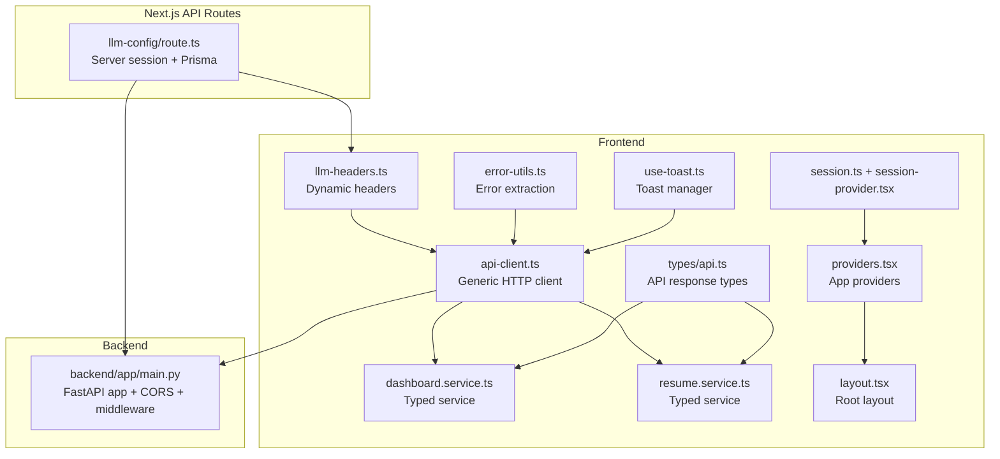
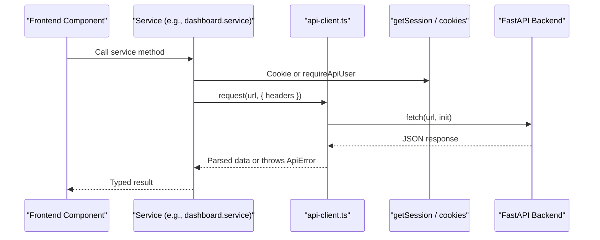
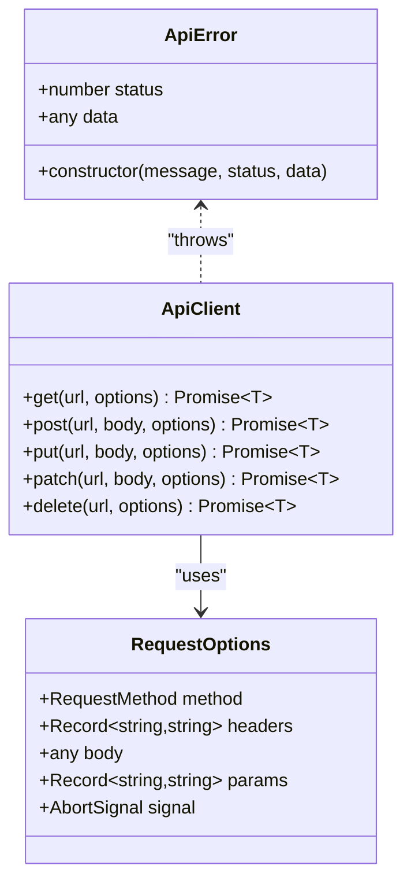
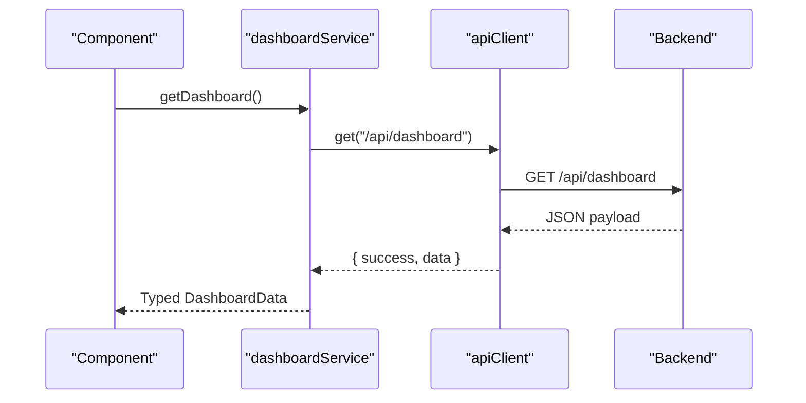
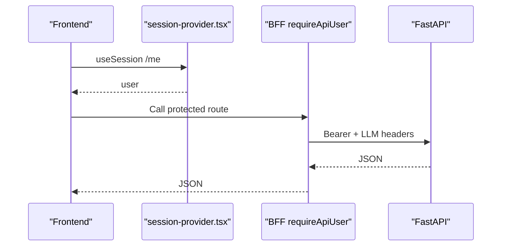
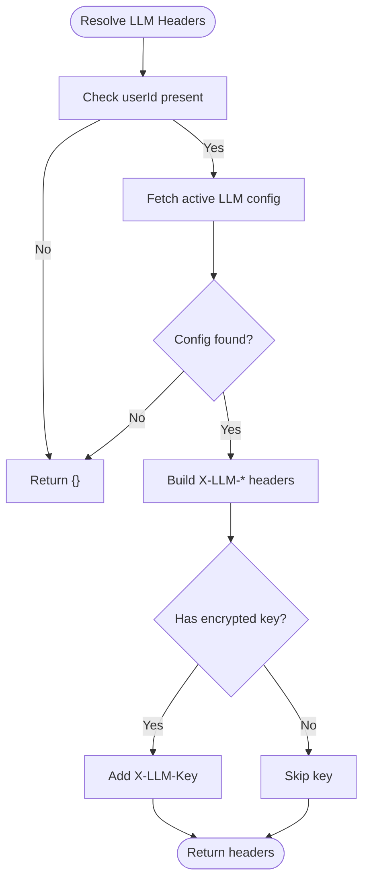
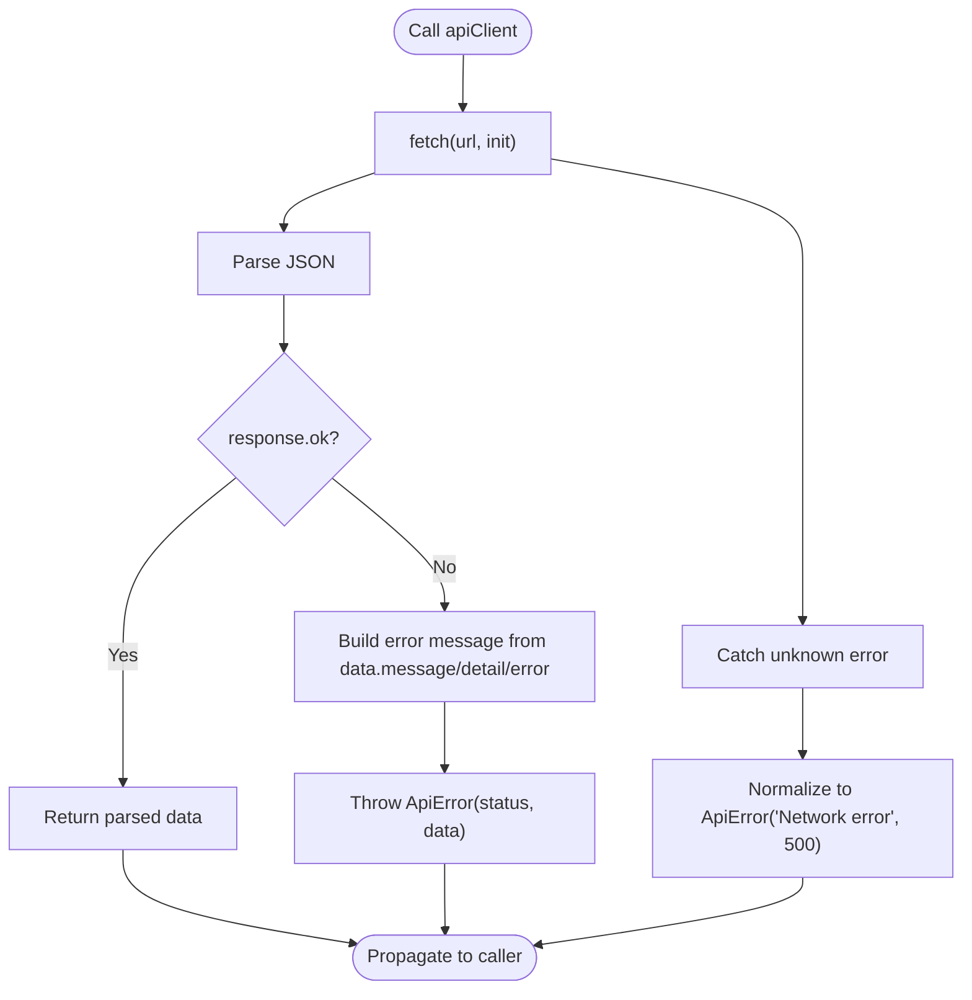
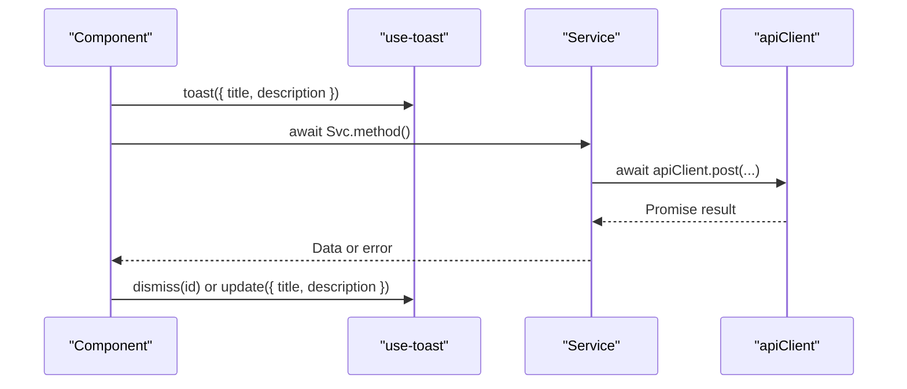
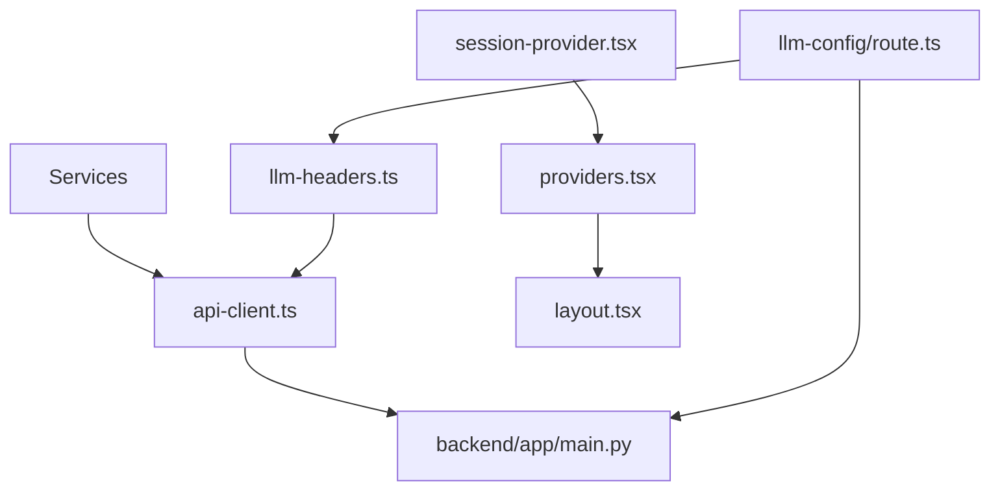

# API client libraries

Frontend HTTP client, typed feature services, auth headers, and error handling against the FastAPI backend.

## Repository layout
The client layer spans the frontend services and Next.js API routes that proxy to the backend, along with authentication and error-handling utilities. The backend exposes REST endpoints under versioned prefixes.

```mermaid
graph TB
subgraph "Frontend"
AC["api-client.ts<br/>Generic HTTP client"]
DS["dashboard.service.ts<br/>Typed service"]
RS["resume.service.ts<br/>Typed service"]
LH["llm-headers.ts<br/>Dynamic headers"]
AU["session.ts + session-provider.tsx"]
EU["error-utils.ts<br/>Error extraction"]
AT["types/api.ts<br/>API response types"]
PR["providers.tsx<br/>App providers"]
LT["layout.tsx<br/>Root layout"]
UT["use-toast.ts<br/>Toast manager"]
end
subgraph "Next.js API Routes"
LR["llm-config/route.ts<br/>Server session + Prisma"]
end
subgraph "Backend"
BM["backend/app/main.py<br/>FastAPI app + CORS + middleware"]
end
AC --> DS
AC --> RS
LH --> AC
AU --> PR
PR --> LT
LR --> LH
AC --> BM
LR --> BM
EU --> AC
AT --> DS
AT --> RS
UT --> AC
```

## Building blocks
- Generic HTTP client with typed requests and clear error handling
- Typed service layer wrapping endpoints for specific features
- Authentication via FastAPI cookies and `getSession()` / `useSession()`
- Dynamic LLM provider headers resolved per user
- Shared error extraction utility
- API response typing for consistent frontend contracts
- Toast-based loading and error notifications

Code to read:

- Generic client and error types: `api-client.ts`
- Service exports and usage: `index.ts`
- Dashboard service example: `dashboard.service.ts`
- Resume service example: `resume.service.ts`
- LLM headers resolution: `llm-headers.ts`
- Session helpers: `lib/session.ts`, `session-provider.tsx`
- Error extraction utility: `error-utils.ts`
- API response types: `api.ts`
- Toast manager: `use-toast.ts`

## How it fits together
The frontend talks to BFF routes through `api-client.ts`. Services return typed payloads. Browser cookies stay on same-origin `/api/v1`. BFF-to-FastAPI calls add a minted Bearer plus `X-LLM-*` from `llm-headers.ts`.

```mermaid
sequenceDiagram
participant UI as "Frontend Component"
participant SVC as "Service (e.g., dashboard.service)"
participant CL as "api-client.ts"
participant AUTH as "getSession / cookies"
participant BE as "FastAPI Backend"
UI->>SVC : Call service method
SVC->>AUTH : Cookie or requireApiUser
SVC->>CL : request(url, { headers })
CL->>BE : fetch(url, init)
BE-->>CL : JSON response
CL-->>SVC : Parsed data or throws ApiError
SVC-->>UI : Typed result
```

## Generic HTTP client
The generic client wraps fetch :
- Method helpers: get, post, put, patch, delete
- Automatic JSON serialization for non-FormData bodies
- Query string building from params
- Reliable error handling via ApiError
- Network error normalization

```mermaid
classDiagram
class ApiError {
+number status
+any data
+constructor(message, status, data)
}
class RequestOptions {
+RequestMethod method
+Record~string,string~ headers
+any body
+Record~string,string~ params
+AbortSignal signal
}
class ApiClient {
+get<T>(url, options) Promise~T~
+post<T>(url, body, options) Promise~T~
+put<T>(url, body, options) Promise~T~
+patch<T>(url, body, options) Promise~T~
+delete<T>(url, options) Promise~T~
}
ApiClient --> RequestOptions : "uses"
ApiError <.. ApiClient : "throws"
```

## Typed service layer
Services encapsulate endpoint logic and return typed responses. Examples:
- Dashboard service: retrieves dashboard data
- Resume service: CRUD and analysis operations for resumes

```mermaid
sequenceDiagram
participant Comp as "Component"
participant DashSvc as "dashboardService"
participant Api as "apiClient"
participant BE as "Backend"
Comp->>DashSvc : getDashboard()
DashSvc->>Api : get("/api/dashboard")
Api->>BE : GET /api/dashboard
BE-->>Api : JSON payload
Api-->>DashSvc : { success, data }
DashSvc-->>Comp : Typed DashboardData
```

## Authentication and session management

Google OAuth on FastAPI. NextAuth is gone. Protected BFF routes call `requireApiUser()`. They mint a backend access JWT when proxying.

```mermaid
sequenceDiagram
participant FE as "Frontend"
participant SP as "session-provider.tsx"
participant SRV as "BFF requireApiUser"
participant BE as "FastAPI"
FE->>SP : useSession /me
SP-->>FE : user
FE->>SRV : Call protected route
SRV->>BE : Bearer + LLM headers
BE-->>SRV : JSON
SRV-->>FE : JSON
```

## Dynamic LLM headers
The LLM headers utility resolves provider, model, and optional API key for a given user and injects them into requests. This enables per-user routing to external LLM providers.

```mermaid
flowchart TD
Start(["Resolve LLM Headers"]) --> CheckUserId["Check userId present"]
CheckUserId --> |No| ReturnEmpty["Return {}"]
CheckUserId --> |Yes| FetchConfig["Fetch active LLM config"]
FetchConfig --> Found{"Config found?"}
Found --> |No| ReturnEmpty
Found --> |Yes| BuildHeaders["Build X-LLM-* headers"]
BuildHeaders --> Decrypt{"Has encrypted key?"}
Decrypt --> |Yes| AddKey["Add X-LLM-Key"]
Decrypt --> |No| SkipKey["Skip key"]
AddKey --> Done(["Return headers"])
SkipKey --> Done
```

## Error handling strategies
The generic client normalizes network and server errors into ApiError instances. A shared utility extracts human-readable messages from thrown values. Components should catch ApiError and display messages.

```mermaid
flowchart TD
Enter(["Call apiClient"]) --> TryFetch["fetch(url, init)"]
TryFetch --> Parse["Parse JSON"]
Parse --> Ok{"response.ok?"}
Ok --> |Yes| ReturnData["Return parsed data"]
Ok --> |No| BuildMsg["Build error message from data.message/detail/error"]
BuildMsg --> ThrowErr["Throw ApiError(status, data)"]
TryFetch --> CatchUnknown["Catch unknown error"]
CatchUnknown --> Normalize["Normalize to ApiError('Network error', 500)"]
ThrowErr --> Exit(["Propagate to caller"])
Normalize --> Exit
ReturnData --> Exit
```

## Loading state management
The toast manager is a small imperative helper to surface loading and error notifications. Components can trigger toasts while awaiting API responses and dismiss them upon completion.

```mermaid
sequenceDiagram
participant Comp as "Component"
participant Toast as "use-toast"
participant Svc as "Service"
participant Api as "apiClient"
Comp->>Toast : toast({ title, description })
Comp->>Svc : await Svc.method()
Svc->>Api : await apiClient.post(...)
Api-->>Svc : Promise result
Svc-->>Comp : Data or error
Comp->>Toast : dismiss(id) or update({ title, description })
```

## Request/Response processing and endpoint consumption
- Query parameters are appended via URLSearchParams
- Non-FormData bodies are serialized to JSON
- Responses are parsed and returned; non-OK responses raise ApiError
- Typed services wrap endpoints and return ApiResponse<T>

References:
- `api-client.ts`
- `api.ts`

## Backend integration approaches
- Frontend calls Next.js API routes that validate sessions and interact with Prisma
- Backend FastAPI app defines CORS and request/response logging middleware
- Routes are grouped under versioned prefixes (/api/v1, /api/v2)

References:
- `route.ts`
- `main.py`

## Async/Await patterns and error propagation
- All service methods are async and await apiClient methods
- ApiError carries HTTP status and raw payload for granular handling
- Components should handle ApiError and use the toast manager for UX

References:
- `dashboard.service.ts`
- `resume.service.ts`
- `api-client.ts`

## Extending client functionality
- Add custom headers: pass additional headers in RequestOptions; the client merges them
- Add new endpoints: define a new service method returning apiClient.get/post/etc.
- Extend error handling: catch ApiError in components and branch on status/data

References:
- `api-client.ts`
- `index.ts`

## Adding custom headers
- For LLM routing, use the LLM headers utility to inject provider/model/key
- For other needs, pass headers in RequestOptions when calling apiClient methods

References:
- `llm-headers.ts`
- `api-client.ts`

## Implementing custom error handling
- Use the shared error extraction utility to derive messages
- In components, catch ApiError and decide whether to show a toast or redirect

References:
- `error-utils.ts`

## Client-Side caching strategies
- No explicit caching is implemented in the client. Consider integrating a caching layer (e.g., in-memory cache keyed by URL+params) to reduce redundant requests for identical queries.
- For immutable resources, cache responses keyed by endpoint and parameters; invalidate on mutations.

[No sources needed since this section provides general guidance]

## Retry mechanisms
- No built-in retry logic exists in the client. Implement retries with exponential backoff for transient failures (e.g., network errors, 5xx).
- Respect AbortSignal to cancel ongoing requests during unmount or rapid successive calls.

[No sources needed since this section provides general guidance]

## Timeout handling
- Use AbortSignal to enforce timeouts. Pass a signal with a timeout to apiClient methods and handle AbortError appropriately.

[No sources needed since this section provides general guidance]

## Rate limiting
- No explicit rate limiting is enforced in the client. Implement client-side throttling or queueing for high-frequency operations.
- Observe server-side rate limits and back off on 429 responses.

[No sources needed since this section provides general guidance]

## Bulk operations
- Design batch endpoints on the backend and expose them via Next.js routes. On the frontend, split large lists into chunks and process sequentially or in controlled concurrency.

[No sources needed since this section provides general guidance]

## Streaming response handling
- The current client parses entire JSON responses. For streaming responses, consider using a streaming parser or backend changes to support chunked responses.

[No sources needed since this section provides general guidance]

## Dependencies
Frontend services depend on `api-client.ts`. BFF routes depend on `getSession()` and Prisma for user-owned rows (payments, LLM config). FastAPI owns OAuth and `/api/v1/auth`.

```mermaid
graph TB
SVC["Services"] --> AC["api-client.ts"]
LH["llm-headers.ts"] --> AC
AUTH["session-provider.tsx"] --> PR["providers.tsx"]
PR --> LT["layout.tsx"]
LR["llm-config/route.ts"] --> LH
AC --> BE["backend/app/main.py"]
LR --> BE
```

## Performance
- Minimize unnecessary re-fetches by caching responses and invalidating on mutation
- Use AbortSignal to cancel stale requests
- Batch frequent updates and debounce user-triggered actions
- Prefer incremental loading for large datasets
- Avoid blocking UI on long-running operations; use toasts and optimistic updates where appropriate

[No sources needed since this section provides general guidance]

## Troubleshooting
Common issues:

- Unauthorized access: verify `ts_access_token` and `requireApiUser()`
- Network errors: Inspect AbortError and avoid aborting signals early
- Unexpected server errors: Log ApiError.status and ApiError.data for debugging
- Message parsing: Use the shared error extraction utility to normalize messages

References:
- `api-client.ts`
- `error-utils.ts`

## Appendix

### API endpoint consumption examples
- GET dashboard data: `dashboard.service.ts`
- Upload resume (multipart/form-data): `resume.service.ts`
- Delete resume with query param: `resume.service.ts`

### Authentication flows
- Google OAuth and cookies: `backend/app/routes/auth.py`, `frontend/lib/session.ts`
- Protected BFF route: `requireApiUser()` in `lib/api-auth.ts`

### Data processing workflows
- Resume analysis pipeline (upload → analysis → update): `resume.service.ts`
