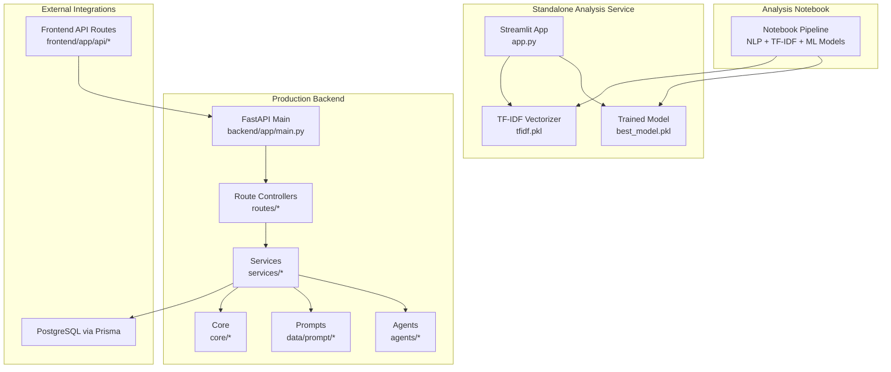
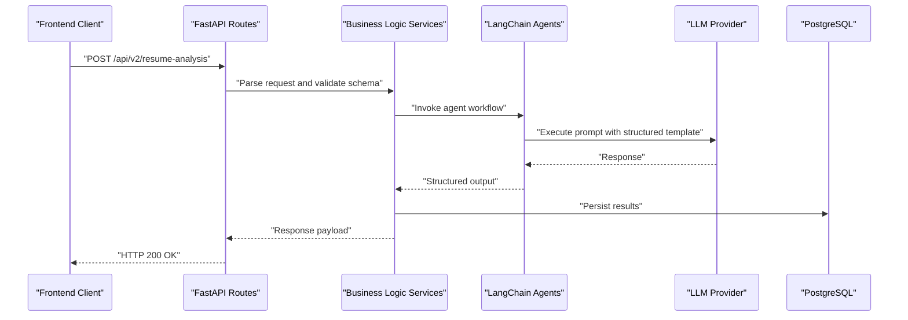
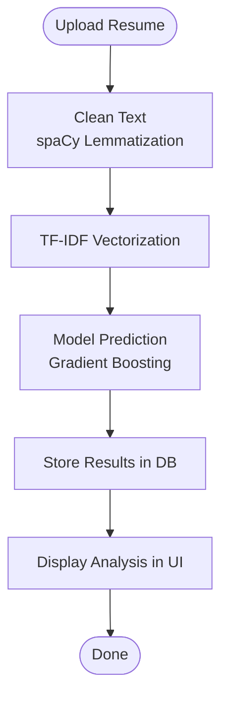
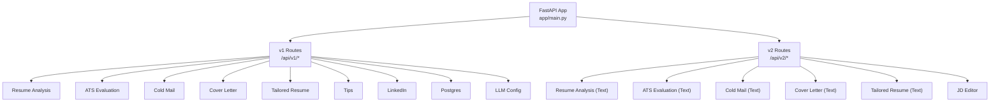
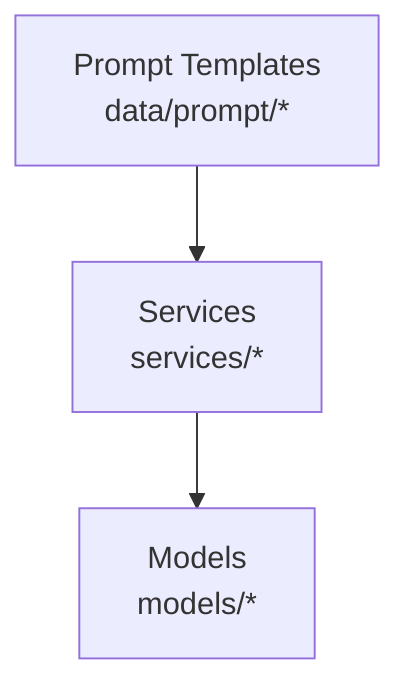
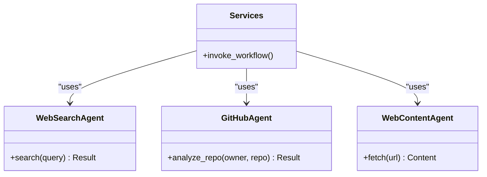
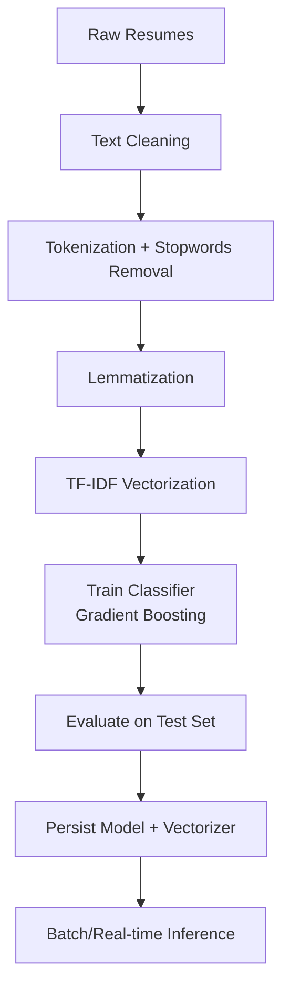
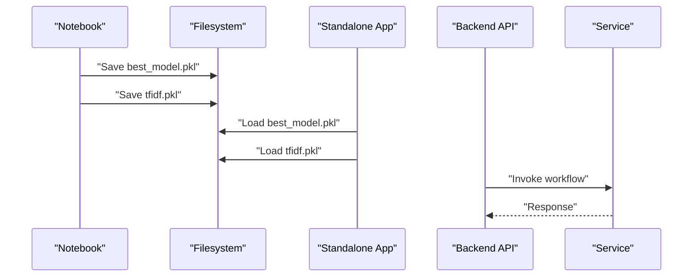
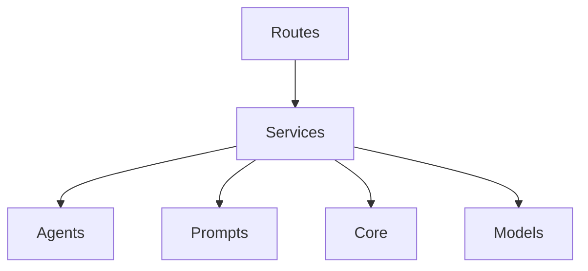

# AI/ML Architecture

<cite>
**Referenced Files in This Document**
- [Resume Analyser.ipynb](file://analysis/Resume%20Analyser.ipynb)
- [app.py](file://analysis/app.py)
- [best_model.pkl](file://analysis/best_model.pkl)
- [tfidf.pkl](file://analysis/tfidf.pkl)
- [main.py](file://backend/main.py)
- [app/main.py](file://backend/app/main.py)
- [AGENTS.md](file://AGENTS.md)
- [github_agent.py](file://backend/app/agents/github_agent.py)
- [web_content_agent.py](file://backend/app/agents/web_content_agent.py)
- [websearch_agent.py](file://backend/app/agents/websearch_agent.py)
</cite>

## Table of Contents
1. [Introduction](#introduction)
2. [Project Structure](#project-structure)
3. [Core Components](#core-components)
4. [Architecture Overview](#architecture-overview)
5. [Detailed Component Analysis](#detailed-component-analysis)
6. [Dependency Analysis](#dependency-analysis)
7. [Performance Considerations](#performance-considerations)
8. [Troubleshooting Guide](#troubleshooting-guide)
9. [Conclusion](#conclusion)

## Introduction
This document describes the AI/ML integration architecture for the TalentSync project, focusing on the hybrid approach that combines a standalone analysis service with LangChain-based workflows in the backend. It documents the machine learning pipeline for NLP processing, skill extraction, and career path prediction, along with the prompt engineering framework, agent-based workflows, and multi-model architecture. It also explains the integration between the analysis notebook, trained models, and production API endpoints, and addresses the separation between batch processing and real-time inference, model versioning, and performance optimization strategies. Finally, it covers the Qoder agent framework and its role in orchestrating AI workflows.

## Project Structure
The AI/ML architecture spans two primary environments:
- Standalone analysis service: A Streamlit-based application that loads pre-trained models and performs inference on uploaded resumes.
- Production backend: A FastAPI application exposing REST endpoints that integrate with LangChain-based workflows and agents.

**Diagram sources**
- [app.py](file://analysis/app.py#L1-L347)
- [best_model.pkl](file://analysis/best_model.pkl#L1-L234)
- [tfidf.pkl](file://analysis/tfidf.pkl#L1-L234)
- [app/main.py](file://backend/app/main.py#L1-L203)
- [main.py](file://backend/main.py#L1-L10)

**Section sources**
- [app.py](file://analysis/app.py#L1-L347)
- [best_model.pkl](file://analysis/best_model.pkl#L1-L234)
- [tfidf.pkl](file://analysis/tfidf.pkl#L1-L234)
- [app/main.py](file://backend/app/main.py#L1-L203)
- [main.py](file://backend/main.py#L1-L10)

## Core Components
- Standalone analysis service: Loads a trained gradient boosting classifier and a fitted TF-IDF vectorizer to predict candidate categories from resumes. It supports single-file and ZIP-based batch processing and writes results to a MySQL-compatible database.
- Production backend: Exposes REST endpoints for resume analysis, ATS evaluation, cold mail generation, cover letter generation, and tailored resume creation. It integrates LangChain-based workflows and agents for complex reasoning and orchestration.
- Prompt engineering framework: Centralized prompt templates under data/prompt/* for consistent instruction formatting across workflows.
- Agent framework: Specialized agents (web search, GitHub, content retrieval) that can be orchestrated by services to augment AI workflows.
- Model artifacts: Persisted model and vectorizer artifacts for inference in both analysis and production contexts.

Key implementation references:
- Standalone inference pipeline and model persistence
- Production API routing and middleware
- Agent definitions and usage patterns

**Section sources**
- [app.py](file://analysis/app.py#L1-L347)
- [best_model.pkl](file://analysis/best_model.pkl#L1-L234)
- [tfidf.pkl](file://analysis/tfidf.pkl#L1-L234)
- [app/main.py](file://backend/app/main.py#L1-L203)
- [AGENTS.md](file://AGENTS.md#L129-L137)

## Architecture Overview
The system employs a hybrid architecture:
- Batch processing: The analysis notebook trains and evaluates models offline, generating artifacts consumed by the standalone service.
- Real-time inference: The standalone service performs on-demand inference on uploaded resumes and stores results.
- Production workflows: The backend exposes endpoints that delegate complex tasks to LangChain-based services and agents, enabling dynamic prompt engineering and multi-step reasoning.

**Diagram sources**
- [app/main.py](file://backend/app/main.py#L157-L203)
- [AGENTS.md](file://AGENTS.md#L129-L137)

## Detailed Component Analysis

### Standalone Analysis Service
The standalone service encapsulates:
- Text preprocessing: Cleaning, lemmatization, and stopword removal using spaCy and NLTK.
- Feature extraction: TF-IDF vectorization applied to cleaned text.
- Prediction: Gradient boosting classifier predicts candidate categories.
- Output: Writes structured results to a database table and displays them via Streamlit.

**Diagram sources**
- [app.py](file://analysis/app.py#L21-L134)

**Section sources**
- [app.py](file://analysis/app.py#L1-L347)
- [best_model.pkl](file://analysis/best_model.pkl#L1-L234)
- [tfidf.pkl](file://analysis/tfidf.pkl#L1-L234)

### Production API Endpoints and Routing
The backend defines a comprehensive set of routes organized by feature domains:
- v1 and v2 endpoints for resume analysis, ATS evaluation, cold mail, cover letter, tailored resume, JD editor, and interview workflows.
- Middleware for request/response logging and request ID correlation.
- CORS configuration for frontend-backend integration.

**Diagram sources**
- [app/main.py](file://backend/app/main.py#L157-L203)

**Section sources**
- [app/main.py](file://backend/app/main.py#L1-L203)

### Prompt Engineering Framework
The prompt engineering framework centralizes instructions and templates:
- Located under data/prompt/* for each domain (ATS analysis, cold mail, interview evaluator, etc.).
- Services import and format prompts consistently, enabling iterative improvements without code changes.

**Diagram sources**
- [AGENTS.md](file://AGENTS.md#L121-L124)

**Section sources**
- [AGENTS.md](file://AGENTS.md#L121-L124)

### Agent-Based Workflows
The agent framework provides reusable capabilities:
- Web search agent for external information retrieval.
- GitHub agent for repository and code analysis.
- Web content agent for fetching and processing online content.

These agents can be invoked by services to augment workflows with external data and reasoning.

**Diagram sources**
- [websearch_agent.py](file://backend/app/agents/websearch_agent.py)
- [github_agent.py](file://backend/app/agents/github_agent.py)
- [web_content_agent.py](file://backend/app/agents/web_content_agent.py)

**Section sources**
- [AGENTS.md](file://AGENTS.md#L129-L137)
- [websearch_agent.py](file://backend/app/agents/websearch_agent.py)
- [github_agent.py](file://backend/app/agents/github_agent.py)
- [web_content_agent.py](file://backend/app/agents/web_content_agent.py)

### Machine Learning Pipeline
The ML pipeline comprises:
- Data preparation: Cleaning and normalization of resume text.
- Feature extraction: TF-IDF vectorization.
- Model training: Gradient boosting classifier with hyperparameter tuning.
- Persistence: Saved model and vectorizer artifacts for inference.

**Diagram sources**
- [Resume Analyser.ipynb](file://analysis/Resume%20Analyser.ipynb#L1-L962)
- [app.py](file://analysis/app.py#L18-L19)

**Section sources**
- [Resume Analyser.ipynb](file://analysis/Resume%20Analyser.ipynb#L1-L962)
- [app.py](file://analysis/app.py#L18-L19)

### Integration Between Analysis Notebook, Models, and Production API
- The notebook trains and persists the model and vectorizer.
- The standalone service loads these artifacts for inference.
- The production backend routes requests to services that may leverage LangChain agents and prompts for richer workflows.

**Diagram sources**
- [Resume Analyser.ipynb](file://analysis/Resume%20Analyser.ipynb#L1-L962)
- [best_model.pkl](file://analysis/best_model.pkl#L1-L234)
- [tfidf.pkl](file://analysis/tfidf.pkl#L1-L234)
- [app.py](file://analysis/app.py#L18-L19)
- [app/main.py](file://backend/app/main.py#L157-L203)

**Section sources**
- [Resume Analyser.ipynb](file://analysis/Resume%20Analyser.ipynb#L1-L962)
- [best_model.pkl](file://analysis/best_model.pkl#L1-L234)
- [tfidf.pkl](file://analysis/tfidf.pkl#L1-L234)
- [app.py](file://analysis/app.py#L18-L19)
- [app/main.py](file://backend/app/main.py#L157-L203)

## Dependency Analysis
The backend architecture enforces clear separation of concerns:
- Routes depend on services for business logic.
- Services depend on agents, prompts, and core infrastructure.
- Core provides LLM configuration, encryption, logging, and settings.
- Data/prompt contains centralized prompt templates.
- Agents encapsulate specialized capabilities.

**Diagram sources**
- [app/main.py](file://backend/app/main.py#L157-L203)
- [AGENTS.md](file://AGENTS.md#L125-L137)

**Section sources**
- [app/main.py](file://backend/app/main.py#L1-L203)
- [AGENTS.md](file://AGENTS.md#L125-L137)

## Performance Considerations
- Batch vs. real-time inference: The analysis notebook and standalone service are suited for batch processing; the backend focuses on real-time inference via LangChain workflows.
- Model artifacts: Persisted models and vectorizers enable fast inference without retraining overhead.
- Prompt caching: Centralized prompt templates reduce repeated computation and improve consistency.
- Middleware logging: Structured request/response logging aids in performance monitoring and debugging.
- Asynchronous design: The backend leverages async-first patterns for I/O-bound operations.

[No sources needed since this section provides general guidance]

## Troubleshooting Guide
Common issues and resolutions:
- Model loading errors: Verify persisted model and vectorizer paths and ensure correct serialization format.
- Prompt formatting problems: Confirm prompt templates exist and are properly imported by services.
- Agent invocation failures: Validate agent availability and required credentials or environment variables.
- CORS and middleware: Ensure CORS origins and middleware are configured correctly for frontend-backend communication.
- Database connectivity: Confirm database credentials and connection parameters for result storage.

**Section sources**
- [app.py](file://analysis/app.py#L163-L344)
- [app/main.py](file://backend/app/main.py#L148-L154)
- [AGENTS.md](file://AGENTS.md#L129-L137)

## Conclusion
The AI/ML architecture combines a robust standalone analysis service with a scalable production backend that leverages LangChain-based workflows and agents. The hybrid approach enables batch processing for model training and real-time inference for user-facing features. Centralized prompt engineering and agent frameworks facilitate extensibility and maintainability, while model artifacts ensure efficient inference. The documented separation between batch and real-time processing, model versioning via persisted artifacts, and performance optimizations provides a solid foundation for continued growth and feature expansion.