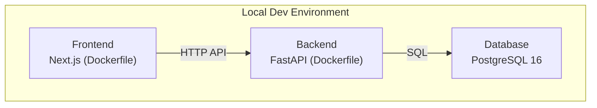
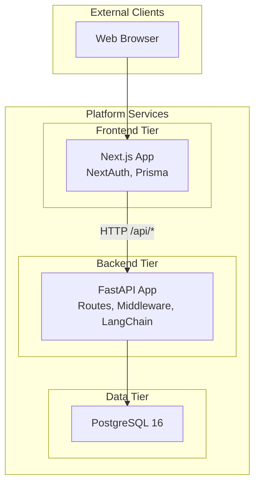
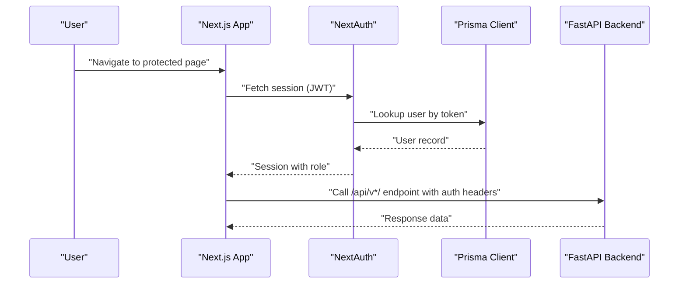
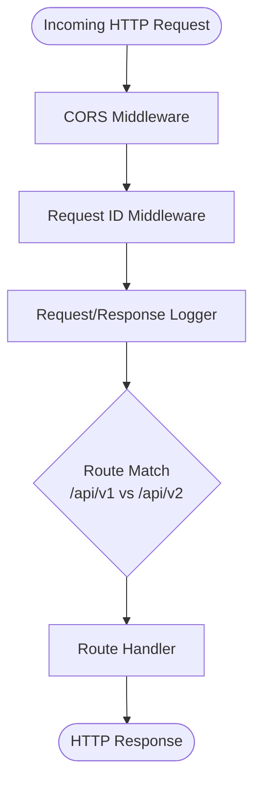
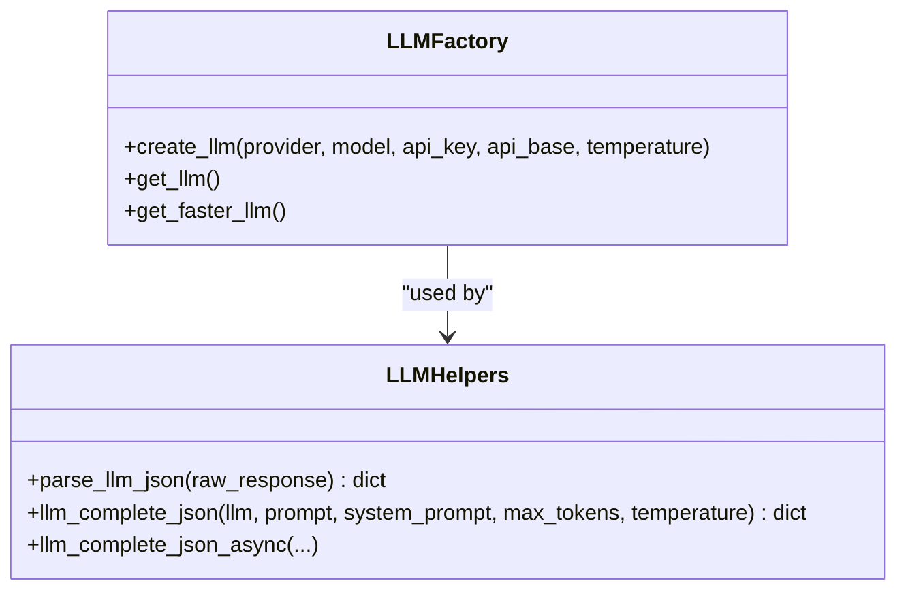
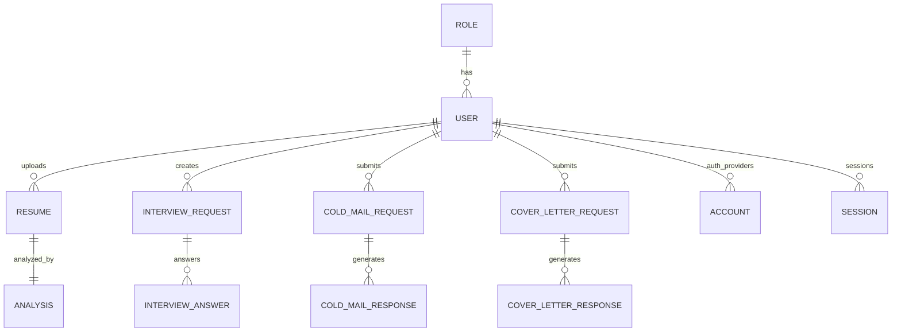
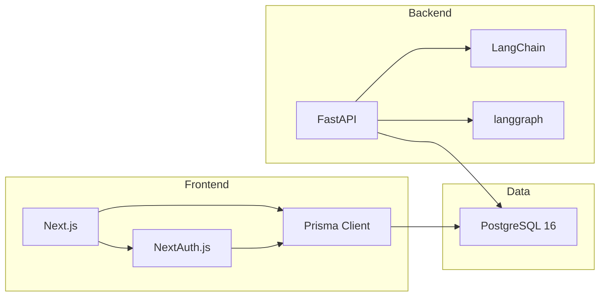
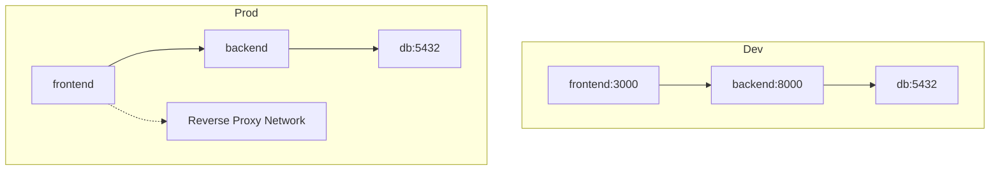

# Architecture Overview

<cite>
**Referenced Files in This Document**
- [readme.md](file://readme.md)
- [docker-compose.yaml](file://docker-compose.yaml)
- [docker-compose.prod.yaml](file://docker-compose.prod.yaml)
- [backend/app/main.py](file://backend/app/main.py)
- [backend/pyproject.toml](file://backend/pyproject.toml)
- [backend/Dockerfile](file://backend/Dockerfile)
- [backend/app/core/llm.py](file://backend/app/core/llm.py)
- [backend/app/services/llm_helpers.py](file://backend/app/services/llm_helpers.py)
- [frontend/package.json](file://frontend/package.json)
- [frontend/Dockerfile](file://frontend/Dockerfile)
- [frontend/next.config.js](file://frontend/next.config.js)
- [frontend/lib/auth-options.ts](file://frontend/lib/auth-options.ts)
- [frontend/prisma/schema.prisma](file://frontend/prisma/schema.prisma)
- [backend/.env](file://backend/.env)
</cite>

## Table of Contents
1. [Introduction](#introduction)
2. [Project Structure](#project-structure)
3. [Core Components](#core-components)
4. [Architecture Overview](#architecture-overview)
5. [Detailed Component Analysis](#detailed-component-analysis)
6. [Dependency Analysis](#dependency-analysis)
7. [Performance Considerations](#performance-considerations)
8. [Troubleshooting Guide](#troubleshooting-guide)
9. [Conclusion](#conclusion)
10. [Appendices](#appendices)

## Introduction
This document presents the architectural overview of the TalentSync-Normies microservices platform. The system integrates a modern frontend built with Next.js, a high-performance backend powered by FastAPI, a LangChain-based AI/ML orchestration service, and a PostgreSQL database. It is containerized with Docker and orchestrated via Docker Compose for development and production deployments. The architecture emphasizes scalability, maintainability, and cloud readiness with AWS as the target platform.

## Project Structure
The repository is organized into three primary areas:
- Frontend: Next.js application with TypeScript, Prisma ORM, and PWA support
- Backend: FastAPI microservice implementing route-based APIs and LangChain integrations
- Infrastructure: Docker Compose configurations for local and production environments

**Diagram sources**
- [docker-compose.yaml](file://docker-compose.yaml#L1-L78)

**Section sources**
- [docker-compose.yaml](file://docker-compose.yaml#L1-L78)
- [frontend/Dockerfile](file://frontend/Dockerfile#L1-L110)
- [backend/Dockerfile](file://backend/Dockerfile#L1-L33)

## Core Components
- Frontend (Next.js)
  - Built with React and TypeScript, styled with Tailwind CSS
  - Authentication via NextAuth.js with multiple providers (OAuth, credentials, email)
  - ORM via Prisma targeting PostgreSQL
  - PWA enabled for offline-capable experiences
- Backend (FastAPI)
  - Microservice exposing REST endpoints under /api/v1 and /api/v2
  - Centralized middleware for CORS, request ID tracing, and request/response logging
  - LangChain integration for AI/ML workflows and LLM orchestration
  - Containerized with Python 3.13 slim image
- AI/ML Service (LangChain)
  - Provider-agnostic LLM factory supporting OpenAI, Anthropic, Google Gemini, Ollama, OpenRouter, and DeepSeek
  - JSON parsing helpers for structured LLM outputs
- Database (PostgreSQL)
  - Prisma schema defines core entities: User, Role, Resume, Analysis, Interview, and related request/response entities
  - Migrations managed via Prisma CLI

**Section sources**
- [frontend/package.json](file://frontend/package.json#L1-L114)
- [frontend/lib/auth-options.ts](file://frontend/lib/auth-options.ts#L1-L202)
- [frontend/prisma/schema.prisma](file://frontend/prisma/schema.prisma#L1-L262)
- [backend/app/main.py](file://backend/app/main.py#L1-L203)
- [backend/app/core/llm.py](file://backend/app/core/llm.py#L1-L181)
- [backend/app/services/llm_helpers.py](file://backend/app/services/llm_helpers.py#L1-L94)
- [backend/Dockerfile](file://backend/Dockerfile#L1-L33)
- [frontend/Dockerfile](file://frontend/Dockerfile#L1-L110)

## Architecture Overview
The system follows a classic three-tier pattern with clear separation of concerns:
- Presentation Layer: Next.js frontend serving dynamic UI and handling authentication
- Application Layer: FastAPI backend implementing business logic and integrating AI/ML
- Data Layer: PostgreSQL storing user profiles, resumes, analyses, and AI-generated artifacts

**Diagram sources**
- [frontend/lib/auth-options.ts](file://frontend/lib/auth-options.ts#L1-L202)
- [backend/app/main.py](file://backend/app/main.py#L157-L203)
- [frontend/prisma/schema.prisma](file://frontend/prisma/schema.prisma#L1-L262)

## Detailed Component Analysis

### Frontend (Next.js) Authentication and Routing
- Authentication
  - NextAuth.js configured with Prisma adapter and multiple providers (Google, GitHub, Email, Credentials)
  - Session strategy uses JWT; callbacks manage user roles, verification status, and profile synchronization
- Routing
  - App Router with dynamic routes under app/api for backend interface and db endpoints
  - PWA enabled via next-pwa plugin with service worker registration
- Database Integration
  - Prisma client connects to PostgreSQL using DATABASE_URL from environment
  - Migrations executed during container startup in development

**Diagram sources**
- [frontend/lib/auth-options.ts](file://frontend/lib/auth-options.ts#L10-L202)
- [frontend/prisma/schema.prisma](file://frontend/prisma/schema.prisma#L16-L41)
- [backend/app/main.py](file://backend/app/main.py#L157-L203)

**Section sources**
- [frontend/lib/auth-options.ts](file://frontend/lib/auth-options.ts#L1-L202)
- [frontend/next.config.js](file://frontend/next.config.js#L1-L90)
- [frontend/prisma/schema.prisma](file://frontend/prisma/schema.prisma#L1-L262)

### Backend (FastAPI) API Surface and Middleware
- API Versioning
  - v1 and v2 route sets expose features like resume analysis, ATS evaluation, cover letter generation, hiring assistant, and tailored resume creation
- Middleware
  - CORS enabled for configured origins
  - Request ID propagation and request/response logging with structured logs
- Containerization
  - Python 3.13 slim image, exposed on port 8000, served by uvicorn

**Diagram sources**
- [backend/app/main.py](file://backend/app/main.py#L71-L154)
- [backend/app/main.py](file://backend/app/main.py#L157-L203)

**Section sources**
- [backend/app/main.py](file://backend/app/main.py#L1-L203)
- [backend/Dockerfile](file://backend/Dockerfile#L1-L33)

### AI/ML Orchestration with LangChain
- LLM Factory
  - Provider-agnostic factory supports OpenAI, Anthropic, Google Gemini, Ollama, OpenRouter, and DeepSeek
  - Temperature handling varies by provider/model
- JSON Parsing Helpers
  - Robust extraction and parsing of structured JSON from LLM responses
- Configuration
  - Environment-driven provider selection and API keys

**Diagram sources**
- [backend/app/core/llm.py](file://backend/app/core/llm.py#L31-L107)
- [backend/app/core/llm.py](file://backend/app/core/llm.py#L148-L176)
- [backend/app/services/llm_helpers.py](file://backend/app/services/llm_helpers.py#L30-L94)

**Section sources**
- [backend/app/core/llm.py](file://backend/app/core/llm.py#L1-L181)
- [backend/app/services/llm_helpers.py](file://backend/app/services/llm_helpers.py#L1-L94)

### Database Schema and ORM
- Entities
  - Role, User, Resume, Analysis, InterviewRequest/Answer, Recruiter, tokens, and accounts/sessions
- Relationships
  - Users have roles and multiple related entities (resumes, interviews, requests)
  - Analysis is one-to-one with Resume
- Migrations
  - Prisma migrations executed at container startup in development

**Diagram sources**
- [frontend/prisma/schema.prisma](file://frontend/prisma/schema.prisma#L10-L262)

**Section sources**
- [frontend/prisma/schema.prisma](file://frontend/prisma/schema.prisma#L1-L262)

## Dependency Analysis
- Technology Stack Decisions
  - Frontend: Next.js for SSR/SSG, Prisma for ORM, NextAuth for auth, Tailwind for styling
  - Backend: FastAPI for performance and automatic OpenAPI docs, LangChain for AI/ML orchestration
  - Database: PostgreSQL for relational data persistence
  - Deployment: Docker with multi-stage builds for frontend and backend
- Third-Party Dependencies (selected)
  - Frontend: next, react, next-auth, @prisma/client, lucide-react, recharts, mermaid, posthog-js
  - Backend: fastapi, langchain, langchain-google-genai, langchain-openai, langchain-anthropic, cryptography, sse-starlette, httpx, numpy, langgraph, bs4, gitingest, tavily-python, pymupdf, pymupdf4llm
- Version Compatibility Matrix (selected)
  - Python: 3.13 (backend)
  - Bun: 1.x (frontend build/runtime)
  - Next.js: ^16.1.6
  - Prisma: ^6.19.2
  - PostgreSQL: 16 (image)

**Diagram sources**
- [frontend/package.json](file://frontend/package.json#L17-L85)
- [backend/pyproject.toml](file://backend/pyproject.toml#L7-L33)
- [docker-compose.yaml](file://docker-compose.yaml#L4-L17)

**Section sources**
- [frontend/package.json](file://frontend/package.json#L1-L114)
- [backend/pyproject.toml](file://backend/pyproject.toml#L1-L42)
- [docker-compose.yaml](file://docker-compose.yaml#L1-L78)

## Performance Considerations
- Container Images
  - Multi-stage Docker builds reduce image sizes and attack surface
  - Frontend uses slim base images for production runtime
- API Design
  - Structured logging and request ID propagation aid observability and debugging
- Database
  - Prisma schema includes indexes for common query patterns (e.g., Resume index on userId and isMaster)
- AI/ML
  - Separate faster LLM instance allows cost/performance tuning for lightweight tasks

[No sources needed since this section provides general guidance]

## Troubleshooting Guide
- Authentication Issues
  - Verify NEXTAUTH_URL and NEXTAUTH_SECRET in environment
  - Ensure EMAIL_* and OAuth credentials are set for Email and provider-based sign-in
- Database Connectivity
  - Confirm DATABASE_URL matches PostgreSQL service and schema
  - Run Prisma migrations before starting the frontend in development
- LLM Configuration
  - Ensure provider-specific API keys are present in environment
  - Check model availability and rate limits for selected provider
- Networking
  - In development, frontend exposes port 3000; backend listens on 8000
  - Production compose uses external network for reverse proxy integration

**Section sources**
- [backend/.env](file://backend/.env#L1-L26)
- [frontend/lib/auth-options.ts](file://frontend/lib/auth-options.ts#L57-L76)
- [docker-compose.yaml](file://docker-compose.yaml#L51-L68)
- [docker-compose.prod.yaml](file://docker-compose.prod.yaml#L77-L83)

## Conclusion
TalentSync-Normies employs a clean microservices architecture with a Next.js frontend, FastAPI backend, LangChain-powered AI/ML orchestration, and PostgreSQL for persistence. Docker and Docker Compose streamline local development and production deployments. The design balances developer productivity, scalability, and cloud readiness, with clear service boundaries and observable data flows.

[No sources needed since this section summarizes without analyzing specific files]

## Appendices

### Deployment Topology and Infrastructure
- Local Development
  - Docker Compose brings up db, backend, and frontend with shared network
  - Frontend publishes port 3000; backend on 8000
- Production
  - Multi-stage frontend build with separate migration stage
  - Health checks for PostgreSQL
  - External network integration for reverse proxy

**Diagram sources**
- [docker-compose.yaml](file://docker-compose.yaml#L1-L78)
- [docker-compose.prod.yaml](file://docker-compose.prod.yaml#L1-L105)

**Section sources**
- [docker-compose.yaml](file://docker-compose.yaml#L1-L78)
- [docker-compose.prod.yaml](file://docker-compose.prod.yaml#L1-L105)

### Cross-Cutting Concerns
- Authentication
  - NextAuth.js with Prisma adapter and multiple providers
- API Gateway and Load Balancing
  - Reverse proxy network integration in production compose
- Monitoring and Observability
  - Structured request/response logging in backend
  - PostHog instrumentation configured in frontend

**Section sources**
- [frontend/lib/auth-options.ts](file://frontend/lib/auth-options.ts#L1-L202)
- [backend/app/main.py](file://backend/app/main.py#L83-L131)
- [frontend/next.config.js](file://frontend/next.config.js#L1-L90)
- [docker-compose.prod.yaml](file://docker-compose.prod.yaml#L102-L105)