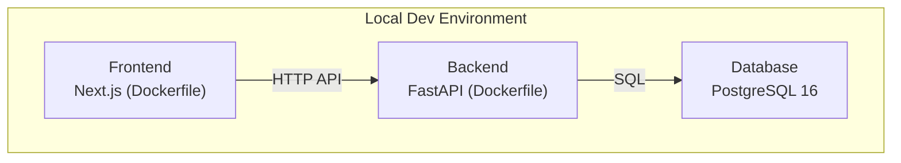
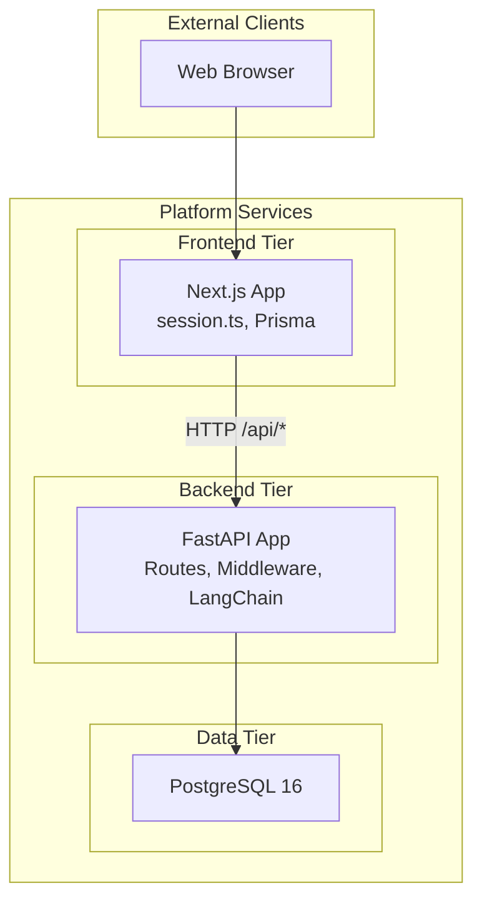
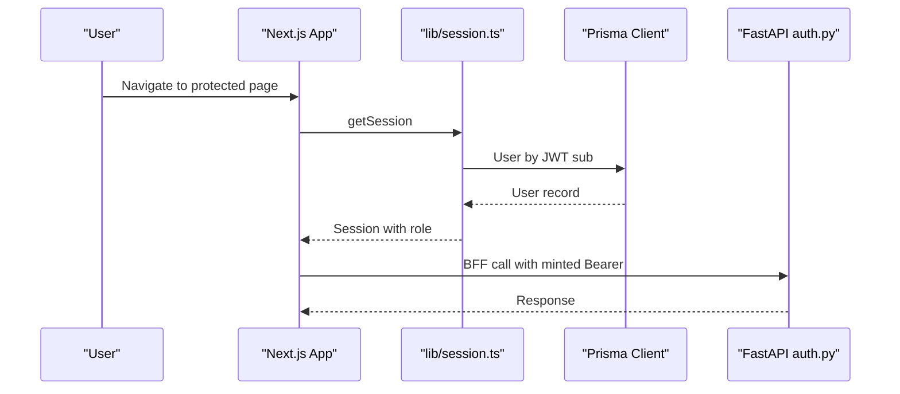
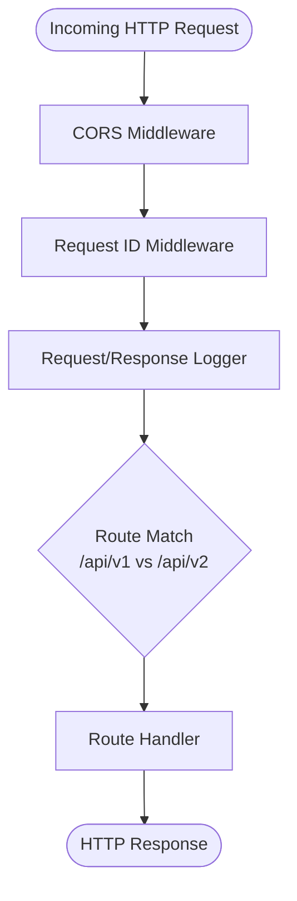
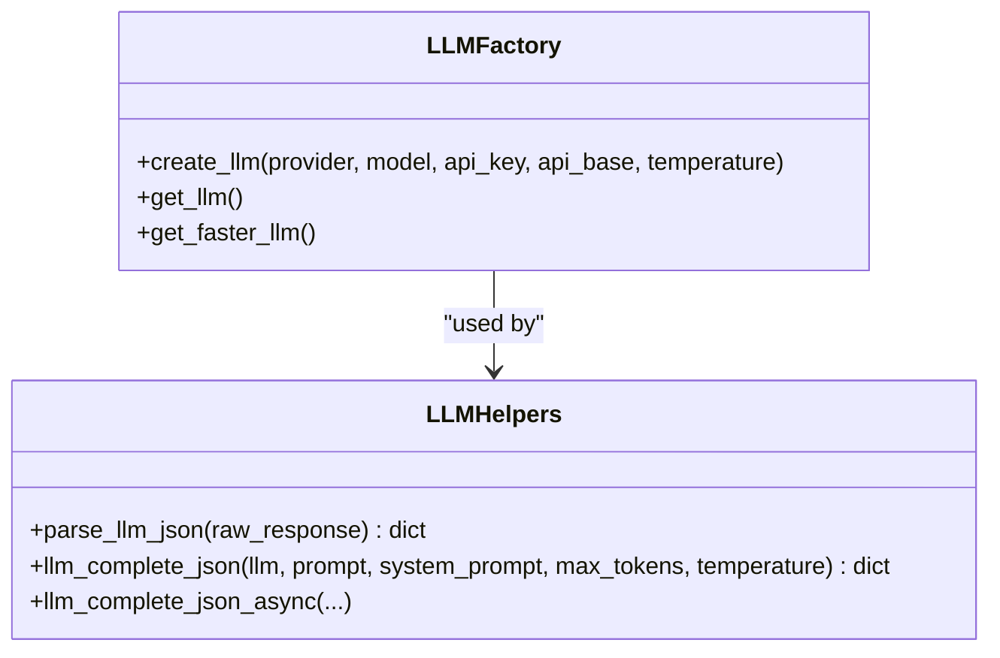
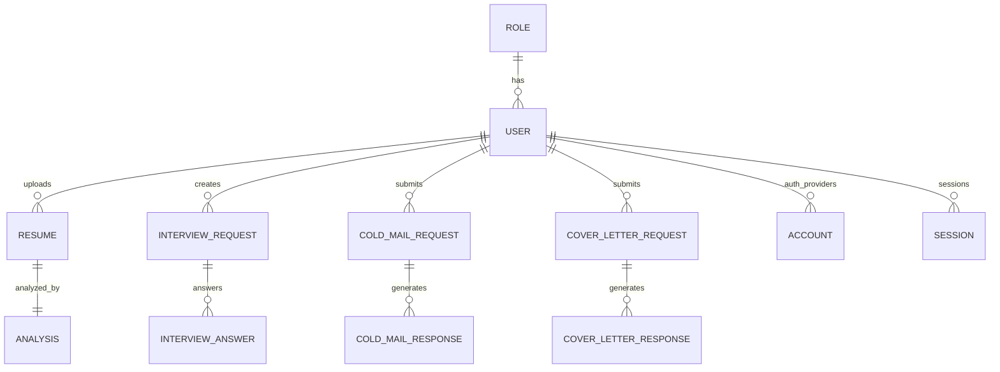
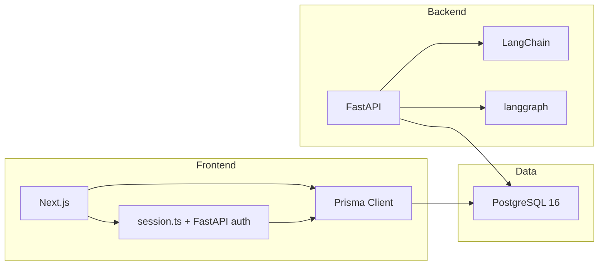
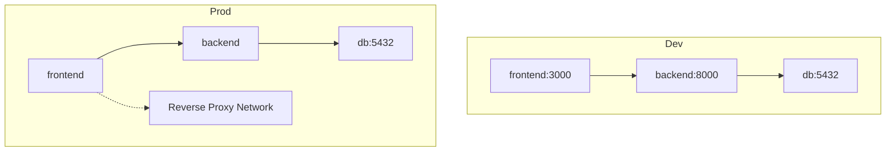

# Architecture overview

TalentSync runs as three Compose services: Next.js, FastAPI, and PostgreSQL.

- Frontend: Next.js application with TypeScript, Prisma ORM, and PWA support
- Backend: FastAPI microservice implementing route-based APIs and LangChain integrations
- Infrastructure: Docker Compose configurations for local and production environments

```mermaid
graph TB
subgraph "Local Dev Environment"
FE["Frontend<br/>Next.js (Dockerfile)"]
BE["Backend<br/>FastAPI (Dockerfile)"]
DB["Database<br/>PostgreSQL 16"]
end
FE --> |"HTTP API"| BE
BE --> |"SQL"| DB
```

## Building blocks
- Frontend (Next.js)
 - Built with React and TypeScript, styled with Tailwind CSS
 - Authentication via Google OAuth on FastAPI (`ts_access_token`). NextAuth is gone.
 - ORM via Prisma targeting PostgreSQL
 - PWA enabled for offline-capable experiences
- Backend (FastAPI)
 - Microservice exposing REST endpoints under /api/v1 and /api/v2
 - Centralized middleware for CORS, request ID tracing, and request/response logging
 - LangChain integration for AI/ML workflows and LLM orchestration
 - Containerized with Python 3.13 slim image
- AI/ML Service (LangChain)
 - Provider-agnostic LLM factory supporting OpenAI, Anthropic, Google Gemini, Ollama, OpenRouter, and DeepSeek
 - JSON parsing helpers for structured LLM outputs
- Database (PostgreSQL)
 - Prisma schema defines core entities: User, Role, Resume, Analysis, Interview, and related request/response entities
 - Migrations managed via Prisma CLI

## How it fits together
The system follows a classic three-tier pattern :
- Presentation Layer: Next.js frontend serving dynamic UI and handling authentication
- Application Layer: FastAPI backend implementing business logic and integrating AI/ML
- Data Layer: PostgreSQL storing user profiles, resumes, analyses, and AI-generated artifacts

```mermaid
graph TB
subgraph "External Clients"
Browser["Web Browser"]
end
subgraph "Platform Services"
subgraph "Frontend Tier"
Next["Next.js App<br/>session.ts, Prisma"]
end
subgraph "Backend Tier"
API["FastAPI App<br/>Routes, Middleware, LangChain"]
end
subgraph "Data Tier"
PG["PostgreSQL 16"]
end
end
Browser --> Next
Next --> |"HTTP /api/*"| API
API --> PG
```

## Frontend (Next.js) authentication and routing
- Authentication
 - Google OAuth on FastAPI. `getSession()` verifies `ts_access_token` with `BACKEND_JWT_SECRET` and loads Prisma `User`.
 - Client `useSession()` hits `/api/v1/auth/me`. NextAuth is gone.
- Routing
 - App Router. BFF under `app/api`. Rewrite `/api/v1/:path*` to FastAPI.
 - `proxy.ts` presence-checks the access cookie.
- Database Integration
 - Prisma client uses `DATABASE_URL` for `public`.
 - Backend Alembic owns `talentsync_backend`.

```mermaid
sequenceDiagram
participant U as "User"
participant FE as "Next.js App"
participant SESS as "lib/session.ts"
participant PR as "Prisma Client"
participant BE as "FastAPI auth.py"
U->>FE : Navigate to protected page
FE->>SESS : getSession
SESS->>PR : User by JWT sub
PR-->>SESS : User record
SESS-->>FE : Session with role
FE->>BE : BFF call with minted Bearer
BE-->>FE : Response
```

## Backend (FastAPI) API surface and middleware
- API Versioning
 - v1 and v2 route sets expose features like resume analysis, ATS evaluation, cover letter generation, hiring assistant, and tailored resume creation
- Middleware
 - CORS enabled for configured origins
 - Request ID propagation and request/response logging with structured logs
- Containerization
 - Python 3.13 slim image, exposed on port 8000, served by uvicorn

```mermaid
flowchart TD
Start(["Incoming HTTP Request"]) --> CORS["CORS Middleware"]
CORS --> ReqID["Request ID Middleware"]
ReqID --> Logging["Request/Response Logger"]
Logging --> RouterSel{"Route Match<br/>/api/v1 vs /api/v2"}
RouterSel --> Handler["Route Handler"]
Handler --> Response(["HTTP Response"])
```

## AI/ML orchestration with LangChain
- LLM Factory
 - Provider-agnostic factory supports OpenAI, Anthropic, Google Gemini, Ollama, OpenRouter, and DeepSeek
 - Temperature handling varies by provider/model
- JSON Parsing Helpers
 - Reliable extraction and parsing of structured JSON from LLM responses
- Configuration
 - Environment-driven provider selection and API keys

```mermaid
classDiagram
class LLMFactory {
+create_llm(provider, model, api_key, api_base, temperature)
+get_llm()
+get_faster_llm()
}
class LLMHelpers {
+parse_llm_json(raw_response) dict
+llm_complete_json(llm, prompt, system_prompt, max_tokens, temperature) dict
+llm_complete_json_async(...)
}
LLMFactory --> LLMHelpers : "used by"
```

## Database schema and ORM
- Entities
 - Role, User, Resume, Analysis, InterviewRequest/Answer, Recruiter, tokens, and accounts/sessions
- Relationships
 - Users have roles and multiple related entities (resumes, interviews, requests)
 - Analysis is one-to-one with Resume
- Migrations
 - Prisma migrations executed at container startup in development

```mermaid
erDiagram
ROLE ||--o{ USER : "has"
USER ||--o{ RESUME : "uploads"
RESUME ||--|| ANALYSIS : "analyzed_by"
USER ||--o{ INTERVIEW_REQUEST : "creates"
INTERVIEW_REQUEST ||--o{ INTERVIEW_ANSWER : "answers"
USER ||--o{ COLD_MAIL_REQUEST : "submits"
COLD_MAIL_REQUEST ||--o{ COLD_MAIL_RESPONSE : "generates"
USER ||--o{ COVER_LETTER_REQUEST : "submits"
COVER_LETTER_REQUEST ||--o{ COVER_LETTER_RESPONSE : "generates"
USER ||--o{ ACCOUNT : "auth_providers"
USER ||--o{ SESSION : "sessions"
```

## Dependencies
- Technology Stack Decisions
 - Frontend: Next.js, Prisma, FastAPI cookie session, Tailwind
 - Backend: FastAPI for performance and automatic OpenAPI docs, LangChain for AI/ML orchestration
 - Database: PostgreSQL for relational data persistence
 - Deployment: Docker with multi-stage builds for frontend and backend
- Third-Party Dependencies (selected)
 - Frontend: next, react, @prisma/client, jose, lucide-react, recharts, mermaid, posthog-js
 - Backend: fastapi, langchain, langchain-google-genai, langchain-openai, langchain-anthropic, cryptography, sse-starlette, httpx, numpy, langgraph, bs4, gitingest, tavily-python, pymupdf, pymupdf4llm
- Version Compatibility Matrix (selected)
 - Python: 3.13 (backend)
 - Bun: 1.x (frontend build/runtime)
 - Next.js: ^16.1.6
 - Prisma: ^6.19.2
 - PostgreSQL: 16 (image)

```mermaid
graph LR
subgraph "Frontend"
NJS["Next.js"]
NA["session.ts + FastAPI auth"]
PR["Prisma Client"]
end
subgraph "Backend"
FA["FastAPI"]
LC["LangChain"]
LG["langgraph"]
end
subgraph "Data"
PG["PostgreSQL 16"]
end
NJS --> NA
NJS --> PR
NA --> PR
PR --> PG
FA --> LC
FA --> LG
FA --> PG
```

## Performance
- Container Images
 - Multi-stage Docker builds reduce image sizes and attack surface
 - Frontend uses slim base images for production runtime
- API Design
 - Structured logging and request ID propagation aid observability and debugging
- Database
 - Prisma schema includes indexes for common query patterns (e.g., Resume index on userId and isMaster)
- AI/ML
 - Separate faster LLM instance allows cost/performance tuning for lightweight tasks

[No sources needed since this section provides general guidance]

## Troubleshooting
- Authentication Issues
 - Verify `JWT_SECRET` / `BACKEND_JWT_SECRET` and Google OAuth redirect URI
 - `NEXTAUTH_*` in `.env.example` is leftover naming
- Database Connectivity
 - Confirm DATABASE_URL matches PostgreSQL service and schema
 - Run Prisma migrations before starting the frontend in development
- LLM Configuration
 - Ensure provider-specific API keys are present in environment
 - Check model availability and rate limits for selected provider
- Networking
 - In development, frontend exposes port 3000; backend listens on 8000
 - Production compose uses external network for reverse proxy integration

## Appendix

### Deployment topology and infrastructure
- Local Development
 - Docker Compose brings up db, backend, and frontend with shared network
 - Frontend publishes port 3000; backend on 8000
- Production
 - Multi-stage frontend build with separate migration stage
 - Health checks for PostgreSQL
 - External network integration for reverse proxy

```mermaid
graph TB
subgraph "Dev"
D1["db:5432"]
D2["backend:8000"]
D3["frontend:3000"]
end
subgraph "Prod"
P1["db:5432"]
P2["backend"]
P3["frontend"]
RP["Reverse Proxy Network"]
end
D3 --> D2
D2 --> D1
P3 --> P2
P2 --> P1
P3 -.-> RP
```

### Cross-Cutting concerns
- Authentication
 - Google OAuth on FastAPI. Cookies `ts_access_token` / `ts_refresh_token`.
- API Gateway and Load Balancing
 - Reverse proxy network integration in production compose
- Monitoring and Observability
 - Structured request/response logging in backend
 - PostHog instrumentation configured in frontend
