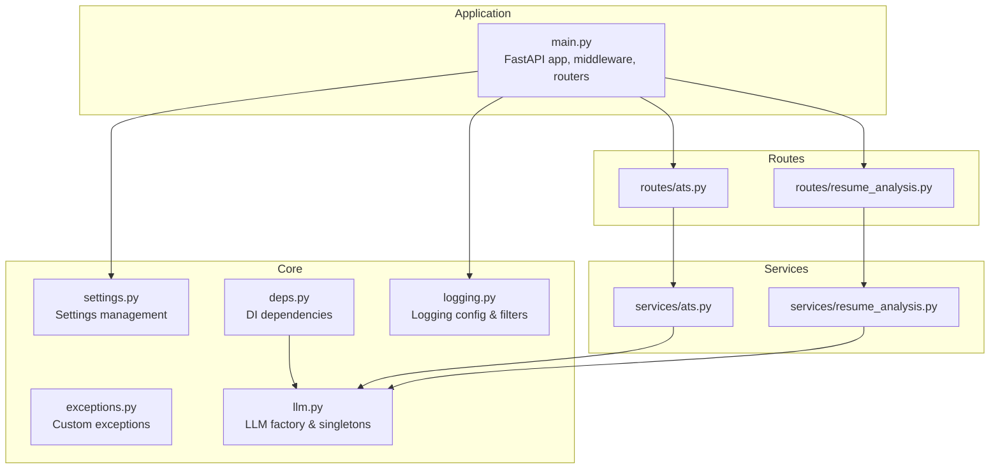
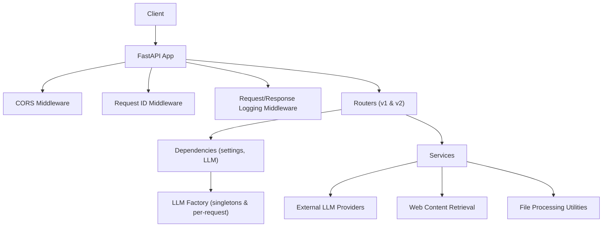
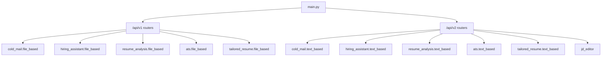
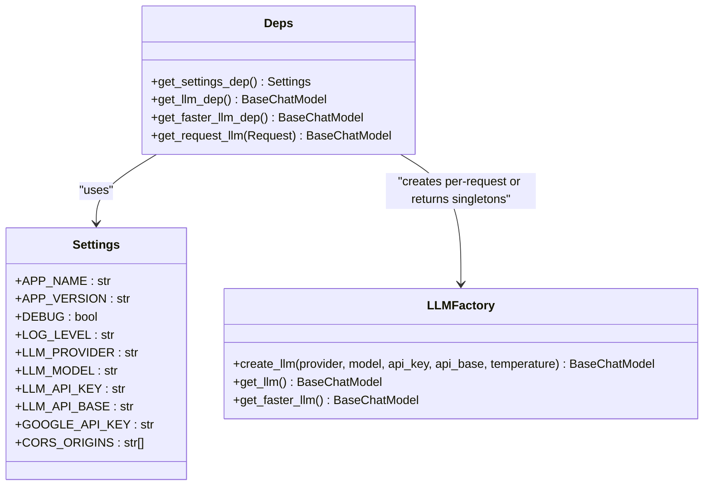
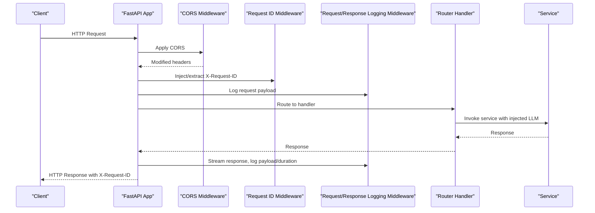
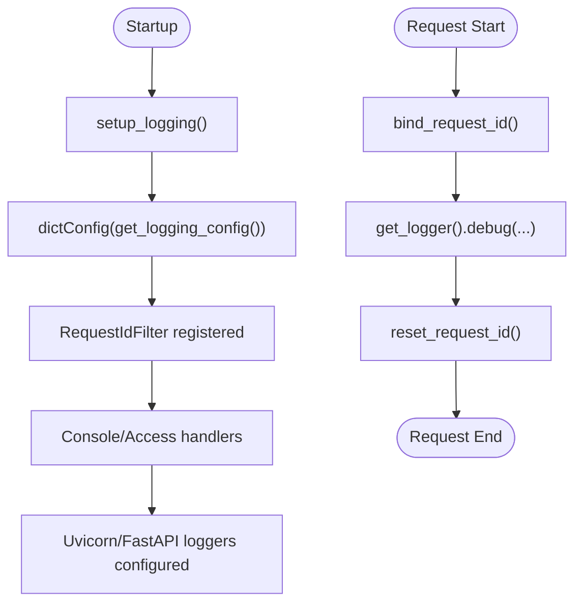
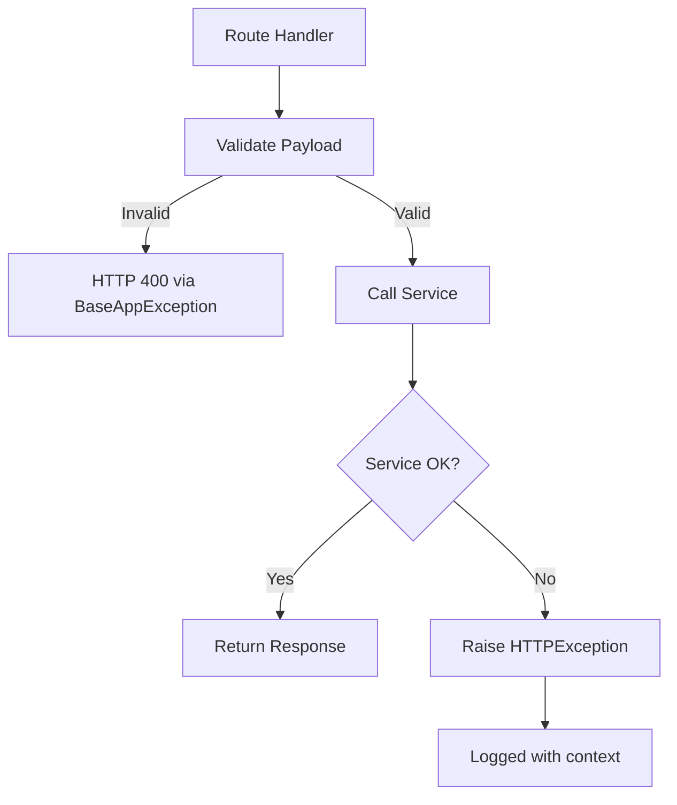
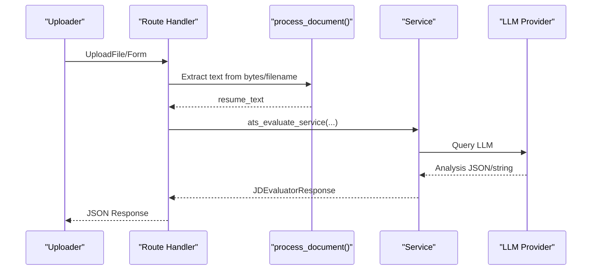
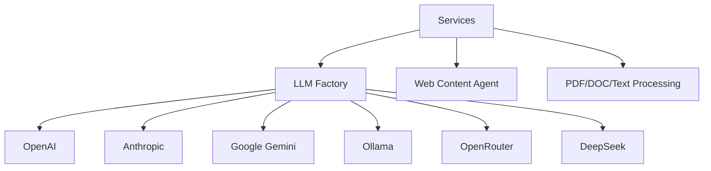
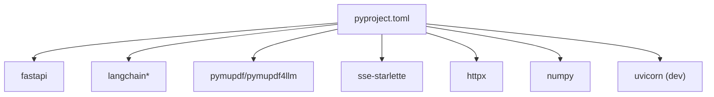

# Backend Architecture

<cite>
**Referenced Files in This Document**
- [backend/app/main.py](file://backend/app/main.py)
- [backend/pyproject.toml](file://backend/pyproject.toml)
- [backend/app/core/settings.py](file://backend/app/core/settings.py)
- [backend/app/core/deps.py](file://backend/app/core/deps.py)
- [backend/app/core/logging.py](file://backend/app/core/logging.py)
- [backend/app/core/exceptions.py](file://backend/app/core/exceptions.py)
- [backend/app/core/llm.py](file://backend/app/core/llm.py)
- [backend/app/routes/ats.py](file://backend/app/routes/ats.py)
- [backend/app/routes/resume_analysis.py](file://backend/app/routes/resume_analysis.py)
- [backend/app/services/ats.py](file://backend/app/services/ats.py)
- [backend/app/services/resume_analysis.py](file://backend/app/services/resume_analysis.py)
</cite>

## Table of Contents
1. [Introduction](#introduction)
2. [Project Structure](#project-structure)
3. [Core Components](#core-components)
4. [Architecture Overview](#architecture-overview)
5. [Detailed Component Analysis](#detailed-component-analysis)
6. [Dependency Analysis](#dependency-analysis)
7. [Performance Considerations](#performance-considerations)
8. [Troubleshooting Guide](#troubleshooting-guide)
9. [Conclusion](#conclusion)

## Introduction
This document describes the FastAPI backend architecture for the TalentSync project. It explains the layered architecture (routing, dependency injection, service layer), middleware stack (CORS, request/response logging, request ID tracking), modular routing system (v1 and v2 API versions), and separation between file-based and text-based processing endpoints. It also covers dependency injection patterns, configuration management, logging architecture, async/await usage, error handling strategies, performance optimization techniques, and integration with external services.

## Project Structure
The backend is organized around a FastAPI application with clear separation of concerns:
- Application entrypoint and middleware registration
- Core modules for configuration, dependency injection, logging, and exceptions
- Route modules grouped by feature area
- Service modules implementing business logic and integrations
- Shared models and schemas

**Diagram sources**
- [backend/app/main.py](file://backend/app/main.py#L63-L203)
- [backend/app/core/settings.py](file://backend/app/core/settings.py#L1-L50)
- [backend/app/core/deps.py](file://backend/app/core/deps.py#L1-L69)
- [backend/app/core/logging.py](file://backend/app/core/logging.py#L1-L117)
- [backend/app/core/exceptions.py](file://backend/app/core/exceptions.py#L1-L50)
- [backend/app/core/llm.py](file://backend/app/core/llm.py#L1-L181)
- [backend/app/routes/ats.py](file://backend/app/routes/ats.py#L1-L184)
- [backend/app/routes/resume_analysis.py](file://backend/app/routes/resume_analysis.py#L1-L68)
- [backend/app/services/ats.py](file://backend/app/services/ats.py#L1-L214)
- [backend/app/services/resume_analysis.py](file://backend/app/services/resume_analysis.py#L1-L364)

**Section sources**
- [backend/app/main.py](file://backend/app/main.py#L1-L203)
- [backend/pyproject.toml](file://backend/pyproject.toml#L1-L42)

## Core Components
- FastAPI application with lifespan for startup/shutdown hooks
- Middleware stack:
  - CORS
  - Request ID tracking via context variables
  - Request/response logging with payload formatting
- Configuration management via Pydantic settings with environment-backed defaults
- Dependency injection for settings, LLM instances, and per-request LLM overrides
- Logging configuration with request ID propagation and structured formatting
- Centralized exception types for consistent HTTP error responses
- LLM factory supporting multiple providers with singletons and per-request overrides

**Section sources**
- [backend/app/main.py](file://backend/app/main.py#L54-L154)
- [backend/app/core/settings.py](file://backend/app/core/settings.py#L1-L50)
- [backend/app/core/deps.py](file://backend/app/core/deps.py#L1-L69)
- [backend/app/core/logging.py](file://backend/app/core/logging.py#L1-L117)
- [backend/app/core/exceptions.py](file://backend/app/core/exceptions.py#L1-L50)
- [backend/app/core/llm.py](file://backend/app/core/llm.py#L1-L181)

## Architecture Overview
The system follows a layered architecture:
- Presentation Layer: FastAPI routes define endpoints and accept/return Pydantic models
- Dependency Injection Layer: Dependencies resolve settings, LLM instances, and per-request LLM
- Service Layer: Business logic orchestrates processing, validation, and external integrations
- External Integrations: LLM providers, file processing utilities, optional web retrieval

**Diagram sources**
- [backend/app/main.py](file://backend/app/main.py#L71-L154)
- [backend/app/core/deps.py](file://backend/app/core/deps.py#L10-L69)
- [backend/app/core/llm.py](file://backend/app/core/llm.py#L110-L176)
- [backend/app/routes/ats.py](file://backend/app/routes/ats.py#L50-L184)
- [backend/app/routes/resume_analysis.py](file://backend/app/routes/resume_analysis.py#L16-L68)
- [backend/app/services/ats.py](file://backend/app/services/ats.py#L22-L214)
- [backend/app/services/resume_analysis.py](file://backend/app/services/resume_analysis.py#L28-L364)

## Detailed Component Analysis

### Routing and Modular API Versions
- v1 routes include LinkedIn, PostgreSQL, Tips, Cold Mail (file-based), Hiring Assistant (file-based), Resume Analysis (file-based), Resume Improvement, Resume Enrichment, Cover Letter, ATS Evaluation (file-based), Tailored Resume (file-based), Interview, and LLM Configuration.
- v2 routes include Cold Mail (text-based), Hiring Assistant (text-based), Resume Analysis (text-based), Resume Improvement, Resume Enrichment, Cover Letter, ATS Evaluation (text-based), Tailored Resume (text-based), JD Editor, and Interview.
- File-based endpoints accept multipart/form-data and process uploaded files; text-based endpoints accept JSON or form-encoded payloads and operate on preformatted text.

**Diagram sources**
- [backend/app/main.py](file://backend/app/main.py#L157-L199)

**Section sources**
- [backend/app/main.py](file://backend/app/main.py#L157-L199)
- [backend/app/routes/ats.py](file://backend/app/routes/ats.py#L15-L184)
- [backend/app/routes/resume_analysis.py](file://backend/app/routes/resume_analysis.py#L13-L68)

### Dependency Injection Pattern
- Settings dependency resolves a cached Settings instance from environment variables.
- LLM dependencies:
  - Singleton LLM for server defaults
  - Faster LLM singleton for lightweight tasks
  - Per-request LLM builder reads headers to override provider/model/key/base per request
- Routes inject LLM via Depends(get_request_llm), enabling dynamic provider selection while falling back to server defaults.

**Diagram sources**
- [backend/app/core/settings.py](file://backend/app/core/settings.py#L7-L49)
- [backend/app/core/deps.py](file://backend/app/core/deps.py#L10-L69)
- [backend/app/core/llm.py](file://backend/app/core/llm.py#L31-L176)

**Section sources**
- [backend/app/core/deps.py](file://backend/app/core/deps.py#L10-L69)
- [backend/app/core/llm.py](file://backend/app/core/llm.py#L110-L176)

### Middleware Stack
- CORS: Configured via settings with allow-all methods/headers and credentials support.
- Request ID tracking:
  - Generates a UUID if none is provided
  - Binds request ID into a context variable for logging correlation
  - Propagates X-Request-ID header on responses
- Request/response logging:
  - Logs request method, path, query, and sanitized payload
  - Streams response body, logs status and duration, and reconstructs Response

**Diagram sources**
- [backend/app/main.py](file://backend/app/main.py#L71-L154)

**Section sources**
- [backend/app/main.py](file://backend/app/main.py#L71-L154)
- [backend/app/core/logging.py](file://backend/app/core/logging.py#L113-L117)

### Logging Architecture
- Structured logging with request ID filter applied to console and access handlers
- Root and framework-specific loggers configured with appropriate levels
- Access formatter integrates client address and request line with request ID
- Request ID is bound/unbound per request lifecycle

**Diagram sources**
- [backend/app/core/logging.py](file://backend/app/core/logging.py#L100-L117)

**Section sources**
- [backend/app/core/logging.py](file://backend/app/core/logging.py#L35-L97)

### Error Handling Strategies
- Centralized exception types for consistent HTTP responses (not found, bad request, unauthorized, forbidden, internal server error, service unavailable)
- Route handlers catch validation errors and general exceptions, logging contextual details and raising appropriate HTTP exceptions
- Service layer validates inputs, normalizes outputs, and raises HTTP exceptions on failures

**Diagram sources**
- [backend/app/core/exceptions.py](file://backend/app/core/exceptions.py#L6-L50)
- [backend/app/routes/ats.py](file://backend/app/routes/ats.py#L119-L131)
- [backend/app/services/ats.py](file://backend/app/services/ats.py#L193-L214)

**Section sources**
- [backend/app/core/exceptions.py](file://backend/app/core/exceptions.py#L1-L50)
- [backend/app/routes/ats.py](file://backend/app/routes/ats.py#L119-L131)
- [backend/app/services/ats.py](file://backend/app/services/ats.py#L193-L214)

### Async/Await Patterns and Processing Logic
- All route handlers are async and await file reads, form parsing, and service calls
- Services orchestrate LLM calls and external integrations asynchronously
- File-based endpoints stream uploads, process content, and clean up temporary files
- Text-based endpoints accept preformatted text and perform analysis directly

**Diagram sources**
- [backend/app/routes/ats.py](file://backend/app/routes/ats.py#L141-L184)
- [backend/app/services/ats.py](file://backend/app/services/ats.py#L22-L192)

**Section sources**
- [backend/app/routes/ats.py](file://backend/app/routes/ats.py#L50-L184)
- [backend/app/services/ats.py](file://backend/app/services/ats.py#L22-L192)

### Integration with External Services
- LLM providers: OpenAI, Anthropic, Google Gemini, Ollama, OpenRouter, DeepSeek
- Web content retrieval for job descriptions from links
- File processing utilities for PDF, DOC, DOCX, TXT, MD

**Diagram sources**
- [backend/app/core/llm.py](file://backend/app/core/llm.py#L31-L107)
- [backend/app/services/ats.py](file://backend/app/services/ats.py#L43-L59)

**Section sources**
- [backend/app/core/llm.py](file://backend/app/core/llm.py#L31-L107)
- [backend/app/services/ats.py](file://backend/app/services/ats.py#L43-L59)

## Dependency Analysis
- Runtime dependencies include FastAPI, LangChain ecosystem, PyMuPDF for PDF processing, SSE support, and HTTP client libraries
- Dev dependencies include Uvicorn for local development
- The application imports route modules centrally and registers them under v1 and v2 prefixes

**Diagram sources**
- [backend/pyproject.toml](file://backend/pyproject.toml#L7-L38)

**Section sources**
- [backend/pyproject.toml](file://backend/pyproject.toml#L1-L42)
- [backend/app/main.py](file://backend/app/main.py#L19-L49)

## Performance Considerations
- Use per-request LLM dependency to avoid blocking singletons for heavy tasks; reserve faster LLM for lightweight operations
- Stream response bodies to avoid buffering entire responses in memory
- Validate and sanitize payloads early to fail fast
- Cache LLM singletons to reduce initialization overhead
- Limit concurrent heavy LLM calls and batch operations where feasible
- Keep file processing minimal and remove temporary files promptly

## Troubleshooting Guide
- LLM configuration issues:
  - Missing API keys or invalid provider/model lead to HTTP 503 during per-request LLM creation
  - Server defaults may return None if GOOGLE_API_KEY is not set for legacy provider
- Validation errors:
  - Pydantic validation failures raise HTTP 400 with detailed messages
- File processing errors:
  - Unsupported file types or processing failures raise HTTP 400
- Web retrieval failures:
  - Link-based job descriptions failing to fetch raise HTTP 500
- Logging:
  - Enable debug mode to increase verbosity and correlate logs via X-Request-ID

**Section sources**
- [backend/app/core/deps.py](file://backend/app/core/deps.py#L47-L68)
- [backend/app/core/llm.py](file://backend/app/core/llm.py#L124-L129)
- [backend/app/routes/ats.py](file://backend/app/routes/ats.py#L83-L95)
- [backend/app/services/ats.py](file://backend/app/services/ats.py#L56-L59)

## Conclusion
The backend employs a clean, layered FastAPI architecture with explicit middleware, robust dependency injection, and centralized configuration. The modular routing system supports both file-based and text-based processing across v1 and v2 APIs, while the service layer encapsulates business logic and external integrations. Strong logging and error handling practices, combined with async patterns and performance-conscious design, provide a scalable foundation for AI-powered talent tools.