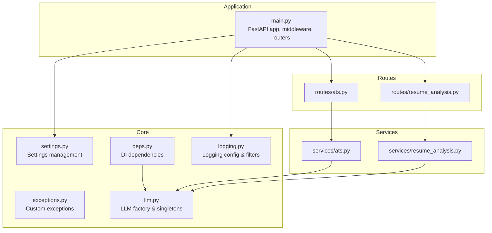
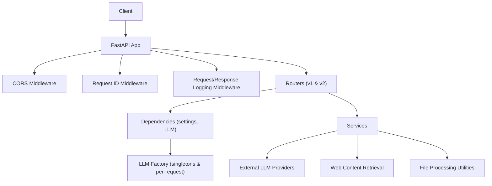
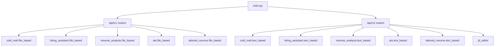
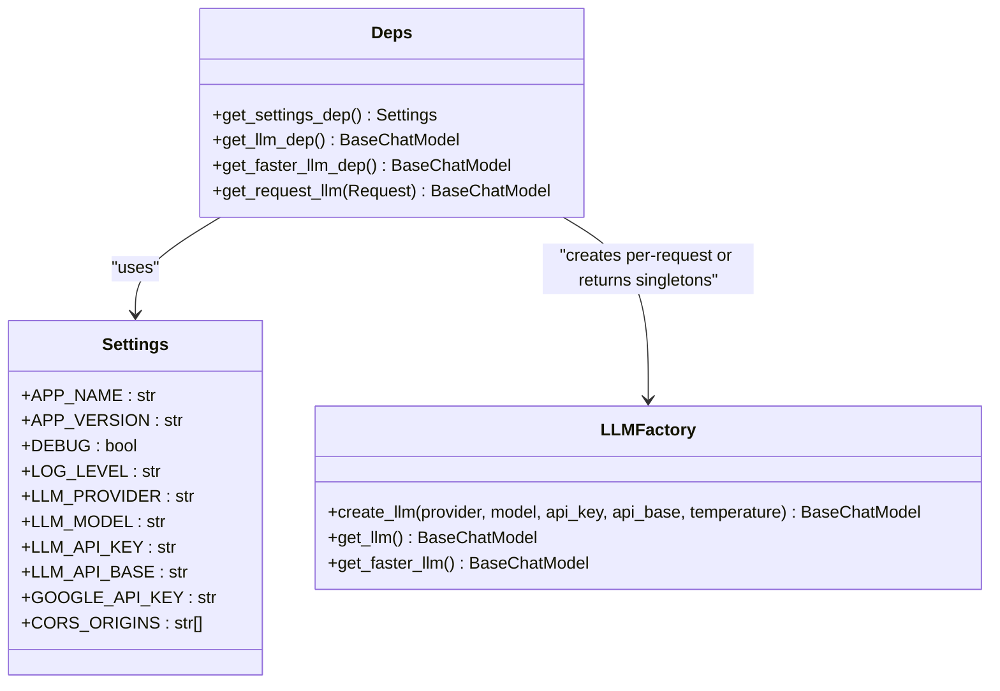
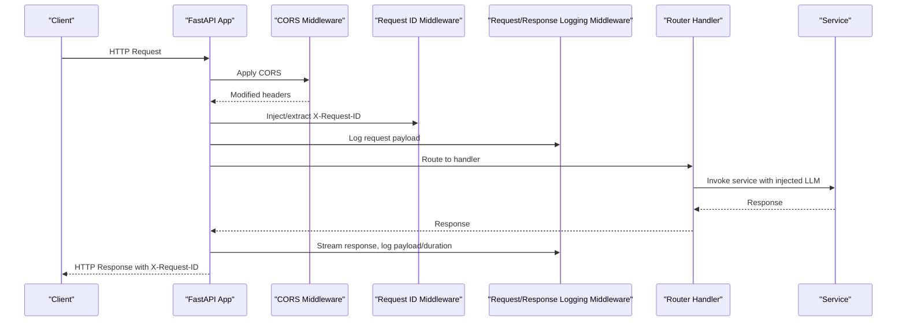
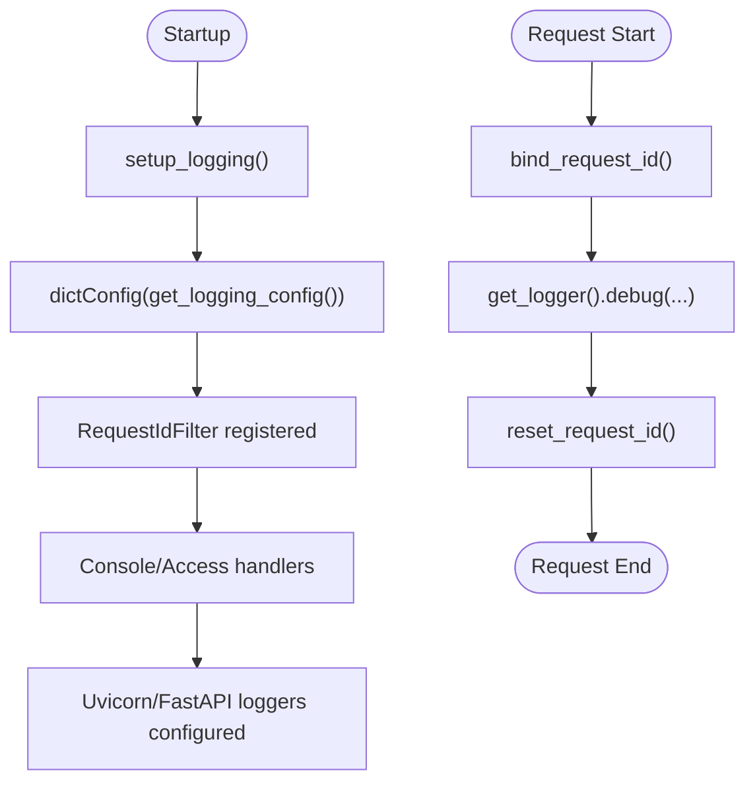
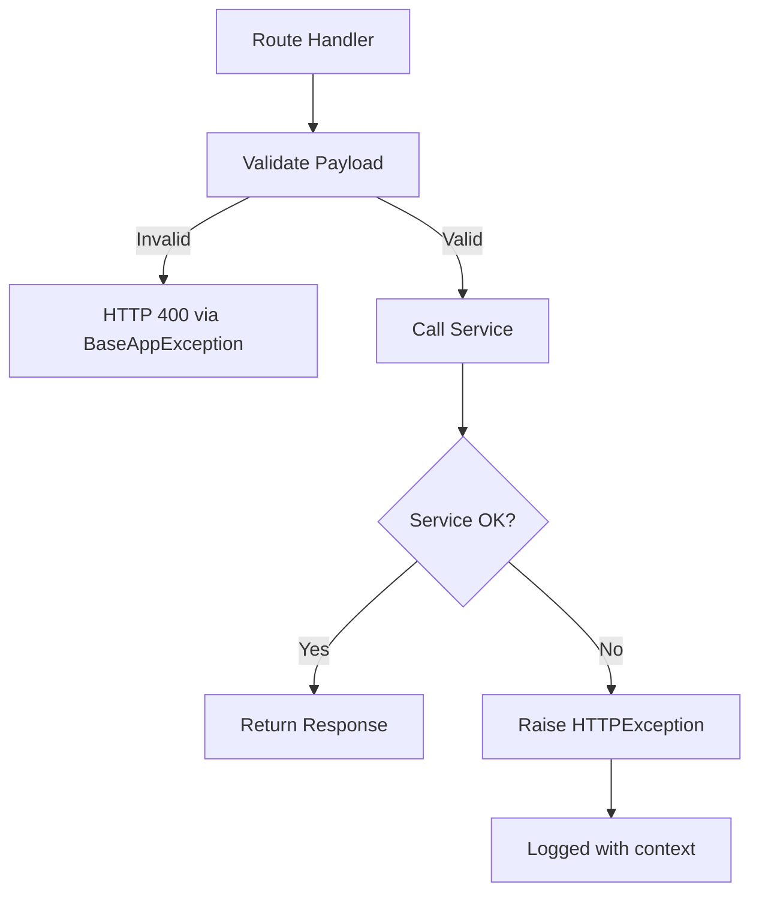
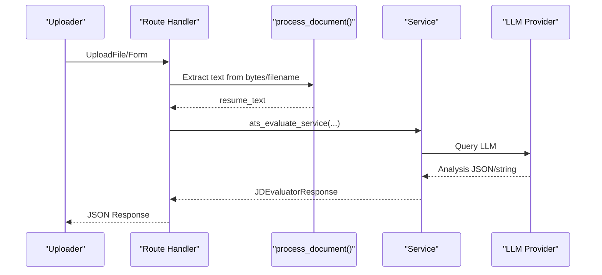
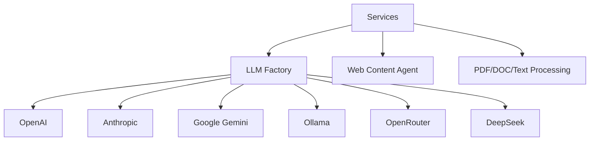
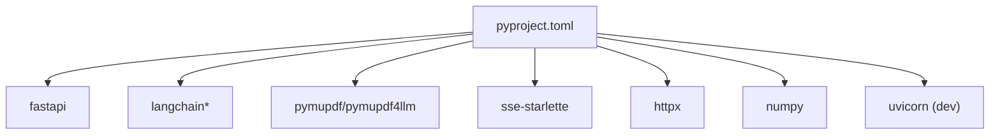

# Backend architecture

## Introduction
This page describes the FastAPI backend architecture for the TalentSync project. It explains the layered architecture (routing, dependency injection, service layer), middleware stack (CORS, request/response logging, request ID tracking), modular routing system (v1 and v2 API versions), and separation between file-based and text-based processing endpoints. It also covers dependency injection patterns, configuration management, logging architecture, async/await usage, error handling strategies, performance optimization techniques, and integration with external services.

## Project structure
The backend is organized around a FastAPI application with clear separation of concerns:
- Application entrypoint and middleware registration
- Core modules for configuration, dependency injection, logging, and exceptions
- Route modules grouped by feature area
- Service modules implementing business logic and integrations
- Shared models and schemas

```mermaid
graph TB
subgraph "Application"
M["main.py<br/>FastAPI app, middleware, routers"]
end
subgraph "Core"
S["settings.py<br/>Settings management"]
D["deps.py<br/>DI dependencies"]
L["logging.py<br/>Logging config & filters"]
E["exceptions.py<br/>Custom exceptions"]
LL["llm.py<br/>LLM factory & singletons"]
end
subgraph "Routes"
R_ATS["routes/ats.py"]
R_RES["routes/resume_analysis.py"]
end
subgraph "Services"
SVC_ATS["services/ats.py"]
SVC_RES["services/resume_analysis.py"]
end
M --> S
M --> L
M --> R_ATS
M --> R_RES
R_ATS --> SVC_ATS
R_RES --> SVC_RES
D --> LL
SVC_ATS --> LL
SVC_RES --> LL
```

## Core components
- FastAPI application with lifespan for startup/shutdown hooks
- Middleware stack:
  - CORS
  - Request ID tracking via context variables
  - Request/response logging with payload formatting
- Configuration management via Pydantic settings with environment-backed defaults
- Dependency injection for settings, LLM instances, and per-request LLM overrides
- Logging configuration with request ID propagation and structured formatting
- Centralized exception types for consistent HTTP error responses
- LLM factory supporting multiple providers with singletons and per-request overrides

## Architecture overview
The system follows a layered architecture:
- Presentation Layer: FastAPI routes define endpoints and accept/return Pydantic models
- Dependency Injection Layer: Dependencies resolve settings, LLM instances, and per-request LLM
- Service Layer: Business logic orchestrates processing, validation, and external integrations
- External Integrations: LLM providers, file processing utilities, optional web retrieval

```mermaid
graph TB
Client["Client"] --> API["FastAPI App"]
API --> MID1["CORS Middleware"]
API --> MID2["Request ID Middleware"]
API --> MID3["Request/Response Logging Middleware"]
API --> Routers["Routers (v1 & v2)"]
Routers --> DI["Dependencies (settings, LLM)"]
DI --> LLM["LLM Factory (singletons & per-request)"]
Routers --> Services["Services"]
Services --> Ext1["External LLM Providers"]
Services --> Ext2["Web Content Retrieval"]
Services --> Ext3["File Processing Utilities"]
```

## Detailed component analysis

### Routing and modular API versions
- v1 routes include LinkedIn, PostgreSQL, Tips, Cold Mail (file-based), Hiring Assistant (file-based), Resume Analysis (file-based), Resume Improvement, Resume Enrichment, Cover Letter, ATS Evaluation (file-based), Tailored Resume (file-based), Interview, and LLM Configuration.
- v2 routes include Cold Mail (text-based), Hiring Assistant (text-based), Resume Analysis (text-based), Resume Improvement, Resume Enrichment, Cover Letter, ATS Evaluation (text-based), Tailored Resume (text-based), JD Editor, and Interview.
- File-based endpoints accept multipart/form-data and process uploaded files; text-based endpoints accept JSON or form-encoded payloads and operate on preformatted text.

```mermaid
graph TB
A["main.py"] --> V1["/api/v1 routers"]
A --> V2["/api/v2 routers"]
V1 --> R1["cold_mail.file_based"]
V1 --> R2["hiring_assistant.file_based"]
V1 --> R3["resume_analysis.file_based"]
V1 --> R4["ats.file_based"]
V1 --> R5["tailored_resume.file_based"]
V2 --> R6["cold_mail.text_based"]
V2 --> R7["hiring_assistant.text_based"]
V2 --> R8["resume_analysis.text_based"]
V2 --> R9["ats.text_based"]
V2 --> R10["tailored_resume.text_based"]
V2 --> R11["jd_editor"]
```

### Dependency injection pattern
- Settings dependency resolves a cached Settings instance from environment variables.
- LLM dependencies:
  - Singleton LLM for server defaults
  - Faster LLM singleton for lightweight tasks
  - Per-request LLM builder reads headers to override provider/model/key/base per request
- Routes inject LLM via Depends(get_request_llm), enabling dynamic provider selection while falling back to server defaults.

```mermaid
classDiagram
class Settings {
+APP_NAME : str
+APP_VERSION : str
+DEBUG : bool
+LOG_LEVEL : str
+LLM_PROVIDER : str
+LLM_MODEL : str
+LLM_API_KEY : str
+LLM_API_BASE : str
+GOOGLE_API_KEY : str
+CORS_ORIGINS : str[]
}
class Deps {
+get_settings_dep() Settings
+get_llm_dep() BaseChatModel
+get_faster_llm_dep() BaseChatModel
+get_request_llm(Request) BaseChatModel
}
class LLMFactory {
+create_llm(provider, model, api_key, api_base, temperature) BaseChatModel
+get_llm() BaseChatModel
+get_faster_llm() BaseChatModel
}
Deps --> Settings : "uses"
Deps --> LLMFactory : "creates per-request or returns singletons"
```

### Middleware stack
- CORS: Configured via settings with allow-all methods/headers and credentials support.
- Request ID tracking:
  - Generates a UUID if none is provided
  - Binds request ID into a context variable for logging correlation
  - Propagates X-Request-ID header on responses
- Request/response logging:
  - Logs request method, path, query, and sanitized payload
  - Streams response body, logs status and duration, and reconstructs Response

```mermaid
sequenceDiagram
participant C as "Client"
participant A as "FastAPI App"
participant CORS as "CORS Middleware"
participant RID as "Request ID Middleware"
participant LOG as "Request/Response Logging Middleware"
participant R as "Router Handler"
participant S as "Service"
C->>A : HTTP Request
A->>CORS : Apply CORS
CORS-->>A : Modified headers
A->>RID : Inject/extract X-Request-ID
A->>LOG : Log request payload
A->>R : Route to handler
R->>S : Invoke service with injected LLM
S-->>R : Response
R-->>A : Response
A->>LOG : Stream response, log payload/duration
A-->>C : HTTP Response with X-Request-ID
```

### Logging architecture
- Structured logging with request ID filter applied to console and access handlers
- Root and framework-specific loggers configured with appropriate levels
- Access formatter integrates client address and request line with request ID
- Request ID is bound/unbound per request lifecycle

```mermaid
flowchart TD
Start(["Startup"]) --> Setup["setup_logging()"]
Setup --> Config["dictConfig(get_logging_config())"]
Config --> Filters["RequestIdFilter registered"]
Filters --> Handlers["Console/Access handlers"]
Handlers --> Loggers["Uvicorn/FastAPI loggers configured"]
ReqStart(["Request Start"]) --> Bind["bind_request_id()"]
Bind --> UseLog["get_logger().debug(...)"]
UseLog --> Reset["reset_request_id()"]
Reset --> ReqEnd(["Request End"])
```

### Error handling strategies
- Centralized exception types for consistent HTTP responses (not found, bad request, unauthorized, forbidden, internal server error, service unavailable)
- Route handlers catch validation errors and general exceptions, logging contextual details and raising appropriate HTTP exceptions
- Service layer validates inputs, normalizes outputs, and raises HTTP exceptions on failures

```mermaid
flowchart TD
A["Route Handler"] --> B["Validate Payload"]
B --> |Invalid| C["HTTP 400 via BaseAppException"]
B --> |Valid| D["Call Service"]
D --> E{"Service OK?"}
E --> |Yes| F["Return Response"]
E --> |No| G["Raise HTTPException"]
G --> H["Logged with context"]
```

### Async/Await patterns and processing logic
- All route handlers are async and await file reads, form parsing, and service calls
- Services orchestrate LLM calls and external integrations asynchronously
- File-based endpoints stream uploads, process content, and clean up temporary files
- Text-based endpoints accept preformatted text and perform analysis directly

```mermaid
sequenceDiagram
participant U as "Uploader"
participant R as "Route Handler"
participant P as "process_document()"
participant S as "Service"
participant L as "LLM Provider"
U->>R : UploadFile/Form
R->>P : Extract text from bytes/filename
P-->>R : resume_text
R->>S : ats_evaluate_service(...)
S->>L : Query LLM
L-->>S : Analysis JSON/string
S-->>R : JDEvaluatorResponse
R-->>U : JSON Response
```

### Integration with external services
- LLM providers: OpenAI, Anthropic, Google Gemini, Ollama, OpenRouter, DeepSeek
- Web content retrieval for job descriptions from links
- File processing utilities for PDF, DOC, DOCX, TXT, MD

```mermaid
graph TB
SVC["Services"] --> LLM["LLM Factory"]
LLM --> OAI["OpenAI"]
LLM --> AN["Anthropic"]
LLM --> GG["Google Gemini"]
LLM --> OL["Ollama"]
LLM --> OR["OpenRouter"]
LLM --> DS["DeepSeek"]
SVC --> WEB["Web Content Agent"]
SVC --> FPDF["PDF/DOC/Text Processing"]
```

## Dependency analysis
- Runtime dependencies include FastAPI, LangChain ecosystem, PyMuPDF for PDF processing, SSE support, and HTTP client libraries
- Dev dependencies include Uvicorn for local development
- The application imports route modules centrally and registers them under v1 and v2 prefixes

```mermaid
graph TB
P["pyproject.toml"] --> F["fastapi"]
P --> LC["langchain*"]
P --> PM["pymupdf/pymupdf4llm"]
P --> SSE["sse-starlette"]
P --> HTTPX["httpx"]
P --> NUM["numpy"]
P --> DEV["uvicorn (dev)"]
```

## Performance considerations
- Use per-request LLM dependency to avoid blocking singletons for heavy tasks; reserve faster LLM for lightweight operations
- Stream response bodies to avoid buffering entire responses in memory
- Validate and sanitize payloads early to fail fast
- Cache LLM singletons to reduce initialization overhead
- Limit concurrent heavy LLM calls and batch operations where feasible
- Keep file processing minimal and remove temporary files promptly

## Troubleshooting guide
- LLM configuration issues:
  - Missing API keys or invalid provider/model lead to HTTP 503 during per-request LLM creation
  - Server defaults may return None if GOOGLE_API_KEY is not set for legacy provider
- Validation errors:
  - Pydantic validation failures raise HTTP 400 with detailed messages
- File processing errors:
  - Unsupported file types or processing failures raise HTTP 400
- Web retrieval failures:
  - Link-based job descriptions failing to fetch raise HTTP 500
- Logging:
  - Enable debug mode to increase verbosity and correlate logs via X-Request-ID

## Conclusion
The backend employs a clean, layered FastAPI architecture with explicit middleware, reliable dependency injection, and centralized configuration. The modular routing system supports both file-based and text-based processing across v1 and v2 APIs, while the service layer encapsulates business logic and external integrations. Strong logging and error handling practices, combined with async patterns and performance-conscious design, provide a scalable foundation for AI-powered talent tools.
