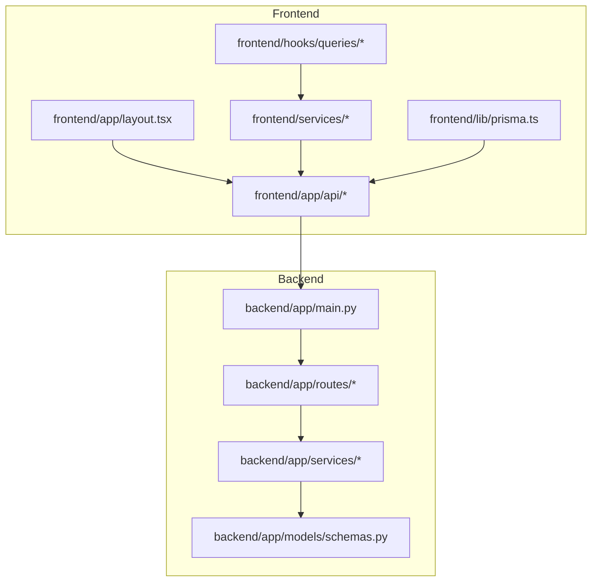
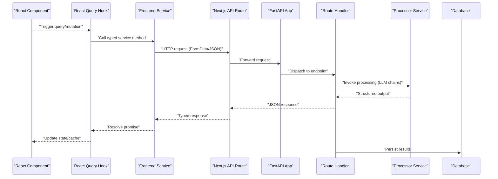
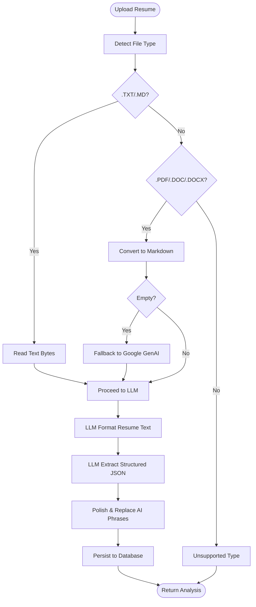
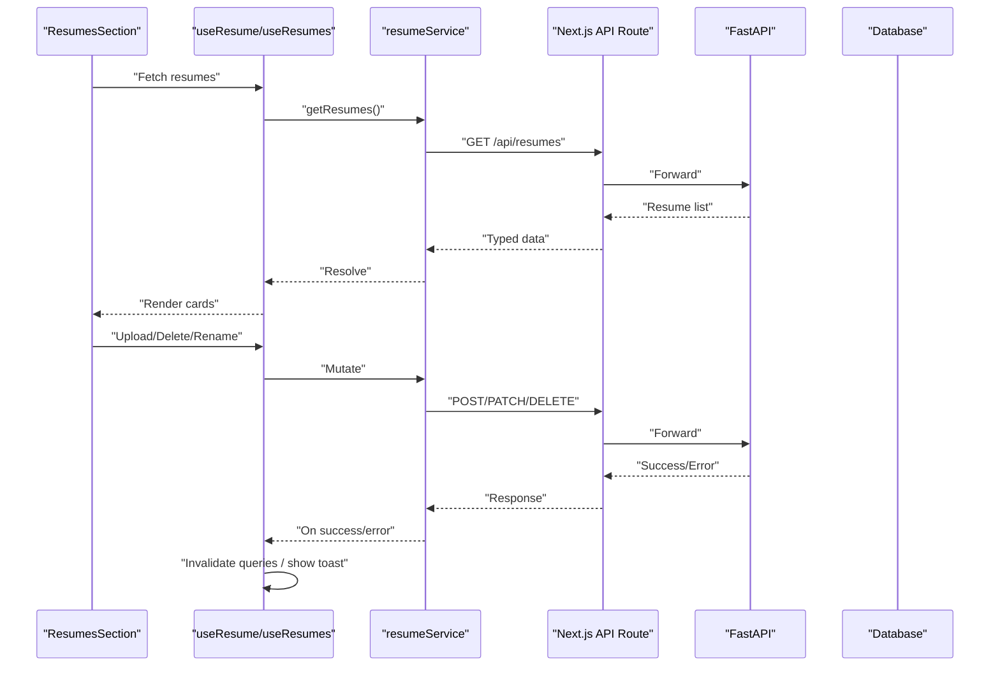
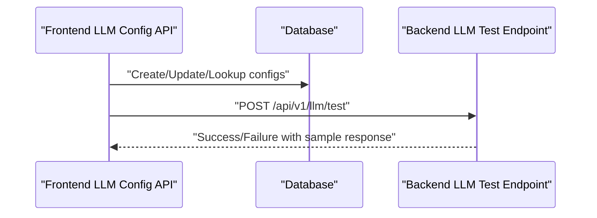
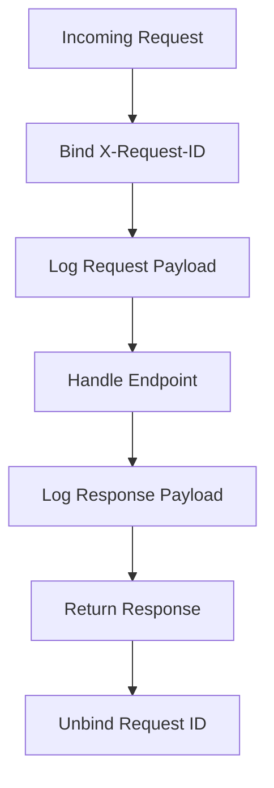

# Data Flow Architecture

<cite>
**Referenced Files in This Document**
- [frontend/app/layout.tsx](file://frontend/app/layout.tsx)
- [backend/main.py](file://backend/main.py)
- [backend/app/main.py](file://backend/app/main.py)
- [backend/app/routes/resume_analysis.py](file://backend/app/routes/resume_analysis.py)
- [backend/app/services/process_resume.py](file://backend/app/services/process_resume.py)
- [backend/app/services/data_processor.py](file://backend/app/services/data_processor.py)
- [backend/app/services/llm_helpers.py](file://backend/app/services/llm_helpers.py)
- [frontend/services/api-client.ts](file://frontend/services/api-client.ts)
- [frontend/services/resume.service.ts](file://frontend/services/resume.service.ts)
- [frontend/hooks/queries/use-resumes.ts](file://frontend/hooks/queries/use-resumes.ts)
- [frontend/components/dashboard/ResumesSection.tsx](file://frontend/components/dashboard/ResumesSection.tsx)
- [frontend/lib/prisma.ts](file://frontend/lib/prisma.ts)
- [frontend/app/api/llm-config/route.ts](file://frontend/app/api/llm-config/route.ts)
- [backend/app/routes/llm.py](file://backend/app/routes/llm.py)
- [backend/app/models/schemas.py](file://backend/app/models/schemas.py)
</cite>

## Table of Contents
1. [Introduction](#introduction)
2. [Project Structure](#project-structure)
3. [Core Components](#core-components)
4. [Architecture Overview](#architecture-overview)
5. [Detailed Component Analysis](#detailed-component-analysis)
6. [Dependency Analysis](#dependency-analysis)
7. [Performance Considerations](#performance-considerations)
8. [Troubleshooting Guide](#troubleshooting-guide)
9. [Conclusion](#conclusion)

## Introduction
This document describes the data flow architecture of the TalentSync system, focusing on how requests and responses traverse the frontend React application, the Next.js API routes, the FastAPI backend services, and the database. It documents the end-to-end pipeline for resume parsing, natural language processing, and structured output generation, along with state management via React Query, streaming patterns for long-running AI operations, caching strategies, data consistency mechanisms, bidirectional flows for user interactions and asynchronous processing, and robust error propagation and retry strategies.

## Project Structure
The system follows a clear separation of concerns:
- Frontend (Next.js App Router): UI components, API route handlers, state management with TanStack Query, and database access via Prisma.
- Backend (FastAPI): Route handlers, service layer orchestrating LLM chains and data processors, and middleware for logging and CORS.
- Shared Contracts: Pydantic models define request/response schemas across the stack.

**Diagram sources**
- [frontend/app/layout.tsx](file://frontend/app/layout.tsx#L1-L52)
- [backend/app/main.py](file://backend/app/main.py#L1-L203)
- [backend/app/routes/resume_analysis.py](file://backend/app/routes/resume_analysis.py#L1-L68)
- [backend/app/services/process_resume.py](file://backend/app/services/process_resume.py#L1-L117)
- [backend/app/services/data_processor.py](file://backend/app/services/data_processor.py#L1-L409)
- [frontend/services/api-client.ts](file://frontend/services/api-client.ts#L1-L125)
- [frontend/services/resume.service.ts](file://frontend/services/resume.service.ts#L1-L66)
- [frontend/hooks/queries/use-resumes.ts](file://frontend/hooks/queries/use-resumes.ts#L1-L83)
- [frontend/lib/prisma.ts](file://frontend/lib/prisma.ts#L1-L10)

**Section sources**
- [frontend/app/layout.tsx](file://frontend/app/layout.tsx#L1-L52)
- [backend/app/main.py](file://backend/app/main.py#L1-L203)

## Core Components
- Frontend API Client: Centralized HTTP client with typed requests, error normalization, and automatic JSON parsing.
- Frontend Services: Typed wrappers around API routes for resume operations, LLM configuration, and other features.
- React Query Hooks: State management for resume lists, mutations for upload/rename/delete, and optimistic updates.
- Backend Main: FastAPI application with middleware, CORS, and route registration.
- Route Handlers: Versioned endpoints for resume analysis, ATS evaluation, cover letters, tailored resumes, and LLM configuration testing.
- Service Layer: Document processing, LLM orchestration, JSON extraction, and validation.
- LLM Helpers: Unified helpers for extracting text from LLM results and parsing JSON safely.
- Schemas: Strongly typed request/response models for API contracts.

**Section sources**
- [frontend/services/api-client.ts](file://frontend/services/api-client.ts#L1-L125)
- [frontend/services/resume.service.ts](file://frontend/services/resume.service.ts#L1-L66)
- [frontend/hooks/queries/use-resumes.ts](file://frontend/hooks/queries/use-resumes.ts#L1-L83)
- [backend/app/main.py](file://backend/app/main.py#L1-L203)
- [backend/app/routes/resume_analysis.py](file://backend/app/routes/resume_analysis.py#L1-L68)
- [backend/app/services/process_resume.py](file://backend/app/services/process_resume.py#L1-L117)
- [backend/app/services/data_processor.py](file://backend/app/services/data_processor.py#L1-L409)
- [backend/app/services/llm_helpers.py](file://backend/app/services/llm_helpers.py#L1-L94)
- [backend/app/models/schemas.py](file://backend/app/models/schemas.py#L1-L191)

## Architecture Overview
The end-to-end flow begins in the frontend UI, progresses through Next.js API routes to FastAPI endpoints, invokes LLM chains and data processors, and persists results to the database. The backend enforces request ID tracing, logs request/response payloads, and exposes versioned APIs.

**Diagram sources**
- [frontend/hooks/queries/use-resumes.ts](file://frontend/hooks/queries/use-resumes.ts#L1-L83)
- [frontend/services/resume.service.ts](file://frontend/services/resume.service.ts#L1-L66)
- [frontend/services/api-client.ts](file://frontend/services/api-client.ts#L1-L125)
- [backend/app/main.py](file://backend/app/main.py#L1-L203)
- [backend/app/routes/resume_analysis.py](file://backend/app/routes/resume_analysis.py#L1-L68)
- [backend/app/services/process_resume.py](file://backend/app/services/process_resume.py#L1-L117)
- [backend/app/services/data_processor.py](file://backend/app/services/data_processor.py#L1-L409)

## Detailed Component Analysis

### Resume Upload and Analysis Pipeline
This pipeline covers document ingestion, text extraction, optional fallback conversion, LLM-based formatting and analysis, JSON structuring, and persistence.

**Diagram sources**
- [backend/app/services/process_resume.py](file://backend/app/services/process_resume.py#L1-L117)
- [backend/app/services/data_processor.py](file://backend/app/services/data_processor.py#L1-L409)
- [backend/app/routes/resume_analysis.py](file://backend/app/routes/resume_analysis.py#L1-L68)

**Section sources**
- [backend/app/services/process_resume.py](file://backend/app/services/process_resume.py#L68-L91)
- [backend/app/services/data_processor.py](file://backend/app/services/data_processor.py#L26-L130)
- [backend/app/routes/resume_analysis.py](file://backend/app/routes/resume_analysis.py#L16-L67)

### Frontend State Management and UI Updates
React Query manages resume lists, mutations for upload/rename/delete, and invalidates caches to reflect backend changes. The dashboard component renders resume cards and navigates to analysis pages.

**Diagram sources**
- [frontend/components/dashboard/ResumesSection.tsx](file://frontend/components/dashboard/ResumesSection.tsx#L1-L118)
- [frontend/hooks/queries/use-resumes.ts](file://frontend/hooks/queries/use-resumes.ts#L1-L83)
- [frontend/services/resume.service.ts](file://frontend/services/resume.service.ts#L1-L66)

**Section sources**
- [frontend/components/dashboard/ResumesSection.tsx](file://frontend/components/dashboard/ResumesSection.tsx#L18-L118)
- [frontend/hooks/queries/use-resumes.ts](file://frontend/hooks/queries/use-resumes.ts#L1-L83)
- [frontend/services/resume.service.ts](file://frontend/services/resume.service.ts#L24-L65)

### LLM Configuration and Testing
The frontend exposes endpoints to manage user-specific LLM configurations, including encryption of API keys and activation state. The backend provides a test endpoint to validate LLM connectivity.

**Diagram sources**
- [frontend/app/api/llm-config/route.ts](file://frontend/app/api/llm-config/route.ts#L1-L120)
- [backend/app/routes/llm.py](file://backend/app/routes/llm.py#L1-L50)

**Section sources**
- [frontend/app/api/llm-config/route.ts](file://frontend/app/api/llm-config/route.ts#L7-L119)
- [backend/app/routes/llm.py](file://backend/app/routes/llm.py#L23-L49)

### Request/Response Logging and Tracing
The backend attaches request IDs and logs request/response payloads for observability, aiding debugging and performance monitoring.

**Diagram sources**
- [backend/app/main.py](file://backend/app/main.py#L71-L131)

**Section sources**
- [backend/app/main.py](file://backend/app/main.py#L71-L131)

## Dependency Analysis
The system exhibits layered dependencies:
- Frontend depends on typed services and API routes, which depend on the backend FastAPI application.
- Backend routes depend on service modules that orchestrate LLM chains and data processors.
- Schemas unify contracts across the stack.

**Diagram sources**
- [backend/app/main.py](file://backend/app/main.py#L1-L203)
- [backend/app/routes/resume_analysis.py](file://backend/app/routes/resume_analysis.py#L1-L68)
- [backend/app/services/data_processor.py](file://backend/app/services/data_processor.py#L1-L409)
- [backend/app/models/schemas.py](file://backend/app/models/schemas.py#L1-L191)

**Section sources**
- [backend/app/main.py](file://backend/app/main.py#L157-L203)
- [backend/app/routes/resume_analysis.py](file://backend/app/routes/resume_analysis.py#L1-L68)
- [backend/app/services/data_processor.py](file://backend/app/services/data_processor.py#L1-L409)
- [backend/app/models/schemas.py](file://backend/app/models/schemas.py#L1-L191)

## Performance Considerations
- Streaming Responses: Long-running AI operations should stream events to the client. While current route handlers return aggregated results, future enhancements can adopt Server-Sent Events or WebSocket channels to push incremental updates for tasks like resume enrichment or ATS scoring.
- Caching Strategies: 
  - Frontend: Use React Query’s background refetch and stale-while-revalidate to minimize redundant network calls.
  - Backend: Cache LLM prompts and intermediate results where safe, ensuring cache invalidation on user actions (rename, delete).
- Parallelization: Process multiple resume files concurrently with bounded concurrency to utilize CPU and I/O efficiently.
- Compression: Enable gzip/deflate on API responses to reduce payload sizes.
- Database Indexes: Ensure appropriate indexes on resume metadata and user-specific fields to speed up queries.

[No sources needed since this section provides general guidance]

## Troubleshooting Guide
- Network Errors: The frontend API client normalizes non-OK responses and surfaces detailed messages from backend payloads. Inspect the ApiError status and data fields for actionable diagnostics.
- LLM Failures: LLM helpers include robust parsing and fallbacks. If JSON parsing fails, the system extracts the first JSON block; if rate-limited or unauthorized, it falls back to original text. Review logs for rate-limit and auth-related messages.
- Request/Response Logging: Use the X-Request-ID header to correlate logs across request/response boundaries and identify slow endpoints.
- Database Consistency: React Query invalidates related queries after mutations to keep UI state consistent with backend changes.

**Section sources**
- [frontend/services/api-client.ts](file://frontend/services/api-client.ts#L56-L98)
- [backend/app/services/llm_helpers.py](file://backend/app/services/llm_helpers.py#L30-L52)
- [backend/app/main.py](file://backend/app/main.py#L71-L131)
- [frontend/hooks/queries/use-resumes.ts](file://frontend/hooks/queries/use-resumes.ts#L20-L81)

## Conclusion
TalentSync’s data flow integrates a reactive frontend with a robust backend, enabling seamless resume processing, LLM-driven transformations, and persistent state. The architecture supports typed contracts, centralized error handling, observability via request tracing, and scalable state management. Future enhancements can introduce streaming for long-running tasks, refine caching policies, and strengthen real-time update mechanisms to further improve user experience and throughput.