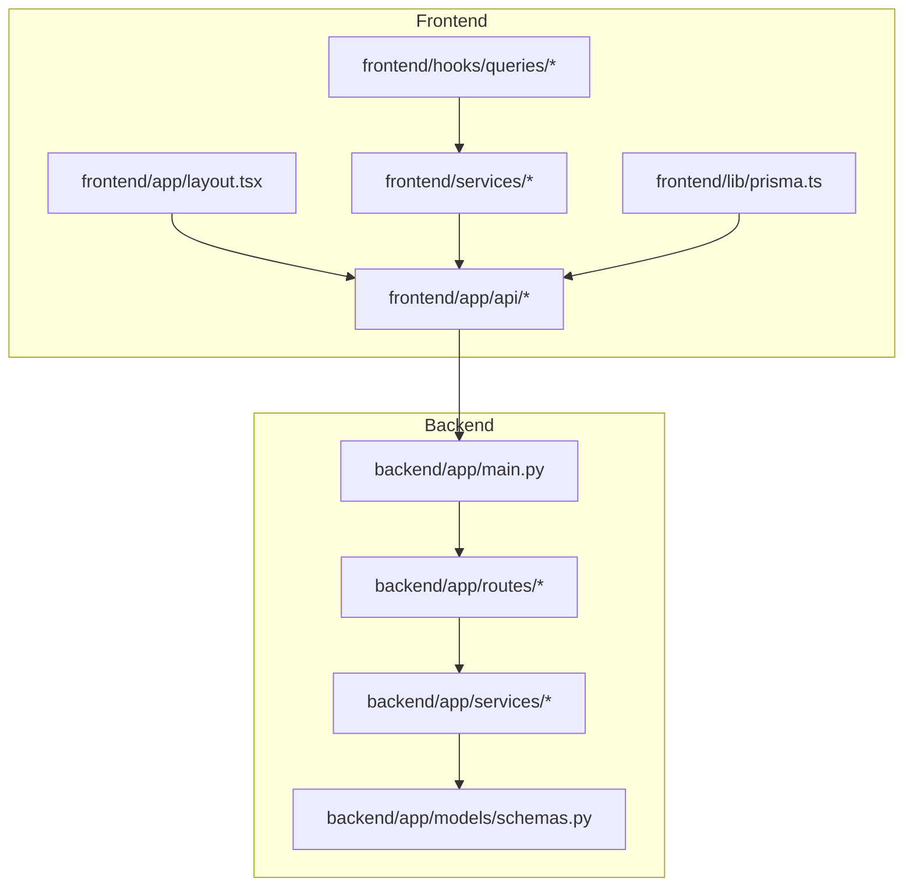
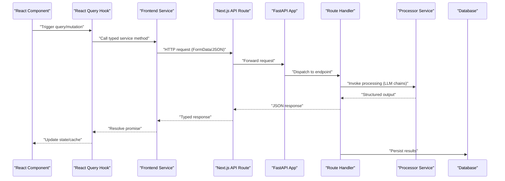
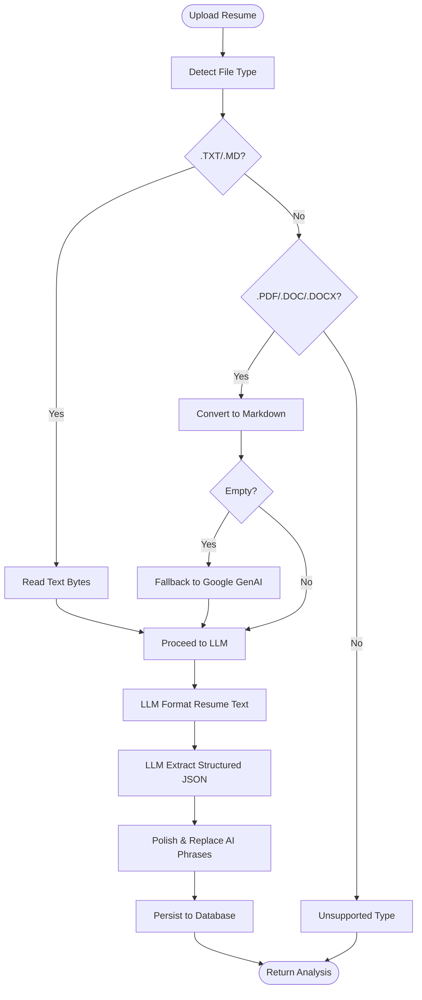
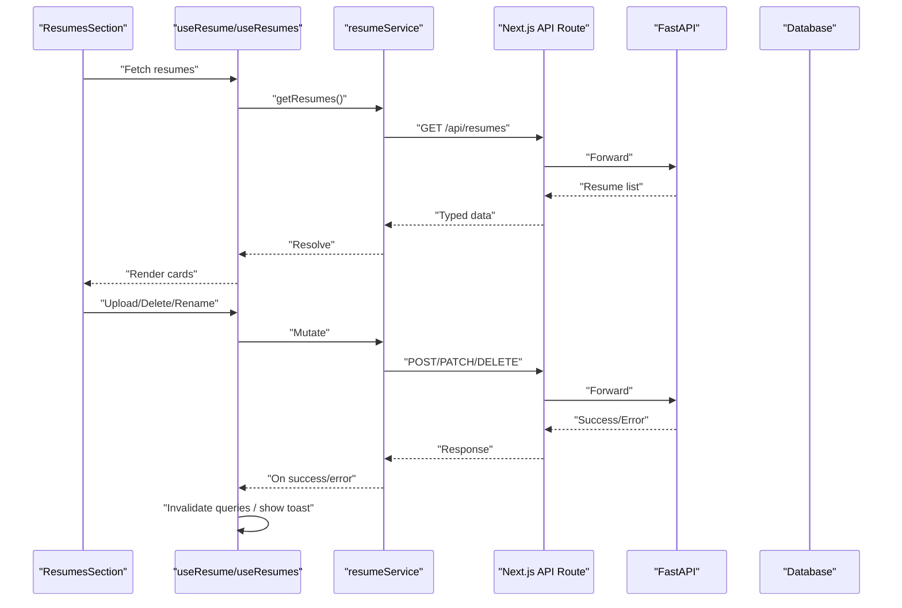
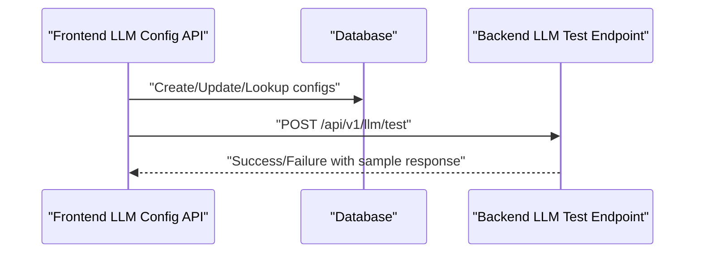
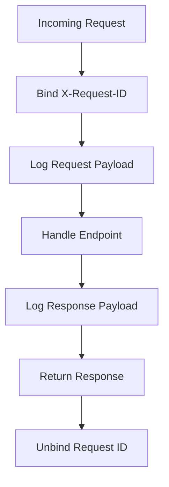
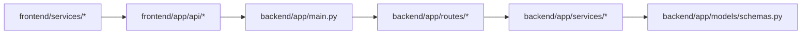

# Data flow architecture

How data moves between the Next.js app, FastAPI, and PostgreSQL.

## Repository layout
The system keeps layers apart:
- Frontend (Next.js App Router): UI components, API route handlers, state management with TanStack Query, and database access via Prisma.
- Backend (FastAPI): Route handlers, service layer orchestrating LLM chains and data processors, and middleware for logging and CORS.
- Shared Contracts: Pydantic models define request/response schemas across the stack.

```mermaid
graph TB
subgraph "Frontend"
FE_L["frontend/app/layout.tsx"]
FE_API["frontend/app/api/*"]
FE_SVC["frontend/services/*"]
FE_HOOKS["frontend/hooks/queries/*"]
FE_PRISMA["frontend/lib/prisma.ts"]
end
subgraph "Backend"
BE_MAIN["backend/app/main.py"]
BE_ROUTES["backend/app/routes/*"]
BE_SERVICES["backend/app/services/*"]
BE_MODELS["backend/app/models/schemas.py"]
end
FE_L --> FE_API
FE_API --> BE_MAIN
BE_MAIN --> BE_ROUTES
BE_ROUTES --> BE_SERVICES
BE_SERVICES --> BE_MODELS
FE_SVC --> FE_API
FE_HOOKS --> FE_SVC
FE_PRISMA --> FE_API
```

## Building blocks
- Frontend API Client: Centralized HTTP client with typed requests, error normalization, and automatic JSON parsing.
- Frontend Services: Typed wrappers around API routes for resume operations, LLM configuration, and other features.
- React Query Hooks: State management for resume lists, mutations for upload/rename/delete, and optimistic updates.
- Backend Main: FastAPI application with middleware, CORS, and route registration.
- Route Handlers: Versioned endpoints for resume analysis, ATS evaluation, cover letters, tailored resumes, and LLM configuration testing.
- Service Layer: Document processing, LLM orchestration, JSON extraction, and validation.
- LLM Helpers: Unified helpers for extracting text from LLM results and parsing JSON safely.
- Schemas: Strongly typed request/response models for API contracts.

## How it fits together
UI calls Next.js API routes, which hit FastAPI, run LLM chains and processors, then persist results. The backend enforces request ID tracing, logs request/response payloads, and exposes versioned APIs.

```mermaid
sequenceDiagram
participant UI as "React Component"
participant Hook as "React Query Hook"
participant FESvc as "Frontend Service"
participant API as "Next.js API Route"
participant BE as "FastAPI App"
participant Route as "Route Handler"
participant Proc as "Processor Service"
participant DB as "Database"
UI->>Hook : "Trigger query/mutation"
Hook->>FESvc : "Call typed service method"
FESvc->>API : "HTTP request (FormData/JSON)"
API->>BE : "Forward request"
BE->>Route : "Dispatch to endpoint"
Route->>Proc : "Invoke processing (LLM chains)"
Proc-->>Route : "Structured output"
Route-->>API : "JSON response"
API-->>FESvc : "Typed response"
FESvc-->>Hook : "Resolve promise"
Hook-->>UI : "Update state/cache"
Route->>DB : "Persist results"
```

## Resume upload and analysis pipeline
This pipeline covers document ingestion, text extraction, optional fallback conversion, LLM-based formatting and analysis, JSON structuring, and persistence.

```mermaid
flowchart TD
Start(["Upload Resume"]) --> Detect["Detect File Type"]
Detect --> ExtTxt{".TXT/.MD?"}
ExtTxt --> |Yes| ReadTxt["Read Text Bytes"]
ExtTxt --> |No| ExtPdfDocx{".PDF/.DOC/.DOCX?"}
ExtPdfDocx --> |Yes| ToMd["Convert to Markdown"]
ExtPdfDocx --> |No| Unsupported["Unsupported Type"]
ToMd --> EmptyMd{"Empty?"}
EmptyMd --> |Yes| Fallback["Fallback to Google GenAI"]
EmptyMd --> |No| Proceed["Proceed to LLM"]
Fallback --> Proceed
ReadTxt --> Proceed
Proceed --> LLMFmt["LLM Format Resume Text"]
LLMFmt --> LLMJson["LLM Extract Structured JSON"]
LLMJson --> Polish["Polish & Replace AI Phrases"]
Polish --> Persist["Persist to Database"]
Persist --> Done(["Return Analysis"])
Unsupported --> Done
```

## Frontend state management and UI updates
React Query manages resume lists, mutations for upload/rename/delete, and invalidates caches to reflect backend changes. The dashboard component renders resume cards and navigates to analysis pages.

```mermaid
sequenceDiagram
participant Comp as "ResumesSection"
participant Hook as "useResume/useResumes"
participant Svc as "resumeService"
participant API as "Next.js API Route"
participant BE as "FastAPI"
participant DB as "Database"
Comp->>Hook : "Fetch resumes"
Hook->>Svc : "getResumes()"
Svc->>API : "GET /api/resumes"
API->>BE : "Forward"
BE-->>API : "Resume list"
API-->>Svc : "Typed data"
Svc-->>Hook : "Resolve"
Hook-->>Comp : "Render cards"
Comp->>Hook : "Upload/Delete/Rename"
Hook->>Svc : "Mutate"
Svc->>API : "POST/PATCH/DELETE"
API->>BE : "Forward"
BE-->>API : "Success/Error"
API-->>Svc : "Response"
Svc-->>Hook : "On success/error"
Hook->>Hook : "Invalidate queries / show toast"
```

## LLM configuration and testing
The frontend exposes endpoints to manage user-specific LLM configurations, including encryption of API keys and activation state. The backend exposes a test endpoint to validate LLM connectivity.

```mermaid
sequenceDiagram
participant FEConf as "Frontend LLM Config API"
participant DB as "Database"
participant BEConf as "Backend LLM Test Endpoint"
FEConf->>DB : "Create/Update/Lookup configs"
FEConf->>BEConf : "POST /api/v1/llm/test"
BEConf-->>FEConf : "Success/Failure with sample response"
```

## Request/Response logging and tracing
The backend attaches request IDs and logs request/response payloads for observability, aiding debugging and performance monitoring.

```mermaid
flowchart TD
Req["Incoming Request"] --> Bind["Bind X-Request-ID"]
Bind --> LogReq["Log Request Payload"]
LogReq --> Handle["Handle Endpoint"]
Handle --> LogResp["Log Response Payload"]
LogResp --> Resp["Return Response"]
Resp --> Unbind["Unbind Request ID"]
```

## Dependencies
The system exhibits layered dependencies:
- Frontend depends on typed services and API routes, which depend on the backend FastAPI application.
- Backend routes depend on service modules that orchestrate LLM chains and data processors.
- Schemas unify contracts across the stack.

```mermaid
graph LR
FE_API["frontend/app/api/*"] --> BE_MAIN["backend/app/main.py"]
FE_SVC["frontend/services/*"] --> FE_API
BE_MAIN --> BE_ROUTES["backend/app/routes/*"]
BE_ROUTES --> BE_SERVICES["backend/app/services/*"]
BE_SERVICES --> BE_MODELS["backend/app/models/schemas.py"]
```

## Performance
- Streaming Responses: Long-running AI operations should stream events to the client. While current route handlers return aggregated results, you can later adopt Server-Sent Events or WebSocket channels to push incremental updates for tasks like resume enrichment or ATS scoring.
- Caching Strategies:
 - Frontend: Use React Query's background refetch and stale-while-revalidate to minimize redundant network calls.
 - Backend: Cache LLM prompts and intermediate results where safe, and invalidate the cache on user actions (rename, delete).
- Parallelization: Process multiple resume files concurrently with bounded concurrency to use CPU and I/O efficiently.
- Compression: Enable gzip/deflate on API responses to reduce payload sizes.
- Database Indexes: Ensure appropriate indexes on resume metadata and user-specific fields to speed up queries.

[No sources needed since this section provides general guidance]

## Troubleshooting
- Network Errors: The frontend API client normalizes non-OK responses and surfaces detailed messages from backend payloads. Inspect the ApiError status and data fields for concrete diagnostics.
- LLM Failures: LLM helpers include parsing and fallbacks. If JSON parsing fails, the system extracts the first JSON block; if rate-limited or unauthorized, it falls back to original text. Review logs for rate-limit and auth-related messages.
- Request/Response Logging: Use the X-Request-ID header to correlate logs across request/response boundaries and identify slow endpoints.
- Database Consistency: React Query invalidates related queries after mutations to keep UI state consistent with backend changes.
