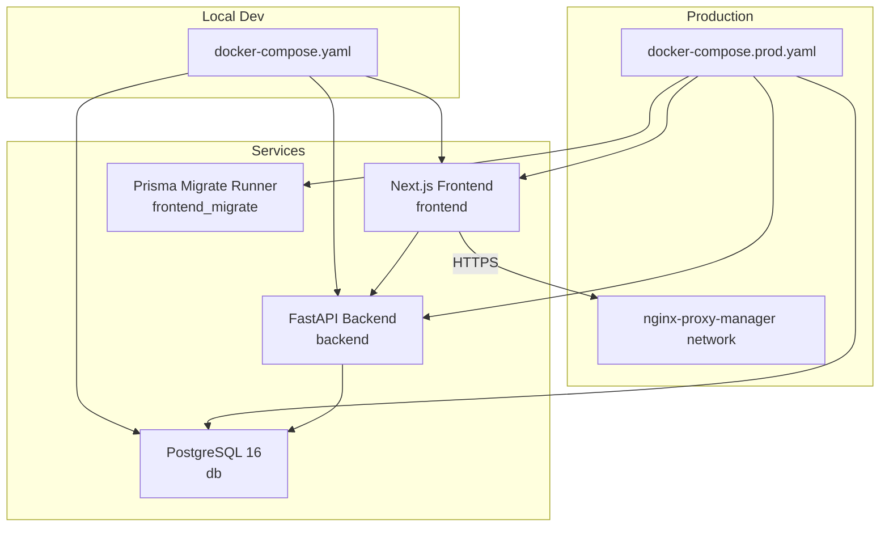
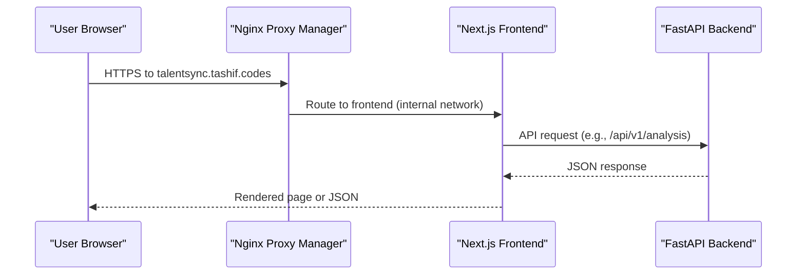
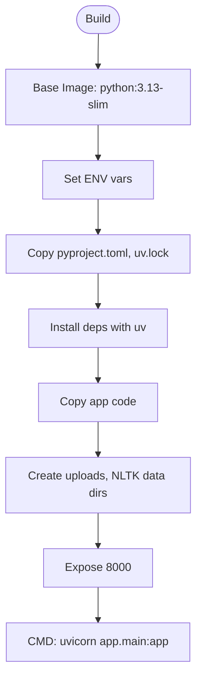
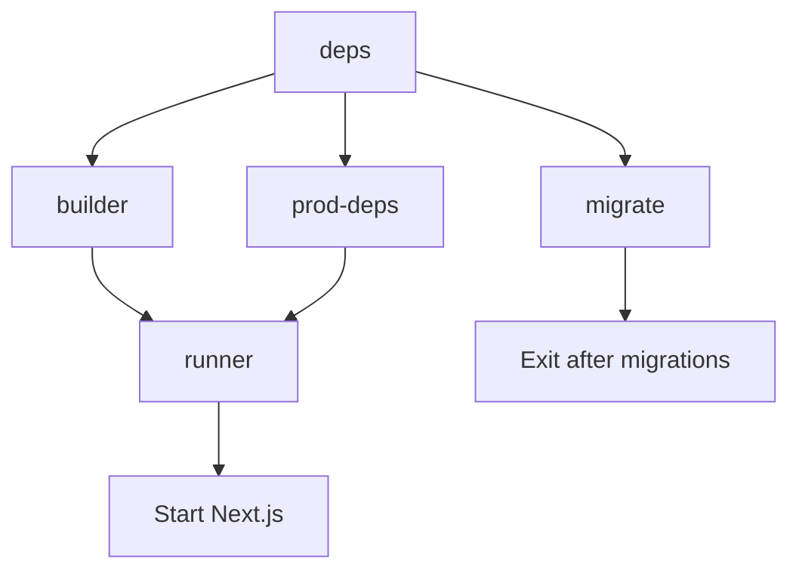
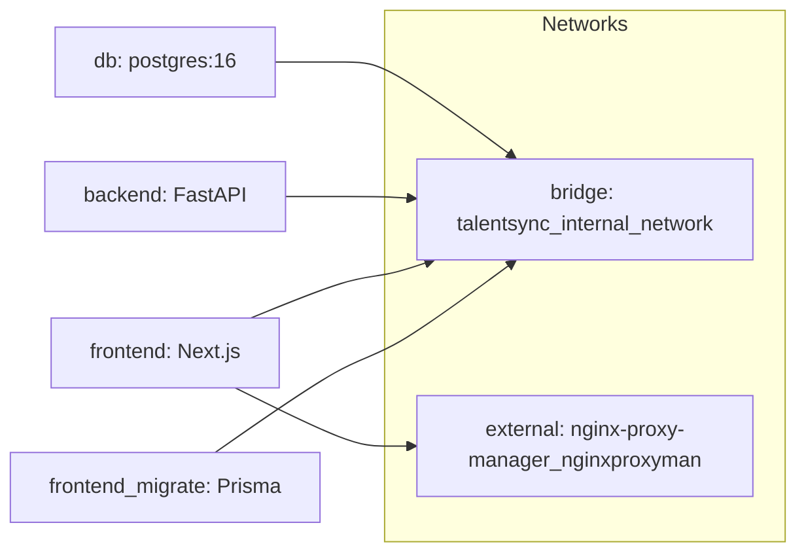
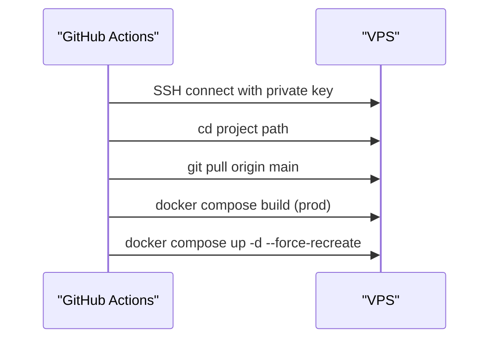
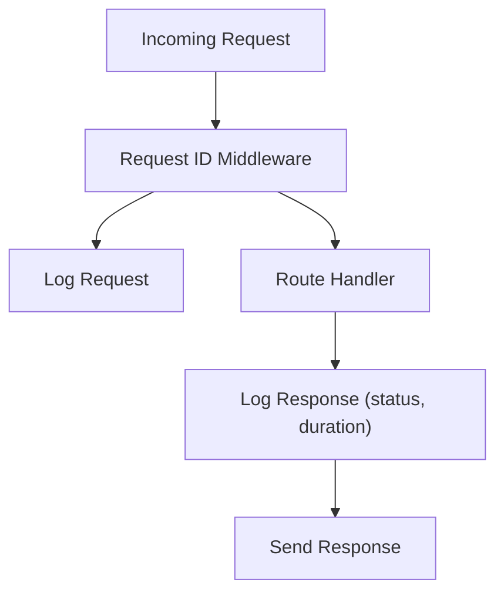
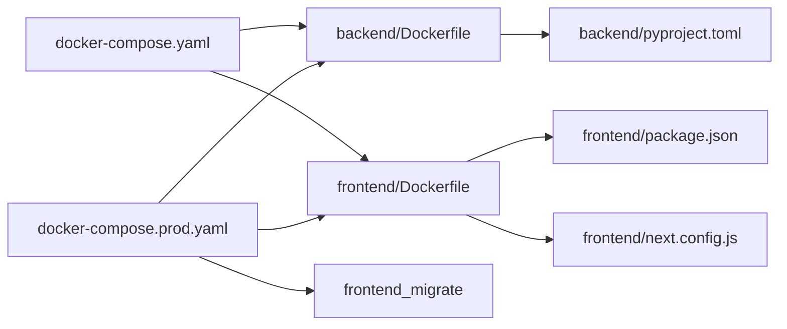

# Deployment Architecture

<cite>
**Referenced Files in This Document**
- [docker-compose.yaml](file://docker-compose.yaml)
- [docker-compose.prod.yaml](file://docker-compose.prod.yaml)
- [backend/Dockerfile](file://backend/Dockerfile)
- [frontend/Dockerfile](file://frontend/Dockerfile)
- [.github/workflows/deploy.yaml](file://.github/workflows/deploy.yaml)
- [backend/.env](file://backend/.env)
- [frontend/.env](file://frontend/.env)
- [.env](file://.env)
- [backend/pyproject.toml](file://backend/pyproject.toml)
- [frontend/package.json](file://frontend/package.json)
- [backend/app/main.py](file://backend/app/main.py)
- [backend/app/core/settings.py](file://backend/app/core/settings.py)
- [backend/app/core/logging.py](file://backend/app/core/logging.py)
- [frontend/next.config.js](file://frontend/next.config.js)
</cite>

## Table of Contents
1. [Introduction](#introduction)
2. [Project Structure](#project-structure)
3. [Core Components](#core-components)
4. [Architecture Overview](#architecture-overview)
5. [Detailed Component Analysis](#detailed-component-analysis)
6. [Dependency Analysis](#dependency-analysis)
7. [Performance Considerations](#performance-considerations)
8. [Troubleshooting Guide](#troubleshooting-guide)
9. [Conclusion](#conclusion)
10. [Appendices](#appendices)

## Introduction
This document describes the deployment and infrastructure architecture for the application. It covers containerized deployment using Docker with multi-stage builds, docker-compose orchestration for local development and production, CI/CD with GitHub Actions, environment variable management, secrets handling, scaling strategies, health checks, logging aggregation, monitoring setup, reverse proxy configuration, SSL termination, load balancing, and disaster recovery planning.

## Project Structure
The deployment stack consists of:
- A PostgreSQL database service
- A Python FastAPI backend service exposing REST APIs
- A Next.js frontend service serving the SPA and acting as a reverse proxy for analytics and API passthrough
- Orchestration via docker-compose for local development and production
- CI/CD via GitHub Actions for automated deployments to a VPS

**Diagram sources**
- [docker-compose.yaml](file://docker-compose.yaml#L1-L78)
- [docker-compose.prod.yaml](file://docker-compose.prod.yaml#L1-L105)

**Section sources**
- [docker-compose.yaml](file://docker-compose.yaml#L1-L78)
- [docker-compose.prod.yaml](file://docker-compose.prod.yaml#L1-L105)

## Core Components
- Backend service
  - Built with a single-stage Dockerfile using uv for dependency installation and Uvicorn for ASGI serving.
  - Exposes port 8000 and mounts an uploads directory for persistence.
- Frontend service
  - Multi-stage Dockerfile:
    - deps: installs dev dependencies for build tooling
    - builder: performs Next.js build and Prisma generation
    - prod-deps: installs production-only dependencies
    - migrate: one-shot Prisma migrations
    - runner: slim runtime serving the built app
  - Exposes port 3000 and integrates PostHog via rewrites and environment variables.
- Database service
  - PostgreSQL 16 with persistent volume and health checks in production.
- Orchestration
  - Local development compose defines internal networks and service dependencies.
  - Production compose adds health checks, external network for reverse proxy, and a dedicated migration stage.

**Section sources**
- [backend/Dockerfile](file://backend/Dockerfile#L1-L33)
- [frontend/Dockerfile](file://frontend/Dockerfile#L1-L110)
- [docker-compose.yaml](file://docker-compose.yaml#L1-L78)
- [docker-compose.prod.yaml](file://docker-compose.prod.yaml#L1-L105)

## Architecture Overview
The system uses a reverse proxy managed by Nginx Proxy Manager (external network) to terminate TLS and route traffic to the Next.js frontend. The frontend proxies specific API paths to the backend service. The backend exposes REST endpoints and logs requests with request IDs for observability.

**Diagram sources**
- [docker-compose.prod.yaml](file://docker-compose.prod.yaml#L79-L83)
- [frontend/next.config.js](file://frontend/next.config.js#L73-L86)
- [backend/app/main.py](file://backend/app/main.py#L157-L203)

## Detailed Component Analysis

### Backend Containerization
- Build and runtime
  - Single-stage build using Python slim image, uv for deterministic installs, and Uvicorn ASGI server.
  - Exposes port 8000 and sets working directory to /app.
- Persistence
  - Uploads directory mounted from host for resume and asset storage.
- Environment
  - Reads .env via pydantic-settings and supports model configuration, CORS, and interview settings.

**Diagram sources**
- [backend/Dockerfile](file://backend/Dockerfile#L1-L33)
- [backend/pyproject.toml](file://backend/pyproject.toml#L1-L42)

**Section sources**
- [backend/Dockerfile](file://backend/Dockerfile#L1-L33)
- [backend/pyproject.toml](file://backend/pyproject.toml#L1-L42)
- [backend/app/core/settings.py](file://backend/app/core/settings.py#L1-L50)

### Frontend Containerization
- Multi-stage build
  - deps: installs dev dependencies for build tooling
  - builder: Next.js build and Prisma generation
  - prod-deps: production-only dependencies
  - migrate: one-shot Prisma migrations
  - runner: slim runtime serving the built app
- Runtime
  - Exposes port 3000, runs with bun, and uses environment variables for analytics and configuration.
- Reverse proxy and analytics
  - Rewrites for PostHog static assets and API endpoints to avoid mixed content and improve privacy.

**Diagram sources**
- [frontend/Dockerfile](file://frontend/Dockerfile#L1-L110)
- [frontend/next.config.js](file://frontend/next.config.js#L73-L86)

**Section sources**
- [frontend/Dockerfile](file://frontend/Dockerfile#L1-L110)
- [frontend/package.json](file://frontend/package.json#L5-L13)
- [frontend/next.config.js](file://frontend/next.config.js#L1-L90)

### Orchestration and Networking
- Local development
  - Defines an internal bridge network, service dependencies, and explicit environment overrides for frontend (e.g., NEXTAUTH_URL, BACKEND_URL).
- Production
  - Adds health checks for the database, external network for Nginx Proxy Manager, and a dedicated migration stage.
  - Uses service conditions to ensure safe startup order.

**Diagram sources**
- [docker-compose.prod.yaml](file://docker-compose.prod.yaml#L99-L105)

**Section sources**
- [docker-compose.yaml](file://docker-compose.yaml#L1-L78)
- [docker-compose.prod.yaml](file://docker-compose.prod.yaml#L1-L105)

### CI/CD Pipeline with GitHub Actions
- Workflow triggers on pushes to main branch
- Deploys to a VPS via SSH, rebuilds production images, and brings services up with docker compose
- Uses repository secrets for VPS connection and project path

**Diagram sources**
- [.github/workflows/deploy.yaml](file://.github/workflows/deploy.yaml#L1-L42)

**Section sources**
- [.github/workflows/deploy.yaml](file://.github/workflows/deploy.yaml#L1-L42)

### Environment Variables and Secrets Management
- Centralized environment files
  - Root .env and per-service .env files define database credentials, OAuth, email, analytics keys, and encryption keys.
- Service-specific overrides
  - docker-compose sets DATABASE_URL, NEXTAUTH_URL, BACKEND_URL, and other runtime variables.
- Security considerations
  - Encryption keys and API keys are loaded from .env files; ensure secrets are protected and not committed to the repository.
  - Consider external secret managers in production (e.g., HashiCorp Vault, AWS Secrets Manager) and inject via environment variables or mounted files.

**Section sources**
- [.env](file://.env#L1-L26)
- [backend/.env](file://backend/.env#L1-L26)
- [frontend/.env](file://frontend/.env#L1-L27)
- [docker-compose.yaml](file://docker-compose.yaml#L26-L62)
- [docker-compose.prod.yaml](file://docker-compose.prod.yaml#L32-L83)

### Logging and Observability
- Backend logging
  - Structured logging with request ID propagation, console handlers, and access logs via Uvicorn formatter.
  - Request/response middleware logs method, path, query, duration, and sanitized payloads.
- Frontend analytics
  - PostHog integration via rewrites to EU endpoints; environment variables configure keys and hosts.
- Recommendations
  - Aggregate logs using a centralized logging solution (e.g., ELK, Loki/Grafana, Cloud logging).
  - Ship backend logs to stdout/stderr for container-native log collection.
  - Add OpenTelemetry SDKs for distributed tracing and metrics.

**Diagram sources**
- [backend/app/main.py](file://backend/app/main.py#L71-L131)
- [backend/app/core/logging.py](file://backend/app/core/logging.py#L35-L97)

**Section sources**
- [backend/app/main.py](file://backend/app/main.py#L71-L131)
- [backend/app/core/logging.py](file://backend/app/core/logging.py#L1-L117)
- [frontend/next.config.js](file://frontend/next.config.js#L73-L86)

### Health Checks and Monitoring
- Database health check
  - Healthcheck probes the database using pg_isready with retry configuration.
- Frontend and backend readiness
  - Frontend waits for database health and backend startup before serving traffic.
- Recommendations
  - Add HTTP health endpoints in the backend (e.g., GET /health).
  - Configure Prometheus metrics exporters and Grafana dashboards.
  - Set up alerting for service downtime, latency, and error rates.

**Section sources**
- [docker-compose.prod.yaml](file://docker-compose.prod.yaml#L15-L23)
- [docker-compose.prod.yaml](file://docker-compose.prod.yaml#L84-L90)

### Reverse Proxy, SSL Termination, and Load Balancing
- Reverse proxy
  - Nginx Proxy Manager is attached to an external network and terminates TLS for talentsync.tashif.codes.
- Routing
  - Frontend serves the SPA and proxies analytics and API paths to the backend.
- Load balancing
  - Current setup runs single instances; scale horizontally by running multiple frontend/backend replicas behind the reverse proxy.
  - Use sticky sessions if required by session-based authentication.

**Section sources**
- [docker-compose.prod.yaml](file://docker-compose.prod.yaml#L102-L105)
- [frontend/next.config.js](file://frontend/next.config.js#L73-L86)

### Scaling Strategies
- Horizontal scaling
  - Run multiple replicas of frontend and backend services; ensure shared state is externalized (PostgreSQL, uploads volume).
- Stateful vs stateless
  - Keep uploads on a persistent volume or object storage; avoid relying on ephemeral filesystems.
- Auto-scaling
  - Use orchestrators (e.g., Docker Swarm, Kubernetes) to autoscale based on CPU/memory or custom metrics.

[No sources needed since this section provides general guidance]

### Disaster Recovery and Backup Strategies
- Database backups
  - Schedule regular logical backups using pg_dump and store offsite; automate retention policies.
- Artifact backups
  - Back up persistent volumes (uploads) and configuration files.
- Recovery drills
  - Practice restoring from backups and validate application connectivity to restored databases.
- Secrets rotation
  - Rotate encryption keys and API keys regularly; update environment variables and redeploy safely.

[No sources needed since this section provides general guidance]

## Dependency Analysis
- Backend dependencies
  - FastAPI, Uvicorn, Pydantic settings, cryptography, and various LLM integrations.
- Frontend dependencies
  - Next.js, Prisma, PostHog client, and UI libraries; build-time dependencies are separated from runtime.
- Inter-service dependencies
  - Frontend depends on backend for API responses; both depend on the database.

**Diagram sources**
- [backend/Dockerfile](file://backend/Dockerfile#L1-L33)
- [backend/pyproject.toml](file://backend/pyproject.toml#L1-L42)
- [frontend/Dockerfile](file://frontend/Dockerfile#L1-L110)
- [frontend/package.json](file://frontend/package.json#L1-L114)
- [frontend/next.config.js](file://frontend/next.config.js#L1-L90)
- [docker-compose.yaml](file://docker-compose.yaml#L1-L78)
- [docker-compose.prod.yaml](file://docker-compose.prod.yaml#L1-L105)

**Section sources**
- [backend/pyproject.toml](file://backend/pyproject.toml#L1-L42)
- [frontend/package.json](file://frontend/package.json#L1-L114)
- [docker-compose.yaml](file://docker-compose.yaml#L1-L78)
- [docker-compose.prod.yaml](file://docker-compose.prod.yaml#L1-L105)

## Performance Considerations
- Build optimization
  - Multi-stage frontend build reduces final image size and improves cold starts.
  - Backend uses uv for faster dependency resolution.
- Resource limits
  - Define CPU/memory limits in production to prevent resource contention.
- Caching
  - Enable CDN for static assets and leverage browser caching via Next.js PWA settings.
- Database tuning
  - Optimize connection pooling and consider read replicas for high-load scenarios.

[No sources needed since this section provides general guidance]

## Troubleshooting Guide
- Health check failures
  - Verify database credentials and network connectivity; inspect healthcheck logs.
- Migration errors
  - Ensure the migration stage completes successfully before starting the frontend; check Prisma configuration.
- CORS and authentication
  - Confirm NEXTAUTH_URL and CORS_ORIGINS match the deployed domain; validate OAuth provider settings.
- Logging visibility
  - Ensure logs are emitted to stdout/stderr and collected centrally; verify request ID propagation.

**Section sources**
- [docker-compose.prod.yaml](file://docker-compose.prod.yaml#L15-L23)
- [docker-compose.prod.yaml](file://docker-compose.prod.yaml#L44-L79)
- [backend/app/core/settings.py](file://backend/app/core/settings.py#L37-L38)
- [backend/app/main.py](file://backend/app/main.py#L148-L154)

## Conclusion
The deployment architecture leverages Docker multi-stage builds, docker-compose orchestration, and GitHub Actions for CI/CD. It incorporates health checks, logging, and a reverse proxy for secure, scalable delivery. For production hardening, integrate centralized logging, metrics, secrets management, and disaster recovery procedures.

## Appendices
- Operational checklist
  - Review environment variables and secrets
  - Validate database connectivity and migrations
  - Confirm reverse proxy routing and TLS certificates
  - Test horizontal scaling and health endpoints
  - Establish backup and DR procedures

[No sources needed since this section provides general guidance]