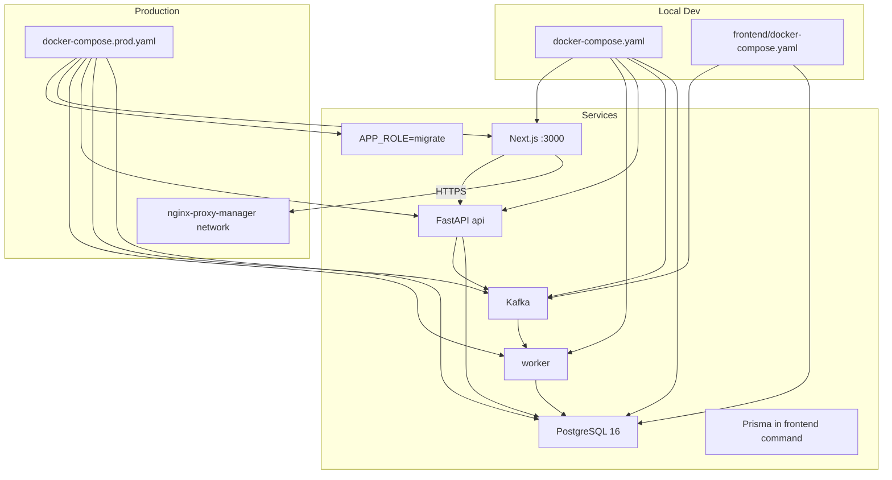
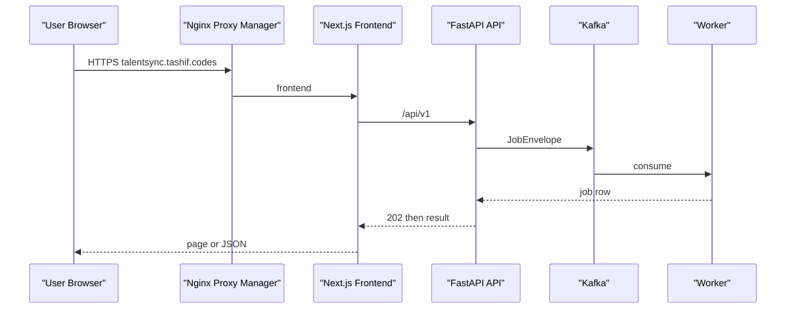
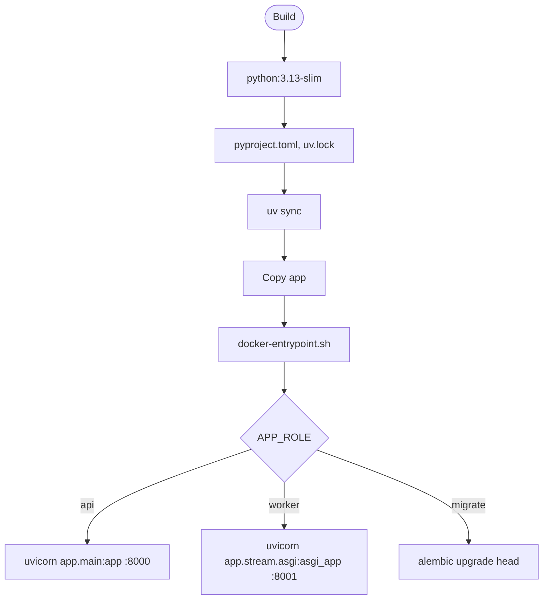
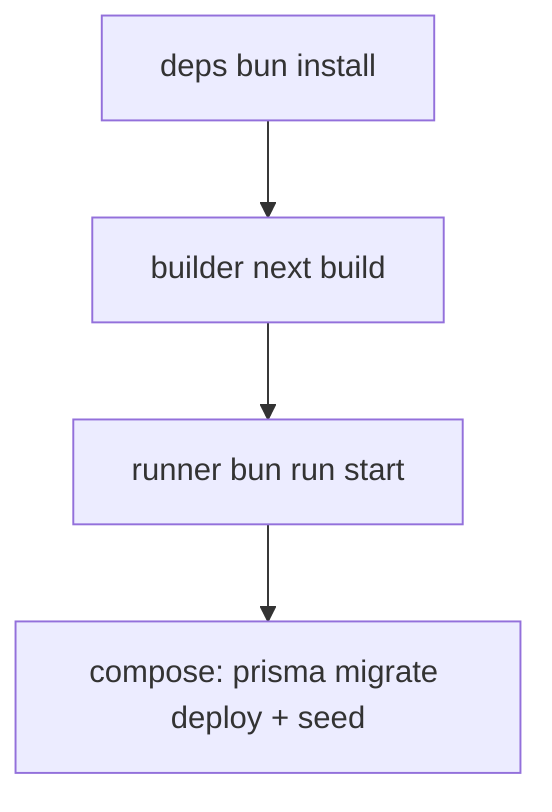
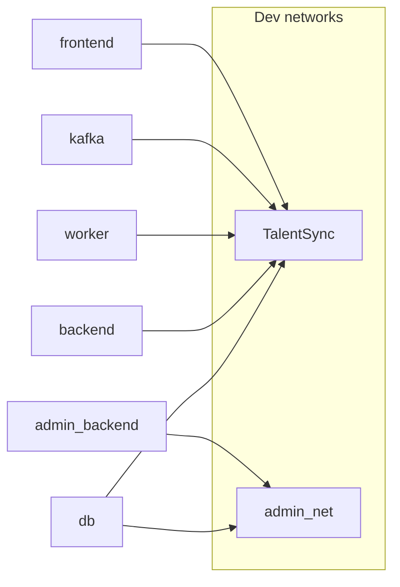
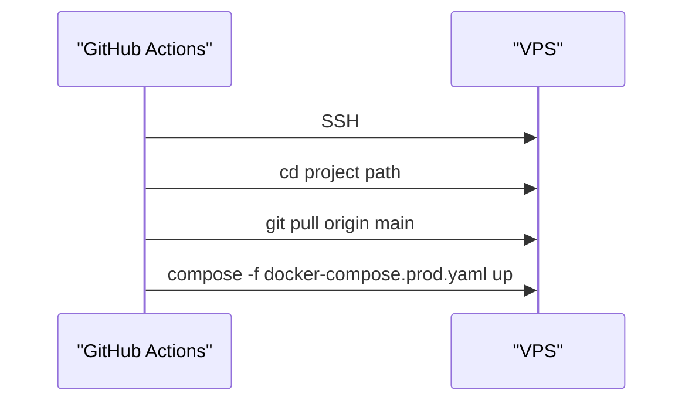
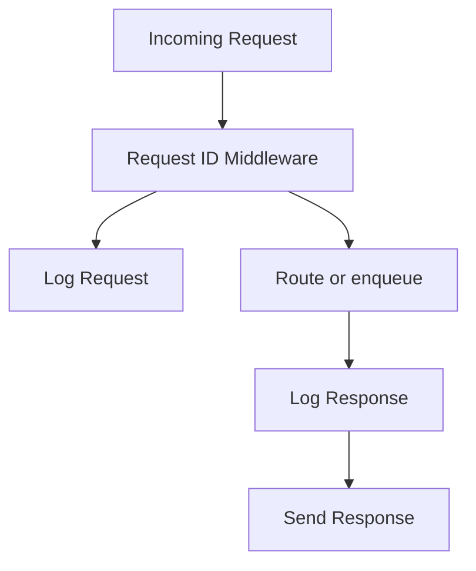
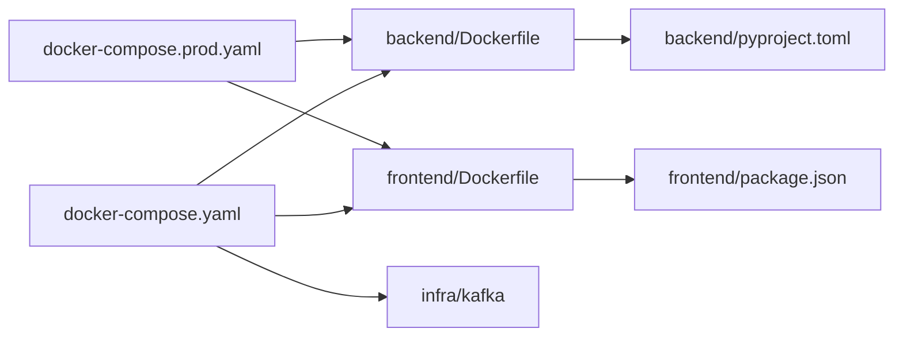

# Deployment architecture

How the job-seeker TalentSync stack is wired in Compose. Kafka is part of the mesh. This is not TalentSync-HR.

## Repository layout

- PostgreSQL 16
- FastAPI API role and FastStream workers (same image)
- Next.js frontend (Prisma migrate + seed in the container command)
- Kafka KRaft plus a one-shot topic job
- Optional admin profile and observability profile
- GitHub Actions deploy with `docker-compose.prod.yaml`

```mermaid
graph TB
subgraph "Local Dev"
DCDev["docker-compose.yaml"]
HOST["frontend/docker-compose.yaml"]
end
subgraph "Production"
DCP["docker-compose.prod.yaml"]
NPMNet["nginx-proxy-manager network"]
end
subgraph "Services"
DB["PostgreSQL 16"]
K["Kafka"]
BE["FastAPI api"]
W["worker"]
FE["Next.js :3000"]
MIG["Prisma in frontend command"]
ALEMBIC["APP_ROLE=migrate"]
end
DCDev --> DB
DCDev --> K
DCDev --> BE
DCDev --> W
DCDev --> FE
HOST --> DB
HOST --> K
DCP --> DB
DCP --> K
DCP --> BE
DCP --> W
DCP --> FE
DCP --> ALEMBIC
FE --> |"HTTPS"| NPMNet
BE --> DB
W --> DB
FE --> BE
BE --> K
K --> W
```

`frontend/docker-compose.yaml` is infra only: Postgres, Kafka, kafka-ui, Adminer. You run uvicorn and the Next app on the host.

## Building blocks

- Backend
  - Python 3.13 slim, uv, entrypoint dispatches `APP_ROLE`
  - Port 8000 (api), 8001 (worker health)
  - Uploads volume `backend/uploads`
- Frontend
  - Bun multi-stage image
  - Port 3000
  - PostHog rewrites in `next.config.js`
- Kafka
  - `apache/kafka:3.9.1`
  - Dev advertised listeners: `kafka:9092` internal, `localhost:29092` host
  - Topics: `talentsync.jobs.{resume,assessment,communication,social,interview,retry,dlq,events}.v1`
- Database
  - Healthchecked Postgres
  - Dev mounts `infra/postgres/init`

## How it fits together

NPM terminates TLS for talentsync.tashif.codes and sends traffic to the frontend. The frontend rewrites `/api/v1` to FastAPI. FastAPI enqueues AI work. Workers never sit on the public network.

```mermaid
sequenceDiagram
participant U as "User Browser"
participant RP as "Nginx Proxy Manager"
participant FE as "Next.js Frontend"
participant BE as "FastAPI API"
participant K as "Kafka"
participant W as "Worker"
U->>RP : HTTPS talentsync.tashif.codes
RP->>FE : frontend
FE->>BE : /api/v1
BE->>K : JobEnvelope
K->>W : consume
W-->>BE : job row
BE-->>FE : 202 then result
FE-->>U : page or JSON
```

## Backend containerization

```mermaid
flowchart TD
Start(["Build"]) --> Base["python:3.13-slim"]
Base --> CopyManifests["pyproject.toml, uv.lock"]
CopyManifests --> InstallDeps["uv sync"]
InstallDeps --> CopyCode["Copy app"]
CopyCode --> Entry["docker-entrypoint.sh"]
Entry --> Role{"APP_ROLE"}
Role --> |api| API["uvicorn app.main:app :8000"]
Role --> |worker| W["uvicorn app.stream.asgi:asgi_app :8001"]
Role --> |migrate| M["alembic upgrade head"]
```

## Frontend containerization

```mermaid
flowchart TD
D["deps bun install"] --> B["builder next build"]
B --> R["runner bun run start"]
R --> C["compose: prisma migrate deploy + seed"]
```

## Orchestration and networking

Local: bridge `TalentSync` plus isolated `admin_net`. Prod: `talentsync_internal_network`, `admin_network`, `nginxproxyman_network`. Prefix `talentsync_` on prod container names so TalentSync-HR can share the host.

```mermaid
graph LR
subgraph "Dev networks"
INT["TalentSync"]
ADM["admin_net"]
end
DB["db"] --> INT
DB --> ADM
BE["backend"] --> INT
W["worker"] --> INT
K["kafka"] --> INT
FE["frontend"] --> INT
AB["admin_backend"] --> ADM
```

Startup order: db healthy → kafka healthy → `kafka_topics` complete → api/worker start. Frontend waits on db healthy and backend started.

## CI/CD

```mermaid
sequenceDiagram
participant GH as "GitHub Actions"
participant VPS as "VPS"
GH->>VPS : SSH
GH->>VPS : cd project path
GH->>VPS : git pull origin main
GH->>VPS : compose -f docker-compose.prod.yaml up
```

Images can be pre-built (`BACKEND_IMAGE`, `FRONTEND_IMAGE`, admin tags).

## Environment

Root `.env`. Compose injects `DATABASE_URL` with the `db` / `talentsync_db` hostname. Host workflow uses `localhost:5432` and `localhost:29092`.

Google OAuth callback: `{BACKEND_BASE_URL}/api/v1/auth/oauth/google/callback`. Locally that is the frontend origin because of the Next rewrite.

## Logging and observability

Backend: request id middleware, Uvicorn access logs, optional OTEL (`OTEL_ENABLED`). Profile `observability` starts Prometheus (:9090) and Grafana (:3001). kafka-ui in dev for lag and DLQ.

```mermaid
flowchart TD
Req["Incoming Request"] --> Mid["Request ID Middleware"]
Mid --> LogReq["Log Request"]
Mid --> Handler["Route or enqueue"]
Handler --> LogRes["Log Response"]
LogRes --> Resp["Send Response"]
```

## Health checks

- Postgres: `pg_isready`
- Kafka: `kafka-broker-api-versions.sh`
- API: HTTP `/docs` in dev compose
- Worker: `/health` 200/204
- Admin API: `/health` on 8010

## Reverse proxy

NPM on an external network. Only frontend (and Tailscale-bound admin console) should be reachable. Workers and Kafka stay internal.

## Scaling

Horizontal scale workers by lane in prod (`worker_resume`, `worker_assessment`, `worker_comms`). API replicas are safe because interview sessions live in Postgres. Kafka replication factor 1 is an accepted single-node risk.

## Disaster recovery

Dump Postgres. If the Kafka volume dies, the reaper republishes `QUEUED` jobs from `talentsync_backend.job`. Keep uploads on a volume.

## Dependencies

```mermaid
graph LR
BE["backend/Dockerfile"] --> PyT["backend/pyproject.toml"]
FE["frontend/Dockerfile"] --> PKG["frontend/package.json"]
DCDev["docker-compose.yaml"] --> BE
DCDev --> FE
DCDev --> K["infra/kafka"]
DCP["docker-compose.prod.yaml"] --> BE
DCP --> FE
```

## Performance

uv for Python deps, Bun for JS. Do not run LLM pipelines in the API replica. Watch `ts.worker.resume` lag.

## Troubleshooting

- Healthcheck fail: Postgres credentials, Kafka volume ownership (uid 1000)
- Migrate fail: api vs migrate role, `DATABASE_URL`
- CORS / login: public origin vs `GOOGLE_REDIRECT_URI`
- AI 503: no Kafka or no worker
- Compose clash with HR: use the prod file's `talentsync_` names

## Appendix

- Confirm `.env` and Kafka bootstrap
- Confirm Alembic and Prisma both ran
- Confirm NPM TLS and `/api/v1` rewrite
- Confirm worker `/health`
- Confirm backups of Postgres, not of Kafka, as source of truth
