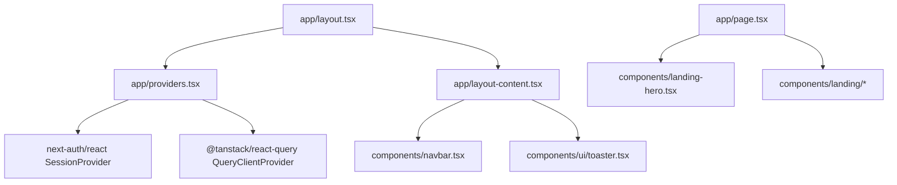
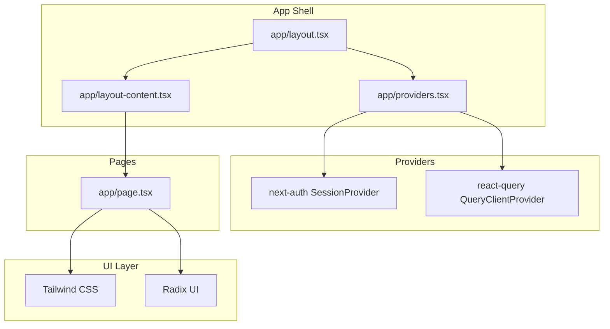
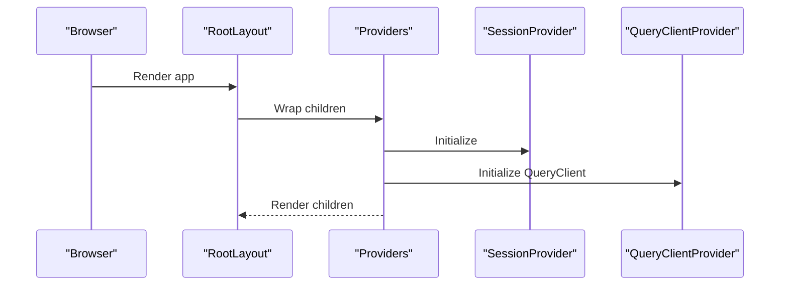
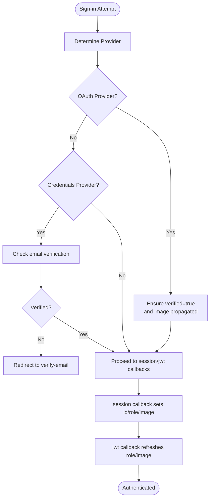
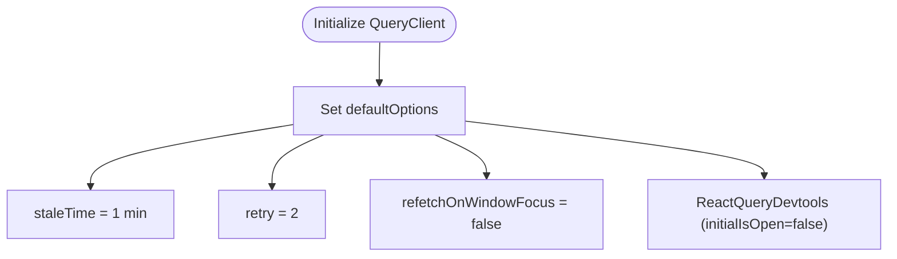
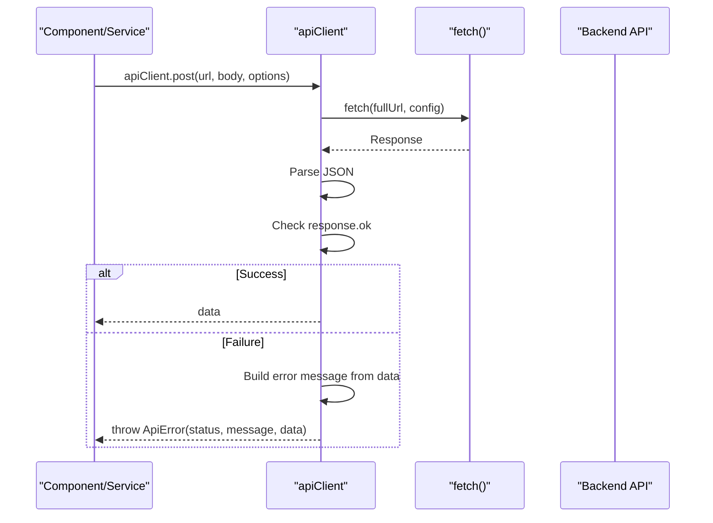
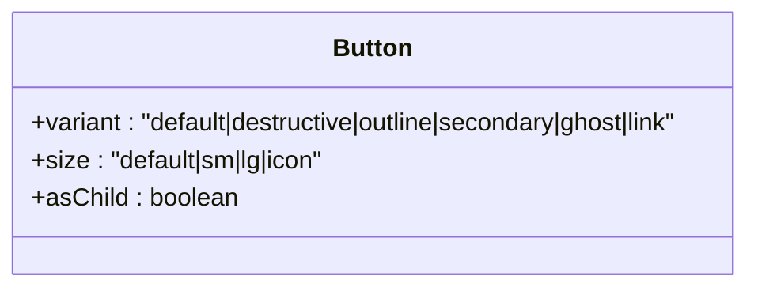
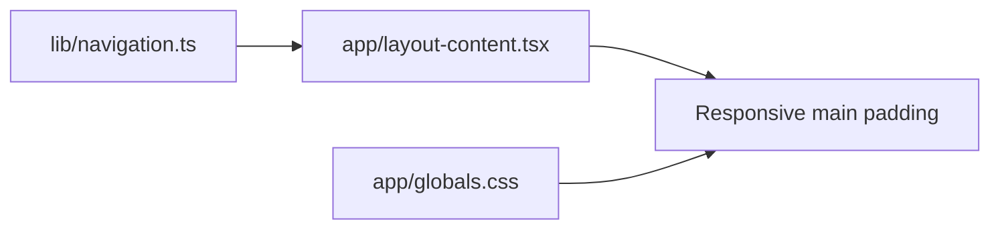
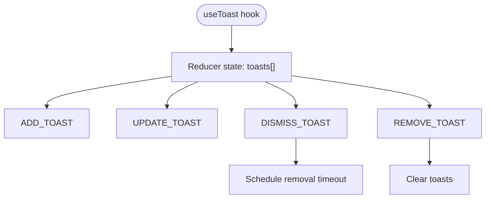
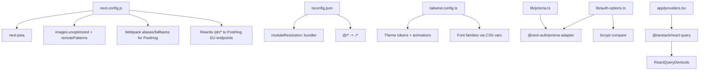

# Frontend Architecture

<cite>
**Referenced Files in This Document**
- [frontend/app/layout.tsx](file://frontend/app/layout.tsx)
- [frontend/app/layout-content.tsx](file://frontend/app/layout-content.tsx)
- [frontend/app/providers.tsx](file://frontend/app/providers.tsx)
- [frontend/app/page.tsx](file://frontend/app/page.tsx)
- [frontend/next.config.js](file://frontend/next.config.js)
- [frontend/tsconfig.json](file://frontend/tsconfig.json)
- [frontend/tailwind.config.ts](file://frontend/tailwind.config.ts)
- [frontend/app/globals.css](file://frontend/app/globals.css)
- [frontend/lib/prisma.ts](file://frontend/lib/prisma.ts)
- [frontend/lib/auth-options.ts](file://frontend/lib/auth-options.ts)
- [frontend/services/api-client.ts](file://frontend/services/api-client.ts)
- [frontend/components/ui/button.tsx](file://frontend/components/ui/button.tsx)
- [frontend/hooks/use-toast.ts](file://frontend/hooks/use-toast.ts)
- [frontend/lib/navigation.ts](file://frontend/lib/navigation.ts)
</cite>

## Table of Contents
1. [Introduction](#introduction)
2. [Project Structure](#project-structure)
3. [Core Components](#core-components)
4. [Architecture Overview](#architecture-overview)
5. [Detailed Component Analysis](#detailed-component-analysis)
6. [Dependency Analysis](#dependency-analysis)
7. [Performance Considerations](#performance-considerations)
8. [Troubleshooting Guide](#troubleshooting-guide)
9. [Conclusion](#conclusion)

## Introduction
This document describes the frontend architecture of the Next.js application. It focuses on the app router-based structure, page composition, provider pattern for state management, authentication, and data fetching. It also covers TypeScript configuration, build and deployment setup, UI framework integration with Tailwind CSS and Radix UI, SSR/SSG capabilities, performance optimization strategies, responsive design patterns, backend API integration, error handling, and loading states.

## Project Structure
The frontend follows Next.js app router conventions with a strict file-system-based routing and a layered provider pattern. The root layout composes a global stylesheet, fonts, and a Providers wrapper that exposes session and query client contexts. Pages under app define the top-level routes, while reusable UI components live under components. Services encapsulate API communication, and utilities centralize shared logic.

**Diagram sources**
- [frontend/app/layout.tsx](file://frontend/app/layout.tsx#L1-L52)
- [frontend/app/providers.tsx](file://frontend/app/providers.tsx#L1-L38)
- [frontend/app/layout-content.tsx](file://frontend/app/layout-content.tsx#L1-L34)
- [frontend/app/page.tsx](file://frontend/app/page.tsx#L1-L27)

**Section sources**
- [frontend/app/layout.tsx](file://frontend/app/layout.tsx#L1-L52)
- [frontend/app/layout-content.tsx](file://frontend/app/layout-content.tsx#L1-L34)
- [frontend/app/providers.tsx](file://frontend/app/providers.tsx#L1-L38)
- [frontend/app/page.tsx](file://frontend/app/page.tsx#L1-L27)

## Core Components
- Root layout: Defines metadata, fonts, PWA manifest, and wraps children with Providers and LayoutContent.
- Providers: Initializes NextAuth session provider and React Query client with caching and retry policies.
- Layout content: Renders Navbar, main content area with dynamic sidebar padding, and global Toaster.
- Global styles: Tailwind base/components/utilities plus CSS variables for theme tokens and responsive utilities.
- Navigation: Typed navigation items and icons for desktop and mobile layouts.
- UI primitives: Radix UI-based components (e.g., Button) with Tailwind variants and class variance authority.

**Section sources**
- [frontend/app/layout.tsx](file://frontend/app/layout.tsx#L1-L52)
- [frontend/app/providers.tsx](file://frontend/app/providers.tsx#L1-L38)
- [frontend/app/layout-content.tsx](file://frontend/app/layout-content.tsx#L1-L34)
- [frontend/app/globals.css](file://frontend/app/globals.css#L1-L344)
- [frontend/lib/navigation.ts](file://frontend/lib/navigation.ts#L1-L116)
- [frontend/components/ui/button.tsx](file://frontend/components/ui/button.tsx#L1-L57)

## Architecture Overview
The application uses a layered provider pattern:
- Authentication: next-auth/react session provider supplies JWT-based sessions and user data.
- Data fetching: React Query manages server state, caching, retries, and background refetch policies.
- UI: Tailwind CSS and Radix UI components form a cohesive design system with theme tokens and animations.
- Routing: App router pages and nested groups organize feature areas and API routes.

**Diagram sources**
- [frontend/app/layout.tsx](file://frontend/app/layout.tsx#L1-L52)
- [frontend/app/layout-content.tsx](file://frontend/app/layout-content.tsx#L1-L34)
- [frontend/app/providers.tsx](file://frontend/app/providers.tsx#L1-L38)
- [frontend/app/page.tsx](file://frontend/app/page.tsx#L1-L27)
- [frontend/tailwind.config.ts](file://frontend/tailwind.config.ts#L1-L135)
- [frontend/components/ui/button.tsx](file://frontend/components/ui/button.tsx#L1-L57)

## Detailed Component Analysis

### Provider Pattern: Authentication and Data Fetching
The Providers component initializes:
- SessionProvider for NextAuth, enabling client-side session reads and updates.
- QueryClient with a defaultOptions configuration:
  - Stale time of 1 minute.
  - Retry attempts set to 2.
  - Disables refetch on window focus to reduce unnecessary network activity.

**Diagram sources**
- [frontend/app/layout.tsx](file://frontend/app/layout.tsx#L23-L51)
- [frontend/app/providers.tsx](file://frontend/app/providers.tsx#L13-L37)

**Section sources**
- [frontend/app/providers.tsx](file://frontend/app/providers.tsx#L1-L38)

### Authentication: NextAuth Options and Callbacks
Authentication is configured via next-auth with:
- Multiple providers: credentials, Google, GitHub, Email.
- Prisma adapter for user persistence.
- Session strategy: JWT.
- Callbacks:
  - signIn: Verifies email for credentials, auto-verifies OAuth users, ensures profile image propagation.
  - session: Injects user id and role into session.
  - jwt: Refreshes token payload with latest user role and image.
- Events:
  - createUser: Marks OAuth users as verified.

**Diagram sources**
- [frontend/lib/auth-options.ts](file://frontend/lib/auth-options.ts#L10-L202)

**Section sources**
- [frontend/lib/auth-options.ts](file://frontend/lib/auth-options.ts#L1-L202)

### Data Fetching: React Query Defaults and Devtools
React Query is configured with:
- StaleTime: 1 minute to balance freshness and performance.
- Retry: Up to two attempts on failure.
- RefetchOnWindowFocus: Disabled to avoid excessive background refetches.
- Devtools: Conditionally enabled in development.

**Diagram sources**
- [frontend/app/providers.tsx](file://frontend/app/providers.tsx#L14-L27)

**Section sources**
- [frontend/app/providers.tsx](file://frontend/app/providers.tsx#L1-L38)

### API Client: Request Abstraction and Error Handling
The apiClient module provides a typed HTTP client:
- Methods: get, post, put, patch, delete.
- Automatic query string building and JSON serialization for non-FormData bodies.
- Unified error handling:
  - Parses error messages from response data (message, detail, error).
  - Throws ApiError with status and parsed message.
  - Wraps network errors into ApiError with status 500.

**Diagram sources**
- [frontend/services/api-client.ts](file://frontend/services/api-client.ts#L25-L98)

**Section sources**
- [frontend/services/api-client.ts](file://frontend/services/api-client.ts#L1-L125)

### UI Framework: Tailwind CSS and Radix UI
- Tailwind configuration:
  - Dark mode via class strategy.
  - Theme extension with semantic color tokens, brand colors, and animations.
  - Font families bound to CSS variables from next/font/google.
- Radix UI primitives:
  - Button component uses class-variance-authority for variants and sizes.
  - Consistent design tokens and motion through Tailwind classes.

**Diagram sources**
- [frontend/components/ui/button.tsx](file://frontend/components/ui/button.tsx#L36-L56)
- [frontend/tailwind.config.ts](file://frontend/tailwind.config.ts#L10-L132)

**Section sources**
- [frontend/tailwind.config.ts](file://frontend/tailwind.config.ts#L1-L135)
- [frontend/components/ui/button.tsx](file://frontend/components/ui/button.tsx#L1-L57)

### Navigation and Layout Composition
- Navigation items and icons are centralized for desktop and mobile views.
- LayoutContent manages sidebar collapse state and adjusts main content padding responsively.
- Global styles define theme tokens and responsive utilities for safe areas and mobile navigation spacing.

**Diagram sources**
- [frontend/lib/navigation.ts](file://frontend/lib/navigation.ts#L1-L116)
- [frontend/app/layout-content.tsx](file://frontend/app/layout-content.tsx#L8-L24)
- [frontend/app/globals.css](file://frontend/app/globals.css#L184-L344)

**Section sources**
- [frontend/lib/navigation.ts](file://frontend/lib/navigation.ts#L1-L116)
- [frontend/app/layout-content.tsx](file://frontend/app/layout-content.tsx#L1-L34)
- [frontend/app/globals.css](file://frontend/app/globals.css#L1-L344)

### Shared Utilities and Services
- Prisma client initialization with global singleton pattern for development isolation.
- Toast manager with reducer-based state, timeouts, and dismissal logic for user feedback.

**Diagram sources**
- [frontend/hooks/use-toast.ts](file://frontend/hooks/use-toast.ts#L74-L127)

**Section sources**
- [frontend/lib/prisma.ts](file://frontend/lib/prisma.ts#L1-L10)
- [frontend/hooks/use-toast.ts](file://frontend/hooks/use-toast.ts#L1-L192)

## Dependency Analysis
Key external dependencies and integrations:
- next-pwa: Enables PWA features with service worker registration and skipWaiting.
- next.config.js: Image optimization settings, webpack fixes for PostHog, and rewrites for analytics.
- next-font-google: Font variables injected into CSS variables for Tailwind usage.
- next-auth: Authentication with Prisma adapter and multiple providers.
- @tanstack/react-query: Centralized caching and retry logic for API data.
- Tailwind CSS: Utility-first CSS with theme tokens and animations.
- Radix UI: Accessible UI primitives integrated with Tailwind variants.

**Diagram sources**
- [frontend/next.config.js](file://frontend/next.config.js#L1-L90)
- [frontend/tsconfig.json](file://frontend/tsconfig.json#L1-L43)
- [frontend/tailwind.config.ts](file://frontend/tailwind.config.ts#L1-L135)
- [frontend/lib/auth-options.ts](file://frontend/lib/auth-options.ts#L1-L202)
- [frontend/lib/prisma.ts](file://frontend/lib/prisma.ts#L1-L10)
- [frontend/app/providers.tsx](file://frontend/app/providers.tsx#L1-L38)

**Section sources**
- [frontend/next.config.js](file://frontend/next.config.js#L1-L90)
- [frontend/tsconfig.json](file://frontend/tsconfig.json#L1-L43)
- [frontend/tailwind.config.ts](file://frontend/tailwind.config.ts#L1-L135)
- [frontend/lib/auth-options.ts](file://frontend/lib/auth-options.ts#L1-L202)
- [frontend/lib/prisma.ts](file://frontend/lib/prisma.ts#L1-L10)
- [frontend/app/providers.tsx](file://frontend/app/providers.tsx#L1-L38)

## Performance Considerations
- React Query defaults:
  - StaleTime reduces redundant network calls.
  - Retry improves resilience without manual intervention.
  - Disabling refetchOnWindowFocus minimizes background traffic.
- PWA:
  - Service worker registration and skipWaiting improve offline readiness and update behavior.
- Image optimization:
  - Remote patterns for trusted avatars; unoptimized images to avoid extra processing overhead.
- Webpack fixes:
  - Aliases and replacements prevent PostHog Node APIs from bundling in the browser.
- Tailwind:
  - CSS variables and theme tokens enable efficient runtime switching and minimal CSS output.
- Build configuration:
  - Bundler module resolution and incremental compilation optimize rebuild times.

[No sources needed since this section provides general guidance]

## Troubleshooting Guide
- Authentication:
  - Ensure NEXTAUTH_SECRET and provider credentials are set in environment variables.
  - Verify Prisma adapter connection and user records.
  - Check signIn callback logic for email verification and OAuth image propagation.
- API client:
  - Inspect ApiError thrown on non-OK responses; review message/detail/error fields.
  - Confirm request body serialization and Content-Type handling for FormData vs JSON.
- React Query:
  - Adjust staleTime/retry based on data volatility.
  - Use ReactQueryDevtools to inspect cache state and refetch triggers.
- Navigation and layout:
  - Validate navigation items and icons; ensure responsive padding adapts to sidebar collapse.
- Styling:
  - Confirm Tailwind content globs include all component paths.
  - Verify CSS variables for theme tokens are present in :root and .dark.

**Section sources**
- [frontend/lib/auth-options.ts](file://frontend/lib/auth-options.ts#L1-L202)
- [frontend/services/api-client.ts](file://frontend/services/api-client.ts#L13-L98)
- [frontend/app/providers.tsx](file://frontend/app/providers.tsx#L14-L27)
- [frontend/lib/navigation.ts](file://frontend/lib/navigation.ts#L1-L116)
- [frontend/tailwind.config.ts](file://frontend/tailwind.config.ts#L1-L135)

## Conclusion
The frontend leverages Next.js app router for structured routing, a robust provider pattern for authentication and data fetching, and a cohesive UI system powered by Tailwind CSS and Radix UI. The configuration emphasizes performance, developer experience, and maintainability through React Query defaults, PWA support, and a strongly typed TypeScript setup. The architecture supports scalable feature growth while preserving responsive design and consistent theming.