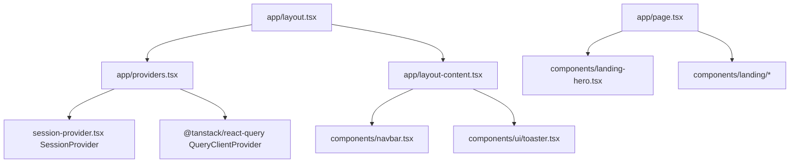
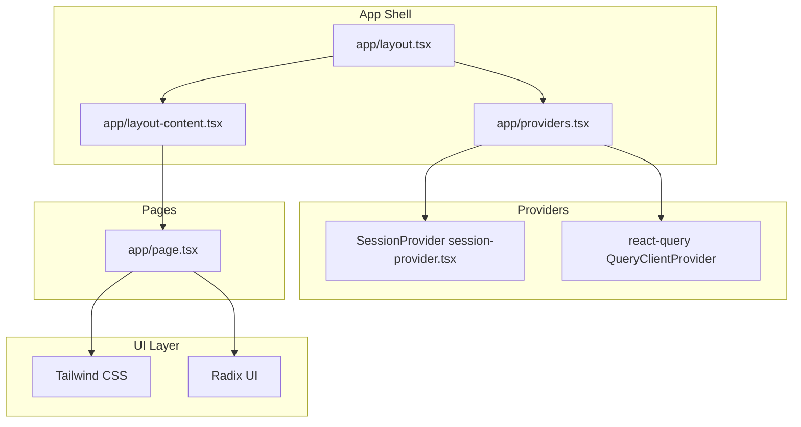
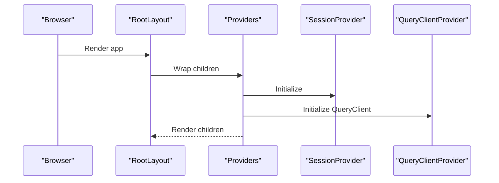
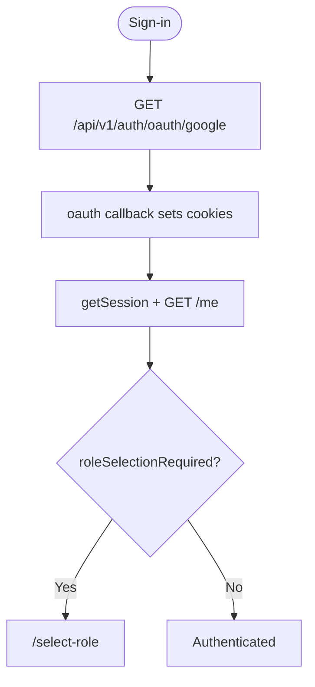
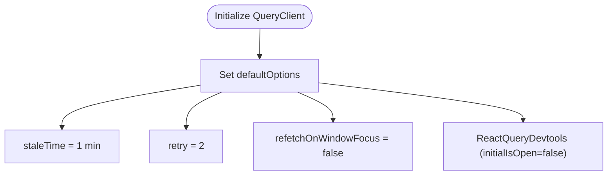
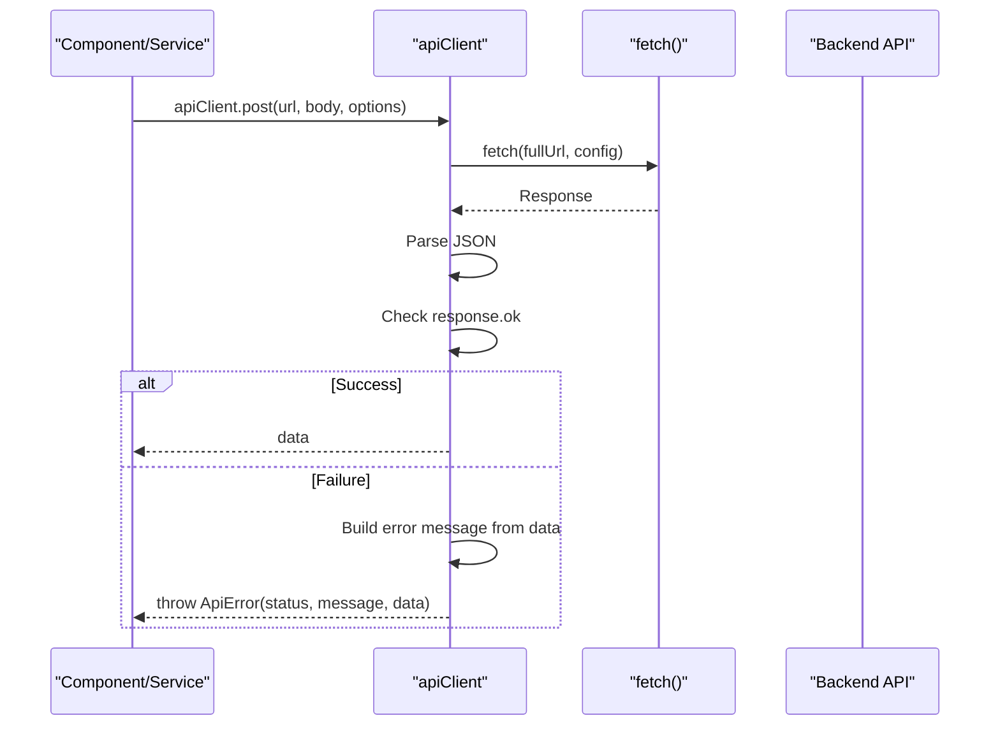
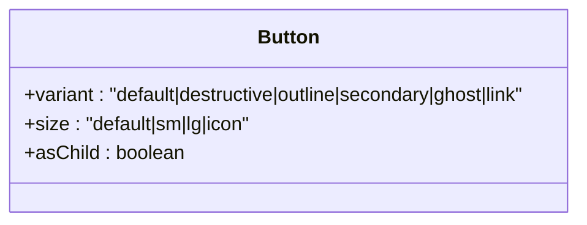
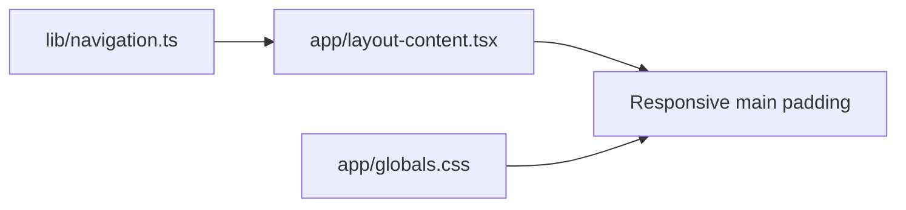
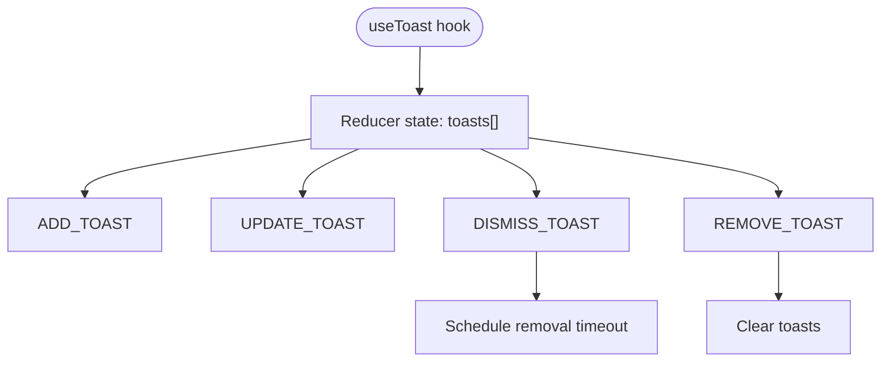
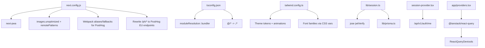

# Frontend architecture

The frontend architecture of the Next.js application.

## Repository layout
The frontend follows Next.js app router conventions with a strict file-system-based routing and a layered provider pattern. The root layout composes a global stylesheet, fonts, and a Providers wrapper that exposes session and query client contexts. Pages under app define the top-level routes, while reusable UI components live under components. Services encapsulate API communication, and utilities centralize shared logic.

```mermaid
graph TB
A["app/layout.tsx"] --> B["app/providers.tsx"]
A --> C["app/layout-content.tsx"]
C --> D["components/navbar.tsx"]
C --> E["components/ui/toaster.tsx"]
B --> F["session-provider.tsx SessionProvider"]
B --> G["@tanstack/react-query QueryClientProvider"]
H["app/page.tsx"] --> I["components/landing-hero.tsx"]
H --> J["components/landing/*"]
```

## Building blocks
- Root layout: Defines metadata, fonts, PWA manifest, and wraps children with Providers and LayoutContent.
- Providers: FastAPI `SessionProvider` plus React Query with caching and retry policies.
- Layout content: Renders Navbar, main content area with dynamic sidebar padding, and global Toaster.
- Global styles: Tailwind base/components/utilities plus CSS variables for theme tokens and responsive utilities.
- Navigation: Typed navigation items and icons for desktop and mobile layouts.
- UI primitives: Radix UI-based components (e.g., Button) with Tailwind variants and class variance authority.

## How it fits together
The application uses a layered provider pattern:
- Authentication: `session-provider.tsx` talks to `/api/v1/auth/me`. Server uses `getSession()`.
- Data fetching: React Query manages server state, caching, retries, and background refetch policies.
- UI: Tailwind CSS and Radix UI components form a cohesive design system with theme tokens and animations.
- Routing: App router pages and nested groups organize feature areas and API routes.

```mermaid
graph TB
subgraph "App Shell"
L["app/layout.tsx"]
LC["app/layout-content.tsx"]
P["app/providers.tsx"]
end
subgraph "Providers"
S["SessionProvider session-provider.tsx"]
Q["react-query QueryClientProvider"]
end
subgraph "Pages"
HP["app/page.tsx"]
end
subgraph "UI Layer"
T["Tailwind CSS"]
R["Radix UI"]
end
L --> P
L --> LC
P --> S
P --> Q
LC --> HP
HP --> T
HP --> R
```

## Provider pattern: authentication and data fetching
The Providers component initializes:
- `SessionProvider` for FastAPI cookies, enabling client-side session reads and `/me` refresh.
- QueryClient with a defaultOptions configuration:
 - Stale time of 1 minute.
 - Retry attempts set to 2.
 - Disables refetch on window focus to reduce unnecessary network activity.

```mermaid
sequenceDiagram
participant Browser as "Browser"
participant Layout as "RootLayout"
participant Providers as "Providers"
participant Session as "SessionProvider"
participant Query as "QueryClientProvider"
Browser->>Layout : Render app
Layout->>Providers : Wrap children
Providers->>Session : Initialize
Providers->>Query : Initialize QueryClient
Providers-->>Layout : Render children
```

## Authentication: FastAPI cookies and getSession

NextAuth is gone. Sign-in is Google on FastAPI.

- `getSession()` in `lib/session.ts` verifies `ts_access_token` and loads Prisma `User`.
- `SessionProvider` GETs `/api/v1/auth/me` and POSTs `/api/v1/auth/refresh`.
- `signIn("google")` navigates to `/api/v1/auth/oauth/google`.
- Role lives on `User.role`. First OAuth login may set `roleSelectionRequired`.

```mermaid
flowchart TD
Start(["Sign-in"]) --> Google["GET /api/v1/auth/oauth/google"]
Google --> Callback["oauth callback sets cookies"]
Callback --> Hydrate["getSession + GET /me"]
Hydrate --> Role{"roleSelectionRequired?"}
Role --> |Yes| Select["/select-role"]
Role --> |No| Done["Authenticated"]
```

## Data fetching: React query defaults and devtools
React Query is configured :
- StaleTime: 1 minute to balance freshness and performance.
- Retry: Up to two attempts on failure.
- RefetchOnWindowFocus: Disabled to avoid excessive background refetches.
- Devtools: Conditionally enabled in development.

```mermaid
flowchart TD
Init(["Initialize QueryClient"]) --> SetDefaults["Set defaultOptions"]
SetDefaults --> Stale["staleTime = 1 min"]
SetDefaults --> Retry["retry = 2"]
SetDefaults --> Refocus["refetchOnWindowFocus = false"]
SetDefaults --> Devtools["ReactQueryDevtools (initialIsOpen=false)"]
```

## API client: request abstraction and error handling
The apiClient module is a typed HTTP client:
- Methods: get, post, put, patch, delete.
- Automatic query string building and JSON serialization for non-FormData bodies.
- Unified error handling:
 - Parses error messages from response data (message, detail, error).
 - Throws ApiError with status and parsed message.
 - Wraps network errors into ApiError with status 500.

```mermaid
sequenceDiagram
participant Caller as "Component/Service"
participant Api as "apiClient"
participant Fetch as "fetch()"
participant Server as "Backend API"
Caller->>Api : apiClient.post(url, body, options)
Api->>Fetch : fetch(fullUrl, config)
Fetch-->>Api : Response
Api->>Api : Parse JSON
Api->>Api : Check response.ok
alt Success
Api-->>Caller : data
else Failure
Api->>Api : Build error message from data
Api-->>Caller : throw ApiError(status, message, data)
end
```

## UI framework: tailwind CSS and radix UI
- Tailwind configuration:
 - Dark mode via class strategy.
 - Theme extension with semantic color tokens, brand colors, and animations.
 - Font families bound to CSS variables from next/font/google.
- Radix UI primitives:
 - Button component uses class-variance-authority for variants and sizes.
 - Consistent design tokens and motion through Tailwind classes.

```mermaid
classDiagram
class Button {
+variant : "default|destructive|outline|secondary|ghost|link"
+size : "default|sm|lg|icon"
+asChild : boolean
}
```

## Navigation and layout composition
- Navigation items and icons are centralized for desktop and mobile views.
- LayoutContent manages sidebar collapse state and adjusts main content padding responsively.
- Global styles define theme tokens and responsive utilities for safe areas and mobile navigation spacing.

```mermaid
graph LR
Nav["lib/navigation.ts"] --> Layout["app/layout-content.tsx"]
Layout --> Main["Responsive main padding"]
Styles["app/globals.css"] --> Main
```

## Shared utilities and services
- Prisma client initialization with global singleton pattern for development isolation.
- Toast manager with reducer-based state, timeouts, and dismissal logic for user feedback.

```mermaid
flowchart TD
Start(["useToast hook"]) --> State["Reducer state: toasts[]"]
State --> Add["ADD_TOAST"]
State --> Update["UPDATE_TOAST"]
State --> Dismiss["DISMISS_TOAST"]
State --> Remove["REMOVE_TOAST"]
Dismiss --> Queue["Schedule removal timeout"]
Remove --> Clear["Clear toasts"]
```

## Dependencies
Key external dependencies and integrations:
- next-pwa: Enables PWA features with service worker registration and skipWaiting.
- next.config.js: Image optimization settings, webpack fixes for PostHog, and rewrites for analytics.
- next-font-google: Font variables injected into CSS variables for Tailwind usage.
- jose + `session.ts`: verify FastAPI access JWT. No `next-auth` package.
- @tanstack/react-query: Centralized caching and retry logic for API data.
- Tailwind CSS: Utility-first CSS with theme tokens and animations.
- Radix UI: Accessible UI primitives integrated with Tailwind variants.

```mermaid
graph TB
NQ["next.config.js"] --> PWA["next-pwa"]
NQ --> Images["images.unoptimized + remotePatterns"]
NQ --> WebpackFix["Webpack aliases/fallbacks for PostHog"]
NQ --> Rewrites["Rewrite /ph/* to PostHog EU endpoints"]
TS["tsconfig.json"] --> Bundler["moduleResolution: bundler"]
TS --> Paths["@/* -> ./*"]
TW["tailwind.config.ts"] --> Tokens["Theme tokens + animations"]
TW --> Fonts["Font families via CSS vars"]
SESS["lib/session.ts"] --> JOSE["jose jwtVerify"]
SESS --> PRISMA["lib/prisma.ts"]
SP["session-provider.tsx"] --> ME["/api/v1/auth/me"]
QC["app/providers.tsx"] --> RQ["@tanstack/react-query"]
RQ --> Devtools["ReactQueryDevtools"]
```

## Performance
- React Query defaults:
 - StaleTime reduces redundant network calls.
 - Retry improves resilience without manual intervention.
 - Disabling refetchOnWindowFocus minimizes background traffic.
- PWA:
 - Service worker registration and skipWaiting improve offline readiness and update behavior.
- Image optimization:
 - Remote patterns for trusted avatars; unoptimized images to avoid extra processing overhead.
- Webpack fixes:
 - Aliases and replacements prevent PostHog Node APIs from bundling in the browser.
- Tailwind:
 - CSS variables and theme tokens enable efficient runtime switching and minimal CSS output.
- Build configuration:
 - Bundler module resolution and incremental compilation optimize rebuild times.

[No sources needed since this section provides general guidance]

## Troubleshooting
- Authentication:
 - Set `BACKEND_JWT_SECRET` to the backend `JWT_SECRET`.
 - Set Google client id/secret and redirect URI.
 - Confirm `User` row exists for the JWT `sub`.
- API client:
 - Inspect ApiError thrown on non-OK responses; review message/detail/error fields.
 - Confirm request body serialization and Content-Type handling for FormData vs JSON.
- React Query:
 - Adjust staleTime/retry based on data volatility.
 - Use ReactQueryDevtools to inspect cache state and refetch triggers.
- Navigation and layout:
 - Validate navigation items and icons; ensure responsive padding adapts to sidebar collapse.
- Styling:
 - Confirm Tailwind content globs include all component paths.
 - Verify CSS variables for theme tokens are present in :root and .dark.
