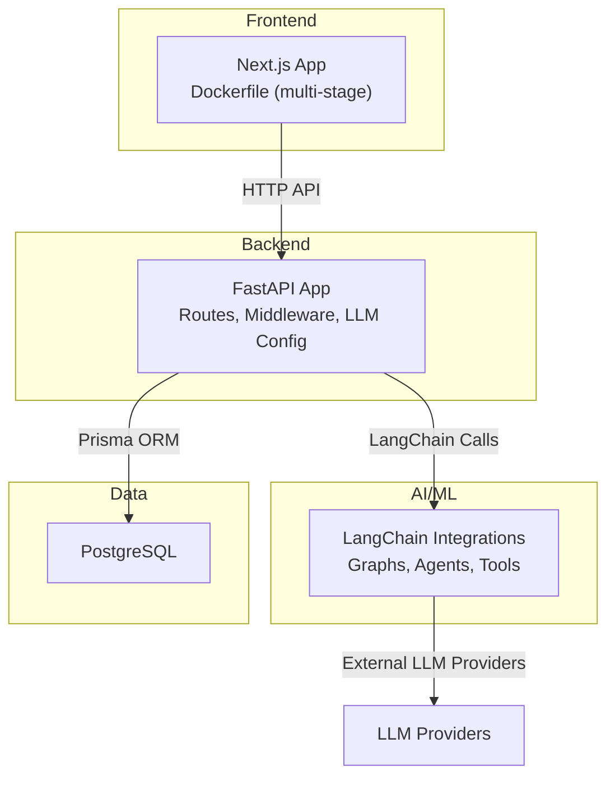
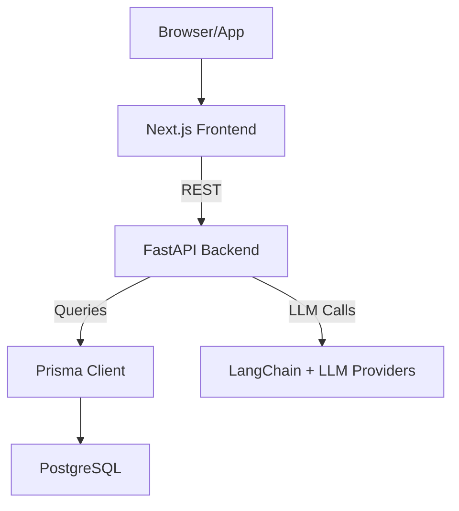
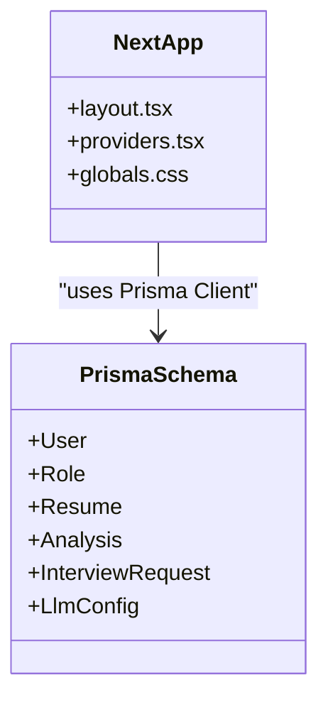
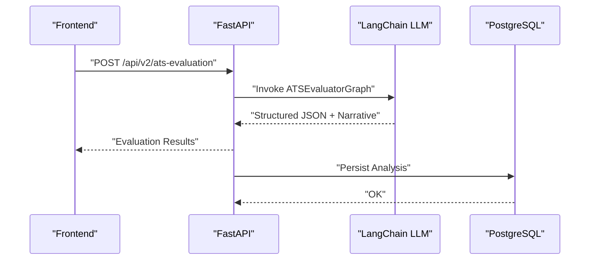
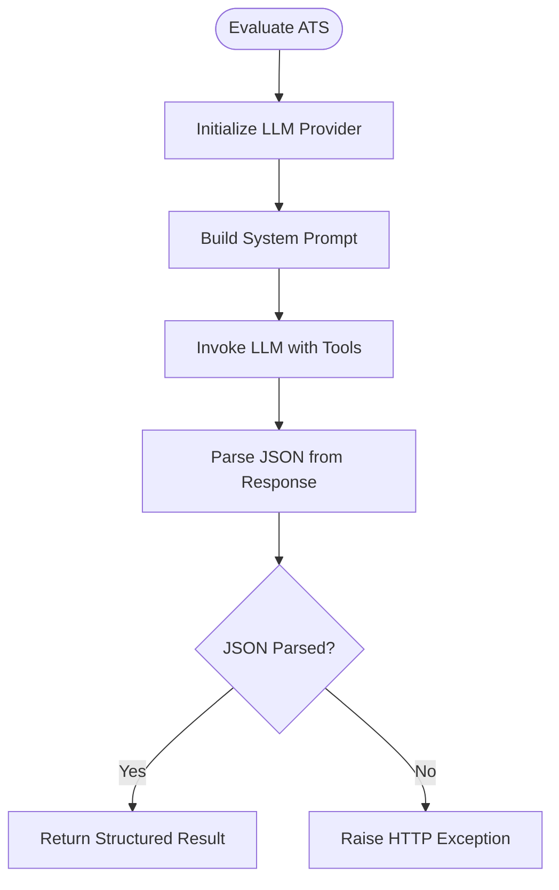
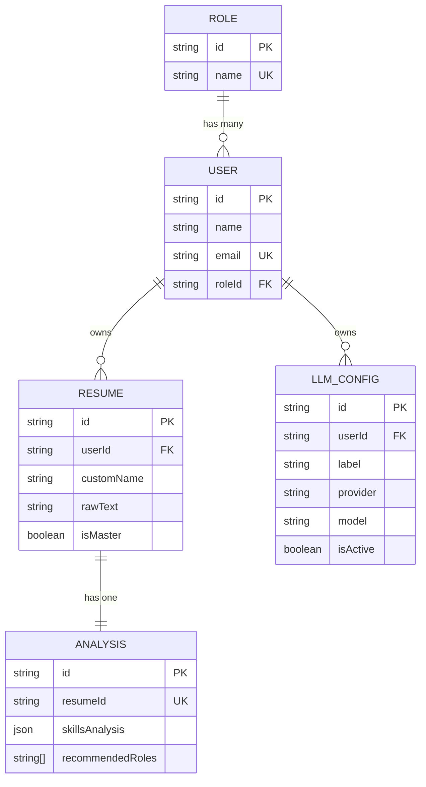
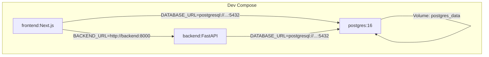

# System Architecture

<cite>
**Referenced Files in This Document**
- [docker-compose.yaml](file://docker-compose.yaml)
- [docker-compose.prod.yaml](file://docker-compose.prod.yaml)
- [backend/app/main.py](file://backend/app/main.py)
- [backend/pyproject.toml](file://backend/pyproject.toml)
- [backend/app/core/settings.py](file://backend/app/core/settings.py)
- [backend/app/core/llm.py](file://backend/app/core/llm.py)
- [backend/app/services/ats_evaluator/graph.py](file://backend/app/services/ats_evaluator/graph.py)
- [frontend/Dockerfile](file://frontend/Dockerfile)
- [frontend/package.json](file://frontend/package.json)
- [frontend/.env](file://frontend/.env)
- [frontend/app/layout.tsx](file://frontend/app/layout.tsx)
- [frontend/prisma/schema.prisma](file://frontend/prisma/schema.prisma)
- [readme.md](file://readme.md)
</cite>

## Table of Contents
1. [Introduction](#introduction)
2. [Project Structure](#project-structure)
3. [Core Components](#core-components)
4. [Architecture Overview](#architecture-overview)
5. [Detailed Component Analysis](#detailed-component-analysis)
6. [Dependency Analysis](#dependency-analysis)
7. [Performance Considerations](#performance-considerations)
8. [Troubleshooting Guide](#troubleshooting-guide)
9. [Conclusion](#conclusion)

## Introduction
This document describes the system architecture of the TalentSync-Normies platform. The system follows a microservices architecture with three primary components:
- Frontend: Next.js application serving the user interface and client-side logic.
- Backend: FastAPI service exposing REST APIs and orchestrating AI/ML workflows.
- AI/ML Service: Integrated LangChain-based pipeline for resume analysis, ATS evaluation, cover letter generation, cold outreach, and interview assistance.
- Database: PostgreSQL storing user data, resumes, analyses, and related artifacts.

The platform is containerized with Docker and orchestrated via docker-compose. It supports development and production deployments with distinct compose configurations.

## Project Structure
The repository is organized into four major areas:
- frontend: Next.js application with TypeScript, Prisma ORM, and UI components.
- backend: FastAPI application with routing, middleware, AI/ML integrations, and data models.
- analysis: Jupyter notebook and ML assets for resume analysis experiments.
- .github/workflows: CI/CD pipeline configuration for deployment.

**Diagram sources**
- [frontend/Dockerfile](file://frontend/Dockerfile#L1-L110)
- [backend/app/main.py](file://backend/app/main.py#L157-L203)
- [backend/app/core/llm.py](file://backend/app/core/llm.py#L31-L107)
- [frontend/prisma/schema.prisma](file://frontend/prisma/schema.prisma#L1-L262)

**Section sources**
- [readme.md](file://readme.md#L52-L72)

## Core Components
- Frontend (Next.js)
  - Responsible for presentation, user interactions, and API consumption.
  - Uses Prisma for database operations and NextAuth for authentication.
  - Built with a multi-stage Dockerfile optimized for production.
- Backend (FastAPI)
  - Exposes REST endpoints under /api/v1 and /api/v2.
  - Implements request ID tracing, request/response logging, and CORS.
  - Integrates LangChain for AI/ML workflows and supports multiple LLM providers.
- AI/ML Service
  - LangChain graphs and agents for structured workflows (e.g., ATS evaluation).
  - Supports tooling (e.g., Tavily search) and provider-agnostic LLM selection.
- Database (PostgreSQL)
  - Schema includes users, roles, resumes, analyses, interview requests, and LLM configurations.
  - Migrations and seeding orchestrated during container startup.

**Section sources**
- [frontend/package.json](file://frontend/package.json#L17-L86)
- [frontend/Dockerfile](file://frontend/Dockerfile#L1-L110)
- [backend/app/main.py](file://backend/app/main.py#L63-L203)
- [backend/app/core/llm.py](file://backend/app/core/llm.py#L31-L107)
- [frontend/prisma/schema.prisma](file://frontend/prisma/schema.prisma#L10-L262)

## Architecture Overview
The system employs a clear separation of concerns:
- Presentation Layer: Next.js handles UI rendering, routing, and client-side state.
- Business Logic Layer: FastAPI manages authentication, request validation, orchestration, and persistence via Prisma.
- Data Layer: PostgreSQL persists all application data with Prisma-generated client.

Communication patterns:
- Frontend communicates with Backend via HTTP REST endpoints.
- Backend integrates with external LLM providers through LangChain abstractions.
- Database access is performed through Prisma ORM in the frontend and backend.

**Diagram sources**
- [frontend/app/layout.tsx](file://frontend/app/layout.tsx#L23-L51)
- [backend/app/main.py](file://backend/app/main.py#L157-L203)
- [frontend/prisma/schema.prisma](file://frontend/prisma/schema.prisma#L1-L262)
- [backend/app/core/llm.py](file://backend/app/core/llm.py#L31-L107)

## Detailed Component Analysis

### Frontend (Next.js)
- Technology stack includes Next.js, Prisma, NextAuth, Radix UI, and Recharts.
- Multi-stage Docker build optimizes production image size and startup time.
- Environment variables include database URL, backend URL, OAuth credentials, and analytics keys.
- Layout composes providers and content for consistent theming and state.

**Diagram sources**
- [frontend/app/layout.tsx](file://frontend/app/layout.tsx#L23-L51)
- [frontend/prisma/schema.prisma](file://frontend/prisma/schema.prisma#L10-L262)

**Section sources**
- [frontend/package.json](file://frontend/package.json#L17-L86)
- [frontend/Dockerfile](file://frontend/Dockerfile#L1-L110)
- [frontend/.env](file://frontend/.env#L1-L27)
- [frontend/app/layout.tsx](file://frontend/app/layout.tsx#L23-L51)
- [frontend/prisma/schema.prisma](file://frontend/prisma/schema.prisma#L10-L262)

### Backend (FastAPI)
- Centralized application factory with lifecycle hooks, middleware, and CORS.
- Routes grouped by feature (ATS, resume analysis, hiring assistant, cover letter, etc.) across v1 and v2.
- LLM configuration supports multiple providers (OpenAI, Anthropic, Google, Ollama, OpenRouter, DeepSeek).
- Structured logging and request tracing for observability.

**Diagram sources**
- [backend/app/main.py](file://backend/app/main.py#L157-L203)
- [backend/app/core/llm.py](file://backend/app/core/llm.py#L110-L176)
- [backend/app/services/ats_evaluator/graph.py](file://backend/app/services/ats_evaluator/graph.py#L116-L202)

**Section sources**
- [backend/app/main.py](file://backend/app/main.py#L63-L203)
- [backend/app/core/settings.py](file://backend/app/core/settings.py#L21-L44)
- [backend/app/core/llm.py](file://backend/app/core/llm.py#L31-L107)
- [backend/app/services/ats_evaluator/graph.py](file://backend/app/services/ats_evaluator/graph.py#L41-L114)

### AI/ML Integration (LangChain)
- Provider-agnostic LLM creation with temperature support and fallbacks.
- ATSEvaluatorGraph composes a LangGraph workflow with optional tool binding (e.g., Tavily search).
- JSON extraction and error handling for structured outputs.

**Diagram sources**
- [backend/app/core/llm.py](file://backend/app/core/llm.py#L110-L176)
- [backend/app/services/ats_evaluator/graph.py](file://backend/app/services/ats_evaluator/graph.py#L116-L202)

**Section sources**
- [backend/app/core/llm.py](file://backend/app/core/llm.py#L31-L107)
- [backend/app/services/ats_evaluator/graph.py](file://backend/app/services/ats_evaluator/graph.py#L20-L33)

### Database Model (Prisma)
- Entities include Role, User, Resume, Analysis, InterviewRequest, LlmConfig, and OAuth-related models.
- Relationships define ownership and cascading deletes for coherent data integrity.
- Indexes and unique constraints optimize queries and enforce uniqueness.

**Diagram sources**
- [frontend/prisma/schema.prisma](file://frontend/prisma/schema.prisma#L10-L262)

**Section sources**
- [frontend/prisma/schema.prisma](file://frontend/prisma/schema.prisma#L10-L262)

## Dependency Analysis
Containerization and orchestration:
- docker-compose defines three services: db, backend, and frontend.
- Frontend exposes port 3000 and depends on backend and db.
- Production compose adds a one-time migration stage and external network integration.

**Diagram sources**
- [docker-compose.yaml](file://docker-compose.yaml#L3-L77)

**Section sources**
- [docker-compose.yaml](file://docker-compose.yaml#L1-L78)
- [docker-compose.prod.yaml](file://docker-compose.prod.yaml#L1-L105)

Technology stack dependencies:
- Backend: FastAPI, LangChain, LangChain providers, Pydantic settings, NumPy, SSE Starlette, HTTPX, cryptography.
- Frontend: Next.js, Prisma, NextAuth, Radix UI, Recharts, PostHog, Tailwind.

**Section sources**
- [backend/pyproject.toml](file://backend/pyproject.toml#L7-L33)
- [frontend/package.json](file://frontend/package.json#L17-L86)

## Performance Considerations
- Container builds
  - Frontend uses a multi-stage Dockerfile to minimize production image size and improve cold start times.
  - Backend leverages uv for faster dependency installation and exposes port 8000.
- Observability
  - Request ID propagation and request/response logging enable tracing and debugging.
- AI/ML throughput
  - Provider-agnostic LLM selection allows tuning for latency or cost.
  - LangGraph workflows can be parallelized where safe and appropriate.
- Database scaling
  - PostgreSQL is configured with a persistent volume for durability.
  - Consider read replicas and connection pooling for high concurrency.

[No sources needed since this section provides general guidance]

## Troubleshooting Guide
- Environment variables
  - Ensure DATABASE_URL, BACKEND_URL, NEXTAUTH_URL, and LLM API keys are set consistently across services.
- Health checks
  - Production compose includes a health check for the database service.
- Migration failures
  - The frontend migration stage runs Prisma migrations once; verify logs if startup fails.
- LLM availability
  - If default provider keys are missing, LLM functionality may be disabled; configure provider settings accordingly.

**Section sources**
- [frontend/.env](file://frontend/.env#L1-L27)
- [docker-compose.prod.yaml](file://docker-compose.prod.yaml#L15-L23)
- [backend/app/core/llm.py](file://backend/app/core/llm.py#L124-L129)

## Conclusion
TalentSync-Normies implements a clean microservices architecture with a Next.js frontend, FastAPI backend, integrated LangChain AI/ML pipelines, and a PostgreSQL data layer. Docker and docker-compose provide reproducible, scalable deployments across environments. The separation of concerns ensures maintainability, while provider-agnostic LLM configuration and structured logging support operational excellence.