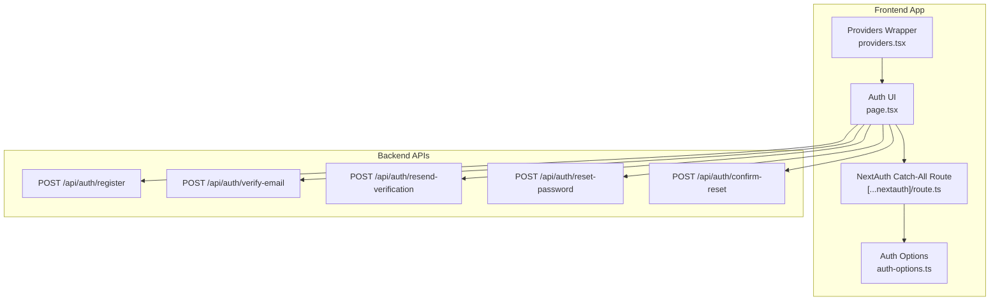
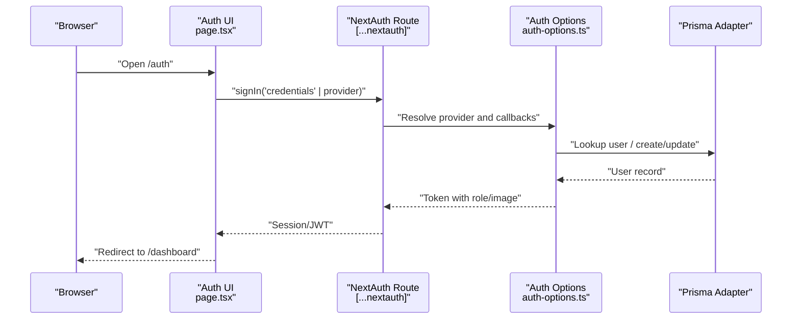
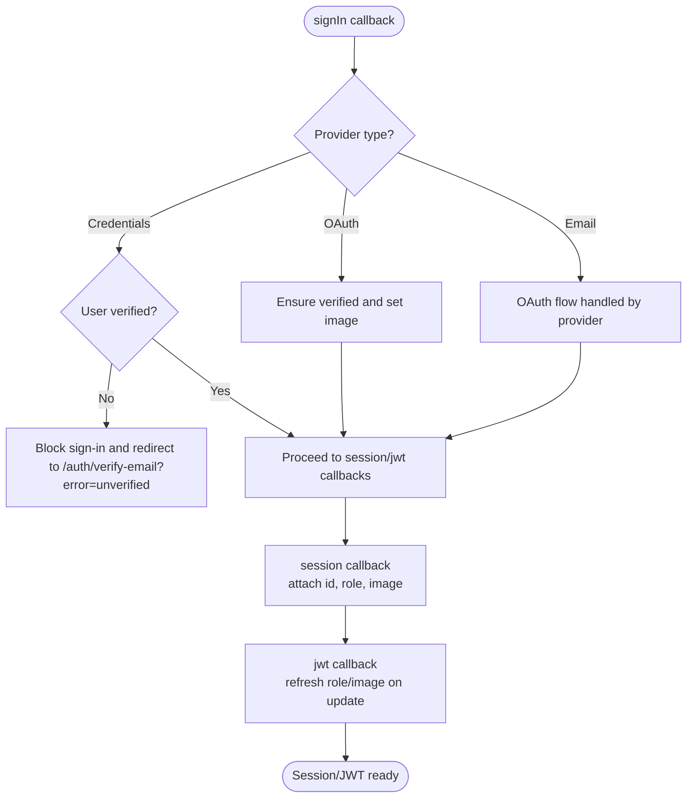
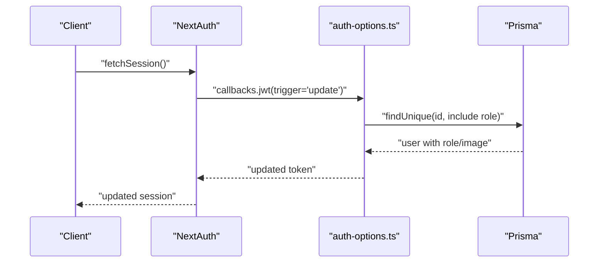
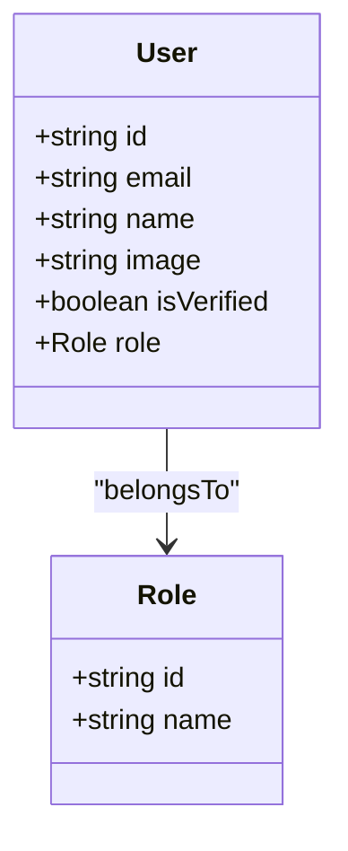
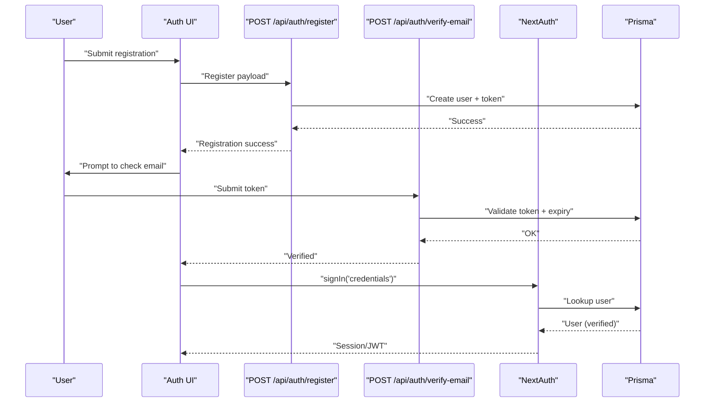
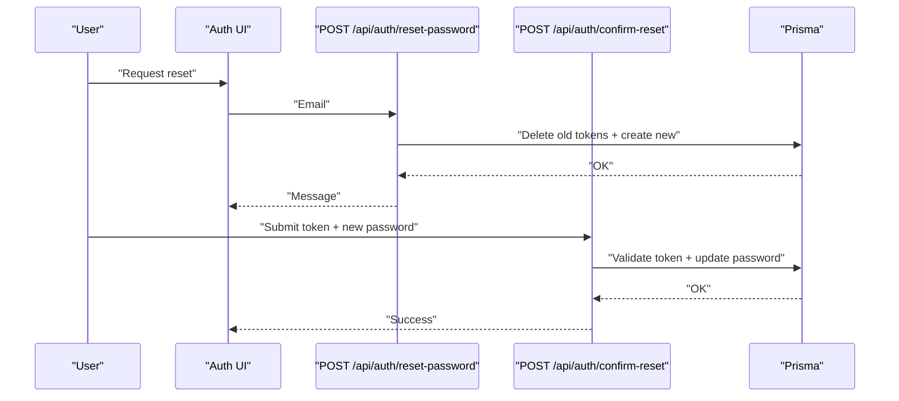
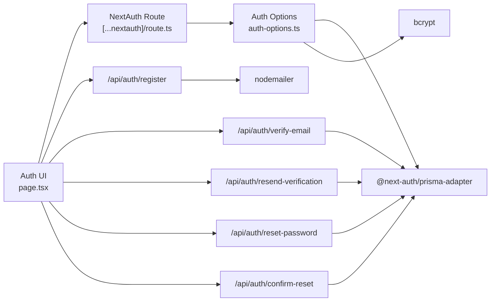

# Authentication & Authorization

<cite>
**Referenced Files in This Document**
- [auth-options.ts](file://frontend/lib/auth-options.ts)
- [[...nextauth]/route.ts](file://frontend/app/api/auth/[...nextauth]/route.ts)
- [providers.tsx](file://frontend/app/providers.tsx)
- [page.tsx (Auth)](file://frontend/app/auth/page.tsx)
- [register/route.ts](file://frontend/app/api/auth/register/route.ts)
- [verify-email/route.ts](file://frontend/app/api/auth/verify-email/route.ts)
- [resend-verification/route.ts](file://frontend/app/api/auth/resend-verification/route.ts)
- [reset-password/route.ts](file://frontend/app/api/auth/reset-password/route.ts)
- [confirm-reset/route.ts](file://frontend/app/api/auth/confirm-reset/route.ts)
</cite>

## Table of Contents
1. [Introduction](#introduction)
2. [Project Structure](#project-structure)
3. [Core Components](#core-components)
4. [Architecture Overview](#architecture-overview)
5. [Detailed Component Analysis](#detailed-component-analysis)
6. [Dependency Analysis](#dependency-analysis)
7. [Performance Considerations](#performance-considerations)
8. [Troubleshooting Guide](#troubleshooting-guide)
9. [Conclusion](#conclusion)

## Introduction
This document explains the authentication and authorization system for the TalentSync-Normies platform. It covers NextAuth.js integration with multiple OAuth providers, session and JWT lifecycle, user roles and permissions, and the end-to-end flows for registration, login, email verification, password reset, and logout. It also documents API authentication headers, session validation, token refresh, and security considerations for protecting user data and maintaining session integrity. Guidance is included for role-based UI rendering, protected route handling, and permission checks across the application.

## Project Structure
Authentication spans the frontend Next.js app and the shared auth configuration:
- NextAuth.js configuration and callbacks are centralized in a single module.
- NextAuth routes are exposed via a catch-all API endpoint.
- The application’s provider wrapper initializes session management.
- UI pages orchestrate sign-in/sign-up, verification, and password reset flows.
- Dedicated API endpoints implement registration, verification, resend-verification, and password reset confirmation.

**Diagram sources**
- [auth-options.ts](file://frontend/lib/auth-options.ts#L10-L202)
- [[...nextauth]/route.ts](file://frontend/app/api/auth/[...nextauth]/route.ts#L1-L7)
- [providers.tsx](file://frontend/app/providers.tsx#L13-L37)
- [page.tsx (Auth)](file://frontend/app/auth/page.tsx#L1-L933)
- [register/route.ts](file://frontend/app/api/auth/register/route.ts#L1-L176)
- [verify-email/route.ts](file://frontend/app/api/auth/verify-email/route.ts#L1-L84)
- [resend-verification/route.ts](file://frontend/app/api/auth/resend-verification/route.ts#L1-L137)
- [reset-password/route.ts](file://frontend/app/api/auth/reset-password/route.ts#L1-L135)
- [confirm-reset/route.ts](file://frontend/app/api/auth/confirm-reset/route.ts#L1-L89)

**Section sources**
- [auth-options.ts](file://frontend/lib/auth-options.ts#L10-L202)
- [[...nextauth]/route.ts](file://frontend/app/api/auth/[...nextauth]/route.ts#L1-L7)
- [providers.tsx](file://frontend/app/providers.tsx#L13-L37)
- [page.tsx (Auth)](file://frontend/app/auth/page.tsx#L1-L933)
- [register/route.ts](file://frontend/app/api/auth/register/route.ts#L1-L176)
- [verify-email/route.ts](file://frontend/app/api/auth/verify-email/route.ts#L1-L84)
- [resend-verification/route.ts](file://frontend/app/api/auth/resend-verification/route.ts#L1-L137)
- [reset-password/route.ts](file://frontend/app/api/auth/reset-password/route.ts#L1-L135)
- [confirm-reset/route.ts](file://frontend/app/api/auth/confirm-reset/route.ts#L1-L89)

## Core Components
- NextAuth.js configuration and callbacks:
  - Providers: Credentials, Google, GitHub, Email.
  - Adapter: Prisma adapter.
  - Session strategy: JWT.
  - Events: Automatically verify OAuth users upon creation.
  - Callbacks: signIn, session, jwt; enforce email verification for credentials, propagate role and image, and refresh token data.
  - Pages: Customized sign-in page.
- Provider wrapper:
  - Wraps the app with SessionProvider to enable client-side session management.
- UI orchestration:
  - Single-page auth UI supports OAuth and credentials login, registration, resend verification, and password reset initiation.
- Backend APIs:
  - Registration with role assignment and email verification token generation.
  - Verification of email using token with expiry and duplication checks.
  - Resend verification for unverified email accounts.
  - Password reset request with token generation and expiry.
  - Confirm password reset with token validation and atomic update.

**Section sources**
- [auth-options.ts](file://frontend/lib/auth-options.ts#L10-L202)
- [providers.tsx](file://frontend/app/providers.tsx#L13-L37)
- [page.tsx (Auth)](file://frontend/app/auth/page.tsx#L1-L933)
- [register/route.ts](file://frontend/app/api/auth/register/route.ts#L1-L176)
- [verify-email/route.ts](file://frontend/app/api/auth/verify-email/route.ts#L1-L84)
- [resend-verification/route.ts](file://frontend/app/api/auth/resend-verification/route.ts#L1-L137)
- [reset-password/route.ts](file://frontend/app/api/auth/reset-password/route.ts#L1-L135)
- [confirm-reset/route.ts](file://frontend/app/api/auth/confirm-reset/route.ts#L1-L89)

## Architecture Overview
The system integrates NextAuth.js with a JWT-based session strategy and a Prisma-backed adapter. The UI triggers NextAuth flows and also calls dedicated APIs for registration and verification. Token refresh ensures the session reflects the latest user role and image.

**Diagram sources**
- [auth-options.ts](file://frontend/lib/auth-options.ts#L10-L202)
- [[...nextauth]/route.ts](file://frontend/app/api/auth/[...nextauth]/route.ts#L1-L7)
- [page.tsx (Auth)](file://frontend/app/auth/page.tsx#L1-L933)

## Detailed Component Analysis

### NextAuth.js Integration and JWT Lifecycle
- Providers:
  - Credentials: Validates email/password, enforces email verification, returns user with role.
  - Google/GitHub: OAuth providers configured via environment variables.
  - Email: Transactional email provider for magic links and verification.
- Adapter and session:
  - Prisma adapter connects NextAuth to the database.
  - Session strategy set to JWT.
- Events:
  - On user creation, OAuth users are marked verified automatically.
- Callbacks:
  - signIn: Enforce email verification for credentials; auto-verify OAuth; capture profile image for OAuth; block unverified credentials.
  - session: Populate session.user with id, role, and image from token.
  - jwt: On token update or refresh, fetch latest role and image from DB; on initial sign-in, derive role and image from user/provider.

**Diagram sources**
- [auth-options.ts](file://frontend/lib/auth-options.ts#L98-L196)

**Section sources**
- [auth-options.ts](file://frontend/lib/auth-options.ts#L10-L202)

### Session Management and Token Refresh
- Strategy: JWT.
- Token refresh:
  - Triggered implicitly by NextAuth; jwt callback refreshes role and image from DB when token is updated.
- Session propagation:
  - session callback ensures session.user includes id, role, and image derived from token.

**Diagram sources**
- [auth-options.ts](file://frontend/lib/auth-options.ts#L159-L195)

**Section sources**
- [auth-options.ts](file://frontend/lib/auth-options.ts#L77-L81)
- [auth-options.ts](file://frontend/lib/auth-options.ts#L145-L158)
- [auth-options.ts](file://frontend/lib/auth-options.ts#L159-L195)

### User Roles and Permissions
- Role storage:
  - Users are associated with a role via the Prisma adapter.
- Role propagation:
  - signIn callback sets token.role for OAuth; jwt callback ensures role is refreshed on updates.
  - session callback attaches role to session.user.
- Permission model:
  - The codebase stores role names on tokens/sessions and exposes role via session.user.role.
  - No explicit permission matrix is present in the reviewed files; role names are propagated for UI and route-level decisions.

**Diagram sources**
- [auth-options.ts](file://frontend/lib/auth-options.ts#L19-L55)
- [auth-options.ts](file://frontend/lib/auth-options.ts#L164-L194)

**Section sources**
- [auth-options.ts](file://frontend/lib/auth-options.ts#L19-L55)
- [auth-options.ts](file://frontend/lib/auth-options.ts#L164-L194)

### Authentication Flow: Registration to Login
- Registration:
  - Validates input, checks existing user and role, hashes password, creates user and email verification token in a transaction, and sends verification email.
- Email verification:
  - Validates token presence, checks expiry and duplication, marks user verified and token confirmed atomically.
- Resend verification:
  - Generates a new token for unverified, non-OAuth users and re-sends email.
- Login:
  - Credentials: Uses bcrypt to verify password and enforces email verification.
  - OAuth: Automatically verified and captures profile image.

**Diagram sources**
- [register/route.ts](file://frontend/app/api/auth/register/route.ts#L68-L158)
- [verify-email/route.ts](file://frontend/app/api/auth/verify-email/route.ts#L9-L66)
- [auth-options.ts](file://frontend/lib/auth-options.ts#L19-L55)
- [page.tsx (Auth)](file://frontend/app/auth/page.tsx#L151-L186)

**Section sources**
- [register/route.ts](file://frontend/app/api/auth/register/route.ts#L1-L176)
- [verify-email/route.ts](file://frontend/app/api/auth/verify-email/route.ts#L1-L84)
- [resend-verification/route.ts](file://frontend/app/api/auth/resend-verification/route.ts#L1-L137)
- [auth-options.ts](file://frontend/lib/auth-options.ts#L19-L55)
- [page.tsx (Auth)](file://frontend/app/auth/page.tsx#L151-L186)

### Password Reset Flow
- Request reset:
  - Validates email, blocks OAuth users, deletes existing tokens, generates a new token with expiry, and emails reset link.
- Confirm reset:
  - Validates token presence, expiry, and duplication, hashes new password, and marks token as used.

**Diagram sources**
- [reset-password/route.ts](file://frontend/app/api/auth/reset-password/route.ts#L59-L117)
- [confirm-reset/route.ts](file://frontend/app/api/auth/confirm-reset/route.ts#L11-L71)

**Section sources**
- [reset-password/route.ts](file://frontend/app/api/auth/reset-password/route.ts#L1-L135)
- [confirm-reset/route.ts](file://frontend/app/api/auth/confirm-reset/route.ts#L1-L89)

### API Authentication Headers and Session Validation
- NextAuth endpoints:
  - The catch-all route exposes NextAuth under the API namespace and handles GET/POST for all NextAuth flows.
- Client usage:
  - The UI uses next-auth/react to sign in and manage sessions; no manual bearer tokens are required for NextAuth flows.
- Session validation:
  - The session returned by NextAuth includes id, role, and image; useSession can be used to guard routes and render UI conditionally.

**Section sources**
- [[...nextauth]/route.ts](file://frontend/app/api/auth/[...nextauth]/route.ts#L1-L7)
- [page.tsx (Auth)](file://frontend/app/auth/page.tsx#L40-L122)

### Role-Based UI Rendering and Protected Routes
- Role availability:
  - session.user.role is populated by callbacks and can be used to render role-specific UI.
- Protected routes:
  - Guard routes by checking session presence and role; redirect unauthenticated users to /auth.
- Permission matrix:
  - Not defined in the reviewed files; implement route-level checks using session.user.role and restrict access accordingly.

**Section sources**
- [auth-options.ts](file://frontend/lib/auth-options.ts#L145-L158)
- [page.tsx (Auth)](file://frontend/app/auth/page.tsx#L40-L122)

## Dependency Analysis
- Internal dependencies:
  - UI depends on next-auth/react and NextAuth route.
  - NextAuth route depends on auth-options.
  - auth-options depends on Prisma adapter and bcrypt.
  - Registration/verification APIs depend on Prisma and Nodemailer.
- External dependencies:
  - NextAuth.js, @next-auth/prisma-adapter, bcrypt, nodemailer, zod, react-query.

**Diagram sources**
- [auth-options.ts](file://frontend/lib/auth-options.ts#L1-L8)
- [[...nextauth]/route.ts](file://frontend/app/api/auth/[...nextauth]/route.ts#L1-L7)
- [page.tsx (Auth)](file://frontend/app/auth/page.tsx#L1-L933)
- [register/route.ts](file://frontend/app/api/auth/register/route.ts#L1-L176)
- [verify-email/route.ts](file://frontend/app/api/auth/verify-email/route.ts#L1-L84)
- [resend-verification/route.ts](file://frontend/app/api/auth/resend-verification/route.ts#L1-L137)
- [reset-password/route.ts](file://frontend/app/api/auth/reset-password/route.ts#L1-L135)
- [confirm-reset/route.ts](file://frontend/app/api/auth/confirm-reset/route.ts#L1-L89)

**Section sources**
- [auth-options.ts](file://frontend/lib/auth-options.ts#L1-L8)
- [page.tsx (Auth)](file://frontend/app/auth/page.tsx#L1-L933)

## Performance Considerations
- Token refresh:
  - Keep role and image in JWT to avoid frequent DB reads; rely on callbacks to refresh on update.
- Session caching:
  - Use client-side session caching via next-auth/react to minimize repeated network calls.
- Email operations:
  - Asynchronous email sending; failures do not block registration/verification to improve UX.
- Rate limiting:
  - Consider adding rate limits to registration, verification, resend, and reset endpoints to prevent abuse.

## Troubleshooting Guide
- Common issues and resolutions:
  - Unverified email on credentials login:
    - The signIn callback redirects to the verification page with an error parameter; guide users to resend verification.
  - Invalid/expired tokens:
    - Verification and reset endpoints return clear errors for invalid/expired/duplicated tokens.
  - OAuth users not requiring verification:
    - OAuth users are auto-verified; resend verification is blocked for OAuth accounts.
  - Password reset for OAuth accounts:
    - Reset is blocked; instruct users to sign in via OAuth.
  - Email delivery failures:
    - Registration and verification resend endpoints log errors but still succeed if email fails; advise resending.

**Section sources**
- [auth-options.ts](file://frontend/lib/auth-options.ts#L122-L136)
- [verify-email/route.ts](file://frontend/app/api/auth/verify-email/route.ts#L20-L46)
- [resend-verification/route.ts](file://frontend/app/api/auth/resend-verification/route.ts#L42-L54)
- [reset-password/route.ts](file://frontend/app/api/auth/reset-password/route.ts#L77-L83)
- [register/route.ts](file://frontend/app/api/auth/register/route.ts#L144-L150)

## Conclusion
The platform uses NextAuth.js with a JWT session strategy, Prisma adapter, and multiple providers (Credentials, Google, GitHub, Email). Email verification is mandatory for credentials-based accounts, while OAuth users are auto-verified. Roles are stored and propagated via JWT callbacks, enabling role-based UI and route-level access control. Dedicated APIs support registration, verification, resend-verification, and password reset flows. Security best practices include enforcing email verification for credentials, validating tokens with expiry and duplication checks, and avoiding exposing sensitive data in error messages. Implement route-level guards using session.user.role to enforce access control consistently across the application.