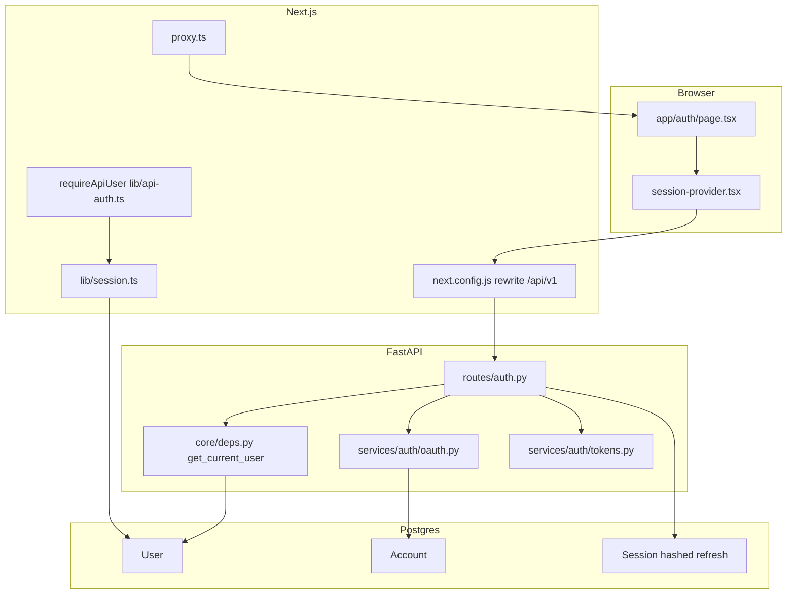
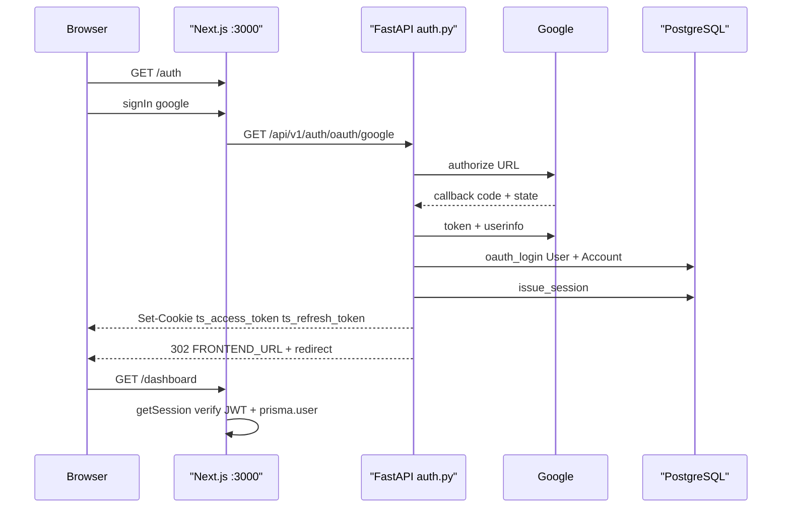
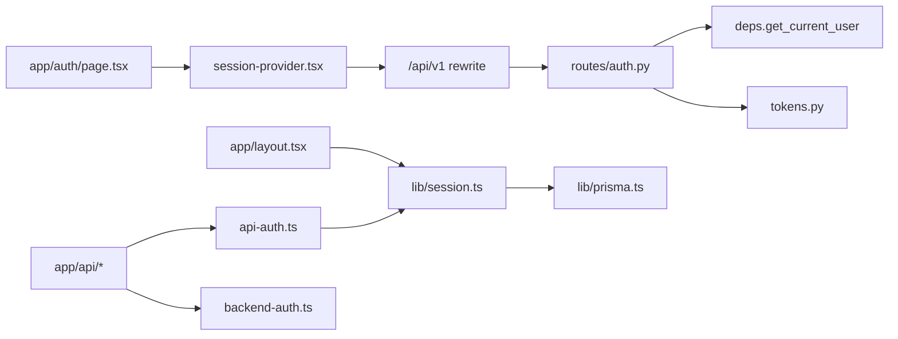

# Authentication & authorization

Google OAuth on FastAPI. The backend sets `ts_access_token` (root, httpOnly, 20 minutes) and `ts_refresh_token` (path `/api/v1/auth`, 30 days). NextAuth is gone. There is no `[...nextauth]` route and no Prisma adapter.

The Next.js rewrite `/api/v1/:path*` keeps those cookies first-party. Server pages call `getSession()` in `frontend/lib/session.ts`. The client `useSession()` in `frontend/components/providers/session-provider.tsx` hits `/api/v1/auth/me`.

## Repository layout

```mermaid
graph TB
subgraph "Browser"
UI["app/auth/page.tsx"]
SP["session-provider.tsx"]
end
subgraph "Next.js"
RW["next.config.js rewrite /api/v1"]
SESS["lib/session.ts"]
PROXY["proxy.ts"]
API["requireApiUser lib/api-auth.ts"]
end
subgraph "FastAPI"
AUTH["routes/auth.py"]
DEPS["core/deps.py get_current_user"]
OAUTH["services/auth/oauth.py"]
TOK["services/auth/tokens.py"]
end
subgraph "Postgres"
USER["User"]
ACCT["Account"]
SESSROW["Session hashed refresh"]
end
UI --> SP
SP --> RW
RW --> AUTH
SESS --> USER
PROXY --> UI
API --> SESS
AUTH --> OAUTH
AUTH --> TOK
AUTH --> DEPS
DEPS --> USER
AUTH --> SESSROW
OAUTH --> ACCT
```

- `backend/app/routes/auth.py`
- `backend/app/services/auth/oauth.py`
- `backend/app/services/auth/tokens.py`
- `backend/app/core/deps.py`
- `frontend/lib/session.ts`
- `frontend/lib/api-auth.ts`
- `frontend/lib/backend-auth.ts`
- `frontend/components/providers/session-provider.tsx`
- `frontend/proxy.ts`
- `frontend/app/auth/page.tsx`
- `frontend/app/select-role/page.tsx`

## Building blocks

- Sign-in is Google. `signIn("google")` navigates to `/api/v1/auth/oauth/google`.
- Password routes (`/register`, `/login`, `/verify-email`, `/forgot-password`, `/reset-password`) exist but return 410 unless `CREDENTIALS_AUTH_ENABLED=true`.
- Access JWT is HS256, claim `type=access`, `sub` is the user id. `JWT_SECRET` on the backend must match `BACKEND_JWT_SECRET` on the frontend.
- Refresh tokens are opaque, stored SHA-256 in `Session`. Rotation detects reuse and kills the family.
- `get_current_user` accepts `Authorization: Bearer` or the access cookie.
- BFF routes that call FastAPI mint their own short access JWT with `mintBackendAccessToken`.
- Roles are `USER | RECRUITER | ADMIN` on `User.role`. First Google login leaves `roleSelectedAt` null, which surfaces as `roleSelectionRequired`.

## How it fits together

```mermaid
sequenceDiagram
participant Browser
participant Next as "Next.js :3000"
participant API as "FastAPI auth.py"
participant Google
participant DB as "PostgreSQL"
Browser->>Next : GET /auth
Browser->>Next : signIn google
Next->>API : GET /api/v1/auth/oauth/google
API->>Google : authorize URL
Google-->>API : callback code + state
API->>Google : token + userinfo
API->>DB : oauth_login User + Account
API->>DB : issue_session
API-->>Browser : Set-Cookie ts_access_token ts_refresh_token
API-->>Browser : 302 FRONTEND_URL + redirect
Browser->>Next : GET /dashboard
Next->>Next : getSession verify JWT + prisma.user
```

## Google OAuth

`SUPPORTED_PROVIDERS` is `{"google"}`. GitHub is not wired.

1. Client goes to `/api/v1/auth/oauth/google?redirect=/dashboard`.
2. Backend signs CSRF state (`ts_oauth_state` cookie, 10 minutes) and redirects to Google.
3. Callback checks state JWT, exchanges the code, loads userinfo.
4. `oauth_login` refuses to attach Google onto an existing local email unless Google says the address is verified.
5. Cookies are set on the callback response, then the browser is sent to `FRONTEND_URL` plus a relative path only.

Redirect URI must match Google Cloud exactly. Default is `{BACKEND_BASE_URL}/api/v1/auth/oauth/google/callback`. `/api/v1/auth/google` and `/google/callback` are aliases for older console entries.

## Cookies and JWTs

| Cookie | Path | TTL | Contents |
| --- | --- | --- | --- |
| `ts_access_token` (`COOKIE_ACCESS_NAME`) | `/` | 20 min | HS256 access JWT |
| `ts_refresh_token` (`COOKIE_REFRESH_NAME`) | `/api/v1/auth` | 30 days | opaque refresh |

Root path on the access cookie is required because BFF routes (`/api/ats`, `/api/chat/stream`, ...) sit outside `/api/v1` and still need the cookie.

JSON login responses also include `accessToken` for non-browser clients.

## Frontend session

`getSession()`:

1. Read `ts_access_token`.
2. `jwtVerify` with `BACKEND_JWT_SECRET`, require `type === "access"`.
3. Load `User` from Prisma so role changes and deletions apply before the access TTL ends.

`toClientSession()` seeds `SessionProvider` so the first paint is not a loading flash. The provider still re-fetches `/api/v1/auth/me` on mount and POSTs `/api/v1/auth/refresh` every 15 minutes.

`useSession()` keeps the old `{ data, status }` shape. `update` is an alias of `refresh`. Call sites import from `@/components/providers/session-provider`, not `next-auth/react`.

## Route guards

`frontend/proxy.ts` only checks that the access cookie exists. It does not verify the signature. Edge should not hold `JWT_SECRET`. Real checks happen in `getSession`, `requireApiUser`, and `get_current_user`.

Public paths: `/`, `/about`, `/pricing`, `/privacy`, `/auth`, `/api/*`, static assets.

Missing cookie on a private page redirects to `/auth?callbackUrl=...`.

`/select-role` is for `roleSelectionRequired`. `POST /api/v1/auth/update-role` writes `User.role` and `roleSelectedAt`.

## API auth

BFF handlers use `requireApiUser()` (`frontend/lib/api-auth.ts`). FastAPI handlers use `Depends(get_current_user)` or `require_role(...)`.

BFF-to-backend calls add `Authorization: Bearer` from `backendAuthHeaders(userId)`. Do not expect the browser cookie to hop origins.

## Roles

`frontend/lib/user-roles.ts` and `UserRole` on the SQLModel. Default is `USER`. `RECRUITER` still exists on the enum and leftover `/dashboard/recruiter` chrome. That is not TalentSync-HR.

UI reads `session.user.role`. Sensitive BFF routes use `hasAnyRole`. Backend uses `require_role`.

## Password endpoints (disabled)

Kept behind `CREDENTIALS_AUTH_ENABLED` so they can be restored without archaeology. With the flag off they return 410 `CREDENTIALS_AUTH_DISABLED`. Do not document email/password as a live sign-in path.

## Dependencies

```mermaid
graph LR
UI["app/auth/page.tsx"] --> SP["session-provider.tsx"]
SP --> RW["/api/v1 rewrite"]
RW --> AUTH["routes/auth.py"]
LAYOUT["app/layout.tsx"] --> SESS["lib/session.ts"]
SESS --> PRISMA["lib/prisma.ts"]
BFF["app/api/*"] --> REQ["api-auth.ts"]
REQ --> SESS
BFF --> MINT["backend-auth.ts"]
AUTH --> DEPS["deps.get_current_user"]
AUTH --> TOK["tokens.py"]
```

## Troubleshooting

- Login fails: Google redirect URI, `GOOGLE_CLIENT_ID` / `GOOGLE_CLIENT_SECRET`, and matching `JWT_SECRET` / `BACKEND_JWT_SECRET`. This is not a NextAuth misconfig.
- 401 on BFF routes: cookie missing, expired access token, or `BACKEND_JWT_SECRET` drift.
- Refresh 401: refresh cookie not sent (wrong path/domain) or reuse detection cleared the family.
- OAuth bounce to `?error=oauth`: state JWT expired or cookie host mismatch in local rewrite vs direct callback.
- `?error=oauth_email_taken`: Google email collides with an existing local account.
- Role stuck: `roleSelectedAt` still null; finish `/select-role` then `refresh()`.
