# API Overview

<cite>
**Referenced Files in This Document**
- [backend/app/main.py](file://backend/app/main.py)
- [backend/main.py](file://backend/main.py)
- [backend/app/core/settings.py](file://backend/app/core/settings.py)
- [backend/app/core/exceptions.py](file://backend/app/core/exceptions.py)
- [backend/app/core/deps.py](file://backend/app/core/deps.py)
- [backend/app/routes/ats.py](file://backend/app/routes/ats.py)
- [backend/app/routes/cold_mail.py](file://backend/app/routes/cold_mail.py)
- [backend/app/routes/resume_analysis.py](file://backend/app/routes/resume_analysis.py)
- [backend/app/routes/interview.py](file://backend/app/routes/interview.py)
- [backend/app/models/schemas.py](file://backend/app/models/schemas.py)
- [backend/pyproject.toml](file://backend/pyproject.toml)
- [backend/.env](file://backend/.env)
- [frontend/services/api-client.ts](file://frontend/services/api-client.ts)
- [frontend/lib/auth-options.ts](file://frontend/lib/auth-options.ts)
- [frontend/next.config.js](file://frontend/next.config.js)
</cite>

## Table of Contents
1. [Introduction](#introduction)
2. [Project Structure](#project-structure)
3. [Core Components](#core-components)
4. [Architecture Overview](#architecture-overview)
5. [Detailed Component Analysis](#detailed-component-analysis)
6. [Dependency Analysis](#dependency-analysis)
7. [Performance Considerations](#performance-considerations)
8. [Troubleshooting Guide](#troubleshooting-guide)
9. [Conclusion](#conclusion)

## Introduction
This document provides a comprehensive API overview for the TalentSync-Normies backend. It explains the overall API architecture, versioning strategy (v1 vs v2), authentication mechanisms, and common request/response patterns. It also covers RESTful design principles, error handling standards, rate limiting policies, base URLs, content-type requirements, headers, CORS configuration, session management, and the relationship between the frontend and backend APIs. Finally, it outlines how different API groups interact and the overall data flow patterns.

## Project Structure
The backend is a FastAPI application that exposes multiple API groups under two versioned prefixes:
- /api/v1: Legacy endpoints grouped by feature (ATS evaluation, cold mail, hiring assistant, resume analysis, etc.).
- /api/v2: Modernized endpoints for the same features, often text-based variants of v1 file-based endpoints.

Key runtime and configuration files:
- Application entrypoint and server runner
- Central FastAPI app definition with middleware, CORS, and router registration
- Environment-driven settings and secrets
- Shared models and schemas for request/response contracts

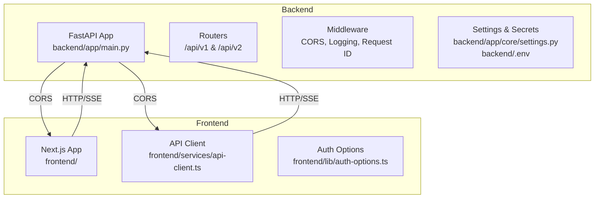

**Diagram sources**
- [backend/app/main.py](file://backend/app/main.py#L157-L196)
- [backend/app/core/settings.py](file://backend/app/core/settings.py#L37-L38)
- [frontend/services/api-client.ts](file://frontend/services/api-client.ts#L1-L125)
- [frontend/lib/auth-options.ts](file://frontend/lib/auth-options.ts#L1-L202)

**Section sources**
- [backend/app/main.py](file://backend/app/main.py#L157-L196)
- [backend/.env](file://backend/.env#L18-L25)

## Core Components
- FastAPI application with lifecycle hooks, request/response logging, request ID propagation, and CORS.
- Versioned routers:
  - v1: File-based and text-based endpoints for ATS, cold mail, hiring assistant, resume analysis, enrichment, improvement, cover letter, tailored resume, LinkedIn, PostgreSQL, tips, and interview.
  - v2: Text-based equivalents for cold mail, hiring assistant, resume analysis, improvement, enrichment, cover letter, ATS, tailored resume, and JD editor.
- LLM dependency injection supporting per-request overrides via headers.
- Centralized exception types for consistent error responses.
- Shared schemas module aggregating request/response models.

**Section sources**
- [backend/app/main.py](file://backend/app/main.py#L63-L80)
- [backend/app/main.py](file://backend/app/main.py#L148-L154)
- [backend/app/main.py](file://backend/app/main.py#L157-L196)
- [backend/app/core/deps.py](file://backend/app/core/deps.py#L22-L68)
- [backend/app/core/exceptions.py](file://backend/app/core/exceptions.py#L6-L49)
- [backend/app/models/schemas.py](file://backend/app/models/schemas.py#L105-L191)

## Architecture Overview
The backend follows a layered architecture:
- Entry: Uvicorn server runs the FastAPI app.
- Middleware: CORS, request ID, and request/response logging.
- Routers: Grouped by feature and versioned by path prefix.
- Services: Orchestrate LLM calls and data processing.
- Models/Schemas: Define request/response contracts.
- Exceptions: Standardized HTTP exceptions.

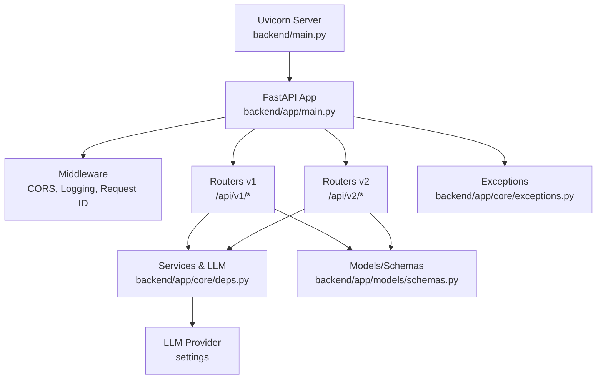

**Diagram sources**
- [backend/main.py](file://backend/main.py#L1-L10)
- [backend/app/main.py](file://backend/app/main.py#L63-L80)
- [backend/app/main.py](file://backend/app/main.py#L148-L154)
- [backend/app/main.py](file://backend/app/main.py#L157-L196)
- [backend/app/core/deps.py](file://backend/app/core/deps.py#L22-L68)
- [backend/app/models/schemas.py](file://backend/app/models/schemas.py#L105-L191)
- [backend/app/core/exceptions.py](file://backend/app/core/exceptions.py#L6-L49)

## Detailed Component Analysis

### API Base URLs and Versioning
- Base URL: http://localhost:8000
- Versioned prefixes:
  - v1: /api/v1
  - v2: /api/v2
- Example endpoints:
  - v1: /api/v1/ats/evaluate
  - v2: /api/v2/ats/evaluate
  - v1: /api/v1/cold-mail/generator/
  - v2: /api/v2/cold-mail/generator/
  - v1: /api/v1/resume/analysis
  - v2: /api/v2/resume/format-and-analyze

**Section sources**
- [backend/app/main.py](file://backend/app/main.py#L157-L196)
- [backend/.env](file://backend/.env#L18-L18)

### Authentication and Session Management
- Backend JWT-based session strategy is configured in the frontend auth options.
- NextAuth providers include credentials, Google, GitHub, and email.
- Session strategy uses JWT; callbacks manage user roles and image propagation.
- Frontend API client does not inject auth headers by default; authentication is handled by NextAuth cookies/session.

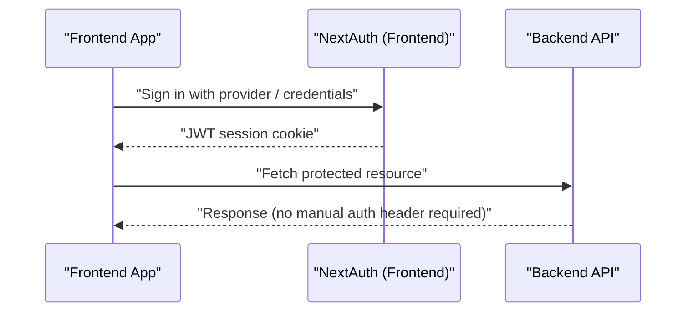

**Diagram sources**
- [frontend/lib/auth-options.ts](file://frontend/lib/auth-options.ts#L77-L80)
- [frontend/lib/auth-options.ts](file://frontend/lib/auth-options.ts#L145-L158)
- [frontend/services/api-client.ts](file://frontend/services/api-client.ts#L1-L125)

**Section sources**
- [frontend/lib/auth-options.ts](file://frontend/lib/auth-options.ts#L10-L202)
- [frontend/services/api-client.ts](file://frontend/services/api-client.ts#L1-L125)

### CORS Configuration
- Origins: Controlled by settings; default allows all.
- Headers and methods: Allow all.
- Credentials: Enabled.

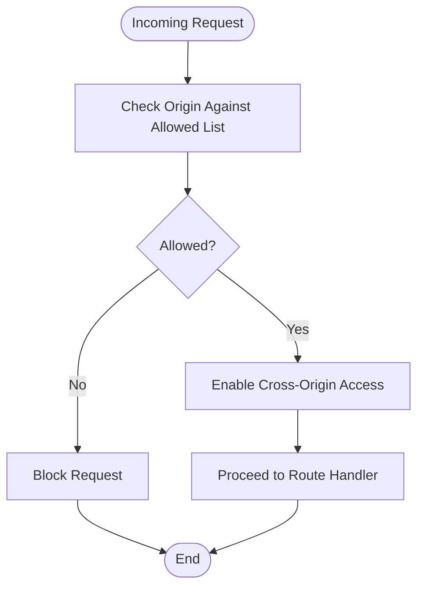

**Diagram sources**
- [backend/app/core/settings.py](file://backend/app/core/settings.py#L37-L38)
- [backend/app/main.py](file://backend/app/main.py#L148-L154)

**Section sources**
- [backend/app/core/settings.py](file://backend/app/core/settings.py#L37-L38)
- [backend/app/main.py](file://backend/app/main.py#L148-L154)

### Request/Response Patterns and Content Types
- JSON payloads: Requests with JSON bodies must specify Content-Type: application/json.
- Form/multipart: File uploads and form fields are accepted for file-based endpoints.
- SSE streaming: Interview endpoints stream Server-Sent Events for real-time feedback.
- Response bodies: Typically JSON; some endpoints return binary content (e.g., generated documents).

Common headers:
- Content-Type: application/json (when sending JSON)
- Authorization: Bearer <token> (when applicable)
- X-Request-ID: Propagated for tracing
- X-LLM-Provider, X-LLM-Model, X-LLM-Key, X-LLM-Base: Per-request LLM override

**Section sources**
- [frontend/services/api-client.ts](file://frontend/services/api-client.ts#L42-L44)
- [backend/app/main.py](file://backend/app/main.py#L71-L80)
- [backend/app/core/deps.py](file://backend/app/core/deps.py#L34-L37)
- [backend/app/routes/interview.py](file://backend/app/routes/interview.py#L188-L224)

### Error Handling Standards
- Standardized exceptions:
  - 400 Bad Request
  - 401 Unauthorized
  - 403 Forbidden
  - 404 Not Found
  - 500 Internal Server Error
  - 503 Service Unavailable
- WWW-Authenticate header included for 401 responses.
- Validation errors are surfaced as 400 with details.

**Section sources**
- [backend/app/core/exceptions.py](file://backend/app/core/exceptions.py#L6-L49)

### Rate Limiting Policies
- No explicit rate limiting middleware is present in the backend code.
- Recommendations:
  - Use a dedicated rate-limiting middleware or gateway.
  - Apply limits per endpoint or globally based on resource sensitivity.
  - Consider LLM provider quotas and backoff strategies.

[No sources needed since this section provides general guidance]

### LLM Configuration and Dynamic Providers
- Default LLM provider and model are configured via environment and settings.
- Per-request override via headers enables dynamic provider selection and custom API keys.
- If headers are missing or invalid, the server falls back to the configured default or returns 503.

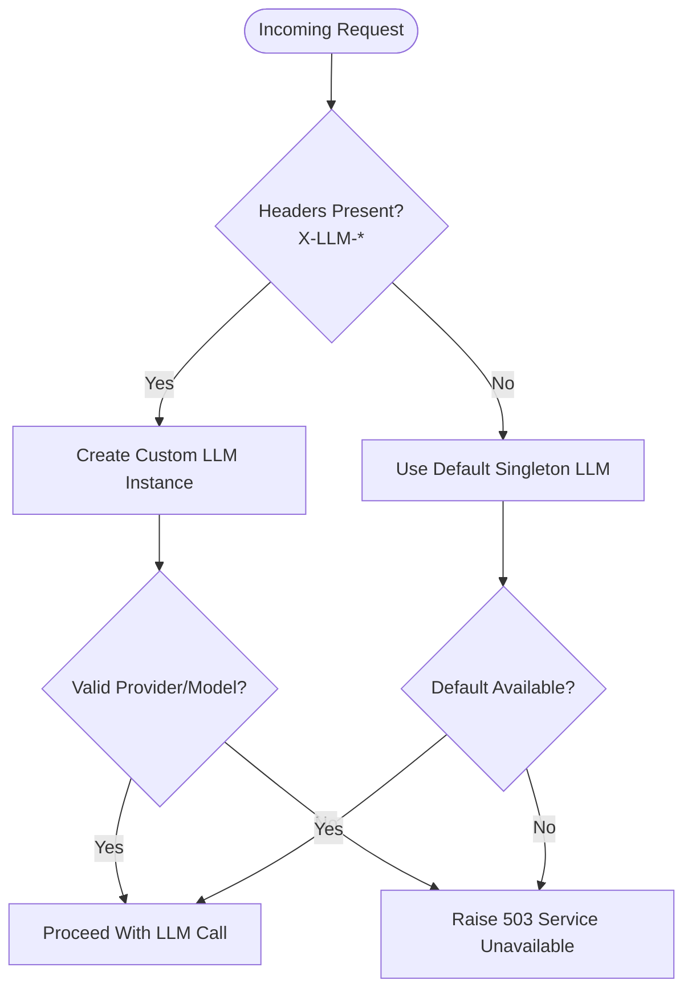

**Diagram sources**
- [backend/app/core/deps.py](file://backend/app/core/deps.py#L22-L68)
- [backend/app/core/settings.py](file://backend/app/core/settings.py#L27-L32)

**Section sources**
- [backend/app/core/deps.py](file://backend/app/core/deps.py#L22-L68)
- [backend/app/core/settings.py](file://backend/app/core/settings.py#L27-L32)

### API Groups and Interactions
- v1 and v2 share similar functional domains but differ in payload style:
  - v1: File-based endpoints for resume/ATS/cold mail/etc.
  - v2: Text-based endpoints for the same features.
- Interview endpoints (v1) provide streaming evaluation and code execution via SSE.
- Shared models define request/response contracts across groups.

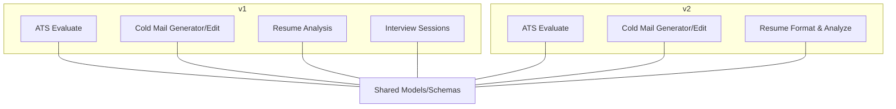

**Diagram sources**
- [backend/app/main.py](file://backend/app/main.py#L157-L196)
- [backend/app/models/schemas.py](file://backend/app/models/schemas.py#L105-L191)

**Section sources**
- [backend/app/main.py](file://backend/app/main.py#L157-L196)
- [backend/app/models/schemas.py](file://backend/app/models/schemas.py#L105-L191)

### Representative Endpoints and Payloads

#### ATS Evaluation (v1 and v2)
- v1: File-based endpoint accepts resume file and optional JD file/text/link.
- v2: Text-based endpoint accepts resume_text and optional jd_text/jd_link.
- Both validate inputs and call the ATS evaluation service.

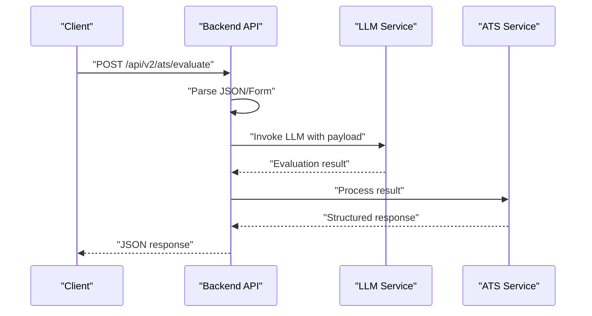

**Diagram sources**
- [backend/app/routes/ats.py](file://backend/app/routes/ats.py#L50-L118)
- [backend/app/routes/ats.py](file://backend/app/routes/ats.py#L133-L184)

**Section sources**
- [backend/app/routes/ats.py](file://backend/app/routes/ats.py#L50-L118)
- [backend/app/routes/ats.py](file://backend/app/routes/ats.py#L133-L184)

#### Cold Mail Generation (v1 and v2)
- v1: File-based endpoint with resume file and form fields.
- v2: Text-based endpoint with resume_text and form fields.
- Both delegate to cold mail services.

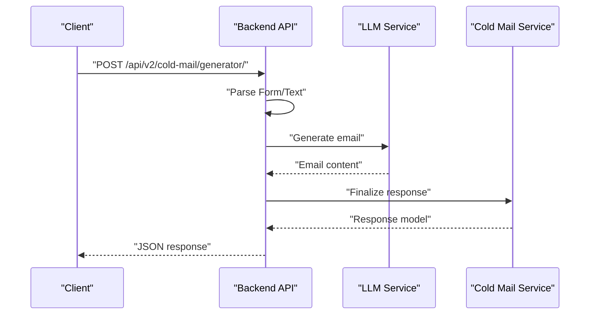

**Diagram sources**
- [backend/app/routes/cold_mail.py](file://backend/app/routes/cold_mail.py#L84-L112)
- [backend/app/routes/cold_mail.py](file://backend/app/routes/cold_mail.py#L115-L134)

**Section sources**
- [backend/app/routes/cold_mail.py](file://backend/app/routes/cold_mail.py#L84-L112)
- [backend/app/routes/cold_mail.py](file://backend/app/routes/cold_mail.py#L115-L134)

#### Resume Analysis (v1 and v2)
- v1: File-based analysis and comprehensive analysis.
- v2: Text-based format-and-analyze and analysis endpoints.
- Both leverage LLM services for insights.

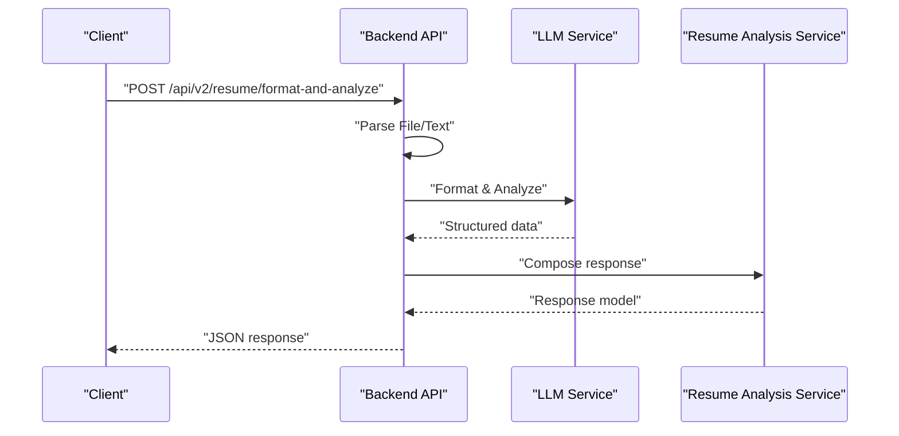

**Diagram sources**
- [backend/app/routes/resume_analysis.py](file://backend/app/routes/resume_analysis.py#L43-L52)
- [backend/app/routes/resume_analysis.py](file://backend/app/routes/resume_analysis.py#L55-L67)

**Section sources**
- [backend/app/routes/resume_analysis.py](file://backend/app/routes/resume_analysis.py#L43-L52)
- [backend/app/routes/resume_analysis.py](file://backend/app/routes/resume_analysis.py#L55-L67)

#### Interview Streaming (v1)
- Supports SSE for streaming evaluation and code execution.
- Uses async generators and a helper to convert to SSE frames.

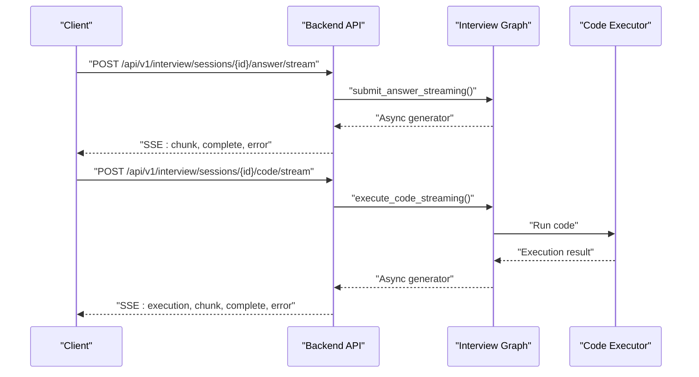

**Diagram sources**
- [backend/app/routes/interview.py](file://backend/app/routes/interview.py#L188-L224)
- [backend/app/routes/interview.py](file://backend/app/routes/interview.py#L257-L295)

**Section sources**
- [backend/app/routes/interview.py](file://backend/app/routes/interview.py#L29-L39)
- [backend/app/routes/interview.py](file://backend/app/routes/interview.py#L188-L224)
- [backend/app/routes/interview.py](file://backend/app/routes/interview.py#L257-L295)

## Dependency Analysis
- Runtime dependencies include FastAPI, LangChain ecosystem, PyMuPDF, cryptography, and others.
- Environment variables supply database, auth, LLM, and external service keys.
- Settings module centralizes configuration and CORS policy.

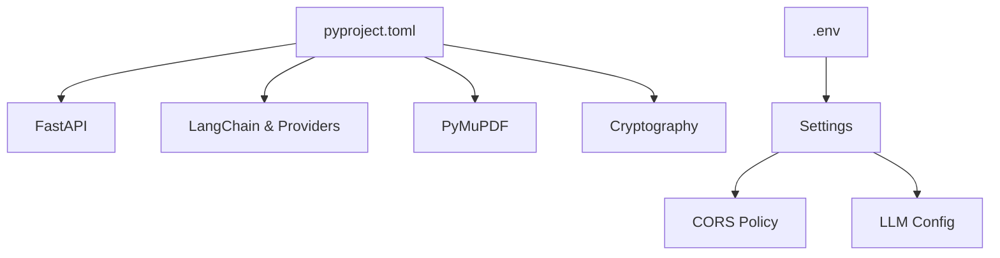

**Diagram sources**
- [backend/pyproject.toml](file://backend/pyproject.toml#L7-L33)
- [backend/.env](file://backend/.env#L1-L26)
- [backend/app/core/settings.py](file://backend/app/core/settings.py#L15-L32)

**Section sources**
- [backend/pyproject.toml](file://backend/pyproject.toml#L7-L33)
- [backend/.env](file://backend/.env#L1-L26)
- [backend/app/core/settings.py](file://backend/app/core/settings.py#L15-L32)

## Performance Considerations
- Streaming endpoints (SSE) reduce perceived latency for long-running tasks.
- LLM calls are asynchronous; consider batching and caching where appropriate.
- Logging middleware captures request/response payloads; tune log level in production.
- CORS allows all origins by default; restrict origins in production deployments.

[No sources needed since this section provides general guidance]

## Troubleshooting Guide
- 400 Bad Request: Validate payload shape and required fields; check multipart/form-data boundaries.
- 401 Unauthorized: Ensure authentication is established; verify session cookie presence.
- 404 Not Found: Confirm endpoint path matches v1 or v2 prefix and route registration.
- 500 Internal Server Error: Inspect logs for stack traces; verify LLM provider availability.
- 503 Service Unavailable: Indicates LLM initialization failure or missing configuration; check headers and settings.
- CORS errors: Verify allowed origins and credentials configuration.

**Section sources**
- [backend/app/core/exceptions.py](file://backend/app/core/exceptions.py#L6-L49)
- [backend/app/main.py](file://backend/app/main.py#L148-L154)
- [backend/app/core/deps.py](file://backend/app/core/deps.py#L48-L67)

## Conclusion
The backend exposes a well-structured, versioned API surface with clear separation between file-based and text-based endpoints. It integrates robust middleware for CORS, logging, and request tracing, and supports dynamic LLM configuration per request. Authentication is managed by the frontend via NextAuth, while the backend focuses on secure routing and standardized error handling. For production, enforce stricter CORS, implement rate limiting, and monitor LLM usage and costs.