# API overview

## Introduction
This page provides a detailed API overview for the TalentSync-Normies backend. It explains the overall API architecture, versioning strategy (v1 vs v2), authentication mechanisms, and common request/response patterns. It also covers RESTful design principles, error handling standards, rate limiting policies, base URLs, content-type requirements, headers, CORS configuration, session management, and the relationship between the frontend and backend APIs. Finally, it outlines how different API groups interact and the overall data flow patterns.

## Project structure
The backend is a FastAPI application that exposes multiple API groups under two versioned prefixes:
- /api/v1: Legacy endpoints grouped by feature (ATS evaluation, cold mail, hiring assistant, resume analysis, etc.).
- /api/v2: Modernized endpoints for the same features, often text-based variants of v1 file-based endpoints.

Key runtime and configuration files:
- Application entrypoint and server runner
- Central FastAPI app definition with middleware, CORS, and router registration
- Environment-driven settings and secrets
- Shared models and schemas for request/response contracts

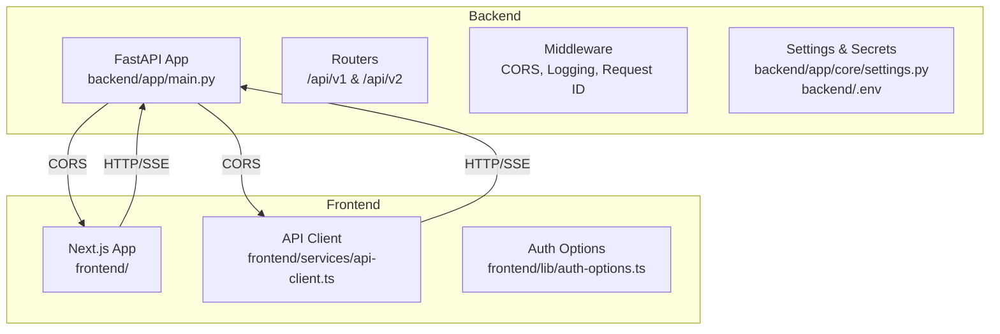
```mermaid
graph TB
subgraph "Backend"
A["FastAPI App<br/>backend/app/main.py"]
B["Routers<br/>/api/v1 & /api/v2"]
C["Middleware<br/>CORS, Logging, Request ID"]
D["Settings & Secrets<br/>backend/app/core/settings.py<br/>backend/.env"]
end
subgraph "Frontend"
E["Next.js App<br/>frontend/"]
F["API Client<br/>frontend/services/api-client.ts"]
G["Auth Options<br/>frontend/lib/auth-options.ts"]
end
E --> |"HTTP/SSE"| A
F --> |"HTTP/SSE"| A
A --> |"CORS"| E
A --> |"CORS"| F
```

## Core components
- FastAPI application with lifecycle hooks, request/response logging, request ID propagation, and CORS.
- Versioned routers:
  - v1: File-based and text-based endpoints for ATS, cold mail, hiring assistant, resume analysis, enrichment, improvement, cover letter, tailored resume, LinkedIn, PostgreSQL, tips, and interview.
  - v2: Text-based equivalents for cold mail, hiring assistant, resume analysis, improvement, enrichment, cover letter, ATS, tailored resume, and JD editor.
- LLM dependency injection supporting per-request overrides via headers.
- Centralized exception types for consistent error responses.
- Shared schemas module aggregating request/response models.

## Architecture overview
The backend follows a layered architecture:
- Entry: Uvicorn server runs the FastAPI app.
- Middleware: CORS, request ID, and request/response logging.
- Routers: Grouped by feature and versioned by path prefix.
- Services: Orchestrate LLM calls and data processing.
- Models/Schemas: Define request/response contracts.
- Exceptions: Standardized HTTP exceptions.

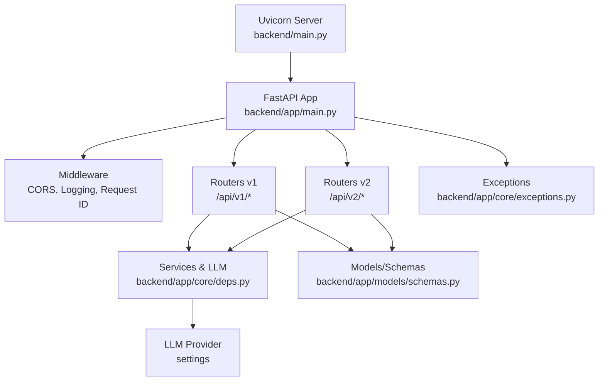
```mermaid
graph TB
U["Uvicorn Server<br/>backend/main.py"] --> A["FastAPI App<br/>backend/app/main.py"]
A --> M["Middleware<br/>CORS, Logging, Request ID"]
A --> R1["Routers v1<br/>/api/v1/*"]
A --> R2["Routers v2<br/>/api/v2/*"]
R1 --> S["Services & LLM<br/>backend/app/core/deps.py"]
R2 --> S
S --> LLM["LLM Provider<br/>settings"]
R1 --> MDS["Models/Schemas<br/>backend/app/models/schemas.py"]
R2 --> MDS
A --> EX["Exceptions<br/>backend/app/core/exceptions.py"]
```

## Detailed component analysis

### API base URLs and versioning
- Base URL: http://localhost:8000
- Versioned prefixes:
  - v1: /api/v1
  - v2: /api/v2
- Example endpoints:
  - v1: /api/v1/ats/evaluate
  - v2: /api/v2/ats/evaluate
  - v1: /api/v1/cold-mail/generator/
  - v2: /api/v2/cold-mail/generator/
  - v1: /api/v1/resume/analysis
  - v2: /api/v2/resume/format-and-analyze

### Authentication and session management
- Backend JWT-based session strategy is configured in the frontend auth options.
- NextAuth providers include credentials, Google, GitHub, and email.
- Session strategy uses JWT; callbacks manage user roles and image propagation.
- Frontend API client does not inject auth headers by default; authentication is handled by NextAuth cookies/session.

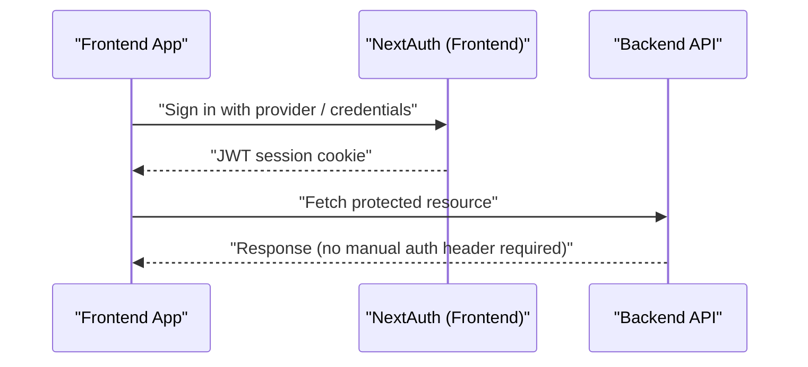
```mermaid
sequenceDiagram
participant FE as "Frontend App"
participant NA as "NextAuth (Frontend)"
participant BE as "Backend API"
FE->>NA : "Sign in with provider / credentials"
NA-->>FE : "JWT session cookie"
FE->>BE : "Fetch protected resource"
BE-->>FE : "Response (no manual auth header required)"
```

### CORS configuration
- Origins: Controlled by settings; default allows all.
- Headers and methods: Allow all.
- Credentials: Enabled.

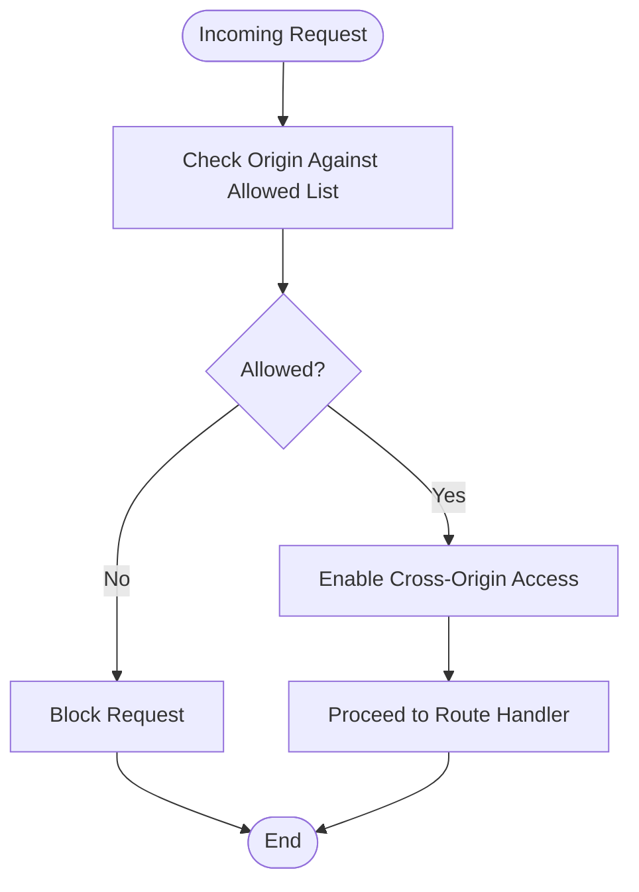
```mermaid
flowchart TD
Start(["Incoming Request"]) --> CheckOrigin["Check Origin Against Allowed List"]
CheckOrigin --> Allowed{"Allowed?"}
Allowed --> |Yes| EnableCORS["Enable Cross-Origin Access"]
Allowed --> |No| Block["Block Request"]
EnableCORS --> Continue["Proceed to Route Handler"]
Block --> End(["End"])
Continue --> End
```

### Request/Response patterns and content types
- JSON payloads: Requests with JSON bodies must specify Content-Type: application/json.
- Form/multipart: File uploads and form fields are accepted for file-based endpoints.
- SSE streaming: Interview endpoints stream Server-Sent Events for real-time feedback.
- Response bodies: Typically JSON; some endpoints return binary content (e.g., generated documents).

Common headers:
- Content-Type: application/json (when sending JSON)
- Authorization: Bearer <token> (when applicable)
- X-Request-ID: Propagated for tracing
- X-LLM-Provider, X-LLM-Model, X-LLM-Key, X-LLM-Base: Per-request LLM override

### Error handling standards
- Standardized exceptions:
  - 400 Bad Request
  - 401 Unauthorized
  - 403 Forbidden
  - 404 Not Found
  - 500 Internal Server Error
  - 503 Service Unavailable
- WWW-Authenticate header included for 401 responses.
- Validation errors are surfaced as 400 with details.

### Rate limiting policies
- No explicit rate limiting middleware is present in the backend code.
- Recommendations:
  - Use a dedicated rate-limiting middleware or gateway.
  - Apply limits per endpoint or globally based on resource sensitivity.
  - Consider LLM provider quotas and backoff strategies.

[No sources needed since this section provides general guidance]

### LLM configuration and dynamic providers
- Default LLM provider and model are configured via environment and settings.
- Per-request override via headers enables dynamic provider selection and custom API keys.
- If headers are missing or invalid, the server falls back to the configured default or returns 503.

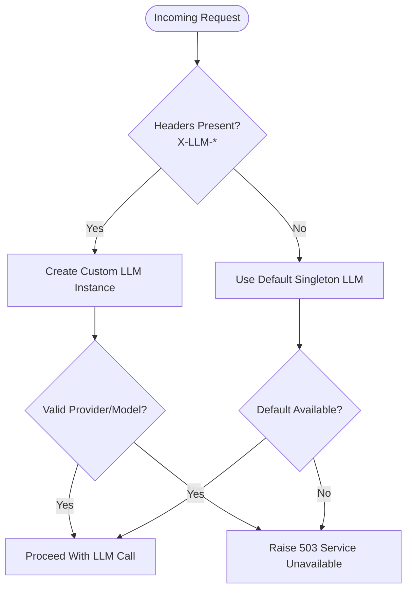
```mermaid
flowchart TD
Req(["Incoming Request"]) --> HasHeaders{"Headers Present?<br/>X-LLM-*"}
HasHeaders --> |Yes| CreateCustom["Create Custom LLM Instance"]
HasHeaders --> |No| UseDefault["Use Default Singleton LLM"]
CreateCustom --> Valid{"Valid Provider/Model?"}
Valid --> |Yes| Proceed["Proceed With LLM Call"]
Valid --> |No| Raise503["Raise 503 Service Unavailable"]
UseDefault --> DefaultReady{"Default Available?"}
DefaultReady --> |Yes| Proceed
DefaultReady --> |No| Raise503
```

### API groups and interactions
- v1 and v2 share similar functional domains but differ in payload style:
  - v1: File-based endpoints for resume/ATS/cold mail/etc.
  - v2: Text-based endpoints for the same features.
- Interview endpoints (v1) provide streaming evaluation and code execution via SSE.
- Shared models define request/response contracts across groups.

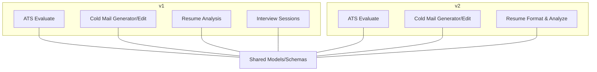
```mermaid
graph TB
subgraph "v1"
V1A["ATS Evaluate"]
V1B["Cold Mail Generator/Edit"]
V1C["Resume Analysis"]
V1D["Interview Sessions"]
end
subgraph "v2"
V2A["ATS Evaluate"]
V2B["Cold Mail Generator/Edit"]
V2C["Resume Format & Analyze"]
end
Shared["Shared Models/Schemas"]
V1A --- Shared
V1B --- Shared
V1C --- Shared
V1D --- Shared
V2A --- Shared
V2B --- Shared
V2C --- Shared
```

### Representative endpoints and payloads

#### ATS evaluation (v1 and v2)
- v1: File-based endpoint accepts resume file and optional JD file/text/link.
- v2: Text-based endpoint accepts resume_text and optional jd_text/jd_link.
- Both validate inputs and call the ATS evaluation service.

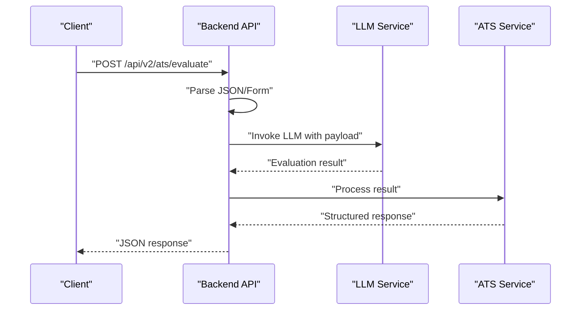
```mermaid
sequenceDiagram
participant Client as "Client"
participant API as "Backend API"
participant LLM as "LLM Service"
participant SVC as "ATS Service"
Client->>API : "POST /api/v2/ats/evaluate"
API->>API : "Parse JSON/Form"
API->>LLM : "Invoke LLM with payload"
LLM-->>API : "Evaluation result"
API->>SVC : "Process result"
SVC-->>API : "Structured response"
API-->>Client : "JSON response"
```

#### Cold mail generation (v1 and v2)
- v1: File-based endpoint with resume file and form fields.
- v2: Text-based endpoint with resume_text and form fields.
- Both delegate to cold mail services.

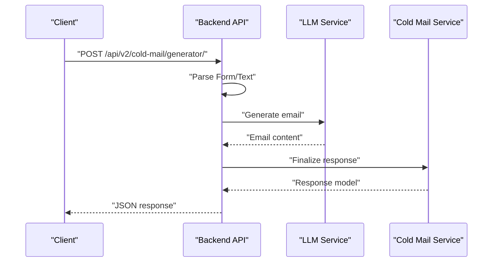
```mermaid
sequenceDiagram
participant Client as "Client"
participant API as "Backend API"
participant LLM as "LLM Service"
participant SVC as "Cold Mail Service"
Client->>API : "POST /api/v2/cold-mail/generator/"
API->>API : "Parse Form/Text"
API->>LLM : "Generate email"
LLM-->>API : "Email content"
API->>SVC : "Finalize response"
SVC-->>API : "Response model"
API-->>Client : "JSON response"
```

#### Resume analysis (v1 and v2)
- v1: File-based analysis and detailed analysis.
- v2: Text-based format-and-analyze and analysis endpoints.
- Both use LLM services for insights.

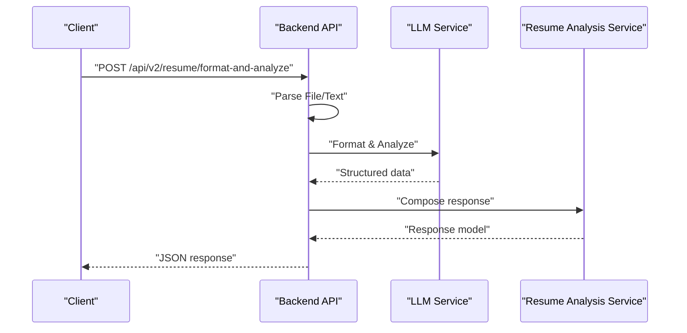
```mermaid
sequenceDiagram
participant Client as "Client"
participant API as "Backend API"
participant LLM as "LLM Service"
participant SVC as "Resume Analysis Service"
Client->>API : "POST /api/v2/resume/format-and-analyze"
API->>API : "Parse File/Text"
API->>LLM : "Format & Analyze"
LLM-->>API : "Structured data"
API->>SVC : "Compose response"
SVC-->>API : "Response model"
API-->>Client : "JSON response"
```

#### Interview streaming (v1)
- Supports SSE for streaming evaluation and code execution.
- Uses async generators and a helper to convert to SSE frames.

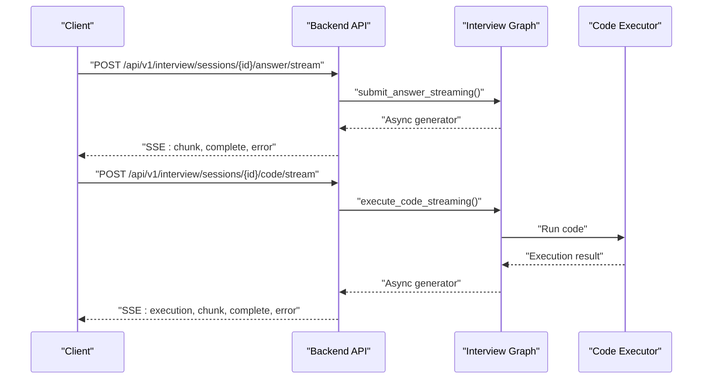
```mermaid
sequenceDiagram
participant Client as "Client"
participant API as "Backend API"
participant Graph as "Interview Graph"
participant Exec as "Code Executor"
Client->>API : "POST /api/v1/interview/sessions/{id}/answer/stream"
API->>Graph : "submit_answer_streaming()"
Graph-->>API : "Async generator"
API-->>Client : "SSE : chunk, complete, error"
Client->>API : "POST /api/v1/interview/sessions/{id}/code/stream"
API->>Graph : "execute_code_streaming()"
Graph->>Exec : "Run code"
Exec-->>Graph : "Execution result"
Graph-->>API : "Async generator"
API-->>Client : "SSE : execution, chunk, complete, error"
```

## Dependency analysis
- Runtime dependencies include FastAPI, LangChain ecosystem, PyMuPDF, cryptography, and others.
- Environment variables supply database, auth, LLM, and external service keys.
- Settings module centralizes configuration and CORS policy.

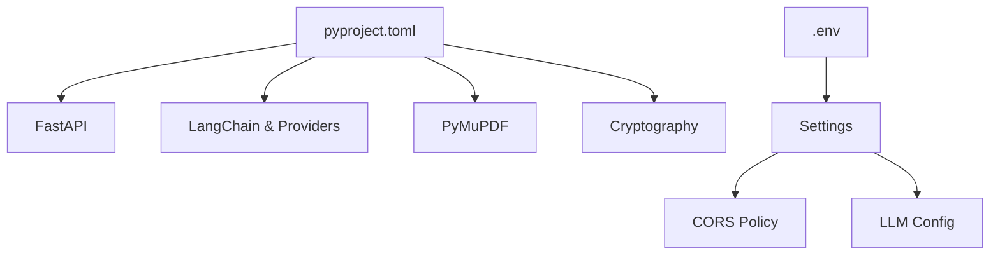
```mermaid
graph TB
P["pyproject.toml"] --> F["FastAPI"]
P --> L["LangChain & Providers"]
P --> PM["PyMuPDF"]
P --> CR["Cryptography"]
ENV[".env"] --> CFG["Settings"]
CFG --> CORS["CORS Policy"]
CFG --> LLM["LLM Config"]
```

## Performance considerations
- Streaming endpoints (SSE) reduce perceived latency for long-running tasks.
- LLM calls are asynchronous; consider batching and caching where appropriate.
- Logging middleware captures request/response payloads; tune log level in production.
- CORS allows all origins by default; restrict origins in production deployments.

[No sources needed since this section provides general guidance]

## Troubleshooting guide
- 400 Bad Request: Validate payload shape and required fields; check multipart/form-data boundaries.
- 401 Unauthorized: Ensure authentication is established; verify session cookie presence.
- 404 Not Found: Confirm endpoint path matches v1 or v2 prefix and route registration.
- 500 Internal Server Error: Inspect logs for stack traces; verify LLM provider availability.
- 503 Service Unavailable: Indicates LLM initialization failure or missing configuration; check headers and settings.
- CORS errors: Verify allowed origins and credentials configuration.

## Conclusion
The backend exposes a well-structured, versioned API surface with clear separation between file-based and text-based endpoints. It integrates reliable middleware for CORS, logging, and request tracing, and supports dynamic LLM configuration per request. Authentication is managed by the frontend via NextAuth, while the backend focuses on secure routing and standardized error handling. For production, enforce stricter CORS, implement rate limiting, and monitor LLM usage and costs.
