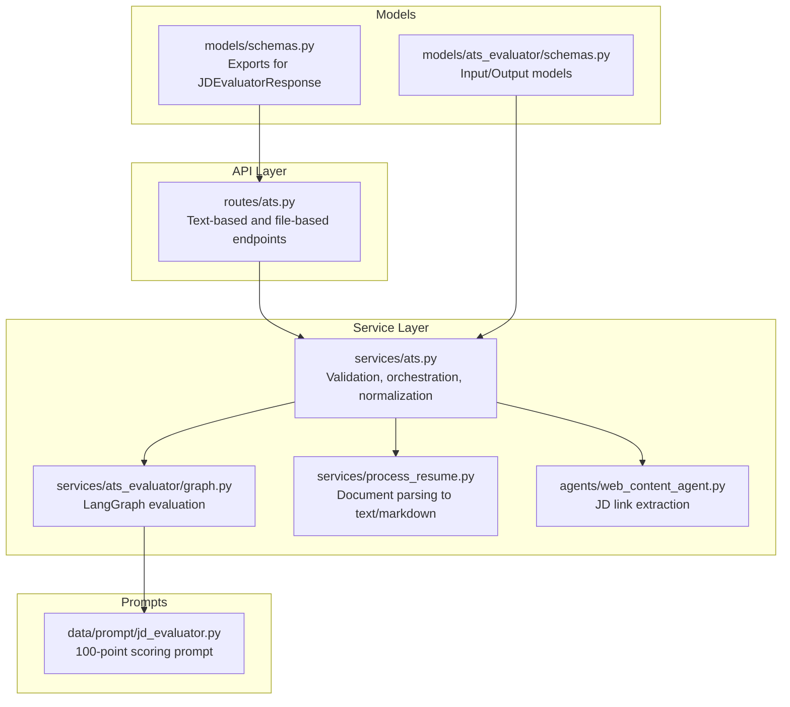
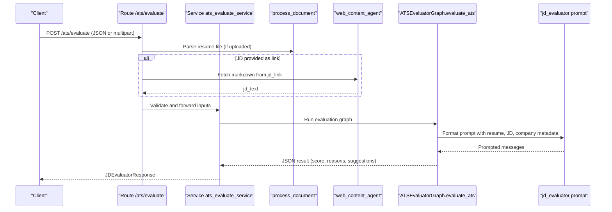
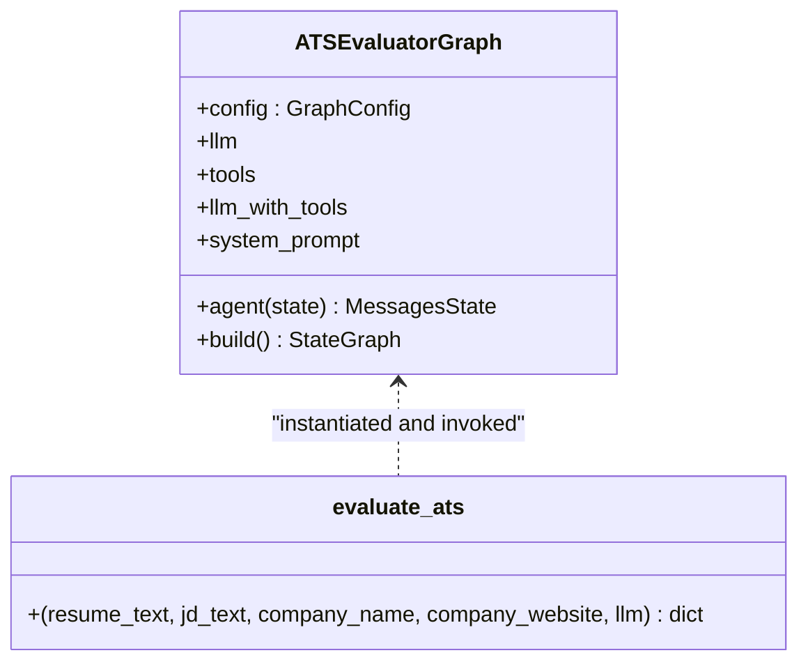
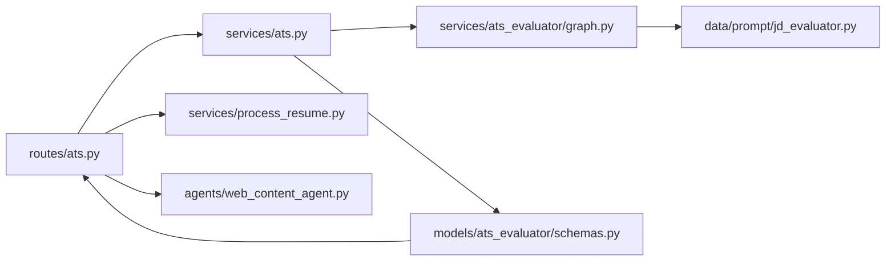

# ATS Evaluation API

<cite>
**Referenced Files in This Document**
- [routes/ats.py](file://backend/app/routes/ats.py)
- [services/ats.py](file://backend/app/services/ats.py)
- [services/ats_evaluator/graph.py](file://backend/app/services/ats_evaluator/graph.py)
- [services/ats_evaluator/__init__.py](file://backend/app/services/ats_evaluator/__init__.py)
- [models/ats_evaluator/schemas.py](file://backend/app/models/ats_evaluator/schemas.py)
- [models/schemas.py](file://backend/app/models/schemas.py)
- [data/prompt/jd_evaluator.py](file://backend/app/data/prompt/jd_evaluator.py)
- [services/process_resume.py](file://backend/app/services/process_resume.py)
- [agents/web_content_agent.py](file://backend/app/agents/web_content_agent.py)
</cite>

## Table of Contents
1. [Introduction](#introduction)
2. [Project Structure](#project-structure)
3. [Core Components](#core-components)
4. [Architecture Overview](#architecture-overview)
5. [Detailed Component Analysis](#detailed-component-analysis)
6. [Dependency Analysis](#dependency-analysis)
7. [Performance Considerations](#performance-considerations)
8. [Troubleshooting Guide](#troubleshooting-guide)
9. [Conclusion](#conclusion)
10. [Appendices](#appendices)

## Introduction
This document describes the Applicant Tracking System (ATS) evaluation functionality exposed by the backend API. It covers:
- Job description processing endpoints (text-based and file-based)
- Resume scanning pipeline and supported formats
- Keyword matching logic and scoring methodology
- ATS scoring schema, compatibility assessment, and suggestions
- Bulk evaluation capabilities, filtering, and result aggregation
- Practical optimization workflows and integration patterns

The system evaluates a candidate’s resume against a job description using a structured 100-point rubric, returning a numeric score, reasons, and actionable suggestions.

## Project Structure
The ATS evaluation feature spans routing, service orchestration, prompt-driven evaluation, and document processing utilities.

**Diagram sources**
- [routes/ats.py](file://backend/app/routes/ats.py#L1-L184)
- [services/ats.py](file://backend/app/services/ats.py#L1-L214)
- [services/ats_evaluator/graph.py](file://backend/app/services/ats_evaluator/graph.py#L1-L209)
- [services/process_resume.py](file://backend/app/services/process_resume.py#L1-L117)
- [agents/web_content_agent.py](file://backend/app/agents/web_content_agent.py#L1-L23)
- [models/ats_evaluator/schemas.py](file://backend/app/models/ats_evaluator/schemas.py#L1-L44)
- [models/schemas.py](file://backend/app/models/schemas.py#L1-L191)
- [data/prompt/jd_evaluator.py](file://backend/app/data/prompt/jd_evaluator.py#L1-L184)

**Section sources**
- [routes/ats.py](file://backend/app/routes/ats.py#L1-L184)
- [services/ats.py](file://backend/app/services/ats.py#L1-L214)
- [services/ats_evaluator/graph.py](file://backend/app/services/ats_evaluator/graph.py#L1-L209)
- [services/process_resume.py](file://backend/app/services/process_resume.py#L1-L117)
- [agents/web_content_agent.py](file://backend/app/agents/web_content_agent.py#L1-L23)
- [models/ats_evaluator/schemas.py](file://backend/app/models/ats_evaluator/schemas.py#L1-L44)
- [models/schemas.py](file://backend/app/models/schemas.py#L1-L191)
- [data/prompt/jd_evaluator.py](file://backend/app/data/prompt/jd_evaluator.py#L1-L184)

## Core Components
- Endpoints
  - Text-based evaluation endpoint: POST /ats/evaluate
  - File-based evaluation endpoint: POST /ats/evaluate (multipart/form-data)
- Input payload fields
  - resume_text: Candidate resume content
  - jd_text or jd_link: One of them must be provided
  - company_name, company_website: Optional enrichment fields
- Output schema
  - success: Boolean flag
  - message: Short status message
  - score: Integer score (0–100)
  - reasons_for_the_score: List of justification bullets
  - suggestions: List of actionable recommendations

Key behaviors:
- Accepts either raw text or uploaded files for both resume and job description
- Supports PDF, DOC, DOCX, TXT, MD for job description uploads
- Fetches job description from a URL if provided
- Normalizes evaluator output into a standardized response

**Section sources**
- [routes/ats.py](file://backend/app/routes/ats.py#L22-L48)
- [routes/ats.py](file://backend/app/routes/ats.py#L50-L131)
- [routes/ats.py](file://backend/app/routes/ats.py#L133-L184)
- [models/ats_evaluator/schemas.py](file://backend/app/models/ats_evaluator/schemas.py#L33-L44)
- [models/schemas.py](file://backend/app/models/schemas.py#L158-L161)

## Architecture Overview
The evaluation pipeline:
1. Receive request via FastAPI router
2. Parse and validate payload
3. Optionally fetch job description from a URL
4. Build LangGraph evaluation with a prompt template
5. Invoke LLM to produce JSON and narrative
6. Normalize output to standardized response

**Diagram sources**
- [routes/ats.py](file://backend/app/routes/ats.py#L50-L184)
- [services/ats.py](file://backend/app/services/ats.py#L22-L214)
- [services/process_resume.py](file://backend/app/services/process_resume.py#L68-L91)
- [agents/web_content_agent.py](file://backend/app/agents/web_content_agent.py#L4-L22)
- [services/ats_evaluator/graph.py](file://backend/app/services/ats_evaluator/graph.py#L116-L202)
- [data/prompt/jd_evaluator.py](file://backend/app/data/prompt/jd_evaluator.py#L1-L184)

## Detailed Component Analysis

### Endpoint: POST /ats/evaluate (Text-based)
- Accepts JSON body or form-encoded payload
- Validates presence of either jd_text or jd_link
- Supports optional company_name and company_website enrichment
- Processes resume_text directly

Behavior highlights:
- Ensures exactly one source for the job description
- Converts uploaded JD files to text when provided
- Delegates to service layer for evaluation

**Section sources**
- [routes/ats.py](file://backend/app/routes/ats.py#L50-L131)

### Endpoint: POST /ats/evaluate (File-based)
- Accepts multipart/form-data with resume_file and optional jd_file/jd_text/jd_link
- Validates allowed JD file extensions
- Reads and converts resume and optional JD files to text
- Enforces that a job description source is provided

**Section sources**
- [routes/ats.py](file://backend/app/routes/ats.py#L133-L184)

### Service: ats_evaluate_service
Responsibilities:
- Validates inputs using JDEvaluatorRequest schema
- Retrieves JD text from link if needed
- Invokes the evaluation graph
- Normalizes heterogeneous outputs to a dictionary
- Constructs and returns JDEvaluatorResponse

Key validations and error handling:
- HTTP 400 for invalid inputs or missing JD source
- HTTP 500 for retrieval failures or JSON parsing errors

**Section sources**
- [services/ats.py](file://backend/app/services/ats.py#L22-L214)

### Evaluation Graph: ATSEvaluatorGraph and evaluate_ats
- Initializes LLM (prefers shared provider; falls back to Gemini)
- Optionally binds Tavily search tool if available
- Formats prompt with resume, JD, company name, and company website content
- Executes a single-agent LangGraph with optional tool use
- Parses JSON from model output and returns structured result

**Diagram sources**
- [services/ats_evaluator/graph.py](file://backend/app/services/ats_evaluator/graph.py#L41-L114)
- [services/ats_evaluator/graph.py](file://backend/app/services/ats_evaluator/graph.py#L116-L202)

**Section sources**
- [services/ats_evaluator/graph.py](file://backend/app/services/ats_evaluator/graph.py#L1-L209)

### Prompt Template: jd_evaluator
- Defines a 100-point rubric across categories:
  - Technical Skills & Experience Match (30)
  - Career Progression & Achievements (25)
  - Education & Credentials (15)
  - Resume Quality & Customization (15)
  - Soft Skills & Cultural Fit Indicators (10)
  - Employment Stability & Red Flags (5)
- Includes bonuses and penalties
- Requires valid JSON output with exact schema keys

Scoring methodology:
- Compute category scores with precise point bands
- Apply adjustments (bonuses/penalties)
- Cap final score at 100 and round to integer
- Produce reasons and suggestions aligned to the rubric

**Section sources**
- [data/prompt/jd_evaluator.py](file://backend/app/data/prompt/jd_evaluator.py#L1-L184)

### Document Processing: process_document
Capabilities:
- Converts PDF, DOC, DOCX to Markdown for parsing
- Falls back to Google GenAI multimodal conversion when needed
- Returns plain text for TXT/MD
- Validates resume content heuristically

Supported formats:
- Resume: TXT, MD, PDF, DOC, DOCX
- Job Description: TXT, MD, PDF, DOC, DOCX

**Section sources**
- [services/process_resume.py](file://backend/app/services/process_resume.py#L68-L91)
- [services/process_resume.py](file://backend/app/services/process_resume.py#L93-L117)

### Web Content Retrieval: web_content_agent
- Fetches markdown content from a URL using a third-party service
- Returns empty string on failure or empty content

Used when jd_link is provided instead of jd_text.

**Section sources**
- [agents/web_content_agent.py](file://backend/app/agents/web_content_agent.py#L4-L22)

### Response Schema: JDEvaluatorResponse
Fields:
- success: Boolean
- message: String
- score: Integer (0–100)
- reasons_for_the_score: Array of strings
- suggestions: Array of strings

Normalization ensures robustness when evaluator returns JSON or narrative.

**Section sources**
- [models/ats_evaluator/schemas.py](file://backend/app/models/ats_evaluator/schemas.py#L33-L44)
- [services/ats.py](file://backend/app/services/ats.py#L174-L191)

## Dependency Analysis
- Routes depend on:
  - process_document for file parsing
  - web_content_agent for JD link retrieval
  - ats_evaluate_service for orchestration
- Service depends on:
  - JDEvaluatorRequest/Response models
  - ATSEvaluatorGraph for evaluation
- Graph depends on:
  - LLM provider (shared or Gemini)
  - jd_evaluator prompt template
  - optional Tavily tool binding

**Diagram sources**
- [routes/ats.py](file://backend/app/routes/ats.py#L1-L184)
- [services/ats.py](file://backend/app/services/ats.py#L1-L214)
- [services/ats_evaluator/graph.py](file://backend/app/services/ats_evaluator/graph.py#L1-L209)
- [models/ats_evaluator/schemas.py](file://backend/app/models/ats_evaluator/schemas.py#L1-L44)
- [data/prompt/jd_evaluator.py](file://backend/app/data/prompt/jd_evaluator.py#L1-L184)
- [services/process_resume.py](file://backend/app/services/process_resume.py#L1-L117)
- [agents/web_content_agent.py](file://backend/app/agents/web_content_agent.py#L1-L23)

**Section sources**
- [routes/ats.py](file://backend/app/routes/ats.py#L1-L184)
- [services/ats.py](file://backend/app/services/ats.py#L1-L214)
- [services/ats_evaluator/graph.py](file://backend/app/services/ats_evaluator/graph.py#L1-L209)
- [models/ats_evaluator/schemas.py](file://backend/app/models/ats_evaluator/schemas.py#L1-L44)
- [data/prompt/jd_evaluator.py](file://backend/app/data/prompt/jd_evaluator.py#L1-L184)
- [services/process_resume.py](file://backend/app/services/process_resume.py#L1-L117)
- [agents/web_content_agent.py](file://backend/app/agents/web_content_agent.py#L1-L23)

## Performance Considerations
- LLM invocation cost and latency dominate evaluation time; consider:
  - Using a shared LLM provider to reduce cold-starts
  - Limiting concurrent evaluations during peak loads
  - Caching repeated JDs and company website content
- Document parsing overhead:
  - Prefer preprocessed text when possible
  - Batch resume processing where feasible
- Prompt size impacts token usage; keep resume and JD concise

[No sources needed since this section provides general guidance]

## Troubleshooting Guide
Common issues and resolutions:
- Missing job description source
  - Ensure either jd_text or jd_link is provided
- Unsupported JD file type
  - Allowed: PDF, DOC, DOCX, TXT, MD
- Failed to process JD/resume file
  - Verify file integrity and encoding
  - For PDFs, fallback conversion requires Google provider and API key
- JSON parsing errors from evaluator
  - Model output may be malformed; retry or adjust prompt
- JD link retrieval failures
  - Confirm URL accessibility and network connectivity

Operational logs capture company_name, presence of JD text/link, and raw outputs to aid debugging.

**Section sources**
- [routes/ats.py](file://backend/app/routes/ats.py#L80-L95)
- [routes/ats.py](file://backend/app/routes/ats.py#L158-L168)
- [services/ats.py](file://backend/app/services/ats.py#L45-L59)
- [services/process_resume.py](file://backend/app/services/process_resume.py#L21-L32)
- [services/ats.py](file://backend/app/services/ats.py#L124-L140)
- [services/ats.py](file://backend/app/services/ats.py#L175-L179)

## Conclusion
The ATS evaluation API provides a robust, extensible pipeline to assess resume-JD alignment using a structured 100-point rubric. It supports flexible input formats, optional enrichment, and produces actionable insights. Integrations can leverage the standardized response schema to power dashboards, bulk scoring, and automated optimization workflows.

[No sources needed since this section summarizes without analyzing specific files]

## Appendices

### API Reference

- Endpoint: POST /ats/evaluate
  - Body (JSON or multipart/form-data)
    - resume_text: string
    - jd_text: string (optional if jd_link provided)
    - jd_link: string (optional if jd_text provided)
    - company_name: string (optional)
    - company_website: string (optional)
  - Response: JDEvaluatorResponse
    - success: boolean
    - message: string
    - score: integer (0–100)
    - reasons_for_the_score: array of strings
    - suggestions: array of strings

- Endpoint: POST /ats/evaluate (file-based)
  - Form fields
    - resume_file: file (TXT, MD, PDF, DOC, DOCX)
    - jd_file: file (optional, TXT, MD, PDF, DOC, DOCX)
    - jd_text: string (optional)
    - jd_link: string (optional)
    - company_name: string (optional)
    - company_website: string (optional)

**Section sources**
- [routes/ats.py](file://backend/app/routes/ats.py#L50-L131)
- [routes/ats.py](file://backend/app/routes/ats.py#L133-L184)
- [models/ats_evaluator/schemas.py](file://backend/app/models/ats_evaluator/schemas.py#L33-L44)

### Scoring Methodology and Weight Assignment
- Categories and approximate weights:
  - Technical Skills & Experience Match: 30%
  - Career Progression & Achievements: 25%
  - Education & Credentials: 15%
  - Resume Quality & Customization: 15%
  - Soft Skills & Cultural Fit Indicators: 10%
  - Employment Stability & Red Flags: 5%
- Adjustments:
  - Bonuses (up to +5): e.g., awards, publications, relevant volunteerism
  - Penalties (e.g., inconsistencies, unprofessional contact info, obvious misrepresentations)
- Final score capped at 100 and rounded to integer

**Section sources**
- [data/prompt/jd_evaluator.py](file://backend/app/data/prompt/jd_evaluator.py#L38-L118)

### Keyword Matching Logic
- Extract required and preferred keywords from the JD
- Match exact terms and common synonyms/equivalents
- Count close equivalents as partial matches with documented mappings
- Penalize generic resumes; reward customization to the JD
- Provide specific reasons and suggestions for missing or mismatched keywords

**Section sources**
- [data/prompt/jd_evaluator.py](file://backend/app/data/prompt/jd_evaluator.py#L28-L36)
- [data/prompt/jd_evaluator.py](file://backend/app/data/prompt/jd_evaluator.py#L120-L130)

### Formatting Compatibility Checks
- Resume content must include typical sections (e.g., Experience, Education, Skills)
- Resume text validated heuristically to ensure structure
- No specific ATS field enforcement; focus on semantic alignment and presentation quality

**Section sources**
- [services/process_resume.py](file://backend/app/services/process_resume.py#L93-L109)

### Bulk ATS Evaluation and Aggregation
- Recommended pattern:
  - Iterate over a batch of resumes and a single job description
  - Store per-resume JDEvaluatorResponse entries
  - Aggregate by computing average score, top suggestions, and common reasons
- Filtering options:
  - Filter by minimum score threshold
  - Filter by presence of specific keywords in suggestions
- Result aggregation:
  - Group by reasons_for_the_score themes
  - Rank by score descending

[No sources needed since this section provides general guidance]

### Practical Optimization Workflows
- Workflow 1: Tailored Resume Generation
  - Use suggestions to rewrite resume sections
  - Re-run evaluation to measure improvements
- Workflow 2: Keyword Gap Analysis
  - Cross-reference missing_keywords with industry benchmarks
  - Add relevant skills and quantify achievements
- Workflow 3: Customization Audit
  - Ensure JD keywords appear naturally in Summary and Experience
  - Remove generic boilerplate

[No sources needed since this section provides general guidance]

### Integration with External ATS Systems
- Use the standardized JDEvaluatorResponse to integrate with:
  - Internal ATS scoring dashboards
  - Pre-screening filters (e.g., minimum score thresholds)
  - Candidate shortlisting and interview scheduling
- Align external rubrics with the 100-point framework for comparability

[No sources needed since this section provides general guidance]