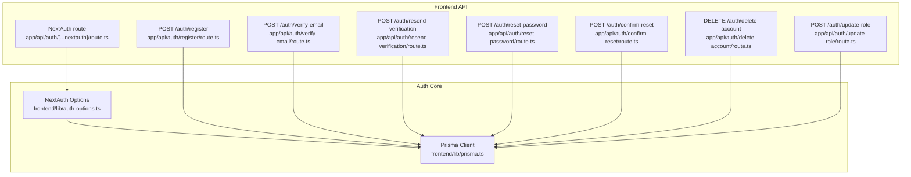
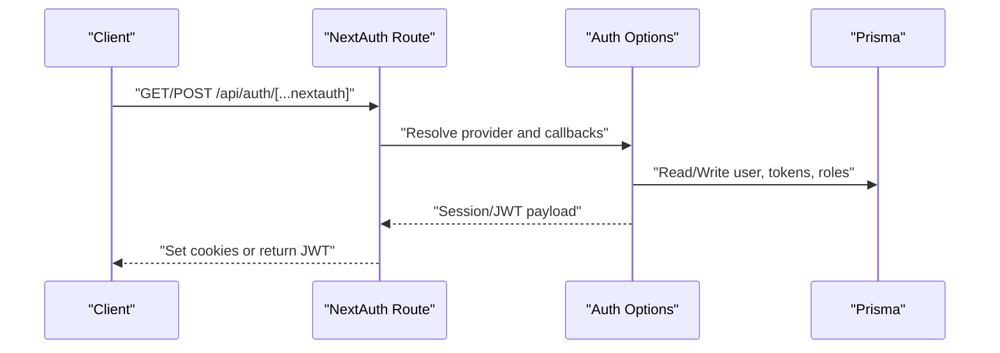
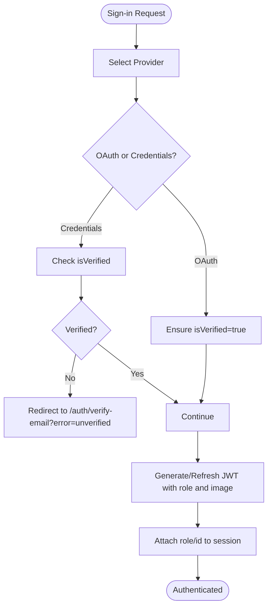
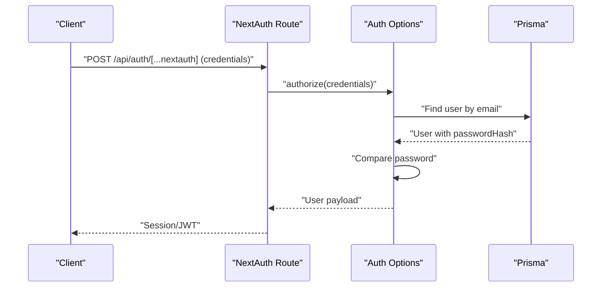
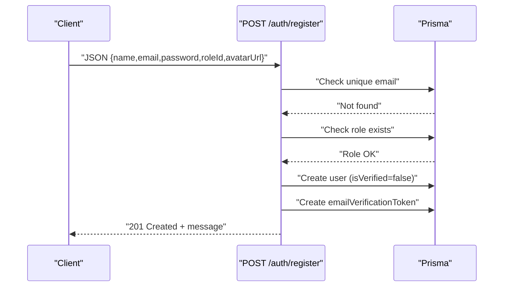
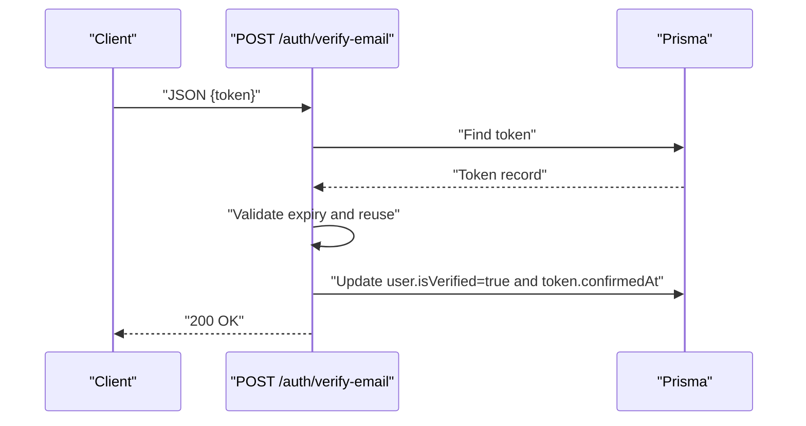
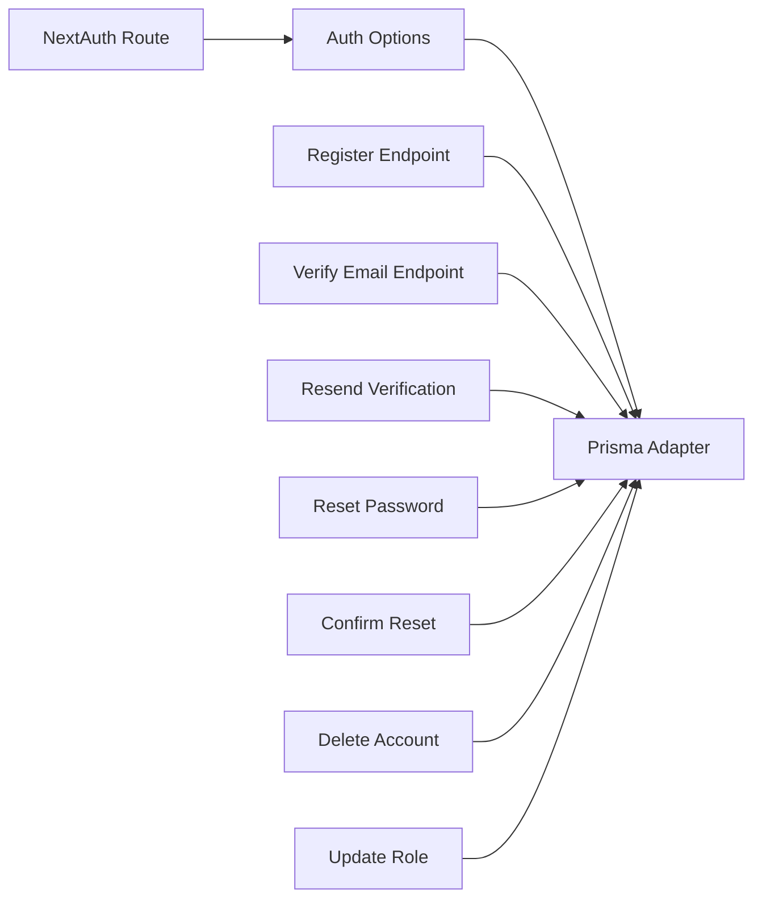

# Authentication API

<cite>
**Referenced Files in This Document**
- [auth-options.ts](file://frontend/lib/auth-options.ts)
- [[...nextauth]/route.ts](file://frontend/app/api/auth/[...nextauth]/route.ts)
- [register/route.ts](file://frontend/app/api/auth/register/route.ts)
- [verify-email/route.ts](file://frontend/app/api/auth/verify-email/route.ts)
- [resend-verification/route.ts](file://frontend/app/api/auth/resend-verification/route.ts)
- [reset-password/route.ts](file://frontend/app/api/auth/reset-password/route.ts)
- [confirm-reset/route.ts](file://frontend/app/api/auth/confirm-reset/route.ts)
- [delete-account/route.ts](file://frontend/app/api/auth/delete-account/route.ts)
- [update-role/route.ts](file://frontend/app/api/auth/update-role/route.ts)
- [prisma.ts](file://frontend/lib/prisma.ts)
</cite>

## Table of Contents
1. [Introduction](#introduction)
2. [Project Structure](#project-structure)
3. [Core Components](#core-components)
4. [Architecture Overview](#architecture-overview)
5. [Detailed Component Analysis](#detailed-component-analysis)
6. [Dependency Analysis](#dependency-analysis)
7. [Performance Considerations](#performance-considerations)
8. [Troubleshooting Guide](#troubleshooting-guide)
9. [Conclusion](#conclusion)

## Introduction
This document describes the authentication API for TalentSync-Normies, focusing on NextAuth.js integration, OAuth provider configuration, session management, and related flows such as user registration, email verification, password reset, and account deletion. It also explains JWT token handling, session persistence, role-based access control, and authorization patterns, along with practical examples, error handling, and production security considerations.

## Project Structure
Authentication is implemented via NextAuth.js with a dedicated API route and several custom endpoints under the frontend app’s API surface. Providers are configured in a central options file, and database interactions leverage Prisma.

**Diagram sources**
- [[...nextauth]/route.ts](file://frontend/app/api/auth/[...nextauth]/route.ts#L1-L7)
- [auth-options.ts](file://frontend/lib/auth-options.ts#L10-L202)
- [prisma.ts](file://frontend/lib/prisma.ts#L1-L10)
- [register/route.ts](file://frontend/app/api/auth/register/route.ts#L1-L176)
- [verify-email/route.ts](file://frontend/app/api/auth/verify-email/route.ts#L1-L84)
- [resend-verification/route.ts](file://frontend/app/api/auth/resend-verification/route.ts#L1-L137)
- [reset-password/route.ts](file://frontend/app/api/auth/reset-password/route.ts#L1-L135)
- [confirm-reset/route.ts](file://frontend/app/api/auth/confirm-reset/route.ts#L1-L89)
- [delete-account/route.ts](file://frontend/app/api/auth/delete-account/route.ts#L1-L151)
- [update-role/route.ts](file://frontend/app/api/auth/update-role/route.ts#L1-L65)

**Section sources**
- [[...nextauth]/route.ts](file://frontend/app/api/auth/[...nextauth]/route.ts#L1-L7)
- [auth-options.ts](file://frontend/lib/auth-options.ts#L10-L202)
- [prisma.ts](file://frontend/lib/prisma.ts#L1-L10)

## Core Components
- NextAuth.js configuration and callbacks for JWT/session propagation, OAuth verification handling, and role/image synchronization.
- Custom endpoints for user registration, email verification, resend verification, password reset initiation, password reset confirmation, account deletion, and role updates.
- Prisma adapter integration for user storage and token management.

Key capabilities:
- OAuth providers: Google, GitHub, Email, and Credentials.
- Session strategy: JWT.
- Role propagation via JWT and session callbacks.
- Email-based verification and password reset tokens with expiration.

**Section sources**
- [auth-options.ts](file://frontend/lib/auth-options.ts#L10-L202)
- [register/route.ts](file://frontend/app/api/auth/register/route.ts#L1-L176)
- [verify-email/route.ts](file://frontend/app/api/auth/verify-email/route.ts#L1-L84)
- [resend-verification/route.ts](file://frontend/app/api/auth/resend-verification/route.ts#L1-L137)
- [reset-password/route.ts](file://frontend/app/api/auth/reset-password/route.ts#L1-L135)
- [confirm-reset/route.ts](file://frontend/app/api/auth/confirm-reset/route.ts#L1-L89)
- [delete-account/route.ts](file://frontend/app/api/auth/delete-account/route.ts#L1-L151)
- [update-role/route.ts](file://frontend/app/api/auth/update-role/route.ts#L1-L65)
- [prisma.ts](file://frontend/lib/prisma.ts#L1-L10)

## Architecture Overview
The authentication system combines NextAuth.js for provider orchestration and session/JWT lifecycle with custom endpoints for user actions requiring server-side processing and email delivery.

**Diagram sources**
- [[...nextauth]/route.ts](file://frontend/app/api/auth/[...nextauth]/route.ts#L1-L7)
- [auth-options.ts](file://frontend/lib/auth-options.ts#L10-L202)
- [prisma.ts](file://frontend/lib/prisma.ts#L1-L10)

## Detailed Component Analysis

### NextAuth.js Integration and Session Management
- Providers: Credentials, Google, GitHub, Email.
- Secret and session strategy: JWT.
- Callbacks:
  - signIn: Enforces email verification for credentials, auto-verifies OAuth users, preserves profile images.
  - session: Injects user id and role into session payload.
  - jwt: Synchronizes role and image from DB on token creation/refresh; preserves OAuth images.
- Pages: Sign-in page mapped to a UI route.

**Diagram sources**
- [auth-options.ts](file://frontend/lib/auth-options.ts#L98-L196)

**Section sources**
- [auth-options.ts](file://frontend/lib/auth-options.ts#L10-L202)
- [[...nextauth]/route.ts](file://frontend/app/api/auth/[...nextauth]/route.ts#L1-L7)

### Login Endpoints
- NextAuth route handles OAuth and credentials login via provider-specific flows.
- For credentials, password validation occurs against hashed passwords stored in the database.
- For OAuth, automatic verification is applied and profile images are preserved.

**Diagram sources**
- [auth-options.ts](file://frontend/lib/auth-options.ts#L19-L56)
- [prisma.ts](file://frontend/lib/prisma.ts#L1-L10)

**Section sources**
- [auth-options.ts](file://frontend/lib/auth-options.ts#L10-L202)
- [[...nextauth]/route.ts](file://frontend/app/api/auth/[...nextauth]/route.ts#L1-L7)

### Logout
- Logout is handled by NextAuth; clients should call the NextAuth logout endpoint to invalidate the session/JWT.

**Section sources**
- [[...nextauth]/route.ts](file://frontend/app/api/auth/[...nextauth]/route.ts#L1-L7)
- [auth-options.ts](file://frontend/lib/auth-options.ts#L197-L201)

### User Registration
- Validates input, checks for existing user, ensures role exists, hashes password, creates user with unverified status, generates a 24-hour verification token, and sends an email with a verification link.
- Returns success even if email sending fails to avoid blocking registration.

**Diagram sources**
- [register/route.ts](file://frontend/app/api/auth/register/route.ts#L68-L158)
- [prisma.ts](file://frontend/lib/prisma.ts#L1-L10)

**Section sources**
- [register/route.ts](file://frontend/app/api/auth/register/route.ts#L1-L176)

### Email Verification
- Verifies a token, enforces expiration, prevents reuse, and marks the user as verified while recording confirmation.

**Diagram sources**
- [verify-email/route.ts](file://frontend/app/api/auth/verify-email/route.ts#L9-L66)
- [prisma.ts](file://frontend/lib/prisma.ts#L1-L10)

**Section sources**
- [verify-email/route.ts](file://frontend/app/api/auth/verify-email/route.ts#L1-L84)

### Resend Verification
- Generates a new 24-hour verification token and re-sends the verification email for unverified, password-bearing accounts.

**Section sources**
- [resend-verification/route.ts](file://frontend/app/api/auth/resend-verification/route.ts#L1-L137)

### Password Reset Initiation
- Accepts an email, checks for existence and password presence, deletes old reset tokens, creates a new 1-hour token, and emails a reset link. Responses are intentionally generic to prevent enumeration.

**Section sources**
- [reset-password/route.ts](file://frontend/app/api/auth/reset-password/route.ts#L1-L135)

### Confirm Password Reset
- Validates token, enforces expiration and reuse, hashes the new password, and records token usage.

**Section sources**
- [confirm-reset/route.ts](file://frontend/app/api/auth/confirm-reset/route.ts#L1-L89)

### Account Deletion
- Requires an authenticated session, performs cascading deletions respecting foreign keys, and returns success upon completion.

**Section sources**
- [delete-account/route.ts](file://frontend/app/api/auth/delete-account/route.ts#L1-L151)

### Role Updates
- Updates a user’s role based on UI-provided identifiers, mapping to canonical role names in the database.

**Section sources**
- [update-role/route.ts](file://frontend/app/api/auth/update-role/route.ts#L1-L65)

## Dependency Analysis
- NextAuth route depends on centralized auth options.
- Auth options depend on Prisma adapter and database for user/role/token operations.
- Custom endpoints depend on Prisma for user and token management.

**Diagram sources**
- [[...nextauth]/route.ts](file://frontend/app/api/auth/[...nextauth]/route.ts#L1-L7)
- [auth-options.ts](file://frontend/lib/auth-options.ts#L10-L202)
- [prisma.ts](file://frontend/lib/prisma.ts#L1-L10)
- [register/route.ts](file://frontend/app/api/auth/register/route.ts#L1-L176)
- [verify-email/route.ts](file://frontend/app/api/auth/verify-email/route.ts#L1-L84)
- [resend-verification/route.ts](file://frontend/app/api/auth/resend-verification/route.ts#L1-L137)
- [reset-password/route.ts](file://frontend/app/api/auth/reset-password/route.ts#L1-L135)
- [confirm-reset/route.ts](file://frontend/app/api/auth/confirm-reset/route.ts#L1-L89)
- [delete-account/route.ts](file://frontend/app/api/auth/delete-account/route.ts#L1-L151)
- [update-role/route.ts](file://frontend/app/api/auth/update-role/route.ts#L1-L65)

**Section sources**
- [auth-options.ts](file://frontend/lib/auth-options.ts#L10-L202)
- [prisma.ts](file://frontend/lib/prisma.ts#L1-L10)

## Performance Considerations
- Use HTTPS in production to protect cookies and JWTs.
- Keep bcrypt cost reasonable to balance security and latency.
- Batch token cleanup jobs for expired verification/reset tokens.
- Cache frequently accessed role and user metadata in JWT claims to reduce DB reads during session refresh.

## Troubleshooting Guide
Common issues and resolutions:
- Email verification failures:
  - Ensure email server configuration matches environment variables.
  - Verify token expiration and reuse checks.
- Password reset failures:
  - Confirm token validity and expiration.
  - Ensure user has a password hash (OAuth users cannot reset password via this flow).
- OAuth sign-in blocked:
  - Check verification gating for credentials provider and ensure OAuth users are auto-verified.
- Role updates failing:
  - Confirm canonical role names and that the role exists in the database.

**Section sources**
- [verify-email/route.ts](file://frontend/app/api/auth/verify-email/route.ts#L1-L84)
- [confirm-reset/route.ts](file://frontend/app/api/auth/confirm-reset/route.ts#L1-L89)
- [auth-options.ts](file://frontend/lib/auth-options.ts#L98-L196)
- [update-role/route.ts](file://frontend/app/api/auth/update-role/route.ts#L1-L65)

## Conclusion
TalentSync-Normies integrates NextAuth.js with a robust set of custom endpoints to support secure user registration, email verification, password reset, and account lifecycle management. JWT-based sessions propagate roles and profile images, enabling straightforward authorization patterns. Production deployments should enforce HTTPS, secure secrets, and monitor token lifecycles to maintain strong security posture.