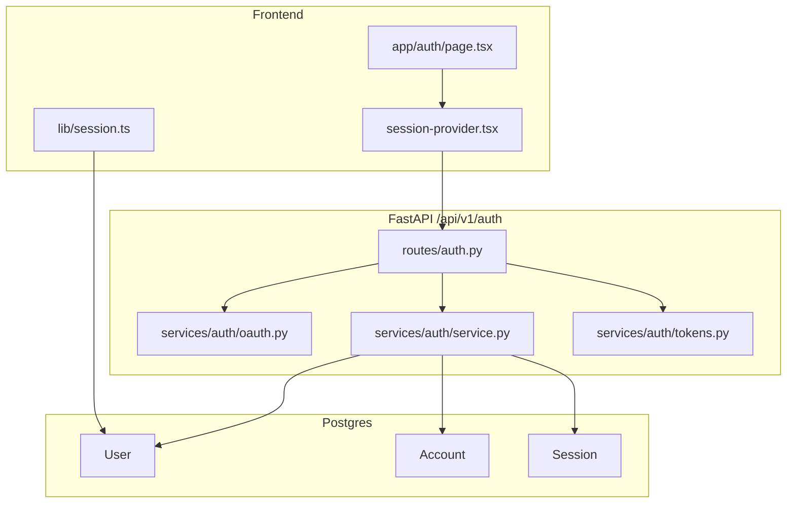
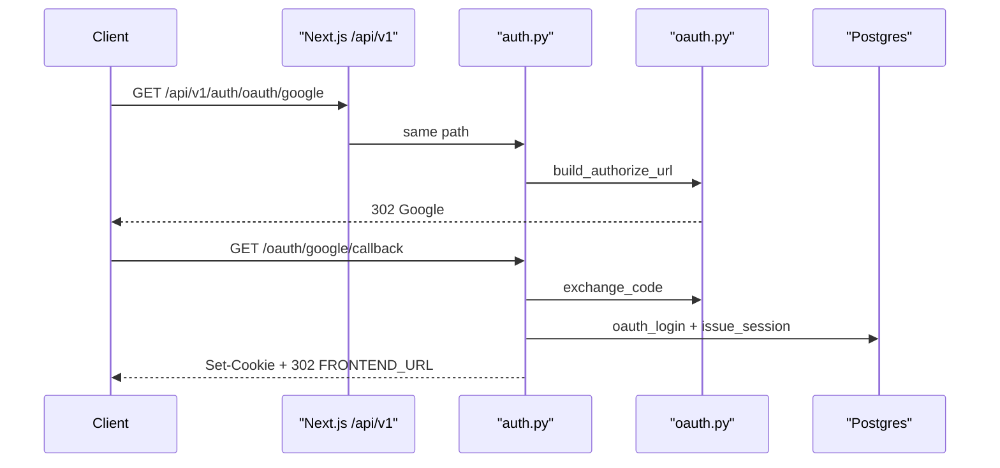
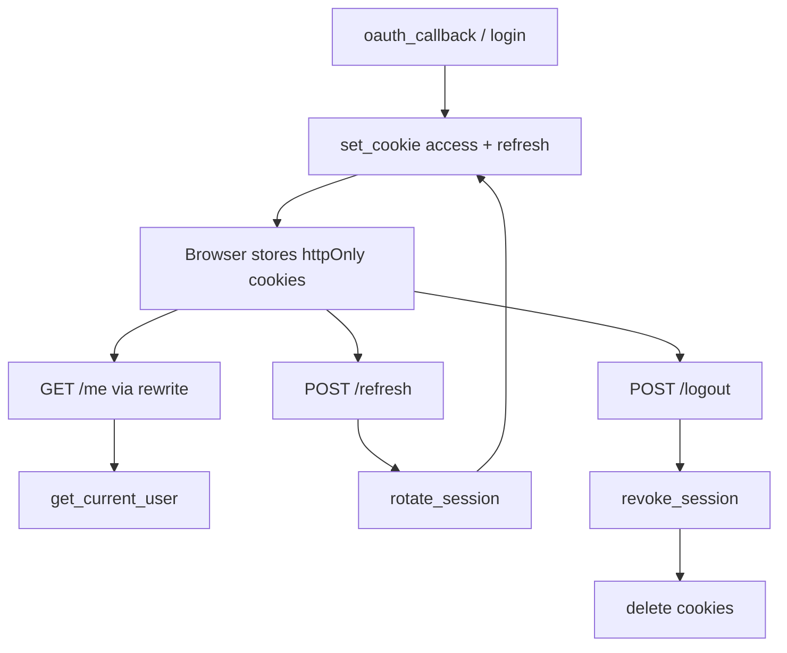
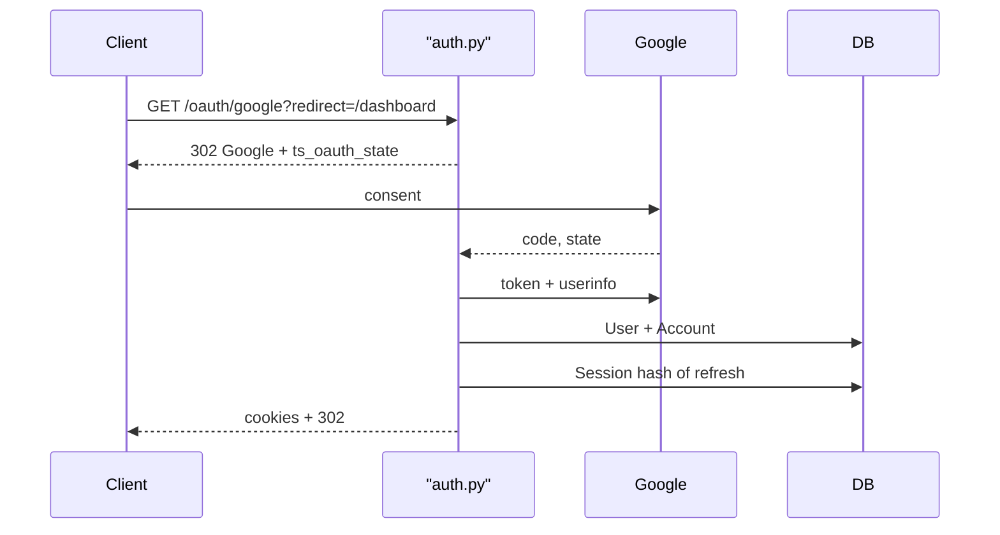
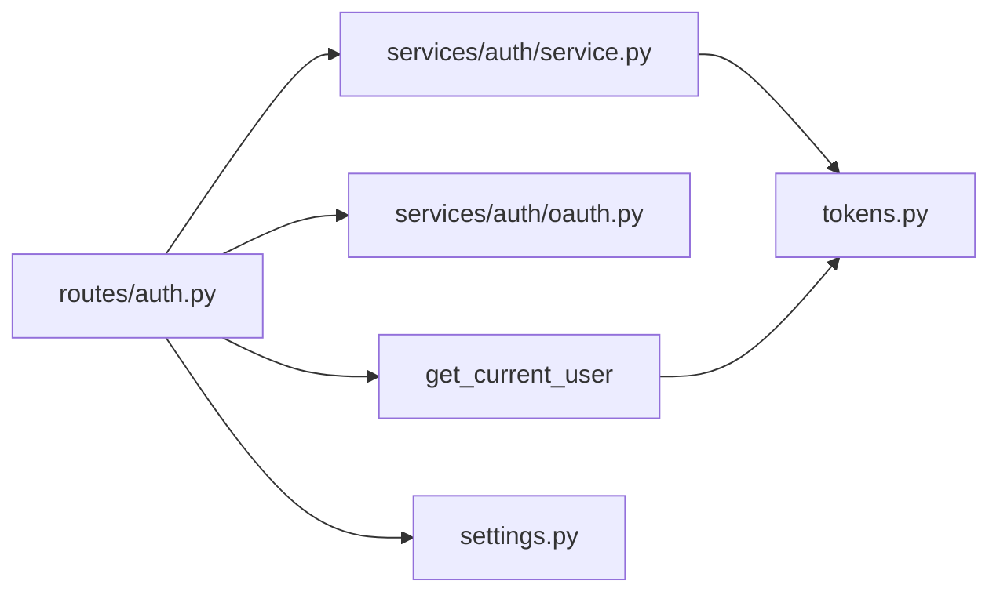

# Authentication API

FastAPI owns sign-in. Routes live under `/api/v1/auth` in `backend/app/routes/auth.py`. The Next.js app rewrites `/api/v1/:path*` to the backend so cookies stay first-party.

This is the job-seeker TalentSync app. NextAuth is gone.

## Repository layout


```mermaid
graph TB
subgraph "Frontend"
AUTHUI["app/auth/page.tsx"]
SP["session-provider.tsx"]
SESS["lib/session.ts"]
end
subgraph "FastAPI /api/v1/auth"
R["routes/auth.py"]
OAUTH["services/auth/oauth.py"]
SVC["services/auth/service.py"]
TOK["services/auth/tokens.py"]
end
subgraph "Postgres"
U["User"]
A["Account"]
S["Session"]
end
AUTHUI --> SP
SP --> R
SESS --> U
R --> OAUTH
R --> SVC
R --> TOK
SVC --> U
SVC --> A
SVC --> S
```

- `backend/app/routes/auth.py`
- `backend/app/services/auth/oauth.py`
- `backend/app/services/auth/service.py`
- `backend/app/services/auth/tokens.py`
- `backend/app/core/deps.py`
- `backend/app/core/settings.py`
- `frontend/lib/session.ts`
- `frontend/components/providers/session-provider.tsx`
- `frontend/next.config.js` (rewrite)

## Building blocks

- Google OAuth authorize + callback
- Access JWT cookie + opaque refresh cookie
- `GET /me`, `POST /refresh`, `POST /logout`
- `POST /update-role`, `DELETE /delete-account`
- Password routes gated by `CREDENTIALS_AUTH_ENABLED` (410 by default)

Cookie names: `COOKIE_ACCESS_NAME` (`ts_access_token`), `COOKIE_REFRESH_NAME` (`ts_refresh_token`).

## How it fits together


```mermaid
sequenceDiagram
participant Client
participant Rewrite as "Next.js /api/v1"
participant Auth as "auth.py"
participant OAuth as "oauth.py"
participant DB as "Postgres"
Client->>Rewrite : GET /api/v1/auth/oauth/google
Rewrite->>Auth : same path
Auth->>OAuth : build_authorize_url
OAuth-->>Client : 302 Google
Client->>Auth : GET /oauth/google/callback
Auth->>OAuth : exchange_code
Auth->>DB : oauth_login + issue_session
Auth-->>Client : Set-Cookie + 302 FRONTEND_URL
```

## Endpoints

Prefix: `/api/v1/auth`. Mounted in `backend/app/main.py`.

### Live (Google product)

| Method | Path | Auth | Notes |
| --- | --- | --- | --- |
| GET | `/oauth/{provider}` | no | `provider` must be `google` |
| GET | `/oauth/{provider}/callback` | no | sets cookies, redirects |
| GET | `/google` | no | alias of `/oauth/google` |
| GET | `/google/callback` | no | alias of `/oauth/google/callback` |
| POST | `/refresh` | refresh cookie | rotates session |
| POST | `/logout` | refresh cookie optional | revokes + clears cookies |
| GET | `/me` | access cookie or Bearer | current user |
| POST | `/update-role` | yes | body `{ role }` |
| DELETE | `/delete-account` | yes | cascade delete + clear cookies |

### 410 unless `CREDENTIALS_AUTH_ENABLED`

`POST /register`, `/verify-email`, `/resend-verification`, `/login`, `/forgot-password`, `/reset-password`.

Message: `Password sign-in has been removed. Continue with Google instead.` Code `CREDENTIALS_AUTH_DISABLED`.

## Session cookies


```mermaid
flowchart TD
Login["oauth_callback / login"] --> Set["set_cookie access + refresh"]
Set --> Browser["Browser stores httpOnly cookies"]
Browser --> Me["GET /me via rewrite"]
Me --> Current["get_current_user"]
Browser --> Refresh["POST /refresh"]
Refresh --> Rotate["rotate_session"]
Rotate --> Set
Browser --> Logout["POST /logout"]
Logout --> Revoke["revoke_session"]
Revoke --> Clear["delete cookies"]
```

Access cookie path `/`. Refresh cookie path `/api/v1/auth`. SameSite from `COOKIE_SAME_SITE` (default `lax`). `COOKIE_SECURE` off in local dev.

`issue_session` returns both tokens. JSON still includes `accessToken` for non-browser clients.

## Login

Product path is Google only.


```mermaid
sequenceDiagram
participant Client
participant Auth as "auth.py"
participant Google
participant DB
Client->>Auth : GET /oauth/google?redirect=/dashboard
Auth-->>Client : 302 Google + ts_oauth_state
Client->>Google : consent
Google-->>Auth : code, state
Auth->>Google : token + userinfo
Auth->>DB : User + Account
Auth->>DB : Session hash of refresh
Auth-->>Client : cookies + 302
```

`GET /me` after that:

```json
{
  "user": {
    "id": "...",
    "name": "...",
    "email": "...",
    "image": "...",
    "role": "USER",
    "isVerified": true,
    "roleSelectionRequired": true
  }
}
```

`roleSelectionRequired` is true when `roleSelectedAt` is null and an OAuth account exists.

## Logout

`POST /logout` reads the refresh cookie, revokes the `Session` row, deletes both cookies. Client `signOut()` in `session-provider.tsx` POSTs this then navigates.

## Refresh

`POST /refresh` requires `ts_refresh_token`. `rotate_session` rewrites the row, stores `previousToken`, and issues a new pair. Replay of an old refresh clears cookies and 401s.

The session provider refreshes on a 401 from `/me` and on a 15-minute timer.

## Role update and account deletion

`POST /update-role` with `{ "role": "USER" | "RECRUITER" | "ADMIN" }` via `auth_service.update_role`.

`DELETE /delete-account` deletes the user (cascades Account, Session, domain rows) and clears cookies.

Avatar writes are `POST /api/v1/user/update-avatar` in `backend/app/routes/user.py`, not this router.

## Dependencies


```mermaid
graph LR
R["routes/auth.py"] --> SVC["services/auth/service.py"]
R --> OAUTH["services/auth/oauth.py"]
R --> DEPS["get_current_user"]
SVC --> TOK["tokens.py"]
DEPS --> TOK
R --> SET["settings.py"]
```

## Troubleshooting

- 400 unsupported provider: only `google`.
- 400 Google not configured: missing `GOOGLE_CLIENT_ID` / `GOOGLE_CLIENT_SECRET`.
- Callback `?error=oauth`: bad state, missing code, or token exchange failure.
- `?error=oauth_email_taken`: email already on a local account.
- 401 no session to refresh: refresh cookie not sent (path/domain).
- 410 on `/login`: credentials auth is off. Use Google.
