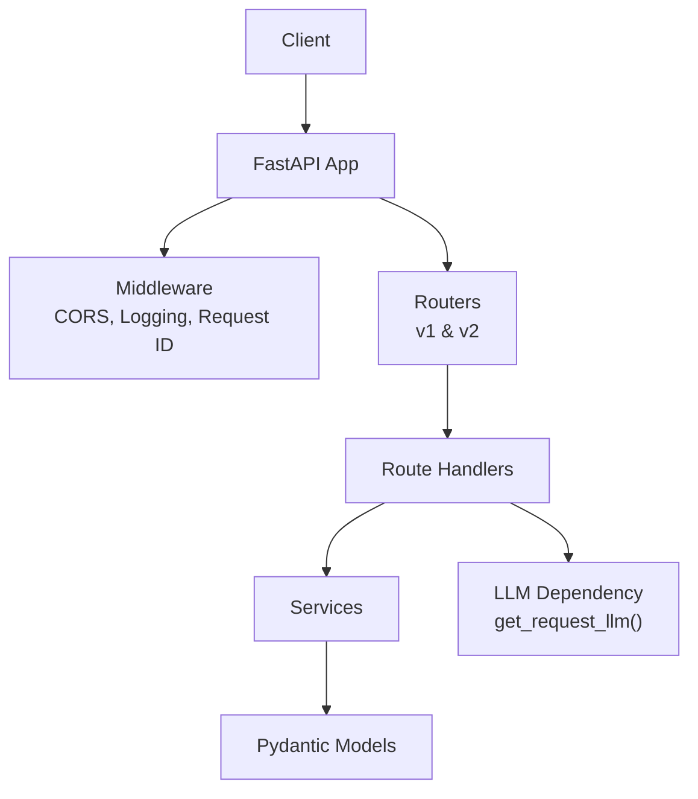
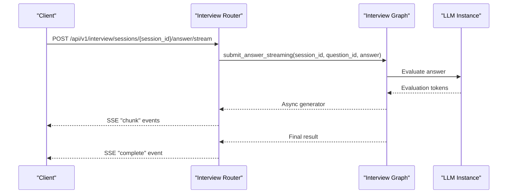
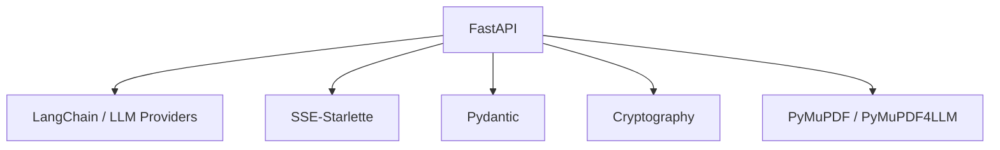

# Backend API Reference

<cite>
**Referenced Files in This Document**
- [backend/app/main.py](file://backend/app/main.py)
- [backend/pyproject.toml](file://backend/pyproject.toml)
- [backend/app/routes/ats.py](file://backend/app/routes/ats.py)
- [backend/app/routes/resume_analysis.py](file://backend/app/routes/resume_analysis.py)
- [backend/app/routes/interview.py](file://backend/app/routes/interview.py)
- [backend/app/routes/cold_mail.py](file://backend/app/routes/cold_mail.py)
- [backend/app/routes/cover_letter.py](file://backend/app/routes/cover_letter.py)
- [backend/app/routes/hiring_assistant.py](file://backend/app/routes/hiring_assistant.py)
- [backend/app/routes/tailored_resume.py](file://backend/app/routes/tailored_resume.py)
- [backend/app/routes/jd_editor.py](file://backend/app/routes/jd_editor.py)
- [backend/app/routes/resume_improvement.py](file://backend/app/routes/resume_improvement.py)
- [backend/app/routes/resume_enrichment.py](file://backend/app/routes/resume_enrichment.py)
- [backend/app/models/schemas.py](file://backend/app/models/schemas.py)
- [backend/app/models/ats_evaluator/schemas.py](file://backend/app/models/ats_evaluator/schemas.py)
- [backend/app/models/common/schemas.py](file://backend/app/models/common/schemas.py)
- [backend/app/models/interview/schemas.py](file://backend/app/models/interview/schemas.py)
- [backend/app/core/deps.py](file://backend/app/core/deps.py)
</cite>

## Table of Contents
1. [Introduction](#introduction)
2. [Project Structure](#project-structure)
3. [Core Components](#core-components)
4. [Architecture Overview](#architecture-overview)
5. [Detailed Component Analysis](#detailed-component-analysis)
6. [Dependency Analysis](#dependency-analysis)
7. [Performance Considerations](#performance-considerations)
8. [Troubleshooting Guide](#troubleshooting-guide)
9. [Conclusion](#conclusion)
10. [Appendices](#appendices)

## Introduction
This document provides a comprehensive API reference for the TalentSync-Normies backend RESTful API built with FastAPI. It covers all endpoints grouped by functional areas: resume analysis, ATS evaluation, interview system, communication tools, and resume enhancement. For each endpoint, you will find HTTP methods, URL patterns, request/response schemas, authentication requirements, error handling, and practical examples. It also documents v1 versus v2 API differences and migration paths, along with rate limiting, pagination, filtering, sorting, authentication headers, session management, role-based access control, webhook endpoints, real-time features, and streaming responses.

## Project Structure
The backend is organized around a modular FastAPI application with separate routers for each functional domain. Routers are mounted under both v1 and v2 prefixes to enable incremental migration. The application logs requests and responses and applies CORS middleware. LLM configuration is injected per request via headers.

```mermaid
graph TB
Main["FastAPI App<br/>backend/app/main.py"] --> V1["v1 Prefix<br/>/api/v1"]
Main --> V2["v2 Prefix<br/>/api/v2"]
V1 --> R1["ATS Evaluation<br/>/ats/*"]
V1 --> R2["Resume Analysis<br/>/resume/*"]
V1 --> R3["Interview<br/>/interview/*"]
V1 --> R4["Cold Mail<br/>/cold-mail/*"]
V1 --> R5["Cover Letter<br/>/cover-letter/*"]
V1 --> R6["Hiring Assistant<br/>/hiring-assistant/*"]
V1 --> R7["Tailored Resume<br/>/resume/tailor"]
V1 --> R8["Resume Improvement<br/>/resume/improve"]
V1 --> R9["Resume Enrichment<br/>/resume/enrichment/*"]
V1 --> R10["JD Editor<br/>/resume/edit-by-jd"]
V1 --> R11["Tips<br/>/tips/*"]
V1 --> R12["LinkedIn<br/>/linkedin/*"]
V1 --> R13["Postgres<br/>/postgres/*"]
V1 --> R14["LLM Config<br/>/llm/*"]
V2 --> S1["ATS Evaluation<br/>/ats/*"]
V2 --> S2["Resume Analysis<br/>/resume/*"]
V2 --> S3["Cold Mail<br/>/cold-mail/*"]
V2 --> S4["Cover Letter<br/>/cover-letter/*"]
V2 --> S5["Hiring Assistant<br/>/hiring-assistant/*"]
V2 --> S6["Tailored Resume<br/>/resume/tailor"]
V2 --> S7["Resume Improvement<br/>/resume/improve"]
V2 --> S8["Resume Enrichment<br/>/resume/enrichment/*"]
V2 --> S9["JD Editor<br/>/resume/edit-by-jd"]
```

**Diagram sources**
- [backend/app/main.py](file://backend/app/main.py#L157-L197)

**Section sources**
- [backend/app/main.py](file://backend/app/main.py#L157-L197)

## Core Components
- FastAPI Application: Centralized routing, middleware, and logging.
- Routers: Modular endpoints grouped by domain (e.g., ATS, Interview, Cold Mail).
- LLM Dependency Injection: Per-request LLM creation via headers for flexible provider/model selection.
- Request/Response Logging: Structured logging of payloads and durations.
- CORS: Configurable origins for cross-origin requests.

Key characteristics:
- Versioned endpoints: v1 and v2 coexist for incremental migration.
- Streaming endpoints: Interview service supports Server-Sent Events (SSE).
- File-based and text-based variants: Many endpoints offer both multipart/form-data and JSON payloads.

**Section sources**
- [backend/app/main.py](file://backend/app/main.py#L63-L154)
- [backend/app/core/deps.py](file://backend/app/core/deps.py#L22-L68)

## Architecture Overview
The API follows a layered architecture:
- Entry points: Routers define endpoints under /api/v1 and /api/v2.
- Processing: Route handlers depend on LLM instances resolved per request.
- Services: Business logic is encapsulated in service modules (referenced by routes).
- Models: Pydantic schemas define request/response contracts.

**Diagram sources**
- [backend/app/main.py](file://backend/app/main.py#L63-L154)
- [backend/app/core/deps.py](file://backend/app/core/deps.py#L22-L68)

## Detailed Component Analysis

### Authentication and Authorization
- Authentication headers:
  - X-LLM-Provider: LLM provider identifier (e.g., openai, anthropic).
  - X-LLM-Model: Model name (e.g., gpt-4o, claude-3.5-sonnet).
  - X-LLM-Key: Decrypted API key.
  - X-LLM-Base: Optional custom base URL.
- Behavior:
  - If headers are present, a per-request LLM is created using these values.
  - If missing, the server’s default LLM is used.
  - If the custom configuration fails, a 503 error is returned.
  - If the server default LLM is not configured, a 503 error is returned.
- Role-based access control:
  - No explicit RBAC checks are visible in the documented routes. Access control should be enforced at the application level if required.

Practical example (curl):
- Set headers for a custom LLM:
  - -H "X-LLM-Provider: openai"
  - -H "X-LLM-Model: gpt-4o"
  - -H "X-LLM-Key: YOUR_API_KEY"

**Section sources**
- [backend/app/core/deps.py](file://backend/app/core/deps.py#L22-L68)

### v1 vs v2 API Differences and Migration Paths
- Coexistence:
  - v1 endpoints are mounted under /api/v1.
  - v2 endpoints are mounted under /api/v2.
- Differences observed:
  - ATS Evaluation: v1 exposes file-based and text-based routers; v2 exposes text-based routers.
  - Resume Analysis: v1 has file-based and comprehensive analysis; v2 adds text-based format-and-analyze and analysis endpoints.
  - Cold Mail: v1 has file-based and editor endpoints; v2 adds text-based generator and editor endpoints.
  - Cover Letter: v1 has generator and editor endpoints; v2 remains unchanged in this file.
  - Hiring Assistant: v1 has file-based endpoint; v2 adds text-based endpoint.
  - Tailored Resume: v1 has file-based and text-based endpoints; v2 mirrors v1.
  - JD Editor: v2 introduces a new endpoint under /api/v2.
- Migration path:
  - Prefer v2 endpoints for new integrations.
  - Migrate clients incrementally by switching from v1 to v2 equivalents.
  - Validate request/response schemas carefully due to differences in payload formats.

**Section sources**
- [backend/app/main.py](file://backend/app/main.py#L157-L197)
- [backend/app/routes/ats.py](file://backend/app/routes/ats.py#L15-L184)
- [backend/app/routes/resume_analysis.py](file://backend/app/routes/resume_analysis.py#L13-L68)
- [backend/app/routes/cold_mail.py](file://backend/app/routes/cold_mail.py#L10-L150)
- [backend/app/routes/cover_letter.py](file://backend/app/routes/cover_letter.py#L13-L103)
- [backend/app/routes/hiring_assistant.py](file://backend/app/routes/hiring_assistant.py#L10-L68)
- [backend/app/routes/tailored_resume.py](file://backend/app/routes/tailored_resume.py#L12-L79)
- [backend/app/routes/jd_editor.py](file://backend/app/routes/jd_editor.py#L10-L23)

### Resume Analysis
- v1
  - POST /api/v1/resume/analysis
    - Content-Type: multipart/form-data
    - Form fields:
      - file: resume file (PDF, DOC, DOCX, TXT, MD)
    - Response: ResumeUploadResponse
  - POST /api/v1/resume/comprehensive/analysis/
    - Content-Type: multipart/form-data
    - Form fields:
      - file: resume file
    - Response: ComprehensiveAnalysisResponse
- v2
  - POST /api/v2/resume/format-and-analyze
    - Content-Type: multipart/form-data
    - Form fields:
      - file: resume file
    - Response: FormattedAndAnalyzedResumeResponse
  - POST /api/v2/resume/analysis
    - Content-Type: application/x-www-form-urlencoded or application/json
    - Form field or JSON field:
      - formated_resume: formatted resume text
    - Response: ComprehensiveAnalysisData

Validation and error handling:
- File extension validation for resume and job description files.
- LLM dependency injection via get_request_llm().
- Error responses for invalid payloads and processing failures.

Example curl (v2 text-based analysis):
- curl -X POST "{{API_BASE}}/api/v2/resume/analysis" \
  -F "formated_resume=<your-formatted-resume-text>" \
  -H "X-LLM-Provider: openai" \
  -H "X-LLM-Model: gpt-4o" \
  -H "X-LLM-Key: YOUR_API_KEY"

**Section sources**
- [backend/app/routes/resume_analysis.py](file://backend/app/routes/resume_analysis.py#L16-L67)
- [backend/app/models/schemas.py](file://backend/app/models/schemas.py#L50-L64)

### ATS Evaluation
- v1
  - POST /api/v1/ats/evaluate
    - Content-Type: multipart/form-data or application/json
    - File-based variant:
      - Form fields:
        - resume_file: resume file
        - jd_file: optional job description file (PDF, DOC, DOCX, TXT, MD)
        - jd_text: optional job description text
        - jd_link: optional job description URL
        - company_name: optional
        - company_website: optional
    - Text-based variant:
      - JSON body:
        - resume_text: required
        - Either jd_text or jd_link is required
        - company_name: optional
        - company_website: optional
    - Response: JDEvaluatorResponse
- v2
  - POST /api/v2/ats/evaluate
    - Content-Type: multipart/form-data or application/json
    - Text-based variant:
      - JSON body:
        - resume_text: required
        - Either jd_text or jd_link is required
        - company_name: optional
        - company_website: optional
    - Response: JDEvaluatorResponse

Validation and error handling:
- At least one of jd_text or jd_link must be provided.
- File extension validation for JD files.
- Error responses for invalid payloads and processing failures.

Example curl (v2 text-based evaluation):
- curl -X POST "{{API_BASE}}/api/v2/ats/evaluate" \
  -H "Content-Type: application/json" \
  -d '{"resume_text":"<resume-text>","jd_text":"<job-description>"}' \
  -H "X-LLM-Provider: openai" \
  -H "X-LLM-Model: gpt-4o" \
  -H "X-LLM-Key: YOUR_API_KEY"

**Section sources**
- [backend/app/routes/ats.py](file://backend/app/routes/ats.py#L50-L184)
- [backend/app/models/ats_evaluator/schemas.py](file://backend/app/models/ats_evaluator/schemas.py#L20-L44)

### Interview System (Real-time, Streaming)
Endpoints:
- GET /api/v1/interview/templates
  - Response: templates list
- GET /api/v1/interview/templates/{template_id}
  - Response: template details
- POST /api/v1/interview/sessions
  - Request: CreateInterviewRequest
  - Response: InterviewSessionResponse
- GET /api/v1/interview/sessions/{session_id}
  - Response: InterviewSessionResponse
- DELETE /api/v1/interview/sessions/{session_id}
  - Response: deletion confirmation
- GET /api/v1/interview/sessions
  - Query params:
    - status: filter by status (enum)
    - limit: integer
  - Response: sessions array and count
- POST /api/v1/interview/sessions/{session_id}/answer
  - Request: SubmitAnswerRequest
  - Response: evaluation score, feedback, strengths, improvements, next_question, is_complete
- GET /api/v1/interview/sessions/{session_id}/summary
  - Response: final score, summary, strengths, weaknesses, recommendations, hiring recommendation
- GET /api/v1/interview/code/languages
  - Response: supported languages list
- POST /api/v1/interview/sessions/{session_id}/skip
  - Response: skipped flag, next_question, is_complete
- POST /api/v1/interview/sessions/{session_id}/events
  - Request: InterviewEventRequest
  - Response: recorded flag, event type, tab_switch_count, warning flag
- GET /api/v1/interview/sessions/{session_id}/events
  - Query params:
    - event_type: filter by event type (enum)
  - Response: events array and count
- GET /api/v1/interview/health
  - Response: health status and active session count

Streaming endpoints:
- POST /api/v1/interview/sessions/{session_id}/answer/stream
  - Media type: text/event-stream
  - Events:
    - chunk: partial evaluation text
    - complete: final result with score and next question
    - error: error message
- POST /api/v1/interview/sessions/{session_id}/code/stream
  - Media type: text/event-stream
  - Events:
    - execution: code execution result
    - chunk: partial code review text
    - complete: final result with score and next question
    - error: error message
- POST /api/v1/interview/sessions/{session_id}/summary/stream
  - Media type: text/event-stream
  - Events:
    - chunk: partial summary text
    - complete: final summary with score and recommendation
    - error: error message

Validation and error handling:
- Enum validation for status and event_type.
- 404 for missing sessions or templates.
- 500 for internal errors.
- SSE generator handles exceptions and emits error events.

Sequence diagram (submit answer stream):

**Diagram sources**
- [backend/app/routes/interview.py](file://backend/app/routes/interview.py#L188-L224)

**Section sources**
- [backend/app/routes/interview.py](file://backend/app/routes/interview.py#L44-L494)
- [backend/app/models/interview/schemas.py](file://backend/app/models/interview/schemas.py#L109-L169)

### Communication Tools
- Cold Mail
  - v1
    - POST /api/v1/cold-mail/generator/
      - Content-Type: multipart/form-data
      - Form fields:
        - file: resume file
        - recipient_name, recipient_designation, company_name, sender_name, sender_role_or_goal
        - key_points_to_include: optional
        - additional_info_for_llm: optional
        - company_url: optional
      - Response: ColdMailResponse
    - POST /api/v1/cold-mail/editor/
      - Content-Type: multipart/form-data
      - Form fields:
        - file: resume file
        - recipient_name, recipient_designation, company_name, sender_name, sender_role_or_goal
        - key_points_to_include: optional
        - additional_info_for_llm: optional
        - company_url: optional
        - generated_email_subject, generated_email_body, edit_inscription
      - Response: ColdMailResponse
  - v2
    - POST /api/v2/cold-mail/generator/
      - Content-Type: application/x-www-form-urlencoded or application/json
      - Form field or JSON field:
        - resume_text: required
        - recipient_name, recipient_designation, company_name, sender_name, sender_role_or_goal
        - key_points_to_include: optional
        - additional_info_for_llm: optional
        - company_url: optional
      - Response: ColdMailResponse
    - POST /api/v2/cold-mail/edit/
      - Content-Type: application/x-www-form-urlencoded or application/json
      - Form fields or JSON fields:
        - resume_text: required
        - recipient_name, recipient_designation, company_name, sender_name, sender_role_or_goal
        - key_points_to_include: optional
        - additional_info_for_llm: optional
        - company_url: optional
        - generated_email_subject, generated_email_body, edit_inscription
      - Response: ColdMailResponse

- Cover Letter
  - v1
    - POST /api/v1/cover-letter/generator/
      - Content-Type: application/x-www-form-urlencoded or application/json
      - Form fields or JSON fields:
        - resume_text: required
        - recipient_name, company_name, sender_name, sender_role_or_goal
        - job_description: optional
        - jd_url: optional
        - key_points_to_include: optional
        - additional_info_for_llm: optional
        - company_url: optional
        - language: default "en"
      - Response: CoverLetterResponse
    - POST /api/v1/cover-letter/edit/
      - Content-Type: application/x-www-form-urlencoded or application/json
      - Form fields or JSON fields:
        - resume_text: required
        - recipient_name, company_name, sender_name, sender_role_or_goal
        - job_description: optional
        - jd_url: optional
        - key_points_to_include: optional
        - additional_info_for_llm: optional
        - company_url: optional
        - generated_cover_letter: required
        - edit_instructions: required
        - language: default "en"
      - Response: CoverLetterResponse

Validation and error handling:
- Form-based endpoints accept multipart/form-data.
- JSON-based endpoints accept application/json.
- LLM dependency injection via get_request_llm().

Example curl (v2 cold mail generator):
- curl -X POST "{{API_BASE}}/api/v2/cold-mail/generator/" \
  -F "resume_text=<resume-text>" \
  -F "recipient_name=John Doe" \
  -F "recipient_designation=Hiring Manager" \
  -F "company_name=Acme Inc." \
  -F "sender_name=Alice" \
  -F "sender_role_or_goal=Recruiter" \
  -H "X-LLM-Provider: openai" \
  -H "X-LLM-Model: gpt-4o" \
  -H "X-LLM-Key: YOUR_API_KEY"

**Section sources**
- [backend/app/routes/cold_mail.py](file://backend/app/routes/cold_mail.py#L13-L150)
- [backend/app/routes/cover_letter.py](file://backend/app/routes/cover_letter.py#L16-L103)

### Hiring Assistant
- v1
  - POST /api/v1/hiring-assistant/
    - Content-Type: multipart/form-data
    - Form fields:
      - file: resume file
      - role: required
      - questions: required
      - company_name: required
      - user_knowledge: optional
      - company_url: optional
      - word_limit: optional (integer)
    - Response: HiringAssistantResponse
- v2
  - POST /api/v2/hiring-assistant/
    - Content-Type: application/x-www-form-urlencoded or application/json
    - Form field or JSON field:
      - resume_text: required
      - role: required
      - questions: required
      - company_name: required
      - user_knowledge: optional
      - company_url: optional
      - word_limit: optional (integer)
    - Response: HiringAssistantResponse

Validation and error handling:
- word_limit constrained to a reasonable range (as defined in the service).
- LLM dependency injection via get_request_llm().

Example curl (v2 hiring assistant):
- curl -X POST "{{API_BASE}}/api/v2/hiring-assistant/" \
  -F "resume_text=<resume-text>" \
  -F "role=Software Engineer" \
  -F "questions=Explain OOP principles" \
  -F "company_name=Tech Corp" \
  -H "X-LLM-Provider: openai" \
  -H "X-LLM-Model: gpt-4o" \
  -H "X-LLM-Key: YOUR_API_KEY"

**Section sources**
- [backend/app/routes/hiring_assistant.py](file://backend/app/routes/hiring_assistant.py#L13-L68)

### Tailored Resume
- v1
  - POST /api/v1/resume/tailor
    - Content-Type: multipart/form-data
    - Form fields:
      - resume_file: required
      - job_role: required
      - company_name: optional
      - company_website: optional
      - job_description: optional
    - Response: ComprehensiveAnalysisResponse
- v2
  - POST /api/v2/resume/tailor
    - Content-Type: application/json
    - JSON body:
      - resume_text: required
      - job_role: required
      - company_name: optional
      - company_website: optional
      - job_description: optional
    - Response: ComprehensiveAnalysisResponse

Validation and error handling:
- LLM dependency injection via get_request_llm().

Example curl (v2 tailored resume):
- curl -X POST "{{API_BASE}}/api/v2/resume/tailor" \
  -H "Content-Type: application/json" \
  -d '{"resume_text":"<resume-text>","job_role":"Senior Developer"}' \
  -H "X-LLM-Provider: openai" \
  -H "X-LLM-Model: gpt-4o" \
  -H "X-LLM-Key: YOUR_API_KEY"

**Section sources**
- [backend/app/routes/tailored_resume.py](file://backend/app/routes/tailored_resume.py#L52-L79)

### JD Editor (v2)
- POST /api/v2/resume/edit-by-jd
  - Content-Type: application/json
  - Request: JDEditRequest
  - Response: JDEditResponse

Validation and error handling:
- LLM dependency injection via get_request_llm().

Example curl:
- curl -X POST "{{API_BASE}}/api/v2/resume/edit-by-jd" \
  -H "Content-Type: application/json" \
  -d '{"resume_data":{...},"jd_text":"<job-description>"}' \
  -H "X-LLM-Provider: openai" \
  -H "X-LLM-Model: gpt-4o" \
  -H "X-LLM-Key: YOUR_API_KEY"

**Section sources**
- [backend/app/routes/jd_editor.py](file://backend/app/routes/jd_editor.py#L13-L23)

### Resume Improvement and Enrichment
- Resume Improvement
  - POST /api/v1/resume/improve
    - Content-Type: application/json
    - Request: ResumeImproveRequest
    - Response: ResumeImproveResponse
  - POST /api/v2/resume/improve
    - Same contract as v1
- Resume Enrichment
  - POST /api/v1/resume/enrichment/analyze
    - Content-Type: application/json
    - Request: AnalyzeRequest
    - Response: AnalysisResponse
  - POST /api/v1/resume/enrichment/enhance
    - Content-Type: application/json
    - Request: EnhanceRequest
    - Response: EnhancementPreview
  - POST /api/v1/resume/enrichment/refine
    - Content-Type: application/json
    - Request: RefineEnhancementsRequest
    - Response: EnhancementPreview
  - POST /api/v1/resume/enrichment/apply
    - Content-Type: application/json
    - Request: ApplyEnhancementsRequest
    - Response: updated resume object
  - POST /api/v1/resume/enrichment/regenerate
    - Content-Type: application/json
    - Request: RegenerateRequest
    - Response: RegenerateResponse
  - POST /api/v1/resume/enrichment/apply-regenerated
    - Content-Type: application/json
    - Request: ApplyRegeneratedRequest
    - Response: updated resume object

Validation and error handling:
- LLM dependency injection via get_request_llm() for generation endpoints.
- Some apply endpoints may return 409 when applying regenerated items conflicts occur.

Example curl (v1 enrichment analyze):
- curl -X POST "{{API_BASE}}/api/v1/resume/enrichment/analyze" \
  -H "Content-Type: application/json" \
  -d '{"resume_data":{...}}' \
  -H "X-LLM-Provider: openai" \
  -H "X-LLM-Model: gpt-4o" \
  -H "X-LLM-Key: YOUR_API_KEY"

**Section sources**
- [backend/app/routes/resume_improvement.py](file://backend/app/routes/resume_improvement.py#L21-L43)
- [backend/app/routes/resume_enrichment.py](file://backend/app/routes/resume_enrichment.py#L30-L118)

### Additional v1 Endpoints
- Tips
  - GET /api/v1/tips
  - Response: TipsResponse
- LinkedIn
  - GET /api/v1/linkedin/posts
  - POST /api/v1/linkedin/posts
  - Responses: PostGenerationResponse, GitHubAnalysisResponse
- Postgres
  - GET /api/v1/postgres/stats
  - Response: stats object
- LLM Config
  - GET /api/v1/llm/config
  - PUT /api/v1/llm/config
  - Response: config object

Note: These endpoints are included in the v1 mount but are not covered in detail here due to scope limitations.

**Section sources**
- [backend/app/main.py](file://backend/app/main.py#L157-L203)

## Dependency Analysis
External dependencies relevant to the API:
- FastAPI: Web framework and ASGI server.
- LangChain ecosystem: LLM integrations (OpenAI, Anthropic, Google, Ollama).
- SSE support: sse-starlette for streaming responses.
- Pydantic: Data validation and serialization.
- Cryptography: Encryption utilities.
- PDF/text processing: pymupdf, pymupdf4llm.

**Diagram sources**
- [backend/pyproject.toml](file://backend/pyproject.toml#L7-L33)

**Section sources**
- [backend/pyproject.toml](file://backend/pyproject.toml#L7-L33)

## Performance Considerations
- Streaming responses: Use SSE endpoints for long-running evaluations to reduce latency and improve UX.
- LLM cost and latency: Configure appropriate providers and models via headers to balance quality and speed.
- File processing: Large resume/JD files may increase processing time; consider compression and validation.
- Pagination and filtering: Use query parameters (e.g., limit, status) to constrain result sets for list endpoints.

## Troubleshooting Guide
Common issues and resolutions:
- LLM configuration errors:
  - Symptom: 503 error indicating LLM service not configured.
  - Resolution: Set up default LLM provider or pass custom headers (X-LLM-Provider, X-LLM-Model, X-LLM-Key).
- Invalid payloads:
  - Symptom: 400 error for missing required fields or invalid combinations.
  - Resolution: Ensure either jd_text or jd_link is provided for ATS evaluation; validate form fields for multipart endpoints.
- Session not found:
  - Symptom: 404 error for interview endpoints.
  - Resolution: Verify session_id exists and is correct.
- Unsupported file types:
  - Symptom: 400 error for JD files with unsupported extensions.
  - Resolution: Use allowed extensions (PDF, DOC, DOCX, TXT, MD).

Logging:
- Requests and responses are logged with request IDs for tracing.

**Section sources**
- [backend/app/core/deps.py](file://backend/app/core/deps.py#L48-L68)
- [backend/app/routes/ats.py](file://backend/app/routes/ats.py#L82-L95)
- [backend/app/routes/interview.py](file://backend/app/routes/interview.py#L94-L108)

## Conclusion
TalentSync-Normies provides a comprehensive RESTful API for resume analysis, ATS evaluation, interview simulation with streaming, and communication tools. The API offers both v1 and v2 endpoints to facilitate migration, robust request/response schemas, and per-request LLM configuration. Real-time features leverage SSE for interactive experiences. For production use, ensure proper LLM configuration, validate inputs, and adopt SSE endpoints for improved responsiveness.

## Appendices

### Request/Response Schemas Overview
- Common schemas:
  - WorkExperienceEntry, ProjectEntry, PublicationEntry, PositionOfResponsibilityEntry, CertificationEntry, AchievementEntry, SkillProficiency, LanguageEntry, EducationEntry, ErrorResponse
- ATS Evaluator:
  - ATSEvaluationRequest, ATSEvaluationResponse, JDEvaluatorRequest, JDEvaluatorResponse
- Interview:
  - InterviewQuestion, CandidateProfile, InterviewConfig, InterviewSession, InterviewEvent, CreateInterviewRequest, SubmitAnswerRequest, CodeExecutionRequest, InterviewEventRequest, InterviewSessionResponse, EvaluationResult, CodeExecutionResult
- Resume Analysis:
  - ComprehensiveAnalysisData, ComprehensiveAnalysisResponse, FormattedAndAnalyzedResumeResponse, ResumeUploadResponse

**Section sources**
- [backend/app/models/common/schemas.py](file://backend/app/models/common/schemas.py#L6-L128)
- [backend/app/models/ats_evaluator/schemas.py](file://backend/app/models/ats_evaluator/schemas.py#L6-L44)
- [backend/app/models/interview/schemas.py](file://backend/app/models/interview/schemas.py#L22-L169)
- [backend/app/models/schemas.py](file://backend/app/models/schemas.py#L1-L191)