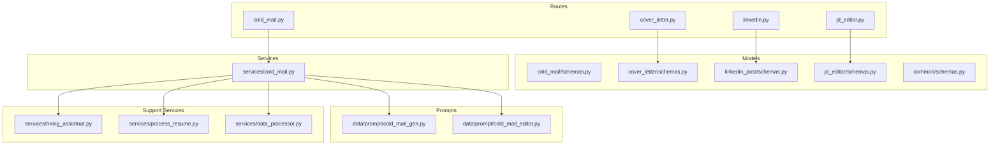
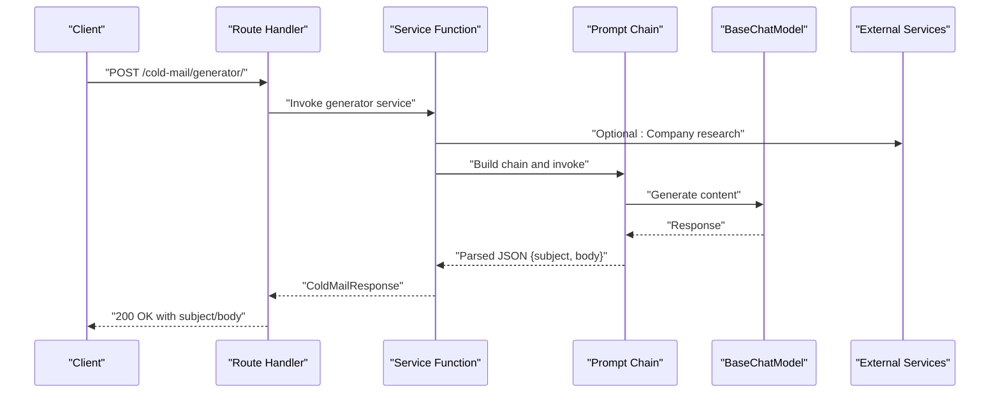
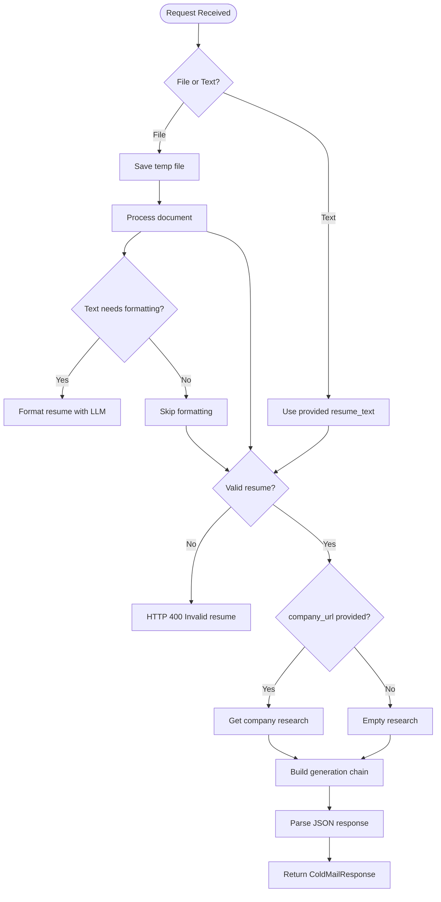
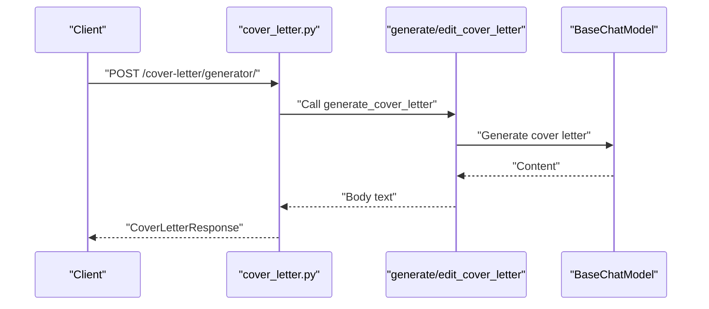
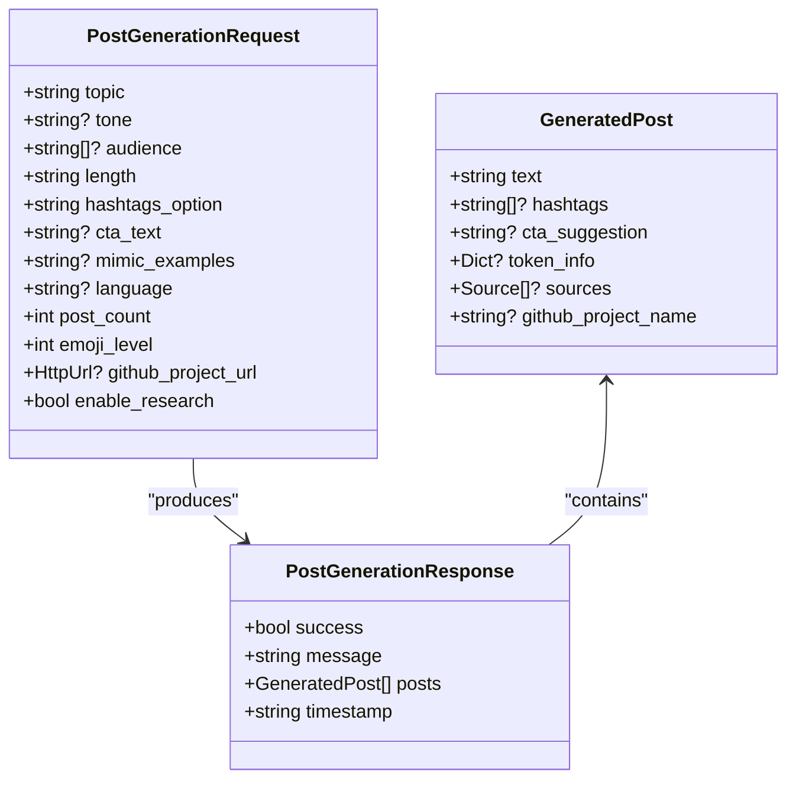
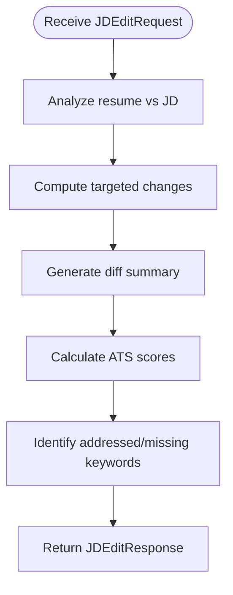
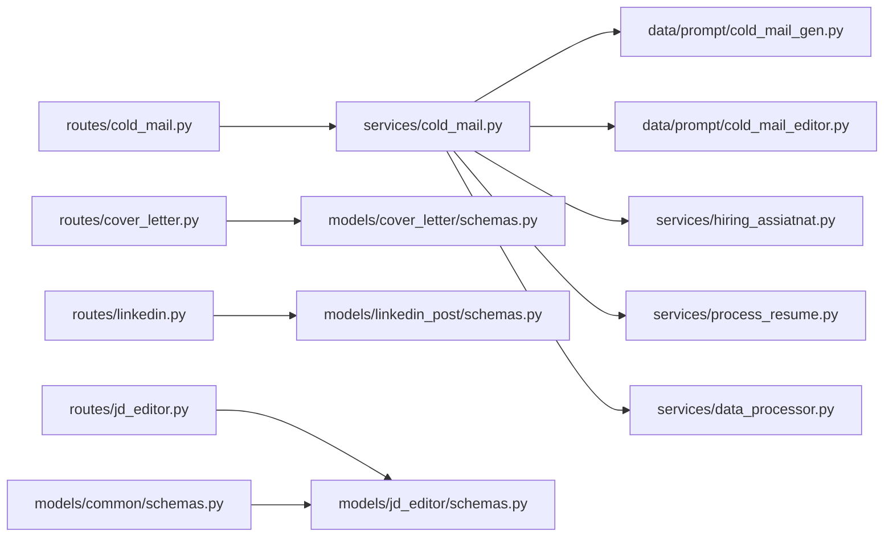

# Communication Tools API

<cite>
**Referenced Files in This Document**
- [cold_mail.py](file://backend/app/routes/cold_mail.py)
- [cover_letter.py](file://backend/app/routes/cover_letter.py)
- [linkedin.py](file://backend/app/routes/linkedin.py)
- [jd_editor.py](file://backend/app/routes/jd_editor.py)
- [schemas.py](file://backend/app/models/cold_mail/schemas.py)
- [schemas.py](file://backend/app/models/cover_letter/schemas.py)
- [schemas.py](file://backend/app/models/linkedin_post/schemas.py)
- [schemas.py](file://backend/app/models/jd_editor/schemas.py)
- [schemas.py](file://backend/app/models/common/schemas.py)
- [cold_mail.py](file://backend/app/services/cold_mail.py)
- [cold_mail_gen.py](file://backend/app/data/prompt/cold_mail_gen.py)
- [cold_mail_editor.py](file://backend/app/data/prompt/cold_mail_editor.py)
- [hiring_assiatnat.py](file://backend/app/services/hiring_assiatnat.py)
- [process_resume.py](file://backend/app/services/process_resume.py)
- [data_processor.py](file://backend/app/services/data_processor.py)
</cite>

## Table of Contents
1. [Introduction](#introduction)
2. [Project Structure](#project-structure)
3. [Core Components](#core-components)
4. [Architecture Overview](#architecture-overview)
5. [Detailed Component Analysis](#detailed-component-analysis)
6. [Dependency Analysis](#dependency-analysis)
7. [Performance Considerations](#performance-considerations)
8. [Troubleshooting Guide](#troubleshooting-guide)
9. [Conclusion](#conclusion)

## Introduction
This document provides comprehensive API documentation for AI-powered communication tools focused on cold email generation, cover letter creation, LinkedIn post generation, and job description editing. It explains request/response schemas, personalization parameters, prompt engineering approaches, content optimization strategies, brand consistency enforcement, bulk generation capabilities, template management, approval workflows, and quality assurance measures.

## Project Structure
The communication tools are implemented as FastAPI routes backed by LangChain-based services and prompts. Each tool has:
- Route handlers that accept form or JSON payloads
- Pydantic models defining request/response schemas
- Service functions orchestrating LLM chains, optional document processing, and company research
- Prompt builders that construct LangChain chains for content generation and editing

**Diagram sources**
- [cold_mail.py](file://backend/app/routes/cold_mail.py#L1-L150)
- [cover_letter.py](file://backend/app/routes/cover_letter.py#L1-L103)
- [linkedin.py](file://backend/app/routes/linkedin.py#L1-L75)
- [jd_editor.py](file://backend/app/routes/jd_editor.py#L1-L23)
- [schemas.py](file://backend/app/models/cold_mail/schemas.py#L1-L52)
- [schemas.py](file://backend/app/models/cover_letter/schemas.py#L1-L33)
- [schemas.py](file://backend/app/models/linkedin_post/schemas.py#L1-L70)
- [schemas.py](file://backend/app/models/jd_editor/schemas.py#L1-L44)
- [schemas.py](file://backend/app/models/common/schemas.py#L1-L128)
- [cold_mail.py](file://backend/app/services/cold_mail.py#L1-L540)
- [cold_mail_gen.py](file://backend/app/data/prompt/cold_mail_gen.py)
- [cold_mail_editor.py](file://backend/app/data/prompt/cold_mail_editor.py)
- [hiring_assiatnat.py](file://backend/app/services/hiring_assiatnat.py)
- [process_resume.py](file://backend/app/services/process_resume.py)
- [data_processor.py](file://backend/app/services/data_processor.py)

**Section sources**
- [cold_mail.py](file://backend/app/routes/cold_mail.py#L1-L150)
- [cover_letter.py](file://backend/app/routes/cover_letter.py#L1-L103)
- [linkedin.py](file://backend/app/routes/linkedin.py#L1-L75)
- [jd_editor.py](file://backend/app/routes/jd_editor.py#L1-L23)

## Core Components
- Cold Email Generation and Editing: Two variants support file upload and raw text inputs, with optional company URL research and key points personalization.
- Cover Letter Generation and Editing: Accepts resume text, job description, and personalization parameters; supports language selection.
- LinkedIn Post Generation and Editing: Generates multiple posts with hashtags and CTAs; supports editing existing posts.
- Job Description Editing: Aligns resume content with a specific job description, returning detailed changes and ATS metrics.

**Section sources**
- [cold_mail.py](file://backend/app/routes/cold_mail.py#L13-L150)
- [cover_letter.py](file://backend/app/routes/cover_letter.py#L16-L103)
- [linkedin.py](file://backend/app/routes/linkedin.py#L17-L75)
- [jd_editor.py](file://backend/app/routes/jd_editor.py#L13-L23)

## Architecture Overview
The system follows a layered architecture:
- Routes: Define endpoints and bind request/response models
- Services: Implement business logic, orchestrate LLM chains, and integrate external services
- Prompts: Provide LangChain chains for generation and editing
- Support Services: Handle document processing, company research, and text formatting

**Diagram sources**
- [cold_mail.py](file://backend/app/routes/cold_mail.py#L13-L41)
- [cold_mail.py](file://backend/app/services/cold_mail.py#L250-L341)
- [cold_mail_gen.py](file://backend/app/data/prompt/cold_mail_gen.py)
- [hiring_assiatnat.py](file://backend/app/services/hiring_assiatnat.py)

## Detailed Component Analysis

### Cold Email Generation and Editing
Endpoints:
- POST /cold-mail/generator/ (file-based)
- POST /cold-mail/generator/ (text-based)
- POST /cold-mail/editor/ (file-based)
- POST /cold-mail/edit/ (text-based)

Request parameters:
- Recipient and sender details: recipient_name, recipient_designation, company_name, sender_name, sender_role_or_goal
- Personalization: key_points_to_include, additional_info_for_llm, company_url
- For editing: generated_email_subject, generated_email_body, edit_inscription

Response:
- ColdMailResponse with success flag, message, subject, and body

Processing logic:
- File-based endpoints save temporary files, process documents, and optionally reformat resume text via LLM
- Both generation and editing use LangChain chains built from prompt modules
- Optional company research enriches prompts with company-specific context
- Robust JSON parsing handles various LLM output formats

**Diagram sources**
- [cold_mail.py](file://backend/app/routes/cold_mail.py#L13-L150)
- [cold_mail.py](file://backend/app/services/cold_mail.py#L250-L540)
- [cold_mail_gen.py](file://backend/app/data/prompt/cold_mail_gen.py)
- [cold_mail_editor.py](file://backend/app/data/prompt/cold_mail_editor.py)
- [process_resume.py](file://backend/app/services/process_resume.py)
- [data_processor.py](file://backend/app/services/data_processor.py)
- [hiring_assiatnat.py](file://backend/app/services/hiring_assiatnat.py)

**Section sources**
- [cold_mail.py](file://backend/app/routes/cold_mail.py#L13-L150)
- [schemas.py](file://backend/app/models/cold_mail/schemas.py#L6-L52)
- [cold_mail.py](file://backend/app/services/cold_mail.py#L16-L128)

### Cover Letter Creation and Editing
Endpoints:
- POST /cover-letter/generator/
- POST /cover-letter/edit/

Request parameters:
- Resume text and job description: resume_text, job_description, jd_url
- Personalization: recipient_name, company_name, sender_name, sender_role_or_goal, key_points_to_include, additional_info_for_llm, company_url
- Language selection: language (default en)

Response:
- CoverLetterResponse with success flag, message, and body

Processing logic:
- Uses dedicated generation and editing functions
- Supports language localization
- Integrates optional company URL for context

**Diagram sources**
- [cover_letter.py](file://backend/app/routes/cover_letter.py#L16-L103)
- [schemas.py](file://backend/app/models/cover_letter/schemas.py#L5-L33)

**Section sources**
- [cover_letter.py](file://backend/app/routes/cover_letter.py#L16-L103)
- [schemas.py](file://backend/app/models/cover_letter/schemas.py#L5-L33)

### LinkedIn Post Generation and Editing
Endpoints:
- POST /linkedin/generate-posts
- POST /linkedin/edit-post
- POST /linkedin/generate-page

Request parameters:
- Generate posts: topic, tone, audience, length, hashtags_option, cta_text, mimic_examples, language, post_count, emoji_level, github_project_url, enable_research
- Edit post: arbitrary payload with post content and instruction
- Generate page: comprehensive request for profile, posts, and engagement strategy

Response:
- PostGenerationResponse with success flag, message, list of posts, and timestamp
- Individual post includes text, hashtags, CTA suggestion, token info, sources, and GitHub project name
- Edit post returns updated post content

Processing logic:
- Supports multiple posts per request with configurable counts and lengths
- Optional GitHub project analysis for insights and hooks
- Web research can be enabled for topic insights

**Diagram sources**
- [schemas.py](file://backend/app/models/linkedin_post/schemas.py#L7-L50)

**Section sources**
- [linkedin.py](file://backend/app/routes/linkedin.py#L17-L75)
- [schemas.py](file://backend/app/models/linkedin_post/schemas.py#L7-L70)

### Job Description Editing (Resume Alignment)
Endpoint:
- POST /resume/edit-by-jd

Request parameters:
- resume_text and structured resume data
- job_description and optional jd_url, company_name
- language selection

Response:
- JDEditResponse with success flag, message, edited resume, changes, diff summary, ATS scores, keyword analysis, and warnings

Processing logic:
- Aligns resume content with job description using targeted edits
- Provides detailed diffs and ATS metrics before/after
- Highlights addressed and missing keywords

**Diagram sources**
- [jd_editor.py](file://backend/app/routes/jd_editor.py#L13-L23)
- [schemas.py](file://backend/app/models/jd_editor/schemas.py#L9-L44)

**Section sources**
- [jd_editor.py](file://backend/app/routes/jd_editor.py#L13-L23)
- [schemas.py](file://backend/app/models/jd_editor/schemas.py#L9-L44)

## Dependency Analysis
Key dependencies and relationships:
- Routes depend on service functions for business logic
- Services depend on LangChain prompt modules for chain construction
- Cold email services optionally depend on company research and resume processing utilities
- Common schemas define reusable data structures across models

**Diagram sources**
- [cold_mail.py](file://backend/app/routes/cold_mail.py#L1-L150)
- [cover_letter.py](file://backend/app/routes/cover_letter.py#L1-L103)
- [linkedin.py](file://backend/app/routes/linkedin.py#L1-L75)
- [jd_editor.py](file://backend/app/routes/jd_editor.py#L1-L23)
- [schemas.py](file://backend/app/models/cold_mail/schemas.py#L1-L52)
- [schemas.py](file://backend/app/models/cover_letter/schemas.py#L1-L33)
- [schemas.py](file://backend/app/models/linkedin_post/schemas.py#L1-L70)
- [schemas.py](file://backend/app/models/jd_editor/schemas.py#L1-L44)
- [schemas.py](file://backend/app/models/common/schemas.py#L1-L128)
- [cold_mail.py](file://backend/app/services/cold_mail.py#L1-L540)
- [cold_mail_gen.py](file://backend/app/data/prompt/cold_mail_gen.py)
- [cold_mail_editor.py](file://backend/app/data/prompt/cold_mail_editor.py)
- [hiring_assiatnat.py](file://backend/app/services/hiring_assiatnat.py)
- [process_resume.py](file://backend/app/services/process_resume.py)
- [data_processor.py](file://backend/app/services/data_processor.py)

**Section sources**
- [cold_mail.py](file://backend/app/routes/cold_mail.py#L1-L150)
- [cover_letter.py](file://backend/app/routes/cover_letter.py#L1-L103)
- [linkedin.py](file://backend/app/routes/linkedin.py#L1-L75)
- [jd_editor.py](file://backend/app/routes/jd_editor.py#L1-L23)

## Performance Considerations
- File processing: Temporary file handling and cleanup to avoid disk bloat; consider streaming and size limits
- LLM invocation: Batch multiple posts in a single request to reduce overhead (supported by post_count)
- Optional research: Enable company research only when company_url is provided to minimize latency
- Resume formatting: Apply LLM-based formatting selectively for non-trivial formats to balance accuracy and speed
- JSON parsing: Robust parsing accommodates varied LLM outputs; ensure prompt consistency to reduce retries

## Troubleshooting Guide
Common issues and resolutions:
- Invalid resume format: Ensure uploaded files are supported and contain readable text; validation checks will reject malformed content
- JSON parsing failures: Verify prompt outputs are valid JSON; adjust prompt instructions to enforce strict formatting
- Company research errors: Confirm company_url validity and network connectivity; handle empty results gracefully
- Unsupported file types: Supported formats include common document types; plain text and Markdown are accepted without reformatting
- Rate limiting and timeouts: Configure LLM provider settings and consider retry/backoff strategies

**Section sources**
- [cold_mail.py](file://backend/app/services/cold_mail.py#L285-L307)
- [cold_mail.py](file://backend/app/services/cold_mail.py#L56-L118)
- [cold_mail.py](file://backend/app/services/cold_mail.py#L178-L238)

## Conclusion
The Communication Tools API provides a cohesive set of endpoints for generating and refining professional communications. By leveraging structured schemas, robust prompt engineering, optional research, and quality checks, the system ensures personalized, consistent, and effective content across cold emails, cover letters, LinkedIn posts, and resume alignment to job descriptions. Extending these patterns enables scalable bulk generation, template management, and approval workflows tailored to organizational needs.