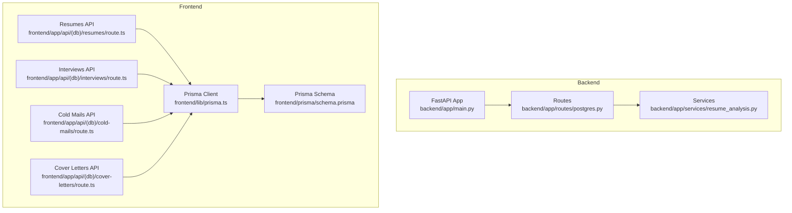
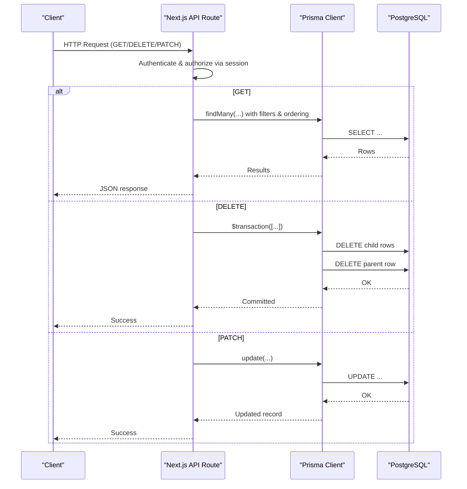
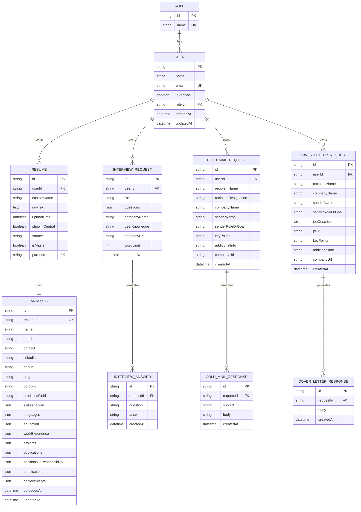

# Database Management API

<cite>
**Referenced Files in This Document**
- [backend/app/main.py](file://backend/app/main.py)
- [backend/app/routes/postgres.py](file://backend/app/routes/postgres.py)
- [backend/app/services/resume_analysis.py](file://backend/app/services/resume_analysis.py)
- [frontend/prisma/schema.prisma](file://frontend/prisma/schema.prisma)
- [frontend/lib/prisma.ts](file://frontend/lib/prisma.ts)
- [frontend/app/api/(db)/resumes/route.ts](file://frontend/app/api/(db)/resumes/route.ts)
- [frontend/app/api/(db)/interviews/route.ts](file://frontend/app/api/(db)/interviews/route.ts)
- [frontend/app/api/(db)/cold-mails/route.ts](file://frontend/app/api/(db)/cold-mails/route.ts)
- [frontend/app/api/(db)/cover-letters/route.ts](file://frontend/app/api/(db)/cover-letters/route.ts)
</cite>

## Table of Contents
1. [Introduction](#introduction)
2. [Project Structure](#project-structure)
3. [Core Components](#core-components)
4. [Architecture Overview](#architecture-overview)
5. [Detailed Component Analysis](#detailed-component-analysis)
6. [Dependency Analysis](#dependency-analysis)
7. [Performance Considerations](#performance-considerations)
8. [Troubleshooting Guide](#troubleshooting-guide)
9. [Conclusion](#conclusion)

## Introduction
This document provides comprehensive API documentation for database management operations across the TalentSync application. It focuses on CRUD endpoints for major entities including users, resumes, analyses, interviews, and communications (cold mails and cover letters). It also explains query parameters, filtering, pagination, sorting, validation rules, referential integrity, bulk operations, transactions, and data consistency patterns. Practical examples and performance optimization techniques are included to guide developers integrating with the system.

## Project Structure
The database layer is primarily implemented in the frontend using Prisma ORM against a PostgreSQL database. Backend services orchestrate higher-level operations (e.g., resume analysis), while frontend API routes expose database-backed endpoints for clients. The backend FastAPI application wires routing and middleware, and the Prisma schema defines entity models and relationships.

**Diagram sources**
- [backend/app/main.py](file://backend/app/main.py#L157-L202)
- [backend/app/routes/postgres.py](file://backend/app/routes/postgres.py#L1-L27)
- [backend/app/services/resume_analysis.py](file://backend/app/services/resume_analysis.py#L345-L364)
- [frontend/lib/prisma.ts](file://frontend/lib/prisma.ts#L1-L10)
- [frontend/prisma/schema.prisma](file://frontend/prisma/schema.prisma#L1-L262)
- [frontend/app/api/(db)/resumes/route.ts](file://frontend/app/api/(db)/resumes/route.ts#L1-L312)
- [frontend/app/api/(db)/interviews/route.ts](file://frontend/app/api/(db)/interviews/route.ts#L1-L151)
- [frontend/app/api/(db)/cold-mails/route.ts](file://frontend/app/api/(db)/cold-mails/route.ts#L1-L139)
- [frontend/app/api/(db)/cover-letters/route.ts](file://frontend/app/api/(db)/cover-letters/route.ts#L1-L130)

**Section sources**
- [backend/app/main.py](file://backend/app/main.py#L157-L202)
- [frontend/lib/prisma.ts](file://frontend/lib/prisma.ts#L1-L10)
- [frontend/prisma/schema.prisma](file://frontend/prisma/schema.prisma#L1-L262)

## Core Components
- Backend FastAPI application registers routers and middleware, exposing database-related endpoints under API versions and tagging them appropriately.
- Frontend API routes implement authentication checks, role-based visibility, and database operations via Prisma.
- Prisma schema defines entities, relations, indexes, and constraints that enforce referential integrity and performance characteristics.

Key responsibilities:
- Authentication and authorization: session-based checks ensure only authorized users access their data.
- Data consistency: transactions wrap deletions to maintain referential integrity.
- Sorting and ordering: queries order results by timestamps for predictable retrieval.
- Filtering: role-based filters limit central data visibility to admins/recruiters.

**Section sources**
- [backend/app/main.py](file://backend/app/main.py#L157-L202)
- [frontend/app/api/(db)/resumes/route.ts](file://frontend/app/api/(db)/resumes/route.ts#L8-L107)
- [frontend/app/api/(db)/interviews/route.ts](file://frontend/app/api/(db)/interviews/route.ts#L6-L78)
- [frontend/app/api/(db)/cold-mails/route.ts](file://frontend/app/api/(db)/cold-mails/route.ts#L6-L66)
- [frontend/app/api/(db)/cover-letters/route.ts](file://frontend/app/api/(db)/cover-letters/route.ts#L6-L61)

## Architecture Overview
The system follows a layered architecture:
- Presentation layer: Next.js API routes handle HTTP requests and delegate to Prisma.
- Persistence layer: Prisma client connects to PostgreSQL using credentials from environment variables.
- Data modeling: Prisma schema defines entities and relationships, enabling safe queries and transactions.

**Diagram sources**
- [frontend/app/api/(db)/resumes/route.ts](file://frontend/app/api/(db)/resumes/route.ts#L8-L206)
- [frontend/app/api/(db)/interviews/route.ts](file://frontend/app/api/(db)/interviews/route.ts#L6-L150)
- [frontend/app/api/(db)/cold-mails/route.ts](file://frontend/app/api/(db)/cold-mails/route.ts#L6-L139)
- [frontend/app/api/(db)/cover-letters/route.ts](file://frontend/app/api/(db)/cover-letters/route.ts#L6-L130)
- [frontend/lib/prisma.ts](file://frontend/lib/prisma.ts#L1-L10)

## Detailed Component Analysis

### Users
- Purpose: Store identities, roles, and related authentication records.
- Key attributes: unique identifiers, email, verification flags, role linkage, timestamps.
- Relationships: one-to-many with resumes, bulk uploads, recruiters, cold mail/cover letter requests, interviews, tokens, and auth accounts/sessions.
- Constraints: unique email, optional role, cascading deletes for auth relations.

Operational notes:
- Authentication middleware ensures requests originate from authenticated sessions.
- Authorization logic restricts data visibility based on role.

**Section sources**
- [frontend/prisma/schema.prisma](file://frontend/prisma/schema.prisma#L16-L41)
- [frontend/app/api/(db)/resumes/route.ts](file://frontend/app/api/(db)/resumes/route.ts#L10-L38)

### Resumes
- Purpose: Persist uploaded or manually entered resume metadata and derived analysis.
- Key attributes: user ownership, custom name, raw text, upload date, central visibility flag, source type, master flag, parent-child tailoring relationship.
- Relationships: one-to-one analysis, one-to-many children via self-referencing relation, many-to-one user.
- Indexes: composite index on user and master flag for efficient lookups.

CRUD endpoints:
- GET /api/(db)/resumes
  - Query parameters: none
  - Filtering: role-based visibility (central vs. personal)
  - Sorting: upload date descending
  - Pagination: not implemented; consider adding limit/offset or cursor-based pagination for large datasets
- PATCH /api/(db)/resumes?id={id}
  - Body: customName (required, trimmed)
  - Validation: non-empty name enforced
  - Ownership: verifies user owns the resume
- DELETE /api/(db)/resumes?id={id}
  - Transaction: deletes related analysis first, then the resume
  - Ownership: verifies user owns the resume

Data validation and constraints:
- Name trimming and emptiness check
- Foreign key cascade for analysis deletion
- Composite index supports frequent queries

**Section sources**
- [frontend/prisma/schema.prisma](file://frontend/prisma/schema.prisma#L81-L98)
- [frontend/app/api/(db)/resumes/route.ts](file://frontend/app/api/(db)/resumes/route.ts#L8-L107)
- [frontend/app/api/(db)/resumes/route.ts](file://frontend/app/api/(db)/resumes/route.ts#L109-L206)
- [frontend/app/api/(db)/resumes/route.ts](file://frontend/app/api/(db)/resumes/route.ts#L208-L312)

### Analyses
- Purpose: Store structured extraction results derived from resumes.
- Key attributes: unique association with a resume, personal info, skills, education, work experience, projects, languages, predicted field, timestamps.
- Relationships: one-to-one with resume.

Constraints:
- Unique constraint on resumeId enforces one analysis per resume.

**Section sources**
- [frontend/prisma/schema.prisma](file://frontend/prisma/schema.prisma#L100-L125)
- [frontend/app/api/(db)/resumes/route.ts](file://frontend/app/api/(db)/resumes/route.ts#L173-L186)

### Interviews
- Purpose: Track interview sessions with generated questions and user-provided answers.
- Key attributes: user ownership, role/company metadata, questions stored as JSON, word limit, timestamps.
- Relationships: one-to-many answers; answers ordered chronologically.

CRUD endpoints:
- GET /api/(db)/interviews
  - Filtering: user-specific
  - Sorting: sessions newest first; answers oldest first
  - Transformation: merges questions array with corresponding answers by matching question text
- DELETE /api/(db)/interviews?id={id}
  - Transaction: deletes answers first, then the session

Data consistency:
- JSON questions may be string or mixed; defensive transformation ensures compatibility
- Matching uses normalized comparison for robustness

**Section sources**
- [frontend/prisma/schema.prisma](file://frontend/prisma/schema.prisma#L203-L226)
- [frontend/app/api/(db)/interviews/route.ts](file://frontend/app/api/(db)/interviews/route.ts#L6-L78)
- [frontend/app/api/(db)/interviews/route.ts](file://frontend/app/api/(db)/interviews/route.ts#L80-L150)

### Cold Mails
- Purpose: Manage cold email generation requests and generated responses.
- Key attributes: requester identity, recipient/company details, key points, timestamps.
- Relationships: one-to-many responses; responses ordered by creation time.

CRUD endpoints:
- GET /api/(db)/cold-mails
  - Filtering: user-specific
  - Sorting: sessions newest first; responses oldest first
  - Transformation: aggregates responses into a flat list per session
- DELETE /api/(db)/cold-mails?id={id}
  - Transaction: deletes responses first, then the request

**Section sources**
- [frontend/prisma/schema.prisma](file://frontend/prisma/schema.prisma#L149-L174)
- [frontend/app/api/(db)/cold-mails/route.ts](file://frontend/app/api/(db)/cold-mails/route.ts#L6-L66)
- [frontend/app/api/(db)/cold-mails/route.ts](file://frontend/app/api/(db)/cold-mails/route.ts#L68-L139)

### Cover Letters
- Purpose: Manage cover letter generation requests and generated responses.
- Key attributes: requester identity, recipient/company details, optional job description and URLs, timestamps.
- Relationships: one-to-many responses; responses ordered by creation time.

CRUD endpoints:
- GET /api/(db)/cover-letters
  - Filtering: user-specific
  - Sorting: sessions newest first; responses oldest first
  - Transformation: aggregates responses into a flat list per session
- DELETE /api/(db)/cover-letters?id={id}
  - Transaction: deletes responses first, then the request

**Section sources**
- [frontend/prisma/schema.prisma](file://frontend/prisma/schema.prisma#L176-L201)
- [frontend/app/api/(db)/cover-letters/route.ts](file://frontend/app/api/(db)/cover-letters/route.ts#L6-L61)
- [frontend/app/api/(db)/cover-letters/route.ts](file://frontend/app/api/(db)/cover-letters/route.ts#L63-L130)

### Backend PostgreSQL Routes (Database Views)
- Purpose: Expose curated database views for resumes categorized by predicted field.
- Endpoints:
  - GET /api/v1/resumes/
  - GET /api/v1/resumes/{category}

Notes:
- Current implementation returns placeholder data; intended to integrate with actual database queries.

**Section sources**
- [backend/app/routes/postgres.py](file://backend/app/routes/postgres.py#L11-L27)
- [backend/app/services/resume_analysis.py](file://backend/app/services/resume_analysis.py#L345-L364)

## Dependency Analysis
Entity relationships and constraints are defined in the Prisma schema. The following diagram highlights primary relationships among core entities.

**Diagram sources**
- [frontend/prisma/schema.prisma](file://frontend/prisma/schema.prisma#L10-L262)

## Performance Considerations
- Indexing: Composite index on Resume(userId, isMaster) improves lookup performance for master resumes per user.
- Sorting: Queries sort by timestamps to provide consistent ordering; consider adding pagination for large result sets.
- Transactions: Deletion sequences ensure referential integrity and reduce orphaned records.
- Query selectivity: Use targeted selects to avoid loading unnecessary nested relations.
- Caching: Consider caching frequently accessed central resumes for admins/recruiters.

[No sources needed since this section provides general guidance]

## Troubleshooting Guide
Common issues and resolutions:
- Authentication failures: Ensure a valid session exists; endpoints return 401 when session email is missing.
- Authorization failures: Admins/recruiters can only view central resumes; regular users can only access their own resumes.
- Missing IDs: Deleting requires a valid ID query parameter; missing IDs produce 400 responses.
- Transaction failures: If deletion fails mid-transaction, verify referential integrity and retry.
- Validation errors: PATCH requires a non-empty custom name; empty names produce 400 responses.

**Section sources**
- [frontend/app/api/(db)/resumes/route.ts](file://frontend/app/api/(db)/resumes/route.ts#L10-L38)
- [frontend/app/api/(db)/resumes/route.ts](file://frontend/app/api/(db)/resumes/route.ts#L123-L135)
- [frontend/app/api/(db)/resumes/route.ts](file://frontend/app/api/(db)/resumes/route.ts#L226-L248)
- [frontend/app/api/(db)/interviews/route.ts](file://frontend/app/api/(db)/interviews/route.ts#L80-L112)
- [frontend/app/api/(db)/cold-mails/route.ts](file://frontend/app/api/(db)/cold-mails/route.ts#L91-L100)
- [frontend/app/api/(db)/cover-letters/route.ts](file://frontend/app/api/(db)/cover-letters/route.ts#L85-L93)

## Conclusion
The database management APIs provide secure, role-aware CRUD operations for resumes, analyses, interviews, and communications. They leverage Prisma for type-safe queries, enforce referential integrity via transactions, and offer predictable sorting. Extending pagination, selective field loading, and caching will further improve performance. Integrating backend PostgreSQL routes with real database queries will complete the data access layer.