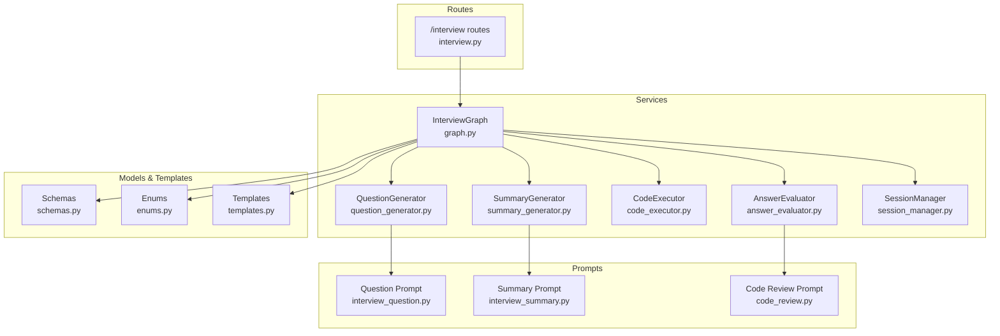
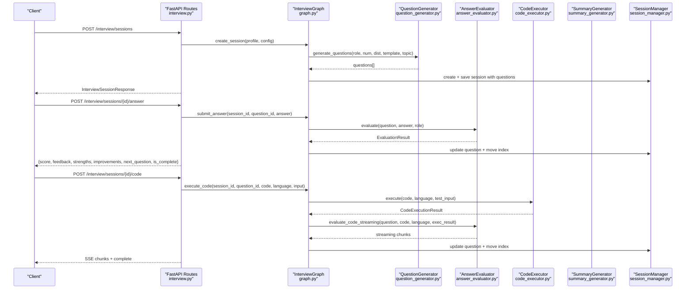
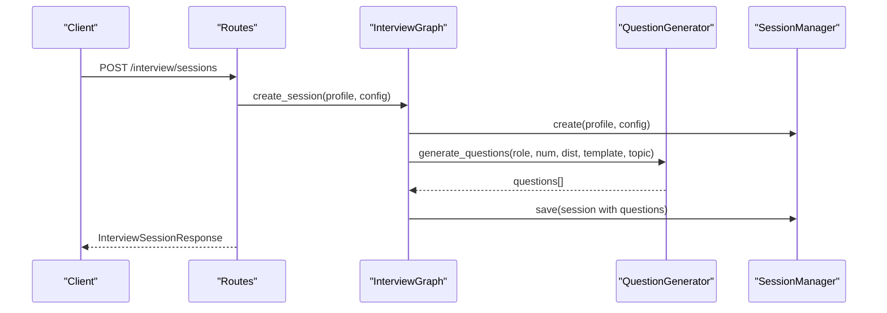
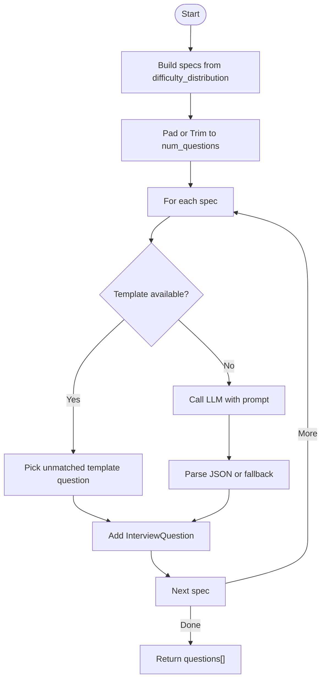
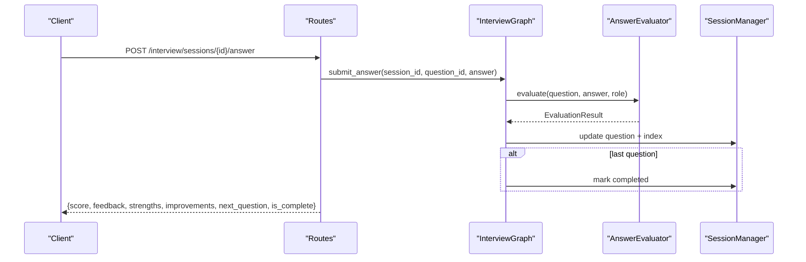
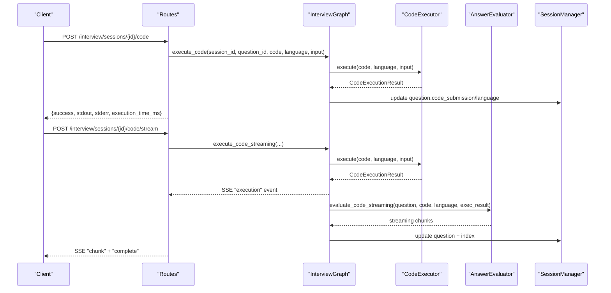
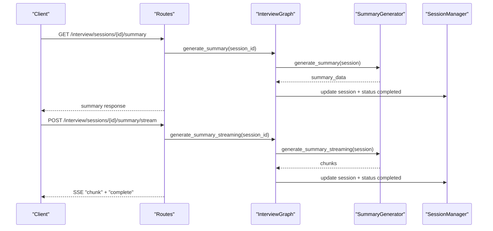
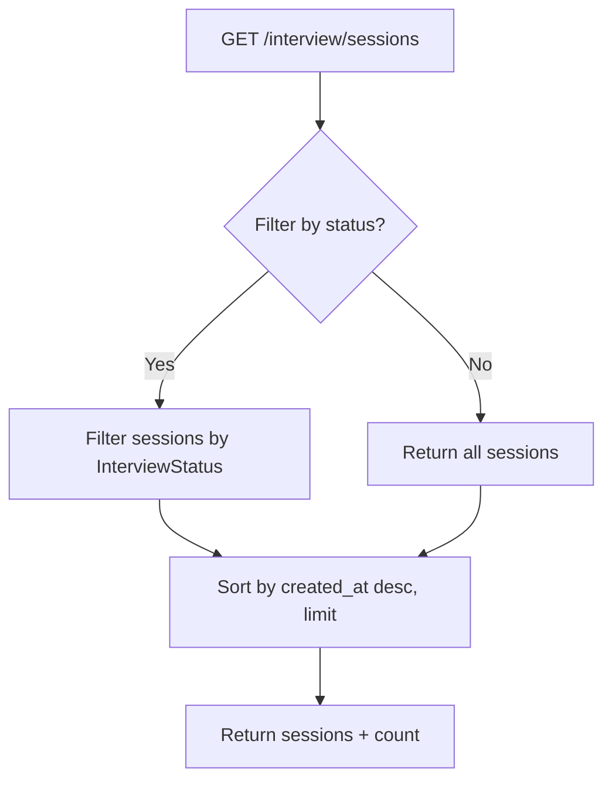
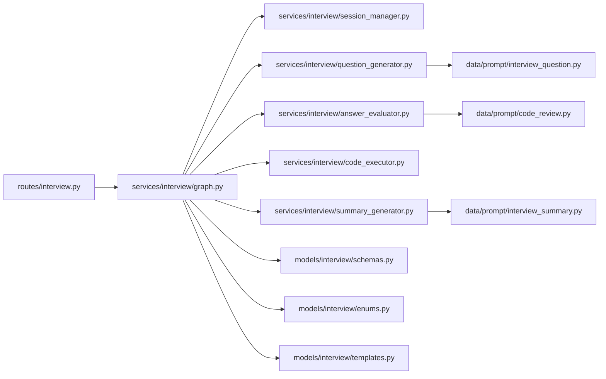
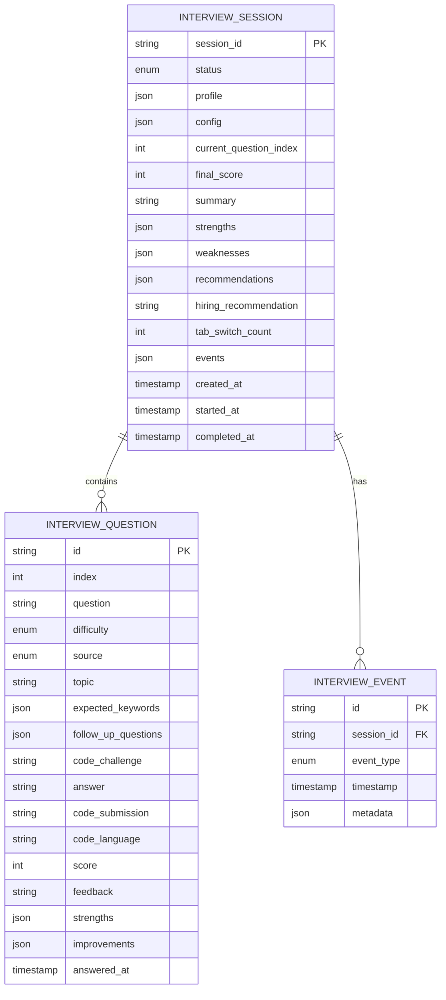

# Interview Preparation API

<cite>
**Referenced Files in This Document**
- [interview.py](file://backend/app/routes/interview.py)
- [graph.py](file://backend/app/services/interview/graph.py)
- [session_manager.py](file://backend/app/services/interview/session_manager.py)
- [schemas.py](file://backend/app/models/interview/schemas.py)
- [enums.py](file://backend/app/models/interview/enums.py)
- [question_generator.py](file://backend/app/services/interview/question_generator.py)
- [answer_evaluator.py](file://backend/app/services/interview/answer_evaluator.py)
- [summary_generator.py](file://backend/app/services/interview/summary_generator.py)
- [code_executor.py](file://backend/app/services/interview/code_executor.py)
- [templates.py](file://backend/app/models/interview/templates.py)
- [interview_question.py](file://backend/app/data/prompt/interview_question.py)
- [interview_summary.py](file://backend/app/data/prompt/interview_summary.py)
- [code_review.py](file://backend/app/data/prompt/code_review.py)
</cite>

## Table of Contents
1. [Introduction](#introduction)
2. [Project Structure](#project-structure)
3. [Core Components](#core-components)
4. [Architecture Overview](#architecture-overview)
5. [Detailed Component Analysis](#detailed-component-analysis)
6. [Dependency Analysis](#dependency-analysis)
7. [Performance Considerations](#performance-considerations)
8. [Troubleshooting Guide](#troubleshooting-guide)
9. [Conclusion](#conclusion)
10. [Appendices](#appendices)

## Introduction
This document provides comprehensive API documentation for the Interview Preparation system. It covers interview session lifecycle, question generation, answer evaluation, coding question execution, and summary generation. It explains schemas for interview setup, candidate response processing, and performance analytics. It also details the question generation algorithm, difficulty scaling, domain-specific question selection, and the streaming evaluation and code review workflows. Real-time interview features, session management, and progress tracking are documented alongside integration patterns for mock interview systems.

## Project Structure
The interview functionality is implemented in the backend under the app/services/interview and app/models/interview packages, with FastAPI routes under app/routes. The system orchestrates session creation, question generation, evaluation, code execution, and summary generation through a LangGraph-based InterviewGraph.

**Diagram sources**
- [interview.py](file://backend/app/routes/interview.py#L23-L494)
- [graph.py](file://backend/app/services/interview/graph.py#L23-L511)
- [question_generator.py](file://backend/app/services/interview/question_generator.py#L16-L275)
- [answer_evaluator.py](file://backend/app/services/interview/answer_evaluator.py#L22-L227)
- [code_executor.py](file://backend/app/services/interview/code_executor.py#L11-L278)
- [summary_generator.py](file://backend/app/services/interview/summary_generator.py#L17-L198)
- [session_manager.py](file://backend/app/services/interview/session_manager.py#L15-L257)
- [schemas.py](file://backend/app/models/interview/schemas.py#L17-L169)
- [enums.py](file://backend/app/models/interview/enums.py#L6-L43)
- [templates.py](file://backend/app/models/interview/templates.py#L22-L502)
- [interview_question.py](file://backend/app/data/prompt/interview_question.py#L5-L60)
- [interview_summary.py](file://backend/app/data/prompt/interview_summary.py#L5-L111)
- [code_review.py](file://backend/app/data/prompt/code_review.py#L5-L125)

**Section sources**
- [interview.py](file://backend/app/routes/interview.py#L23-L494)
- [graph.py](file://backend/app/services/interview/graph.py#L23-L511)

## Core Components
- InterviewGraph: Orchestrates session lifecycle, question generation, answer evaluation, code execution, and summary generation.
- SessionManager: Manages in-memory interview sessions and events, supports CRUD and event recording.
- QuestionGenerator: Generates questions using templates or LLM prompts with difficulty scaling and domain focus.
- AnswerEvaluator: Evaluates textual answers and code submissions with streaming support.
- CodeExecutor: Sandboxed execution of candidate code with security checks and timeouts.
- SummaryGenerator: Produces structured interview summaries and hiring recommendations.
- Schemas and Enums: Define interview data models, statuses, difficulty levels, and event types.
- Templates: Predefined interview templates for common roles with curated question banks.

**Section sources**
- [graph.py](file://backend/app/services/interview/graph.py#L23-L511)
- [session_manager.py](file://backend/app/services/interview/session_manager.py#L15-L257)
- [question_generator.py](file://backend/app/services/interview/question_generator.py#L16-L275)
- [answer_evaluator.py](file://backend/app/services/interview/answer_evaluator.py#L22-L227)
- [code_executor.py](file://backend/app/services/interview/code_executor.py#L11-L278)
- [summary_generator.py](file://backend/app/services/interview/summary_generator.py#L17-L198)
- [schemas.py](file://backend/app/models/interview/schemas.py#L17-L169)
- [enums.py](file://backend/app/models/interview/enums.py#L6-L43)
- [templates.py](file://backend/app/models/interview/templates.py#L22-L502)

## Architecture Overview
The Interview API exposes endpoints for session management, question delivery, answer evaluation, code execution, and summary generation. The InterviewGraph coordinates services and persists state via SessionManager. Streaming responses are delivered via Server-Sent Events (SSE) for real-time feedback.

**Diagram sources**
- [interview.py](file://backend/app/routes/interview.py#L65-L186)
- [graph.py](file://backend/app/services/interview/graph.py#L49-L491)
- [question_generator.py](file://backend/app/services/interview/question_generator.py#L23-L122)
- [answer_evaluator.py](file://backend/app/services/interview/answer_evaluator.py#L31-L144)
- [code_executor.py](file://backend/app/services/interview/code_executor.py#L35-L153)
- [session_manager.py](file://backend/app/services/interview/session_manager.py#L28-L218)

## Detailed Component Analysis

### Interview Session Creation
- Endpoint: POST /interview/sessions
- Request body: CreateInterviewRequest (profile, config)
- Behavior:
  - Creates a new InterviewSession with status pending.
  - Generates questions based on InterviewConfig (role, num_questions, difficulty_distribution, template_id, topic, includes_coding).
  - Sets status to in_progress and started_at.
  - Returns InterviewSessionResponse with current_question.

**Diagram sources**
- [interview.py](file://backend/app/routes/interview.py#L65-L88)
- [graph.py](file://backend/app/services/interview/graph.py#L49-L85)
- [question_generator.py](file://backend/app/services/interview/question_generator.py#L23-L122)
- [session_manager.py](file://backend/app/services/interview/session_manager.py#L28-L72)

**Section sources**
- [interview.py](file://backend/app/routes/interview.py#L65-L88)
- [graph.py](file://backend/app/services/interview/graph.py#L49-L85)
- [question_generator.py](file://backend/app/services/interview/question_generator.py#L23-L122)
- [schemas.py](file://backend/app/models/interview/schemas.py#L109-L114)

### Question Generation Algorithm
- Difficulty Scaling:
  - Builds question_specs from difficulty_distribution and pads/truncates to num_questions.
  - Falls back to medium/easy/hard cycling to meet target.
- Domain-Specific Selection:
  - Uses template_id to select InterviewTemplate and filters QuestionTemplate by difficulty and uniqueness.
  - Falls back to LLM-generated questions using a structured prompt.
- LLM Prompt:
  - Prompts define system role and human template with role, difficulty, topic, question_type, candidate background, and existing questions.
- Parsing:
  - Attempts JSON extraction; falls back to question text if parsing fails.

**Diagram sources**
- [question_generator.py](file://backend/app/services/interview/question_generator.py#L23-L122)
- [interview_question.py](file://backend/app/data/prompt/interview_question.py#L18-L54)
- [templates.py](file://backend/app/models/interview/templates.py#L22-L502)

**Section sources**
- [question_generator.py](file://backend/app/services/interview/question_generator.py#L23-L122)
- [interview_question.py](file://backend/app/data/prompt/interview_question.py#L18-L54)
- [templates.py](file://backend/app/models/interview/templates.py#L22-L502)

### Candidate Response Processing and Answer Evaluation
- Endpoints:
  - Non-streaming: POST /interview/sessions/{session_id}/answer
  - Streaming: POST /interview/sessions/{session_id}/answer/stream
- Workflow:
  - Validates session and current question matches.
  - Calls AnswerEvaluator to produce EvaluationResult (score 1–5, feedback, strengths, improvements).
  - Updates question with answer, score, feedback, strengths, improvements, answered_at.
  - Advances to next question; completes session if last question reached.
- Streaming:
  - Streams evaluation tokens until completion event with final score and next question.

**Diagram sources**
- [interview.py](file://backend/app/routes/interview.py#L154-L186)
- [graph.py](file://backend/app/services/interview/graph.py#L99-L168)
- [answer_evaluator.py](file://backend/app/services/interview/answer_evaluator.py#L31-L79)
- [session_manager.py](file://backend/app/services/interview/session_manager.py#L65-L154)

**Section sources**
- [interview.py](file://backend/app/routes/interview.py#L154-L186)
- [graph.py](file://backend/app/services/interview/graph.py#L99-L168)
- [answer_evaluator.py](file://backend/app/services/interview/answer_evaluator.py#L31-L79)
- [schemas.py](file://backend/app/models/interview/schemas.py#L151-L158)

### Coding Question Execution and Review
- Endpoints:
  - Non-streaming: POST /interview/sessions/{session_id}/code
  - Streaming: POST /interview/sessions/{session_id}/code/stream
- Workflow:
  - Executes code via CodeExecutor with language and optional test_input.
  - Stores code_submission and code_language on the question.
  - Streams execution result, then streams code review from AnswerEvaluator.
  - Parses final review into score, feedback, strengths, improvements.
  - Advances to next question; completes session if last question reached.
- Supported Languages: python, javascript, typescript.

**Diagram sources**
- [interview.py](file://backend/app/routes/interview.py#L230-L295)
- [graph.py](file://backend/app/services/interview/graph.py#L243-L371)
- [code_executor.py](file://backend/app/services/interview/code_executor.py#L35-L153)
- [answer_evaluator.py](file://backend/app/services/interview/answer_evaluator.py#L111-L144)
- [session_manager.py](file://backend/app/services/interview/session_manager.py#L65-L154)

**Section sources**
- [interview.py](file://backend/app/routes/interview.py#L230-L295)
- [graph.py](file://backend/app/services/interview/graph.py#L243-L371)
- [code_executor.py](file://backend/app/services/interview/code_executor.py#L14-L30)
- [answer_evaluator.py](file://backend/app/services/interview/answer_evaluator.py#L111-L144)

### Summary Generation and Hiring Recommendation
- Endpoints:
  - GET /interview/sessions/{session_id}/summary
  - POST /interview/sessions/{session_id}/summary/stream
- Workflow:
  - Formats questions_summary and calculates final_score as percentage.
  - Calls SummaryGenerator to produce structured summary with strengths, weaknesses, recommendations, hiring_recommendation.
  - Updates session with summary, strengths, weaknesses, recommendations, hiring_recommendation, status completed, completed_at.
  - Streaming yields chunks until completion event with final_score and recommendation.

**Diagram sources**
- [interview.py](file://backend/app/routes/interview.py#L343-L414)
- [graph.py](file://backend/app/services/interview/graph.py#L373-L448)
- [summary_generator.py](file://backend/app/services/interview/summary_generator.py#L25-L101)
- [session_manager.py](file://backend/app/services/interview/session_manager.py#L188-L218)

**Section sources**
- [interview.py](file://backend/app/routes/interview.py#L343-L414)
- [graph.py](file://backend/app/services/interview/graph.py#L373-L448)
- [summary_generator.py](file://backend/app/services/interview/summary_generator.py#L25-L101)
- [schemas.py](file://backend/app/models/interview/schemas.py#L72-L94)

### Session Management and Progress Tracking
- Endpoints:
  - GET /interview/sessions/{session_id}
  - DELETE /interview/sessions/{session_id}
  - GET /interview/sessions?status=&limit=
  - GET /interview/health
- Features:
  - CRUD operations for sessions.
  - Listing with status filter and pagination.
  - Health check reporting active sessions.
- Progress Tracking:
  - current_question_index advances after each answer.
  - tab_switch_count increments on tab switch events.
  - Events recorded for integrity tracking.

**Diagram sources**
- [interview.py](file://backend/app/routes/interview.py#L93-L148)
- [session_manager.py](file://backend/app/services/interview/session_manager.py#L89-L111)

**Section sources**
- [interview.py](file://backend/app/routes/interview.py#L93-L148)
- [session_manager.py](file://backend/app/services/interview/session_manager.py#L89-L111)

### Interview Event Recording and Integrity Tracking
- Endpoints:
  - POST /interview/sessions/{session_id}/events
  - GET /interview/sessions/{session_id}/events?event_type=
- Behavior:
  - Records InterviewEvent with event_type and metadata.
  - Maintains event counts (e.g., tab_switch_count).
  - Returns warning flag if tab switches exceed threshold.

**Section sources**
- [interview.py](file://backend/app/routes/interview.py#L420-L480)
- [session_manager.py](file://backend/app/services/interview/session_manager.py#L113-L170)
- [enums.py](file://backend/app/models/interview/enums.py#L33-L43)

### API Reference

#### Authentication and Dependencies
- All endpoints accept an LLM dependency via get_request_llm; streaming endpoints use astream for SSE.

**Section sources**
- [interview.py](file://backend/app/routes/interview.py#L9-L21)

#### Interview Sessions
- POST /interview/sessions
  - Request: CreateInterviewRequest
  - Response: InterviewSessionResponse
- GET /interview/sessions/{session_id}
  - Response: InterviewSessionResponse
- DELETE /interview/sessions/{session_id}
  - Response: {deleted: true, session_id}
- GET /interview/sessions
  - Query: status (enum), limit (default 100)
  - Response: {sessions: [...], count: number}
- GET /interview/health
  - Response: {status: "healthy", active_sessions: number}

**Section sources**
- [interview.py](file://backend/app/routes/interview.py#L65-L148)
- [interview.py](file://backend/app/routes/interview.py#L486-L494)

#### Answer Submission
- POST /interview/sessions/{session_id}/answer
  - Request: SubmitAnswerRequest
  - Response: {score, feedback, strengths, improvements, next_question, is_complete}
- POST /interview/sessions/{session_id}/answer/stream
  - SSE Events: chunk (partial), complete (final), error

**Section sources**
- [interview.py](file://backend/app/routes/interview.py#L154-L224)

#### Coding Execution
- POST /interview/sessions/{session_id}/code
  - Request: CodeExecutionRequest
  - Response: CodeExecutionResult
- POST /interview/sessions/{session_id}/code/stream
  - SSE Events: execution, chunk, complete, error
- GET /interview/code/languages
  - Response: {languages: [...]}

**Section sources**
- [interview.py](file://backend/app/routes/interview.py#L230-L304)
- [code_executor.py](file://backend/app/services/interview/code_executor.py#L217-L219)

#### Summary
- GET /interview/sessions/{session_id}/summary
  - Response: {session_id, final_score, summary, strengths, weaknesses, recommendations, hiring_recommendation}
- POST /interview/sessions/{session_id}/summary/stream
  - SSE Events: chunk, complete, error

**Section sources**
- [interview.py](file://backend/app/routes/interview.py#L343-L414)

#### Events
- POST /interview/sessions/{session_id}/events
  - Request: InterviewEventRequest
  - Response: {recorded: true, event_type, tab_switch_count, warning}
- GET /interview/sessions/{session_id}/events
  - Query: event_type (optional)
  - Response: {events: [...], count: number}

**Section sources**
- [interview.py](file://backend/app/routes/interview.py#L420-L480)

#### Templates
- GET /interview/templates
  - Response: {templates: [...]}
- GET /interview/templates/{template_id}
  - Response: {template: {...}}

**Section sources**
- [interview.py](file://backend/app/routes/interview.py#L44-L59)
- [templates.py](file://backend/app/models/interview/templates.py#L481-L501)

### Schemas and Data Models

#### Interview Setup
- InterviewConfig: role, template_id, topic, num_questions, difficulty_distribution, time_limit_minutes, includes_coding, coding_languages, voice_enabled, voice_language
- CandidateProfile: name, email, phone, resume_text, resume_data
- InterviewSession: session_id, status, profile, config, questions, current_question_index, final_score, summary, strengths, weaknesses, recommendations, hiring_recommendation, tab_switch_count, events, timestamps

**Section sources**
- [schemas.py](file://backend/app/models/interview/schemas.py#L55-L94)

#### Candidate Response Processing
- SubmitAnswerRequest: question_id, answer, code_submission, code_language
- CodeExecutionRequest: question_id, code, language, test_input
- EvaluationResult: score (1–5), feedback, strengths, improvements
- CodeExecutionResult: success, stdout, stderr, execution_time_ms, memory_usage_mb, test_results

**Section sources**
- [schemas.py](file://backend/app/models/interview/schemas.py#L116-L169)

#### Performance Analytics
- InterviewQuestion: id, index, question, difficulty, source, topic, expected_keywords, follow_up_questions, code_challenge, answer, code_submission, code_language, score, feedback, strengths, improvements, answered_at
- InterviewEvent: id, session_id, event_type, timestamp, metadata

**Section sources**
- [schemas.py](file://backend/app/models/interview/schemas.py#L22-L104)

### Answer Evaluation Criteria, Scoring Rubrics, and Feedback
- EvaluationResult fields: score (1–5), feedback, strengths, improvements.
- Streaming parsing extracts score, strengths, and improvements from formatted text.
- Code review prompt defines correctness, code quality, efficiency, edge cases, strengths, improvements, alternative approach.

**Section sources**
- [answer_evaluator.py](file://backend/app/services/interview/answer_evaluator.py#L146-L226)
- [code_review.py](file://backend/app/data/prompt/code_review.py#L17-L68)

### Real-Time Interview Features and Streaming
- SSE Streaming:
  - Answer streaming: yields "chunk" tokens, then "complete" with score and next question.
  - Code streaming: yields "execution" result, then "chunk" tokens, then "complete".
  - Summary streaming: yields "chunk" tokens, then "complete" with final_score and recommendation.
- Security and Limits:
  - CodeExecutor enforces language support, code length, timeouts, and security checks.

**Section sources**
- [interview.py](file://backend/app/routes/interview.py#L29-L39)
- [interview.py](file://backend/app/routes/interview.py#L188-L224)
- [interview.py](file://backend/app/routes/interview.py#L257-L295)
- [interview.py](file://backend/app/routes/interview.py#L386-L414)
- [code_executor.py](file://backend/app/services/interview/code_executor.py#L35-L153)

### Integration Patterns for Mock Interview Systems
- Use POST /interview/sessions to bootstrap a mock interview with role/topic and difficulty distribution.
- Poll GET /interview/sessions/{session_id} to track progress.
- Submit answers via POST /interview/sessions/{session_id}/answer or stream via POST /interview/sessions/{session_id}/answer/stream.
- For coding challenges, POST /interview/sessions/{session_id}/code or stream via POST /interview/sessions/{session_id}/code/stream.
- Record tab switches and other events via POST /interview/sessions/{session_id}/events to maintain integrity.
- Retrieve final summary via GET /interview/sessions/{session_id}/summary or stream via POST /interview/sessions/{session_id}/summary/stream.

**Section sources**
- [interview.py](file://backend/app/routes/interview.py#L65-L414)

## Dependency Analysis

**Diagram sources**
- [interview.py](file://backend/app/routes/interview.py#L1-L494)
- [graph.py](file://backend/app/services/interview/graph.py#L1-L511)
- [question_generator.py](file://backend/app/services/interview/question_generator.py#L1-L275)
- [answer_evaluator.py](file://backend/app/services/interview/answer_evaluator.py#L1-L227)
- [code_executor.py](file://backend/app/services/interview/code_executor.py#L1-L278)
- [summary_generator.py](file://backend/app/services/interview/summary_generator.py#L1-L198)
- [schemas.py](file://backend/app/models/interview/schemas.py#L1-L169)
- [enums.py](file://backend/app/models/interview/enums.py#L1-L43)
- [templates.py](file://backend/app/models/interview/templates.py#L1-L502)
- [interview_question.py](file://backend/app/data/prompt/interview_question.py#L1-L60)
- [interview_summary.py](file://backend/app/data/prompt/interview_summary.py#L1-L111)
- [code_review.py](file://backend/app/data/prompt/code_review.py#L1-L125)

**Section sources**
- [interview.py](file://backend/app/routes/interview.py#L1-L494)
- [graph.py](file://backend/app/services/interview/graph.py#L1-L511)

## Performance Considerations
- Streaming Responses: Use streaming endpoints to reduce latency and improve perceived performance for evaluations and summaries.
- Code Execution: Enforce timeouts and output limits to prevent resource exhaustion.
- In-Memory Storage: SessionManager uses in-memory storage; for production, integrate with persistent storage via API routes or direct database connections.
- Prompt Efficiency: Keep prompts concise and avoid excessive context to minimize LLM invocation costs and latency.

[No sources needed since this section provides general guidance]

## Troubleshooting Guide
- Session Not Found:
  - Symptom: 404 when accessing sessions or submitting answers.
  - Resolution: Ensure session_id is valid and created via POST /interview/sessions.
- Question Mismatch:
  - Symptom: Validation error indicating question does not match current state.
  - Resolution: Use the current_question.id returned by GET /interview/sessions/{session_id}.
- Unsupported Language:
  - Symptom: Code execution returns unsupported language error.
  - Resolution: Use supported languages: python, javascript, typescript.
- Timeout During Execution:
  - Symptom: Execution timed out after configured seconds.
  - Resolution: Simplify code or reduce complexity; adjust language-specific timeouts.
- Streaming Errors:
  - Symptom: SSE error event received.
  - Resolution: Check network stability and retry; verify LLM availability.

**Section sources**
- [interview.py](file://backend/app/routes/interview.py#L183-L185)
- [interview.py](file://backend/app/routes/interview.py#L251-L254)
- [interview.py](file://backend/app/routes/interview.py#L276-L277)
- [code_executor.py](file://backend/app/services/interview/code_executor.py#L115-L123)

## Conclusion
The Interview Preparation API provides a robust, extensible framework for conducting mock interviews with automated question generation, real-time evaluation, coding execution, and comprehensive summaries. Its modular design enables easy integration into larger ATS or hiring platforms, while streaming capabilities enhance the candidate experience. By leveraging templates, structured prompts, and event tracking, the system supports both standardized and adaptive interview experiences.

[No sources needed since this section summarizes without analyzing specific files]

## Appendices

### Example Workflows

#### Text Answer Evaluation Workflow
- Create session: POST /interview/sessions
- Submit answer: POST /interview/sessions/{id}/answer
- Retrieve summary: GET /interview/sessions/{id}/summary

**Section sources**
- [interview.py](file://backend/app/routes/interview.py#L65-L186)
- [interview.py](file://backend/app/routes/interview.py#L343-L383)

#### Streaming Answer Evaluation Workflow
- Create session: POST /interview/sessions
- Submit answer (stream): POST /interview/sessions/{id}/answer/stream
- Retrieve summary (stream): POST /interview/sessions/{id}/summary/stream

**Section sources**
- [interview.py](file://backend/app/routes/interview.py#L188-L224)
- [interview.py](file://backend/app/routes/interview.py#L386-L414)

#### Coding Challenge Workflow
- Create session: POST /interview/sessions
- Execute code: POST /interview/sessions/{id}/code
- Execute code (stream): POST /interview/sessions/{id}/code/stream

**Section sources**
- [interview.py](file://backend/app/routes/interview.py#L230-L295)

### Data Model Diagram

**Diagram sources**
- [schemas.py](file://backend/app/models/interview/schemas.py#L72-L104)