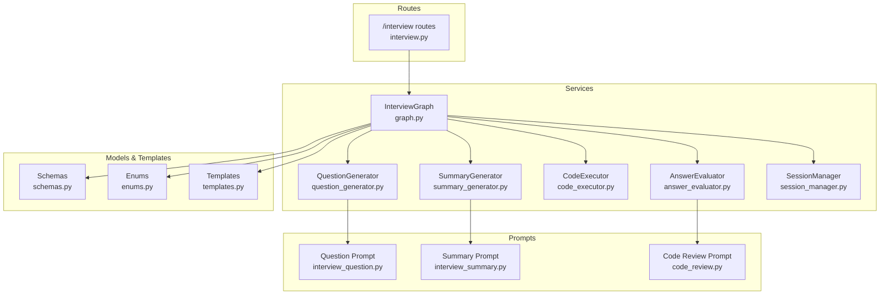
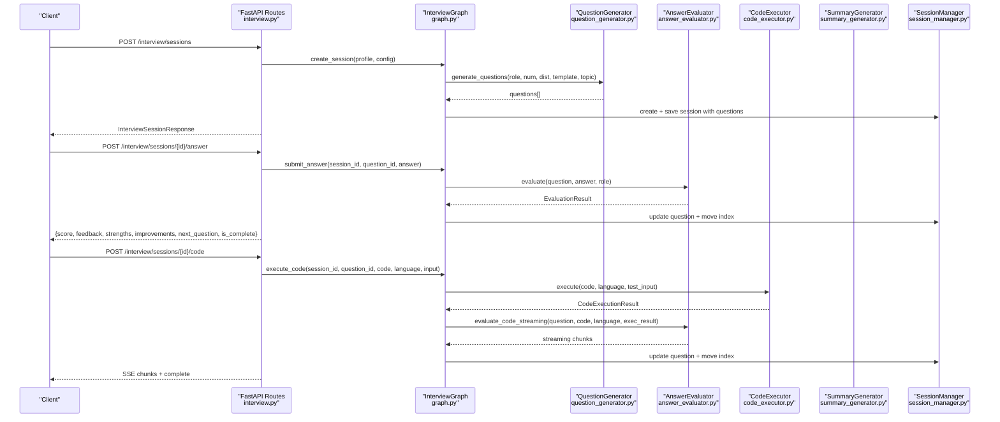
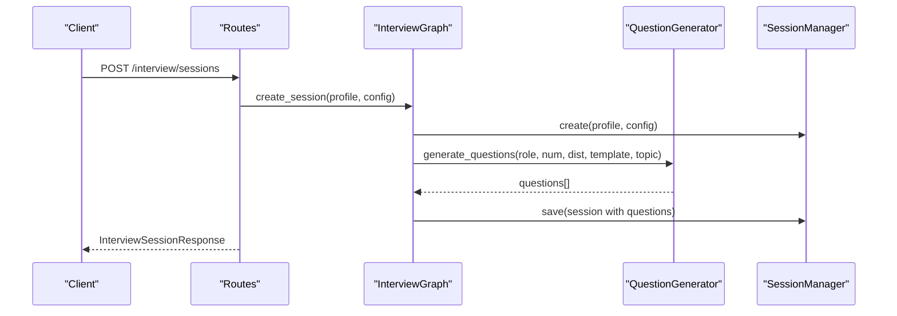
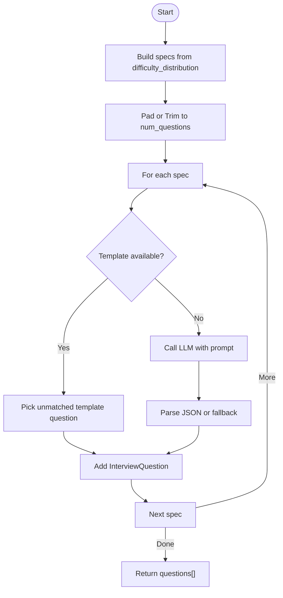
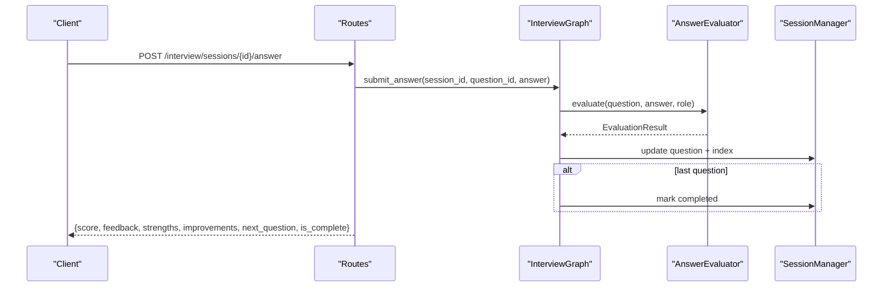
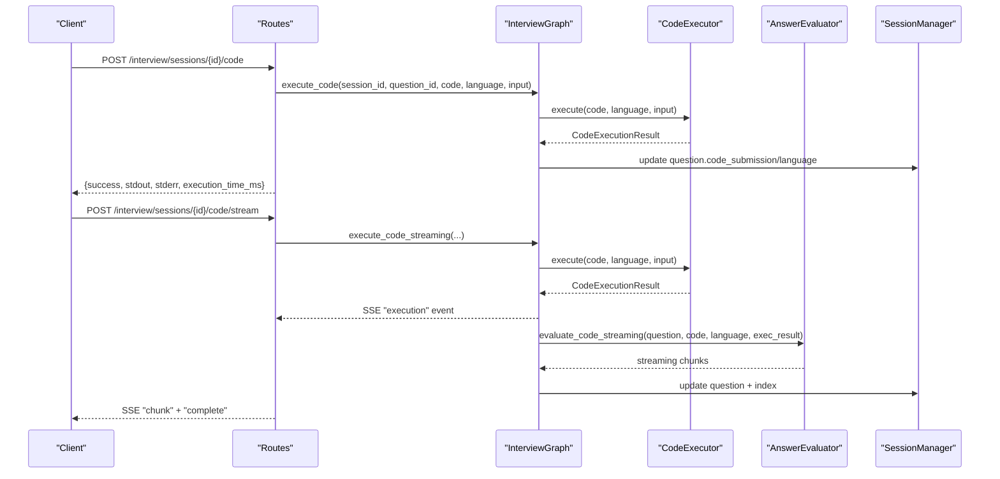
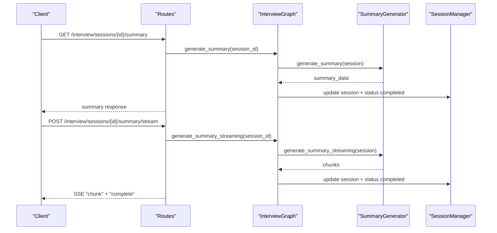
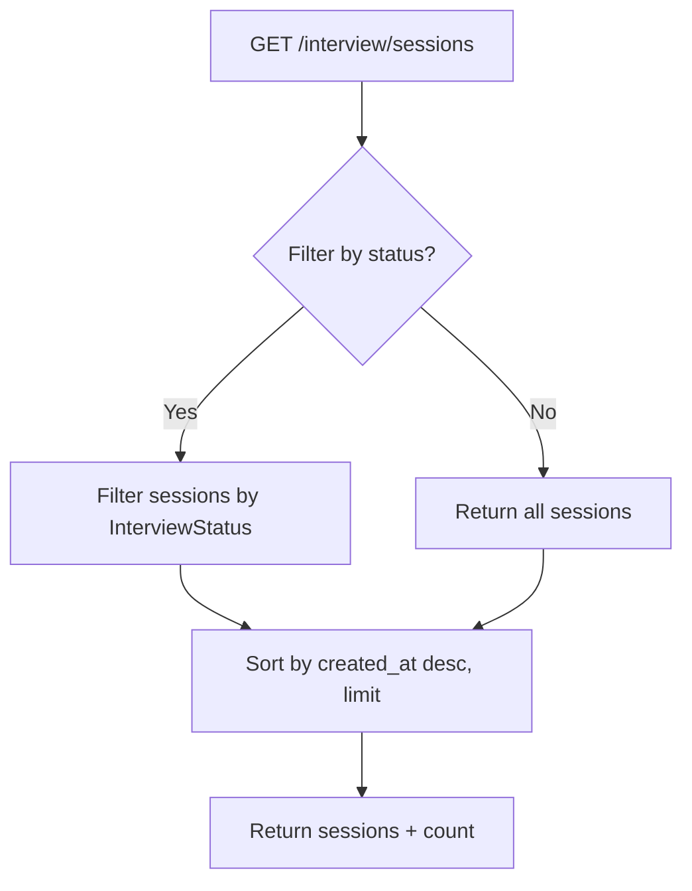
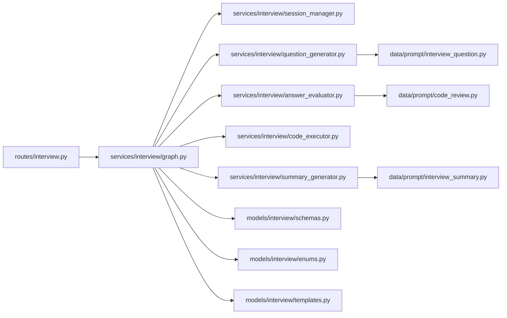
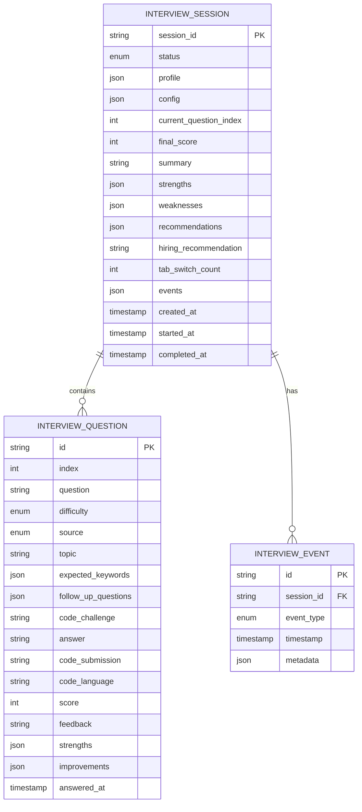

# Interview preparation API

## Introduction
This page provides detailed API documentation for the Interview Preparation system. It covers interview session lifecycle, question generation, answer evaluation, coding question execution, and summary generation. It explains schemas for interview setup, candidate response processing, and performance analytics. It also details the question generation algorithm, difficulty scaling, domain-specific question selection, and the streaming evaluation and code review workflows. Real-time interview features, session management, and progress tracking are documented alongside integration patterns for mock interview systems.

## Project structure
The interview functionality is implemented in the backend under the app/services/interview and app/models/interview packages, with FastAPI routes under app/routes. The system orchestrates session creation, question generation, evaluation, code execution, and summary generation through a LangGraph-based InterviewGraph.

```mermaid
graph TB
subgraph "Routes"
R1["/interview routes<br/>interview.py"]
end
subgraph "Services"
G1["InterviewGraph<br/>graph.py"]
QG["QuestionGenerator<br/>question_generator.py"]
AE["AnswerEvaluator<br/>answer_evaluator.py"]
CE["CodeExecutor<br/>code_executor.py"]
SG["SummaryGenerator<br/>summary_generator.py"]
SM["SessionManager<br/>session_manager.py"]
end
subgraph "Models & Templates"
M1["Schemas<br/>schemas.py"]
E1["Enums<br/>enums.py"]
T1["Templates<br/>templates.py"]
end
subgraph "Prompts"
P1["Question Prompt<br/>interview_question.py"]
P2["Summary Prompt<br/>interview_summary.py"]
P3["Code Review Prompt<br/>code_review.py"]
end
R1 --> G1
G1 --> SM
G1 --> QG
G1 --> AE
G1 --> CE
G1 --> SG
QG --> P1
AE --> P3
SG --> P2
G1 --> M1
G1 --> E1
G1 --> T1
```

## Core components
- InterviewGraph: Orchestrates session lifecycle, question generation, answer evaluation, code execution, and summary generation.
- SessionManager: Manages in-memory interview sessions and events, supports CRUD and event recording.
- QuestionGenerator: Generates questions using templates or LLM prompts with difficulty scaling and domain focus.
- AnswerEvaluator: Evaluates textual answers and code submissions with streaming support.
- CodeExecutor: Sandboxed execution of candidate code with security checks and timeouts.
- SummaryGenerator: Produces structured interview summaries and hiring recommendations.
- Schemas and Enums: Define interview data models, statuses, difficulty levels, and event types.
- Templates: Predefined interview templates for common roles with curated question banks.

## Architecture overview
The Interview API exposes endpoints for session management, question delivery, answer evaluation, code execution, and summary generation. The InterviewGraph coordinates services and persists state via SessionManager. Streaming responses are delivered via Server-Sent Events (SSE) for real-time feedback.

```mermaid
sequenceDiagram
participant Client as "Client"
participant Routes as "FastAPI Routes<br/>interview.py"
participant Graph as "InterviewGraph<br/>graph.py"
participant QGen as "QuestionGenerator<br/>question_generator.py"
participant Eval as "AnswerEvaluator<br/>answer_evaluator.py"
participant Exec as "CodeExecutor<br/>code_executor.py"
participant Summ as "SummaryGenerator<br/>summary_generator.py"
participant Store as "SessionManager<br/>session_manager.py"
Client->>Routes : POST /interview/sessions
Routes->>Graph : create_session(profile, config)
Graph->>QGen : generate_questions(role, num, dist, template, topic)
QGen-->>Graph : questions[]
Graph->>Store : create + save session with questions
Routes-->>Client : InterviewSessionResponse
Client->>Routes : POST /interview/sessions/{id}/answer
Routes->>Graph : submit_answer(session_id, question_id, answer)
Graph->>Eval : evaluate(question, answer, role)
Eval-->>Graph : EvaluationResult
Graph->>Store : update question + move index
Routes-->>Client : {score, feedback, strengths, improvements, next_question, is_complete}
Client->>Routes : POST /interview/sessions/{id}/code
Routes->>Graph : execute_code(session_id, question_id, code, language, input)
Graph->>Exec : execute(code, language, test_input)
Exec-->>Graph : CodeExecutionResult
Graph->>Eval : evaluate_code_streaming(question, code, language, exec_result)
Eval-->>Graph : streaming chunks
Graph->>Store : update question + move index
Routes-->>Client : SSE chunks + complete
```

## Detailed component analysis

### Interview session creation
- Endpoint: POST /interview/sessions
- Request body: CreateInterviewRequest (profile, config)
- Behavior:
  - Creates a new InterviewSession with status pending.
  - Generates questions based on InterviewConfig (role, num_questions, difficulty_distribution, template_id, topic, includes_coding).
  - Sets status to in_progress and started_at.
  - Returns InterviewSessionResponse with current_question.

```mermaid
sequenceDiagram
participant C as "Client"
participant R as "Routes"
participant G as "InterviewGraph"
participant Q as "QuestionGenerator"
participant S as "SessionManager"
C->>R : POST /interview/sessions
R->>G : create_session(profile, config)
G->>S : create(profile, config)
G->>Q : generate_questions(role, num, dist, template, topic)
Q-->>G : questions[]
G->>S : save(session with questions)
R-->>C : InterviewSessionResponse
```

### Question generation algorithm
- Difficulty Scaling:
  - Builds question_specs from difficulty_distribution and pads/truncates to num_questions.
  - Falls back to medium/easy/hard cycling to meet target.
- Domain-Specific Selection:
  - Uses template_id to select InterviewTemplate and filters QuestionTemplate by difficulty and uniqueness.
  - Falls back to LLM-generated questions using a structured prompt.
- LLM Prompt:
  - Prompts define system role and human template with role, difficulty, topic, question_type, candidate background, and existing questions.
- Parsing:
  - Attempts JSON extraction; falls back to question text if parsing fails.

```mermaid
flowchart TD
Start(["Start"]) --> BuildSpecs["Build specs from difficulty_distribution"]
BuildSpecs --> PadTrim["Pad or Trim to num_questions"]
PadTrim --> ForEach["For each spec"]
ForEach --> UseTemplate{"Template available?"}
UseTemplate --> |Yes| PickTemplate["Pick unmatched template question"]
UseTemplate --> |No| CallLLM["Call LLM with prompt"]
PickTemplate --> AddQ["Add InterviewQuestion"]
CallLLM --> Parse["Parse JSON or fallback"]
Parse --> AddQ
AddQ --> Next["Next spec"]
Next --> |More| ForEach
Next --> |Done| ReturnQs["Return questions[]"]
```

### Candidate response processing and answer evaluation
- Endpoints:
  - Non-streaming: POST /interview/sessions/{session_id}/answer
  - Streaming: POST /interview/sessions/{session_id}/answer/stream
- Workflow:
  - Validates session and current question matches.
  - Calls AnswerEvaluator to produce EvaluationResult (score 1–5, feedback, strengths, improvements).
  - Updates question with answer, score, feedback, strengths, improvements, answered_at.
  - Advances to next question; completes session if last question reached.
- Streaming:
  - Streams evaluation tokens until completion event with final score and next question.

```mermaid
sequenceDiagram
participant C as "Client"
participant R as "Routes"
participant G as "InterviewGraph"
participant E as "AnswerEvaluator"
participant S as "SessionManager"
C->>R : POST /interview/sessions/{id}/answer
R->>G : submit_answer(session_id, question_id, answer)
G->>E : evaluate(question, answer, role)
E-->>G : EvaluationResult
G->>S : update question + index
alt last question
G->>S : mark completed
end
R-->>C : {score, feedback, strengths, improvements, next_question, is_complete}
```

### Coding question execution and review
- Endpoints:
  - Non-streaming: POST /interview/sessions/{session_id}/code
  - Streaming: POST /interview/sessions/{session_id}/code/stream
- Workflow:
  - Executes code via CodeExecutor with language and optional test_input.
  - Stores code_submission and code_language on the question.
  - Streams execution result, then streams code review from AnswerEvaluator.
  - Parses final review into score, feedback, strengths, improvements.
  - Advances to next question; completes session if last question reached.
- Supported Languages: python, javascript, typescript.

```mermaid
sequenceDiagram
participant C as "Client"
participant R as "Routes"
participant G as "InterviewGraph"
participant X as "CodeExecutor"
participant E as "AnswerEvaluator"
participant S as "SessionManager"
C->>R : POST /interview/sessions/{id}/code
R->>G : execute_code(session_id, question_id, code, language, input)
G->>X : execute(code, language, input)
X-->>G : CodeExecutionResult
G->>S : update question.code_submission/language
R-->>C : {success, stdout, stderr, execution_time_ms}
C->>R : POST /interview/sessions/{id}/code/stream
R->>G : execute_code_streaming(...)
G->>X : execute(code, language, input)
X-->>G : CodeExecutionResult
G-->>R : SSE "execution" event
G->>E : evaluate_code_streaming(question, code, language, exec_result)
E-->>G : streaming chunks
G->>S : update question + index
R-->>C : SSE "chunk" + "complete"
```

### Summary generation and hiring recommendation
- Endpoints:
  - GET /interview/sessions/{session_id}/summary
  - POST /interview/sessions/{session_id}/summary/stream
- Workflow:
  - Formats questions_summary and calculates final_score as percentage.
  - Calls SummaryGenerator to produce structured summary with strengths, weaknesses, recommendations, hiring_recommendation.
  - Updates session with summary, strengths, weaknesses, recommendations, hiring_recommendation, status completed, completed_at.
  - Streaming yields chunks until completion event with final_score and recommendation.

```mermaid
sequenceDiagram
participant C as "Client"
participant R as "Routes"
participant G as "InterviewGraph"
participant Sg as "SummaryGenerator"
participant Sm as "SessionManager"
C->>R : GET /interview/sessions/{id}/summary
R->>G : generate_summary(session_id)
G->>Sg : generate_summary(session)
Sg-->>G : summary_data
G->>Sm : update session + status completed
R-->>C : summary response
C->>R : POST /interview/sessions/{id}/summary/stream
R->>G : generate_summary_streaming(session_id)
G->>Sg : generate_summary_streaming(session)
Sg-->>G : chunks
G->>Sm : update session + status completed
R-->>C : SSE "chunk" + "complete"
```

### Session management and progress tracking
- Endpoints:
  - GET /interview/sessions/{session_id}
  - DELETE /interview/sessions/{session_id}
  - GET /interview/sessions?status=&limit=
  - GET /interview/health
- Features:
  - CRUD operations for sessions.
  - Listing with status filter and pagination.
  - Health check reporting active sessions.
- Progress Tracking:
  - current_question_index advances after each answer.
  - tab_switch_count increments on tab switch events.
  - Events recorded for integrity tracking.

```mermaid
flowchart TD
A["GET /interview/sessions"] --> B{"Filter by status?"}
B --> |Yes| C["Filter sessions by InterviewStatus"]
B --> |No| D["Return all sessions"]
C --> E["Sort by created_at desc, limit"]
D --> E
E --> F["Return sessions + count"]
```

### Interview event recording and integrity tracking
- Endpoints:
  - POST /interview/sessions/{session_id}/events
  - GET /interview/sessions/{session_id}/events?event_type=
- Behavior:
  - Records InterviewEvent with event_type and metadata.
  - Maintains event counts (e.g., tab_switch_count).
  - Returns warning flag if tab switches exceed threshold.

### API reference

#### Authentication and dependencies
- All endpoints accept an LLM dependency via get_request_llm; streaming endpoints use astream for SSE.

#### Interview sessions
- POST /interview/sessions
  - Request: CreateInterviewRequest
  - Response: InterviewSessionResponse
- GET /interview/sessions/{session_id}
  - Response: InterviewSessionResponse
- DELETE /interview/sessions/{session_id}
  - Response: {deleted: true, session_id}
- GET /interview/sessions
  - Query: status (enum), limit (default 100)
  - Response: {sessions: [...], count: number}
- GET /interview/health
  - Response: {status: "healthy", active_sessions: number}

#### Answer submission
- POST /interview/sessions/{session_id}/answer
  - Request: SubmitAnswerRequest
  - Response: {score, feedback, strengths, improvements, next_question, is_complete}
- POST /interview/sessions/{session_id}/answer/stream
  - SSE Events: chunk (partial), complete (final), error

#### Coding execution
- POST /interview/sessions/{session_id}/code
  - Request: CodeExecutionRequest
  - Response: CodeExecutionResult
- POST /interview/sessions/{session_id}/code/stream
  - SSE Events: execution, chunk, complete, error
- GET /interview/code/languages
  - Response: {languages: [...]}

#### Summary
- GET /interview/sessions/{session_id}/summary
  - Response: {session_id, final_score, summary, strengths, weaknesses, recommendations, hiring_recommendation}
- POST /interview/sessions/{session_id}/summary/stream
  - SSE Events: chunk, complete, error

#### Events
- POST /interview/sessions/{session_id}/events
  - Request: InterviewEventRequest
  - Response: {recorded: true, event_type, tab_switch_count, warning}
- GET /interview/sessions/{session_id}/events
  - Query: event_type (optional)
  - Response: {events: [...], count: number}

#### Templates
- GET /interview/templates
  - Response: {templates: [...]}
- GET /interview/templates/{template_id}
  - Response: {template: {...}}

### Schemas and data models

#### Interview setup
- InterviewConfig: role, template_id, topic, num_questions, difficulty_distribution, time_limit_minutes, includes_coding, coding_languages, voice_enabled, voice_language
- CandidateProfile: name, email, phone, resume_text, resume_data
- InterviewSession: session_id, status, profile, config, questions, current_question_index, final_score, summary, strengths, weaknesses, recommendations, hiring_recommendation, tab_switch_count, events, timestamps

#### Candidate response processing
- SubmitAnswerRequest: question_id, answer, code_submission, code_language
- CodeExecutionRequest: question_id, code, language, test_input
- EvaluationResult: score (1–5), feedback, strengths, improvements
- CodeExecutionResult: success, stdout, stderr, execution_time_ms, memory_usage_mb, test_results

#### Performance analytics
- InterviewQuestion: id, index, question, difficulty, source, topic, expected_keywords, follow_up_questions, code_challenge, answer, code_submission, code_language, score, feedback, strengths, improvements, answered_at
- InterviewEvent: id, session_id, event_type, timestamp, metadata

### Answer evaluation criteria, scoring rubrics, and feedback
- EvaluationResult fields: score (1–5), feedback, strengths, improvements.
- Streaming parsing extracts score, strengths, and improvements from formatted text.
- Code review prompt defines correctness, code quality, efficiency, edge cases, strengths, improvements, alternative approach.

### Real-Time interview features and streaming
- SSE Streaming:
  - Answer streaming: yields "chunk" tokens, then "complete" with score and next question.
  - Code streaming: yields "execution" result, then "chunk" tokens, then "complete".
  - Summary streaming: yields "chunk" tokens, then "complete" with final_score and recommendation.
- Security and Limits:
  - CodeExecutor enforces language support, code length, timeouts, and security checks.

### Integration patterns for mock interview systems
- Use POST /interview/sessions to bootstrap a mock interview with role/topic and difficulty distribution.
- Poll GET /interview/sessions/{session_id} to track progress.
- Submit answers via POST /interview/sessions/{session_id}/answer or stream via POST /interview/sessions/{session_id}/answer/stream.
- For coding challenges, POST /interview/sessions/{session_id}/code or stream via POST /interview/sessions/{session_id}/code/stream.
- Record tab switches and other events via POST /interview/sessions/{session_id}/events to maintain integrity.
- Retrieve final summary via GET /interview/sessions/{session_id}/summary or stream via POST /interview/sessions/{session_id}/summary/stream.

## Dependency analysis

```mermaid
graph LR
Routes["routes/interview.py"] --> Graph["services/interview/graph.py"]
Graph --> SessionMgr["services/interview/session_manager.py"]
Graph --> QGen["services/interview/question_generator.py"]
Graph --> AE["services/interview/answer_evaluator.py"]
Graph --> CE["services/interview/code_executor.py"]
Graph --> SG["services/interview/summary_generator.py"]
QGen --> QPrompt["data/prompt/interview_question.py"]
AE --> CPrompt["data/prompt/code_review.py"]
SG --> SPrompt["data/prompt/interview_summary.py"]
Graph --> Schemas["models/interview/schemas.py"]
Graph --> Enums["models/interview/enums.py"]
Graph --> Templates["models/interview/templates.py"]
```

## Performance considerations
- Streaming Responses: Use streaming endpoints to reduce latency and improve perceived performance for evaluations and summaries.
- Code Execution: Enforce timeouts and output limits to prevent resource exhaustion.
- In-Memory Storage: SessionManager uses in-memory storage; for production, integrate with persistent storage via API routes or direct database connections.
- Prompt Efficiency: Keep prompts concise and avoid excessive context to minimize LLM invocation costs and latency.

[No sources needed since this section provides general guidance]

## Troubleshooting guide
- Session Not Found:
  - Symptom: 404 when accessing sessions or submitting answers.
  - Resolution: Ensure session_id is valid and created via POST /interview/sessions.
- Question Mismatch:
  - Symptom: Validation error indicating question does not match current state.
  - Resolution: Use the current_question.id returned by GET /interview/sessions/{session_id}.
- Unsupported Language:
  - Symptom: Code execution returns unsupported language error.
  - Resolution: Use supported languages: python, javascript, typescript.
- Timeout During Execution:
  - Symptom: Execution timed out after configured seconds.
  - Resolution: Simplify code or reduce complexity; adjust language-specific timeouts.
- Streaming Errors:
  - Symptom: SSE error event received.
  - Resolution: Check network stability and retry; verify LLM availability.

## Conclusion
The Interview Preparation API provides a reliable, extensible framework for conducting mock interviews with automated question generation, real-time evaluation, coding execution, and detailed summaries. Its modular design enables easy integration into larger ATS or hiring platforms, while streaming capabilities improve the candidate experience. By using templates, structured prompts, and event tracking, the system supports both standardized and adaptive interview experiences.

[No sources needed since this section summarizes without analyzing specific files]

## Appendices

### Example workflows

#### Text answer evaluation workflow
- Create session: POST /interview/sessions
- Submit answer: POST /interview/sessions/{id}/answer
- Retrieve summary: GET /interview/sessions/{id}/summary

#### Streaming answer evaluation workflow
- Create session: POST /interview/sessions
- Submit answer (stream): POST /interview/sessions/{id}/answer/stream
- Retrieve summary (stream): POST /interview/sessions/{id}/summary/stream

#### Coding challenge workflow
- Create session: POST /interview/sessions
- Execute code: POST /interview/sessions/{id}/code
- Execute code (stream): POST /interview/sessions/{id}/code/stream

### Data model diagram

```mermaid
erDiagram
INTERVIEW_SESSION {
string session_id PK
enum status
json profile
json config
int current_question_index
int final_score
string summary
json strengths
json weaknesses
json recommendations
string hiring_recommendation
int tab_switch_count
json events
timestamp created_at
timestamp started_at
timestamp completed_at
}
INTERVIEW_QUESTION {
string id PK
int index
string question
enum difficulty
enum source
string topic
json expected_keywords
json follow_up_questions
string code_challenge
string answer
string code_submission
string code_language
int score
string feedback
json strengths
json improvements
timestamp answered_at
}
INTERVIEW_EVENT {
string id PK
string session_id FK
enum event_type
timestamp timestamp
json metadata
}
INTERVIEW_SESSION ||--o{ INTERVIEW_QUESTION : "contains"
INTERVIEW_SESSION ||--o{ INTERVIEW_EVENT : "has"
```
