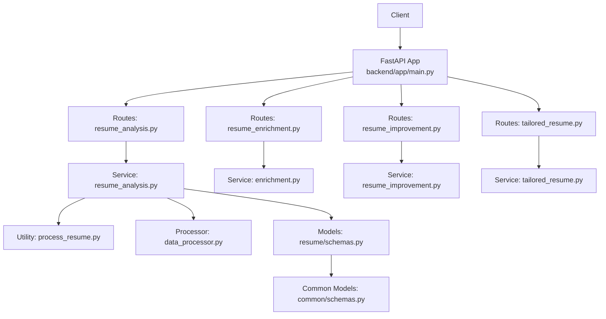
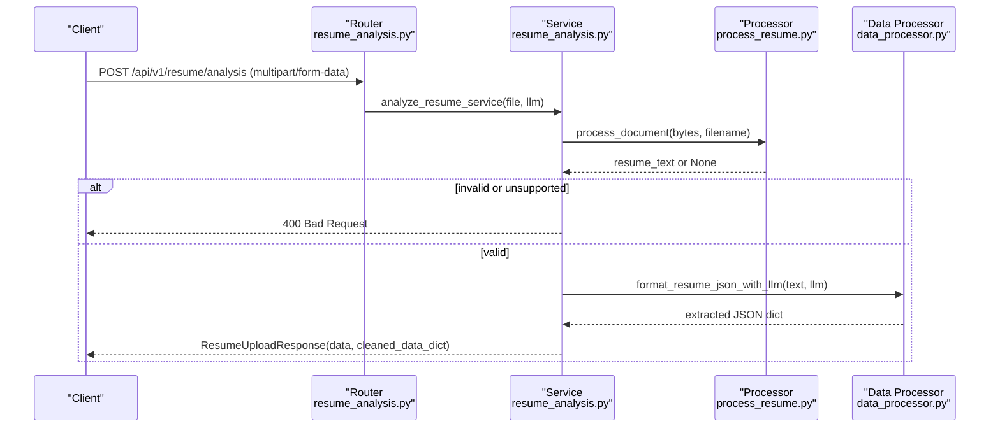
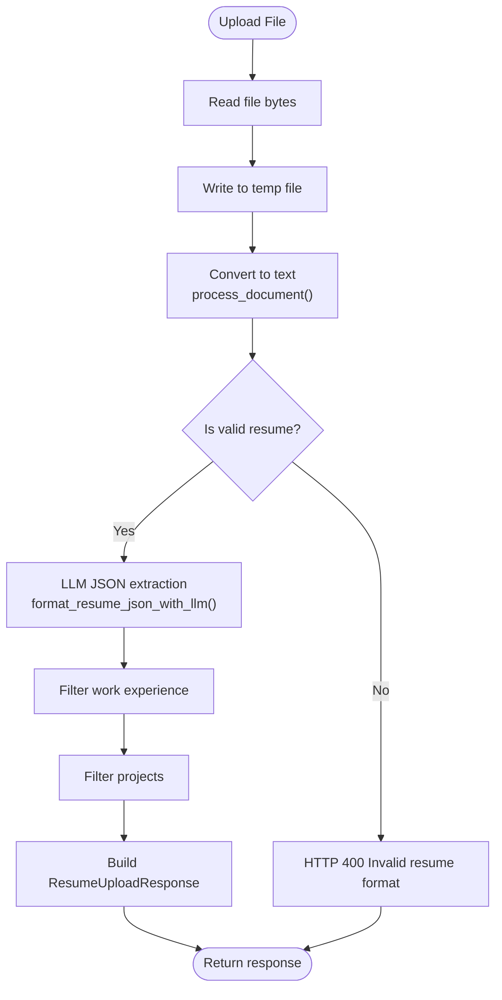
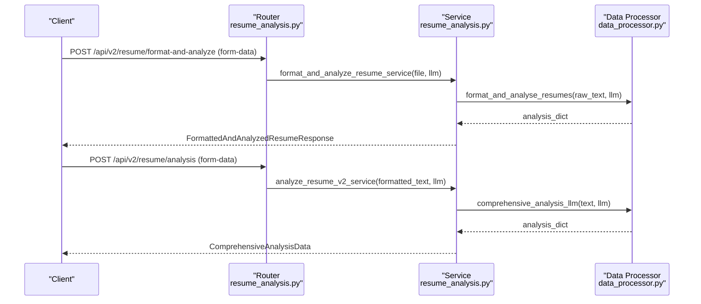
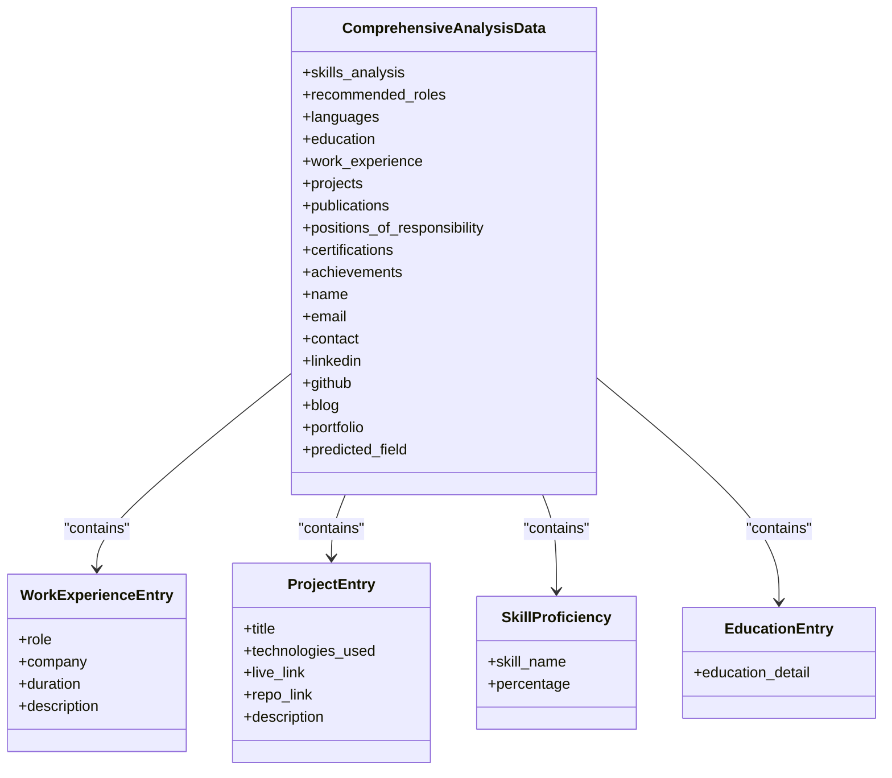
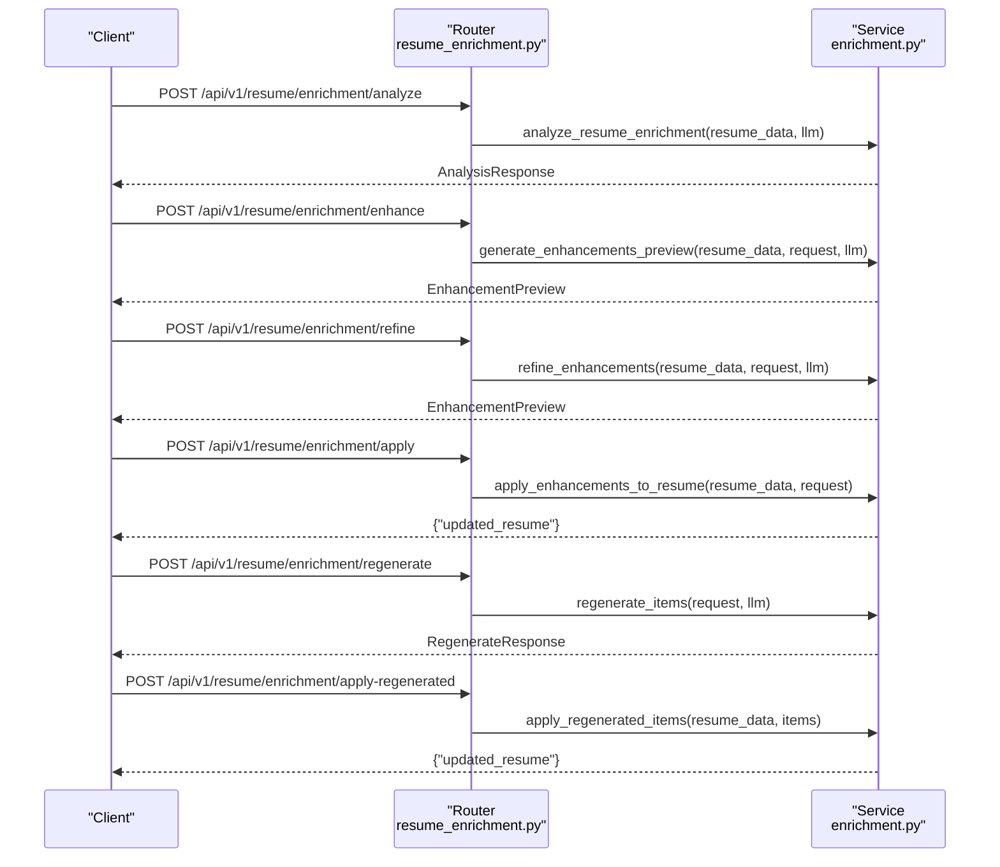
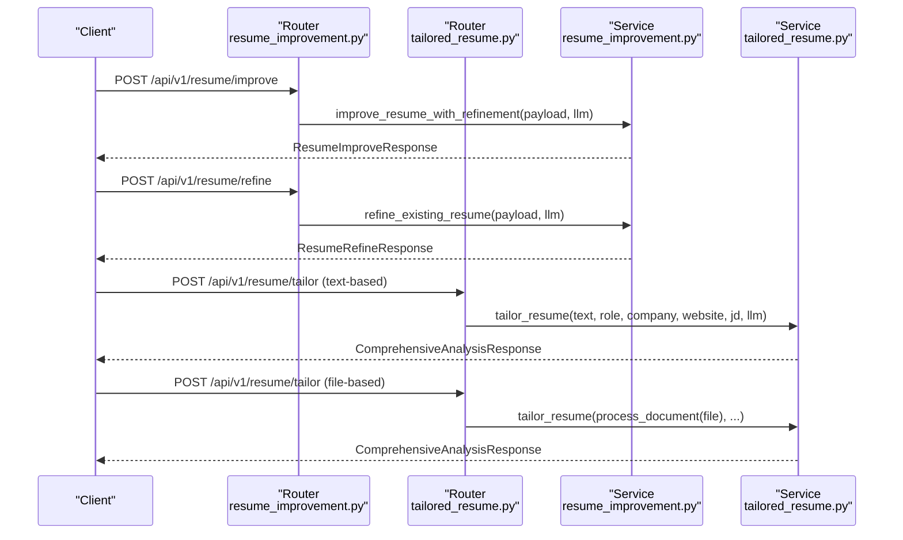
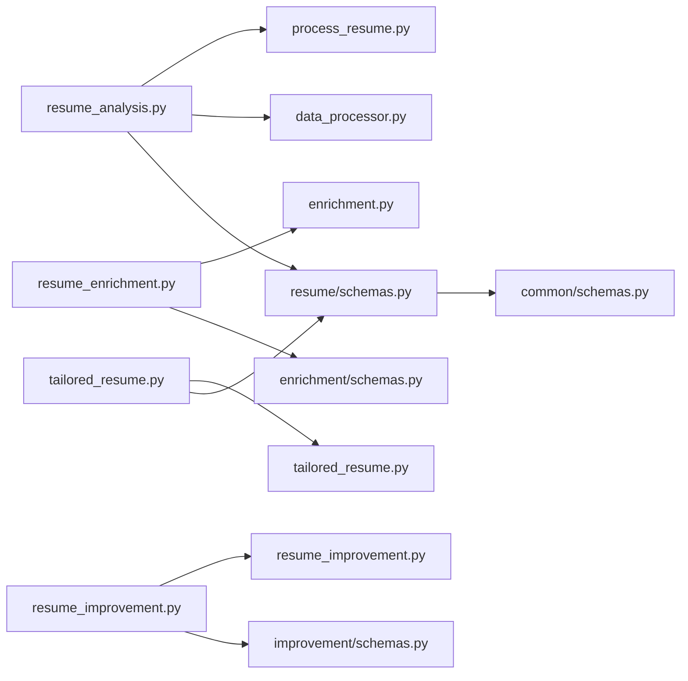

# Resume Analysis API

<cite>
**Referenced Files in This Document**
- [backend/app/main.py](file://backend/app/main.py)
- [backend/app/routes/resume_analysis.py](file://backend/app/routes/resume_analysis.py)
- [backend/app/routes/resume_enrichment.py](file://backend/app/routes/resume_enrichment.py)
- [backend/app/routes/resume_improvement.py](file://backend/app/routes/resume_improvement.py)
- [backend/app/routes/tailored_resume.py](file://backend/app/routes/tailored_resume.py)
- [backend/app/services/resume_analysis.py](file://backend/app/services/resume_analysis.py)
- [backend/app/services/process_resume.py](file://backend/app/services/process_resume.py)
- [backend/app/services/data_processor.py](file://backend/app/services/data_processor.py)
- [backend/app/models/resume/schemas.py](file://backend/app/models/resume/schemas.py)
- [backend/app/models/common/schemas.py](file://backend/app/models/common/schemas.py)
</cite>

## Table of Contents
1. [Introduction](#introduction)
2. [Project Structure](#project-structure)
3. [Core Components](#core-components)
4. [Architecture Overview](#architecture-overview)
5. [Detailed Component Analysis](#detailed-component-analysis)
6. [Dependency Analysis](#dependency-analysis)
7. [Performance Considerations](#performance-considerations)
8. [Troubleshooting Guide](#troubleshooting-guide)
9. [Conclusion](#conclusion)
10. [Appendices](#appendices)

## Introduction
This document provides comprehensive API documentation for the resume analysis functionality. It covers:
- File upload endpoints for resume processing
- Text-based analysis endpoints
- Batch processing capabilities
- Structured schemas for resume data extraction, skill identification, experience parsing, and education validation
- Enrichment endpoints for adding missing information, improvement suggestions, and tailored resume generation
- The NLP processing pipeline, entity recognition, and structured output formats
- Practical examples of resume analysis workflows, error handling for malformed inputs, and performance considerations for large files

## Project Structure
The resume analysis feature is implemented as part of a FastAPI backend. Key components include:
- Routers that define API endpoints for file-based and text-based analysis
- Services that orchestrate document processing, LLM-based extraction, and validation
- Models that define request/response schemas for structured outputs
- Utilities for document conversion and LLM prompt chains

**Diagram sources**
- [backend/app/main.py](file://backend/app/main.py#L157-L196)
- [backend/app/routes/resume_analysis.py](file://backend/app/routes/resume_analysis.py#L1-L68)
- [backend/app/routes/resume_enrichment.py](file://backend/app/routes/resume_enrichment.py#L1-L118)
- [backend/app/routes/resume_improvement.py](file://backend/app/routes/resume_improvement.py#L1-L43)
- [backend/app/routes/tailored_resume.py](file://backend/app/routes/tailored_resume.py#L1-L79)
- [backend/app/services/resume_analysis.py](file://backend/app/services/resume_analysis.py#L1-L364)
- [backend/app/services/process_resume.py](file://backend/app/services/process_resume.py#L68-L91)
- [backend/app/services/data_processor.py](file://backend/app/services/data_processor.py#L186-L269)
- [backend/app/models/resume/schemas.py](file://backend/app/models/resume/schemas.py#L21-L157)
- [backend/app/models/common/schemas.py](file://backend/app/models/common/schemas.py#L6-L128)

**Section sources**
- [backend/app/main.py](file://backend/app/main.py#L157-L196)

## Core Components
- File-based resume analysis endpoint: Accepts a resume file and returns structured data via LLM extraction and validation.
- Text-based resume analysis endpoint: Accepts pre-formatted text and returns comprehensive analysis.
- Comprehensive analysis service: Extracts skills, languages, education, experience, projects, and more.
- Enrichment endpoints: Analyze, enhance, refine, regenerate, and apply improvements to resume data.
- Tailored resume generation: Aligns resume content with a target job role and optional context.
- Data processors: Handle document conversion, text formatting, JSON extraction, and LLM prompt chains.
- Schemas: Define typed request/response models for robust API contracts.

**Section sources**
- [backend/app/routes/resume_analysis.py](file://backend/app/routes/resume_analysis.py#L16-L67)
- [backend/app/routes/resume_enrichment.py](file://backend/app/routes/resume_enrichment.py#L30-L117)
- [backend/app/routes/tailored_resume.py](file://backend/app/routes/tailored_resume.py#L33-L78)
- [backend/app/services/resume_analysis.py](file://backend/app/services/resume_analysis.py#L28-L342)
- [backend/app/services/data_processor.py](file://backend/app/services/data_processor.py#L26-L342)
- [backend/app/models/resume/schemas.py](file://backend/app/models/resume/schemas.py#L21-L157)

## Architecture Overview
The system follows a layered architecture:
- Presentation layer: FastAPI routers expose endpoints for file and text-based analysis, enrichment, improvement, and tailored resume generation.
- Application layer: Services coordinate document processing, LLM interactions, and data validation.
- Domain models: Pydantic models define request/response schemas for typed APIs.
- Utility layer: Document conversion and LLM prompt chains encapsulate NLP processing.

**Diagram sources**
- [backend/app/routes/resume_analysis.py](file://backend/app/routes/resume_analysis.py#L16-L25)
- [backend/app/services/resume_analysis.py](file://backend/app/services/resume_analysis.py#L28-L156)
- [backend/app/services/process_resume.py](file://backend/app/services/process_resume.py#L68-L91)
- [backend/app/services/data_processor.py](file://backend/app/services/data_processor.py#L66-L130)

## Detailed Component Analysis

### File-Based Resume Analysis
Endpoints:
- POST /api/v1/resume/analysis
- POST /api/v2/resume/format-and-analyze
- POST /api/v2/resume/analysis

Processing flow:
- Reads uploaded file bytes and writes to a temporary location
- Converts document to text using document processing utilities
- Validates text as a resume
- Extracts and normalizes structured data using LLM-based JSON formatter
- Applies filtering for experience and project entries
- Returns typed response with cleaned data dictionary

**Diagram sources**
- [backend/app/services/resume_analysis.py](file://backend/app/services/resume_analysis.py#L28-L156)
- [backend/app/services/process_resume.py](file://backend/app/services/process_resume.py#L68-L109)
- [backend/app/services/data_processor.py](file://backend/app/services/data_processor.py#L66-L130)

**Section sources**
- [backend/app/routes/resume_analysis.py](file://backend/app/routes/resume_analysis.py#L16-L25)
- [backend/app/routes/resume_analysis.py](file://backend/app/routes/resume_analysis.py#L43-L67)
- [backend/app/services/resume_analysis.py](file://backend/app/services/resume_analysis.py#L28-L156)

### Text-Based Resume Analysis
Endpoints:
- POST /api/v2/resume/format-and-analyze
- POST /api/v2/resume/analysis

Processing flow:
- Accepts pre-formatted text
- Formats and analyzes using unified LLM chain
- Returns comprehensive analysis data

**Diagram sources**
- [backend/app/routes/resume_analysis.py](file://backend/app/routes/resume_analysis.py#L43-L67)
- [backend/app/services/resume_analysis.py](file://backend/app/services/resume_analysis.py#L240-L342)
- [backend/app/services/data_processor.py](file://backend/app/services/data_processor.py#L271-L342)

**Section sources**
- [backend/app/routes/resume_analysis.py](file://backend/app/routes/resume_analysis.py#L43-L67)
- [backend/app/services/resume_analysis.py](file://backend/app/services/resume_analysis.py#L240-L342)

### Comprehensive Analysis Pipeline
The comprehensive analysis extracts:
- Skills with proficiency percentages
- Languages
- Education entries
- Work experience with bullet points
- Projects with technologies and links
- Publications, certifications, achievements
- Personal identifiers (name, email, contact, social links)
- Predicted field

**Diagram sources**
- [backend/app/models/resume/schemas.py](file://backend/app/models/resume/schemas.py#L21-L42)
- [backend/app/models/common/schemas.py](file://backend/app/models/common/schemas.py#L6-L122)

**Section sources**
- [backend/app/models/resume/schemas.py](file://backend/app/models/resume/schemas.py#L21-L48)
- [backend/app/models/common/schemas.py](file://backend/app/models/common/schemas.py#L6-L122)

### Resume Enrichment Endpoints
Capabilities:
- Analyze resume items for enrichment
- Generate enhanced descriptions
- Refine rejected enhancements
- Apply enhancements
- Regenerate selected items
- Apply regenerated items

**Diagram sources**
- [backend/app/routes/resume_enrichment.py](file://backend/app/routes/resume_enrichment.py#L30-L117)

**Section sources**
- [backend/app/routes/resume_enrichment.py](file://backend/app/routes/resume_enrichment.py#L30-L117)

### Resume Improvement and Tailored Resume
- Improve endpoint aligns resume with keywords and refines content.
- Tailored resume endpoint generates a tailored analysis given a target role and optional context.

**Diagram sources**
- [backend/app/routes/resume_improvement.py](file://backend/app/routes/resume_improvement.py#L21-L42)
- [backend/app/routes/tailored_resume.py](file://backend/app/routes/tailored_resume.py#L33-L78)

**Section sources**
- [backend/app/routes/resume_improvement.py](file://backend/app/routes/resume_improvement.py#L21-L42)
- [backend/app/routes/tailored_resume.py](file://backend/app/routes/tailored_resume.py#L33-L78)

## Dependency Analysis
Key dependencies and relationships:
- Routers depend on services for business logic
- Services depend on document processing utilities and LLM data processors
- Models define contracts for typed requests and responses
- Common models are reused across resume and enrichment domains

**Diagram sources**
- [backend/app/routes/resume_analysis.py](file://backend/app/routes/resume_analysis.py#L1-L11)
- [backend/app/services/resume_analysis.py](file://backend/app/services/resume_analysis.py#L1-L25)
- [backend/app/services/process_resume.py](file://backend/app/services/process_resume.py#L1-L11)
- [backend/app/services/data_processor.py](file://backend/app/services/data_processor.py#L1-L16)
- [backend/app/models/resume/schemas.py](file://backend/app/models/resume/schemas.py#L1-L18)
- [backend/app/models/common/schemas.py](file://backend/app/models/common/schemas.py#L1-L4)

**Section sources**
- [backend/app/routes/resume_analysis.py](file://backend/app/routes/resume_analysis.py#L1-L11)
- [backend/app/services/resume_analysis.py](file://backend/app/services/resume_analysis.py#L1-L25)
- [backend/app/models/resume/schemas.py](file://backend/app/models/resume/schemas.py#L1-L18)

## Performance Considerations
- Document conversion: PDF/DOC/DOCX are converted to Markdown for consistent parsing; fallback conversion uses multimodal LLM for PDFs when supported.
- LLM reliability: Text and JSON formatting includes fallbacks and error handling to avoid blocking failures.
- Large files: Temporary file handling prevents memory overload during processing.
- Rate limiting and auth: Detected issues are handled gracefully by falling back to original text.
- Validation: Pre-checks ensure resume validity before expensive LLM processing.

[No sources needed since this section provides general guidance]

## Troubleshooting Guide
Common issues and resolutions:
- Unsupported file type: Ensure file extension is TXT, MD, PDF, or DOCX; otherwise conversion returns None and a 400 error is raised.
- Empty or invalid resume text: Validation checks for resume keywords; failure triggers a 400 error.
- LLM unavailability or malformed JSON: JSON extraction attempts multiple parsing strategies; on failure returns empty dict or raises 500.
- Rate limit or auth errors: Detected conditions trigger fallback to original text with warnings.

**Section sources**
- [backend/app/services/process_resume.py](file://backend/app/services/process_resume.py#L68-L91)
- [backend/app/services/resume_analysis.py](file://backend/app/services/resume_analysis.py#L53-L73)
- [backend/app/services/data_processor.py](file://backend/app/services/data_processor.py#L66-L130)
- [backend/app/services/data_processor.py](file://backend/app/services/data_processor.py#L186-L269)

## Conclusion
The resume analysis API provides robust endpoints for file-based and text-based processing, comprehensive structured extraction, enrichment workflows, and tailored resume generation. Typed schemas ensure reliable integrations, while resilient LLM processing and validation improve reliability for varied inputs.

[No sources needed since this section summarizes without analyzing specific files]

## Appendices

### API Endpoints Summary
- File-based analysis
  - POST /api/v1/resume/analysis
  - POST /api/v2/resume/format-and-analyze
  - POST /api/v2/resume/analysis
- Enrichment
  - POST /api/v1/resume/enrichment/analyze
  - POST /api/v1/resume/enrichment/enhance
  - POST /api/v1/resume/enrichment/refine
  - POST /api/v1/resume/enrichment/apply
  - POST /api/v1/resume/enrichment/regenerate
  - POST /api/v1/resume/enrichment/apply-regenerated
- Improvement
  - POST /api/v1/resume/improve
  - POST /api/v1/resume/refine
- Tailored Resume
  - POST /api/v1/resume/tailor (text-based)
  - POST /api/v1/resume/tailor (file-based)

**Section sources**
- [backend/app/routes/resume_analysis.py](file://backend/app/routes/resume_analysis.py#L16-L67)
- [backend/app/routes/resume_enrichment.py](file://backend/app/routes/resume_enrichment.py#L30-L117)
- [backend/app/routes/resume_improvement.py](file://backend/app/routes/resume_improvement.py#L21-L42)
- [backend/app/routes/tailored_resume.py](file://backend/app/routes/tailored_resume.py#L33-L78)

### Structured Output Schemas
- ComprehensiveAnalysisData: Skills, languages, education, experience, projects, publications, certifications, achievements, personal identifiers, predicted field
- ResumeUploadResponse: Analysis result plus cleaned data dictionary
- FormattedAndAnalyzedResumeResponse: Cleaned text and comprehensive analysis
- Common entries: WorkExperienceEntry, ProjectEntry, SkillProficiency, EducationEntry

**Section sources**
- [backend/app/models/resume/schemas.py](file://backend/app/models/resume/schemas.py#L21-L94)
- [backend/app/models/common/schemas.py](file://backend/app/models/common/schemas.py#L6-L122)