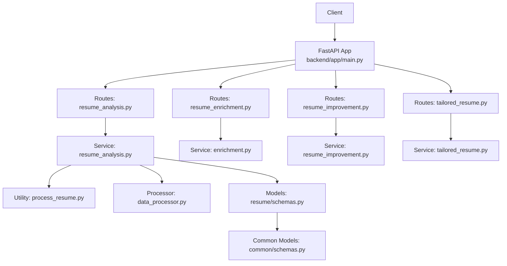
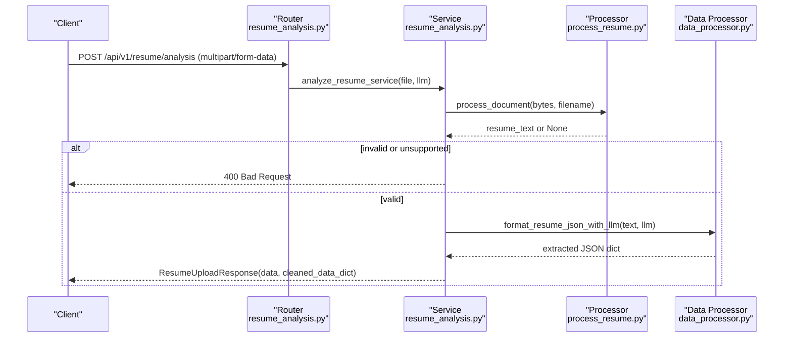
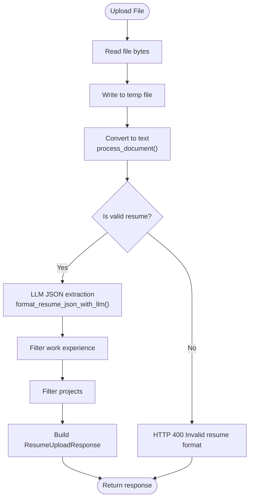
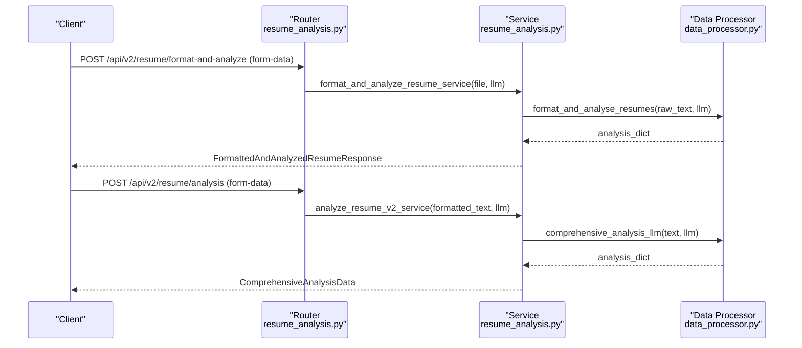
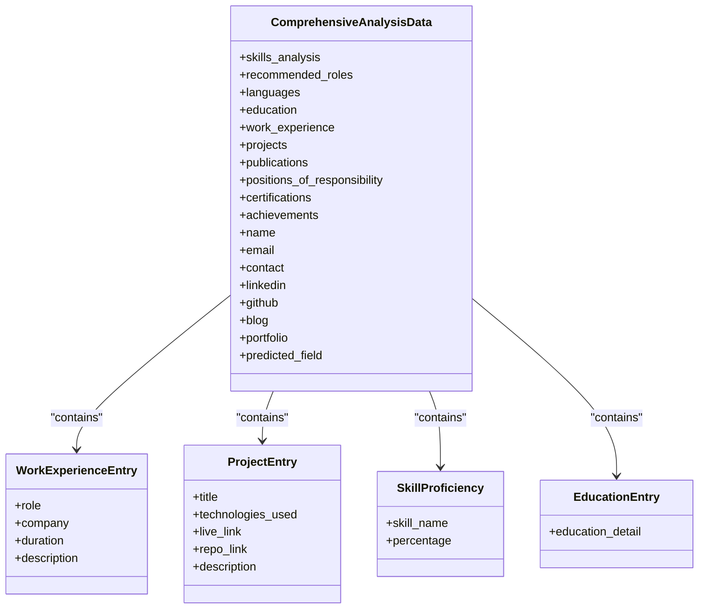
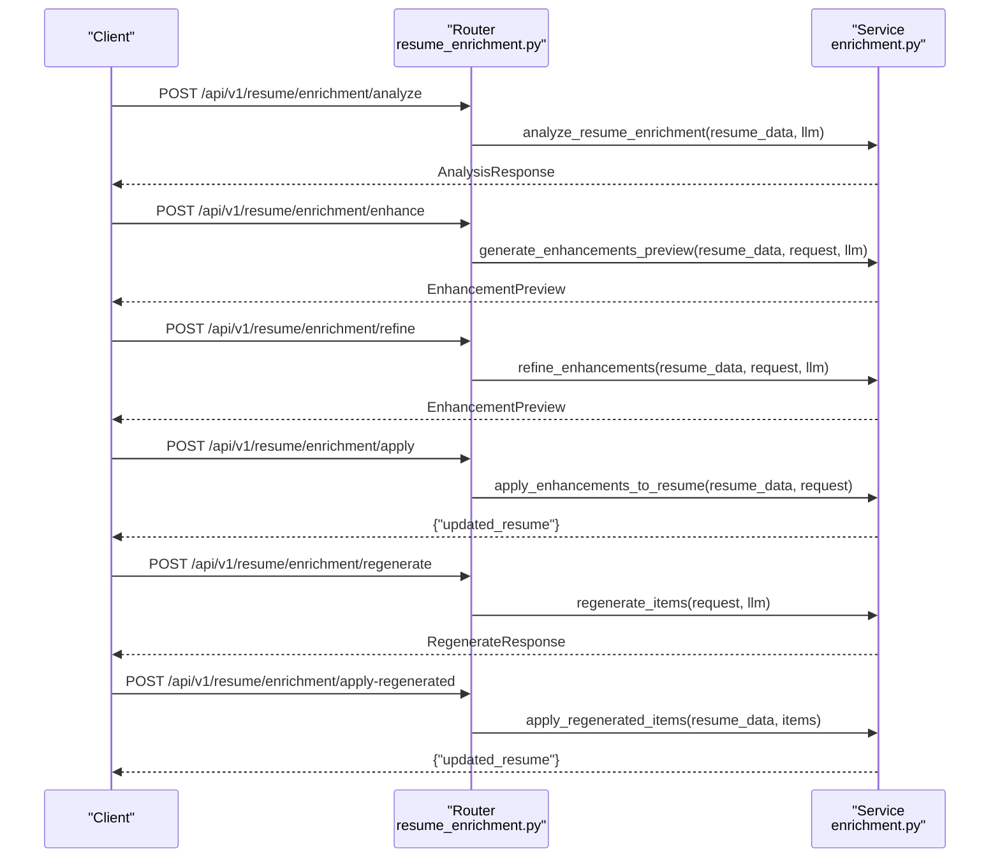
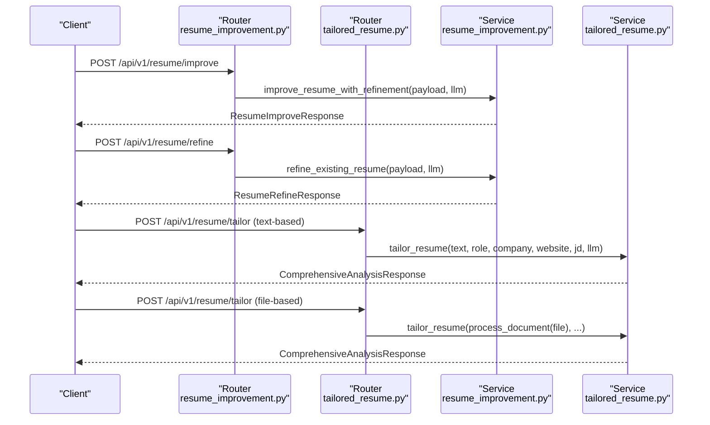
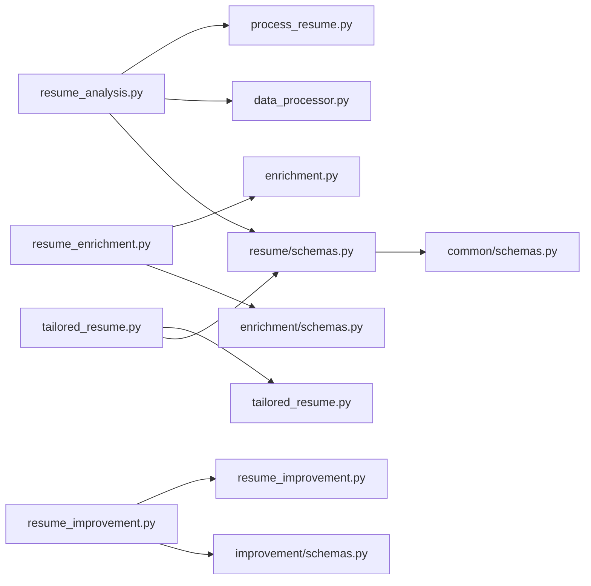

# Resume analysis API

## Introduction
This page provides detailed API documentation for the resume analysis functionality. It covers:
- File upload endpoints for resume processing
- Text-based analysis endpoints
- Batch processing capabilities
- Structured schemas for resume data extraction, skill identification, experience parsing, and education validation
- Enrichment endpoints for adding missing information, improvement suggestions, and tailored resume generation
- The NLP processing pipeline, entity recognition, and structured output formats
- Practical examples of resume analysis workflows, error handling for malformed inputs, and performance considerations for large files

## Project structure
The resume analysis feature is implemented as part of a FastAPI backend. Key components include:
- Routers that define API endpoints for file-based and text-based analysis
- Services that orchestrate document processing, LLM-based extraction, and validation
- Models that define request/response schemas for structured outputs
- Utilities for document conversion and LLM prompt chains

```mermaid
graph TB
Client["Client"] --> Main["FastAPI App<br/>backend/app/main.py"]
Main --> RoutesRA["Routes: resume_analysis.py"]
Main --> RoutesRE["Routes: resume_enrichment.py"]
Main --> RoutesRI["Routes: resume_improvement.py"]
Main --> RoutesTR["Routes: tailored_resume.py"]
RoutesRA --> SvcRA["Service: resume_analysis.py"]
RoutesRE --> SvcEN["Service: enrichment.py"]
RoutesRI --> SvcIM["Service: resume_improvement.py"]
RoutesTR --> SvcTR["Service: tailored_resume.py"]
SvcRA --> ProcDoc["Utility: process_resume.py"]
SvcRA --> DP["Processor: data_processor.py"]
SvcRA --> Models["Models: resume/schemas.py"]
Models --> Common["Common Models: common/schemas.py"]
```

## Core components
- File-based resume analysis endpoint: Accepts a resume file and returns structured data via LLM extraction and validation.
- Text-based resume analysis endpoint: Accepts pre-formatted text and returns detailed analysis.
- Detailed analysis service: Extracts skills, languages, education, experience, projects, and more.
- Enrichment endpoints: Analyze, improve, refine, regenerate, and apply improvements to resume data.
- Tailored resume generation: Aligns resume content with a target job role and optional context.
- Data processors: Handle document conversion, text formatting, JSON extraction, and LLM prompt chains.
- Schemas: Define typed request/response models for reliable API contracts.

## Architecture overview
The system follows a layered architecture:
- Presentation layer: FastAPI routers expose endpoints for file and text-based analysis, enrichment, improvement, and tailored resume generation.
- Application layer: Services coordinate document processing, LLM interactions, and data validation.
- Domain models: Pydantic models define request/response schemas for typed APIs.
- Utility layer: Document conversion and LLM prompt chains encapsulate NLP processing.

```mermaid
sequenceDiagram
participant C as "Client"
participant R as "Router<br/>resume_analysis.py"
participant S as "Service<br/>resume_analysis.py"
participant P as "Processor<br/>process_resume.py"
participant D as "Data Processor<br/>data_processor.py"
C->>R : POST /api/v1/resume/analysis (multipart/form-data)
R->>S : analyze_resume_service(file, llm)
S->>P : process_document(bytes, filename)
P-->>S : resume_text or None
alt invalid or unsupported
S-->>C : 400 Bad Request
else valid
S->>D : format_resume_json_with_llm(text, llm)
D-->>S : extracted JSON dict
S-->>C : ResumeUploadResponse(data, cleaned_data_dict)
end
```

## Detailed component analysis

### File-Based resume analysis
Endpoints:
- POST /api/v1/resume/analysis
- POST /api/v2/resume/format-and-analyze
- POST /api/v2/resume/analysis

Processing flow:
- Reads uploaded file bytes and writes to a temporary location
- Converts document to text using document processing utilities
- Validates text as a resume
- Extracts and normalizes structured data using LLM-based JSON formatter
- Applies filtering for experience and project entries
- Returns typed response with cleaned data dictionary

```mermaid
flowchart TD
Start(["Upload File"]) --> ReadBytes["Read file bytes"]
ReadBytes --> WriteTemp["Write to temp file"]
WriteTemp --> Convert["Convert to text<br/>process_document()"]
Convert --> ValidCheck{"Is valid resume?"}
ValidCheck --> |No| Err400["HTTP 400 Invalid resume format"]
ValidCheck --> |Yes| LLMJSON["LLM JSON extraction<br/>format_resume_json_with_llm()"]
LLMJSON --> FilterExp["Filter work experience"]
FilterExp --> FilterProj["Filter projects"]
FilterProj --> BuildResp["Build ResumeUploadResponse"]
BuildResp --> End(["Return response"])
Err400 --> End
```

### Text-Based resume analysis
Endpoints:
- POST /api/v2/resume/format-and-analyze
- POST /api/v2/resume/analysis

Processing flow:
- Accepts pre-formatted text
- Formats and analyzes using unified LLM chain
- Returns detailed analysis data

```mermaid
sequenceDiagram
participant C as "Client"
participant R as "Router<br/>resume_analysis.py"
participant S as "Service<br/>resume_analysis.py"
participant D as "Data Processor<br/>data_processor.py"
C->>R : POST /api/v2/resume/format-and-analyze (form-data)
R->>S : format_and_analyze_resume_service(file, llm)
S->>D : format_and_analyse_resumes(raw_text, llm)
D-->>S : analysis_dict
S-->>C : FormattedAndAnalyzedResumeResponse
C->>R : POST /api/v2/resume/analysis (form-data)
R->>S : analyze_resume_v2_service(formatted_text, llm)
S->>D : comprehensive_analysis_llm(text, llm)
D-->>S : analysis_dict
S-->>C : ComprehensiveAnalysisData
```

### Detailed analysis pipeline
The detailed analysis extracts:
- Skills with proficiency percentages
- Languages
- Education entries
- Work experience with bullet points
- Projects with technologies and links
- Publications, certifications, achievements
- Personal identifiers (name, email, contact, social links)
- Predicted field

```mermaid
classDiagram
class ComprehensiveAnalysisData {
+skills_analysis
+recommended_roles
+languages
+education
+work_experience
+projects
+publications
+positions_of_responsibility
+certifications
+achievements
+name
+email
+contact
+linkedin
+github
+blog
+portfolio
+predicted_field
}
class WorkExperienceEntry {
+role
+company
+duration
+description
}
class ProjectEntry {
+title
+technologies_used
+live_link
+repo_link
+description
}
class SkillProficiency {
+skill_name
+percentage
}
class EducationEntry {
+education_detail
}
ComprehensiveAnalysisData --> WorkExperienceEntry : "contains"
ComprehensiveAnalysisData --> ProjectEntry : "contains"
ComprehensiveAnalysisData --> SkillProficiency : "contains"
ComprehensiveAnalysisData --> EducationEntry : "contains"
```

### Resume enrichment endpoints
Capabilities:
- Analyze resume items for enrichment
- Generate improved descriptions
- Refine rejected enhancements
- Apply enhancements
- Regenerate selected items
- Apply regenerated items

```mermaid
sequenceDiagram
participant C as "Client"
participant R as "Router<br/>resume_enrichment.py"
participant S as "Service<br/>enrichment.py"
C->>R : POST /api/v1/resume/enrichment/analyze
R->>S : analyze_resume_enrichment(resume_data, llm)
S-->>C : AnalysisResponse
C->>R : POST /api/v1/resume/enrichment/enhance
R->>S : generate_enhancements_preview(resume_data, request, llm)
S-->>C : EnhancementPreview
C->>R : POST /api/v1/resume/enrichment/refine
R->>S : refine_enhancements(resume_data, request, llm)
S-->>C : EnhancementPreview
C->>R : POST /api/v1/resume/enrichment/apply
R->>S : apply_enhancements_to_resume(resume_data, request)
S-->>C : {"updated_resume"}
C->>R : POST /api/v1/resume/enrichment/regenerate
R->>S : regenerate_items(request, llm)
S-->>C : RegenerateResponse
C->>R : POST /api/v1/resume/enrichment/apply-regenerated
R->>S : apply_regenerated_items(resume_data, items)
S-->>C : {"updated_resume"}
```

### Resume improvement and tailored resume
- Improve endpoint aligns resume with keywords and refines content.
- Tailored resume endpoint generates a tailored analysis given a target role and optional context.

```mermaid
sequenceDiagram
participant C as "Client"
participant RI as "Router<br/>resume_improvement.py"
participant TR as "Router<br/>tailored_resume.py"
participant SI as "Service<br/>resume_improvement.py"
participant ST as "Service<br/>tailored_resume.py"
C->>RI : POST /api/v1/resume/improve
RI->>SI : improve_resume_with_refinement(payload, llm)
SI-->>C : ResumeImproveResponse
C->>RI : POST /api/v1/resume/refine
RI->>SI : refine_existing_resume(payload, llm)
SI-->>C : ResumeRefineResponse
C->>TR : POST /api/v1/resume/tailor (text-based)
TR->>ST : tailor_resume(text, role, company, website, jd, llm)
ST-->>C : ComprehensiveAnalysisResponse
C->>TR : POST /api/v1/resume/tailor (file-based)
TR->>ST : tailor_resume(process_document(file), ...)
ST-->>C : ComprehensiveAnalysisResponse
```

## Dependency analysis
Key dependencies and relationships:
- Routers depend on services for business logic
- Services depend on document processing utilities and LLM data processors
- Models define contracts for typed requests and responses
- Common models are reused across resume and enrichment domains

```mermaid
graph LR
RA["resume_analysis.py"] --> PR["process_resume.py"]
RA --> DP["data_processor.py"]
RA --> RS["resume/schemas.py"]
RS --> CS["common/schemas.py"]
RE["resume_enrichment.py"] --> EN["enrichment.py"]
RE --> ES["enrichment/schemas.py"]
RI["resume_improvement.py"] --> IM["resume_improvement.py"]
RI --> IS["improvement/schemas.py"]
TR["tailored_resume.py"] --> TRS["tailored_resume.py"]
TR --> RS
```

## Performance considerations
- Document conversion: PDF/DOC/DOCX are converted to Markdown for consistent parsing; fallback conversion uses multimodal LLM for PDFs when supported.
- LLM reliability: Text and JSON formatting includes fallbacks and error handling to avoid blocking failures.
- Large files: Temporary file handling prevents memory overload during processing.
- Rate limiting and auth: Detected issues are handled gracefully by falling back to original text.
- Validation: Pre-checks ensure resume validity before expensive LLM processing.

[No sources needed since this section provides general guidance]

## Troubleshooting guide
Common issues and resolutions:
- Unsupported file type: Ensure file extension is TXT, MD, PDF, or DOCX; otherwise conversion returns None and a 400 error is raised.
- Empty or invalid resume text: Validation checks for resume keywords; failure triggers a 400 error.
- LLM unavailability or malformed JSON: JSON extraction attempts multiple parsing strategies; on failure returns empty dict or raises 500.
- Rate limit or auth errors: Detected conditions trigger fallback to original text with warnings.

## Conclusion
The resume analysis API provides reliable endpoints for file-based and text-based processing, detailed structured extraction, enrichment workflows, and tailored resume generation. Typed schemas ensure reliable integrations, while resilient LLM processing and validation improve reliability for varied inputs.

[No sources needed since this section summarizes without analyzing specific files]

## Appendices

### API endpoints summary
- File-based analysis
  - POST /api/v1/resume/analysis
  - POST /api/v2/resume/format-and-analyze
  - POST /api/v2/resume/analysis
- Enrichment
  - POST /api/v1/resume/enrichment/analyze
  - POST /api/v1/resume/enrichment/improve
  - POST /api/v1/resume/enrichment/refine
  - POST /api/v1/resume/enrichment/apply
  - POST /api/v1/resume/enrichment/regenerate
  - POST /api/v1/resume/enrichment/apply-regenerated
- Improvement
  - POST /api/v1/resume/improve
  - POST /api/v1/resume/refine
- Tailored Resume
  - POST /api/v1/resume/tailor (text-based)
  - POST /api/v1/resume/tailor (file-based)

### Structured output schemas
- ComprehensiveAnalysisData: Skills, languages, education, experience, projects, publications, certifications, achievements, personal identifiers, predicted field
- ResumeUploadResponse: Analysis result plus cleaned data dictionary
- FormattedAndAnalyzedResumeResponse: Cleaned text and detailed analysis
- Common entries: WorkExperienceEntry, ProjectEntry, SkillProficiency, EducationEntry
