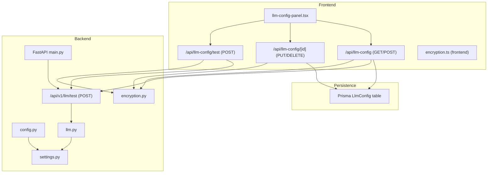
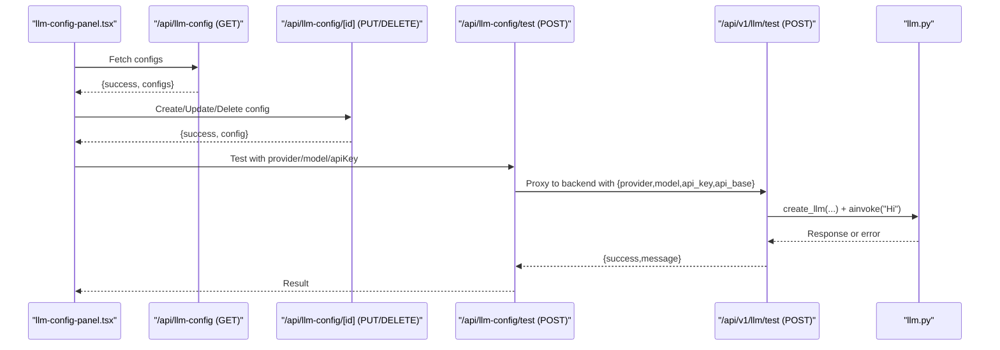
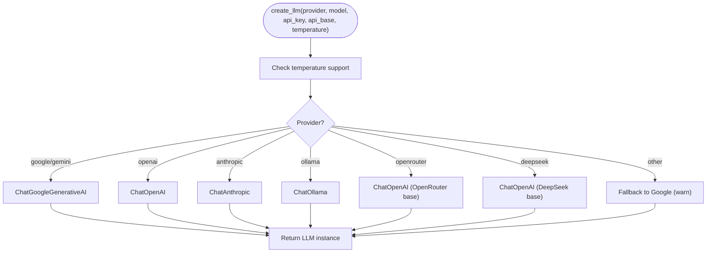
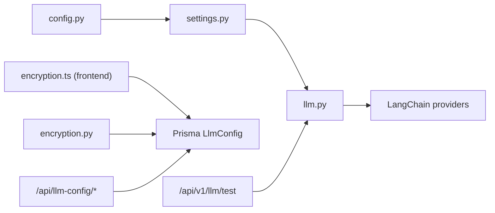

# System Configuration API

<cite>
**Referenced Files in This Document**
- [settings.py](file://backend/app/core/settings.py)
- [config.py](file://backend/app/core/config.py)
- [llm.py](file://backend/app/core/llm.py)
- [encryption.py](file://backend/app/core/encryption.py)
- [main.py](file://backend/app/main.py)
- [.env](file://backend/.env)
- [route.ts (LLM Config list/create)](file://frontend/app/api/llm-config/route.ts)
- [route.ts (LLM Config update/delete)](file://frontend/app/api/llm-config/[id]/route.ts)
- [route.ts (LLM Config test)](file://frontend/app/api/llm-config/test/route.ts)
- [llm-config-panel.tsx](file://frontend/components/llm-config-panel.tsx)
- [encryption.ts (frontend)](file://frontend/lib/encryption.ts)
- [migration.sql (add LLM config)](file://frontend/prisma/migrations/20251114000000_add_llm_config/migration.sql)
- [migration.sql (multi LLM configs)](file://frontend/prisma/migrations/20260214000000_multi_llm_configs/migration.sql)
- [route.ts (backend LLM test)](file://backend/app/routes/llm.py)
</cite>

## Table of Contents
1. [Introduction](#introduction)
2. [Project Structure](#project-structure)
3. [Core Components](#core-components)
4. [Architecture Overview](#architecture-overview)
5. [Detailed Component Analysis](#detailed-component-analysis)
6. [Dependency Analysis](#dependency-analysis)
7. [Performance Considerations](#performance-considerations)
8. [Troubleshooting Guide](#troubleshooting-guide)
9. [Conclusion](#conclusion)
10. [Appendices](#appendices)

## Introduction
This document provides comprehensive API documentation for system configuration and Large Language Model (LLM) provider management. It covers:
- LLM configuration endpoints for listing, creating, updating, and deleting user-specific configurations
- Provider switching capabilities and model selection criteria
- Schemas for configuration management, environment variable handling, and runtime parameter updates
- The provider abstraction layer, cost optimization strategies, and fallback mechanisms
- Configuration validation, default settings, and security considerations for sensitive parameters
- Practical examples of configuration workflows, provider migration procedures, and troubleshooting

## Project Structure
The configuration system spans backend and frontend layers:
- Backend FastAPI application exposes LLM-related endpoints and manages provider instantiation
- Frontend Next.js API routes handle user sessions, persistence, encryption/decryption, and proxying tests to the backend
- Environment variables define defaults and secrets
- Prisma migrations define the LLM configuration schema

**Diagram sources**
- [main.py](file://backend/app/main.py#L201-L203)
- [route.ts (LLM Config list/create)](file://frontend/app/api/llm-config/route.ts#L1-L120)
- [route.ts (LLM Config update/delete)](file://frontend/app/api/llm-config/[id]/route.ts#L1-L134)
- [route.ts (LLM Config test)](file://frontend/app/api/llm-config/test/route.ts#L1-L70)
- [route.ts (backend LLM test)](file://backend/app/routes/llm.py#L1-L50)
- [settings.py](file://backend/app/core/settings.py#L1-L50)
- [config.py](file://backend/app/core/config.py#L1-L7)
- [llm.py](file://backend/app/core/llm.py#L1-L181)
- [encryption.ts (frontend)](file://frontend/lib/encryption.ts#L1-L34)
- [encryption.py](file://backend/app/core/encryption.py#L1-L67)

**Section sources**
- [main.py](file://backend/app/main.py#L201-L203)
- [route.ts (LLM Config list/create)](file://frontend/app/api/llm-config/route.ts#L1-L120)
- [route.ts (LLM Config update/delete)](file://frontend/app/api/llm-config/[id]/route.ts#L1-L134)
- [route.ts (LLM Config test)](file://frontend/app/api/llm-config/test/route.ts#L1-L70)
- [settings.py](file://backend/app/core/settings.py#L1-L50)
- [config.py](file://backend/app/core/config.py#L1-L7)
- [llm.py](file://backend/app/core/llm.py#L1-L181)
- [encryption.ts (frontend)](file://frontend/lib/encryption.ts#L1-L34)
- [encryption.py](file://backend/app/core/encryption.py#L1-L67)

## Core Components
- Settings and Defaults
  - Centralized configuration via Pydantic settings with environment-backed defaults
  - Supports legacy and multi-provider fields for backward compatibility and flexibility
- Provider Abstraction Layer
  - Factory-based creation of LLM instances across providers (OpenAI, Anthropic, Google, Ollama, OpenRouter, DeepSeek)
  - Temperature support varies by provider/model
- Encryption for Sensitive Data
  - AES-256-GCM encryption/decryption for API keys stored in the database
- Frontend Configuration Management
  - UI panel to manage labeled, active LLM configurations per user
  - Test endpoint to validate connectivity without exposing secrets

**Section sources**
- [settings.py](file://backend/app/core/settings.py#L1-L50)
- [llm.py](file://backend/app/core/llm.py#L31-L108)
- [encryption.py](file://backend/app/core/encryption.py#L28-L66)
- [llm-config-panel.tsx](file://frontend/components/llm-config-panel.tsx#L87-L169)

## Architecture Overview
The configuration lifecycle integrates frontend UI, backend routes, and provider instantiation:
- Users create and manage labeled configurations in the frontend panel
- Frontend persists configurations to the database and optionally stores encrypted API keys
- Test requests can use stored keys or supplied ones, validated against the backend
- Backend creates provider-specific LLM instances and performs a lightweight invocation to validate connectivity

**Diagram sources**
- [llm-config-panel.tsx](file://frontend/components/llm-config-panel.tsx#L649-L798)
- [route.ts (LLM Config list/create)](file://frontend/app/api/llm-config/route.ts#L7-L48)
- [route.ts (LLM Config update/delete)](file://frontend/app/api/llm-config/[id]/route.ts#L7-L84)
- [route.ts (LLM Config test)](file://frontend/app/api/llm-config/test/route.ts#L7-L69)
- [route.ts (backend LLM test)](file://backend/app/routes/llm.py#L23-L50)
- [llm.py](file://backend/app/core/llm.py#L31-L108)

## Detailed Component Analysis

### Backend Settings and Environment Variables
- Purpose: Define application-wide defaults and secrets
- Key fields:
  - Legacy: GOOGLE_API_KEY, MODEL_NAME, FASTER_MODEL_NAME, MODEL_TEMPERATURE
  - Multi-provider: LLM_PROVIDER, LLM_MODEL, LLM_API_KEY, LLM_API_BASE, ENCRYPTION_KEY
- Behavior:
  - Case-insensitive environment loading
  - Extra fields ignored
  - LRU caching for performance

**Section sources**
- [settings.py](file://backend/app/core/settings.py#L7-L49)
- [.env](file://backend/.env#L19-L25)

### Provider Abstraction and LLM Factory
- Supported providers: google/gemini, openai, anthropic, ollama, openrouter, deepseek
- Temperature support:
  - Disabled for certain OpenAI models (e.g., o1, o3 variants)
- Fallback behavior:
  - Unknown provider falls back to Google with a warning
- Singleton LLM retrieval:
  - get_llm() initializes default provider/model from settings
  - get_faster_llm() uses FASTER_MODEL_NAME or similar logic

**Diagram sources**
- [llm.py](file://backend/app/core/llm.py#L31-L108)

**Section sources**
- [llm.py](file://backend/app/core/llm.py#L21-L108)

### Backend LLM Test Endpoint
- Endpoint: POST /api/v1/llm/test
- Request schema:
  - provider: string
  - model: string
  - api_key: optional string
  - api_base: optional string
- Behavior:
  - Creates LLM instance using factory
  - Performs lightweight ainvoke("Hi")
  - Returns success with truncated response content or failure with error message

**Section sources**
- [route.ts (backend LLM test)](file://backend/app/routes/llm.py#L23-L50)

### Frontend LLM Configuration API
- Authentication:
  - Uses NextAuth session to authorize requests
- Endpoints:
  - GET /api/llm-config: List user’s configs (ordered by active then recent)
  - POST /api/llm-config: Create new config; auto-activate first config
  - PUT /api/llm-config/[id]: Update config; supports label uniqueness and key re-encryption
  - DELETE /api/llm-config/[id]: Delete config; if active, activates most recent remaining config
  - POST /api/llm-config/test: Test connection using stored or provided API key

- Validation and defaults:
  - Provider and model required
  - Label required and unique per user
  - First config becomes active automatically
  - API key encryption handled by frontend encryption module

**Section sources**
- [route.ts (LLM Config list/create)](file://frontend/app/api/llm-config/route.ts#L7-L119)
- [route.ts (LLM Config update/delete)](file://frontend/app/api/llm-config/[id]/route.ts#L7-L134)
- [route.ts (LLM Config test)](file://frontend/app/api/llm-config/test/route.ts#L7-L69)

### Frontend UI Panel (Configuration Management)
- Features:
  - Provider/model selection with predefined lists and custom model support
  - API key field with masked input; indicates presence of stored key
  - Base URL override per provider
  - Test connection button with validation
  - Create/Edit/Delete actions; activation toggles active config
- Behavior:
  - On save, sends label, provider, model, optional apiKey, optional apiBase
  - On test, forwards to backend test endpoint with optional configId to resolve stored key

**Section sources**
- [llm-config-panel.tsx](file://frontend/components/llm-config-panel.tsx#L87-L169)
- [llm-config-panel.tsx](file://frontend/components/llm-config-panel.tsx#L649-L798)

### Encryption for Sensitive Parameters
- Backend:
  - AES-256-GCM encryption/decryption using ENCRYPTION_KEY derived via SHA-256
  - Raises explicit errors if ENCRYPTION_KEY is missing
- Frontend:
  - AES-256-GCM encryption using ENCRYPTION_KEY derived via SHA-256
  - Throws if ENCRYPTION_KEY is not defined

**Section sources**
- [encryption.py](file://backend/app/core/encryption.py#L12-L66)
- [encryption.ts (frontend)](file://frontend/lib/encryption.ts#L5-L34)

### Database Schema and Migrations
- Initial schema (LlmConfig):
  - Columns: id, userId, provider, model, encryptedKey, apiBase, createdAt, updatedAt
  - Unique constraint on userId (single config per user)
- Migration to multi-config:
  - Adds label, isActive, and compound unique index on (userId, label)
  - Index on (userId, isActive) for fast lookup
  - Updates existing single config to be active

**Section sources**
- [migration.sql (add LLM config)](file://frontend/prisma/migrations/20251114000000_add_llm_config/migration.sql#L1-L26)
- [migration.sql (multi LLM configs)](file://frontend/prisma/migrations/20260214000000_multi_llm_configs/migration.sql#L1-L18)

## Dependency Analysis
- Backend dependencies:
  - FastAPI app registers LLM routes under /api/v1
  - LLM factory depends on settings and provider SDKs
  - Encryption utilities depend on settings for ENCRYPTION_KEY
- Frontend dependencies:
  - NextAuth session for authorization
  - Prisma for persistence
  - Encryption module for secure storage
  - Backend proxy for LLM connectivity tests

**Diagram sources**
- [settings.py](file://backend/app/core/settings.py#L1-L50)
- [config.py](file://backend/app/core/config.py#L1-L7)
- [llm.py](file://backend/app/core/llm.py#L1-L181)
- [encryption.ts (frontend)](file://frontend/lib/encryption.ts#L1-L34)
- [encryption.py](file://backend/app/core/encryption.py#L1-L67)
- [route.ts (LLM Config list/create)](file://frontend/app/api/llm-config/route.ts#L1-L120)
- [route.ts (LLM Config update/delete)](file://frontend/app/api/llm-config/[id]/route.ts#L1-L134)
- [route.ts (LLM Config test)](file://frontend/app/api/llm-config/test/route.ts#L1-L70)
- [route.ts (backend LLM test)](file://backend/app/routes/llm.py#L1-L50)

**Section sources**
- [main.py](file://backend/app/main.py#L201-L203)
- [settings.py](file://backend/app/core/settings.py#L1-L50)
- [llm.py](file://backend/app/core/llm.py#L1-L181)
- [encryption.py](file://backend/app/core/encryption.py#L1-L67)
- [route.ts (LLM Config list/create)](file://frontend/app/api/llm-config/route.ts#L1-L120)
- [route.ts (LLM Config update/delete)](file://frontend/app/api/llm-config/[id]/route.ts#L1-L134)
- [route.ts (LLM Config test)](file://frontend/app/api/llm-config/test/route.ts#L1-L70)
- [route.ts (backend LLM test)](file://backend/app/routes/llm.py#L1-L50)

## Performance Considerations
- Singleton LLM instances:
  - get_llm() and get_faster_llm() cache instances globally to avoid repeated initialization
- Environment loading:
  - Settings are cached via LRU to reduce repeated parsing
- Test invocation:
  - Lightweight ainvoke("Hi") minimizes network overhead during connectivity checks
- Recommendations:
  - Prefer faster model variants for low-latency tasks
  - Limit frequent re-initialization by leveraging cached instances
  - Use local providers (e.g., Ollama) for internal environments to reduce latency and cost

[No sources needed since this section provides general guidance]

## Troubleshooting Guide
Common issues and resolutions:
- Missing API key
  - Symptom: LLM functionality disabled or test failures
  - Resolution: Provide apiKey in request or configure stored key; ensure ENCRYPTION_KEY is set for encryption/decryption
- Invalid provider or model
  - Symptom: Unknown provider warning or provider-specific errors
  - Resolution: Use supported providers and models; consult provider-specific defaults
- Temperature unsupported
  - Symptom: Ignored temperature for specific models
  - Resolution: Adjust temperature expectations for provider/model combinations
- Session unauthorized
  - Symptom: 401 Unauthorized on config endpoints
  - Resolution: Ensure NextAuth session is established
- Duplicate label
  - Symptom: 409 Conflict when creating/updating
  - Resolution: Use a unique label per user
- Deleting active config
  - Symptom: Active config lost unexpectedly
  - Resolution: Backend automatically activates the most recent remaining config

**Section sources**
- [llm.py](file://backend/app/core/llm.py#L120-L145)
- [route.ts (LLM Config list/create)](file://frontend/app/api/llm-config/route.ts#L60-L79)
- [route.ts (LLM Config update/delete)](file://frontend/app/api/llm-config/[id]/route.ts#L36-L44)
- [route.ts (LLM Config test)](file://frontend/app/api/llm-config/test/route.ts#L18-L34)

## Conclusion
The system provides a robust, extensible configuration framework for managing LLM providers and models. It balances flexibility with security through encrypted storage, clear validation, and a provider abstraction layer. The frontend panel simplifies user workflows while the backend ensures safe, efficient provider instantiation and connectivity validation.

[No sources needed since this section summarizes without analyzing specific files]

## Appendices

### API Definitions

- GET /api/llm-config
  - Description: Retrieve all user LLM configurations
  - Response: { success: boolean, configs: array of config objects }
  - Config object fields: id, label, provider, model, apiBase, hasApiKey, isActive, createdAt, updatedAt

- POST /api/llm-config
  - Description: Create a new configuration
  - Request body: { label, provider, model, apiKey?, apiBase? }
  - Response: { success: boolean, message: string, config: ConfigObject }

- PUT /api/llm-config/[id]
  - Description: Update an existing configuration
  - Request body: { label?, provider, model, apiKey?, apiBase? }
  - Response: { success: boolean, message: string, config: ConfigObject }

- DELETE /api/llm-config/[id]
  - Description: Delete a configuration; if active, activate the most recent remaining config
  - Response: { success: boolean, message: string }

- POST /api/llm-config/test
  - Description: Test LLM connectivity using stored or provided API key
  - Request body: { provider, model, apiKey?, apiBase?, configId? }
  - Response: { success: boolean, message: string }

- POST /api/v1/llm/test (Backend)
  - Description: Backend-side LLM connectivity test
  - Request body: { provider, model, api_key?, api_base? }
  - Response: { success: boolean, message: string }

**Section sources**
- [route.ts (LLM Config list/create)](file://frontend/app/api/llm-config/route.ts#L7-L119)
- [route.ts (LLM Config update/delete)](file://frontend/app/api/llm-config/[id]/route.ts#L7-L134)
- [route.ts (LLM Config test)](file://frontend/app/api/llm-config/test/route.ts#L7-L69)
- [route.ts (backend LLM test)](file://backend/app/routes/llm.py#L23-L50)

### Configuration Workflows

- Create a new configuration
  - Use the panel to enter label, provider, model, optional API key, optional base URL
  - Submit; backend validates and stores encrypted key if provided
- Switch provider or model
  - Update provider/model in the panel; test connection before activating
  - If successful, mark as active to become the default for downstream services
- Migrate providers
  - Create a new configuration with the target provider and model
  - Test connectivity; update active configuration
  - Delete the old configuration if satisfied

**Section sources**
- [llm-config-panel.tsx](file://frontend/components/llm-config-panel.tsx#L649-L798)
- [route.ts (LLM Config list/create)](file://frontend/app/api/llm-config/route.ts#L50-L119)
- [route.ts (LLM Config update/delete)](file://frontend/app/api/llm-config/[id]/route.ts#L7-L84)

### Security Considerations
- Encryption
  - Store API keys encrypted in the database; require ENCRYPTION_KEY configured
  - Frontend encrypts before sending; backend decrypts only when necessary
- Secrets
  - Keep ENCRYPTION_KEY secret and consistent across environments
  - Avoid logging sensitive payloads; middleware logs sanitized payloads
- Access control
  - All config endpoints require a valid NextAuth session

**Section sources**
- [encryption.py](file://backend/app/core/encryption.py#L12-L66)
- [encryption.ts (frontend)](file://frontend/lib/encryption.ts#L5-L34)
- [route.ts (LLM Config list/create)](file://frontend/app/api/llm-config/route.ts#L52-L54)
- [main.py](file://backend/app/main.py#L83-L131)