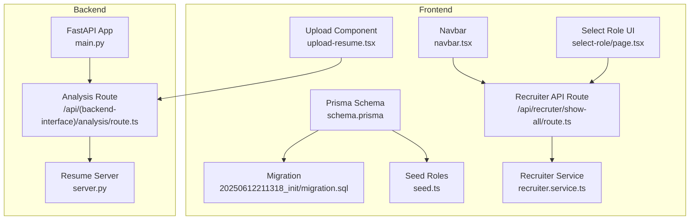
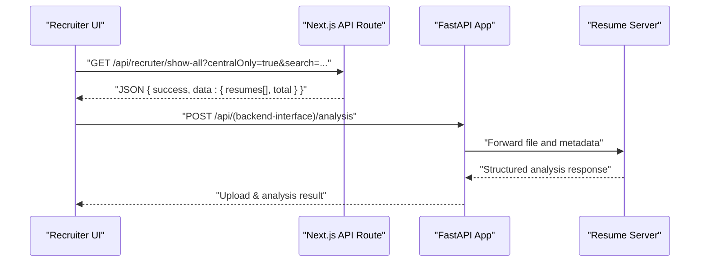
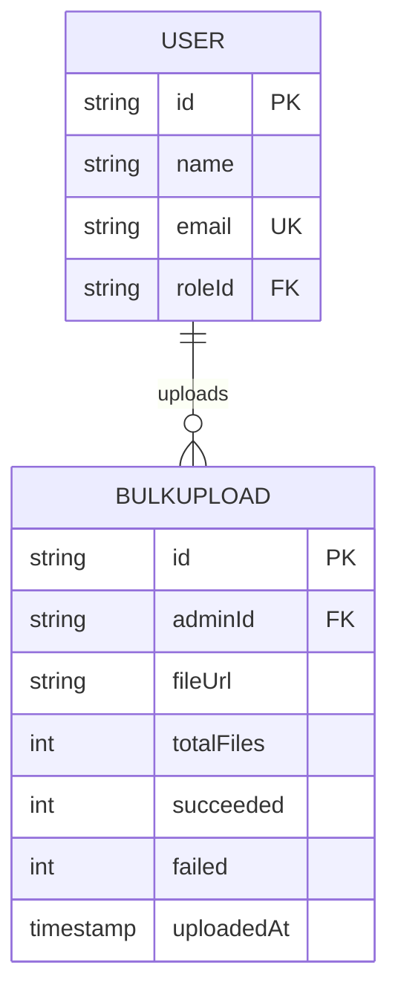
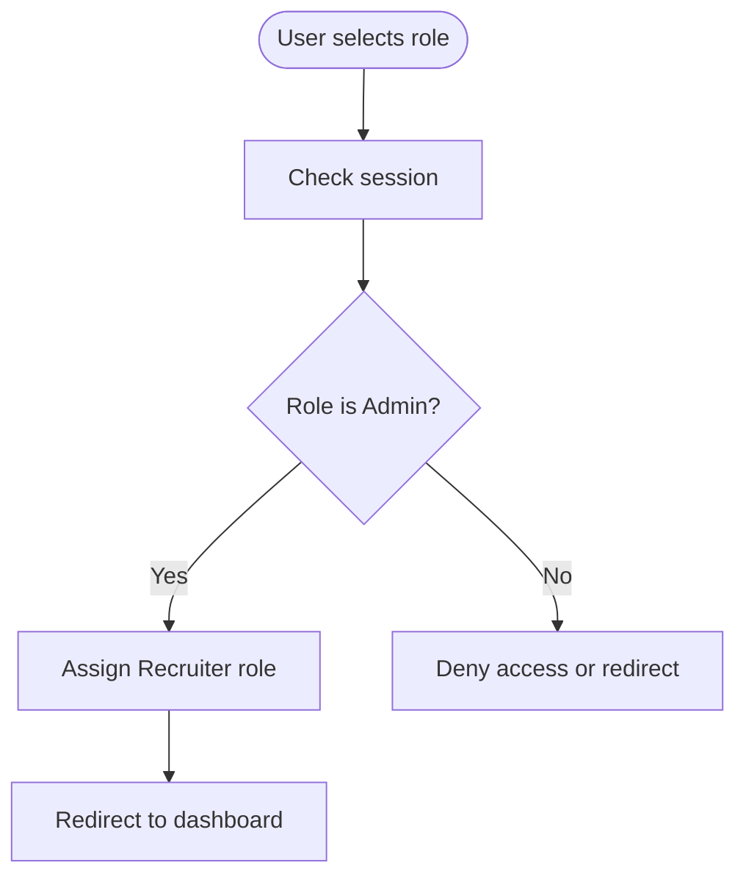
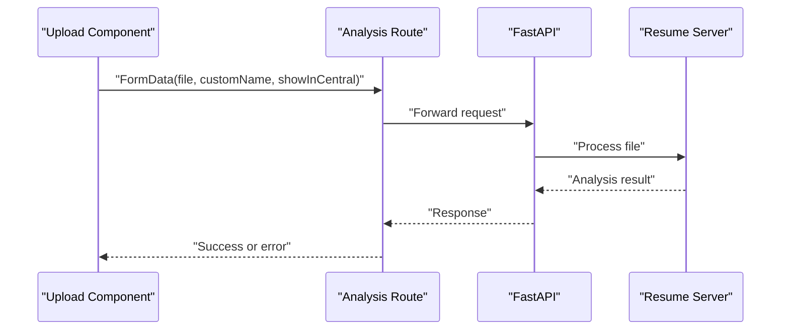
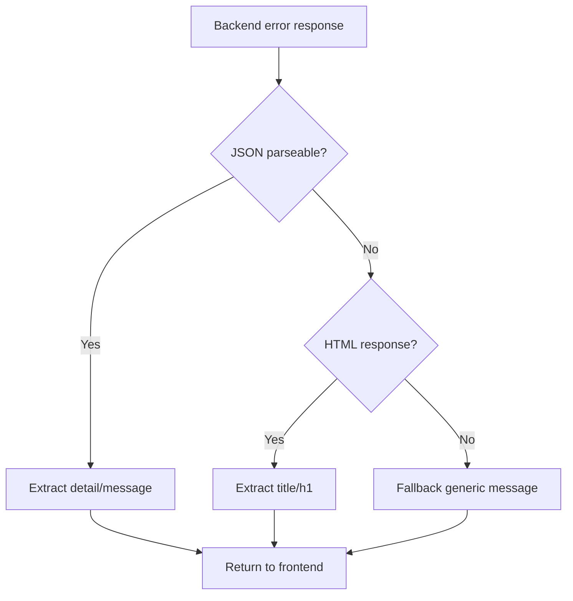
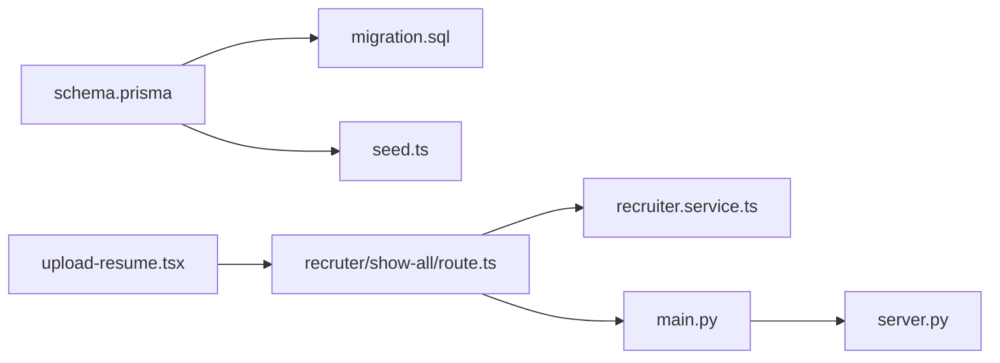

# Bulk Upload and Admin Data

<cite>
**Referenced Files in This Document**
- [schema.prisma](file://frontend/prisma/schema.prisma)
- [20250612211318_init/migration.sql](file://frontend/prisma/migrations/20250612211318_init/migration.sql)
- [seed.ts](file://frontend/prisma/seed.ts)
- [route.ts](file://frontend/app/api/(db)/recruter/show-all/route.ts)
- [recruiter.service.ts](file://frontend/services/recruiter.service.ts)
- [delete-account/route.ts](file://frontend/app/api/auth/delete-account/route.ts)
- [navbar.tsx](file://frontend/components/navbar.tsx)
- [page.tsx](file://frontend/app/select-role/page.tsx)
- [upload-resume.tsx](file://frontend/components/upload-resume.tsx)
- [route.ts](file://frontend/app/api/(backend-interface)/analysis/route.ts)
- [main.py](file://backend/app/main.py)
- [server.py](file://backend/server.py)
</cite>

## Table of Contents
1. [Introduction](#introduction)
2. [Project Structure](#project-structure)
3. [Core Components](#core-components)
4. [Architecture Overview](#architecture-overview)
5. [Detailed Component Analysis](#detailed-component-analysis)
6. [Dependency Analysis](#dependency-analysis)
7. [Performance Considerations](#performance-considerations)
8. [Troubleshooting Guide](#troubleshooting-guide)
9. [Conclusion](#conclusion)

## Introduction
This document explains the Bulk Upload and Admin data models in the TalentSync application, focusing on:
- BulkUpload: administrative file upload tracking, success/failure metrics, and batch processing status
- Recruiter: administrator/recruiter profiles with company information and administrative privileges
- Relationship patterns between admin users and bulk upload operations
- File management workflows, upload progress tracking, and error handling
- Administrative access controls, role-based permissions, and audit trail requirements
- Security considerations for file uploads, virus scanning integration, and data validation for batch processing
- Integration with the resume analysis pipeline for automated processing of uploaded files and notification systems for upload completion status

## Project Structure
The data model is defined in the frontend Prisma schema and enforced via database migrations. The frontend Next.js API routes expose administrative capabilities for recruiters, while the backend FastAPI application orchestrates file processing and integrates with the resume analysis pipeline.



**Diagram sources**
- [schema.prisma](file://frontend/prisma/schema.prisma#L127-L147)
- [20250612211318_init/migration.sql](file://frontend/prisma/migrations/20250612211318_init/migration.sql#L66-L86)
- [seed.ts](file://frontend/prisma/seed.ts#L6-L18)
- [route.ts](file://frontend/app/api/(db)/recruter/show-all/route.ts#L1-L36)
- [recruiter.service.ts](file://frontend/services/recruiter.service.ts#L27-L35)
- [navbar.tsx](file://frontend/components/navbar.tsx#L342-L345)
- [page.tsx](file://frontend/app/select-role/page.tsx#L116-L135)
- [upload-resume.tsx](file://frontend/components/upload-resume.tsx#L137-L184)
- [main.py](file://backend/app/main.py#L157-L203)
- [route.ts](file://frontend/app/api/(backend-interface)/analysis/route.ts#L1-L32)
- [server.py](file://backend/server.py#L587-L601)

**Section sources**
- [schema.prisma](file://frontend/prisma/schema.prisma#L127-L147)
- [20250612211318_init/migration.sql](file://frontend/prisma/migrations/20250612211318_init/migration.sql#L66-L86)
- [seed.ts](file://frontend/prisma/seed.ts#L6-L18)
- [route.ts](file://frontend/app/api/(db)/recruter/show-all/route.ts#L1-L36)
- [recruiter.service.ts](file://frontend/services/recruiter.service.ts#L27-L35)
- [navbar.tsx](file://frontend/components/navbar.tsx#L342-L345)
- [page.tsx](file://frontend/app/select-role/page.tsx#L116-L135)
- [upload-resume.tsx](file://frontend/components/upload-resume.tsx#L137-L184)
- [main.py](file://backend/app/main.py#L157-L203)
- [route.ts](file://frontend/app/api/(backend-interface)/analysis/route.ts#L1-L32)
- [server.py](file://backend/server.py#L587-L601)

## Core Components
- BulkUpload model
  - Tracks administrative uploads with file metadata, counts of processed files, and timestamps
  - Links uploads to an admin user via a foreign key
- Recruiter model
  - Stores recruiter/admin profiles with company information and a unique link to the admin user
- Roles and access control
  - Seed script creates default roles including Admin
  - UI reflects Admin as “Recruiter” for user-facing labeling
- API exposure
  - Recruiter dashboard endpoint retrieves centralized resumes with optional filters
  - Frontend service consumes the endpoint to display recruiter data

**Section sources**
- [schema.prisma](file://frontend/prisma/schema.prisma#L127-L147)
- [20250612211318_init/migration.sql](file://frontend/prisma/migrations/20250612211318_init/migration.sql#L66-L86)
- [seed.ts](file://frontend/prisma/seed.ts#L6-L18)
- [route.ts](file://frontend/app/api/(db)/recruter/show-all/route.ts#L26-L36)
- [recruiter.service.ts](file://frontend/services/recruiter.service.ts#L27-L35)
- [navbar.tsx](file://frontend/components/navbar.tsx#L342-L345)
- [page.tsx](file://frontend/app/select-role/page.tsx#L116-L135)

## Architecture Overview
The system separates concerns across frontend, backend, and database layers:
- Frontend Prisma schema defines models and relationships
- Frontend API routes enforce access checks and expose administrative endpoints
- Backend FastAPI app registers routes and delegates file processing
- Resume analysis pipeline handles file ingestion, cleaning, and structured extraction



**Diagram sources**
- [route.ts](file://frontend/app/api/(db)/recruter/show-all/route.ts#L26-L36)
- [recruiter.service.ts](file://frontend/services/recruiter.service.ts#L27-L35)
- [main.py](file://backend/app/main.py#L157-L203)
- [route.ts](file://frontend/app/api/(backend-interface)/analysis/route.ts#L1-L32)
- [server.py](file://backend/server.py#L587-L601)

## Detailed Component Analysis

### BulkUpload Model
Purpose:
- Track administrative bulk file uploads
- Maintain counts of successful and failed files per batch
- Associate uploads with the admin who initiated them

Fields and relationships:
- id: unique identifier
- adminId: foreign key to User (admin)
- fileUrl: storage location of the uploaded file
- totalFiles: total number of files in the batch
- succeeded: count of successfully processed files
- failed: count of failed files
- uploadedAt: creation timestamp

Processing logic:
- On successful processing, increment succeeded
- On failure, increment failed
- Batch status can be inferred from succeeded + failed vs totalFiles



**Diagram sources**
- [schema.prisma](file://frontend/prisma/schema.prisma#L127-L137)
- [20250612211318_init/migration.sql](file://frontend/prisma/migrations/20250612211318_init/migration.sql#L66-L76)

**Section sources**
- [schema.prisma](file://frontend/prisma/schema.prisma#L127-L137)
- [20250612211318_init/migration.sql](file://frontend/prisma/migrations/20250612211318_init/migration.sql#L66-L76)

### Recruiter Model
Purpose:
- Store administrator/recruiter profiles with company information
- Provide a unique link to the admin User record

Fields and relationships:
- id: unique identifier
- adminId: unique foreign key to User (admin)
- email: recruiter’s email
- companyName: associated company
- createdAt: creation timestamp

Integration:
- Recruiter records are deleted when an admin user account is removed
- UI displays “Recruiter” for Admin role

```mermaid
erDiagram
USER {
string id PK
string name
string email UK
string roleId FK
}
RECRUITER {
string id PK
string adminId UK FK
string email
string companyName
timestamp createdAt
}
USER ||--o| RECRUITER : "has profile"
```

**Diagram sources**
- [schema.prisma](file://frontend/prisma/schema.prisma#L139-L147)
- [20250612211318_init/migration.sql](file://frontend/prisma/migrations/20250612211318_init/migration.sql#L79-L86)
- [delete-account/route.ts](file://frontend/app/api/auth/delete-account/route.ts#L94-L103)

**Section sources**
- [schema.prisma](file://frontend/prisma/schema.prisma#L139-L147)
- [20250612211318_init/migration.sql](file://frontend/prisma/migrations/20250612211318_init/migration.sql#L79-L86)
- [delete-account/route.ts](file://frontend/app/api/auth/delete-account/route.ts#L94-L103)
- [navbar.tsx](file://frontend/components/navbar.tsx#L342-L345)

### Administrative Access Controls and Role-Based Permissions
- Roles are seeded with default entries including Admin
- UI maps Admin to “Recruiter” for display
- Recruiter dashboard endpoint currently has commented access checks; future development should enforce Admin/Recruiter role validation



**Diagram sources**
- [seed.ts](file://frontend/prisma/seed.ts#L6-L18)
- [page.tsx](file://frontend/app/select-role/page.tsx#L116-L135)
- [navbar.tsx](file://frontend/components/navbar.tsx#L342-L345)

**Section sources**
- [seed.ts](file://frontend/prisma/seed.ts#L6-L18)
- [page.tsx](file://frontend/app/select-role/page.tsx#L116-L135)
- [navbar.tsx](file://frontend/components/navbar.tsx#L342-L345)
- [route.ts](file://frontend/app/api/(db)/recruter/show-all/route.ts#L16-L24)

### File Management Workflows and Upload Progress Tracking
- Single-file upload and analysis flow:
  - Frontend component collects file, custom name, and visibility preference
  - Next.js route validates presence of file and custom name
  - Backend FastAPI app registers analysis routes
  - Resume server performs cleaning and structured extraction
- Progress indication:
  - Frontend component shows “Analyzing...” during submission
- Centralized resume retrieval:
  - Recruiter API route supports filtering by central-only flag and search term



**Diagram sources**
- [upload-resume.tsx](file://frontend/components/upload-resume.tsx#L137-L184)
- [route.ts](file://frontend/app/api/(backend-interface)/analysis/route.ts#L1-L32)
- [main.py](file://backend/app/main.py#L157-L203)
- [server.py](file://backend/server.py#L587-L601)

**Section sources**
- [upload-resume.tsx](file://frontend/components/upload-resume.tsx#L137-L184)
- [route.ts](file://frontend/app/api/(backend-interface)/analysis/route.ts#L1-L32)
- [main.py](file://backend/app/main.py#L157-L203)
- [server.py](file://backend/server.py#L587-L601)

### Error Handling Mechanisms
- Frontend routes log backend errors and attempt to parse JSON error messages
- Frontend falls back to extracting meaningful info from HTML error responses
- Backend FastAPI logs request/response payloads for observability



**Diagram sources**
- [route.ts](file://frontend/app/api/(backend-interface)/gen-answer/route.ts#L276-L490)
- [main.py](file://backend/app/main.py#L82-L131)

**Section sources**
- [route.ts](file://frontend/app/api/(backend-interface)/gen-answer/route.ts#L276-L490)
- [main.py](file://backend/app/main.py#L82-L131)

### Audit Trail Requirements for Bulk Operations
- BulkUpload tracks uploadedAt for auditability
- Recruiter records are deleted alongside admin user deletion, ensuring referential cleanup
- Future enhancements could include:
  - Operation logs with adminId, fileUrl, counts, and timestamps
  - Status transitions (queued, processing, completed, failed)
  - Metadata for each processed file (original filename, size, processing duration)

**Section sources**
- [schema.prisma](file://frontend/prisma/schema.prisma#L127-L137)
- [delete-account/route.ts](file://frontend/app/api/auth/delete-account/route.ts#L94-L103)

### Security Considerations for File Uploads
- File type validation:
  - Restrict accepted MIME types and extensions
  - Reject unknown or potentially unsafe formats
- Virus scanning integration:
  - Integrate with an external AV service prior to processing
  - Block uploads until scan completes and returns clean status
- Data validation:
  - Validate customName presence and length limits
  - Enforce showInCentral boolean semantics
- Access control:
  - Enforce Admin/Recruiter role checks in API routes
  - Scope retrievals to authorized users

**Section sources**
- [route.ts](file://frontend/app/api/(backend-interface)/analysis/route.ts#L26-L32)
- [route.ts](file://frontend/app/api/(db)/recruter/show-all/route.ts#L16-L24)

### Notification Systems for Upload Completion Status
- Centralized resume retrieval supports a “centralOnly” filter for downstream notifications
- Recruiter service fetches resumes and totals for UI updates
- Suggested enhancement:
  - Emit events upon BulkUpload completion (success/failure thresholds met)
  - Notify admins via in-app notifications or email

**Section sources**
- [route.ts](file://frontend/app/api/(db)/recruter/show-all/route.ts#L26-L36)
- [recruiter.service.ts](file://frontend/services/recruiter.service.ts#L27-L35)

## Dependency Analysis
- Prisma schema defines models and foreign keys
- Migrations enforce primary and unique constraints
- Seed script initializes roles
- API routes depend on session and role checks
- Frontend components depend on API routes and services
- Backend FastAPI app depends on registered routers for file processing



**Diagram sources**
- [schema.prisma](file://frontend/prisma/schema.prisma#L127-L147)
- [20250612211318_init/migration.sql](file://frontend/prisma/migrations/20250612211318_init/migration.sql#L66-L86)
- [seed.ts](file://frontend/prisma/seed.ts#L6-L18)
- [route.ts](file://frontend/app/api/(db)/recruter/show-all/route.ts#L1-L36)
- [recruiter.service.ts](file://frontend/services/recruiter.service.ts#L27-L35)
- [upload-resume.tsx](file://frontend/components/upload-resume.tsx#L137-L184)
- [main.py](file://backend/app/main.py#L157-L203)
- [server.py](file://backend/server.py#L587-L601)

**Section sources**
- [schema.prisma](file://frontend/prisma/schema.prisma#L127-L147)
- [20250612211318_init/migration.sql](file://frontend/prisma/migrations/20250612211318_init/migration.sql#L66-L86)
- [seed.ts](file://frontend/prisma/seed.ts#L6-L18)
- [route.ts](file://frontend/app/api/(db)/recruter/show-all/route.ts#L1-L36)
- [recruiter.service.ts](file://frontend/services/recruiter.service.ts#L27-L35)
- [upload-resume.tsx](file://frontend/components/upload-resume.tsx#L137-L184)
- [main.py](file://backend/app/main.py#L157-L203)
- [server.py](file://backend/server.py#L587-L601)

## Performance Considerations
- Asynchronous processing:
  - Offload heavy file processing to background tasks or separate services
- Concurrency limits:
  - Gate concurrent uploads per admin to prevent resource exhaustion
- Caching:
  - Cache frequently accessed centralized resumes for reduced DB load
- Observability:
  - Use request/response logging and structured metrics for latency and throughput

## Troubleshooting Guide
- Authentication failures:
  - Verify session presence and role mapping
- Access denials:
  - Confirm Admin/Recruiter role checks are enabled in API routes
- Upload errors:
  - Check file type validation and size limits
  - Inspect backend error logs for detailed messages
- Cleanup issues:
  - Ensure Recruiter records are deleted with admin user removal

**Section sources**
- [route.ts](file://frontend/app/api/(db)/recruter/show-all/route.ts#L16-L24)
- [route.ts](file://frontend/app/api/(backend-interface)/analysis/route.ts#L26-L32)
- [main.py](file://backend/app/main.py#L82-L131)
- [delete-account/route.ts](file://frontend/app/api/auth/delete-account/route.ts#L94-L103)

## Conclusion
The BulkUpload and Recruiter models provide a foundation for administrative file ingestion and recruiter profile management. The frontend API routes and services enable centralized resume retrieval and UI integration, while the backend FastAPI app and resume analysis pipeline handle file processing. To meet production requirements, implement robust access controls, file validation, virus scanning, and comprehensive audit trails, along with scalable error handling and notification systems.