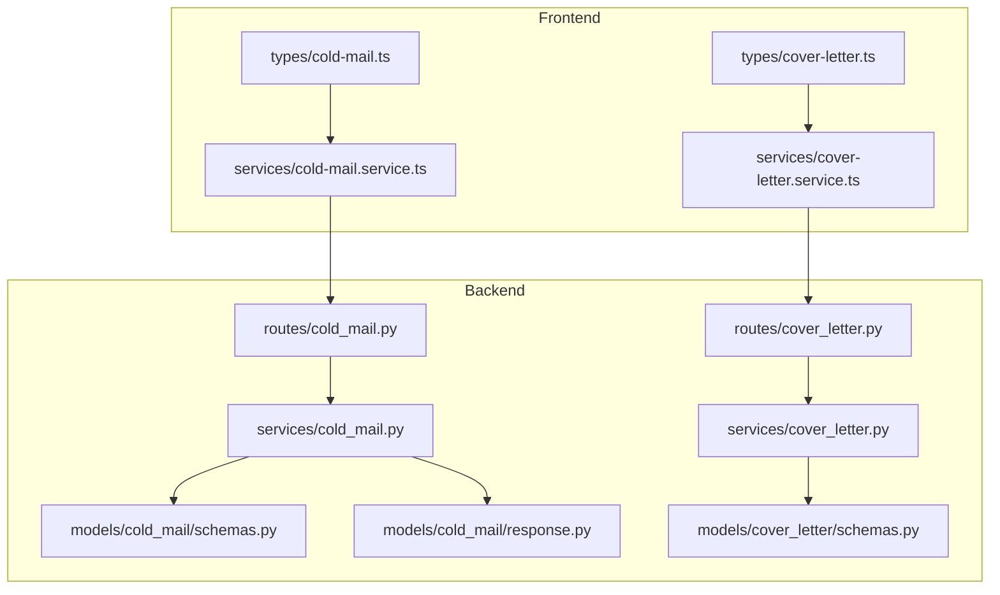
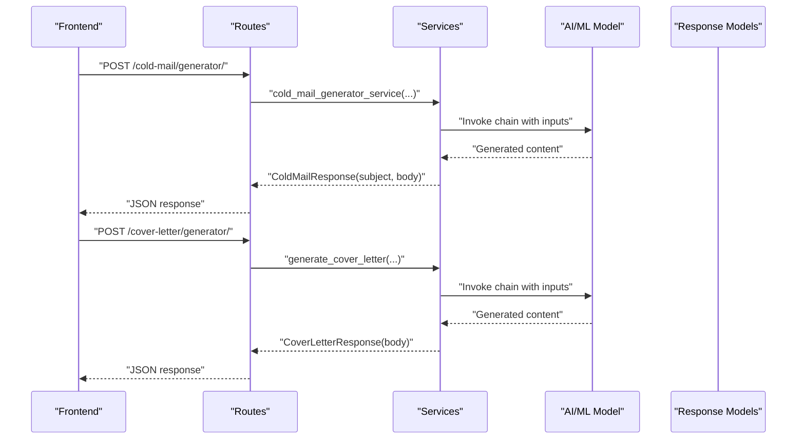
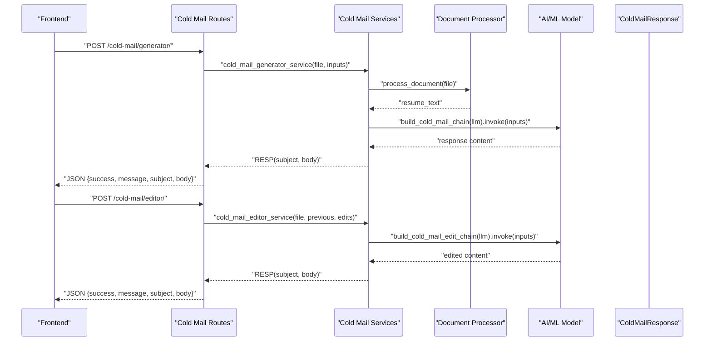
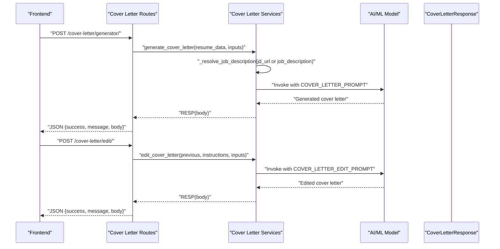
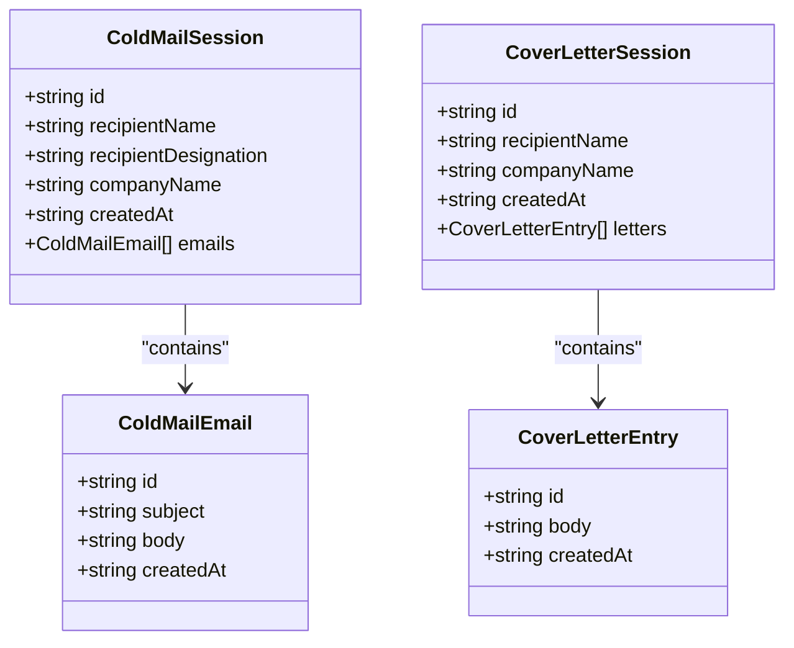
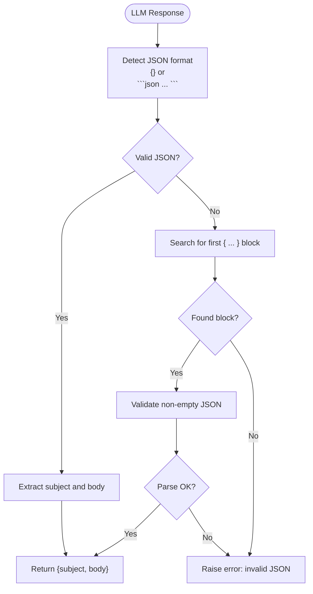
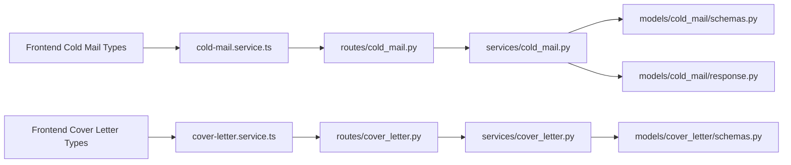

# Communication Records

<cite>
**Referenced Files in This Document**
- [request.py](file://backend/app/models/cold_mail/request.py)
- [response.py](file://backend/app/models/cold_mail/response.py)
- [schemas.py](file://backend/app/models/cold_mail/schemas.py)
- [types.py](file://backend/app/models/cold_mail/types.py)
- [schemas.py](file://backend/app/models/cover_letter/schemas.py)
- [cold_mail.py](file://backend/app/services/cold_mail.py)
- [cover_letter.py](file://backend/app/services/cover_letter.py)
- [cold_mail.py](file://backend/app/routes/cold_mail.py)
- [cover_letter.py](file://backend/app/routes/cover_letter.py)
- [cold-mail.ts](file://frontend/types/cold-mail.ts)
- [cover-letter.ts](file://frontend/types/cover-letter.ts)
- [cold-mail.service.ts](file://frontend/services/cold-mail.service.ts)
- [cover-letter.service.ts](file://frontend/services/cover-letter.service.ts)
</cite>

## Table of Contents
1. [Introduction](#introduction)
2. [Project Structure](#project-structure)
3. [Core Components](#core-components)
4. [Architecture Overview](#architecture-overview)
5. [Detailed Component Analysis](#detailed-component-analysis)
6. [Dependency Analysis](#dependency-analysis)
7. [Performance Considerations](#performance-considerations)
8. [Troubleshooting Guide](#troubleshooting-guide)
9. [Conclusion](#conclusion)
10. [Appendices](#appendices)

## Introduction
This document describes the Communication Records data models and workflows for cold email and cover letter generation. It covers request and response schemas, field definitions, relationships between requests and generated responses, JSON storage approaches for dynamic content, temporal tracking, workflow patterns, approval and versioning considerations, data retention, audit trails, compliance, and integration with AI/ML services.

## Project Structure
The communication record features are implemented across backend models, services, and routes, and surfaced to the frontend via typed interfaces and service clients.

**Diagram sources**
- [cold_mail.py](file://backend/app/routes/cold_mail.py#L1-L150)
- [cover_letter.py](file://backend/app/routes/cover_letter.py#L1-L103)
- [cold_mail.py](file://backend/app/services/cold_mail.py#L1-L540)
- [cover_letter.py](file://backend/app/services/cover_letter.py#L1-L254)
- [schemas.py](file://backend/app/models/cold_mail/schemas.py#L1-L52)
- [response.py](file://backend/app/models/cold_mail/response.py#L1-L10)
- [schemas.py](file://backend/app/models/cover_letter/schemas.py#L1-L33)
- [cold-mail.ts](file://frontend/types/cold-mail.ts#L1-L45)
- [cover-letter.ts](file://frontend/types/cover-letter.ts#L1-L39)
- [cold-mail.service.ts](file://frontend/services/cold-mail.service.ts#L1-L37)
- [cover-letter.service.ts](file://frontend/services/cover-letter.service.ts#L1-L34)

**Section sources**
- [cold_mail.py](file://backend/app/routes/cold_mail.py#L1-L150)
- [cover_letter.py](file://backend/app/routes/cover_letter.py#L1-L103)
- [cold_mail.py](file://backend/app/services/cold_mail.py#L1-L540)
- [cover_letter.py](file://backend/app/services/cover_letter.py#L1-L254)
- [schemas.py](file://backend/app/models/cold_mail/schemas.py#L1-L52)
- [response.py](file://backend/app/models/cold_mail/response.py#L1-L10)
- [schemas.py](file://backend/app/models/cover_letter/schemas.py#L1-L33)
- [cold-mail.ts](file://frontend/types/cold-mail.ts#L1-L45)
- [cover-letter.ts](file://frontend/types/cover-letter.ts#L1-L39)
- [cold-mail.service.ts](file://frontend/services/cold-mail.service.ts#L1-L37)
- [cover-letter.service.ts](file://frontend/services/cover-letter.service.ts#L1-L34)

## Core Components
This section documents the request and response models for cold email and cover letter workflows.

- ColdMailRequest
  - Purpose: Defines the input payload for generating cold emails.
  - Fields:
    - recipient_name: Name of the person being emailed.
    - recipient_designation: Designation of the recipient.
    - company_name: Company the recipient works for.
    - sender_name: Your name (sender).
    - sender_role_or_goal: Your primary goal or role you're interested in.
    - key_points_to_include: Key points or achievements to highlight.
    - additional_info_for_llm: Any other context for the LLM.
    - company_url: URL of the company for research (optional).
  - Notes: Validation enforces minimum lengths and optional URL handling.

- ColdMailResponse
  - Purpose: Standardized response for cold email generation.
  - Fields:
    - success: Boolean flag indicating success.
    - message: Human-readable status message.
    - subject: Generated email subject.
    - body: Generated email body.

- CoverLetterRequest
  - Purpose: Defines the input payload for cover letter generation.
  - Fields:
    - recipient_name: Optional recipient name.
    - company_name: Optional company name.
    - sender_name: Sender’s name (required).
    - sender_role_or_goal: Optional sender role or goal.
    - job_description: Job description text or content.
    - jd_url: Optional URL to fetch job description content.
    - key_points_to_include: Optional key points to highlight.
    - additional_info_for_llm: Optional additional context for the LLM.
    - company_url: Optional company URL for research.
    - language: Output language code (default "en").

- CoverLetterEditRequest
  - Purpose: Extends CoverLetterRequest for editing an existing cover letter.
  - Fields:
    - generated_cover_letter: Previous cover letter content to edit.
    - edit_instructions: Specific instructions for edits.

- CoverLetterResponse
  - Purpose: Standardized response for cover letter generation.
  - Fields:
    - success: Boolean flag indicating success.
    - message: Human-readable status message.
    - body: Generated cover letter content.

- Shared Types
  - types.py: Placeholder for shared types used across cold mail modules.

**Section sources**
- [request.py](file://backend/app/models/cold_mail/request.py#L1-L44)
- [response.py](file://backend/app/models/cold_mail/response.py#L1-L10)
- [schemas.py](file://backend/app/models/cold_mail/schemas.py#L1-L52)
- [types.py](file://backend/app/models/cold_mail/types.py#L1-L9)
- [schemas.py](file://backend/app/models/cover_letter/schemas.py#L1-L33)

## Architecture Overview
The system follows a request-response pattern with AI/ML integration. Requests are validated by Pydantic models, processed by service functions that orchestrate LLM chains, and returned as standardized response models. Frontend types mirror backend schemas for consistent client-server contracts.

**Diagram sources**
- [cold_mail.py](file://backend/app/routes/cold_mail.py#L13-L41)
- [cover_letter.py](file://backend/app/routes/cover_letter.py#L16-L56)
- [cold_mail.py](file://backend/app/services/cold_mail.py#L250-L340)
- [cover_letter.py](file://backend/app/services/cover_letter.py#L138-L171)
- [response.py](file://backend/app/models/cold_mail/response.py#L5-L10)
- [schemas.py](file://backend/app/models/cover_letter/schemas.py#L27-L33)

## Detailed Component Analysis

### Cold Email Workflow
- Request pattern
  - File-based and text-based endpoints accept form-encoded inputs and optional resume files.
  - Inputs include recipient, sender, company, key points, optional URLs, and additional context.
  - Services validate and process documents, optionally reformatting resume text via LLM.

- Content generation
  - Services invoke LLM chains to produce structured content.
  - Responses are parsed from raw LLM output, supporting JSON blocks and free-form text with embedded JSON.

- Editing workflow
  - Separate endpoints allow editing previously generated content with explicit instructions.

**Diagram sources**
- [cold_mail.py](file://backend/app/routes/cold_mail.py#L13-L78)
- [cold_mail.py](file://backend/app/services/cold_mail.py#L250-L340)
- [cold_mail.py](file://backend/app/services/cold_mail.py#L343-L440)
- [response.py](file://backend/app/models/cold_mail/response.py#L5-L10)

**Section sources**
- [cold_mail.py](file://backend/app/routes/cold_mail.py#L1-L150)
- [cold_mail.py](file://backend/app/services/cold_mail.py#L1-L540)
- [request.py](file://backend/app/models/cold_mail/request.py#L1-L44)
- [schemas.py](file://backend/app/models/cold_mail/schemas.py#L1-L52)
- [response.py](file://backend/app/models/cold_mail/response.py#L1-L10)

### Cover Letter Workflow
- Request pattern
  - Accepts resume text, recipient/company details, job description (or URL), key points, additional info, optional company URL, and language preference.
  - Supports editing an existing cover letter with explicit instructions.

- Content generation
  - Uses curated prompts to guide the LLM to produce concise, professional content aligned with the job description and resume.
  - Resolves job description from URL or manual text, combining both when provided.

**Diagram sources**
- [cover_letter.py](file://backend/app/routes/cover_letter.py#L16-L102)
- [cover_letter.py](file://backend/app/services/cover_letter.py#L12-L31)
- [cover_letter.py](file://backend/app/services/cover_letter.py#L138-L171)
- [cover_letter.py](file://backend/app/services/cover_letter.py#L174-L211)
- [schemas.py](file://backend/app/models/cover_letter/schemas.py#L27-L33)

**Section sources**
- [cover_letter.py](file://backend/app/routes/cover_letter.py#L1-L103)
- [cover_letter.py](file://backend/app/services/cover_letter.py#L1-L254)
- [schemas.py](file://backend/app/models/cover_letter/schemas.py#L1-L33)

### Data Models and Field Definitions
- ColdMailRequest
  - recipient_name: Required, min length enforced.
  - recipient_designation: Required, min length enforced.
  - company_name: Required, min length enforced.
  - sender_name: Required, min length enforced.
  - sender_role_or_goal: Required, min length enforced.
  - key_points_to_include: Required, min length enforced.
  - additional_info_for_llm: Optional string.
  - company_url: Optional URL string.

- ColdMailResponse
  - success: Boolean default true.
  - message: String default success message.
  - subject: Generated subject.
  - body: Generated body.

- CoverLetterRequest
  - recipient_name: Optional string.
  - company_name: Optional string.
  - sender_name: Required, min length enforced.
  - sender_role_or_goal: Optional string.
  - job_description: Optional string.
  - jd_url: Optional URL string.
  - key_points_to_include: Optional string.
  - additional_info_for_llm: Optional string.
  - company_url: Optional URL string.
  - language: Optional language code.

- CoverLetterEditRequest
  - Extends CoverLetterRequest with:
    - generated_cover_letter: Required string.
    - edit_instructions: Required string.

- CoverLetterResponse
  - success: Boolean default true.
  - message: String default success message.
  - body: Generated cover letter content.

**Section sources**
- [request.py](file://backend/app/models/cold_mail/request.py#L1-L44)
- [schemas.py](file://backend/app/models/cold_mail/schemas.py#L1-L52)
- [response.py](file://backend/app/models/cold_mail/response.py#L1-L10)
- [schemas.py](file://backend/app/models/cover_letter/schemas.py#L1-L33)

### Relationship Patterns and Foreign Keys
- Session and Record Entities
  - Frontend types define session and entry structures with identifiers and timestamps.
  - Sessions group related records (emails or letters) by recipient/company and creation time.
  - These structures indicate a logical parent-child relationship suitable for persistence modeling.

- Relationship Mapping
  - ColdMailSession contains multiple ColdMailEmail entries.
  - CoverLetterSession contains multiple CoverLetterEntry items.
  - Timestamps enable chronological ordering and auditability.

**Diagram sources**
- [cold-mail.ts](file://frontend/types/cold-mail.ts#L8-L15)
- [cold-mail.ts](file://frontend/types/cold-mail.ts#L1-L6)
- [cover-letter.ts](file://frontend/types/cover-letter.ts#L1-L13)

**Section sources**
- [cold-mail.ts](file://frontend/types/cold-mail.ts#L1-L45)
- [cover-letter.ts](file://frontend/types/cover-letter.ts#L1-L39)

### JSON Storage Approach for Dynamic Content
- Cold Email Generation
  - LLM responses are parsed for JSON blocks containing subject and body.
  - The service supports raw JSON, fenced JSON, and embedded JSON extraction.

- Cover Letter Generation
  - LLM output is plain text constrained by prompts; the service returns the generated body directly.

- Temporal Tracking
  - Frontend types include createdAt fields for sessions and entries.
  - Backend services can persist these timestamps alongside records.

**Diagram sources**
- [cold_mail.py](file://backend/app/services/cold_mail.py#L47-L118)
- [cold_mail.py](file://backend/app/services/cold_mail.py#L169-L238)

**Section sources**
- [cold_mail.py](file://backend/app/services/cold_mail.py#L1-L540)

### Workflow Patterns, Approval, and Version Management
- Workflow Pattern
  - File-based and text-based ingestion paths for cold emails.
  - Cover letter generation supports URL-based job description resolution.
  - Editing workflows preserve prior content and apply strict instructions.

- Approval and Versioning
  - Current implementation returns generated content without explicit approval steps.
  - Versioning is not implemented in the current code; however, the session-entry model supports version-like grouping by creation time.

- Recommendations
  - Add explicit approval flags and version fields in persistent models.
  - Track request/response pairs with correlation IDs for auditability.

**Section sources**
- [cold_mail.py](file://backend/app/routes/cold_mail.py#L1-L150)
- [cover_letter.py](file://backend/app/routes/cover_letter.py#L1-L103)
- [cold-mail.ts](file://frontend/types/cold-mail.ts#L1-L45)
- [cover-letter.ts](file://frontend/types/cover-letter.ts#L1-L39)

### Data Retention, Audit Trails, and Compliance
- Data Retention
  - Implement lifecycle policies for sessions and entries (e.g., auto-delete after X months).

- Audit Trails
  - Persist request metadata (inputs, timestamps) and response bodies.
  - Store correlation IDs linking requests to responses.

- Compliance
  - Ensure language preferences and content constraints align with export/import restrictions.
  - Consider data minimization and user consent for stored content.

[No sources needed since this section provides general guidance]

## Dependency Analysis
The backend composes routes → services → models, with AI/ML integration and optional document processing.

**Diagram sources**
- [cold-mail.service.ts](file://frontend/services/cold-mail.service.ts#L1-L37)
- [cover-letter.service.ts](file://frontend/services/cover-letter.service.ts#L1-L34)
- [cold_mail.py](file://backend/app/routes/cold_mail.py#L1-L150)
- [cover_letter.py](file://backend/app/routes/cover_letter.py#L1-L103)
- [cold_mail.py](file://backend/app/services/cold_mail.py#L1-L540)
- [cover_letter.py](file://backend/app/services/cover_letter.py#L1-L254)
- [schemas.py](file://backend/app/models/cold_mail/schemas.py#L1-L52)
- [response.py](file://backend/app/models/cold_mail/response.py#L1-L10)
- [schemas.py](file://backend/app/models/cover_letter/schemas.py#L1-L33)

**Section sources**
- [cold_mail.py](file://backend/app/routes/cold_mail.py#L1-L150)
- [cover_letter.py](file://backend/app/routes/cover_letter.py#L1-L103)
- [cold_mail.py](file://backend/app/services/cold_mail.py#L1-L540)
- [cover_letter.py](file://backend/app/services/cover_letter.py#L1-L254)
- [schemas.py](file://backend/app/models/cold_mail/schemas.py#L1-L52)
- [response.py](file://backend/app/models/cold_mail/response.py#L1-L10)
- [schemas.py](file://backend/app/models/cover_letter/schemas.py#L1-L33)
- [cold-mail.service.ts](file://frontend/services/cold-mail.service.ts#L1-L37)
- [cover-letter.service.ts](file://frontend/services/cover-letter.service.ts#L1-L34)

## Performance Considerations
- LLM Invocation
  - Batch or cache repeated prompts where feasible.
  - Limit prompt sizes and enforce max word counts to reduce latency.

- Document Processing
  - Avoid unnecessary reformatting for plain text or markdown inputs.
  - Stream file uploads to reduce memory overhead.

- Response Parsing
  - Short-circuit invalid JSON detection to minimize retries.

[No sources needed since this section provides general guidance]

## Troubleshooting Guide
- JSON Parsing Failures
  - Symptoms: Errors indicating invalid or missing JSON in LLM responses.
  - Actions: Verify prompt formatting, ensure fenced JSON blocks when expected, and validate extracted substrings.

- Unsupported File Types
  - Symptoms: Errors during resume processing.
  - Actions: Confirm supported extensions and content types; handle fallbacks gracefully.

- Company Research Failures
  - Symptoms: Empty or partial company research data.
  - Actions: Validate URLs and network connectivity; implement retry logic.

- Route and Service Errors
  - Symptoms: HTTP exceptions raised by services.
  - Actions: Inspect request payloads, LLM availability, and error details returned by services.

**Section sources**
- [cold_mail.py](file://backend/app/services/cold_mail.py#L55-L118)
- [cold_mail.py](file://backend/app/services/cold_mail.py#L177-L238)
- [cold_mail.py](file://backend/app/services/cold_mail.py#L283-L307)
- [cold_mail.py](file://backend/app/services/cold_mail.py#L378-L402)

## Conclusion
The Communication Records subsystem provides robust request-response schemas for cold email and cover letter generation, integrates with AI/ML services, and exposes consistent models to the frontend. While current implementations focus on generation and editing, extending with approval, versioning, retention, and audit capabilities will strengthen operational and compliance readiness.

## Appendices
- Frontend Contracts
  - Cold Mail: Session and entry types with timestamps and optional identifiers.
  - Cover Letter: Session and entry types mirroring the cold mail structure.

**Section sources**
- [cold-mail.ts](file://frontend/types/cold-mail.ts#L1-L45)
- [cover-letter.ts](file://frontend/types/cover-letter.ts#L1-L39)
- [cold-mail.service.ts](file://frontend/services/cold-mail.service.ts#L1-L37)
- [cover-letter.service.ts](file://frontend/services/cover-letter.service.ts#L1-L34)