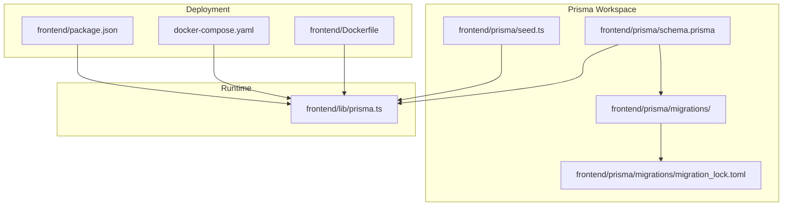
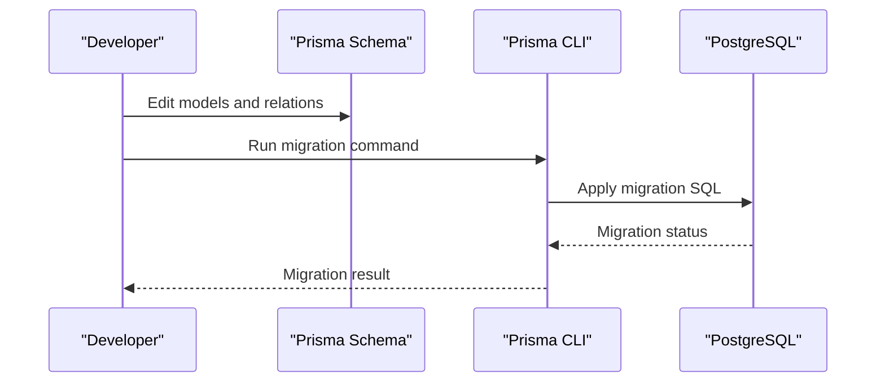
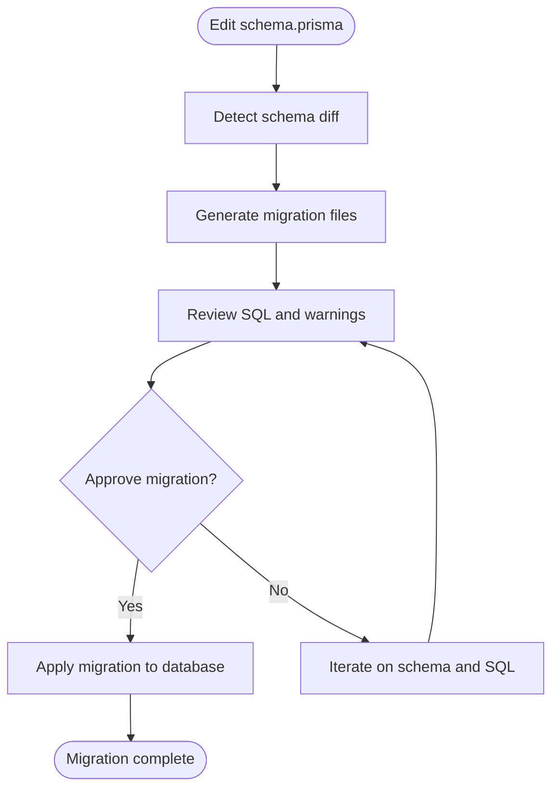
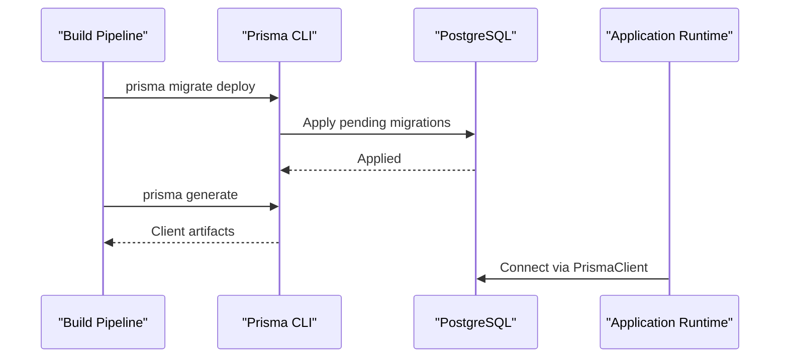
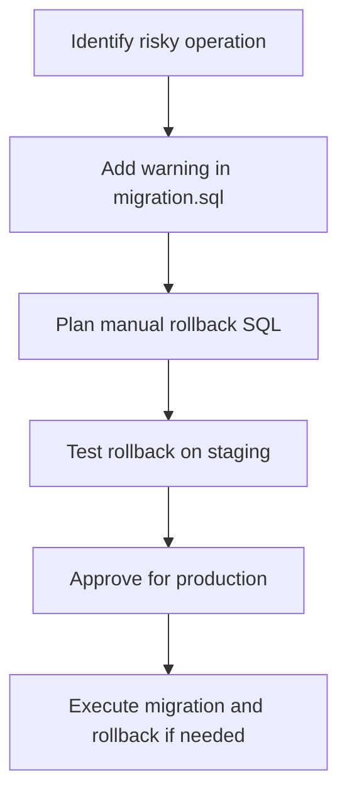
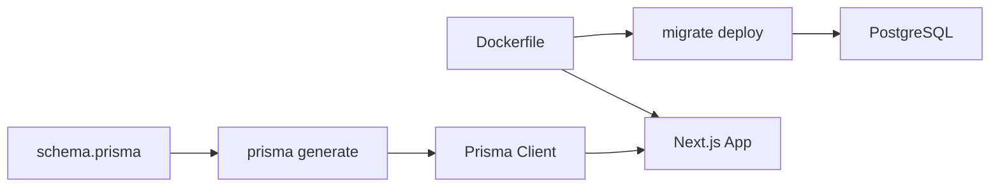

# Data Migration Strategy

<cite>
**Referenced Files in This Document**
- [schema.prisma](file://frontend/prisma/schema.prisma)
- [migration_lock.toml](file://frontend/prisma/migrations/migration_lock.toml)
- [20250612211318_init/migration.sql](file://frontend/prisma/migrations/20250612211318_init/migration.sql)
- [20250613172024_replace_file_url_with_raw_text/migration.sql](file://frontend/prisma/migrations/20250613172024_replace_file_url_with_raw_text/migration.sql)
- [20250730160233_add_new_resume_fields/migration.sql](file://frontend/prisma/migrations/20250730160233_add_new_resume_fields/migration.sql)
- [20251023102445_add_analysis_social_links/migration.sql](file://frontend/prisma/migrations/20251023102445_add_analysis_social_links/migration.sql)
- [20251114000000_add_llm_config/migration.sql](file://frontend/prisma/migrations/20251114000000_add_llm_config/migration.sql)
- [20260214000000_multi_llm_configs/migration.sql](file://frontend/prisma/migrations/20260214000000_multi_llm_configs/migration.sql)
- [20260222132919_add_resume_source_hierarchy_and_analysis_updated_at/migration.sql](file://frontend/prisma/migrations/20260222132919_add_resume_source_hierarchy_and_analysis_updated_at/migration.sql)
- [seed.ts](file://frontend/prisma/seed.ts)
- [prisma.ts](file://frontend/lib/prisma.ts)
- [Dockerfile](file://frontend/Dockerfile)
- [docker-compose.yaml](file://docker-compose.yaml)
- [package.json](file://frontend/package.json)
</cite>

## Table of Contents
1. [Introduction](#introduction)
2. [Project Structure](#project-structure)
3. [Core Components](#core-components)
4. [Architecture Overview](#architecture-overview)
5. [Detailed Component Analysis](#detailed-component-analysis)
6. [Dependency Analysis](#dependency-analysis)
7. [Performance Considerations](#performance-considerations)
8. [Troubleshooting Guide](#troubleshooting-guide)
9. [Conclusion](#conclusion)
10. [Appendices](#appendices)

## Introduction
This document describes the Data Migration Strategy for TalentSync-Normies using Prisma Migrate. It covers migration file structure, naming conventions, version control integration, execution and rollback procedures, data preservation strategies, and production deployment practices. It also documents migration history tracking, conflict resolution, team collaboration workflows, backward compatibility, data transformation patterns, CI/CD integration, automated testing, and operational monitoring.

## Project Structure
TalentSync-Normies organizes Prisma schema and migrations under the frontend workspace. The schema defines the data model, while migrations are stored as dated directories containing SQL statements. A lock file ensures migration state integrity, and seed scripts initialize baseline data.

**Diagram sources**
- [schema.prisma](file://frontend/prisma/schema.prisma#L1-L262)
- [migration_lock.toml](file://frontend/prisma/migrations/migration_lock.toml#L1-L4)
- [prisma.ts](file://frontend/lib/prisma.ts#L1-L10)
- [Dockerfile](file://frontend/Dockerfile#L69-L79)
- [docker-compose.yaml](file://docker-compose.yaml#L62-L62)
- [package.json](file://frontend/package.json#L1-L20)

**Section sources**
- [schema.prisma](file://frontend/prisma/schema.prisma#L1-L262)
- [migration_lock.toml](file://frontend/prisma/migrations/migration_lock.toml#L1-L4)
- [prisma.ts](file://frontend/lib/prisma.ts#L1-L10)
- [Dockerfile](file://frontend/Dockerfile#L69-L79)
- [docker-compose.yaml](file://docker-compose.yaml#L62-L62)
- [package.json](file://frontend/package.json#L1-L20)

## Core Components
- Prisma Schema: Defines models, relations, indexes, and constraints. It is the single source of truth for database structure.
- Migrations: Versioned SQL scripts organized by timestamped folders. Each migration encapsulates a discrete change to the schema.
- Migration Lock: Tracks the provider and prevents concurrent migration runs.
- Seed: Initializes baseline data after migrations are applied.
- Runtime Client: Provides a singleton PrismaClient instance for application code.
- Deployment: Applies migrations at container startup via Prisma CLI commands.

Key responsibilities:
- Schema evolution through declarative modeling.
- Idempotent and reversible migration execution.
- Safe seeding and data integrity guarantees.
- Production-safe deployment with explicit migration steps.

**Section sources**
- [schema.prisma](file://frontend/prisma/schema.prisma#L1-L262)
- [migration_lock.toml](file://frontend/prisma/migrations/migration_lock.toml#L1-L4)
- [seed.ts](file://frontend/prisma/seed.ts#L1-L30)
- [prisma.ts](file://frontend/lib/prisma.ts#L1-L10)
- [Dockerfile](file://frontend/Dockerfile#L69-L79)

## Architecture Overview
The migration lifecycle integrates development-time schema changes with production-safe deployment. The schema drives migration generation; migrations are applied at build/runtime; seeds populate initial data; and the client connects to the database.

**Diagram sources**
- [schema.prisma](file://frontend/prisma/schema.prisma#L1-L262)
- [20250612211318_init/migration.sql](file://frontend/prisma/migrations/20250612211318_init/migration.sql#L1-L187)
- [20250613172024_replace_file_url_with_raw_text/migration.sql](file://frontend/prisma/migrations/20250613172024_replace_file_url_with_raw_text/migration.sql#L1-L96)

## Detailed Component Analysis

### Migration File Structure and Naming Conventions
- Directory naming: Timestamp-based folders enforce chronological ordering and uniqueness.
- SQL files: Each migration contains a single migration.sql file with CREATE/ALTER/DROP statements and indexes/constraints.
- Comments: Warnings and notes indicate destructive changes and required columns.
- Provider lock: migration_lock.toml records the provider to prevent mismatches.

Examples of migration structure:
- Initial schema creation with tables, indexes, and foreign keys.
- Column alterations with warnings and new table creation.
- Index and constraint adjustments for performance and uniqueness.

Best practices:
- Keep each migration focused on a single logical change.
- Use descriptive migration names in filenames and comments.
- Preserve backward compatibility where possible; otherwise, document breaking changes.

**Section sources**
- [migration_lock.toml](file://frontend/prisma/migrations/migration_lock.toml#L1-L4)
- [20250612211318_init/migration.sql](file://frontend/prisma/migrations/20250612211318_init/migration.sql#L1-L187)
- [20250613172024_replace_file_url_with_raw_text/migration.sql](file://frontend/prisma/migrations/20250613172024_replace_file_url_with_raw_text/migration.sql#L1-L96)
- [20250730160233_add_new_resume_fields/migration.sql](file://frontend/prisma/migrations/20250730160233_add_new_resume_fields/migration.sql#L1-L6)
- [20251114000000_add_llm_config/migration.sql](file://frontend/prisma/migrations/20251114000000_add_llm_config/migration.sql#L1-L27)
- [20260214000000_multi_llm_configs/migration.sql](file://frontend/prisma/migrations/20260214000000_multi_llm_configs/migration.sql#L1-L19)
- [20260222132919_add_resume_source_hierarchy_and_analysis_updated_at/migration.sql](file://frontend/prisma/migrations/20260222132919_add_resume_source_hierarchy_and_analysis_updated_at/migration.sql#L1-L48)

### Relationship Between Schema Changes and Migration Generation
- Declarative schema: Changes to schema.prisma trigger migration generation.
- Automatic creation: Prisma CLI creates timestamped migration directories with SQL statements.
- Manual intervention: Review and refine generated SQL for safety, indexes, and constraints.

**Diagram sources**
- [schema.prisma](file://frontend/prisma/schema.prisma#L1-L262)
- [20250612211318_init/migration.sql](file://frontend/prisma/migrations/20250612211318_init/migration.sql#L1-L187)
- [20250613172024_replace_file_url_with_raw_text/migration.sql](file://frontend/prisma/migrations/20250613172024_replace_file_url_with_raw_text/migration.sql#L1-L96)

### Migration Execution Process
- Development: Use migrate dev to apply migrations locally and keep them in sync with the schema.
- Production: Use migrate deploy to apply pending migrations without interactive prompts.
- Build-time: Prisma generate produces client code reflecting the current schema.
- Seeding: Seed script runs after migrations to populate baseline data.

**Diagram sources**
- [Dockerfile](file://frontend/Dockerfile#L69-L79)
- [docker-compose.yaml](file://docker-compose.yaml#L62-L62)
- [prisma.ts](file://frontend/lib/prisma.ts#L1-L10)

**Section sources**
- [Dockerfile](file://frontend/Dockerfile#L69-L79)
- [docker-compose.yaml](file://docker-compose.yaml#L62-L62)
- [prisma.ts](file://frontend/lib/prisma.ts#L1-L10)

### Rollback Procedures and Data Preservation Strategies
- Rollbacks: Prisma Migrate does not automatically generate rollback scripts. Plan manual rollbacks by writing reverse SQL or using database-native capabilities.
- Data preservation: Use ALTER TABLE with careful column additions, defaults, and nullable changes. Avoid dropping columns without prior data extraction or archival.
- Safety checks: Validate indexes and constraints before applying. Use warnings in migration SQL to highlight risky operations.

**Diagram sources**
- [20250613172024_replace_file_url_with_raw_text/migration.sql](file://frontend/prisma/migrations/20250613172024_replace_file_url_with_raw_text/migration.sql#L1-L96)

**Section sources**
- [20250613172024_replace_file_url_with_raw_text/migration.sql](file://frontend/prisma/migrations/20250613172024_replace_file_url_with_raw_text/migration.sql#L1-L96)

### Migration History Tracking and Conflict Resolution
- History: Migrations are tracked by timestamped directories and applied in order.
- Conflicts: If two developers modify the schema concurrently, resolve conflicts by merging changes, regenerating migrations, and re-applying in the correct order.
- Lock: migration_lock.toml prevents provider mismatches and supports reproducible environments.

**Section sources**
- [migration_lock.toml](file://frontend/prisma/migrations/migration_lock.toml#L1-L4)

### Team Collaboration Workflows
- Branching: Each developer works on schema changes in feature branches; generate and review migrations locally.
- Pull requests: Include migration diffs; reviewers validate SQL correctness and data safety.
- CI/CD: Automated pipelines apply migrations and run tests against the migrated schema.

[No sources needed since this section provides general guidance]

### Backward Compatibility and Data Transformation Patterns
- Backward compatibility: Prefer additive schema changes (new columns, tables) and avoid breaking changes to existing APIs.
- Data transformations: Use migration SQL to transform data (e.g., moving from file URLs to raw text). Ensure transformations are idempotent and reversible.

**Section sources**
- [20250613172024_replace_file_url_with_raw_text/migration.sql](file://frontend/prisma/migrations/20250613172024_replace_file_url_with_raw_text/migration.sql#L1-L96)
- [20250730160233_add_new_resume_fields/migration.sql](file://frontend/prisma/migrations/20250730160233_add_new_resume_fields/migration.sql#L1-L6)
- [20260222132919_add_resume_source_hierarchy_and_analysis_updated_at/migration.sql](file://frontend/prisma/migrations/20260222132919_add_resume_source_hierarchy_and_analysis_updated_at/migration.sql#L1-L48)

### Zero-Downtime Migrations and Production Deployment
- Strategy: Use online-friendly changes (non-blocking DDL) and minimize exclusive locks. Batch large data transformations.
- Deployment: Use migrate deploy in production containers. Avoid interactive prompts; rely on CI/CD orchestration.

**Section sources**
- [Dockerfile](file://frontend/Dockerfile#L69-L79)
- [docker-compose.yaml](file://docker-compose.yaml#L62-L62)

### CI/CD Integration and Automated Testing
- CI: Apply migrations and run tests against the migrated schema. Use prisma migrate deploy in pipeline steps.
- Testing: Seed test databases with seed.ts to mirror production-like data for integration tests.
- Package scripts: Use migrate:deploy script to standardize deployment commands.

**Section sources**
- [seed.ts](file://frontend/prisma/seed.ts#L1-L30)
- [package.json](file://frontend/package.json#L1-L20)

## Dependency Analysis
The runtime PrismaClient depends on the generated client and the database schema. Deployment stages depend on Prisma CLI for migrations and on the built Next.js application for serving.

**Diagram sources**
- [schema.prisma](file://frontend/prisma/schema.prisma#L1-L262)
- [Dockerfile](file://frontend/Dockerfile#L69-L79)
- [prisma.ts](file://frontend/lib/prisma.ts#L1-L10)

**Section sources**
- [schema.prisma](file://frontend/prisma/schema.prisma#L1-L262)
- [Dockerfile](file://frontend/Dockerfile#L69-L79)
- [prisma.ts](file://frontend/lib/prisma.ts#L1-L10)

## Performance Considerations
- Large migrations: Break into smaller, incremental steps; add indexes after data loads; avoid long-running transactions.
- Indexes: Create indexes in separate migrations to reduce downtime.
- Monitoring: Track migration duration and errors; alert on failures.

[No sources needed since this section provides general guidance]

## Troubleshooting Guide
Common issues and resolutions:
- Migration lock conflicts: Ensure migration_lock.toml is committed and provider matches the target environment.
- Provider mismatch: Verify DATABASE_URL and provider in schema.prisma.
- Stuck migrations: Re-run migrate deploy; check for partial application and resolve manually.
- Seed failures: Validate seed.ts logic and database connectivity; run seed after successful migrations.

**Section sources**
- [migration_lock.toml](file://frontend/prisma/migrations/migration_lock.toml#L1-L4)
- [schema.prisma](file://frontend/prisma/schema.prisma#L1-L10)
- [seed.ts](file://frontend/prisma/seed.ts#L1-L30)

## Conclusion
TalentSync-Normies employs a disciplined Prisma Migrate strategy: declarative schema modeling, timestamped migrations, explicit lock management, and production-safe deployment via migrate deploy. By following the outlined practices—careful schema changes, thorough testing, collaborative reviews, and robust CI/CD—teams can maintain data integrity, minimize downtime, and scale confidently.

[No sources needed since this section summarizes without analyzing specific files]

## Appendices

### Migration Execution Reference
- Development: prisma migrate dev
- Production: prisma migrate deploy
- Client generation: prisma generate
- Seeding: bun run seed

**Section sources**
- [Dockerfile](file://frontend/Dockerfile#L69-L79)
- [package.json](file://frontend/package.json#L1-L20)
- [seed.ts](file://frontend/prisma/seed.ts#L1-L30)