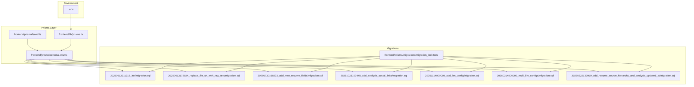
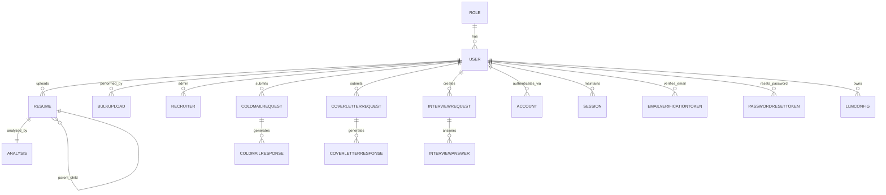
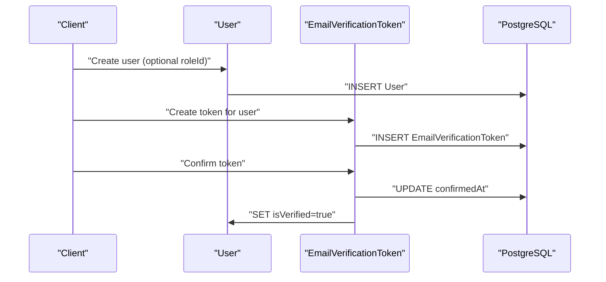
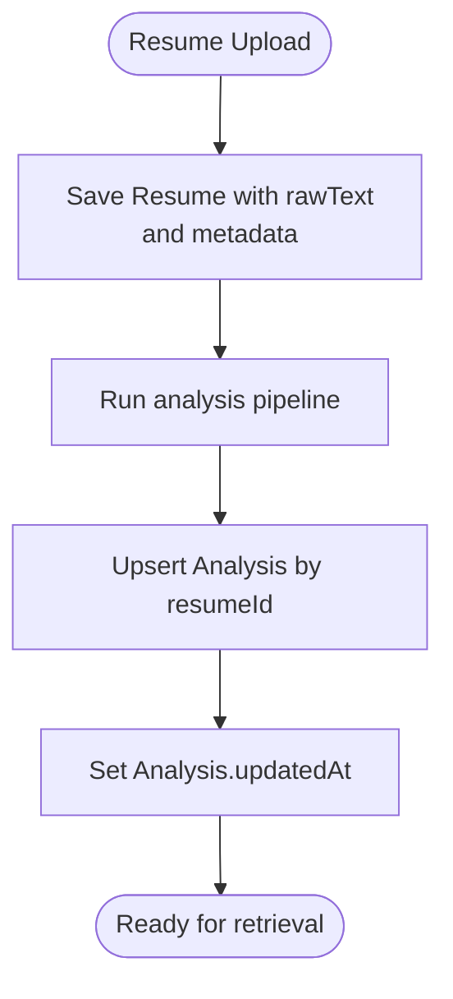
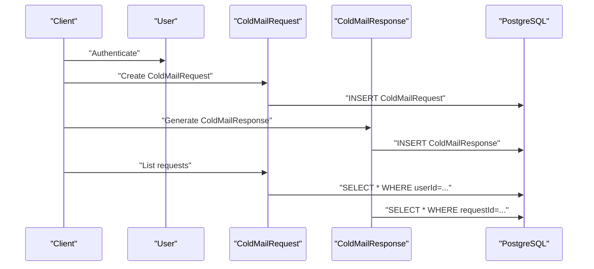
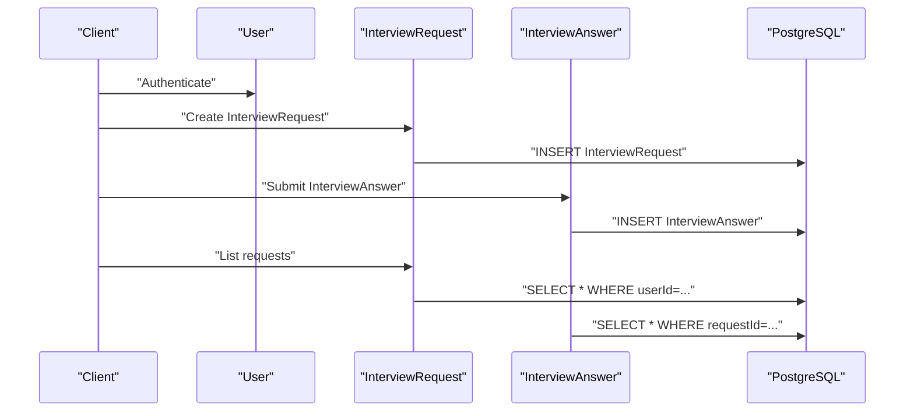
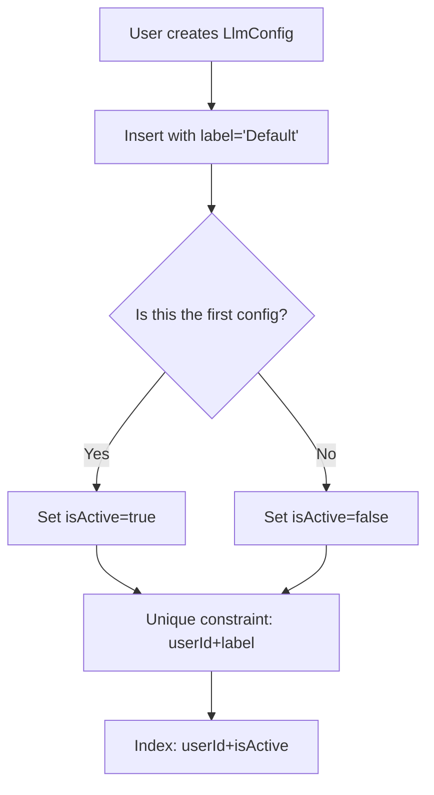
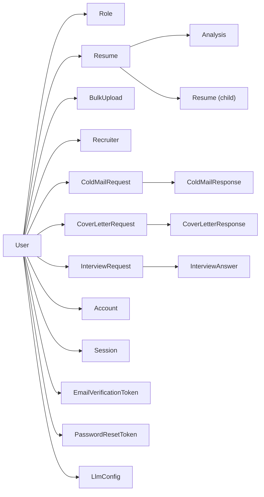

# Database Design

<cite>
**Referenced Files in This Document**
- [schema.prisma](file://frontend/prisma/schema.prisma)
- [20250612211318_init/migration.sql](file://frontend/prisma/migrations/20250612211318_init/migration.sql)
- [20250613172024_replace_file_url_with_raw_text/migration.sql](file://frontend/prisma/migrations/20250613172024_replace_file_url_with_raw_text/migration.sql)
- [20250730160233_add_new_resume_fields/migration.sql](file://frontend/prisma/migrations/20250730160233_add_new_resume_fields/migration.sql)
- [20251023102445_add_analysis_social_links/migration.sql](file://frontend/prisma/migrations/20251023102445_add_analysis_social_links/migration.sql)
- [20251114000000_add_llm_config/migration.sql](file://frontend/prisma/migrations/20251114000000_add_llm_config/migration.sql)
- [20260214000000_multi_llm_configs/migration.sql](file://frontend/prisma/migrations/20260214000000_multi_llm_configs/migration.sql)
- [20260222132919_add_resume_source_hierarchy_and_analysis_updated_at/migration.sql](file://frontend/prisma/migrations/20260222132919_add_resume_source_hierarchy_and_analysis_updated_at/migration.sql)
- [migration_lock.toml](file://frontend/prisma/migrations/migration_lock.toml)
- [seed.ts](file://frontend/prisma/seed.ts)
- [prisma.ts](file://frontend/lib/prisma.ts)
- [.env](file://frontend/.env)
</cite>

## Table of Contents
1. [Introduction](#introduction)
2. [Project Structure](#project-structure)
3. [Core Components](#core-components)
4. [Architecture Overview](#architecture-overview)
5. [Detailed Component Analysis](#detailed-component-analysis)
6. [Dependency Analysis](#dependency-analysis)
7. [Performance Considerations](#performance-considerations)
8. [Troubleshooting Guide](#troubleshooting-guide)
9. [Conclusion](#conclusion)
10. [Appendices](#appendices)

## Introduction
This document describes the PostgreSQL database design for TalentSync-Normies, implemented with Prisma ORM. It covers entity relationships, field definitions, data types, primary and foreign keys, indexes, and constraints. It also documents validation and business rules enforced at the database level, schema diagrams, sample data structures, data access patterns via Prisma, caching strategies, performance considerations, data lifecycle and retention, migration paths with Prisma Migrate, version management, rollback procedures, and security and access control through database permissions.

## Project Structure
The database schema is defined declaratively in Prisma and maintained through a series of SQL migrations. The runtime Prisma client is initialized in the frontend application.

**Diagram sources**
- [schema.prisma](file://frontend/prisma/schema.prisma#L1-L262)
- [20250612211318_init/migration.sql](file://frontend/prisma/migrations/20250612211318_init/migration.sql#L1-L187)
- [20250613172024_replace_file_url_with_raw_text/migration.sql](file://frontend/prisma/migrations/20250613172024_replace_file_url_with_raw_text/migration.sql#L1-L96)
- [20250730160233_add_new_resume_fields/migration.sql](file://frontend/prisma/migrations/20250730160233_add_new_resume_fields/migration.sql#L1-L6)
- [20251023102445_add_analysis_social_links/migration.sql](file://frontend/prisma/migrations/20251023102445_add_analysis_social_links/migration.sql#L1-L6)
- [20251114000000_add_llm_config/migration.sql](file://frontend/prisma/migrations/20251114000000_add_llm_config/migration.sql#L1-L27)
- [20260214000000_multi_llm_configs/migration.sql](file://frontend/prisma/migrations/20260214000000_multi_llm_configs/migration.sql#L1-L19)
- [20260222132919_add_resume_source_hierarchy_and_analysis_updated_at/migration.sql](file://frontend/prisma/migrations/20260222132919_add_resume_source_hierarchy_and_analysis_updated_at/migration.sql#L1-L48)
- [migration_lock.toml](file://frontend/prisma/migrations/migration_lock.toml#L1-L100)
- [seed.ts](file://frontend/prisma/seed.ts#L1-L30)
- [prisma.ts](file://frontend/lib/prisma.ts#L1-L10)
- [.env](file://frontend/.env#L1-L27)

**Section sources**
- [schema.prisma](file://frontend/prisma/schema.prisma#L1-L262)
- [prisma.ts](file://frontend/lib/prisma.ts#L1-L10)
- [seed.ts](file://frontend/prisma/seed.ts#L1-L30)
- [.env](file://frontend/.env#L1-L27)

## Core Components
This section documents the core entities and their attributes, primary keys, foreign keys, indexes, and constraints as defined in the Prisma schema and migrations.

- Role
  - Fields: id (String, UUID), name (String, unique)
  - Primary key: id
  - Unique index: name
  - Relations: Users (1..N)

- User
  - Fields: id (String, cuid), name (String?), email (String?, unique), emailVerified (DateTime?), image (String?), passwordHash (String?), isVerified (Boolean, default false), roleId (String?)
  - Primary key: id
  - Unique index: email
  - Relations: Role (N..1), Roles (1..N), LlmConfigs (1..N), Accounts (1..1), Sessions (1..1), EmailVerificationTokens (1..N), PasswordResetTokens (1..N), Recruiter (0..1), Resumes (1..N), BulkUploads (1..N), ColdMailRequests (1..N), CoverLetterRequests (1..N), InterviewRequests (1..N)
  - Constraints: roleId references Role(id) with SET NULL on delete

- LlmConfig
  - Fields: id (String, cuid), userId (String), label (String, default "Default"), provider (String, default "google"), model (String, default "gemini-2.5-flash"), encryptedKey (String?), apiBase (String?), isActive (Boolean, default false), createdAt (DateTime, default now), updatedAt (DateTime, default now + updatedAt)
  - Primary key: id
  - Unique index: userId + label
  - Index: userId + isActive
  - Relations: User (N..1)
  - Constraints: userId references User(id) with CASCADE on delete

- EmailVerificationToken
  - Fields: id (String, uuid), token (String, unique), expiresAt (DateTime), userId (String), createdAt (DateTime, default now), confirmedAt (DateTime?)
  - Primary key: id
  - Unique index: token
  - Relations: User (N..1)
  - Constraints: userId references User(id) with CASCADE on delete

- PasswordResetToken
  - Fields: id (String, uuid), token (String, unique), expiresAt (DateTime), userId (String), createdAt (DateTime, default now), usedAt (DateTime?)
  - Primary key: id
  - Unique index: token
  - Relations: User (N..1)
  - Constraints: userId references User(id) with CASCADE on delete

- Resume
  - Fields: id (String, uuid), userId (String), customName (String), rawText (String, Text), uploadDate (DateTime, default now), showInCentral (Boolean, default false), source (String, default "UPLOADED"), isMaster (Boolean, default false), parentId (String?)
  - Primary key: id
  - Index: userId + isMaster
  - Relations: User (N..1), Analysis (0..1), Resume (0..1 parent), Resume (1..N children)
  - Constraints: userId references User(id) with CASCADE on delete; parentId references Resume(id) with SET NULL on delete

- Analysis
  - Fields: id (String, uuid), resumeId (String, unique), name (String?), email (String?), contact (String?), linkedin (String?), github (String?), blog (String?), portfolio (String?), predictedField (String?), skillsAnalysis (Json?), recommendedRoles (String[]), languages (Json?), education (Json?), workExperience (Json?), projects (Json?), publications (Json?), positionsOfResponsibility (Json?), certifications (Json?), achievements (Json?), uploadedAt (DateTime, default now), updatedAt (DateTime, default now + updatedAt)
  - Primary key: id
  - Unique index: resumeId
  - Relations: Resume (N..1)
  - Constraints: resumeId references Resume(id) with CASCADE on delete

- BulkUpload
  - Fields: id (String, uuid), adminId (String), fileUrl (String), totalFiles (Int), succeeded (Int, default 0), failed (Int, default 0), uploadedAt (DateTime, default now)
  - Primary key: id
  - Relations: User (N..1)
  - Constraints: adminId references User(id) with CASCADE on delete

- Recruiter
  - Fields: id (String, uuid), adminId (String, unique), email (String), companyName (String), createdAt (DateTime, default now)
  - Primary key: id
  - Unique index: adminId
  - Relations: User (N..1)
  - Constraints: adminId references User(id) with CASCADE on delete

- ColdMailRequest
  - Fields: id (String, uuid), userId (String), recipientName (String), recipientDesignation (String), companyName (String), senderName (String), senderRoleOrGoal (String), keyPoints (String), additionalInfo (String?), companyUrl (String?), createdAt (DateTime, default now)
  - Primary key: id
  - Relations: User (N..1), ColdMailResponses (1..N)
  - Constraints: userId references User(id) with CASCADE on delete

- ColdMailResponse
  - Fields: id (String, uuid), requestId (String), subject (String), body (String), createdAt (DateTime, default now)
  - Primary key: id
  - Relations: ColdMailRequest (N..1)
  - Constraints: requestId references ColdMailRequest(id) with CASCADE on delete

- CoverLetterRequest
  - Fields: id (String, uuid), userId (String), recipientName (String), companyName (String), senderName (String), senderRoleOrGoal (String?), jobDescription (String?), jdUrl (String?), keyPoints (String?), additionalInfo (String?), companyUrl (String?), createdAt (DateTime, default now)
  - Primary key: id
  - Relations: User (N..1), CoverLetterResponses (1..N)
  - Constraints: userId references User(id) with CASCADE on delete

- CoverLetterResponse
  - Fields: id (String, uuid), requestId (String), body (String?), createdAt (DateTime, default now)
  - Primary key: id
  - Relations: CoverLetterRequest (N..1)
  - Constraints: requestId references CoverLetterRequest(id) with CASCADE on delete

- InterviewRequest
  - Fields: id (String, uuid), userId (String), role (String), questions (Json), companyName (String), userKnowledge (String?), companyUrl (String?), wordLimit (Int), createdAt (DateTime, default now)
  - Primary key: id
  - Relations: User (N..1), InterviewAnswers (1..N)
  - Constraints: userId references User(id) with CASCADE on delete

- InterviewAnswer
  - Fields: id (String, uuid), requestId (String), question (String), answer (String), createdAt (DateTime, default now)
  - Primary key: id
  - Relations: InterviewRequest (N..1)
  - Constraints: requestId references InterviewRequest(id) with CASCADE on delete

- Account
  - Fields: id (String, cuid), userId (String), type (String), provider (String), providerAccountId (String), refresh_token (String?), access_token (String?), expires_at (Int?), token_type (String?), scope (String?), id_token (String?), session_state (String?)
  - Primary key: id
  - Unique index: provider + providerAccountId
  - Relations: User (N..1)
  - Constraints: userId references User(id) with CASCADE on delete

- Session
  - Fields: id (String, cuid), sessionToken (String, unique), userId (String), expires (DateTime)
  - Primary key: id
  - Unique index: sessionToken
  - Relations: User (N..1)
  - Constraints: userId references User(id) with CASCADE on delete

- VerificationToken
  - Fields: identifier (String), token (String, unique), expires (DateTime)
  - Primary key: (identifier, token)
  - Unique index: token
  - Constraints: composite primary key

**Section sources**
- [schema.prisma](file://frontend/prisma/schema.prisma#L10-L262)
- [20250612211318_init/migration.sql](file://frontend/prisma/migrations/20250612211318_init/migration.sql#L1-L187)
- [20250613172024_replace_file_url_with_raw_text/migration.sql](file://frontend/prisma/migrations/20250613172024_replace_file_url_with_raw_text/migration.sql#L1-L96)
- [20250730160233_add_new_resume_fields/migration.sql](file://frontend/prisma/migrations/20250730160233_add_new_resume_fields/migration.sql#L1-L6)
- [20251023102445_add_analysis_social_links/migration.sql](file://frontend/prisma/migrations/20251023102445_add_analysis_social_links/migration.sql#L1-L6)
- [20251114000000_add_llm_config/migration.sql](file://frontend/prisma/migrations/20251114000000_add_llm_config/migration.sql#L1-L27)
- [20260214000000_multi_llm_configs/migration.sql](file://frontend/prisma/migrations/20260214000000_multi_llm_configs/migration.sql#L1-L19)
- [20260222132919_add_resume_source_hierarchy_and_analysis_updated_at/migration.sql](file://frontend/prisma/migrations/20260222132919_add_resume_source_hierarchy_and_analysis_updated_at/migration.sql#L1-L48)

## Architecture Overview
The database architecture centers around a central User entity with multiple associated entities for resumes, analysis, communications, interviews, and identity/access management. Prisma enforces referential integrity and indexes defined in the schema and migrations.

**Diagram sources**
- [schema.prisma](file://frontend/prisma/schema.prisma#L10-L262)
- [20250612211318_init/migration.sql](file://frontend/prisma/migrations/20250612211318_init/migration.sql#L1-L187)
- [20250613172024_replace_file_url_with_raw_text/migration.sql](file://frontend/prisma/migrations/20250613172024_replace_file_url_with_raw_text/migration.sql#L1-L96)
- [20260222132919_add_resume_source_hierarchy_and_analysis_updated_at/migration.sql](file://frontend/prisma/migrations/20260222132919_add_resume_source_hierarchy_and_analysis_updated_at/migration.sql#L1-L48)

## Detailed Component Analysis

### Users and Identity Management
- Purpose: Central identity and role management with OAuth support and session tokens.
- Key validations:
  - email is unique for local accounts.
  - Account/provider/providerAccountId is unique to prevent duplicate external logins.
  - Session.sessionToken is unique.
  - VerificationToken has a composite primary key (identifier, token).
- Business rules:
  - Users can be verified via EmailVerificationToken.
  - Password resets tracked via PasswordResetToken.
  - OAuth accounts stored in Account with provider-specific fields.

**Diagram sources**
- [schema.prisma](file://frontend/prisma/schema.prisma#L16-L41)
- [schema.prisma](file://frontend/prisma/schema.prisma#L61-L69)
- [20250613172024_replace_file_url_with_raw_text/migration.sql](file://frontend/prisma/migrations/20250613172024_replace_file_url_with_raw_text/migration.sql#L23-L33)
- [20250613172024_replace_file_url_with_raw_text/migration.sql](file://frontend/prisma/migrations/20250613172024_replace_file_url_with_raw_text/migration.sql#L35-L61)
- [20250613172024_replace_file_url_with_raw_text/migration.sql](file://frontend/prisma/migrations/20250613172024_replace_file_url_with_raw_text/migration.sql#L63-L68)

**Section sources**
- [schema.prisma](file://frontend/prisma/schema.prisma#L16-L41)
- [schema.prisma](file://frontend/prisma/schema.prisma#L61-L69)
- [schema.prisma](file://frontend/prisma/schema.prisma#L228-L253)
- [schema.prisma](file://frontend/prisma/schema.prisma#L255-L261)
- [20250613172024_replace_file_url_with_raw_text/migration.sql](file://frontend/prisma/migrations/20250613172024_replace_file_url_with_raw_text/migration.sql#L23-L96)

### Resumes and Analysis
- Purpose: Store resume text, hierarchy, and structured analysis results.
- Key validations:
  - Resume.rawText is required.
  - Analysis.resumeId is unique and references Resume(id).
  - Resume.userId + isMaster indexed for quick lookup of master resumes.
  - Resume.parentId references Resume(id) with SET NULL on delete to support hierarchical tailoring.
- Business rules:
  - source defaults to "UPLOADED"; isMaster indicates canonical resume per user.
  - Analysis.updatedAt tracks last modification time.

**Diagram sources**
- [schema.prisma](file://frontend/prisma/schema.prisma#L81-L98)
- [schema.prisma](file://frontend/prisma/schema.prisma#L100-L125)
- [20260222132919_add_resume_source_hierarchy_and_analysis_updated_at/migration.sql](file://frontend/prisma/migrations/20260222132919_add_resume_source_hierarchy_and_analysis_updated_at/migration.sql#L1-L48)

**Section sources**
- [schema.prisma](file://frontend/prisma/schema.prisma#L81-L98)
- [schema.prisma](file://frontend/prisma/schema.prisma#L100-L125)
- [20260222132919_add_resume_source_hierarchy_and_analysis_updated_at/migration.sql](file://frontend/prisma/migrations/20260222132919_add_resume_source_hierarchy_and_analysis_updated_at/migration.sql#L1-L48)

### Communication Records (Cold Mail and Cover Letters)
- Purpose: Track generated emails and cover letters for candidates.
- Key validations:
  - Requests are owned by User; Responses link back to their Request.
  - Body fields are stored as text; subjects are stored as text.
- Business rules:
  - Requests capture recipient/company details and optional URLs.
  - Responses capture generated content and timestamps.

**Diagram sources**
- [schema.prisma](file://frontend/prisma/schema.prisma#L149-L174)
- [schema.prisma](file://frontend/prisma/schema.prisma#L166-L174)
- [schema.prisma](file://frontend/prisma/schema.prisma#L176-L201)
- [schema.prisma](file://frontend/prisma/schema.prisma#L194-L201)

**Section sources**
- [schema.prisma](file://frontend/prisma/schema.prisma#L149-L174)
- [schema.prisma](file://frontend/prisma/schema.prisma#L176-L201)
- [schema.prisma](file://frontend/prisma/schema.prisma#L166-L174)
- [schema.prisma](file://frontend/prisma/schema.prisma#L194-L201)

### Interviews
- Purpose: Manage interview setups and candidate answers.
- Key validations:
  - InterviewRequest.questions is JSON; InterviewAnswer stores question-answer pairs.
  - Word limit and company info captured for context.
- Business rules:
  - Answers are tied to a specific InterviewRequest.
  - Requests are owned by a User.

**Diagram sources**
- [schema.prisma](file://frontend/prisma/schema.prisma#L203-L226)
- [schema.prisma](file://frontend/prisma/schema.prisma#L218-L226)

**Section sources**
- [schema.prisma](file://frontend/prisma/schema.prisma#L203-L226)
- [schema.prisma](file://frontend/prisma/schema.prisma#L218-L226)

### LLM Configurations
- Purpose: Store per-user LLM provider configuration with multiple named configs and an active flag.
- Key validations:
  - Compound unique constraint on userId + label.
  - Index on userId + isActive for fast lookup.
  - Encrypted API key stored as text.
- Business rules:
  - Only one active config per user; new configs default inactive until explicitly set.

**Diagram sources**
- [schema.prisma](file://frontend/prisma/schema.prisma#L43-L59)
- [20251114000000_add_llm_config/migration.sql](file://frontend/prisma/migrations/20251114000000_add_llm_config/migration.sql#L1-L27)
- [20260214000000_multi_llm_configs/migration.sql](file://frontend/prisma/migrations/20260214000000_multi_llm_configs/migration.sql#L1-L19)

**Section sources**
- [schema.prisma](file://frontend/prisma/schema.prisma#L43-L59)
- [20251114000000_add_llm_config/migration.sql](file://frontend/prisma/migrations/20251114000000_add_llm_config/migration.sql#L1-L27)
- [20260214000000_multi_llm_configs/migration.sql](file://frontend/prisma/migrations/20260214000000_multi_llm_configs/migration.sql#L1-L19)

## Dependency Analysis
- Internal dependencies:
  - Resume depends on User; Analysis depends on Resume; InterviewAnswer depends on InterviewRequest; Responses depend on their Requests.
  - LlmConfig depends on User with CASCADE delete.
  - Identity and session entities depend on User with CASCADE delete except Role relationship which sets roleId to NULL.
- External dependencies:
  - Prisma client initialization in the frontend app.
  - DATABASE_URL configured in environment variables.

**Diagram sources**
- [schema.prisma](file://frontend/prisma/schema.prisma#L10-L262)
- [20250612211318_init/migration.sql](file://frontend/prisma/migrations/20250612211318_init/migration.sql#L1-L187)
- [20250613172024_replace_file_url_with_raw_text/migration.sql](file://frontend/prisma/migrations/20250613172024_replace_file_url_with_raw_text/migration.sql#L1-L96)
- [20260222132919_add_resume_source_hierarchy_and_analysis_updated_at/migration.sql](file://frontend/prisma/migrations/20260222132919_add_resume_source_hierarchy_and_analysis_updated_at/migration.sql#L1-L48)

**Section sources**
- [schema.prisma](file://frontend/prisma/schema.prisma#L10-L262)
- [20250612211318_init/migration.sql](file://frontend/prisma/migrations/20250612211318_init/migration.sql#L1-L187)
- [20250613172024_replace_file_url_with_raw_text/migration.sql](file://frontend/prisma/migrations/20250613172024_replace_file_url_with_raw_text/migration.sql#L1-L96)
- [20260222132919_add_resume_source_hierarchy_and_analysis_updated_at/migration.sql](file://frontend/prisma/migrations/20260222132919_add_resume_source_hierarchy_and_analysis_updated_at/migration.sql#L1-L48)

## Performance Considerations
- Indexes
  - Unique indexes on email, token, provider+providerAccountId, sessionToken, and composite token fields optimize lookups and enforce uniqueness efficiently.
  - Composite indexes on userId+isMaster for Resume and userId+isActive for LlmConfig enable targeted queries without scanning entire tables.
- Data types
  - JSONB fields (e.g., skillsAnalysis, languages, education, workExperience, projects, publications, positionsOfResponsibility, certifications, achievements) are optimized for storage and querying of semi-structured data.
  - Text fields for rawText and body content accommodate large documents.
- Prisma access patterns
  - Use relation queries to fetch related entities (e.g., User.resumes, Resume.analysis).
  - Prefer filtered queries with composite indexes (e.g., Resume.findMany({ where: { userId, isMaster: true }})).
  - Batch operations for bulk uploads and analysis updates.
- Caching strategies
  - Cache frequently accessed user data (roles, LLM configs) and resume metadata.
  - Cache analysis summaries keyed by resumeId to avoid repeated computation.
  - Use database connection pooling and Prisma client reuse to minimize overhead.
- Concurrency and transactions
  - Wrap related writes (e.g., creating a Resume and its Analysis) in a single transaction to maintain consistency.
- Monitoring
  - Monitor slow queries on Resume and LlmConfig lookups; consider adding additional indexes if needed.

[No sources needed since this section provides general guidance]

## Troubleshooting Guide
- Migration conflicts
  - If migrations fail due to lock contention, check migration_lock.toml and resolve conflicting migrations.
  - Re-run migrations after ensuring the database is reachable and credentials are correct.
- Connection issues
  - Verify DATABASE_URL in environment variables matches the running PostgreSQL instance.
  - Confirm Prisma client initialization in the application uses the correct environment.
- Data inconsistencies
  - For unique constraint violations, inspect the affected records and adjust inputs accordingly.
  - For foreign key errors, ensure parent records exist before inserting child records.
- Token expiration
  - EmailVerificationToken and PasswordResetToken have explicit expiry times; handle expired tokens gracefully in the application.

**Section sources**
- [migration_lock.toml](file://frontend/prisma/migrations/migration_lock.toml#L1-L100)
- [.env](file://frontend/.env#L1-L27)
- [prisma.ts](file://frontend/lib/prisma.ts#L1-L10)

## Conclusion
The TalentSync-Normies database design leverages Prisma ORM to define a clean, normalized schema with strong referential integrity and carefully chosen indexes. The design supports core workflows: user identity and sessions, resume ingestion and analysis, communication generation, interview orchestration, and configurable LLM settings. Migrations track schema evolution, while environment-driven configuration ensures secure deployment. The documented access patterns, caching strategies, and troubleshooting steps provide a practical foundation for reliable operation.

[No sources needed since this section summarizes without analyzing specific files]

## Appendices

### Data Lifecycle and Retention
- Users and identity data: retain indefinitely; anonymization or deletion requests should cascade to related records per privacy policy.
- Resumes and rawText: retain per user preference; provide deletion controls; consider archiving older versions.
- Analysis: keep latest per resume; historical snapshots can be archived separately.
- Communication records: short-term retention (e.g., 6–12 months) unless longer retention is required by policy.
- Interview data: short-term retention; consider anonymized analytics after a period.
- Logs and audit trails: governed by compliance requirements; implement automated purges.

[No sources needed since this section provides general guidance]

### Data Security and Access Control
- Database permissions
  - Use least-privilege roles for application connections.
  - Separate read-only reporting users from application write users.
- Encryption
  - Store sensitive fields (e.g., encryptedKey) as text; apply application-level encryption and secure key management.
- Tokens and secrets
  - Rotate JWT secrets and provider API keys regularly.
  - Enforce token expiry and one-time use semantics where applicable.
- Network security
  - Restrict database access to trusted networks and VPNs.
  - Enable TLS for database connections.

[No sources needed since this section provides general guidance]

### Prisma Migrate, Versioning, and Rollback
- Apply migrations
  - Run migration commands against the configured DATABASE_URL.
  - Review migration_lock.toml to detect concurrent migration attempts.
- Version management
  - Treat migration files as versioned artifacts; commit them to source control.
  - Keep migration order deterministic and additive.
- Rollback procedures
  - Use prisma migrate resolve with --rolled-back for manual rollbacks.
  - Prefer safe downgrades where possible; otherwise, recreate schema and re-seed.
- Seeding
  - Use seed.ts to initialize default roles and other static data.

**Section sources**
- [seed.ts](file://frontend/prisma/seed.ts#L1-L30)
- [migration_lock.toml](file://frontend/prisma/migrations/migration_lock.toml#L1-L100)