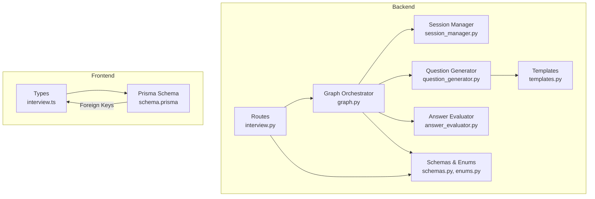
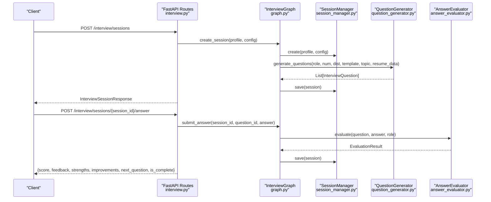
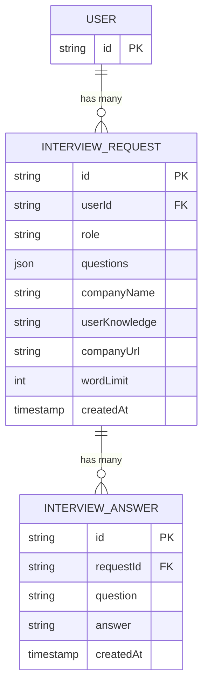
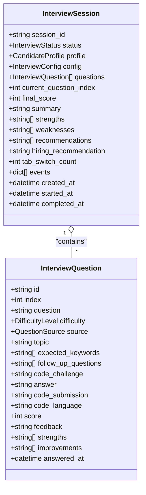
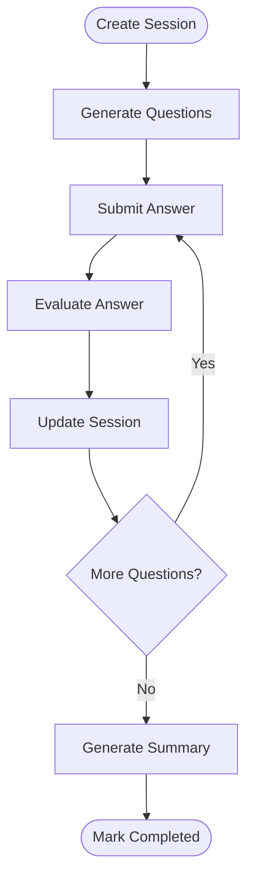
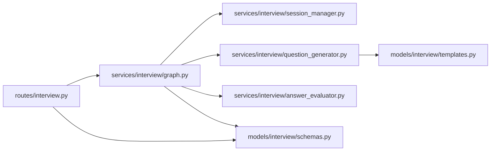

# Interview Data Models

<cite>
**Referenced Files in This Document**
- [schemas.py](file://backend/app/models/interview/schemas.py)
- [enums.py](file://backend/app/models/interview/enums.py)
- [templates.py](file://backend/app/models/interview/templates.py)
- [interview.py](file://backend/app/routes/interview.py)
- [session_manager.py](file://backend/app/services/interview/session_manager.py)
- [question_generator.py](file://backend/app/services/interview/question_generator.py)
- [answer_evaluator.py](file://backend/app/services/interview/answer_evaluator.py)
- [graph.py](file://backend/app/services/interview/graph.py)
- [schema.prisma](file://frontend/prisma/schema.prisma)
- [interview.ts](file://frontend/types/interview.ts)
</cite>

## Table of Contents
1. [Introduction](#introduction)
2. [Project Structure](#project-structure)
3. [Core Components](#core-components)
4. [Architecture Overview](#architecture-overview)
5. [Detailed Component Analysis](#detailed-component-analysis)
6. [Dependency Analysis](#dependency-analysis)
7. [Performance Considerations](#performance-considerations)
8. [Troubleshooting Guide](#troubleshooting-guide)
9. [Conclusion](#conclusion)
10. [Appendices](#appendices)

## Introduction
This document provides comprehensive documentation for the Interview data models and workflows in the system. It focuses on:
- InterviewRequest and InterviewAnswer models and their relationships with user models
- InterviewRequest model fields for role specification, company information, user knowledge context, word limits, and JSON-stored question arrays
- InterviewAnswer model for capturing candidate responses with question-answer pair relationships and temporal tracking
- Interview workflow integration with AI-generated questions, answer evaluation processes, and session management
- JSON field usage for dynamic question structures
- Interview session lifecycle management, answer submission tracking, and evaluation workflows
- Data privacy considerations for interview content, response storage strategies, and integration with the AI interview system
- Structured approach to interview analytics and performance tracking through stored data relationships

## Project Structure
The interview system spans backend Pydantic models, FastAPI routes, LangGraph orchestration, and frontend data types. The database schema defines InterviewRequest and InterviewAnswer entities with foreign keys to the User model.

**Diagram sources**
- [interview.py](file://backend/app/routes/interview.py#L1-L494)
- [graph.py](file://backend/app/services/interview/graph.py#L1-L511)
- [session_manager.py](file://backend/app/services/interview/session_manager.py#L1-L257)
- [question_generator.py](file://backend/app/services/interview/question_generator.py#L1-L275)
- [answer_evaluator.py](file://backend/app/services/interview/answer_evaluator.py#L1-L227)
- [schemas.py](file://backend/app/models/interview/schemas.py#L1-L169)
- [enums.py](file://backend/app/models/interview/enums.py#L1-L43)
- [templates.py](file://backend/app/models/interview/templates.py#L1-L502)
- [schema.prisma](file://frontend/prisma/schema.prisma#L203-L226)
- [interview.ts](file://frontend/types/interview.ts#L1-L21)

**Section sources**
- [interview.py](file://backend/app/routes/interview.py#L1-L494)
- [graph.py](file://backend/app/services/interview/graph.py#L1-L511)
- [session_manager.py](file://backend/app/services/interview/session_manager.py#L1-L257)
- [question_generator.py](file://backend/app/services/interview/question_generator.py#L1-L275)
- [answer_evaluator.py](file://backend/app/services/interview/answer_evaluator.py#L1-L227)
- [schemas.py](file://backend/app/models/interview/schemas.py#L1-L169)
- [enums.py](file://backend/app/models/interview/enums.py#L1-L43)
- [templates.py](file://backend/app/models/interview/templates.py#L1-L502)
- [schema.prisma](file://frontend/prisma/schema.prisma#L203-L226)
- [interview.ts](file://frontend/types/interview.ts#L1-L21)

## Core Components
This section documents the primary data models and their responsibilities.

- InterviewRequest (database model)
  - Purpose: Stores user interview requests with role, company info, user knowledge context, word limits, and JSON-stored questions
  - Fields: id, userId, role, questions (JSON), companyName, userKnowledge (optional), companyUrl (optional), wordLimit, createdAt
  - Relationship: Belongs to User; has many InterviewAnswer
  - Notes: Uses JSON for dynamic question arrays; integrates with user models

- InterviewAnswer (database model)
  - Purpose: Captures candidate responses to specific questions
  - Fields: id, requestId, question, answer, createdAt
  - Relationship: Belongs to InterviewRequest
  - Notes: Temporal tracking via createdAt; pairs with InterviewRequest

- InterviewSession (Pydantic model)
  - Purpose: Runtime session representation for AI-driven interviews
  - Fields: session_id, status, profile, config, questions, current_question_index, final_score, summary, strengths, weaknesses, recommendations, hiring_recommendation, tab_switch_count, events, timestamps
  - Notes: Central runtime model for streaming and evaluation workflows

- InterviewQuestion (Pydantic model)
  - Purpose: Individual question with optional answer and evaluation
  - Fields: id, index, question, difficulty, source, topic, expected_keywords, follow_up_questions, code_challenge, answer, code_submission, code_language, score, feedback, strengths, improvements, answered_at
  - Notes: Supports coding challenges and evaluation metadata

- CandidateProfile (Pydantic model)
  - Purpose: Candidate identity and resume context
  - Fields: name, email, phone, resume_text, resume_data (JSON)
  - Notes: JSON resume_data enables flexible candidate background

- InterviewConfig (Pydantic model)
  - Purpose: Interview configuration
  - Fields: role, template_id, topic, num_questions, difficulty_distribution, time_limit_minutes, includes_coding, coding_languages, voice_enabled, voice_language
  - Notes: Controls question generation and behavior

- Enums
  - DifficultyLevel: easy, medium, hard
  - InterviewStatus: pending, in_progress, completed, cancelled
  - QuestionSource: resume_based, role_based, behavioral, technical, coding
  - InterviewEventType: tab_switch, focus_lost, focus_gained, code_executed, question_skipped, session_paused, session_resumed

- Templates
  - InterviewTemplate: role-specific templates with question banks, topics, coding flags, and difficulty distributions
  - QuestionTemplate: reusable question entries with metadata

**Section sources**
- [schema.prisma](file://frontend/prisma/schema.prisma#L203-L226)
- [schemas.py](file://backend/app/models/interview/schemas.py#L22-L169)
- [enums.py](file://backend/app/models/interview/enums.py#L6-L43)
- [templates.py](file://backend/app/models/interview/templates.py#L10-L502)

## Architecture Overview
The interview workflow integrates FastAPI routes, a LangGraph orchestrator, and service components for question generation, evaluation, and code execution. Sessions are managed in-memory but designed for persistence.

**Diagram sources**
- [interview.py](file://backend/app/routes/interview.py#L65-L186)
- [graph.py](file://backend/app/services/interview/graph.py#L49-L168)
- [session_manager.py](file://backend/app/services/interview/session_manager.py#L28-L72)
- [question_generator.py](file://backend/app/services/interview/question_generator.py#L23-L122)
- [answer_evaluator.py](file://backend/app/services/interview/answer_evaluator.py#L31-L80)

## Detailed Component Analysis

### InterviewRequest Model
- Purpose: Encapsulates user interview requests with structured fields for role, company, knowledge context, and JSON-stored questions
- Key fields:
  - role: specifies the job role for the interview
  - questions: JSON array storing dynamic question structures
  - companyName: company name associated with the request
  - userKnowledge: optional free-text context about the candidate’s knowledge
  - companyUrl: optional company website
  - wordLimit: integer limit for response length
  - createdAt: timestamp for auditability
- Relationship: belongs to User; has many InterviewAnswer
- JSON usage: questions field stores dynamic arrays enabling flexible question structures without rigid schema constraints

**Diagram sources**
- [schema.prisma](file://frontend/prisma/schema.prisma#L203-L226)

**Section sources**
- [schema.prisma](file://frontend/prisma/schema.prisma#L203-L216)

### InterviewAnswer Model
- Purpose: Captures individual candidate answers to specific questions
- Key fields:
  - question: the question text
  - answer: the candidate’s response
  - createdAt: timestamp for temporal tracking
- Relationship: belongs to InterviewRequest
- Notes: Supports temporal tracking and pairing with InterviewRequest for analytics

**Section sources**
- [schema.prisma](file://frontend/prisma/schema.prisma#L218-L226)

### InterviewSession and InterviewQuestion (Runtime Models)
- InterviewSession
  - Tracks session lifecycle, current question index, evaluation results, and events
  - Includes timestamps for created_at, started_at, completed_at
  - Maintains events list for integrity tracking (e.g., tab switches)
- InterviewQuestion
  - Supports coding challenges with code_submission and code_language
  - Stores evaluation metadata: score, feedback, strengths, improvements, answered_at

**Diagram sources**
- [schemas.py](file://backend/app/models/interview/schemas.py#L72-L169)
- [enums.py](file://backend/app/models/interview/enums.py#L6-L43)

**Section sources**
- [schemas.py](file://backend/app/models/interview/schemas.py#L72-L169)
- [enums.py](file://backend/app/models/interview/enums.py#L6-L43)

### Interview Workflow Integration
- Question Generation
  - Uses QuestionGenerator to produce InterviewQuestion lists based on InterviewConfig and templates
  - Supports template-based and LLM-based question generation with fallbacks
- Answer Evaluation
  - AnswerEvaluator provides synchronous and streaming evaluation with structured results
  - Parses LLM responses and supports code review streaming
- Code Execution
  - Executes candidate code submissions and streams results and reviews
- Session Management
  - SessionManager maintains in-memory sessions and events; designed for persistence extension
  - Updates status transitions and tracks tab switches and other events

**Diagram sources**
- [graph.py](file://backend/app/services/interview/graph.py#L49-L168)
- [question_generator.py](file://backend/app/services/interview/question_generator.py#L23-L122)
- [answer_evaluator.py](file://backend/app/services/interview/answer_evaluator.py#L31-L80)
- [session_manager.py](file://backend/app/services/interview/session_manager.py#L172-L202)

**Section sources**
- [graph.py](file://backend/app/services/interview/graph.py#L49-L168)
- [question_generator.py](file://backend/app/services/interview/question_generator.py#L23-L122)
- [answer_evaluator.py](file://backend/app/services/interview/answer_evaluator.py#L31-L80)
- [session_manager.py](file://backend/app/services/interview/session_manager.py#L172-L202)

### Frontend Data Models and Relationships
- Frontend types define InterviewSession and InterviewRequest for UI consumption
- These align conceptually with backend models and database entities
- InterviewSession includes id, role, companyName, createdAt, and questionsAndAnswers
- InterviewRequest mirrors backend InterviewRequest fields for user input

**Section sources**
- [interview.ts](file://frontend/types/interview.ts#L1-L21)
- [schema.prisma](file://frontend/prisma/schema.prisma#L203-L216)

## Dependency Analysis
The backend components depend on each other to orchestrate the interview lifecycle. The routes depend on the graph, which depends on session management, question generation, and evaluation services.

**Diagram sources**
- [interview.py](file://backend/app/routes/interview.py#L1-L494)
- [graph.py](file://backend/app/services/interview/graph.py#L1-L511)
- [session_manager.py](file://backend/app/services/interview/session_manager.py#L1-L257)
- [question_generator.py](file://backend/app/services/interview/question_generator.py#L1-L275)
- [answer_evaluator.py](file://backend/app/services/interview/answer_evaluator.py#L1-L227)
- [templates.py](file://backend/app/models/interview/templates.py#L1-L502)
- [schemas.py](file://backend/app/models/interview/schemas.py#L1-L169)

**Section sources**
- [interview.py](file://backend/app/routes/interview.py#L1-L494)
- [graph.py](file://backend/app/services/interview/graph.py#L1-L511)
- [session_manager.py](file://backend/app/services/interview/session_manager.py#L1-L257)
- [question_generator.py](file://backend/app/services/interview/question_generator.py#L1-L275)
- [answer_evaluator.py](file://backend/app/services/interview/answer_evaluator.py#L1-L227)
- [templates.py](file://backend/app/models/interview/templates.py#L1-L502)
- [schemas.py](file://backend/app/models/interview/schemas.py#L1-L169)

## Performance Considerations
- Streaming evaluation and code review reduce perceived latency and improve UX
- In-memory session storage is efficient for small-scale usage; consider persistence for production
- JSON fields enable flexibility but may require careful indexing and validation strategies
- Template-based question generation reduces LLM invocation overhead when applicable

## Troubleshooting Guide
- Session not found errors indicate invalid session_id or expired sessions
- Question mismatch errors occur when submitted question_id does not match current session state
- Evaluation failures return default scores and feedback; check LLM availability and prompt formatting
- Tab switch counting helps detect potential misconduct; monitor counts for integrity

**Section sources**
- [graph.py](file://backend/app/services/interview/graph.py#L115-L135)
- [answer_evaluator.py](file://backend/app/services/interview/answer_evaluator.py#L31-L80)
- [session_manager.py](file://backend/app/services/interview/session_manager.py#L113-L133)

## Conclusion
The Interview data models and workflows provide a robust foundation for AI-driven interviews. InterviewRequest and InterviewAnswer integrate with user models and JSON fields for dynamic question structures. The runtime models (InterviewSession, InterviewQuestion) support streaming evaluation, code execution, and comprehensive analytics. Session lifecycle management, answer submission tracking, and evaluation workflows are orchestrated through LangGraph services, ensuring scalability and maintainability.

## Appendices
- Interview templates support role-specific question banks and coding challenges
- Enums standardize difficulty levels, statuses, sources, and event types
- Frontend types align with backend models for seamless UI integration

**Section sources**
- [templates.py](file://backend/app/models/interview/templates.py#L41-L478)
- [enums.py](file://backend/app/models/interview/enums.py#L6-L43)
- [interview.ts](file://frontend/types/interview.ts#L1-L21)