# Resume and Analysis Data

<cite>
**Referenced Files in This Document**
- [schema.prisma](file://frontend/prisma/schema.prisma)
- [resume_analysis.py](file://backend/app/services/resume_analysis.py)
- [resume_analysis_routes.py](file://backend/app/routes/resume_analysis.py)
- [process_resume.py](file://backend/app/services/process_resume.py)
- [tailored_resume_routes.py](file://backend/app/routes/tailored_resume.py)
- [resume_schemas.py](file://backend/app/models/resume/schemas.py)
- [resume_data_schemas.py](file://backend/app/models/resume_data/schemas.py)
- [tailored_resume_schemas.py](file://backend/app/models/tailored_resume/schemas.py)
- [enrichment_schemas.py](file://backend/app/models/enrichment/schemas.py)
</cite>

## Table of Contents
1. [Introduction](#introduction)
2. [Project Structure](#project-structure)
3. [Core Components](#core-components)
4. [Architecture Overview](#architecture-overview)
5. [Detailed Component Analysis](#detailed-component-analysis)
6. [Dependency Analysis](#dependency-analysis)
7. [Performance Considerations](#performance-considerations)
8. [Troubleshooting Guide](#troubleshooting-guide)
9. [Conclusion](#conclusion)

## Introduction
This document provides comprehensive documentation for the Resume and Analysis data models in TalentSync-Normies. It explains the Resume model with fields for user association, custom naming, raw text storage, upload metadata, and source tracking (UPLOADED vs MANUAL). It also documents the Analysis model with structured fields for personal information, professional links, predicted career field, skills analysis JSON, recommended roles array, and detailed sections for education, work experience, projects, publications, positions of responsibility, certifications, and achievements. The document covers the parent-child relationship for tailored resumes with cascade deletion policies, JSON field usage for flexible data structures, indexing strategies for performance optimization, and data lifecycle management. It further addresses resume versioning patterns, master resume tracking, analysis result storage mechanisms, validation rules, text search capabilities, and performance considerations for large text fields.

## Project Structure
The Resume and Analysis data models are defined in the Prisma schema and consumed by backend services and routes. The relevant files include:
- Prisma schema defining models and indexes
- Services orchestrating resume processing and analysis
- Routes exposing endpoints for resume analysis and tailored resume generation
- Pydantic schemas validating and structuring analysis outputs

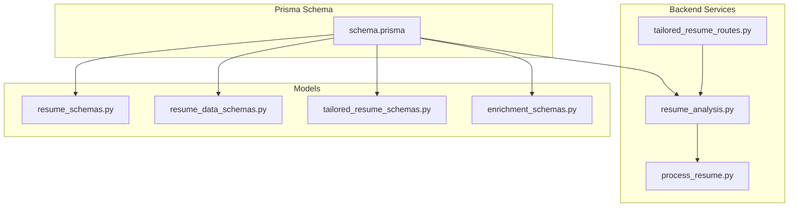

**Diagram sources**
- [schema.prisma](file://frontend/prisma/schema.prisma#L81-L125)
- [resume_analysis.py](file://backend/app/services/resume_analysis.py#L28-L364)
- [process_resume.py](file://backend/app/services/process_resume.py#L68-L117)
- [tailored_resume_routes.py](file://backend/app/routes/tailored_resume.py#L1-L79)
- [resume_schemas.py](file://backend/app/models/resume/schemas.py#L21-L157)
- [resume_data_schemas.py](file://backend/app/models/resume_data/schemas.py#L310-L327)
- [tailored_resume_schemas.py](file://backend/app/models/tailored_resume/schemas.py#L6-L18)
- [enrichment_schemas.py](file://backend/app/models/enrichment/schemas.py#L45-L164)

**Section sources**
- [schema.prisma](file://frontend/prisma/schema.prisma#L81-L125)
- [resume_analysis.py](file://backend/app/services/resume_analysis.py#L28-L364)
- [process_resume.py](file://backend/app/services/process_resume.py#L68-L117)
- [tailored_resume_routes.py](file://backend/app/routes/tailored_resume.py#L1-L79)
- [resume_schemas.py](file://backend/app/models/resume/schemas.py#L21-L157)
- [resume_data_schemas.py](file://backend/app/models/resume_data/schemas.py#L310-L327)
- [tailored_resume_schemas.py](file://backend/app/models/tailored_resume/schemas.py#L6-L18)
- [enrichment_schemas.py](file://backend/app/models/enrichment/schemas.py#L45-L164)

## Core Components
- Resume model
  - Fields: id, userId, customName, rawText, uploadDate, showInCentral, source, isMaster, parentId
  - Relations: belongs to User, optional Analysis, parent-child relationship via parentId with SetNull on child delete
  - Indexes: composite index on userId and isMaster
- Analysis model
  - Fields: id, resumeId (unique), name, email, contact, linkedin, github, blog, portfolio, predictedField, skillsAnalysis (JSON), recommendedRoles (array), and multiple JSON sections (languages, education, workExperience, projects, publications, positionsOfResponsibility, certifications, achievements)
  - Relations: belongs to Resume
  - Timestamps: uploadedAt, updatedAt

These models support:
- Resume ingestion and storage of raw text
- Structured analysis outputs persisted as JSON
- Master resume tracking and tailored resume hierarchy
- Efficient querying via indexes

**Section sources**
- [schema.prisma](file://frontend/prisma/schema.prisma#L81-L125)

## Architecture Overview
The system processes uploaded resumes, extracts and validates text, performs analysis, and stores structured results. The flow integrates file processing, LLM-based extraction, and persistence.

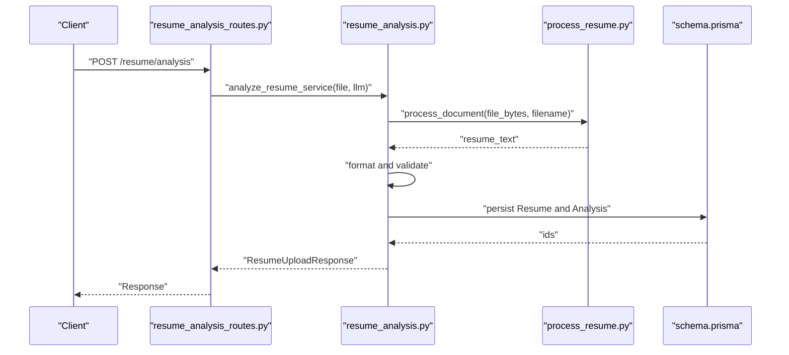

**Diagram sources**
- [resume_analysis_routes.py](file://backend/app/routes/resume_analysis.py#L16-L25)
- [resume_analysis.py](file://backend/app/services/resume_analysis.py#L28-L157)
- [process_resume.py](file://backend/app/services/process_resume.py#L68-L117)
- [schema.prisma](file://frontend/prisma/schema.prisma#L81-L125)

## Detailed Component Analysis

### Resume Model
- Purpose: Store user-associated resume with raw text and metadata
- Key fields
  - userId: foreign key to User
  - customName: human-friendly display name
  - rawText: large text content stored as Text
  - uploadDate: creation timestamp
  - showInCentral: visibility flag
  - source: "UPLOADED" or "MANUAL"
  - isMaster: master resume flag
  - parentId: nullable parent for tailored resumes
- Relationships
  - belongs to User
  - optional Analysis
  - parent-child via parentId with SetNull on child delete
- Indexing
  - Composite index on (userId, isMaster) for efficient lookups

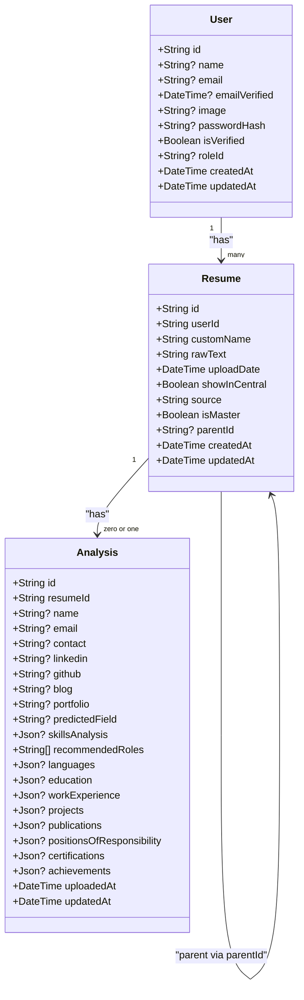

**Diagram sources**
- [schema.prisma](file://frontend/prisma/schema.prisma#L16-L41)
- [schema.prisma](file://frontend/prisma/schema.prisma#L81-L98)
- [schema.prisma](file://frontend/prisma/schema.prisma#L100-L125)

**Section sources**
- [schema.prisma](file://frontend/prisma/schema.prisma#L81-L98)
- [schema.prisma](file://frontend/prisma/schema.prisma#L100-L125)

### Analysis Model
- Purpose: Persist structured analysis results with flexible JSON sections
- Core fields
  - Personal info: name, email, contact
  - Professional links: linkedin, github, blog, portfolio
  - Predicted field: predictedField
  - Skills: skillsAnalysis (JSON)
  - Recommended roles: recommendedRoles (array)
  - Sections: languages, education, workExperience, projects, publications, positionsOfResponsibility, certifications, achievements (all JSON)
- Timestamps
  - uploadedAt: initial insertion
  - updatedAt: last modification

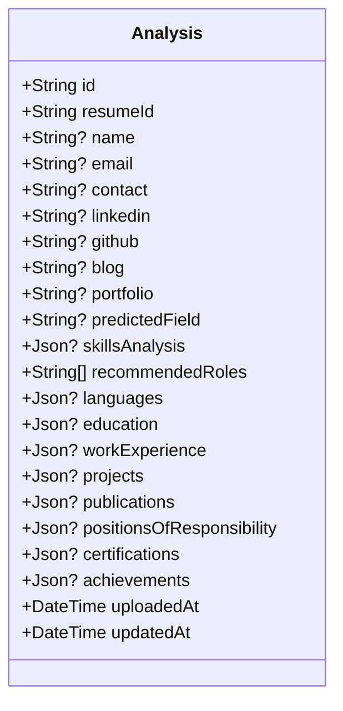

**Diagram sources**
- [schema.prisma](file://frontend/prisma/schema.prisma#L100-L125)

**Section sources**
- [schema.prisma](file://frontend/prisma/schema.prisma#L100-L125)

### Parent-Child Relationship for Tailored Resumes
- Tailored resumes are children of a master resume
- Deletion policy: child delete sets parentId to NULL (SetNull)
- Master resume tracking: isMaster flag distinguishes primary resume per user
- Central visibility: showInCentral flag controls central listing

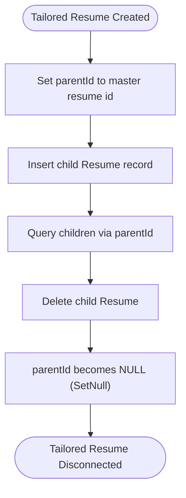

**Diagram sources**
- [schema.prisma](file://frontend/prisma/schema.prisma#L90-L95)

**Section sources**
- [schema.prisma](file://frontend/prisma/schema.prisma#L90-L95)

### JSON Field Usage and Structured Data
- JSON fields enable flexible storage of complex nested structures (e.g., lists of entries, proficiency data)
- Validation and normalization are handled by Pydantic models:
  - ComprehensiveAnalysisData: aggregates all analysis sections
  - Individual section validators coerce text and lists consistently
- Typical JSON sections include:
  - skillsAnalysis: list of skill-proficiency pairs
  - recommendedRoles: array of role names
  - languages, education, workExperience, projects, publications, positionsOfResponsibility, certifications, achievements: arrays of normalized entries

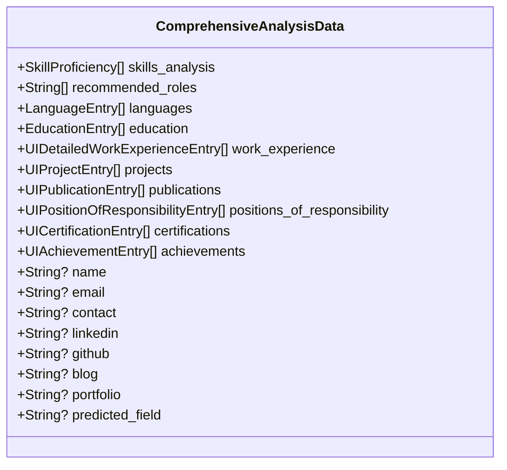

**Diagram sources**
- [resume_schemas.py](file://backend/app/models/resume/schemas.py#L21-L42)
- [resume_data_schemas.py](file://backend/app/models/resume_data/schemas.py#L114-L193)

**Section sources**
- [resume_schemas.py](file://backend/app/models/resume/schemas.py#L21-L42)
- [resume_data_schemas.py](file://backend/app/models/resume_data/schemas.py#L114-L193)

### Data Lifecycle Management
- Ingestion: file upload processed into raw text
- Validation: checks for supported formats and resume keywords
- Analysis: LLM-driven extraction into structured JSON
- Persistence: Resume with rawText and Analysis with JSON sections
- Retrieval: composite index supports efficient user and master resume queries

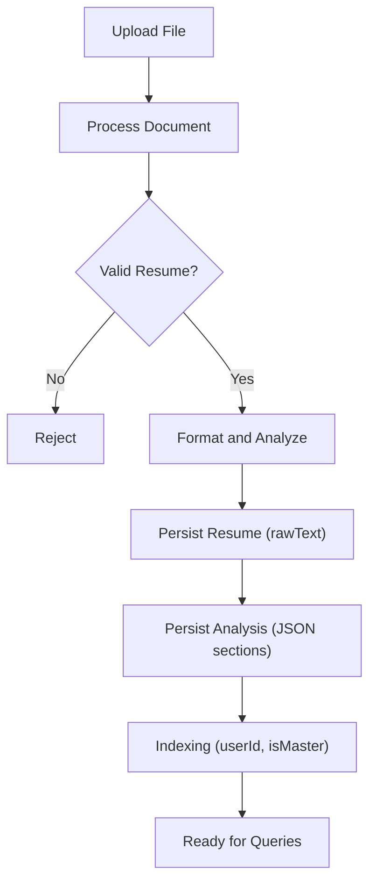

**Diagram sources**
- [process_resume.py](file://backend/app/services/process_resume.py#L68-L117)
- [resume_analysis.py](file://backend/app/services/resume_analysis.py#L28-L157)
- [schema.prisma](file://frontend/prisma/schema.prisma#L81-L98)
- [schema.prisma](file://frontend/prisma/schema.prisma#L100-L125)

**Section sources**
- [process_resume.py](file://backend/app/services/process_resume.py#L68-L117)
- [resume_analysis.py](file://backend/app/services/resume_analysis.py#L28-L157)
- [schema.prisma](file://frontend/prisma/schema.prisma#L81-L98)
- [schema.prisma](file://frontend/prisma/schema.prisma#L100-L125)

### Resume Versioning Patterns and Master Resume Tracking
- Master resume: identified by isMaster flag per user
- Tailored resumes: children of a master resume via parentId
- Versioning: achieved by creating new child resumes while preserving the master; deletion of a tailored resume does not affect the master (SetNull on parentId)
- Central listing: controlled by showInCentral flag

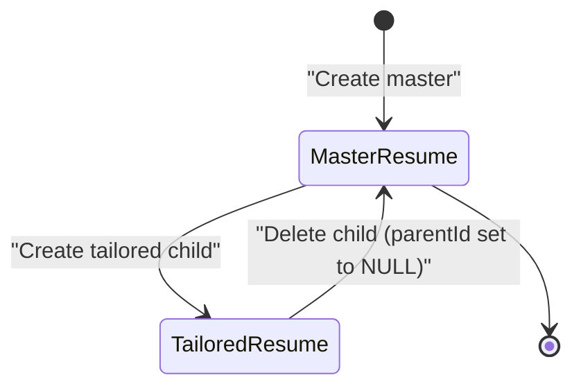

**Diagram sources**
- [schema.prisma](file://frontend/prisma/schema.prisma#L89-L95)

**Section sources**
- [schema.prisma](file://frontend/prisma/schema.prisma#L89-L95)

### Analysis Result Storage Mechanisms
- Results are stored as JSON in dedicated fields for each section
- A unified ComprehensiveAnalysisData model aggregates all sections for downstream use
- Enrichment and regeneration workflows operate on this structured JSON

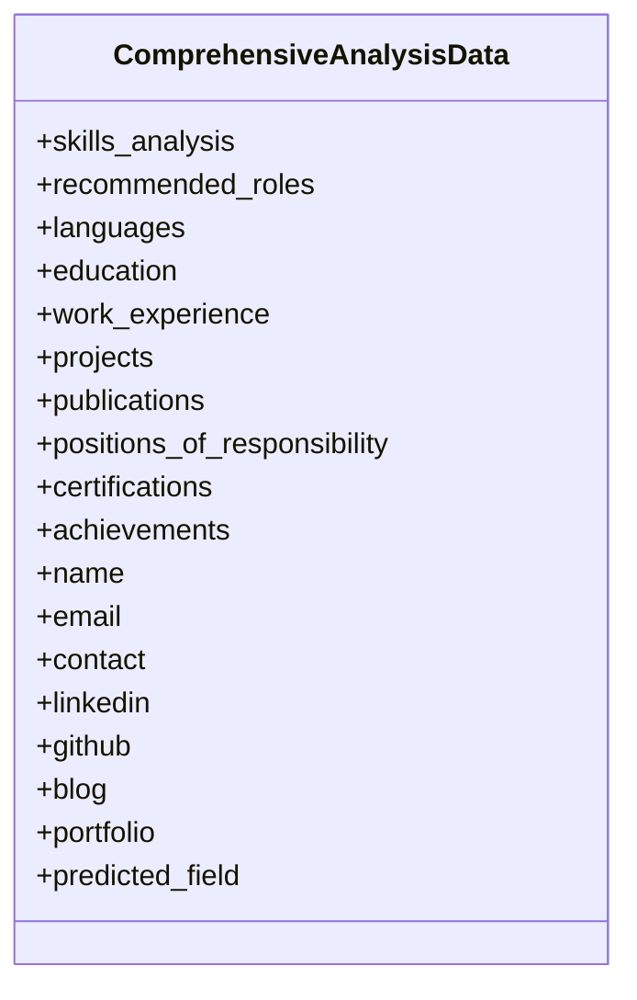

**Diagram sources**
- [resume_schemas.py](file://backend/app/models/resume/schemas.py#L21-L42)

**Section sources**
- [resume_schemas.py](file://backend/app/models/resume/schemas.py#L21-L42)
- [enrichment_schemas.py](file://backend/app/models/enrichment/schemas.py#L45-L164)

### Data Validation Rules
- Resume validation ensures presence of typical resume keywords
- Pydantic models validate and normalize JSON structures
- Portfolio link aliasing accommodates varied LLM outputs

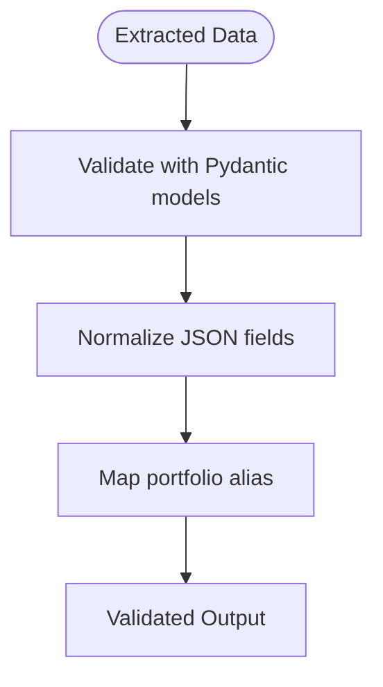

**Diagram sources**
- [resume_analysis.py](file://backend/app/services/resume_analysis.py#L96-L103)
- [resume_analysis.py](file://backend/app/services/resume_analysis.py#L213-L221)

**Section sources**
- [process_resume.py](file://backend/app/services/process_resume.py#L93-L109)
- [resume_analysis.py](file://backend/app/services/resume_analysis.py#L96-L103)
- [resume_analysis.py](file://backend/app/services/resume_analysis.py#L213-L221)

### Text Search Capabilities
- rawText is stored as Text for large content
- No explicit text search index is defined in the schema; consider adding GIN or trigram indexes for full-text search if needed
- Current indexing focuses on userId and isMaster for filtering master resumes per user

**Section sources**
- [schema.prisma](file://frontend/prisma/schema.prisma#L85-L97)

## Dependency Analysis
The Resume and Analysis models depend on:
- Prisma schema for database definitions and indexes
- Backend services for processing and analysis
- Pydantic models for validation and normalization
- Routes for endpoint orchestration

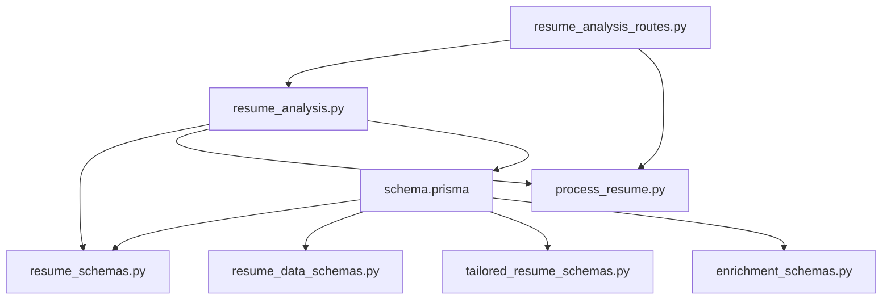

**Diagram sources**
- [schema.prisma](file://frontend/prisma/schema.prisma#L81-L125)
- [resume_analysis_routes.py](file://backend/app/routes/resume_analysis.py#L1-L68)
- [resume_analysis.py](file://backend/app/services/resume_analysis.py#L28-L364)
- [process_resume.py](file://backend/app/services/process_resume.py#L68-L117)
- [resume_schemas.py](file://backend/app/models/resume/schemas.py#L21-L157)
- [resume_data_schemas.py](file://backend/app/models/resume_data/schemas.py#L310-L327)
- [tailored_resume_schemas.py](file://backend/app/models/tailored_resume/schemas.py#L6-L18)
- [enrichment_schemas.py](file://backend/app/models/enrichment/schemas.py#L45-L164)

**Section sources**
- [schema.prisma](file://frontend/prisma/schema.prisma#L81-L125)
- [resume_analysis_routes.py](file://backend/app/routes/resume_analysis.py#L1-L68)
- [resume_analysis.py](file://backend/app/services/resume_analysis.py#L28-L364)
- [process_resume.py](file://backend/app/services/process_resume.py#L68-L117)
- [resume_schemas.py](file://backend/app/models/resume/schemas.py#L21-L157)
- [resume_data_schemas.py](file://backend/app/models/resume_data/schemas.py#L310-L327)
- [tailored_resume_schemas.py](file://backend/app/models/tailored_resume/schemas.py#L6-L18)
- [enrichment_schemas.py](file://backend/app/models/enrichment/schemas.py#L45-L164)

## Performance Considerations
- Large text fields
  - rawText is stored as Text; consider partitioning or external storage for very large documents
  - Full-text search: add GIN/trigram indexes if frequent text searches are required
- Indexing
  - Composite index on (userId, isMaster) optimizes fetching master resumes per user
  - Consider additional indexes for frequent filters (e.g., source, uploadDate)
- JSON fields
  - JSON queries may be slower than relational joins; denormalize selectively if needed
  - Use targeted projections to minimize JSON payload sizes
- LLM processing
  - Batch processing and caching can reduce latency
  - Monitor LLM availability and handle fallbacks gracefully
- Cascading deletes
  - Tailored resumes use SetNull on parentId; ensure appropriate cleanup of unused records

[No sources needed since this section provides general guidance]

## Troubleshooting Guide
- Unsupported file type or processing errors
  - The processor returns None for unsupported types; ensure file extensions are TXT, MD, PDF, or DOCX
- Validation failures
  - Resume must contain typical resume keywords; otherwise rejected
  - Pydantic validation errors indicate malformed LLM outputs; review extracted keys and aliases
- LLM unavailability
  - Empty or non-dictionary results lead to service errors; verify LLM configuration and availability
- Portfolio aliasing
  - Portfolio field mapping handles various LLM output keys; ensure consistent alias handling

**Section sources**
- [process_resume.py](file://backend/app/services/process_resume.py#L68-L90)
- [process_resume.py](file://backend/app/services/process_resume.py#L93-L109)
- [resume_analysis.py](file://backend/app/services/resume_analysis.py#L96-L103)
- [resume_analysis.py](file://backend/app/services/resume_analysis.py#L200-L208)
- [resume_analysis.py](file://backend/app/services/resume_analysis.py#L278-L285)

## Conclusion
The Resume and Analysis models in TalentSync-Normies provide a robust foundation for storing and managing resume data with flexible JSON structures. The schema supports master/tailored resume hierarchies, efficient user-based queries, and comprehensive analysis outputs. By leveraging Pydantic validation, structured JSON sections, and strategic indexing, the system balances flexibility with performance. Future enhancements could include full-text search indexes, denormalized fields for high-frequency queries, and improved cascading deletion policies for tailored resumes.