# Resume and analysis data

## Introduction
This page provides detailed documentation for the Resume and Analysis data models in TalentSync-Normies. It explains the Resume model with fields for user association, custom naming, raw text storage, upload metadata, and source tracking (UPLOADED vs MANUAL). It also documents the Analysis model with structured fields for personal information, professional links, predicted career field, skills analysis JSON, recommended roles array, and detailed sections for education, work experience, projects, publications, positions of responsibility, certifications, and achievements. The document covers the parent-child relationship for tailored resumes with cascade deletion policies, JSON field usage for flexible data structures, indexing strategies for performance optimization, and data lifecycle management. It further addresses resume versioning patterns, master resume tracking, analysis result storage mechanisms, validation rules, text search capabilities, and performance considerations for large text fields.

## Project structure
The Resume and Analysis data models are defined in the Prisma schema and consumed by backend services and routes. The relevant files include:
- Prisma schema defining models and indexes
- Services orchestrating resume processing and analysis
- Routes exposing endpoints for resume analysis and tailored resume generation
- Pydantic schemas validating and structuring analysis outputs

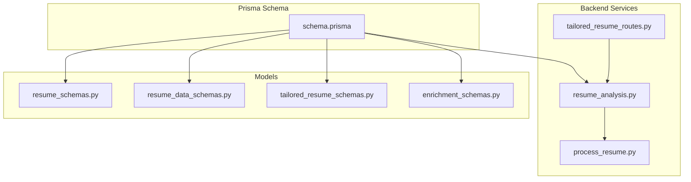
```mermaid
graph TB
subgraph "Prisma Schema"
PRISMA["schema.prisma"]
end
subgraph "Backend Services"
RESUME_ANALYSIS["resume_analysis.py"]
PROCESS_RESUME["process_resume.py"]
TAILORED_ROUTE["tailored_resume_routes.py"]
end
subgraph "Models"
RESUME_SCHEMAS["resume_schemas.py"]
RESUME_DATA_SCHEMAS["resume_data_schemas.py"]
TAILORED_SCHEMAS["tailored_resume_schemas.py"]
ENRICHMENT_SCHEMAS["enrichment_schemas.py"]
end
PRISMA --> RESUME_ANALYSIS
PRISMA --> RESUME_SCHEMAS
PRISMA --> RESUME_DATA_SCHEMAS
PRISMA --> TAILORED_SCHEMAS
PRISMA --> ENRICHMENT_SCHEMAS
RESUME_ANALYSIS --> PROCESS_RESUME
TAILORED_ROUTE --> RESUME_ANALYSIS
```

## Core components
- Resume model
  - Fields: id, userId, customName, rawText, uploadDate, showInCentral, source, isMaster, parentId
  - Relations: belongs to User, optional Analysis, parent-child relationship via parentId with SetNull on child delete
  - Indexes: composite index on userId and isMaster
- Analysis model
  - Fields: id, resumeId (unique), name, email, contact, linkedin, github, blog, portfolio, predictedField, skillsAnalysis (JSON), recommendedRoles (array), and multiple JSON sections (languages, education, workExperience, projects, publications, positionsOfResponsibility, certifications, achievements)
  - Relations: belongs to Resume
  - Timestamps: uploadedAt, updatedAt

These models support:
- Resume ingestion and storage of raw text
- Structured analysis outputs persisted as JSON
- Master resume tracking and tailored resume hierarchy
- Efficient querying via indexes

## Architecture overview
The system processes uploaded resumes, extracts and validates text, performs analysis, and stores structured results. The flow integrates file processing, LLM-based extraction, and persistence.

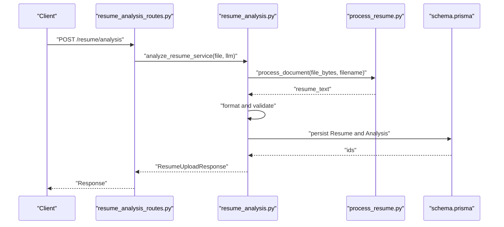
```mermaid
sequenceDiagram
participant Client as "Client"
participant Route as "resume_analysis_routes.py"
participant Service as "resume_analysis.py"
participant Processor as "process_resume.py"
participant DB as "schema.prisma"
Client->>Route : "POST /resume/analysis"
Route->>Service : "analyze_resume_service(file, llm)"
Service->>Processor : "process_document(file_bytes, filename)"
Processor-->>Service : "resume_text"
Service->>Service : "format and validate"
Service->>DB : "persist Resume and Analysis"
DB-->>Service : "ids"
Service-->>Route : "ResumeUploadResponse"
Route-->>Client : "Response"
```

## Detailed component analysis

### Resume model
- Purpose: Store user-associated resume with raw text and metadata
- Key fields
  - userId: foreign key to User
  - customName: human-friendly display name
  - rawText: large text content stored as Text
  - uploadDate: creation timestamp
  - showInCentral: visibility flag
  - source: "UPLOADED" or "MANUAL"
  - isMaster: master resume flag
  - parentId: nullable parent for tailored resumes
- Relationships
  - belongs to User
  - optional Analysis
  - parent-child via parentId with SetNull on child delete
- Indexing
  - Composite index on (userId, isMaster) for efficient lookups

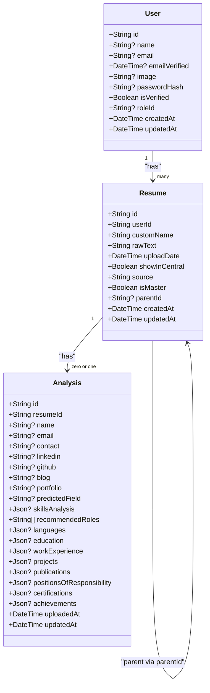
```mermaid
classDiagram
class User {
+String id
+String? name
+String? email
+DateTime? emailVerified
+String? image
+String? passwordHash
+Boolean isVerified
+String? roleId
+DateTime createdAt
+DateTime updatedAt
}
class Resume {
+String id
+String userId
+String customName
+String rawText
+DateTime uploadDate
+Boolean showInCentral
+String source
+Boolean isMaster
+String? parentId
+DateTime createdAt
+DateTime updatedAt
}
class Analysis {
+String id
+String resumeId
+String? name
+String? email
+String? contact
+String? linkedin
+String? github
+String? blog
+String? portfolio
+String? predictedField
+Json? skillsAnalysis
+String[] recommendedRoles
+Json? languages
+Json? education
+Json? workExperience
+Json? projects
+Json? publications
+Json? positionsOfResponsibility
+Json? certifications
+Json? achievements
+DateTime uploadedAt
+DateTime updatedAt
}
User "1" --> "many" Resume : "has"
Resume "1" --> "zero or one" Analysis : "has"
Resume "1" --> "many" Resume : "child (tailored)"
Resume --> Resume : "parent via parentId"
```

### Analysis model
- Purpose: Persist structured analysis results with flexible JSON sections
- Core fields
  - Personal info: name, email, contact
  - Professional links: linkedin, github, blog, portfolio
  - Predicted field: predictedField
  - Skills: skillsAnalysis (JSON)
  - Recommended roles: recommendedRoles (array)
  - Sections: languages, education, workExperience, projects, publications, positionsOfResponsibility, certifications, achievements (all JSON)
- Timestamps
  - uploadedAt: initial insertion
  - updatedAt: last modification

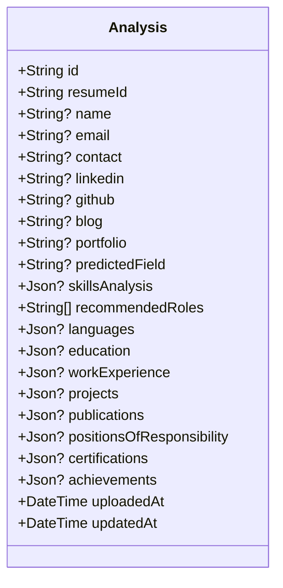
```mermaid
classDiagram
class Analysis {
+String id
+String resumeId
+String? name
+String? email
+String? contact
+String? linkedin
+String? github
+String? blog
+String? portfolio
+String? predictedField
+Json? skillsAnalysis
+String[] recommendedRoles
+Json? languages
+Json? education
+Json? workExperience
+Json? projects
+Json? publications
+Json? positionsOfResponsibility
+Json? certifications
+Json? achievements
+DateTime uploadedAt
+DateTime updatedAt
}
```

### Parent-Child relationship for tailored resumes
- Tailored resumes are children of a master resume
- Deletion policy: child delete sets parentId to NULL (SetNull)
- Master resume tracking: isMaster flag distinguishes primary resume per user
- Central visibility: showInCentral flag controls central listing

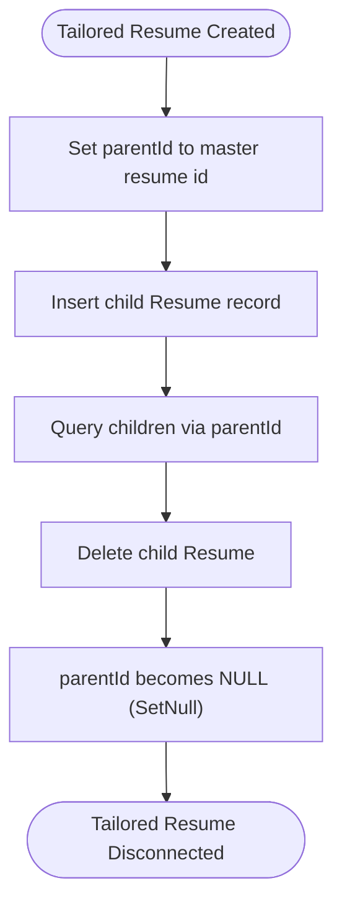
```mermaid
flowchart TD
Start(["Tailored Resume Created"]) --> SetParent["Set parentId to master resume id"]
SetParent --> InsertChild["Insert child Resume record"]
InsertChild --> QueryChildren["Query children via parentId"]
QueryChildren --> DeleteChild["Delete child Resume"]
DeleteChild --> SetNull["parentId becomes NULL (SetNull)"]
SetNull --> End(["Tailored Resume Disconnected"])
```

### JSON field usage and structured data
- JSON fields enable flexible storage of complex nested structures (e.g., lists of entries, proficiency data)
- Validation and normalization are handled by Pydantic models:
  - ComprehensiveAnalysisData: aggregates all analysis sections
  - Individual section validators coerce text and lists consistently
- Typical JSON sections include:
  - skillsAnalysis: list of skill-proficiency pairs
  - recommendedRoles: array of role names
  - languages, education, workExperience, projects, publications, positionsOfResponsibility, certifications, achievements: arrays of normalized entries

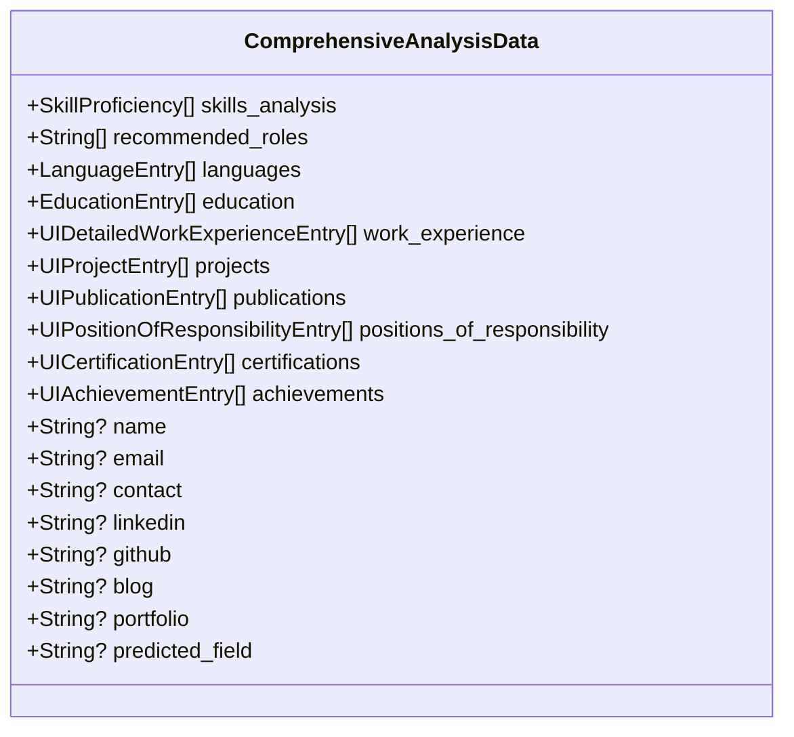
```mermaid
classDiagram
class ComprehensiveAnalysisData {
+SkillProficiency[] skills_analysis
+String[] recommended_roles
+LanguageEntry[] languages
+EducationEntry[] education
+UIDetailedWorkExperienceEntry[] work_experience
+UIProjectEntry[] projects
+UIPublicationEntry[] publications
+UIPositionOfResponsibilityEntry[] positions_of_responsibility
+UICertificationEntry[] certifications
+UIAchievementEntry[] achievements
+String? name
+String? email
+String? contact
+String? linkedin
+String? github
+String? blog
+String? portfolio
+String? predicted_field
}
```

### Data lifecycle management
- Ingestion: file upload processed into raw text
- Validation: checks for supported formats and resume keywords
- Analysis: LLM-driven extraction into structured JSON
- Persistence: Resume with rawText and Analysis with JSON sections
- Retrieval: composite index supports efficient user and master resume queries

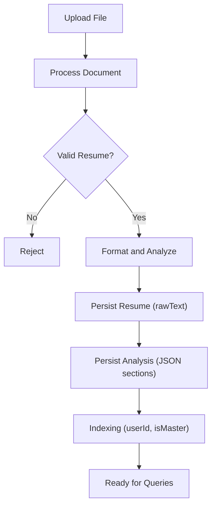
```mermaid
flowchart TD
A["Upload File"] --> B["Process Document"]
B --> C{"Valid Resume?"}
C --> |No| D["Reject"]
C --> |Yes| E["Format and Analyze"]
E --> F["Persist Resume (rawText)"]
F --> G["Persist Analysis (JSON sections)"]
G --> H["Indexing (userId, isMaster)"]
H --> I["Ready for Queries"]
```

### Resume versioning patterns and master resume tracking
- Master resume: identified by isMaster flag per user
- Tailored resumes: children of a master resume via parentId
- Versioning: achieved by creating new child resumes while preserving the master; deletion of a tailored resume does not affect the master (SetNull on parentId)
- Central listing: controlled by showInCentral flag

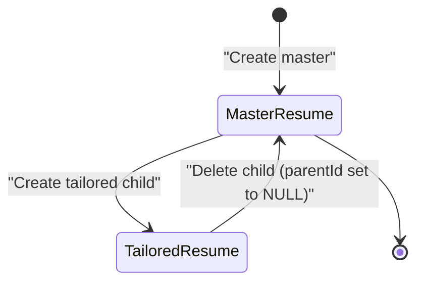
```mermaid
stateDiagram-v2
[*] --> MasterResume : "Create master"
MasterResume --> TailoredResume : "Create tailored child"
TailoredResume --> MasterResume : "Delete child (parentId set to NULL)"
MasterResume --> [*]
```

### Analysis result storage mechanisms
- Results are stored as JSON in dedicated fields for each section
- A unified ComprehensiveAnalysisData model aggregates all sections for downstream use
- Enrichment and regeneration workflows operate on this structured JSON

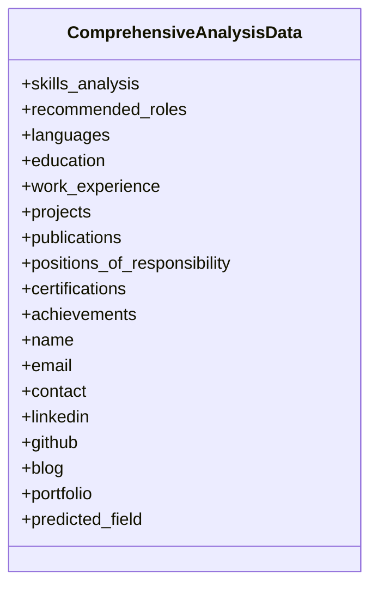
```mermaid
classDiagram
class ComprehensiveAnalysisData {
+skills_analysis
+recommended_roles
+languages
+education
+work_experience
+projects
+publications
+positions_of_responsibility
+certifications
+achievements
+name
+email
+contact
+linkedin
+github
+blog
+portfolio
+predicted_field
}
```

### Data validation rules
- Resume validation ensures presence of typical resume keywords
- Pydantic models validate and normalize JSON structures
- Portfolio link aliasing accommodates varied LLM outputs

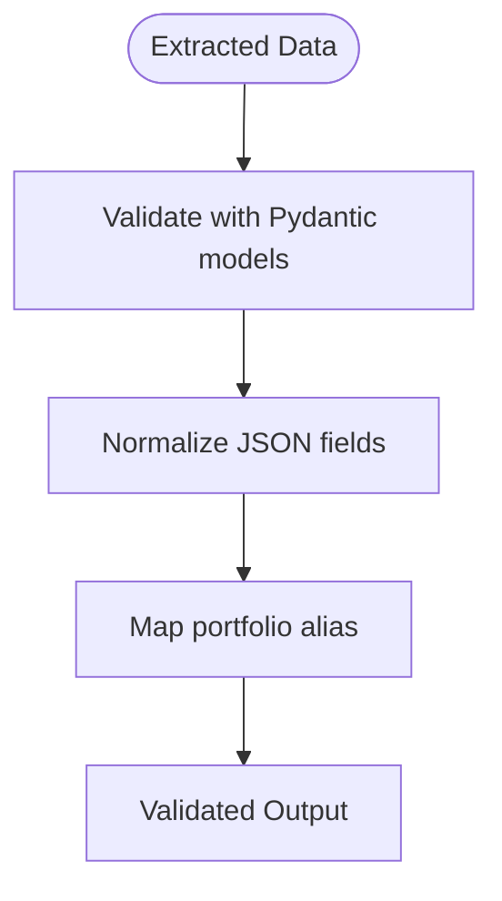
```mermaid
flowchart TD
Start(["Extracted Data"]) --> Validate["Validate with Pydantic models"]
Validate --> Normalize["Normalize JSON fields"]
Normalize --> PortfolioAlias["Map portfolio alias"]
PortfolioAlias --> Pass["Validated Output"]
```

### Text search capabilities
- rawText is stored as Text for large content
- No explicit text search index is defined in the schema; consider adding GIN or trigram indexes for full-text search if needed
- Current indexing focuses on userId and isMaster for filtering master resumes per user

## Dependency analysis
The Resume and Analysis models depend on:
- Prisma schema for database definitions and indexes
- Backend services for processing and analysis
- Pydantic models for validation and normalization
- Routes for endpoint orchestration

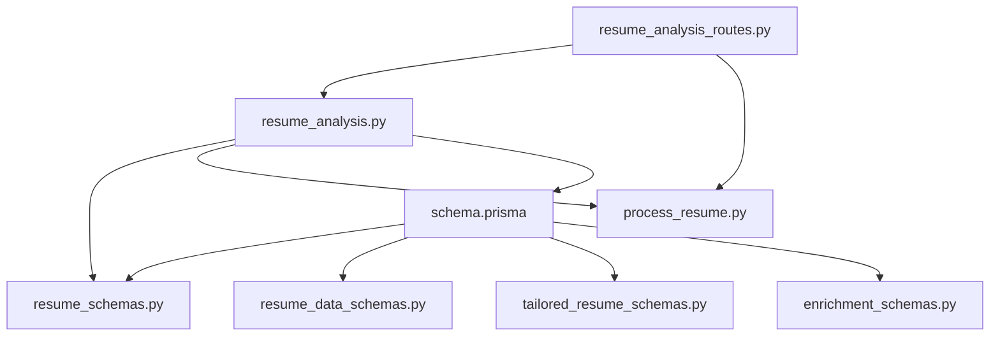
```mermaid
graph TB
PRISMA["schema.prisma"] --> MODELS["resume_schemas.py"]
PRISMA --> DATA_MODELS["resume_data_schemas.py"]
PRISMA --> TAILORED_MODELS["tailored_resume_schemas.py"]
PRISMA --> ENRICHMENT_MODELS["enrichment_schemas.py"]
ROUTES["resume_analysis_routes.py"] --> SERVICE["resume_analysis.py"]
ROUTES --> PROCESSOR["process_resume.py"]
SERVICE --> MODELS
SERVICE --> PROCESSOR
SERVICE --> PRISMA
```

## Performance considerations
- Large text fields
  - rawText is stored as Text; consider partitioning or external storage for very large documents
  - Full-text search: add GIN/trigram indexes if frequent text searches are required
- Indexing
  - Composite index on (userId, isMaster) optimizes fetching master resumes per user
  - Consider additional indexes for frequent filters (e.g., source, uploadDate)
- JSON fields
  - JSON queries may be slower than relational joins; denormalize selectively if needed
  - Use targeted projections to minimize JSON payload sizes
- LLM processing
  - Batch processing and caching can reduce latency
  - Monitor LLM availability and handle fallbacks gracefully
- Cascading deletes
  - Tailored resumes use SetNull on parentId; ensure appropriate cleanup of unused records

[No sources needed since this section provides general guidance]

## Troubleshooting guide
- Unsupported file type or processing errors
  - The processor returns None for unsupported types; ensure file extensions are TXT, MD, PDF, or DOCX
- Validation failures
  - Resume must contain typical resume keywords; otherwise rejected
  - Pydantic validation errors indicate malformed LLM outputs; review extracted keys and aliases
- LLM unavailability
  - Empty or non-dictionary results lead to service errors; verify LLM configuration and availability
- Portfolio aliasing
  - Portfolio field mapping handles various LLM output keys; ensure consistent alias handling

## Conclusion
The Resume and Analysis models in TalentSync-Normies provide a reliable foundation for storing and managing resume data with flexible JSON structures. The schema supports master/tailored resume hierarchies, efficient user-based queries, and detailed analysis outputs. By using Pydantic validation, structured JSON sections, and strategic indexing, the system balances flexibility with performance. Future enhancements could include full-text search indexes, denormalized fields for high-frequency queries, and improved cascading deletion policies for tailored resumes.
