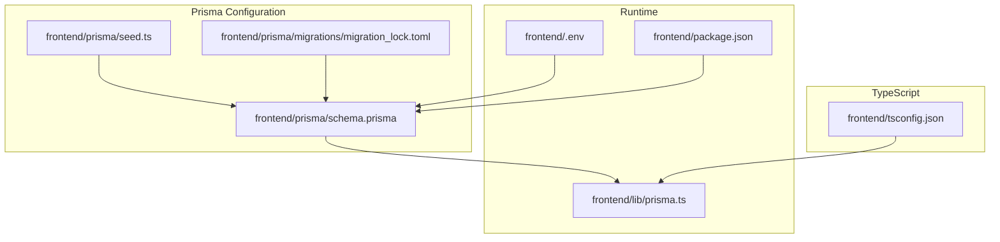
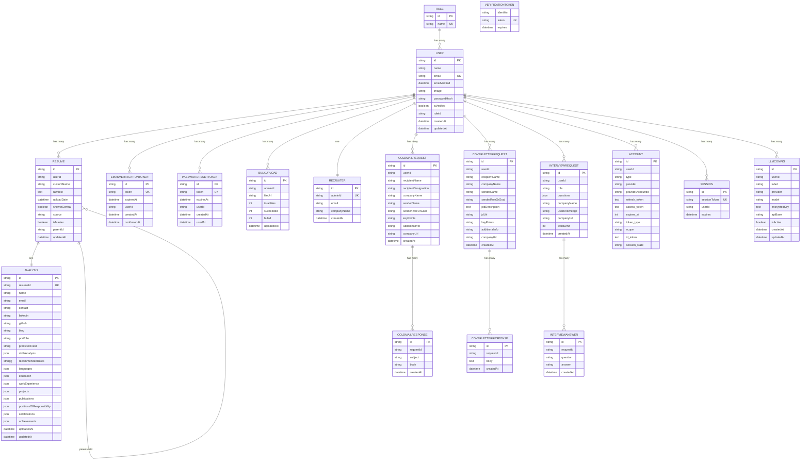
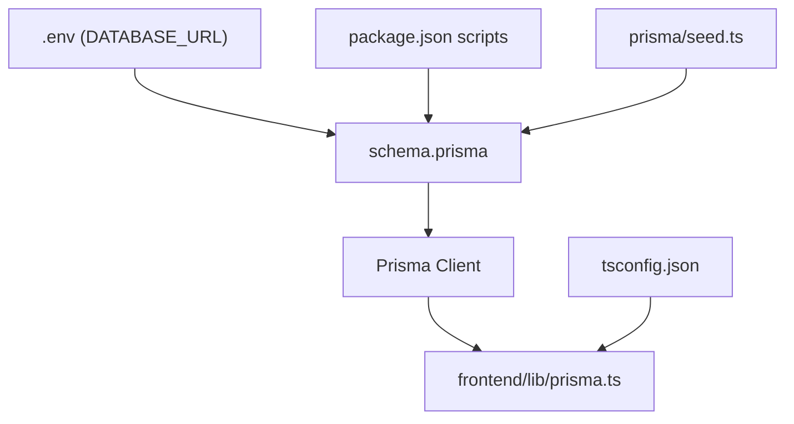

# Schema Overview

<cite>
**Referenced Files in This Document**
- [schema.prisma](file://frontend/prisma/schema.prisma)
- [prisma.ts](file://frontend/lib/prisma.ts)
- [.env](file://frontend/.env)
- [package.json](file://frontend/package.json)
- [seed.ts](file://frontend/prisma/seed.ts)
- [migration_lock.toml](file://frontend/prisma/migrations/migration_lock.toml)
- [tsconfig.json](file://frontend/tsconfig.json)
</cite>

## Table of Contents
1. [Introduction](#introduction)
2. [Project Structure](#project-structure)
3. [Core Components](#core-components)
4. [Architecture Overview](#architecture-overview)
5. [Detailed Component Analysis](#detailed-component-analysis)
6. [Dependency Analysis](#dependency-analysis)
7. [Performance Considerations](#performance-considerations)
8. [Troubleshooting Guide](#troubleshooting-guide)
9. [Conclusion](#conclusion)

## Introduction
This document provides a comprehensive schema overview for the TalentSync-Normies Prisma ORM database design. It explains the overall database architecture, data source configuration, and generator setup. It documents the PostgreSQL data source configuration with environment variable integration, connection pooling considerations, and Prisma client generator settings with TypeScript integration. It also presents the complete entity relationship diagram for all models, outlines naming conventions and ID generation strategies, and details database URL configuration, SSL requirements, and connection string formatting. Finally, it addresses schema validation, type safety guarantees, and the Prisma client generation process.

## Project Structure
The database schema is defined and managed within the frontend project under the Prisma directory. The key files involved are:
- Prisma schema definition
- Environment variables for database connectivity
- Prisma client initialization
- Build and generation scripts
- Seed script for initial data
- Migration lock file indicating the provider

**Diagram sources**
- [schema.prisma](file://frontend/prisma/schema.prisma#L1-L262)
- [migration_lock.toml](file://frontend/prisma/migrations/migration_lock.toml#L1-L4)
- [seed.ts](file://frontend/prisma/seed.ts#L1-L30)
- [prisma.ts](file://frontend/lib/prisma.ts#L1-L10)
- [.env](file://frontend/.env#L1-L27)
- [package.json](file://frontend/package.json#L1-L114)
- [tsconfig.json](file://frontend/tsconfig.json#L1-L43)

**Section sources**
- [schema.prisma](file://frontend/prisma/schema.prisma#L1-L262)
- [prisma.ts](file://frontend/lib/prisma.ts#L1-L10)
- [.env](file://frontend/.env#L1-L27)
- [package.json](file://frontend/package.json#L1-L114)
- [seed.ts](file://frontend/prisma/seed.ts#L1-L30)
- [migration_lock.toml](file://frontend/prisma/migrations/migration_lock.toml#L1-L4)
- [tsconfig.json](file://frontend/tsconfig.json#L1-L43)

## Core Components
- Data source: PostgreSQL configured via DATABASE_URL environment variable.
- Generator: Prisma client for JavaScript/TypeScript.
- Models: 15+ entities representing roles, users, authentication tokens, resumes, analysis, bulk uploads, recruiters, cold mail requests/responses, cover letter requests/responses, interview requests/answers, accounts, sessions, and verification tokens.
- ID generation: Mixed strategies (uuid(), cuid()) per model.
- Defaults: now() for timestamps, empty arrays for JSON arrays, and explicit defaults for string fields.
- Relations: Foreign keys defined with relation directives and indexes where appropriate.

**Section sources**
- [schema.prisma](file://frontend/prisma/schema.prisma#L1-L262)

## Architecture Overview
The database architecture centers around a central PostgreSQL instance accessed through Prisma. The Prisma client is initialized in the Next.js application and used across services and pages. Environment variables supply the database URL and other secrets. The Prisma CLI manages migrations and seeding.

```mermaid
graph TB
subgraph "Application Layer"
FE["Next.js Frontend"]
PRISMA_TS["frontend/lib/prisma.ts"]
end
subgraph "Prisma Layer"
SCHEMA["frontend/prisma/schema.prisma"]
MIGRATIONS["frontend/prisma/migrations"]
SEED["frontend/prisma/seed.ts"]
end
subgraph "Database"
PG["PostgreSQL"]
end
ENV[".env (DATABASE_URL)"] --> SCHEMA
SCHEMA --> PG
PRISMA_TS --> SCHEMA
FE --> PRISMA_TS
SEED --> SCHEMA
MIGRATIONS --> SCHEMA
```

**Diagram sources**
- [schema.prisma](file://frontend/prisma/schema.prisma#L1-L262)
- [prisma.ts](file://frontend/lib/prisma.ts#L1-L10)
- [.env](file://frontend/.env#L1-L27)
- [seed.ts](file://frontend/prisma/seed.ts#L1-L30)
- [migration_lock.toml](file://frontend/prisma/migrations/migration_lock.toml#L1-L4)

## Detailed Component Analysis

### Data Source Configuration
- Provider: PostgreSQL
- URL: Resolved from the DATABASE_URL environment variable
- Connection string format: Standard PostgreSQL URI scheme
- SSL requirements: Not explicitly configured in the schema; defaults depend on runtime environment and driver behavior
- Connection pooling: Not configured in the schema; Prisma client manages connections by default

Environment variable integration and URL format:
- DATABASE_URL is loaded from the environment and passed to the Prisma data source
- The URL follows the standard PostgreSQL connection string format

**Section sources**
- [schema.prisma](file://frontend/prisma/schema.prisma#L1-L4)
- [.env](file://frontend/.env#L1-L27)

### Prisma Client Generator and TypeScript Integration
- Generator: prisma-client-js
- TypeScript integration: Enabled via strict compiler options and module resolution settings
- Generation process: Executed during build via npm script, ensuring type-safe client generation

Build and generation pipeline:
- The build script runs prisma generate before next build
- The seed script uses tsx to execute TypeScript seed code

**Section sources**
- [schema.prisma](file://frontend/prisma/schema.prisma#L6-L8)
- [package.json](file://frontend/package.json#L5-L12)
- [tsconfig.json](file://frontend/tsconfig.json#L1-L43)

### Entity Relationship Diagram
The following ER diagram visualizes all 15+ models and their interconnections as defined in the schema.

**Diagram sources**
- [schema.prisma](file://frontend/prisma/schema.prisma#L10-L262)

### Naming Conventions and ID Generation Strategies
- Naming conventions:
  - Model names are pluralized (e.g., Role, Users, Resumes)
  - Relation fields use singular names (e.g., userId, roleId)
  - Unique constraints applied to identifiers (e.g., email, sessionToken, provider/providerAccountId)
- ID generation:
  - uuid(): Used for Role, User (indirectly via foreign keys), EmailVerificationToken, PasswordResetToken, Resume, Analysis, BulkUpload, Recruiter, ColdMailRequest, ColdMailResponse, CoverLetterRequest, CoverLetterResponse, InterviewRequest, InterviewAnswer, Account, Session, VerificationToken, LlmConfig
  - cuid(): Used for Account, Session, LlmConfig
- Default value patterns:
  - Timestamps: createdAt defaults to now(); updatedAt uses @updatedAt where applicable
  - Booleans: isVerified defaults to false; isActive defaults to false; showInCentral defaults to false; isMaster defaults to false
  - Strings: label defaults to "Default"; provider defaults to "google"; model defaults to "gemini-2.5-flash"; source defaults to "UPLOADED"
  - Arrays: recommendedRoles defaults to an empty array

**Section sources**
- [schema.prisma](file://frontend/prisma/schema.prisma#L10-L262)

### Database URL Configuration, SSL, and Connection String Formatting
- Database URL: Provided via DATABASE_URL environment variable
- Connection string format: Standard PostgreSQL URI scheme
- SSL requirements: Not explicitly configured in the schema; SSL behavior depends on the environment and driver defaults
- Connection pooling: Not configured in the schema; Prisma client manages connections by default

**Section sources**
- [schema.prisma](file://frontend/prisma/schema.prisma#L1-L4)
- [.env](file://frontend/.env#L1-L27)

### Schema Validation, Type Safety Guarantees, and Prisma Client Generation
- Schema validation: Prisma validates the schema against the database provider and enforces referential integrity via relation directives
- Type safety guarantees: Prisma generates a strongly typed client based on the schema; TypeScript strict mode and bundler module resolution enhance type safety
- Prisma client generation process:
  - Triggered by the build script before Next.js builds
  - Ensures type-safe queries and mutations at compile time
  - Seed script leverages tsx for TypeScript-aware seeding

**Section sources**
- [schema.prisma](file://frontend/prisma/schema.prisma#L6-L8)
- [package.json](file://frontend/package.json#L5-L12)
- [seed.ts](file://frontend/prisma/seed.ts#L1-L30)
- [tsconfig.json](file://frontend/tsconfig.json#L1-L43)

## Dependency Analysis
The following diagram illustrates the primary dependencies among Prisma configuration, runtime initialization, and environment variables.

**Diagram sources**
- [schema.prisma](file://frontend/prisma/schema.prisma#L1-L262)
- [prisma.ts](file://frontend/lib/prisma.ts#L1-L10)
- [.env](file://frontend/.env#L1-L27)
- [package.json](file://frontend/package.json#L5-L12)
- [seed.ts](file://frontend/prisma/seed.ts#L1-L30)
- [tsconfig.json](file://frontend/tsconfig.json#L1-L43)

**Section sources**
- [schema.prisma](file://frontend/prisma/schema.prisma#L1-L262)
- [prisma.ts](file://frontend/lib/prisma.ts#L1-L10)
- [.env](file://frontend/.env#L1-L27)
- [package.json](file://frontend/package.json#L5-L12)
- [seed.ts](file://frontend/prisma/seed.ts#L1-L30)
- [tsconfig.json](file://frontend/tsconfig.json#L1-L43)

## Performance Considerations
- Connection pooling: Not configured in the schema; consider adding pool settings in production deployments if needed
- Indexes: Some relations define indexes (e.g., userId, isActive); ensure additional indexes align with query patterns
- Data types: Large text fields (e.g., rawText, jobDescription) should be considered for storage and retrieval performance
- UUID vs. cuid: UUIDs offer better distribution for sharding; cuids are shorter and simpler; choose based on deployment needs

[No sources needed since this section provides general guidance]

## Troubleshooting Guide
- DATABASE_URL misconfiguration: Verify the environment variable is set correctly and matches the PostgreSQL connection string format
- Prisma client generation errors: Ensure the build script executes prisma generate prior to building
- Seed failures: Confirm seed.ts runs successfully and handles disconnection gracefully
- Migration conflicts: Check migration_lock.toml and resolve migration conflicts before proceeding

**Section sources**
- [.env](file://frontend/.env#L1-L27)
- [package.json](file://frontend/package.json#L5-L12)
- [seed.ts](file://frontend/prisma/seed.ts#L1-L30)
- [migration_lock.toml](file://frontend/prisma/migrations/migration_lock.toml#L1-L4)

## Conclusion
The TalentSync-Normies Prisma ORM schema defines a robust, type-safe database design centered on PostgreSQL. It leverages environment-driven configuration, mixed ID generation strategies, and comprehensive relations across 15+ models. The Prisma client integrates tightly with Next.js and TypeScript, ensuring strong type safety and streamlined development. While SSL and connection pooling are not explicitly configured in the schema, the design supports straightforward extension for production-grade deployments.