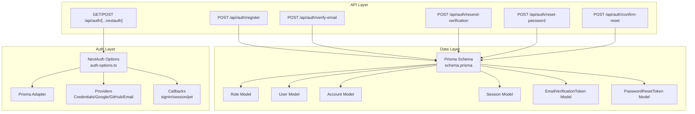
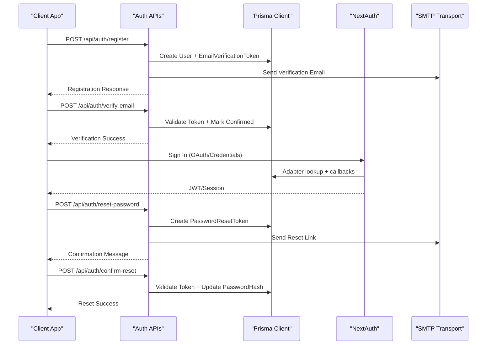
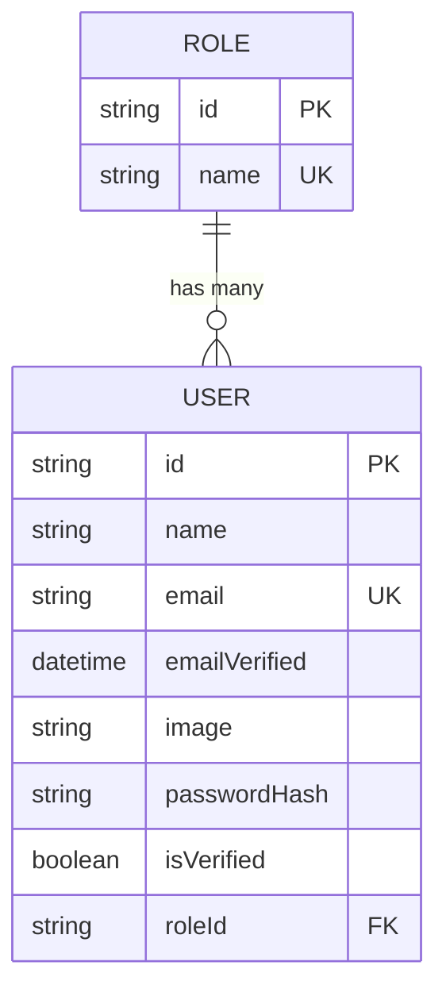
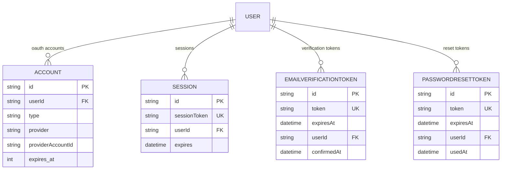
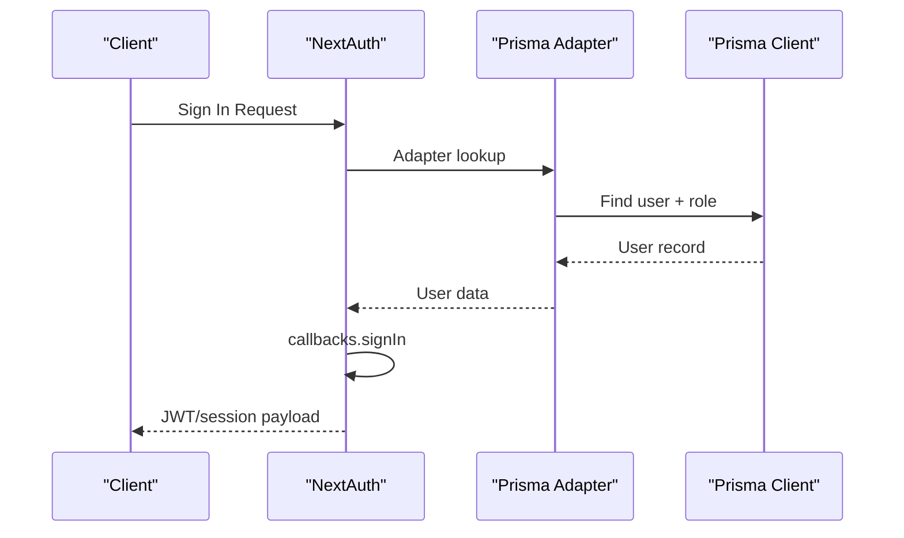
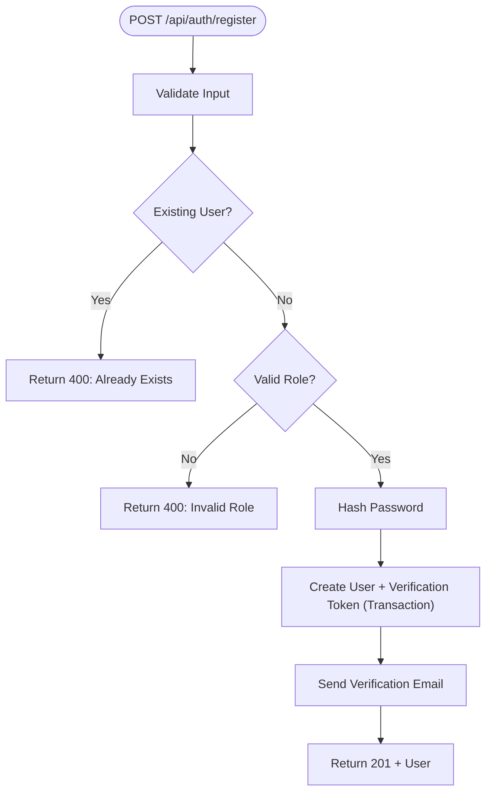
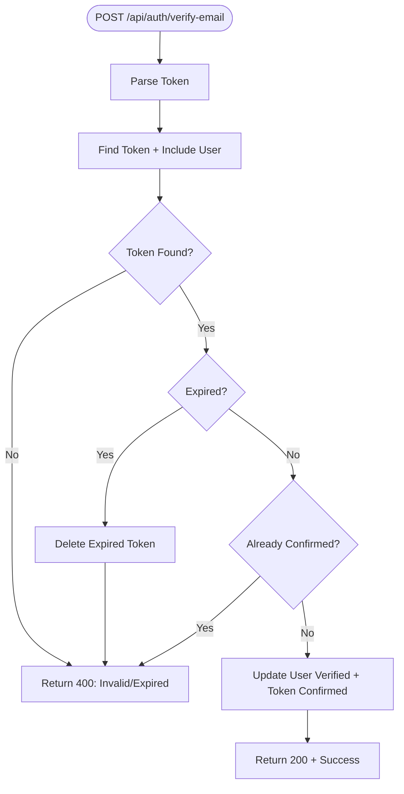
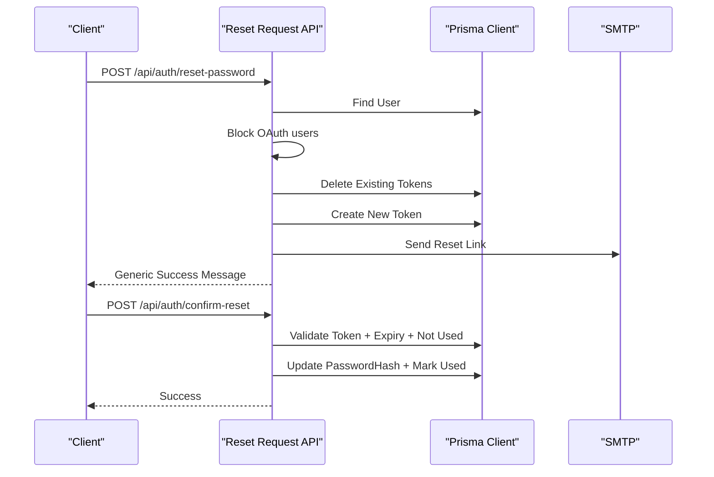
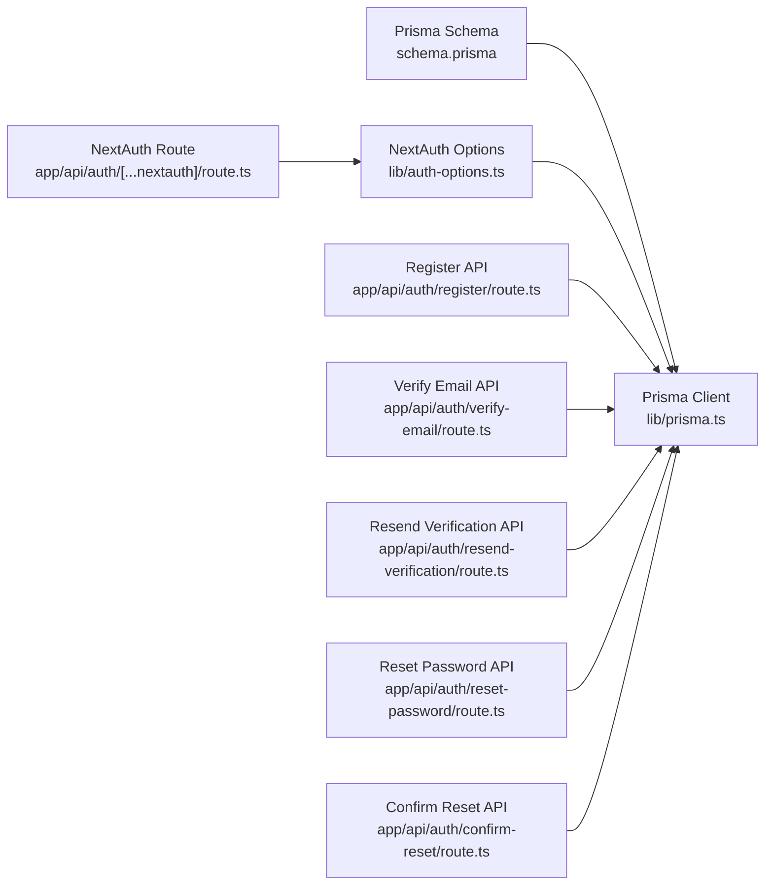

# User Management System

<cite>
**Referenced Files in This Document**
- [schema.prisma](file://frontend/prisma/schema.prisma)
- [auth-options.ts](file://frontend/lib/auth-options.ts)
- [prisma.ts](file://frontend/lib/prisma.ts)
- [route.ts](file://frontend/app/api/auth/[...nextauth]/route.ts)
- [register/route.ts](file://frontend/app/api/auth/register/route.ts)
- [verify-email/route.ts](file://frontend/app/api/auth/verify-email/route.ts)
- [resend-verification/route.ts](file://frontend/app/api/auth/resend-verification/route.ts)
- [reset-password/route.ts](file://frontend/app/api/auth/reset-password/route.ts)
- [confirm-reset/route.ts](file://frontend/app/api/auth/confirm-reset/route.ts)
</cite>

## Table of Contents
1. [Introduction](#introduction)
2. [Project Structure](#project-structure)
3. [Core Components](#core-components)
4. [Architecture Overview](#architecture-overview)
5. [Detailed Component Analysis](#detailed-component-analysis)
6. [Dependency Analysis](#dependency-analysis)
7. [Performance Considerations](#performance-considerations)
8. [Troubleshooting Guide](#troubleshooting-guide)
9. [Conclusion](#conclusion)

## Introduction
This document describes the User Management System data model and authentication flows in TalentSync-Normies. It covers the User and Role models, their relationships, and supporting authentication entities (Account, Session, EmailVerificationToken, PasswordResetToken). It also documents user registration, OAuth integration, session management via NextAuth.js with Prisma adapter, and email verification/password reset workflows. Privacy and security considerations such as password hashing and verification mechanisms are addressed.

## Project Structure
The user management system spans the Prisma schema, NextAuth.js configuration, and API endpoints for registration and authentication operations.

**Diagram sources**
- [schema.prisma](file://frontend/prisma/schema.prisma#L10-L262)
- [auth-options.ts](file://frontend/lib/auth-options.ts#L10-L202)
- [route.ts](file://frontend/app/api/auth/[...nextauth]/route.ts#L1-L7)
- [register/route.ts](file://frontend/app/api/auth/register/route.ts#L68-L176)
- [verify-email/route.ts](file://frontend/app/api/auth/verify-email/route.ts#L9-L84)
- [resend-verification/route.ts](file://frontend/app/api/auth/resend-verification/route.ts#L24-L137)
- [reset-password/route.ts](file://frontend/app/api/auth/reset-password/route.ts#L59-L135)
- [confirm-reset/route.ts](file://frontend/app/api/auth/confirm-reset/route.ts#L11-L89)

**Section sources**
- [schema.prisma](file://frontend/prisma/schema.prisma#L10-L262)
- [auth-options.ts](file://frontend/lib/auth-options.ts#L10-L202)
- [route.ts](file://frontend/app/api/auth/[...nextauth]/route.ts#L1-L7)

## Core Components
This section defines the core data models and their fields, constraints, and relationships.

- Role model
  - Primary key: id (String, UUID generated by default)
  - Unique constraint: name
  - Relations: users (one-to-many)

- User model
  - Primary key: id (String, cuid generated by default)
  - Fields:
    - name: String? (nullable)
    - email: String? (unique)
    - emailVerified: DateTime? (nullable)
    - image: String? (nullable)
    - passwordHash: String? (nullable; optional for OAuth)
    - isVerified: Boolean (default false)
    - roleId: String? (nullable; optional)
  - Relations:
    - role: Role (many-to-one)
    - accounts: Account[] (one-to-many)
    - sessions: Session[] (one-to-many)
    - emailTokens: EmailVerificationToken[] (one-to-many)
    - passwordResetTokens: PasswordResetToken[] (one-to-many)
    - Additional relations to other domain models (e.g., resumes, recruiter, requests)

- Account model
  - Primary key: id (String, cuid generated by default)
  - Unique constraint: provider + providerAccountId
  - Fields:
    - userId: String
    - type: String
    - provider: String
    - providerAccountId: String
    - refresh_token: String? (encrypted storage)
    - access_token: String? (encrypted storage)
    - expires_at: Int?
    - token_type: String?
    - scope: String?
    - id_token: String? (encrypted storage)
    - session_state: String?
  - Relation: user (many-to-one)

- Session model
  - Primary key: id (String, cuid generated by default)
  - Unique constraint: sessionToken
  - Fields:
    - sessionToken: String
    - userId: String
    - expires: DateTime
  - Relation: user (many-to-one)

- EmailVerificationToken model
  - Primary key: id (String, UUID generated by default)
  - Unique constraint: token
  - Fields:
    - token: String
    - expiresAt: DateTime
    - userId: String
    - confirmedAt: DateTime? (nullable)
  - Relation: user (many-to-one)

- PasswordResetToken model
  - Primary key: id (String, UUID generated by default)
  - Unique constraint: token
  - Fields:
    - token: String
    - expiresAt: DateTime
    - userId: String
    - usedAt: DateTime? (nullable)
  - Relation: user (many-to-one)

Relationships and constraints:
- User.roleId references Role.id (fields=[roleId], references=[id])
- Account.userId references User.id with onDelete=Cascade
- Session.userId references User.id with onDelete=Cascade
- EmailVerificationToken.userId references User.id
- PasswordResetToken.userId references User.id

**Section sources**
- [schema.prisma](file://frontend/prisma/schema.prisma#L10-L262)

## Architecture Overview
The system integrates NextAuth.js with Prisma adapter to manage authentication and user sessions. The Prisma schema defines the data model, while API endpoints handle user registration, email verification, and password reset flows. OAuth providers (Google, GitHub) and credentials/email providers are supported.

**Diagram sources**
- [register/route.ts](file://frontend/app/api/auth/register/route.ts#L68-L176)
- [verify-email/route.ts](file://frontend/app/api/auth/verify-email/route.ts#L9-L84)
- [resend-verification/route.ts](file://frontend/app/api/auth/resend-verification/route.ts#L24-L137)
- [reset-password/route.ts](file://frontend/app/api/auth/reset-password/route.ts#L59-L135)
- [confirm-reset/route.ts](file://frontend/app/api/auth/confirm-reset/route.ts#L11-L89)
- [auth-options.ts](file://frontend/lib/auth-options.ts#L10-L202)
- [route.ts](file://frontend/app/api/auth/[...nextauth]/route.ts#L1-L7)

## Detailed Component Analysis

### Data Model: User and Role
The User and Role models define the core identity and authorization structure.

- Role
  - id: UUID primary key
  - name: unique name
- User
  - id: unique identifier
  - email: unique email
  - passwordHash: bcrypt hash for credentials-based auth
  - isVerified: prevents login until email is verified for credentials
  - roleId: optional foreign key to Role
  - image: optional avatar URL

**Diagram sources**
- [schema.prisma](file://frontend/prisma/schema.prisma#L10-L41)

**Section sources**
- [schema.prisma](file://frontend/prisma/schema.prisma#L10-L41)

### Authentication Models: Account, Session, Tokens
These models support OAuth, session management, and verification/reset flows.

- Account
  - Composite unique key: provider + providerAccountId
  - onDelete=Cascade ensures cleanup when user deleted
- Session
  - Unique sessionToken; onDelete=Cascade
- EmailVerificationToken
  - Unique token; tracks expiry and confirmation
- PasswordResetToken
  - Unique token; tracks expiry and usage

**Diagram sources**
- [schema.prisma](file://frontend/prisma/schema.prisma#L228-L262)

**Section sources**
- [schema.prisma](file://frontend/prisma/schema.prisma#L228-L262)

### NextAuth.js Integration with Prisma Adapter
NextAuth.js is configured with:
- Prisma adapter for database-backed sessions and accounts
- Providers: Credentials, Google, GitHub, Email
- Session strategy: JWT
- Callbacks:
  - signIn: handles OAuth verification updates, image propagation, and unverified credential login gating
  - session: injects user id and role into JWT/session
  - jwt: manages token refresh and role/image synchronization
- Events:
  - createUser: marks OAuth users as verified automatically

**Diagram sources**
- [auth-options.ts](file://frontend/lib/auth-options.ts#L10-L202)
- [route.ts](file://frontend/app/api/auth/[...nextauth]/route.ts#L1-L7)
- [prisma.ts](file://frontend/lib/prisma.ts#L1-L10)

**Section sources**
- [auth-options.ts](file://frontend/lib/auth-options.ts#L10-L202)
- [route.ts](file://frontend/app/api/auth/[...nextauth]/route.ts#L1-L7)
- [prisma.ts](file://frontend/lib/prisma.ts#L1-L10)

### User Registration Flow
End-to-end registration with email verification:
- Validates input (name, email, password, role)
- Checks for existing user and role existence
- Hashes password using bcrypt
- Creates user with isVerified=false
- Generates and persists a verification token with 24-hour expiry
- Sends verification email via SMTP
- Returns success message

**Diagram sources**
- [register/route.ts](file://frontend/app/api/auth/register/route.ts#L68-L176)

**Section sources**
- [register/route.ts](file://frontend/app/api/auth/register/route.ts#L68-L176)

### Email Verification Workflow
- Validates token presence
- Finds token and includes user
- Checks expiry and confirmation status
- Updates user isVerified and marks token confirmed atomically
- Returns success

**Diagram sources**
- [verify-email/route.ts](file://frontend/app/api/auth/verify-email/route.ts#L9-L84)

**Section sources**
- [verify-email/route.ts](file://frontend/app/api/auth/verify-email/route.ts#L9-L84)

### Password Reset Workflow
- Validates email
- Finds user (no account existence leakage)
- Blocks OAuth users (no password to reset)
- Deletes existing reset tokens
- Creates new token with 1-hour expiry
- Sends reset email with link
- Confirmation endpoint validates token, marks used, and updates passwordHash

**Diagram sources**
- [reset-password/route.ts](file://frontend/app/api/auth/reset-password/route.ts#L59-L135)
- [confirm-reset/route.ts](file://frontend/app/api/auth/confirm-reset/route.ts#L11-L89)

**Section sources**
- [reset-password/route.ts](file://frontend/app/api/auth/reset-password/route.ts#L59-L135)
- [confirm-reset/route.ts](file://frontend/app/api/auth/confirm-reset/route.ts#L11-L89)

### OAuth Integration Patterns
- Providers: Google, GitHub, Email, Credentials
- signIn callback:
  - Automatically verifies OAuth users
  - Propagates profile image to user if available
  - Blocks credentials login if user is not verified
- events.createUser:
  - Marks OAuth-created users as verified
- callbacks.session/jwt:
  - Ensures role and image propagate to session/JWT

**Section sources**
- [auth-options.ts](file://frontend/lib/auth-options.ts#L10-L202)

### Session Management Strategies
- Session strategy: JWT
- Adapter: Prisma adapter for persistence
- onDelete=Cascade on Account and Session ensures cleanup on user deletion
- Image and role propagated via callbacks to keep session/JWT consistent

**Section sources**
- [auth-options.ts](file://frontend/lib/auth-options.ts#L77-L196)
- [schema.prisma](file://frontend/prisma/schema.prisma#L228-L253)

## Dependency Analysis
The following diagram shows module-level dependencies among the key components.

**Diagram sources**
- [schema.prisma](file://frontend/prisma/schema.prisma#L1-L262)
- [prisma.ts](file://frontend/lib/prisma.ts#L1-L10)
- [auth-options.ts](file://frontend/lib/auth-options.ts#L10-L202)
- [route.ts](file://frontend/app/api/auth/[...nextauth]/route.ts#L1-L7)
- [register/route.ts](file://frontend/app/api/auth/register/route.ts#L1-L176)
- [verify-email/route.ts](file://frontend/app/api/auth/verify-email/route.ts#L1-L84)
- [resend-verification/route.ts](file://frontend/app/api/auth/resend-verification/route.ts#L1-L137)
- [reset-password/route.ts](file://frontend/app/api/auth/reset-password/route.ts#L1-L135)
- [confirm-reset/route.ts](file://frontend/app/api/auth/confirm-reset/route.ts#L1-L89)

**Section sources**
- [schema.prisma](file://frontend/prisma/schema.prisma#L1-L262)
- [auth-options.ts](file://frontend/lib/auth-options.ts#L10-L202)
- [route.ts](file://frontend/app/api/auth/[...nextauth]/route.ts#L1-L7)
- [register/route.ts](file://frontend/app/api/auth/register/route.ts#L1-L176)
- [verify-email/route.ts](file://frontend/app/api/auth/verify-email/route.ts#L1-L84)
- [resend-verification/route.ts](file://frontend/app/api/auth/resend-verification/route.ts#L1-L137)
- [reset-password/route.ts](file://frontend/app/api/auth/reset-password/route.ts#L1-L135)
- [confirm-reset/route.ts](file://frontend/app/api/auth/confirm-reset/route.ts#L1-L89)

## Performance Considerations
- Use unique indexes on frequently queried fields (email, sessionToken, token) to optimize lookups.
- Batch or transactional writes for related operations (e.g., user creation with verification token).
- Consider token expiry cleanup jobs to remove stale tokens periodically.
- Cache role and user metadata in JWT claims to reduce database reads during session validation.

## Troubleshooting Guide
Common issues and resolutions:
- Unverified email prevents credentials login:
  - Ensure verification email is sent and token is valid and unexpired.
  - Use resend endpoint to generate a new token.
- OAuth user not verified:
  - OAuth users are auto-verified; ensure the account has a passwordHash if manual verification is expected.
- Password reset token invalid/expired:
  - Confirm token exists, is not used, and not expired; request a new reset link.
- Session/JWT missing role or image:
  - Verify callbacks.session and callbacks.jwt are functioning; ensure user has a role and image stored.

**Section sources**
- [auth-options.ts](file://frontend/lib/auth-options.ts#L98-L196)
- [verify-email/route.ts](file://frontend/app/api/auth/verify-email/route.ts#L20-L46)
- [confirm-reset/route.ts](file://frontend/app/api/auth/confirm-reset/route.ts#L22-L48)

## Conclusion
The User Management System in TalentSync-Normies combines a robust Prisma data model with NextAuth.js and custom API endpoints to deliver secure, flexible authentication. Users can register with credentials, verify emails, reset passwords, and sign in via OAuth. The design emphasizes data integrity, privacy, and scalability through unique constraints, cascading deletes, and JWT-based sessions.