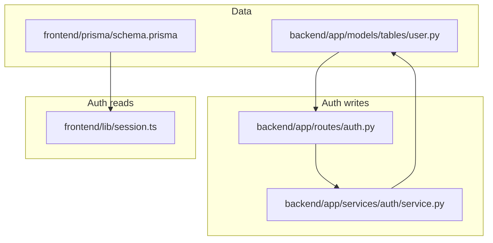
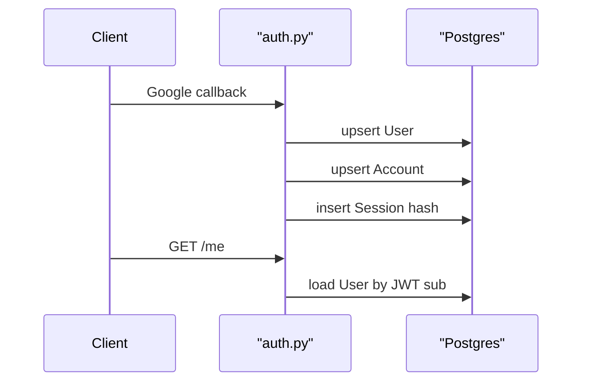
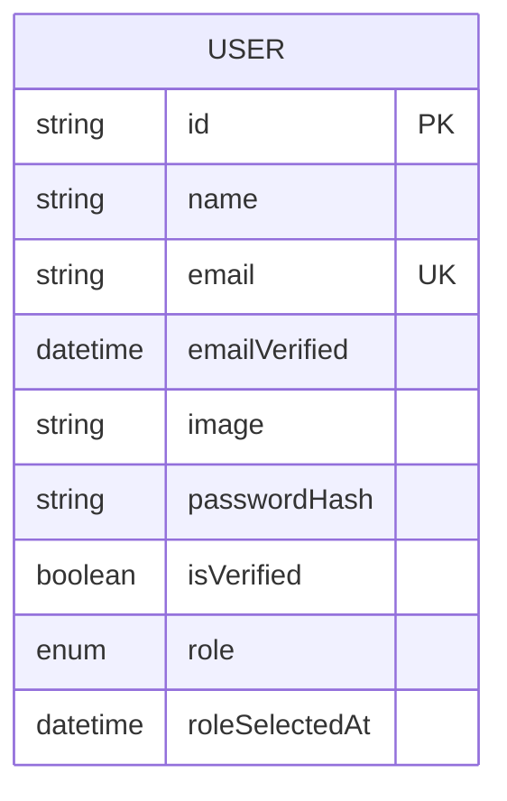
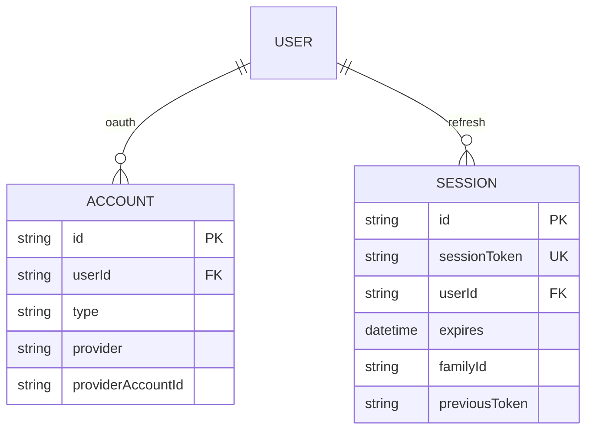
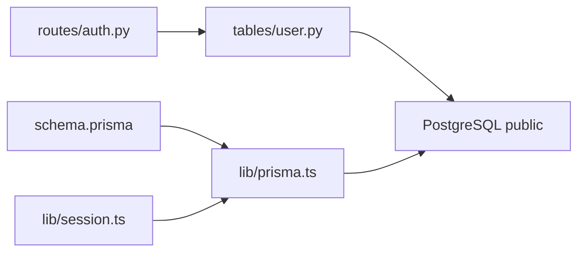

# User management system

Identity tables for TalentSync. Prisma `public` and SQLModel share `User`, `Account`, and `Session`. FastAPI writes sessions. Next.js reads `User` for `getSession()`. NextAuth is gone.

## Repository layout

```mermaid
graph TB
subgraph "Data"
PRISMA["frontend/prisma/schema.prisma"]
SQL["backend/app/models/tables/user.py"]
end
subgraph "Auth writes"
AUTH["backend/app/routes/auth.py"]
SVC["backend/app/services/auth/service.py"]
end
subgraph "Auth reads"
SESS["frontend/lib/session.ts"]
end
PRISMA --> SESS
SQL --> AUTH
AUTH --> SVC
SVC --> SQL
```

- `frontend/prisma/schema.prisma` (`User`, `Account`, `Session`)
- `backend/app/models/tables/user.py`
- `backend/app/models/tables/enums.py` (`UserRole`)
- `backend/app/routes/auth.py`
- `frontend/lib/session.ts`

## Building blocks

- `User`: profile, `passwordHash` leftover, `isVerified`, `role`, `roleSelectedAt`
- `Account`: Google OAuth link (`provider` + `providerAccountId` unique)
- `Session`: hashed refresh token, `familyId`, `previousToken`, HMAC `ipHash` / `userAgentHash`
- `EmailVerificationToken` / `PasswordResetToken`: unused while credentials auth is off
- `VerificationToken`: leftover NextAuth email-provider table. Mapped only so Prisma/SQLModel match the existing schema.

## How it fits together

```mermaid
sequenceDiagram
participant Client
participant Auth as "auth.py"
participant DB as "Postgres"
Client->>Auth : Google callback
Auth->>DB : upsert User
Auth->>DB : upsert Account
Auth->>DB : insert Session hash
Client->>Auth : GET /me
Auth->>DB : load User by JWT sub
```

## User and role

Role is `UserRole` on the user row (`USER`, `RECRUITER`, `ADMIN`). There is no `Role` table.

```mermaid
erDiagram
USER {
  string id PK
  string name
  string email UK
  datetime emailVerified
  string image
  string passwordHash
  boolean isVerified
  enum role
  datetime roleSelectedAt
}
```

`getSession()` selects `id, name, email, image, role, isVerified, roleSelectedAt`.

## Account and session

```mermaid
erDiagram
USER ||--o{ ACCOUNT : "oauth"
USER ||--o{ SESSION : "refresh"
ACCOUNT {
  string id PK
  string userId FK
  string type
  string provider
  string providerAccountId
}
SESSION {
  string id PK
  string sessionToken UK
  string userId FK
  datetime expires
  string familyId
  string previousToken
}
```

Prisma comment on `Session`: owned by the backend. Do not write it from Next.js.

Refresh rotation updates the same row, keeps `familyId`, and stores the previous hash so replay is visible.

## OAuth vs leftover password tables

Google login writes `Account.type = "oauth"`. Password hash and email tokens stay on the schema for `CREDENTIALS_AUTH_ENABLED`.

## Dependencies

```mermaid
graph LR
SCHEMA["schema.prisma"] --> CLIENT["lib/prisma.ts"]
SESS["lib/session.ts"] --> CLIENT
AUTH["routes/auth.py"] --> TABLES["tables/user.py"]
TABLES --> PG["PostgreSQL public"]
CLIENT --> PG
```

## Troubleshooting

- Session row missing but cookie present: refresh was revoked or hashed with a different secret.
- `getSession()` null with a cookie: JWT `sub` does not match a `User.id`, or secret drift.
- Duplicate Google account: unique `(provider, providerAccountId)` conflict; check linking rules in `oauth_login`.
