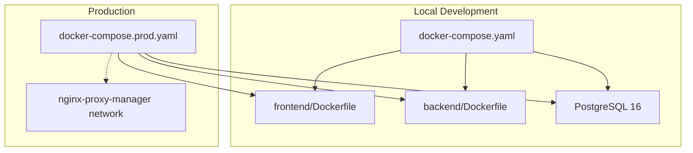
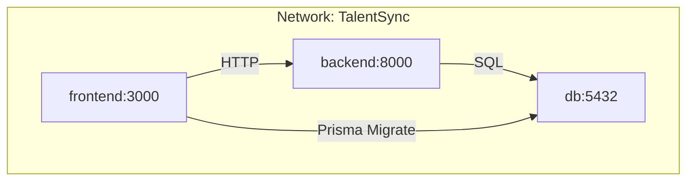
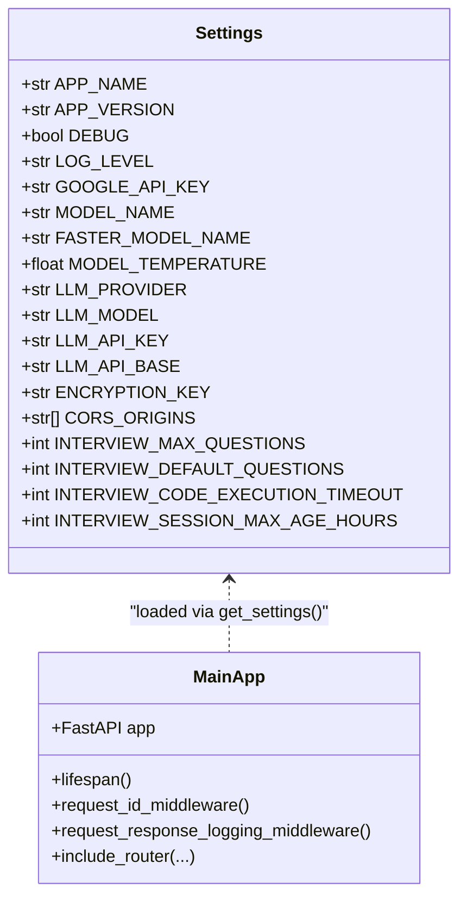
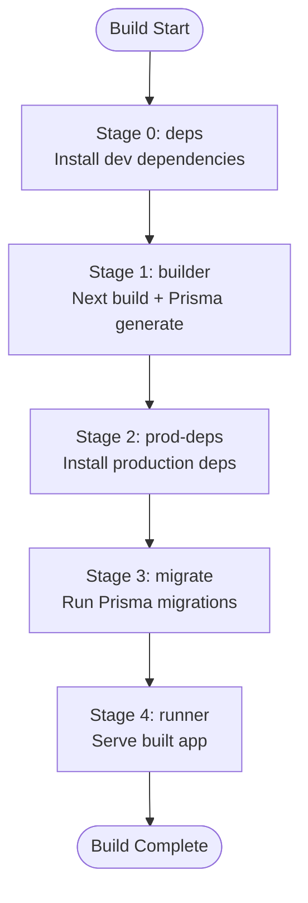
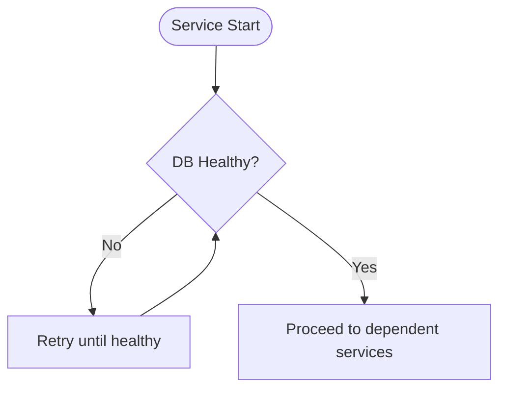
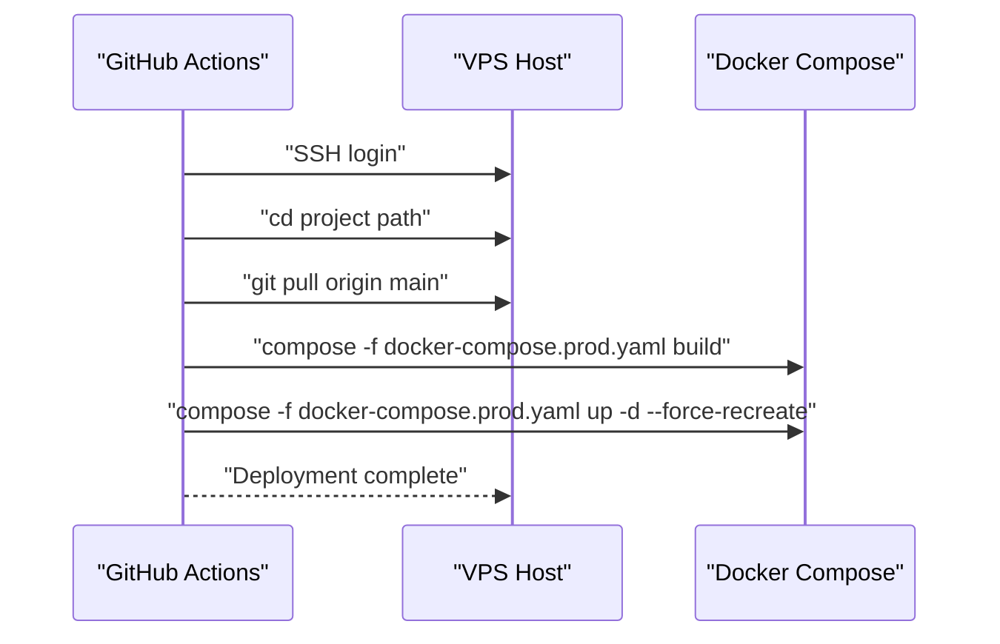
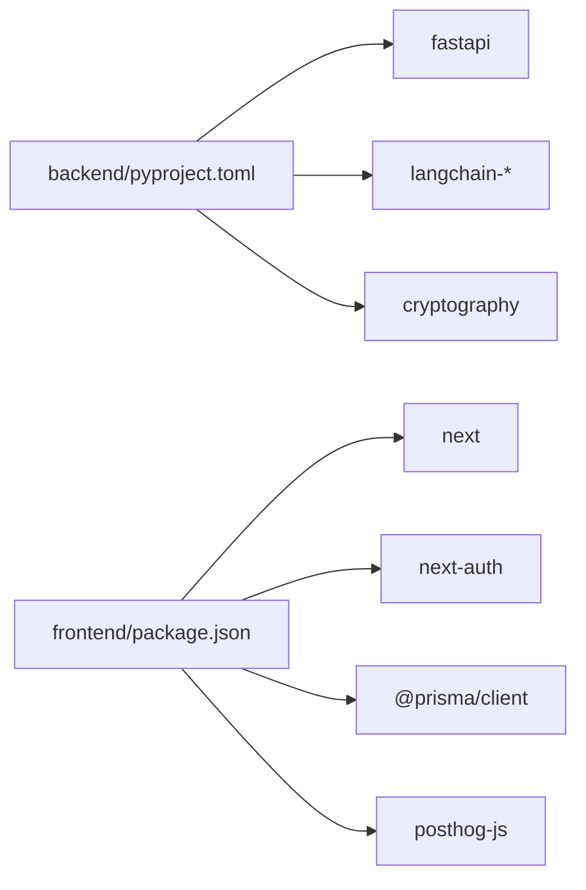

# Deployment & DevOps

<cite>
**Referenced Files in This Document**
- [deploy.yaml](file://.github/workflows/deploy.yaml)
- [docker-compose.yaml](file://docker-compose.yaml)
- [docker-compose.prod.yaml](file://docker-compose.prod.yaml)
- [backend/Dockerfile](file://backend/Dockerfile)
- [frontend/Dockerfile](file://frontend/Dockerfile)
- [backend/.env](file://backend/.env)
- [frontend/.env](file://frontend/.env)
- [.env](file://.env)
- [backend/pyproject.toml](file://backend/pyproject.toml)
- [backend/app/main.py](file://backend/app/main.py)
- [backend/app/core/settings.py](file://backend/app/core/settings.py)
- [frontend/package.json](file://frontend/package.json)
</cite>

## Table of Contents
1. [Introduction](#introduction)
2. [Project Structure](#project-structure)
3. [Core Components](#core-components)
4. [Architecture Overview](#architecture-overview)
5. [Detailed Component Analysis](#detailed-component-analysis)
6. [Dependency Analysis](#dependency-analysis)
7. [Performance Considerations](#performance-considerations)
8. [Troubleshooting Guide](#troubleshooting-guide)
9. [Conclusion](#conclusion)
10. [Appendices](#appendices)

## Introduction
This document provides comprehensive deployment and DevOps guidance for the TalentSync-Normies platform. It covers Docker configuration with multi-stage builds, service orchestration using Docker Compose, environment variable management, CI/CD with GitHub Actions, production deployment strategies, infrastructure provisioning, database setup, monitoring and logging, health checks and alerting, backup and disaster recovery, and troubleshooting and performance optimization.

## Project Structure
The platform consists of:
- Backend service built with Python and FastAPI, exposing APIs for ATS evaluation, resume analysis, cold mail generation, cover letter generation, hiring assistant, and interview support.
- Frontend Next.js application using Bun for building and runtime, with Prisma for database operations.
- PostgreSQL database for persistent storage.
- Docker Compose for local development and production orchestration.
- GitHub Actions workflow for automated deployment to a VPS.

**Diagram sources**
- [docker-compose.yaml](file://docker-compose.yaml#L1-L78)
- [docker-compose.prod.yaml](file://docker-compose.prod.yaml#L1-L105)
- [backend/Dockerfile](file://backend/Dockerfile#L1-L33)
- [frontend/Dockerfile](file://frontend/Dockerfile#L1-L110)

**Section sources**
- [docker-compose.yaml](file://docker-compose.yaml#L1-L78)
- [docker-compose.prod.yaml](file://docker-compose.prod.yaml#L1-L105)

## Core Components
- Backend service
  - Built with Python 3.13 and FastAPI.
  - Exposes multiple API routes for ATS evaluation, resume analysis, cold mail, cover letters, hiring assistant, tailored resume, tips, and interview features.
  - Uses environment-driven configuration via Pydantic settings.
  - Health and logging middleware are integrated.
- Frontend service
  - Next.js application built with Bun and TypeScript.
  - Multi-stage Docker build: deps, builder, prod-deps, migrate, runner.
  - Prisma migrations run during a dedicated migration stage.
- Database
  - PostgreSQL 16 with persistent volume for data durability.
- Orchestration
  - Local development via docker-compose.yaml.
  - Production via docker-compose.prod.yaml with health checks and external network integration.

**Section sources**
- [backend/app/main.py](file://backend/app/main.py#L1-L203)
- [backend/app/core/settings.py](file://backend/app/core/settings.py#L1-L50)
- [backend/Dockerfile](file://backend/Dockerfile#L1-L33)
- [frontend/Dockerfile](file://frontend/Dockerfile#L1-L110)
- [docker-compose.yaml](file://docker-compose.yaml#L1-L78)
- [docker-compose.prod.yaml](file://docker-compose.prod.yaml#L1-L105)

## Architecture Overview
The system comprises three primary containers orchestrated by Docker Compose:
- Frontend: Next.js application with Prisma migrations executed in a separate stage.
- Backend: FastAPI application serving REST endpoints.
- Database: PostgreSQL 16 with health checks and persistent storage.

**Diagram sources**
- [docker-compose.yaml](file://docker-compose.yaml#L3-L78)
- [docker-compose.prod.yaml](file://docker-compose.prod.yaml#L1-L105)

## Detailed Component Analysis

### Backend Service
- Build and runtime
  - Multi-stage Docker build targeting Python 3.13 slim image.
  - Dependency installation via uv with caching.
  - Application code copied and exposed on port 8000.
- Environment configuration
  - Settings loaded from .env with Pydantic BaseSettings.
  - Includes API metadata, LLM provider configuration, CORS, and interview parameters.
- Application lifecycle
  - FastAPI app configured with CORS middleware and request/response logging.
  - Routes organized under v1 and v2 namespaces for backward compatibility and feature evolution.

**Diagram sources**
- [backend/app/core/settings.py](file://backend/app/core/settings.py#L1-L50)
- [backend/app/main.py](file://backend/app/main.py#L1-L203)

**Section sources**
- [backend/Dockerfile](file://backend/Dockerfile#L1-L33)
- [backend/app/core/settings.py](file://backend/app/core/settings.py#L1-L50)
- [backend/app/main.py](file://backend/app/main.py#L1-L203)
- [backend/pyproject.toml](file://backend/pyproject.toml#L1-L42)

### Frontend Service
- Multi-stage Docker build
  - deps: installs dev dependencies.
  - builder: builds Next.js app and generates Prisma client.
  - prod-deps: installs production-only dependencies.
  - migrate: one-shot Prisma migrations.
  - runner: slim runtime serving the built app.
- Build-time configuration
  - Accepts PostHog keys via build args.
  - NODE_ENV set to production in builder and runner stages.
- Runtime behavior
  - Prisma migrations executed via a dedicated migration stage before starting the runner.
  - Starts Next.js in production mode.

**Diagram sources**
- [frontend/Dockerfile](file://frontend/Dockerfile#L1-L110)

**Section sources**
- [frontend/Dockerfile](file://frontend/Dockerfile#L1-L110)
- [frontend/package.json](file://frontend/package.json#L1-L114)

### Database Service
- PostgreSQL 16 image with health check.
- Persistent volume for data durability.
- Environment variables sourced from .env for credentials and database name.
- Health check uses pg_isready against localhost with configured credentials.

**Diagram sources**
- [docker-compose.prod.yaml](file://docker-compose.prod.yaml#L15-L23)

**Section sources**
- [docker-compose.prod.yaml](file://docker-compose.prod.yaml#L1-L105)

### CI/CD Pipeline with GitHub Actions
- Workflow triggers on pushes to main branch.
- Steps:
  - Checkout repository.
  - SSH into VPS using secrets.
  - Pull latest code.
  - Build and start services using docker-compose.prod.yaml.
- Secrets required:
  - VPS_HOST, VPS_USER, SSH_PRIVATE_KEY, VPS_PROJECT_PATH.

**Diagram sources**
- [.github/workflows/deploy.yaml](file://.github/workflows/deploy.yaml#L1-L42)

**Section sources**
- [.github/workflows/deploy.yaml](file://.github/workflows/deploy.yaml#L1-L42)

### Environment Configuration Management
- Centralized environment variables
  - Root .env and per-service .env files (.env, backend/.env, frontend/.env).
  - Variables include database credentials, OAuth clients, email settings, JWT secrets, API keys, and analytics keys.
- Variable precedence and usage
  - Docker Compose env_file loads variables from .env files.
  - DATABASE_URL constructed from POSTGRES_* variables.
  - Frontend NEXTAUTH_URL and BACKEND_URL configured for internal and external access.
- Security considerations
  - Encryption key and secrets are present in .env files; ensure secrets are managed securely in CI/CD and production environments.

**Section sources**
- [.env](file://.env#L1-L26)
- [backend/.env](file://backend/.env#L1-L26)
- [frontend/.env](file://frontend/.env#L1-L27)
- [docker-compose.yaml](file://docker-compose.yaml#L7-L63)
- [docker-compose.prod.yaml](file://docker-compose.prod.yaml#L5-L83)

## Dependency Analysis
- Backend dependencies
  - Core: FastAPI, asyncpg, datetime, cryptography.
  - LLM integrations: langchain, langchain-google-genai, langchain-openai, langchain-anthropic, langchain-ollama, tavily-python, gitingest.
  - Utilities: numpy, pydantic-settings, python-dotenv, httpx, sse-starlette, bs4, pymupdf, pymupdf4llm.
- Frontend dependencies
  - Next.js, NextAuth, Prisma client, PostHog JS, react ecosystem, nodemailer, recharts, mermaid, sharp, zod.

**Diagram sources**
- [backend/pyproject.toml](file://backend/pyproject.toml#L1-L42)
- [frontend/package.json](file://frontend/package.json#L17-L85)

**Section sources**
- [backend/pyproject.toml](file://backend/pyproject.toml#L1-L42)
- [frontend/package.json](file://frontend/package.json#L1-L114)

## Performance Considerations
- Containerization
  - Multi-stage builds reduce final image size and improve startup times.
  - Use production-only dependencies in the frontend prod-deps stage.
- Database
  - Health checks ensure readiness before starting dependent services.
  - Persistent volume prevents data loss and supports scaling strategies.
- Application logging
  - Structured request/response logging aids performance diagnostics.
- Observability
  - Integrate metrics and tracing in future enhancements for deeper insights.

[No sources needed since this section provides general guidance]

## Troubleshooting Guide
- Health checks failing
  - Verify PostgreSQL health check configuration and credentials.
  - Confirm service_healthy conditions in docker-compose.prod.yaml.
- Migration failures
  - Ensure the frontend migrate stage completes successfully before starting the runner.
  - Check Prisma configuration and database connectivity.
- Environment variables
  - Validate .env files and ensure required variables are present.
  - Confirm DATABASE_URL construction and NEXTAUTH_URL alignment with deployment domain.
- CI/CD deployment
  - Confirm SSH access to VPS and availability of secrets.
  - Verify docker-compose.prod.yaml path and permissions on the VPS.

**Section sources**
- [docker-compose.prod.yaml](file://docker-compose.prod.yaml#L15-L23)
- [docker-compose.prod.yaml](file://docker-compose.prod.yaml#L44-L79)
- [docker-compose.prod.yaml](file://docker-compose.prod.yaml#L84-L93)
- [.github/workflows/deploy.yaml](file://.github/workflows/deploy.yaml#L22-L41)

## Conclusion
The TalentSync-Normies platform leverages robust Docker multi-stage builds, orchestrated services with Docker Compose, and a streamlined GitHub Actions deployment pipeline. By adhering to environment variable management best practices, implementing health checks, and establishing secure CI/CD workflows, the platform achieves reliable deployments suitable for production environments. Future enhancements can focus on observability, autoscaling, and advanced backup strategies.

[No sources needed since this section summarizes without analyzing specific files]

## Appendices

### Production Deployment Strategies
- Infrastructure
  - Use a VPS or managed Kubernetes cluster for container orchestration.
  - External load balancing via nginx-proxy-manager or equivalent.
- Scaling
  - Stateless frontend and backend services can scale horizontally.
  - Database scaling via read replicas and connection pooling.
- Security
  - Store secrets in a secure secret manager and mount as environment variables.
  - Enable HTTPS termination at the reverse proxy.

[No sources needed since this section provides general guidance]

### Monitoring and Logging
- Backend
  - Structured logging middleware captures request/response payloads and durations.
  - Integrate centralized logging and metrics collection for production visibility.
- Frontend
  - Use PostHog for product analytics and telemetry.
- Alerts
  - Configure health check alerts and log-based alerting for critical failures.

[No sources needed since this section provides general guidance]

### Backup and Disaster Recovery
- Database backups
  - Schedule regular logical backups of PostgreSQL data.
  - Test restoration procedures periodically.
- Artifact retention
  - Retain container images and deployment artifacts for rollback scenarios.
- DR procedures
  - Define RTO/RPO targets and automate failover to secondary regions.

[No sources needed since this section provides general guidance]