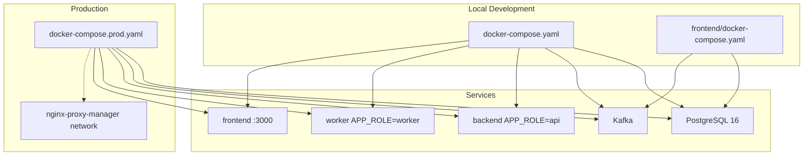
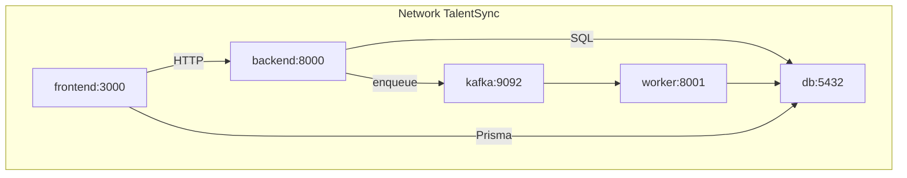
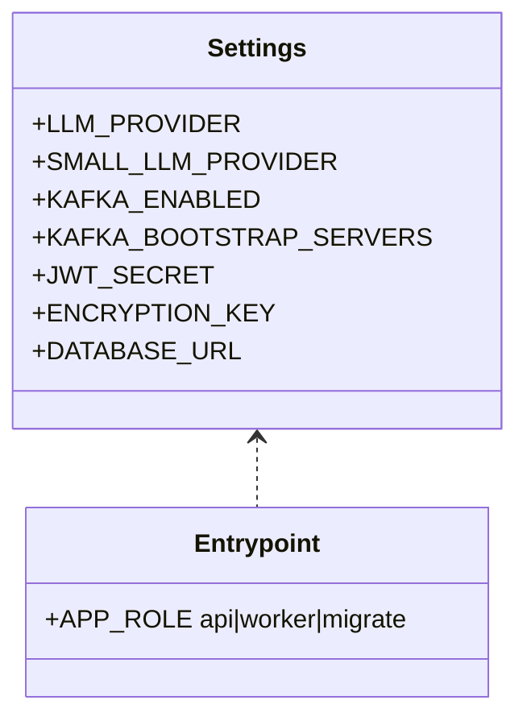
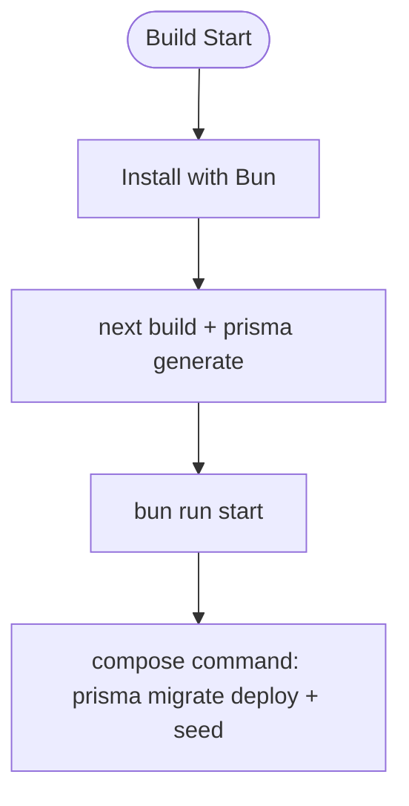
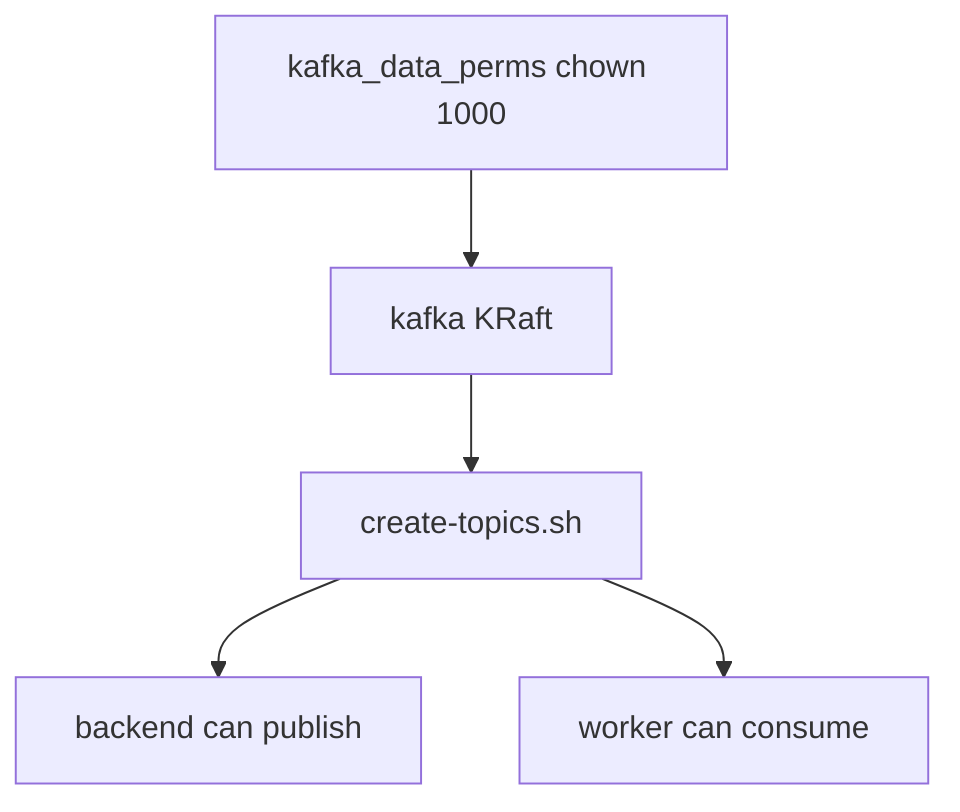
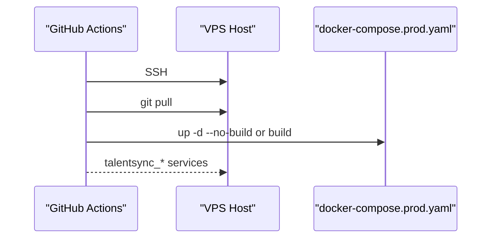
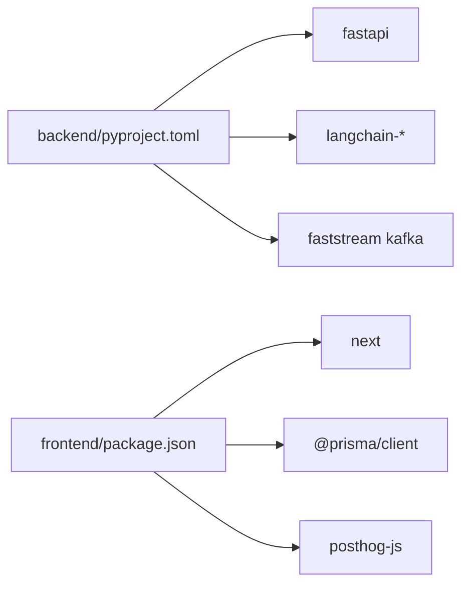

# Deployment and DevOps

Deploy the job-seeker TalentSync stack with Docker Compose. Kafka is required for AI routes. This file is not TalentSync-HR.

## Repository layout

- Backend: Python 3.13 FastAPI. One image, `APP_ROLE` = `api` | `worker` | `migrate`
- Frontend: Next.js + Bun + Prisma migrate/seed
- Postgres 16
- Kafka 3.9.1 KRaft, topics via `infra/kafka/create-topics.sh`
- Admin console + admin API on Compose profile `admin`
- GitHub Actions → VPS using `docker-compose.prod.yaml`

```mermaid
graph TB
subgraph "Local Development"
DC["docker-compose.yaml"]
HOST["frontend/docker-compose.yaml"]
end
subgraph "Production"
DCP["docker-compose.prod.yaml"]
NPM["nginx-proxy-manager network"]
end
subgraph "Services"
DB["PostgreSQL 16"]
K["Kafka"]
BE["backend APP_ROLE=api"]
W["worker APP_ROLE=worker"]
FE["frontend :3000"]
end
DC --> DB
DC --> K
DC --> BE
DC --> W
DC --> FE
HOST --> DB
HOST --> K
DCP --> DB
DCP --> K
DCP --> BE
DCP --> W
DCP --> FE
DCP -.-> NPM
```

## Building blocks

- Backend image
  - `backend/Dockerfile` + `backend/docker-entrypoint.sh`
  - `APP_ROLE=api`: uvicorn `app.main:app` :8000
  - `APP_ROLE=worker`: uvicorn `app.stream.asgi:asgi_app` :8001
  - `APP_ROLE=migrate`: `alembic upgrade head`
- Frontend image
  - Multi-stage Bun build, Prisma generate
  - Dev compose runs `bunx prisma migrate deploy && bun prisma/seed.ts && bun run start`
- Kafka
  - `apache/kafka:3.9.1`, KRaft, replication factor 1
  - Dev publishes 29092 for host backends and 8085 for kafka-ui
  - Prod has no host listener
- Admin (optional)
  - `admin_backend` :8010 on `admin_net`
  - Console :3010. Prod binds Tailscale, not the public NIC

## How it fits together

```mermaid
graph TB
subgraph "Network TalentSync"
FE["frontend:3000"]
BE["backend:8000"]
W["worker:8001"]
K["kafka:9092"]
DB["db:5432"]
end
FE --> |"HTTP"| BE
BE --> |"enqueue"| K
K --> W
BE --> |"SQL"| DB
W --> DB
FE --> |"Prisma"| DB
```

See `KAFKA_MIGRATION.md`. Metered AI always enqueues. `KAFKA_ENABLED=false` makes those routes 503.

## Backend service

Settings from `.env` via Pydantic. LLM primary/small roles, Kafka block, JWT, encryption, CORS.

Dev compose sets `RUN_MIGRATIONS_ON_START=true` on the api replica only. Prod uses a dedicated `talentsync_backend_migrate` service and leaves api/worker at false.

```mermaid
classDiagram
class Settings {
+LLM_PROVIDER
+SMALL_LLM_PROVIDER
+KAFKA_ENABLED
+KAFKA_BOOTSTRAP_SERVERS
+JWT_SECRET
+ENCRYPTION_KEY
+DATABASE_URL
}
class Entrypoint {
+APP_ROLE api|worker|migrate
}
Settings <.. Entrypoint
```

## Frontend service

```mermaid
flowchart TD
Start(["Build Start"]) --> Deps["Install with Bun"]
Deps --> Builder["next build + prisma generate"]
Builder --> Runner["bun run start"]
Runner --> Migrate["compose command: prisma migrate deploy + seed"]
```

`NEXTAUTH_URL` in compose is leftover naming for the public origin. Auth is Google OAuth on FastAPI.

## Database service

Postgres 16, volume, `pg_isready`. Dev also mounts `infra/postgres/init` and `admin_grants.sql`.

## Kafka

```mermaid
flowchart TD
Perms["kafka_data_perms chown 1000"] --> Broker["kafka KRaft"]
Broker --> Topics["create-topics.sh"]
Topics --> API["backend can publish"]
Topics --> Worker["worker can consume"]
```

Dev UI: http://localhost:8085. Host bootstrap: `localhost:29092`. Compose-internal: `kafka:9092` or `talentsync_kafka:9092` in prod.

## CI/CD

Push to main, SSH to VPS, `docker compose --env-file .env -f docker-compose.prod.yaml up`. Images may already be in GHCR (`BACKEND_IMAGE`, `FRONTEND_IMAGE`, admin tags).

```mermaid
sequenceDiagram
participant GH as "GitHub Actions"
participant VPS as "VPS Host"
participant DC as "docker-compose.prod.yaml"
GH->>VPS : SSH
GH->>VPS : git pull
GH->>DC : up -d --no-build or build
GH-->>VPS : talentsync_* services
```

Prod service names use the `talentsync_` prefix so they never collide with TalentSync-HR.

## Environment

Root `.env` from `.env.example`. Compose `env_file: ./.env`.

Need: `POSTGRES_*`, `DATABASE_URL`, `JWT_SECRET`, `ENCRYPTION_KEY`, Google OAuth, `LLM_*` / `SMALL_LLM_*`, `KAFKA_*`, Razorpay keys for billing, `ADMIN_API_KEY` if you start admin.

Do not commit secrets. Do not put keys in the YAML.

## Dependencies

```mermaid
graph LR
BE["backend/pyproject.toml"] --> FastAPI["fastapi"]
BE --> LangChain["langchain-*"]
BE --> FS["faststream kafka"]
FE["frontend/package.json"] --> Next["next"]
FE --> Prisma["@prisma/client"]
FE --> PostHog["posthog-js"]
```

No `next-auth` package.

## Performance

Multi-stage frontend. uv cache on backend. Worker memory is the expensive part; scale lanes, not API replicas, for LLM load. Single Kafka broker is an accepted SPOF; job payloads live in Postgres.

## Troubleshooting

- DB healthcheck: credentials and `pg_isready`
- Prisma migrate: `DATABASE_URL` host `db` vs `localhost`
- Alembic: api or migrate role must reach Postgres
- Kafka volume permissions: `kafka_data_perms` must run first
- AI 503: Kafka down or `KAFKA_ENABLED` false
- OAuth: `GOOGLE_REDIRECT_URI` vs Cloud Console
- Admin config 503: `ADMIN_DATABASE_URL` must use `ts_admin`

## Appendix

### Production notes

- NPM terminates TLS for talentsync.tashif.codes
- Workers stay off the proxy network
- Admin console is Tailscale-only in prod
- Observability profile: Prometheus 9090, Grafana 3001

### Backups

- `pg_dump` the database. Kafka is transport; republish `QUEUED` jobs after a lost broker volume
- Keep `backend/uploads` on a volume
