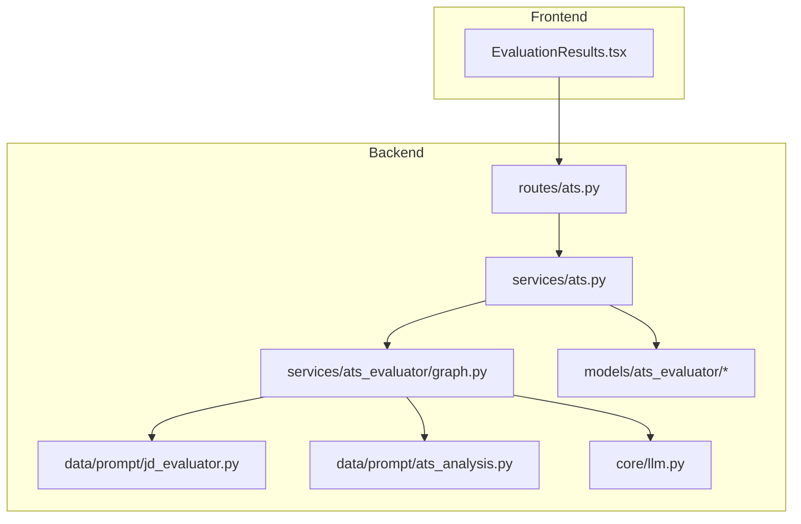
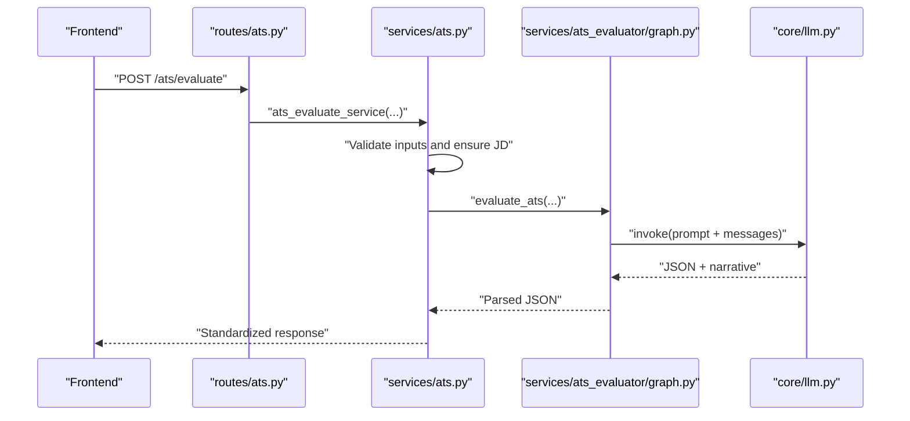
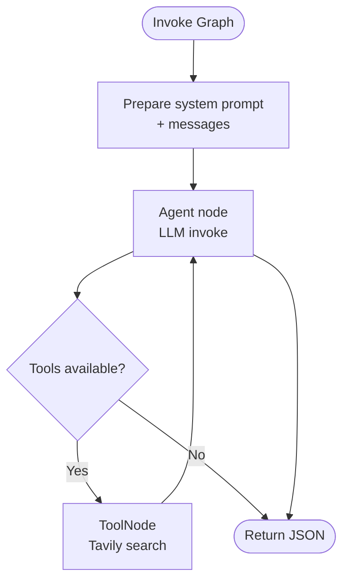
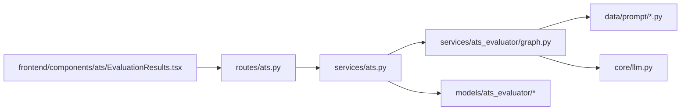

# ATS Evaluation Algorithm

<cite>
**Referenced Files in This Document**
- [graph.py](file://backend/app/services/ats_evaluator/graph.py)
- [ats.py](file://backend/app/services/ats.py)
- [schemas.py](file://backend/app/models/ats_evaluator/schemas.py)
- [response.py](file://backend/app/models/ats_evaluator/response.py)
- [jd_evaluator.py](file://backend/app/data/prompt/jd_evaluator.py)
- [ats_analysis.py](file://backend/app/data/prompt/ats_analysis.py)
- [llm.py](file://backend/app/core/llm.py)
- [ats.py](file://backend/app/routes/ats.py)
- [EvaluationResults.tsx](file://frontend/components/ats/EvaluationResults.tsx)
</cite>

## Table of Contents
1. [Introduction](#introduction)
2. [Project Structure](#project-structure)
3. [Core Components](#core-components)
4. [Architecture Overview](#architecture-overview)
5. [Detailed Component Analysis](#detailed-component-analysis)
6. [Dependency Analysis](#dependency-analysis)
7. [Performance Considerations](#performance-considerations)
8. [Troubleshooting Guide](#troubleshooting-guide)
9. [Conclusion](#conclusion)

## Introduction
This document explains the ATS evaluation algorithm implemented in the backend and how it integrates with the frontend to compare resume content against job descriptions. It covers:
- Keyword matching methodology and scoring mechanisms
- The LangChain graph orchestration
- Prompt engineering techniques used to extract structured insights
- Normalization of raw analysis output into standardized response formats
- Performance optimization and caching strategies for large-scale evaluations

## Project Structure
The ATS evaluation spans backend services, prompts, models, routing, and frontend display components. The backend orchestrates the evaluation via a LangGraph state machine, while the frontend renders the resulting score and suggestions.

**Diagram sources**
- [EvaluationResults.tsx](file://frontend/components/ats/EvaluationResults.tsx#L1-L177)
- [ats.py](file://backend/app/routes/ats.py#L1-L184)
- [ats.py](file://backend/app/services/ats.py#L1-L214)
- [graph.py](file://backend/app/services/ats_evaluator/graph.py#L1-L209)
- [jd_evaluator.py](file://backend/app/data/prompt/jd_evaluator.py#L1-L184)
- [ats_analysis.py](file://backend/app/data/prompt/ats_analysis.py#L1-L69)
- [schemas.py](file://backend/app/models/ats_evaluator/schemas.py#L1-L44)
- [llm.py](file://backend/app/core/llm.py#L1-L181)

**Section sources**
- [ats.py](file://backend/app/routes/ats.py#L1-L184)
- [ats.py](file://backend/app/services/ats.py#L1-L214)
- [graph.py](file://backend/app/services/ats_evaluator/graph.py#L1-L209)
- [jd_evaluator.py](file://backend/app/data/prompt/jd_evaluator.py#L1-L184)
- [ats_analysis.py](file://backend/app/data/prompt/ats_analysis.py#L1-L69)
- [schemas.py](file://backend/app/models/ats_evaluator/schemas.py#L1-L44)
- [llm.py](file://backend/app/core/llm.py#L1-L181)
- [EvaluationResults.tsx](file://frontend/components/ats/EvaluationResults.tsx#L1-L177)

## Core Components
- Input models define the shape of incoming requests and expected responses for ATS evaluation.
- The evaluation service validates inputs, retrieves or enriches the job description, and invokes the evaluator graph.
- The evaluator graph builds a LangGraph state machine that interacts with the LLM and optional tools.
- Prompts guide the LLM to extract keywords, compute scores, and return structured JSON aligned with the response schema.
- Frontend components render the normalized results.

Key responsibilities:
- Input validation and normalization
- Job description retrieval/enrichment
- Structured JSON extraction and parsing
- Rendering of match score and suggestions

**Section sources**
- [schemas.py](file://backend/app/models/ats_evaluator/schemas.py#L1-L44)
- [response.py](file://backend/app/models/ats_evaluator/response.py#L1-L19)
- [ats.py](file://backend/app/services/ats.py#L22-L214)
- [graph.py](file://backend/app/services/ats_evaluator/graph.py#L41-L209)
- [jd_evaluator.py](file://backend/app/data/prompt/jd_evaluator.py#L1-L184)
- [ats_analysis.py](file://backend/app/data/prompt/ats_analysis.py#L1-L69)
- [EvaluationResults.tsx](file://frontend/components/ats/EvaluationResults.tsx#L1-L177)

## Architecture Overview
The system follows a request-driven pipeline:
- The frontend submits a request with resume text and either a raw job description or a link.
- The backend route parses the request, validates it, and delegates to the evaluation service.
- The service ensures a valid job description, normalizes outputs, and returns a standardized response.
- The evaluator graph compiles a LangGraph with an agent node and optional tool nodes, invoking the LLM with a prepared prompt.

**Diagram sources**
- [ats.py](file://backend/app/routes/ats.py#L50-L184)
- [ats.py](file://backend/app/services/ats.py#L22-L214)
- [graph.py](file://backend/app/services/ats_evaluator/graph.py#L116-L209)
- [llm.py](file://backend/app/core/llm.py#L110-L181)

## Detailed Component Analysis

### Keyword Matching Methodology
The system extracts and compares keywords from the job description against the resume. The prompt defines the categories and metrics used for scoring, including:
- Required and optional keyword coverage
- Found and missing keywords lists
- Recommended keywords derived from the comparison

Implementation highlights:
- The prompt instructs extraction of required and optional keywords from the JD and compares them to the resume content.
- The evaluator returns structured fields for found_keywords, missing_keywords, and recommended_keywords.
- The service normalizes these lists into the final response.

Example behaviors:
- Required keyword coverage is computed as a ratio of matched required keywords to total required keywords.
- Optional keyword coverage reflects partial matches and recommendations for improvement.

**Section sources**
- [ats_analysis.py](file://backend/app/data/prompt/ats_analysis.py#L21-L54)
- [graph.py](file://backend/app/services/ats_evaluator/graph.py#L116-L209)
- [ats.py](file://backend/app/services/ats.py#L106-L191)

### Scoring Mechanism and Compatibility Percentages
The prompt prescribes a composite score calculation that blends multiple dimensions:
- Semantic similarity to the job description
- ATS compatibility (contact info completeness, content quality, structure/formatting)
- Keyword coverage (required and optional)
- Keyword density (keywords per 100 words)

The evaluator returns a composite score (0–100) and per-category scores (0–1). The frontend displays the score out of 100 and provides contextual labels.

Normalization:
- The service ensures numeric types for score and coerces lists for reasons and suggestions.
- The response schema aligns with the frontend expectations.

**Section sources**
- [ats_analysis.py](file://backend/app/data/prompt/ats_analysis.py#L23-L32)
- [ats.py](file://backend/app/services/ats.py#L141-L191)
- [EvaluationResults.tsx](file://frontend/components/ats/EvaluationResults.tsx#L25-L42)

### LangChain Graph Orchestration
The evaluator graph composes a minimal state machine:
- Nodes: agent (invokes the LLM with a prepared system prompt)
- Optional: tools (search tool bound to the LLM)
- Edges: START → agent → END; conditional edges to tools if available

Key elements:
- System prompt is built from resume, job description, company name, and optional website content.
- The graph enforces JSON-first output by sending a directive message to the LLM.
- JSON parsing is robust, handling fenced code blocks and partial extractions.

**Diagram sources**
- [graph.py](file://backend/app/services/ats_evaluator/graph.py#L92-L113)
- [graph.py](file://backend/app/services/ats_evaluator/graph.py#L116-L209)

**Section sources**
- [graph.py](file://backend/app/services/ats_evaluator/graph.py#L41-L113)
- [graph.py](file://backend/app/services/ats_evaluator/graph.py#L116-L209)

### Prompt Engineering Techniques
Two complementary prompts are used:
- JD Evaluator prompt: A 100-point rubric with explicit scoring categories, synonym normalization rules, and strict JSON schema requirements.
- ATS Analysis prompt: A broader analysis focused on ATS compatibility, keyword coverage, and recommendations.

Techniques:
- Explicit rubrics and scoring bands for each dimension
- Controlled synonym mapping to expand matches
- Strict JSON schema enforcement with examples
- Directive to return JSON first to simplify parsing

These prompts guide the LLM to produce structured, comparable outputs suitable for downstream normalization.

**Section sources**
- [jd_evaluator.py](file://backend/app/data/prompt/jd_evaluator.py#L3-L184)
- [ats_analysis.py](file://backend/app/data/prompt/ats_analysis.py#L4-L68)

### Normalization to Standardized Response Formats
The service normalizes raw LLM outputs into a standardized response:
- Ensures presence of success flag, message, score, reasons_for_the_score, and suggestions
- Coerces types and formats lists appropriately
- Wraps the result in a validated response model

This guarantees consistent consumption by the frontend and downstream systems.

**Section sources**
- [ats.py](file://backend/app/services/ats.py#L141-L191)
- [response.py](file://backend/app/models/ats_evaluator/response.py#L14-L19)

### Examples: Keyword Matches, Weights, and Compatibility Scores
Below are representative examples of how the system operates conceptually:
- Keyword identification: Required and preferred keywords are extracted from the job description and compared to the resume text.
- Weighted coverage: Required keywords carry higher weight than optional ones; missing required keywords reduce the composite score more than missing optional keywords.
- Compatibility score: The composite score blends per-category scores (semantic similarity, ATS compatibility, contact completeness, content quality, structure, keyword coverage, keyword density).

Note: The exact numerical calculations are produced by the LLM guided by the prompt and are normalized by the service into the final response.

**Section sources**
- [ats_analysis.py](file://backend/app/data/prompt/ats_analysis.py#L21-L54)
- [jd_evaluator.py](file://backend/app/data/prompt/jd_evaluator.py#L38-L118)
- [ats.py](file://backend/app/services/ats.py#L106-L191)

## Dependency Analysis
The evaluation pipeline depends on:
- LLM provider configuration and instantiation
- Route-level input validation and job description retrieval
- Prompt templates and response models
- Optional tool integration for web search

**Diagram sources**
- [ats.py](file://backend/app/routes/ats.py#L1-L184)
- [ats.py](file://backend/app/services/ats.py#L1-L214)
- [graph.py](file://backend/app/services/ats_evaluator/graph.py#L1-L209)
- [llm.py](file://backend/app/core/llm.py#L1-L181)
- [schemas.py](file://backend/app/models/ats_evaluator/schemas.py#L1-L44)
- [EvaluationResults.tsx](file://frontend/components/ats/EvaluationResults.tsx#L1-L177)

**Section sources**
- [ats.py](file://backend/app/routes/ats.py#L1-L184)
- [ats.py](file://backend/app/services/ats.py#L1-L214)
- [graph.py](file://backend/app/services/ats_evaluator/graph.py#L1-L209)
- [llm.py](file://backend/app/core/llm.py#L1-L181)
- [schemas.py](file://backend/app/models/ats_evaluator/schemas.py#L1-L44)
- [EvaluationResults.tsx](file://frontend/components/ats/EvaluationResults.tsx#L1-L177)

## Performance Considerations
- Minimize LLM calls: The graph uses a single invocation with a JSON-first directive to reduce retries.
- Reduce prompt size: Build the system prompt with concise resume and job description segments.
- Tool availability: Optional tool binding is gated behind availability checks to avoid unnecessary overhead.
- Caching strategies:
  - LRU cache for text extraction helpers in related refiners to avoid recomputation across runs.
  - Consider memoizing repeated comparisons keyed by resume hash and job description hash at the service boundary.
  - Cache parsed JSON outputs when identical inputs are evaluated frequently.
- Concurrency: Batch multiple evaluations asynchronously and cap concurrent LLM invocations to respect provider limits.

[No sources needed since this section provides general guidance]

## Troubleshooting Guide
Common issues and resolutions:
- JSON parsing failures: The evaluator strips code fences and attempts partial extraction; if parsing fails, the service raises a structured HTTP error.
- Missing job description: The service requires either raw text or a link; absence triggers a 400 error.
- LLM initialization: If the default provider key is missing, LLM instances are not created; fall back to defaults or configure environment variables.
- Frontend rendering: Ensure the response contains score, reasons_for_the_score, and suggestions; the component expects arrays and numeric scores.

**Section sources**
- [graph.py](file://backend/app/services/ats_evaluator/graph.py#L159-L201)
- [ats.py](file://backend/app/services/ats.py#L41-L73)
- [llm.py](file://backend/app/core/llm.py#L124-L129)
- [EvaluationResults.tsx](file://frontend/components/ats/EvaluationResults.tsx#L8-L18)

## Conclusion
The ATS evaluation algorithm combines structured prompts, a LangGraph orchestrator, and robust normalization to deliver accurate, standardized compatibility assessments. By focusing on explicit keyword coverage, semantic alignment, and presentation quality, it produces actionable insights and a clear match score suitable for both automated workflows and human review.