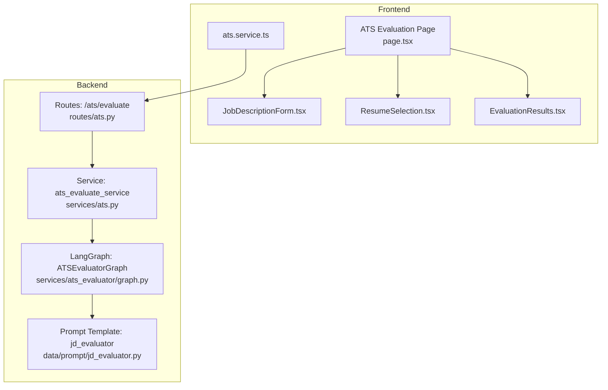
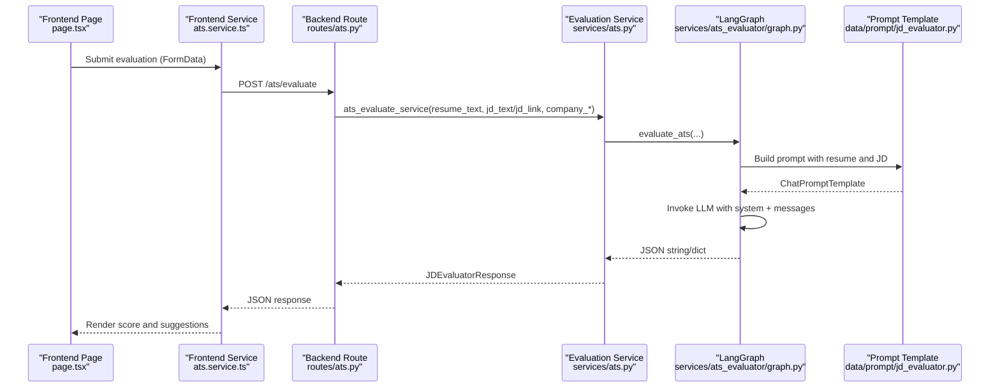
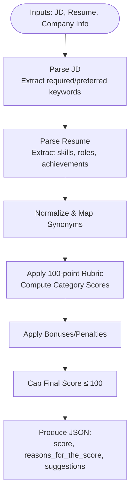
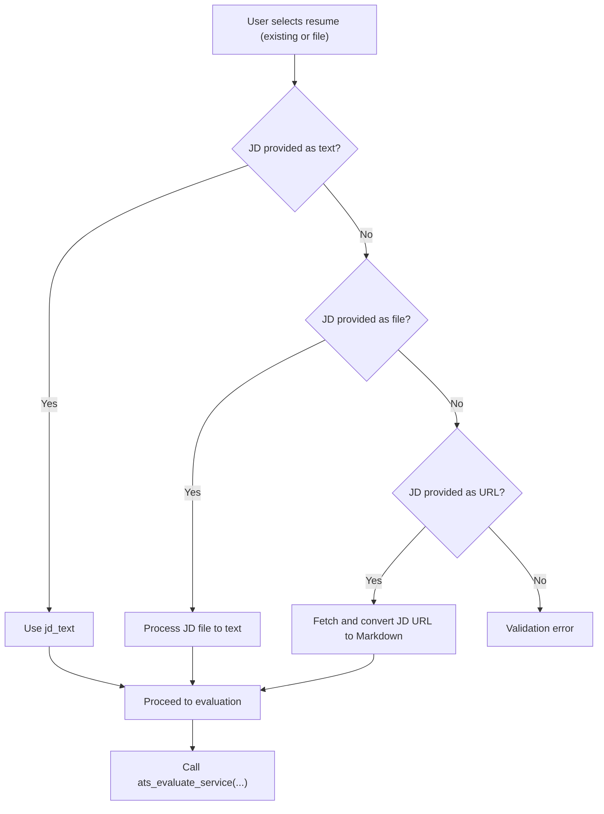
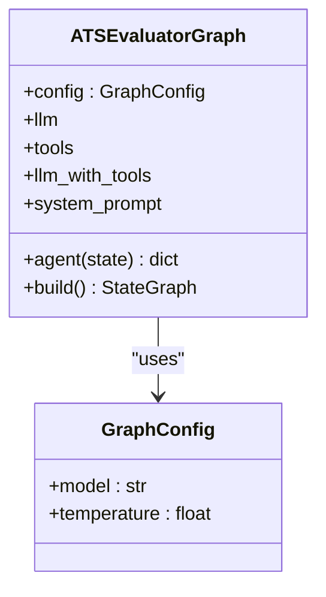
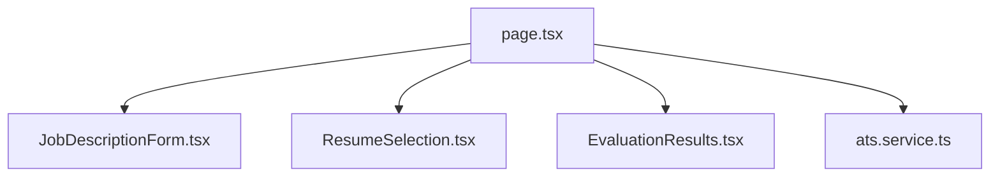
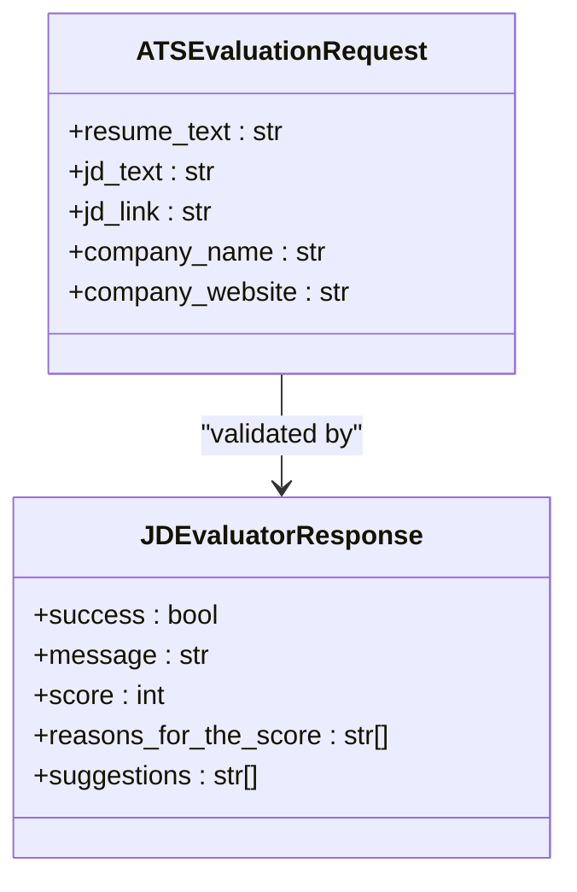
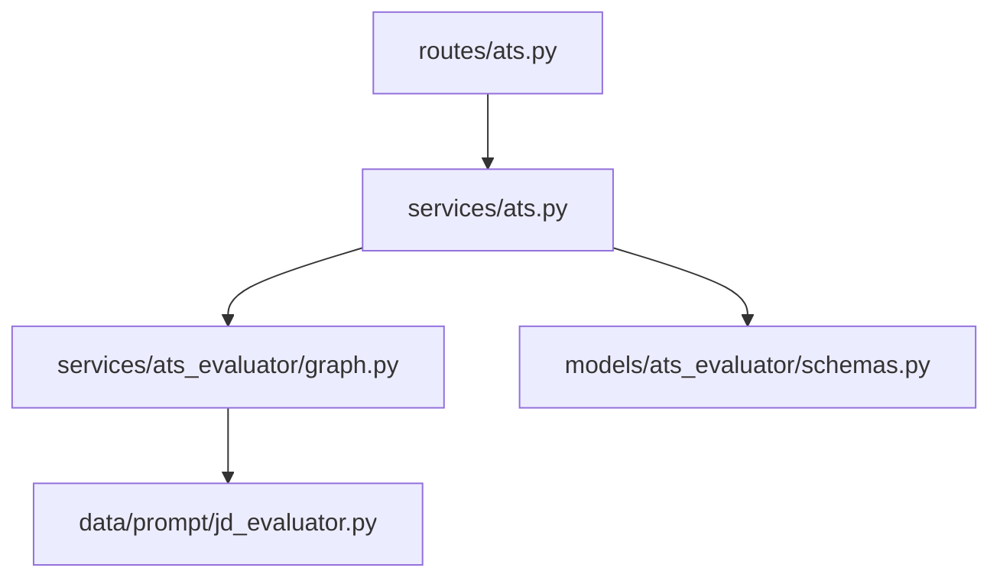

# ATS Optimization System

<cite>
**Referenced Files in This Document**
- [graph.py](file://backend/app/services/ats_evaluator/graph.py)
- [routes/ats.py](file://backend/app/routes/ats.py)
- [services/ats.py](file://backend/app/services/ats.py)
- [prompt/jd_evaluator.py](file://backend/app/data/prompt/jd_evaluator.py)
- [page.tsx](file://frontend/app/dashboard/ats/page.tsx)
- [JobDescriptionForm.tsx](file://frontend/components/ats/JobDescriptionForm.tsx)
- [ResumeSelection.tsx](file://frontend/components/ats/ResumeSelection.tsx)
- [EvaluationResults.tsx](file://frontend/components/ats/EvaluationResults.tsx)
- [ats.service.ts](file://frontend/services/ats.service.ts)
- [route.ts](file://frontend/app/api/(backend-interface)/ats/route.ts)
- [schemas.py](file://backend/app/models/ats_evaluator/schemas.py)
</cite>

## Table of Contents
1. [Introduction](#introduction)
2. [Project Structure](#project-structure)
3. [Core Components](#core-components)
4. [Architecture Overview](#architecture-overview)
5. [Detailed Component Analysis](#detailed-component-analysis)
6. [Dependency Analysis](#dependency-analysis)
7. [Performance Considerations](#performance-considerations)
8. [Troubleshooting Guide](#troubleshooting-guide)
9. [Conclusion](#conclusion)
10. [Appendices](#appendices)

## Introduction
This document describes the ATS Optimization System that evaluates how well a candidate’s resume matches a job description using a structured LangChain graph. It explains the keyword analysis and compatibility scoring mechanisms, the integration between resume text and job description processing, the prompts and scoring criteria used by the LangChain graph, and the frontend components for input, evaluation, and visualization. It also documents the data models for ATS scores, keyword matches, and optimization suggestions, and provides guidance on performance and caching strategies for bulk evaluations.

## Project Structure
The system spans a FastAPI backend and a Next.js frontend:
- Backend exposes REST endpoints for ATS evaluation, processes resume and job description inputs, orchestrates the LangChain graph, and normalizes outputs.
- Frontend provides user interfaces for selecting a resume (existing or uploaded), entering a job description (text, URL, or file), triggering evaluation, and visualizing results.

**Diagram sources**
- [page.tsx](file://frontend/app/dashboard/ats/page.tsx#L19-L289)
- [JobDescriptionForm.tsx](file://frontend/components/ats/JobDescriptionForm.tsx#L1-L286)
- [ResumeSelection.tsx](file://frontend/components/ats/ResumeSelection.tsx#L1-L325)
- [EvaluationResults.tsx](file://frontend/components/ats/EvaluationResults.tsx#L1-L177)
- [ats.service.ts](file://frontend/services/ats.service.ts#L1-L17)
- [routes/ats.py](file://backend/app/routes/ats.py#L1-L184)
- [services/ats.py](file://backend/app/services/ats.py#L1-L214)
- [graph.py](file://backend/app/services/ats_evaluator/graph.py#L1-L209)
- [prompt/jd_evaluator.py](file://backend/app/data/prompt/jd_evaluator.py#L1-L184)

**Section sources**
- [page.tsx](file://frontend/app/dashboard/ats/page.tsx#L19-L289)
- [routes/ats.py](file://backend/app/routes/ats.py#L1-L184)

## Core Components
- LangChain graph-based evaluator: Orchestrates a single-agent state graph with optional tool binding for web search, invokes an LLM with a structured prompt, and parses JSON output.
- REST endpoints: Accept resume and job description inputs (text, file, or URL), validate payloads, and delegate to the evaluation service.
- Evaluation service: Normalizes outputs into a consistent response model and handles errors.
- Frontend pages and components: Collect inputs, submit requests, and render results with a score visualization and suggestions.

**Section sources**
- [graph.py](file://backend/app/services/ats_evaluator/graph.py#L41-L114)
- [routes/ats.py](file://backend/app/routes/ats.py#L22-L184)
- [services/ats.py](file://backend/app/services/ats.py#L22-L214)
- [page.tsx](file://frontend/app/dashboard/ats/page.tsx#L19-L289)

## Architecture Overview
The evaluation pipeline integrates frontend input collection, backend routing/validation, service orchestration, and a LangChain graph that executes a prompt-driven LLM chain. The prompt defines a scoring rubric and required JSON schema.

**Diagram sources**
- [page.tsx](file://frontend/app/dashboard/ats/page.tsx#L93-L138)
- [ats.service.ts](file://frontend/services/ats.service.ts#L12-L17)
- [routes/ats.py](file://backend/app/routes/ats.py#L50-L184)
- [services/ats.py](file://backend/app/services/ats.py#L22-L192)
- [graph.py](file://backend/app/services/ats_evaluator/graph.py#L86-L114)
- [prompt/jd_evaluator.py](file://backend/app/data/prompt/jd_evaluator.py#L3-L181)

## Detailed Component Analysis

### Keyword Analysis and Compatibility Scoring Mechanism
- Keyword extraction and normalization: The prompt instructs extracting required and preferred keywords from the job description and mapping synonyms and equivalents. It requires explicit presence of keywords in the resume and penalizes missing required skills.
- Scoring rubric: The prompt defines a 100-point framework across categories such as Technical Skills & Experience Match, Career Progression & Achievements, Education & Credentials, Resume Quality & Customization, Soft Skills & Cultural Fit Indicators, and Stability/Red Flags. Adjustments include bonuses and penalties.
- Output schema: The prompt enforces a strict JSON schema with fields for score, reasons_for_the_score, and suggestions.

**Diagram sources**
- [prompt/jd_evaluator.py](file://backend/app/data/prompt/jd_evaluator.py#L21-L147)

**Section sources**
- [prompt/jd_evaluator.py](file://backend/app/data/prompt/jd_evaluator.py#L3-L181)

### Integration Between Resume Text Analysis and Job Description Processing
- Input handling: The backend supports three modes for the job description: raw text, file upload, or URL. If a URL is provided, the system retrieves and converts the page to Markdown for processing.
- Resume handling: The system accepts either a resume ID (existing) or a file upload. The resume is processed into text for evaluation.
- Validation: Pydantic models validate inputs and ensure either JD text or link is provided.

**Diagram sources**
- [routes/ats.py](file://backend/app/routes/ats.py#L50-L184)
- [services/ats.py](file://backend/app/services/ats.py#L41-L73)

**Section sources**
- [routes/ats.py](file://backend/app/routes/ats.py#L22-L184)
- [services/ats.py](file://backend/app/services/ats.py#L22-L192)

### LangChain Graph and Prompt Execution
- Graph: A single-agent state graph with optional tool binding for web search. The agent composes a system prompt and invokes the LLM with messages.
- Prompt: The prompt template defines operating principles, rubric scoring, normalization rules, and required JSON schema.
- JSON parsing: The evaluator strips code fences and extracts the first valid JSON object from the LLM response.

**Diagram sources**
- [graph.py](file://backend/app/services/ats_evaluator/graph.py#L35-L114)

**Section sources**
- [graph.py](file://backend/app/services/ats_evaluator/graph.py#L41-L114)
- [prompt/jd_evaluator.py](file://backend/app/data/prompt/jd_evaluator.py#L3-L181)

### Frontend Components for ATS Evaluation
- ATS Evaluation Page: Coordinates input collection, validation, submission, and result rendering.
- JobDescriptionForm: Supports three input modes (URL, text, file) with drag-and-drop file support and previews.
- ResumeSelection: Allows choosing an existing resume or uploading a new one, with a dropdown and file preview.
- EvaluationResults: Displays the ATS score, reasons, suggestions, and an “Optimize Resume” call-to-action.

**Diagram sources**
- [page.tsx](file://frontend/app/dashboard/ats/page.tsx#L19-L289)
- [JobDescriptionForm.tsx](file://frontend/components/ats/JobDescriptionForm.tsx#L1-L286)
- [ResumeSelection.tsx](file://frontend/components/ats/ResumeSelection.tsx#L1-L325)
- [EvaluationResults.tsx](file://frontend/components/ats/EvaluationResults.tsx#L1-L177)
- [ats.service.ts](file://frontend/services/ats.service.ts#L1-L17)

**Section sources**
- [page.tsx](file://frontend/app/dashboard/ats/page.tsx#L19-L289)
- [JobDescriptionForm.tsx](file://frontend/components/ats/JobDescriptionForm.tsx#L1-L286)
- [ResumeSelection.tsx](file://frontend/components/ats/ResumeSelection.tsx#L1-L325)
- [EvaluationResults.tsx](file://frontend/components/ats/EvaluationResults.tsx#L1-L177)
- [ats.service.ts](file://frontend/services/ats.service.ts#L1-L17)

### Data Models for ATS Scores, Keyword Matches, and Suggestions
- Request model: Accepts resume_text, jd_text, jd_link, company_name, company_website.
- Response model: Returns success flag, message, score, reasons_for_the_score, and suggestions.
- Internal normalization: The service ensures numeric types and safe defaults for score and lists.

**Diagram sources**
- [schemas.py](file://backend/app/models/ats_evaluator/schemas.py#L6-L44)

**Section sources**
- [schemas.py](file://backend/app/models/ats_evaluator/schemas.py#L6-L44)
- [services/ats.py](file://backend/app/services/ats.py#L141-L191)

### Examples of How the System Identifies Missing Keywords and Suggests Improvements
- Missing keywords: The prompt instructs to extract required and preferred keywords from the JD and explicitly mark missing required skills. Partial matches are recognized with synonym mapping.
- Suggestions: The prompt directs generating targeted, actionable suggestions aligned with lost points and the specific JD, prioritizing missing must-haves, stronger quantification, clearer alignment, and red flag fixes.

**Section sources**
- [prompt/jd_evaluator.py](file://backend/app/data/prompt/jd_evaluator.py#L21-L161)

### Integration with Additional Company Context
- Optional company name and website content can be included to enrich the prompt and tailor the evaluation.

**Section sources**
- [graph.py](file://backend/app/services/ats_evaluator/graph.py#L76-L83)
- [routes/ats.py](file://backend/app/routes/ats.py#L33-L41)

## Dependency Analysis
The backend depends on:
- LangChain for prompt templating and LLM invocation.
- LangGraph for stateful orchestration.
- Optional external tools (web search) for JD enrichment.
- Pydantic models for input validation and response shaping.

**Diagram sources**
- [routes/ats.py](file://backend/app/routes/ats.py#L1-L184)
- [services/ats.py](file://backend/app/services/ats.py#L1-L214)
- [graph.py](file://backend/app/services/ats_evaluator/graph.py#L1-L209)
- [prompt/jd_evaluator.py](file://backend/app/data/prompt/jd_evaluator.py#L1-L184)
- [schemas.py](file://backend/app/models/ats_evaluator/schemas.py#L1-L44)

**Section sources**
- [routes/ats.py](file://backend/app/routes/ats.py#L1-L184)
- [services/ats.py](file://backend/app/services/ats.py#L1-L214)
- [graph.py](file://backend/app/services/ats_evaluator/graph.py#L1-L209)
- [prompt/jd_evaluator.py](file://backend/app/data/prompt/jd_evaluator.py#L1-L184)
- [schemas.py](file://backend/app/models/ats_evaluator/schemas.py#L1-L44)

## Performance Considerations
- Bulk evaluations: Batch requests to minimize overhead. Use pagination and concurrency limits appropriate to the LLM provider rate limits.
- Caching strategies:
  - Prompt and tool initialization: Cache the LLM instance and prompt template to avoid repeated construction.
  - Web content retrieval: Cache fetched JD content when URLs are reused to reduce network calls.
  - JSON parsing: Cache normalized results keyed by (resume_hash, jd_hash) to skip recomputation for identical inputs.
  - Frontend: Persist recent evaluations to avoid re-fetching identical inputs.
- Streaming and timeouts: Configure request timeouts and consider streaming responses where supported by the LLM provider.
- Cost control: Monitor token usage and consider summarizing long inputs when feasible.

[No sources needed since this section provides general guidance]

## Troubleshooting Guide
- JSON parsing failures: The evaluator strips code fences and attempts to extract the first valid JSON object. If parsing fails, the system raises a structured HTTP error.
- Network and service errors: Frontend route wraps fetch errors and returns a standardized failure response with a 503 status.
- Input validation: Ensure either jd_text or jd_link is provided; otherwise, a 400 error is raised.

**Section sources**
- [graph.py](file://backend/app/services/ats_evaluator/graph.py#L149-L202)
- [route.ts](file://frontend/app/api/(backend-interface)/ats/route.ts#L434-L463)
- [routes/ats.py](file://backend/app/routes/ats.py#L43-L47)

## Conclusion
The ATS Optimization System combines robust input handling, a structured LangChain graph, and a precise scoring prompt to deliver accurate ATS match evaluations. The frontend provides intuitive controls for resume and job description inputs, and clear visualization of results and suggestions. Adhering to the documented data models and leveraging caching and batching strategies enables scalable, high-quality evaluations.

[No sources needed since this section summarizes without analyzing specific files]

## Appendices

### API Definitions
- Endpoint: POST /ats/evaluate
- Request body: multipart/form-data or JSON with fields:
  - resume_text (string) or resumeId (string) and file (binary)
  - jd_text (string) or jd_file (binary) or jd_link (string)
  - company_name (string, optional)
  - company_website (string, optional)
- Response: JDEvaluatorResponse with success, message, score, reasons_for_the_score, suggestions

**Section sources**
- [routes/ats.py](file://backend/app/routes/ats.py#L50-L184)
- [schemas.py](file://backend/app/models/ats_evaluator/schemas.py#L13-L44)