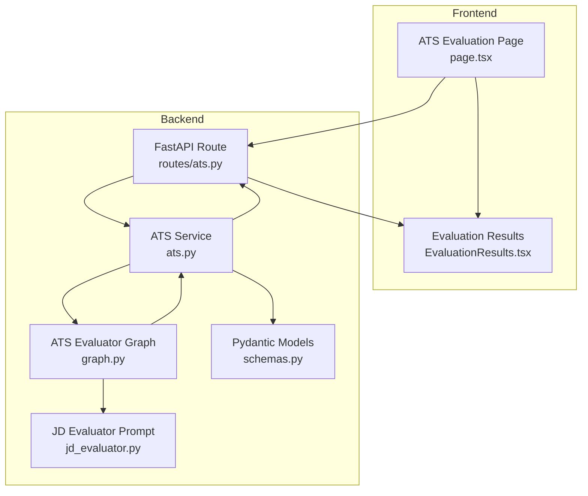
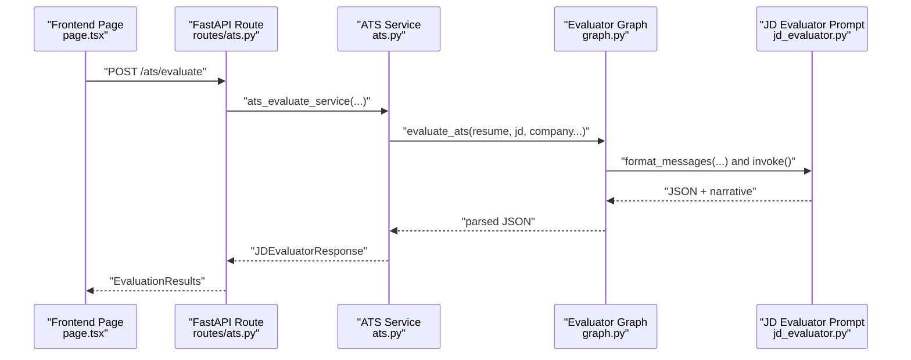
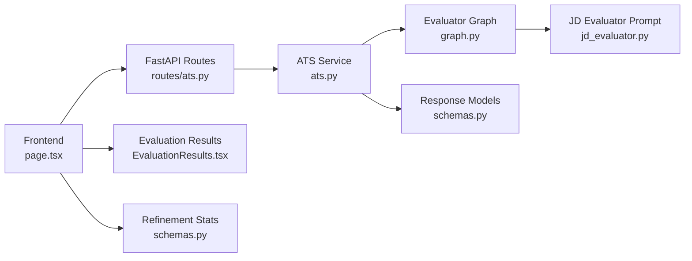
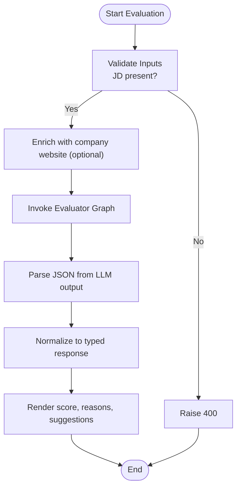

# Compatibility Scoring System

<cite>
**Referenced Files in This Document**
- [ats.py](file://backend/app/services/ats.py)
- [routes/ats.py](file://backend/app/routes/ats.py)
- [graph.py](file://backend/app/services/ats_evaluator/graph.py)
- [jd_evaluator.py](file://backend/app/data/prompt/jd_evaluator.py)
- [schemas.py](file://backend/app/models/ats_evaluator/schemas.py)
- [EvaluationResults.tsx](file://frontend/components/ats/EvaluationResults.tsx)
- [page.tsx](file://frontend/app/dashboard/ats/page.tsx)
- [diff-preview-modal.tsx](file://frontend/components/improvement/diff-preview-modal.tsx)
- [schemas.py](file://backend/app/models/refinement/schemas.py)
</cite>

## Table of Contents
1. [Introduction](#introduction)
2. [Project Structure](#project-structure)
3. [Core Components](#core-components)
4. [Architecture Overview](#architecture-overview)
5. [Detailed Component Analysis](#detailed-component-analysis)
6. [Dependency Analysis](#dependency-analysis)
7. [Performance Considerations](#performance-considerations)
8. [Troubleshooting Guide](#troubleshooting-guide)
9. [Conclusion](#conclusion)
10. [Appendices](#appendices)

## Introduction
This document explains the compatibility scoring system that evaluates how well a resume matches a job description. It covers the multi-factor scoring methodology, normalization into a unified percentage, threshold-based categorization, visualization, and refinement workflows. The system integrates backend LLM-driven evaluation with frontend presentation and optional refinement tracking.

## Project Structure
The compatibility scoring spans backend services and prompts, and frontend visualization:
- Backend: FastAPI routes accept resume and job description inputs, invoke an LLM graph to compute a structured score, and return a normalized response.
- Prompt: A detailed 100-point rubric drives the LLM scorer, including categories such as technical skills, experience relevance, career progression, education, customization, soft skills, and stability/red flags.
- Frontend: Renders the score, a progress bar, reasons, and suggestions; supports “optimize” workflows and refinement comparisons.

**Diagram sources**
- [page.tsx](file://frontend/app/dashboard/ats/page.tsx#L1-L289)
- [EvaluationResults.tsx](file://frontend/components/ats/EvaluationResults.tsx#L1-L177)
- [routes/ats.py](file://backend/app/routes/ats.py#L1-L184)
- [ats.py](file://backend/app/services/ats.py#L1-L214)
- [graph.py](file://backend/app/services/ats_evaluator/graph.py#L1-L209)
- [jd_evaluator.py](file://backend/app/data/prompt/jd_evaluator.py#L1-L184)
- [schemas.py](file://backend/app/models/ats_evaluator/schemas.py#L1-L44)

**Section sources**
- [routes/ats.py](file://backend/app/routes/ats.py#L1-L184)
- [ats.py](file://backend/app/services/ats.py#L1-L214)
- [graph.py](file://backend/app/services/ats_evaluator/graph.py#L1-L209)
- [jd_evaluator.py](file://backend/app/data/prompt/jd_evaluator.py#L1-L184)
- [schemas.py](file://backend/app/models/ats_evaluator/schemas.py#L1-L44)
- [EvaluationResults.tsx](file://frontend/components/ats/EvaluationResults.tsx#L1-L177)
- [page.tsx](file://frontend/app/dashboard/ats/page.tsx#L1-L289)

## Core Components
- Input pipeline: Accepts resume text or file, job description text or file/link, and optional company metadata.
- LLM evaluation: Executes a state graph prompting a 100-point rubric scorer with explicit JSON schema.
- Normalization: Ensures the response conforms to a standardized model with a numeric score, reasons, and suggestions.
- Frontend rendering: Displays the score out of 100, a progress bar, reasons, and suggestions; supports optimization actions.

Key implementation references:
- Input validation and routing: [routes/ats.py](file://backend/app/routes/ats.py#L22-L48), [routes/ats.py](file://backend/app/routes/ats.py#L109-L118)
- Service orchestration and normalization: [ats.py](file://backend/app/services/ats.py#L22-L214)
- LLM graph and JSON parsing: [graph.py](file://backend/app/services/ats_evaluator/graph.py#L116-L202)
- Prompt rubric and schema: [jd_evaluator.py](file://backend/app/data/prompt/jd_evaluator.py#L38-L147)
- Response models: [schemas.py](file://backend/app/models/ats_evaluator/schemas.py#L20-L44)
- Frontend visualization: [EvaluationResults.tsx](file://frontend/components/ats/EvaluationResults.tsx#L67-L101)

**Section sources**
- [routes/ats.py](file://backend/app/routes/ats.py#L22-L48)
- [routes/ats.py](file://backend/app/routes/ats.py#L109-L118)
- [ats.py](file://backend/app/services/ats.py#L22-L214)
- [graph.py](file://backend/app/services/ats_evaluator/graph.py#L116-L202)
- [jd_evaluator.py](file://backend/app/data/prompt/jd_evaluator.py#L38-L147)
- [schemas.py](file://backend/app/models/ats_evaluator/schemas.py#L20-L44)
- [EvaluationResults.tsx](file://frontend/components/ats/EvaluationResults.tsx#L67-L101)

## Architecture Overview
The system follows a request-response flow:
- The frontend collects inputs and triggers evaluation.
- The backend validates inputs, optionally enriches with company website content, and invokes the LLM graph.
- The graph executes the prompt and returns structured JSON; the service normalizes and returns a typed response.
- The frontend renders the score, reasons, and suggestions.

**Diagram sources**
- [page.tsx](file://frontend/app/dashboard/ats/page.tsx#L109-L138)
- [routes/ats.py](file://backend/app/routes/ats.py#L55-L118)
- [ats.py](file://backend/app/services/ats.py#L22-L214)
- [graph.py](file://backend/app/services/ats_evaluator/graph.py#L116-L202)
- [jd_evaluator.py](file://backend/app/data/prompt/jd_evaluator.py#L1-L184)

## Detailed Component Analysis

### Multi-Factor Scoring Rubric
The LLM uses a 100-point rubric with explicit categories and point allocations:
- Technical Skills & Experience Match (30)
  - Hard Skills Alignment (20)
  - Experience Relevance (10)
- Career Progression & Achievements (25)
  - Professional Growth (15)
  - Quantified Achievements (10)
- Education & Credentials (15)
  - Education (10)
  - Certifications (5)
- Resume Quality & Customization (15)
  - Customization for Role (8)
  - Professional Presentation (7)
- Soft Skills & Cultural Fit Indicators (10)
  - Communication (5)
  - Leadership & Initiative (5)
- Employment Stability & Red Flags (5)

Adjustments after core scoring:
- Bonuses (max +5): industry awards/recognition, publications/speaking, relevant volunteer work
- Penalties: inconsistencies in dates/info, unprofessional contact info, obvious lies/embellishments

Computation:
- Sum core points, apply bonuses/penalties, cap at 100, round to nearest integer.

Normalization:
- The prompt requires valid JSON with keys: score, reasons_for_the_score, suggestions.

References:
- [jd_evaluator.py](file://backend/app/data/prompt/jd_evaluator.py#L38-L118)
- [jd_evaluator.py](file://backend/app/data/prompt/jd_evaluator.py#L138-L147)

**Section sources**
- [jd_evaluator.py](file://backend/app/data/prompt/jd_evaluator.py#L38-L118)
- [jd_evaluator.py](file://backend/app/data/prompt/jd_evaluator.py#L138-L147)

### Weighted Scoring Methodology
- Category weights are embedded in the rubric (e.g., 30/100 for technical and experience, 25/100 for progression and achievements).
- Within categories, sub-scores are mapped to discrete bands (e.g., 18–20 for perfect hard skills alignment).
- Synonym normalization is supported (e.g., cloud platforms, containers, databases, methodologies).
- Handling of missing/implicit information is explicit: treat stated requirements as missing if omitted; ambiguous experience chooses conservative lower bound; explained gaps acceptable.

References:
- [jd_evaluator.py](file://backend/app/data/prompt/jd_evaluator.py#L28-L36)
- [jd_evaluator.py](file://backend/app/data/prompt/jd_evaluator.py#L131-L136)

**Section sources**
- [jd_evaluator.py](file://backend/app/data/prompt/jd_evaluator.py#L28-L36)
- [jd_evaluator.py](file://backend/app/data/prompt/jd_evaluator.py#L131-L136)

### Normalization into Unified Percentage
- The prompt enforces a 0–100 score and a strict JSON schema.
- The service normalizes outputs to ensure numeric score, string lists for reasons and suggestions, and a typed response model.
- The frontend displays the score out of 100 and animates a progress bar proportional to the score.

References:
- [jd_evaluator.py](file://backend/app/data/prompt/jd_evaluator.py#L138-L147)
- [ats.py](file://backend/app/services/ats.py#L141-L161)
- [EvaluationResults.tsx](file://frontend/components/ats/EvaluationResults.tsx#L67-L101)

**Section sources**
- [jd_evaluator.py](file://backend/app/data/prompt/jd_evaluator.py#L138-L147)
- [ats.py](file://backend/app/services/ats.py#L141-L161)
- [EvaluationResults.tsx](file://frontend/components/ats/EvaluationResults.tsx#L67-L101)

### Threshold-Based Filtering and Categorization
- The frontend applies categorical labels based on score thresholds:
  - Excellent Match (≥ 80)
  - Good Match (≥ 60)
  - Fair Match (≥ 40)
  - Needs Improvement (< 40)
- These thresholds inform color gradients and labels for the score display.

References:
- [EvaluationResults.tsx](file://frontend/components/ats/EvaluationResults.tsx#L25-L42)

**Section sources**
- [EvaluationResults.tsx](file://frontend/components/ats/EvaluationResults.tsx#L25-L42)

### Examples of Score Calculation and Weight Adjustments
- Example rubric bands:
  - Hard Skills Alignment: 18–20 (perfect), 15–17 (minor gaps), 12–14 (some important skills missing), 8–11 (several key gaps), 0–7 (<50% present)
  - Experience Relevance: 9–10 (same/similar role/industry), 7–8 (related with minor ramp-up), 5–6 (some transferability), 3–4 (minimal relevance), 0–2 (none)
  - Career Progression Growth: 13–15 (clear upward trajectory), 10–12 (steady growth), 7–9 (lateral/stable), 4–6 (limited growth), 0–3 (none evident)
  - Quantified Achievements: 9–10 (multiple measurable results), 7–8 (several measurable), 5–6 (some quantification), 3–4 (few quantified), 0–2 (duties only)
- Adjustments:
  - Bonuses: up to +5 total (e.g., +2 for awards/recognition, +2 for publications/speaking, +1 for relevant volunteer work)
  - Penalties: up to −5 total (e.g., −3 for inconsistencies, −2 for unprofessional contact info, −5 for obvious lies/embellishments)

References:
- [jd_evaluator.py](file://backend/app/data/prompt/jd_evaluator.py#L38-L118)

**Section sources**
- [jd_evaluator.py](file://backend/app/data/prompt/jd_evaluator.py#L38-L118)

### Scoring Visualization Components
- Score display: large numeric score out of 100 with a categorical label.
- Progress bar: animated gradient bar reflecting the score percentage.
- Reasons panel: concise bullet points explaining score breakdown.
- Suggestions panel: actionable items prioritized by lost points and JD alignment.
- Optimize CTA: links to refinement workflows when a saved resume is used.

References:
- [EvaluationResults.tsx](file://frontend/components/ats/EvaluationResults.tsx#L67-L149)
- [page.tsx](file://frontend/app/dashboard/ats/page.tsx#L140-L147)

**Section sources**
- [EvaluationResults.tsx](file://frontend/components/ats/EvaluationResults.tsx#L67-L149)
- [page.tsx](file://frontend/app/dashboard/ats/page.tsx#L140-L147)

### Trend Analysis and Refinement Tracking
- Refinement stats capture:
  - Initial match percentage
  - Final match percentage
  - Keywords injected
  - AI phrases removed
  - Critical alignment violations fixed
- Diff preview modal compares match percentages before and after refinement.

References:
- [schemas.py](file://backend/app/models/refinement/schemas.py#L102-L125)
- [diff-preview-modal.tsx](file://frontend/components/improvement/diff-preview-modal.tsx#L157-L171)

**Section sources**
- [schemas.py](file://backend/app/models/refinement/schemas.py#L102-L125)
- [diff-preview-modal.tsx](file://frontend/components/improvement/diff-preview-modal.tsx#L157-L171)

### Edge Cases and Outlier Detection Mechanisms
- Input validation:
  - Requires either raw JD text or a JD link; otherwise raises a 400 error.
  - Validates payload shape and enforces presence of required fields.
- JSON parsing robustness:
  - Handles code fences and malformed JSON by extracting the inner JSON object.
  - Falls back to empty JSON and raises a 500 error if parsing fails.
- LLM output normalization:
  - Ensures score is numeric, reasons and suggestions are lists of strings, and response conforms to the typed model.
- Red flags and penalties:
  - Penalties applied for inconsistencies, unprofessional contact info, and obvious embellishments.
  - Stability deductions for unexplained gaps.

References:
- [routes/ats.py](file://backend/app/routes/ats.py#L43-L47)
- [graph.py](file://backend/app/services/ats_evaluator/graph.py#L149-L202)
- [ats.py](file://backend/app/services/ats.py#L75-L96)
- [ats.py](file://backend/app/services/ats.py#L123-L161)
- [jd_evaluator.py](file://backend/app/data/prompt/jd_evaluator.py#L111-L114)

**Section sources**
- [routes/ats.py](file://backend/app/routes/ats.py#L43-L47)
- [graph.py](file://backend/app/services/ats_evaluator/graph.py#L149-L202)
- [ats.py](file://backend/app/services/ats.py#L75-L96)
- [ats.py](file://backend/app/services/ats.py#L123-L161)
- [jd_evaluator.py](file://backend/app/data/prompt/jd_evaluator.py#L111-L114)

## Dependency Analysis
- Routes depend on the service layer for evaluation.
- The service depends on the evaluator graph and prompt template.
- The graph depends on the LLM and optional tools; it formats messages using the prompt.
- The frontend depends on the API for evaluation results and on refinement stats for trend tracking.

**Diagram sources**
- [page.tsx](file://frontend/app/dashboard/ats/page.tsx#L1-L289)
- [routes/ats.py](file://backend/app/routes/ats.py#L1-L184)
- [ats.py](file://backend/app/services/ats.py#L1-L214)
- [graph.py](file://backend/app/services/ats_evaluator/graph.py#L1-L209)
- [jd_evaluator.py](file://backend/app/data/prompt/jd_evaluator.py#L1-L184)
- [schemas.py](file://backend/app/models/ats_evaluator/schemas.py#L1-L44)
- [EvaluationResults.tsx](file://frontend/components/ats/EvaluationResults.tsx#L1-L177)
- [schemas.py](file://backend/app/models/refinement/schemas.py#L102-L125)

**Section sources**
- [routes/ats.py](file://backend/app/routes/ats.py#L1-L184)
- [ats.py](file://backend/app/services/ats.py#L1-L214)
- [graph.py](file://backend/app/services/ats_evaluator/graph.py#L1-L209)
- [jd_evaluator.py](file://backend/app/data/prompt/jd_evaluator.py#L1-L184)
- [schemas.py](file://backend/app/models/ats_evaluator/schemas.py#L1-L44)
- [EvaluationResults.tsx](file://frontend/components/ats/EvaluationResults.tsx#L1-L177)
- [schemas.py](file://backend/app/models/refinement/schemas.py#L102-L125)

## Performance Considerations
- Prompt complexity: The rubric prompt is comprehensive; keep inputs concise to reduce token usage and latency.
- Tool availability: Optional tools (e.g., web search) can enhance context but add overhead; ensure they are enabled only when beneficial.
- JSON parsing: Robust extraction reduces retries and improves throughput.
- Frontend animations: Motion effects are lightweight but avoid excessive re-renders by memoizing evaluation results.

## Troubleshooting Guide
Common issues and resolutions:
- Missing job description: Ensure either jd_text or jd_link is provided; otherwise, a 400 error is raised.
- Parsing failures: If the LLM output is not valid JSON, the system attempts to extract the JSON block; repeated failures return a 500 error.
- Validation errors: Payload validation errors surface as 400 responses with details.
- Service errors: Unexpected exceptions during evaluation return 500 with a descriptive message.

References:
- [routes/ats.py](file://backend/app/routes/ats.py#L43-L47)
- [graph.py](file://backend/app/services/ats_evaluator/graph.py#L149-L202)
- [ats.py](file://backend/app/services/ats.py#L75-L96)
- [ats.py](file://backend/app/services/ats.py#L193-L213)

**Section sources**
- [routes/ats.py](file://backend/app/routes/ats.py#L43-L47)
- [graph.py](file://backend/app/services/ats_evaluator/graph.py#L149-L202)
- [ats.py](file://backend/app/services/ats.py#L75-L96)
- [ats.py](file://backend/app/services/ats.py#L193-L213)

## Conclusion
The compatibility scoring system combines a rigorous 100-point rubric with LLM-driven evaluation to produce a normalized, interpretable score. The backend ensures robust input handling and structured output, while the frontend delivers clear visual feedback and optimization pathways. Threshold-based categorization and refinement tracking enable practical decision-making and iterative improvement.

## Appendices

### Scoring Flowchart

**Diagram sources**
- [routes/ats.py](file://backend/app/routes/ats.py#L43-L47)
- [graph.py](file://backend/app/services/ats_evaluator/graph.py#L149-L202)
- [ats.py](file://backend/app/services/ats.py#L141-L161)