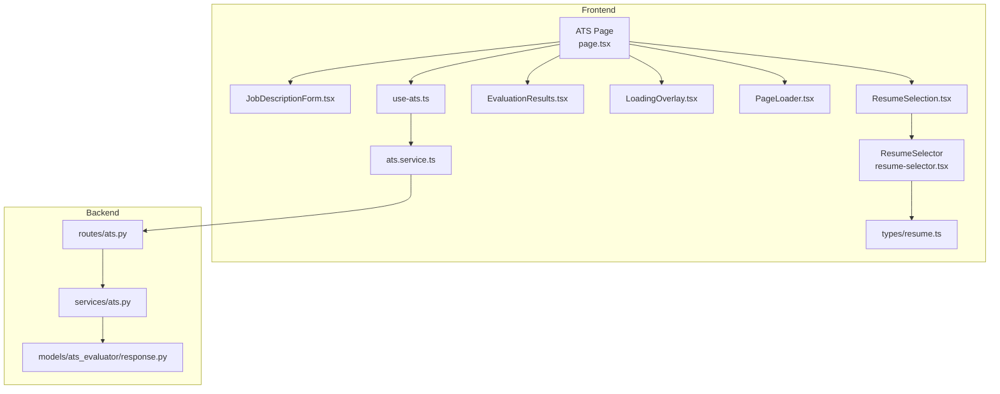
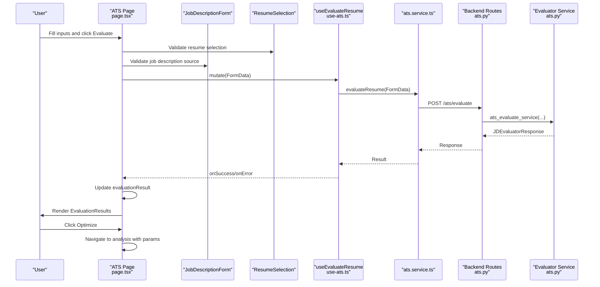
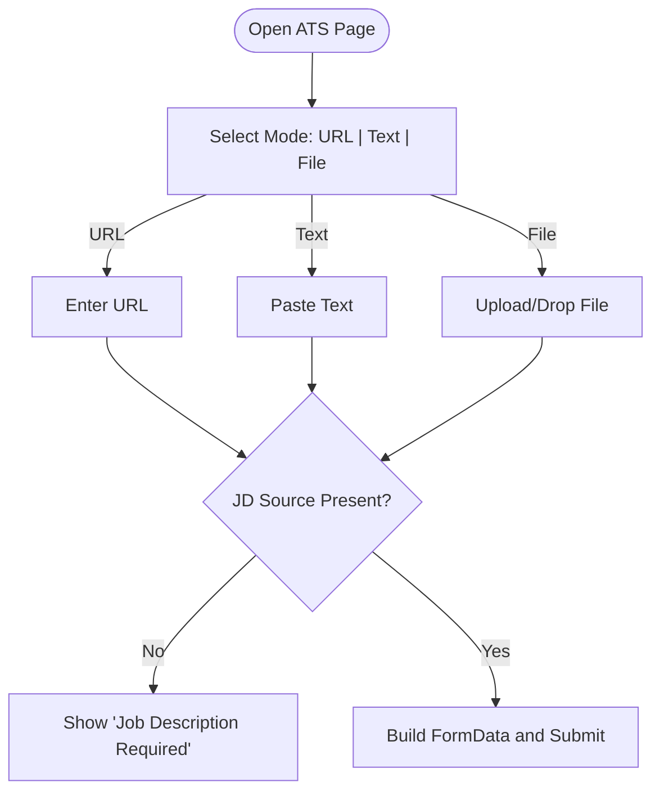
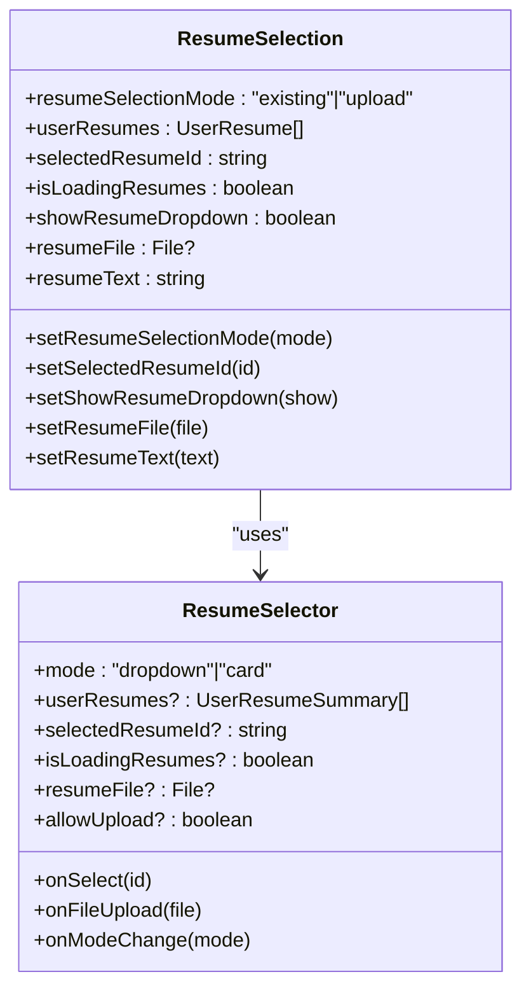
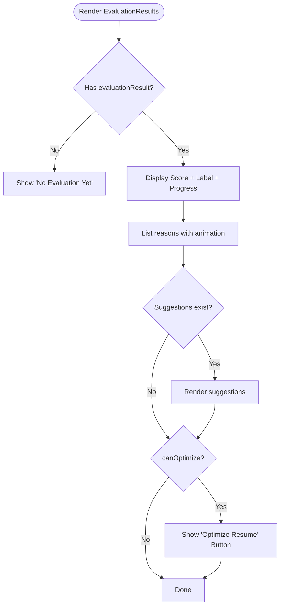
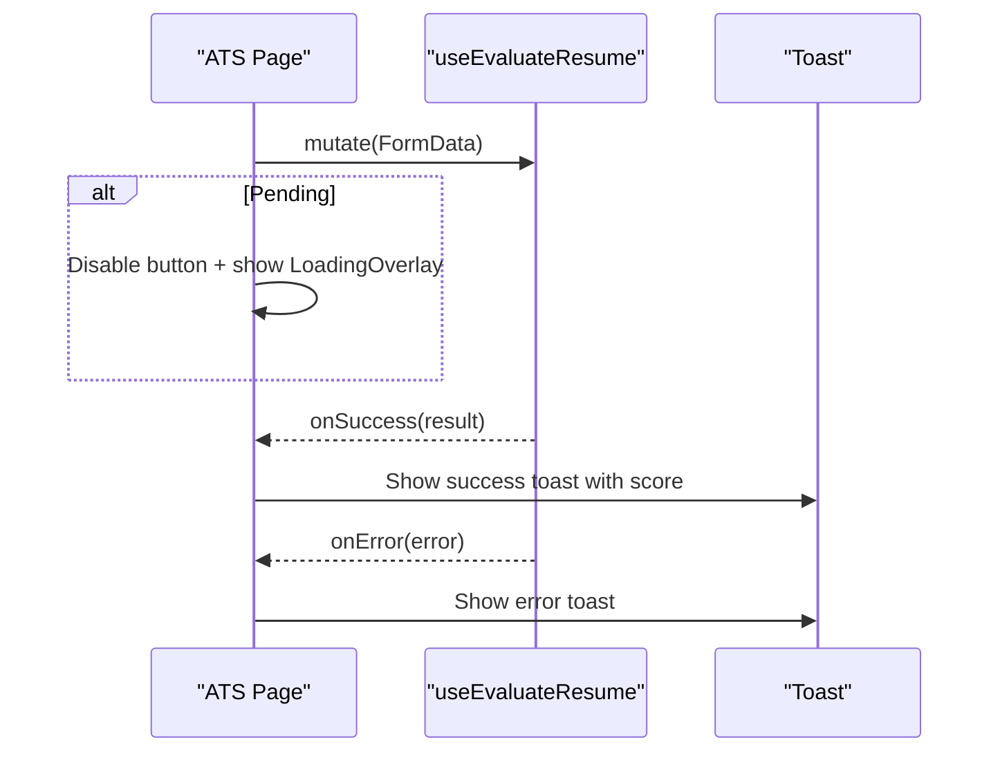
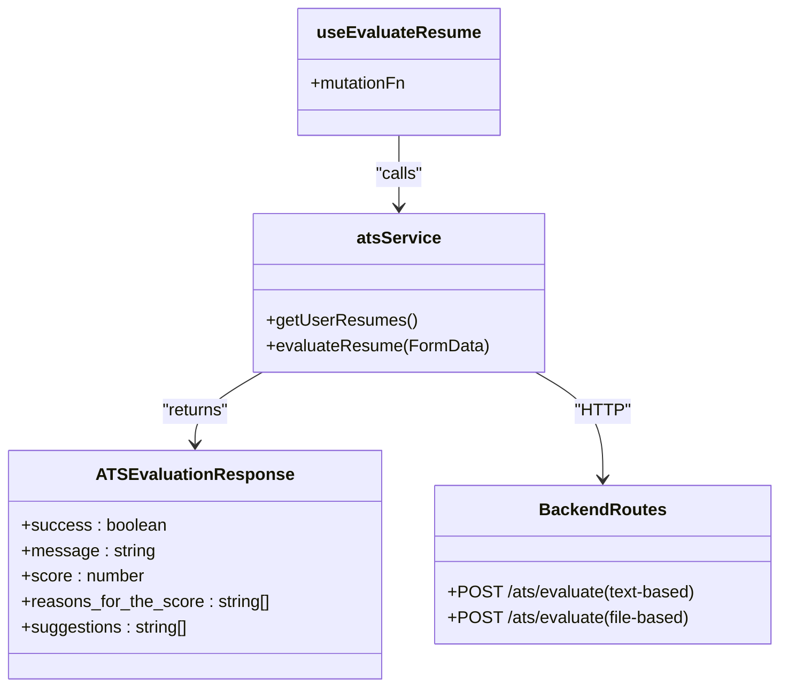
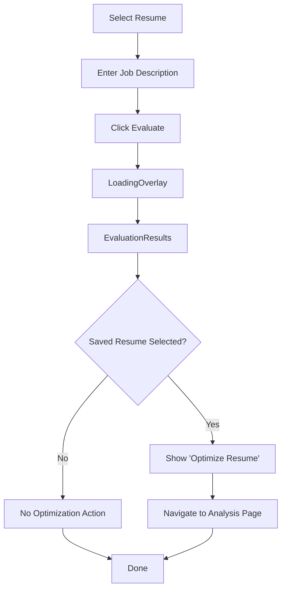
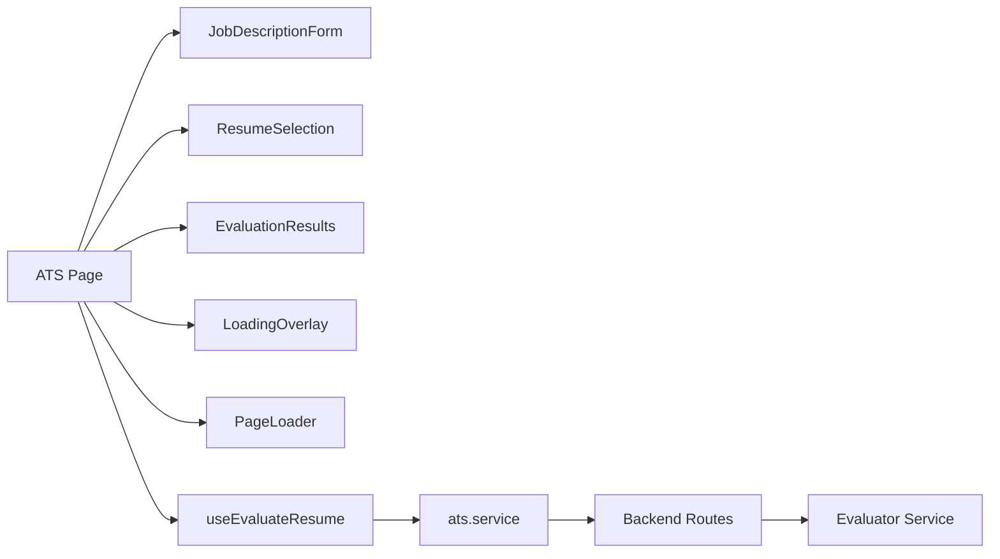

# Frontend ATS Components

<cite>
**Referenced Files in This Document**
- [JobDescriptionForm.tsx](file://frontend/components/ats/JobDescriptionForm.tsx)
- [ResumeSelection.tsx](file://frontend/components/ats/ResumeSelection.tsx)
- [EvaluationResults.tsx](file://frontend/components/ats/EvaluationResults.tsx)
- [LoadingOverlay.tsx](file://frontend/components/ats/LoadingOverlay.tsx)
- [PageLoader.tsx](file://frontend/components/ats/PageLoader.tsx)
- [page.tsx](file://frontend/app/dashboard/ats/page.tsx)
- [ats.service.ts](file://frontend/services/ats.service.ts)
- [use-ats.ts](file://frontend/hooks/queries/use-ats.ts)
- [resume-selector.tsx](file://frontend/components/shared/resume-selector.tsx)
- [ats.py](file://backend/app/routes/ats.py)
- [ats.py](file://backend/app/services/ats.py)
- [response.py](file://backend/app/models/ats_evaluator/response.py)
- [resume.ts](file://frontend/types/resume.ts)
</cite>

## Table of Contents
1. [Introduction](#introduction)
2. [Project Structure](#project-structure)
3. [Core Components](#core-components)
4. [Architecture Overview](#architecture-overview)
5. [Detailed Component Analysis](#detailed-component-analysis)
6. [Dependency Analysis](#dependency-analysis)
7. [Performance Considerations](#performance-considerations)
8. [Troubleshooting Guide](#troubleshooting-guide)
9. [Conclusion](#conclusion)

## Introduction
This document explains the frontend ATS (Applicant Tracking System) evaluation components. It covers:
- Job description input supporting text, URL, and file modes
- Resume selection allowing existing or uploaded resumes
- Evaluation results display with compatibility score, reasons, and suggestions
- Loading states, error handling, and user feedback
- Props, state management, and backend integration
- Responsive design patterns and accessibility features
- End-to-end UX flow from job description entry to optimization actions

## Project Structure
The ATS evaluation feature spans frontend components and pages, backed by frontend services and hooks, and integrated with backend routes and services.

**Diagram sources**
- [page.tsx](file://frontend/app/dashboard/ats/page.tsx#L1-L289)
- [JobDescriptionForm.tsx](file://frontend/components/ats/JobDescriptionForm.tsx#L1-L286)
- [ResumeSelection.tsx](file://frontend/components/ats/ResumeSelection.tsx#L1-L325)
- [resume-selector.tsx](file://frontend/components/shared/resume-selector.tsx#L1-L295)
- [EvaluationResults.tsx](file://frontend/components/ats/EvaluationResults.tsx#L1-L177)
- [LoadingOverlay.tsx](file://frontend/components/ats/LoadingOverlay.tsx#L1-L45)
- [PageLoader.tsx](file://frontend/components/ats/PageLoader.tsx#L1-L23)
- [use-ats.ts](file://frontend/hooks/queries/use-ats.ts#L1-L19)
- [ats.service.ts](file://frontend/services/ats.service.ts#L1-L18)
- [ats.py](file://backend/app/routes/ats.py#L1-L184)
- [ats.py](file://backend/app/services/ats.py#L1-L214)
- [response.py](file://backend/app/models/ats_evaluator/response.py#L1-L19)
- [resume.ts](file://frontend/types/resume.ts#L81-L90)

**Section sources**
- [page.tsx](file://frontend/app/dashboard/ats/page.tsx#L1-L289)
- [JobDescriptionForm.tsx](file://frontend/components/ats/JobDescriptionForm.tsx#L1-L286)
- [ResumeSelection.tsx](file://frontend/components/ats/ResumeSelection.tsx#L1-L325)
- [resume-selector.tsx](file://frontend/components/shared/resume-selector.tsx#L1-L295)
- [EvaluationResults.tsx](file://frontend/components/ats/EvaluationResults.tsx#L1-L177)
- [LoadingOverlay.tsx](file://frontend/components/ats/LoadingOverlay.tsx#L1-L45)
- [PageLoader.tsx](file://frontend/components/ats/PageLoader.tsx#L1-L23)
- [use-ats.ts](file://frontend/hooks/queries/use-ats.ts#L1-L19)
- [ats.service.ts](file://frontend/services/ats.service.ts#L1-L18)
- [ats.py](file://backend/app/routes/ats.py#L1-L184)
- [ats.py](file://backend/app/services/ats.py#L1-L214)
- [response.py](file://backend/app/models/ats_evaluator/response.py#L1-L19)
- [resume.ts](file://frontend/types/resume.ts#L81-L90)

## Core Components
- JobDescriptionForm: Allows entering a job description via URL, text, or file upload. Manages mode switching and drag-and-drop file handling.
- ResumeSelection: Lets users pick an existing resume from a dropdown or upload a new one. Provides previews and loading states.
- EvaluationResults: Renders the ATS match score, reasons, suggestions, and optional optimization action.
- LoadingOverlay and PageLoader: Provide overlay and page-level loaders during evaluation and initial load.
- ATS Page: Orchestrates state, validation, mutation, and navigation to optimization.

**Section sources**
- [JobDescriptionForm.tsx](file://frontend/components/ats/JobDescriptionForm.tsx#L18-L54)
- [ResumeSelection.tsx](file://frontend/components/ats/ResumeSelection.tsx#L24-L52)
- [EvaluationResults.tsx](file://frontend/components/ats/EvaluationResults.tsx#L8-L24)
- [LoadingOverlay.tsx](file://frontend/components/ats/LoadingOverlay.tsx#L6-L11)
- [PageLoader.tsx](file://frontend/components/ats/PageLoader.tsx#L6-L11)
- [page.tsx](file://frontend/app/dashboard/ats/page.tsx#L19-L138)

## Architecture Overview
End-to-end flow from input to results and optimization.

**Diagram sources**
- [page.tsx](file://frontend/app/dashboard/ats/page.tsx#L60-L147)
- [use-ats.ts](file://frontend/hooks/queries/use-ats.ts#L14-L18)
- [ats.service.ts](file://frontend/services/ats.service.ts#L12-L17)
- [ats.py](file://backend/app/routes/ats.py#L50-L131)
- [ats.py](file://backend/app/services/ats.py#L22-L214)
- [response.py](file://backend/app/models/ats_evaluator/response.py#L14-L19)

## Detailed Component Analysis

### Job Description Input Form
- Modes: URL, Text, File
- Behavior:
  - Mode switching clears conflicting fields to ensure only one source is submitted.
  - File mode supports drag-and-drop and preview.
  - Optional company metadata is captured alongside the job description.
- Props and state:
  - Receives formData, handleInputChange, jdFile, setJdFile.
  - Internal state tracks current mode and drag state.
- Validation and submission:
  - The parent page validates that at least one JD source is present before submitting.

**Diagram sources**
- [JobDescriptionForm.tsx](file://frontend/components/ats/JobDescriptionForm.tsx#L32-L54)
- [page.tsx](file://frontend/app/dashboard/ats/page.tsx#L82-L91)

**Section sources**
- [JobDescriptionForm.tsx](file://frontend/components/ats/JobDescriptionForm.tsx#L18-L54)
- [page.tsx](file://frontend/app/dashboard/ats/page.tsx#L39-L116)

### Resume Selection Interface
- Modes: Existing or Upload
- Existing:
  - Dropdown lists user resumes with metadata and upload date.
  - Supports controlled selection via parent state.
- Upload:
  - File picker with drag-and-drop support.
  - Auto-preview for text/markdown files; binary preview otherwise.
- Props and state:
  - resumeSelectionMode, selectedResumeId, resumeFile, resumeText.
  - showResumeDropdown toggles the dropdown visibility.
- Integration:
  - Uses shared ResumeSelector component for reuse across features.

**Diagram sources**
- [ResumeSelection.tsx](file://frontend/components/ats/ResumeSelection.tsx#L24-L52)
- [resume-selector.tsx](file://frontend/components/shared/resume-selector.tsx#L27-L57)

**Section sources**
- [ResumeSelection.tsx](file://frontend/components/ats/ResumeSelection.tsx#L24-L52)
- [resume-selector.tsx](file://frontend/components/shared/resume-selector.tsx#L46-L83)
- [resume.ts](file://frontend/types/resume.ts#L81-L90)

### Evaluation Results Display
- Renders:
  - ATS match score with color-coded label and animated progress bar.
  - Reasons for the score as a list with staggered animations.
  - Suggestions if present.
  - Optional “Optimize Resume” CTA when evaluation is available and a saved resume is selected.
- Props:
  - evaluationResult: score, reasons_for_the_score[], suggestions[]
  - onOptimize: callback invoked when user clicks optimize
  - canOptimize: flag controlling whether the CTA is shown

**Diagram sources**
- [EvaluationResults.tsx](file://frontend/components/ats/EvaluationResults.tsx#L20-L42)
- [EvaluationResults.tsx](file://frontend/components/ats/EvaluationResults.tsx#L151-L170)

**Section sources**
- [EvaluationResults.tsx](file://frontend/components/ats/EvaluationResults.tsx#L8-L24)
- [page.tsx](file://frontend/app/dashboard/ats/page.tsx#L275-L279)

### Loading States, Error Handling, and Feedback
- PageLoader: Full-page spinner while the page initializes.
- LoadingOverlay: Modal overlay during evaluation requests.
- Toast notifications:
  - Validation failures for missing inputs
  - Success and error callbacks from the evaluation mutation
- Disabled states:
  - Evaluate button is disabled when inputs are invalid or evaluation is pending.

**Diagram sources**
- [page.tsx](file://frontend/app/dashboard/ats/page.tsx#L47-L48)
- [page.tsx](file://frontend/app/dashboard/ats/page.tsx#L118-L137)
- [LoadingOverlay.tsx](file://frontend/components/ats/LoadingOverlay.tsx#L10-L11)
- [PageLoader.tsx](file://frontend/components/ats/PageLoader.tsx#L10-L11)

**Section sources**
- [page.tsx](file://frontend/app/dashboard/ats/page.tsx#L21-L54)
- [page.tsx](file://frontend/app/dashboard/ats/page.tsx#L232-L240)
- [LoadingOverlay.tsx](file://frontend/components/ats/LoadingOverlay.tsx#L10-L44)
- [PageLoader.tsx](file://frontend/components/ats/PageLoader.tsx#L10-L22)

### Backend Integration and API Contract
- Frontend service:
  - atsService.evaluateResume(FormData) → ATSEvaluationResponse
  - atsService.getUserResumes() → { success, data: { resumes: UserResume[] } }
- Hooks:
  - useEvaluateResume(): mutation hook wrapping atsService.evaluateResume
  - useAtsUserResumes(): query hook for fetching resumes
- Backend routes:
  - Accepts multipart/form-data or JSON
  - Supports JD from text, link, or file
  - Processes files via process_document and enforces allowed extensions
- Response normalization:
  - Backend service normalizes evaluator output to JDEvaluatorResponse fields

**Diagram sources**
- [ats.service.ts](file://frontend/services/ats.service.ts#L4-L17)
- [use-ats.ts](file://frontend/hooks/queries/use-ats.ts#L14-L18)
- [ats.py](file://backend/app/routes/ats.py#L50-L131)
- [ats.py](file://backend/app/routes/ats.py#L133-L183)
- [response.py](file://backend/app/models/ats_evaluator/response.py#L14-L19)

**Section sources**
- [ats.service.ts](file://frontend/services/ats.service.ts#L12-L17)
- [use-ats.ts](file://frontend/hooks/queries/use-ats.ts#L4-L18)
- [ats.py](file://backend/app/routes/ats.py#L22-L47)
- [ats.py](file://backend/app/services/ats.py#L22-L214)
- [response.py](file://backend/app/models/ats_evaluator/response.py#L14-L19)

### User Experience Flow: From Input to Optimization
- Step 1: Choose resume (existing or upload)
- Step 2: Provide job description (text, URL, or file)
- Step 3: Click Evaluate; observe LoadingOverlay
- Step 4: View results (score, reasons, suggestions)
- Step 5: Optionally optimize resume for the job description

**Diagram sources**
- [page.tsx](file://frontend/app/dashboard/ats/page.tsx#L60-L147)
- [EvaluationResults.tsx](file://frontend/components/ats/EvaluationResults.tsx#L151-L170)

**Section sources**
- [page.tsx](file://frontend/app/dashboard/ats/page.tsx#L60-L147)
- [EvaluationResults.tsx](file://frontend/components/ats/EvaluationResults.tsx#L151-L170)

## Dependency Analysis
- Component coupling:
  - ATS Page composes JobDescriptionForm, ResumeSelection, EvaluationResults, and loaders.
  - ResumeSelection reuses ResumeSelector for consistent UX.
- External dependencies:
  - React Query for state management (useEvaluateResume, useAtsUserResumes)
  - TanStack Motion for animations
  - Lucide icons for UI affordances
- Backend contract:
  - Frontend sends FormData with resumeId or file, plus JD text/link/file and optional company metadata.
  - Backend validates and normalizes response to JDEvaluatorResponse.

**Diagram sources**
- [page.tsx](file://frontend/app/dashboard/ats/page.tsx#L13-L17)
- [use-ats.ts](file://frontend/hooks/queries/use-ats.ts#L1-L19)
- [ats.service.ts](file://frontend/services/ats.service.ts#L1-L18)
- [ats.py](file://backend/app/routes/ats.py#L1-L184)
- [ats.py](file://backend/app/services/ats.py#L1-L214)

**Section sources**
- [page.tsx](file://frontend/app/dashboard/ats/page.tsx#L13-L17)
- [use-ats.ts](file://frontend/hooks/queries/use-ats.ts#L1-L19)
- [ats.service.ts](file://frontend/services/ats.service.ts#L1-L18)
- [ats.py](file://backend/app/routes/ats.py#L1-L184)
- [ats.py](file://backend/app/services/ats.py#L1-L214)

## Performance Considerations
- Minimize re-renders:
  - Use memoization for callbacks passed to child components (e.g., handleOptimize).
  - Keep evaluationResult shallow to avoid unnecessary renders.
- Network efficiency:
  - Send only required fields in FormData (only one JD source and either resumeId or file).
- Rendering:
  - Use AnimatePresence and motion primitives judiciously; disable animations for low-power devices if needed.
- Accessibility:
  - Ensure focus management after dropdowns open/close.
  - Provide visible labels and keyboard navigation for all interactive elements.

## Troubleshooting Guide
- Missing inputs:
  - If no resume is selected or no JD source is provided, the page shows a destructive toast and disables the Evaluate button.
- Evaluation errors:
  - On error, a toast displays the error message; the overlay remains until mutation completes.
- Backend validation:
  - Backend requires either jd_text or jd_link; unsupported file types trigger HTTP 400 with a clear message.
- Optimization not available:
  - The “Optimize” CTA appears only when a saved resume is selected and evaluation results are present.

**Section sources**
- [page.tsx](file://frontend/app/dashboard/ats/page.tsx#L60-L137)
- [ats.py](file://backend/app/routes/ats.py#L80-L95)
- [ats.py](file://backend/app/routes/ats.py#L156-L174)

## Conclusion
The ATS evaluation feature integrates a flexible job description input, robust resume selection, and a clear results presentation with actionable suggestions. The frontend manages loading states and user feedback effectively, while the backend enforces validation and normalization. Together, they deliver a responsive and accessible ATS evaluation experience with a smooth path from input to optimization.