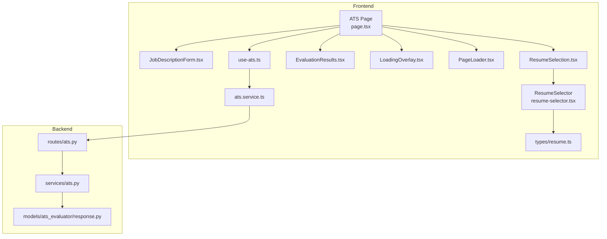
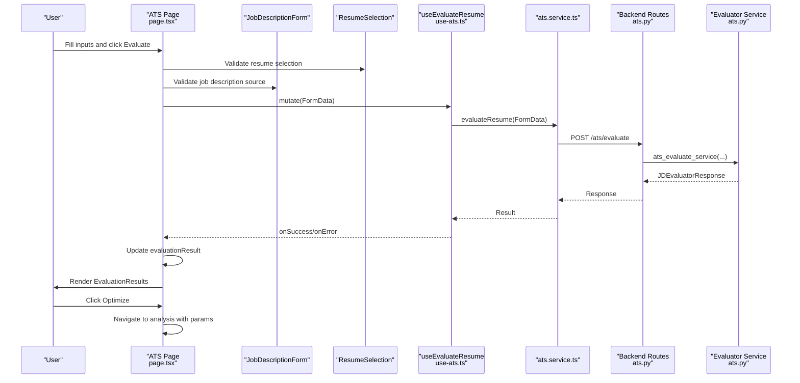
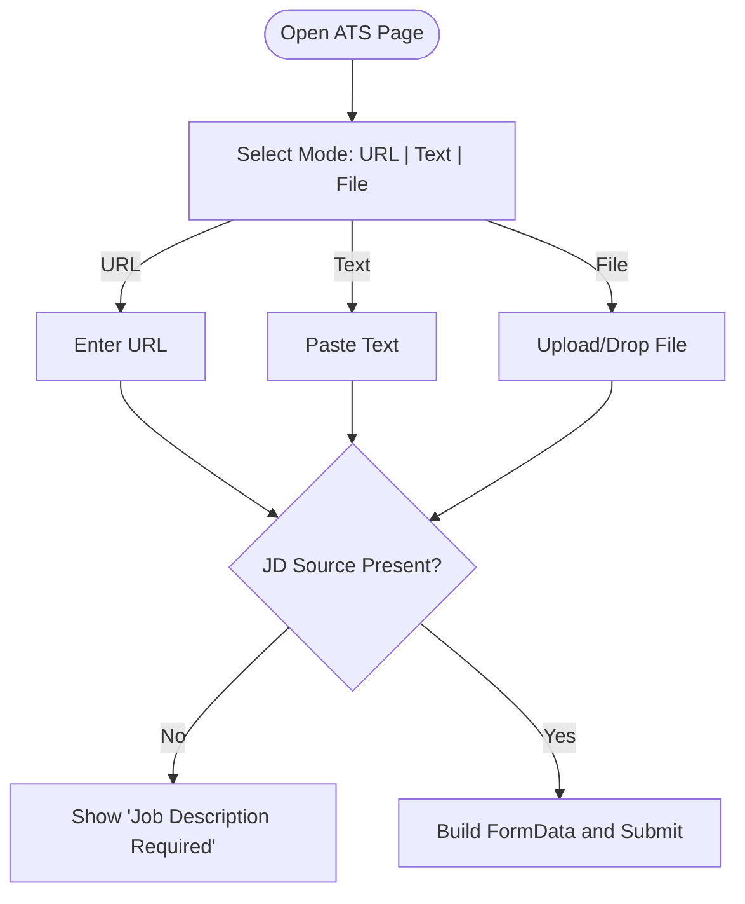
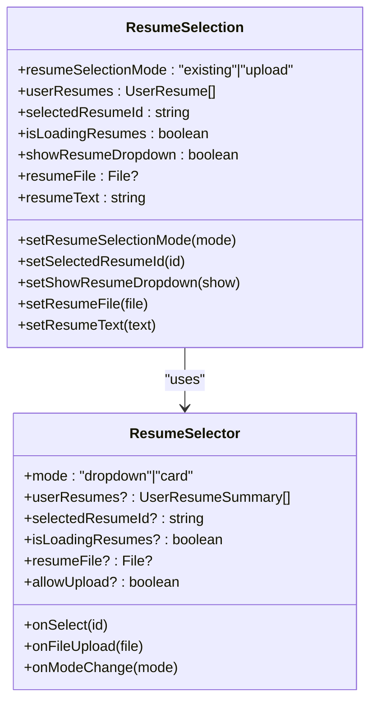
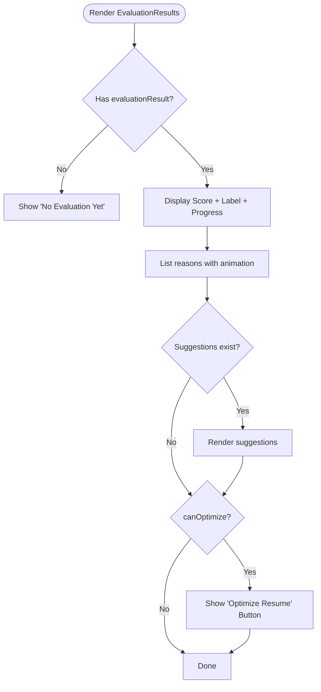
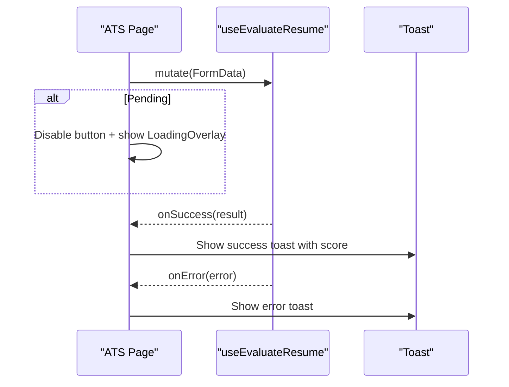
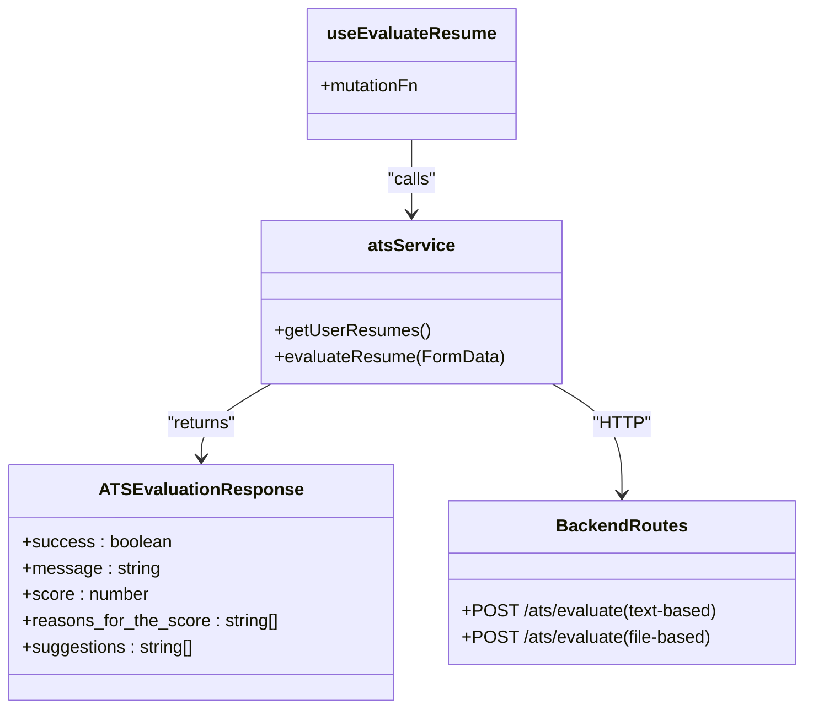
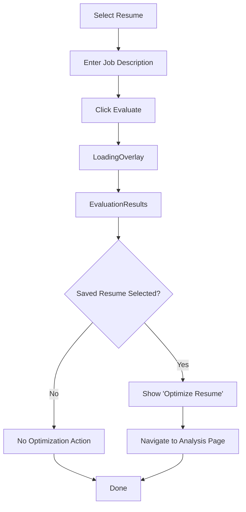
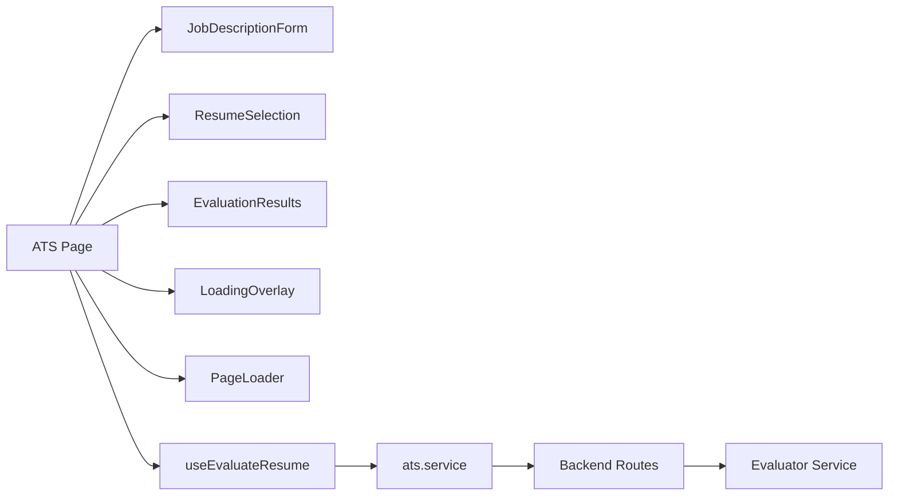

# Frontend ATS components

## Introduction
This page explains the frontend ATS (Applicant Tracking System) evaluation components. It covers:
- Job description input supporting text, URL, and file modes
- Resume selection allowing existing or uploaded resumes
- Evaluation results display with compatibility score, reasons, and suggestions
- Loading states, error handling, and user feedback
- Props, state management, and backend integration
- Responsive design patterns and accessibility features
- End-to-end UX flow from job description entry to optimization actions

## Project structure
The ATS evaluation feature spans frontend components and pages, backed by frontend services and hooks, and integrated with backend routes and services.

```mermaid
graph TB
subgraph "Frontend"
Page["ATS Page<br/>page.tsx"]
JDF["JobDescriptionForm.tsx"]
RSel["ResumeSelection.tsx"]
RSelShared["ResumeSelector<br/>resume-selector.tsx"]
Eval["EvaluationResults.tsx"]
Load["LoadingOverlay.tsx"]
PLoad["PageLoader.tsx"]
Hook["use-ats.ts"]
Svc["ats.service.ts"]
Types["types/resume.ts"]
end
subgraph "Backend"
Route["routes/ats.py"]
SvcB["services/ats.py"]
Model["models/ats_evaluator/response.py"]
end
Page --> JDF
Page --> RSel
Page --> Eval
Page --> Load
Page --> PLoad
Page --> Hook
Hook --> Svc
Svc --> Route
Route --> SvcB
SvcB --> Model
RSel --> RSelShared
RSelShared --> Types
```

## Core components
- JobDescriptionForm: Allows entering a job description via URL, text, or file upload. Manages mode switching and drag-and-drop file handling.
- ResumeSelection: Lets users pick an existing resume from a dropdown or upload a new one. Provides previews and loading states.
- EvaluationResults: Renders the ATS match score, reasons, suggestions, and optional optimization action.
- LoadingOverlay and PageLoader: Provide overlay and page-level loaders during evaluation and initial load.
- ATS Page: Orchestrates state, validation, mutation, and navigation to optimization.

## Architecture overview
End-to-end flow from input to results and optimization.

```mermaid
sequenceDiagram
participant U as "User"
participant P as "ATS Page<br/>page.tsx"
participant J as "JobDescriptionForm"
participant R as "ResumeSelection"
participant Q as "useEvaluateResume<br/>use-ats.ts"
participant S as "ats.service.ts"
participant B as "Backend Routes<br/>ats.py"
participant E as "Evaluator Service<br/>ats.py"
U->>P : Fill inputs and click Evaluate
P->>R : Validate resume selection
P->>J : Validate job description source
P->>Q : mutate(FormData)
Q->>S : evaluateResume(FormData)
S->>B : POST /ats/evaluate
B->>E : ats_evaluate_service(...)
E-->>B : JDEvaluatorResponse
B-->>S : Response
S-->>Q : Result
Q-->>P : onSuccess/onError
P->>P : Update evaluationResult
P->>U : Render EvaluationResults
U->>P : Click Optimize
P->>P : Navigate to analysis with params
```

## Detailed component analysis

### Job description input form
- Modes: URL, Text, File
- Behavior:
  - Mode switching clears conflicting fields to ensure only one source is submitted.
  - File mode supports drag-and-drop and preview.
  - Optional company metadata is captured alongside the job description.
- Props and state:
  - Receives formData, handleInputChange, jdFile, setJdFile.
  - Internal state tracks current mode and drag state.
- Validation and submission:
  - The parent page validates that at least one JD source is present before submitting.

```mermaid
flowchart TD
Start(["Open ATS Page"]) --> Mode["Select Mode: URL | Text | File"]
Mode --> |URL| URLInput["Enter URL"]
Mode --> |Text| TextInput["Paste Text"]
Mode --> |File| FilePick["Upload/Drop File"]
URLInput --> ValidateJD{"JD Source Present?"}
TextInput --> ValidateJD
FilePick --> ValidateJD
ValidateJD --> |No| Toast["Show 'Job Description Required'"]
ValidateJD --> |Yes| Submit["Build FormData and Submit"]
```

### Resume selection interface
- Modes: Existing or Upload
- Existing:
  - Dropdown lists user resumes with metadata and upload date.
  - Supports controlled selection via parent state.
- Upload:
  - File picker with drag-and-drop support.
  - Auto-preview for text/markdown files; binary preview otherwise.
- Props and state:
  - resumeSelectionMode, selectedResumeId, resumeFile, resumeText.
  - showResumeDropdown toggles the dropdown visibility.
- Integration:
  - Uses shared ResumeSelector component for reuse across features.

```mermaid
classDiagram
class ResumeSelection {
+resumeSelectionMode : "existing"|"upload"
+userResumes : UserResume[]
+selectedResumeId : string
+isLoadingResumes : boolean
+showResumeDropdown : boolean
+resumeFile : File?
+resumeText : string
+setResumeSelectionMode(mode)
+setSelectedResumeId(id)
+setShowResumeDropdown(show)
+setResumeFile(file)
+setResumeText(text)
}
class ResumeSelector {
+mode : "dropdown"|"card"
+userResumes? : UserResumeSummary[]
+selectedResumeId? : string
+onSelect(id)
+onFileUpload(file)
+isLoadingResumes? : boolean
+resumeFile? : File?
+allowUpload? : boolean
+onModeChange(mode)
}
ResumeSelection --> ResumeSelector : "uses"
```

### Evaluation results display
- Renders:
  - ATS match score with color-coded label and animated progress bar.
  - Reasons for the score as a list with staggered animations.
  - Suggestions if present.
  - Optional "Optimize Resume" CTA when evaluation is available and a saved resume is selected.
- Props:
  - evaluationResult: score, reasons_for_the_score[], suggestions[]
  - onOptimize: callback invoked when user clicks optimize
  - canOptimize: flag controlling whether the CTA is shown

```mermaid
flowchart TD
Init(["Render EvaluationResults"]) --> HasResult{"Has evaluationResult?"}
HasResult --> |No| Empty["Show 'No Evaluation Yet'"]
HasResult --> |Yes| Score["Display Score + Label + Progress"]
Score --> Reasons["List reasons with animation"]
Reasons --> Suggestions{"Suggestions exist?"}
Suggestions --> |Yes| ShowSugg["Render suggestions"]
Suggestions --> |No| OptimizeCheck{"canOptimize?"}
ShowSugg --> OptimizeCheck
OptimizeCheck --> |Yes| OptCTA["Show 'Optimize Resume' Button"]
OptimizeCheck --> |No| Done["Done"]
OptCTA --> Done
```

### Loading states, error handling, and feedback
- PageLoader: Full-page spinner while the page initializes.
- LoadingOverlay: Modal overlay during evaluation requests.
- Toast notifications:
  - Validation failures for missing inputs
  - Success and error callbacks from the evaluation mutation
- Disabled states:
  - Evaluate button is disabled when inputs are invalid or evaluation is pending.

```mermaid
sequenceDiagram
participant P as "ATS Page"
participant M as "useEvaluateResume"
participant T as "Toast"
P->>M : mutate(FormData)
alt Pending
P->>P : Disable button + show LoadingOverlay
end
M-->>P : onSuccess(result)
P->>T : Show success toast with score
M-->>P : onError(error)
P->>T : Show error toast
```

### Backend integration and API contract
- Frontend service:
  - atsService.evaluateResume(FormData) → ATSEvaluationResponse
  - atsService.getUserResumes() → { success, data: { resumes: UserResume[] } }
- Hooks:
  - useEvaluateResume(): mutation hook wrapping atsService.evaluateResume
  - useAtsUserResumes(): query hook for fetching resumes
- Backend routes:
  - Accepts multipart/form-data or JSON
  - Supports JD from text, link, or file
  - Processes files via process_document and enforces allowed extensions
- Response normalization:
  - Backend service normalizes evaluator output to JDEvaluatorResponse fields

```mermaid
classDiagram
class ATSEvaluationResponse {
+success : boolean
+message : string
+score : number
+reasons_for_the_score : string[]
+suggestions : string[]
}
class atsService {
+getUserResumes()
+evaluateResume(FormData)
}
class useEvaluateResume {
+mutationFn
}
class BackendRoutes {
+POST /ats/evaluate (text-based)
+POST /ats/evaluate (file-based)
}
atsService --> ATSEvaluationResponse : "returns"
useEvaluateResume --> atsService : "calls"
atsService --> BackendRoutes : "HTTP"
```

### User experience flow: from input to optimization
- Step 1: Choose resume (existing or upload)
- Step 2: Provide job description (text, URL, or file)
- Step 3: Click Evaluate; observe LoadingOverlay
- Step 4: View results (score, reasons, suggestions)
- Step 5: Optionally optimize resume for the job description

```mermaid
flowchart TD
A["Select Resume"] --> B["Enter Job Description"]
B --> C["Click Evaluate"]
C --> D["LoadingOverlay"]
D --> E["EvaluationResults"]
E --> F{"Saved Resume Selected?"}
F --> |Yes| G["Show 'Optimize Resume'"]
F --> |No| H["No Optimization Action"]
G --> I["Navigate to Analysis Page"]
H --> J["Done"]
I --> J
```

## Dependency analysis
- Component coupling:
  - ATS Page composes JobDescriptionForm, ResumeSelection, EvaluationResults, and loaders.
  - ResumeSelection reuses ResumeSelector for consistent UX.
- External dependencies:
  - React Query for state management (useEvaluateResume, useAtsUserResumes)
  - TanStack Motion for animations
  - Lucide icons for UI affordances
- Backend contract:
  - Frontend sends FormData with resumeId or file, plus JD text/link/file and optional company metadata.
  - Backend validates and normalizes response to JDEvaluatorResponse.

```mermaid
graph LR
Page["ATS Page"] --> JDF["JobDescriptionForm"]
Page --> RSel["ResumeSelection"]
Page --> Eval["EvaluationResults"]
Page --> Load["LoadingOverlay"]
Page --> PLoad["PageLoader"]
Page --> Hook["useEvaluateResume"]
Hook --> Svc["ats.service"]
Svc --> Route["Backend Routes"]
Route --> SvcB["Evaluator Service"]
```

## Performance considerations
- Minimize re-renders:
  - Use memoization for callbacks passed to child components (e.g., handleOptimize).
  - Keep evaluationResult shallow to avoid unnecessary renders.
- Network efficiency:
  - Send only required fields in FormData (only one JD source and either resumeId or file).
- Rendering:
  - Use AnimatePresence and motion primitives judiciously; disable animations for low-power devices if needed.
- Accessibility:
  - Ensure focus management after dropdowns open/close.
  - Provide visible labels and keyboard navigation for all interactive elements.

## Troubleshooting guide
- Missing inputs:
  - If no resume is selected or no JD source is provided, the page shows a destructive toast and disables the Evaluate button.
- Evaluation errors:
  - On error, a toast displays the error message; the overlay remains until mutation completes.
- Backend validation:
  - Backend requires either jd_text or jd_link; unsupported file types trigger HTTP 400 with a clear message.
- Optimization not available:
  - The "Optimize" CTA appears only when a saved resume is selected and evaluation results are present.

## Conclusion
The ATS evaluation feature integrates a flexible job description input, reliable resume selection, and a clear results presentation with actionable suggestions. The frontend manages loading states and user feedback effectively, while the backend enforces validation and normalization. Together, they deliver a responsive and accessible ATS evaluation experience with a smooth path from input to optimization.
