# Keyword Analysis Engine

<cite>
**Referenced Files in This Document**
- [analysis/app.py](file://analysis/app.py)
- [analysis/Resume Analyser.ipynb](file://analysis/Resume Analyser.ipynb)
- [backend/app/services/resume_analysis.py](file://backend/app/services/resume_analysis.py)
- [backend/app/services/ats.py](file://backend/app/services/ats.py)
- [backend/app/services/data_processor.py](file://backend/app/services/data_processor.py)
- [backend/app/services/ats_evaluator/graph.py](file://backend/app/services/ats_evaluator/graph.py)
- [backend/app/data/prompt/ats_analysis.py](file://backend/app/data/prompt/ats_analysis.py)
- [backend/app/services/process_resume.py](file://backend/app/services/process_resume.py)
</cite>

## Table of Contents
1. [Introduction](#introduction)
2. [System Architecture](#system-architecture)
3. [Core Components](#core-components)
4. [Keyword Extraction Pipeline](#keyword-extraction-pipeline)
5. [TF-IDF Vectorization and Similarity Scoring](#tf-idf-vectorization-and-similarity-scoring)
6. [Natural Language Processing Techniques](#natural-language-processing-techniques)
7. [Semantic Matching with Machine Learning](#semantic-matching-with-machine-learning)
8. [Preprocessing Pipeline](#preprocessing-pipeline)
9. [Technical Terminology and Industry-Specific Jargon](#technical-terminology-and-industry-specific-jargon)
10. [Soft Skills Identification](#soft-skills-identification)
11. [Integration Examples](#integration-examples)
12. [Performance Considerations](#performance-considerations)
13. [Troubleshooting Guide](#troubleshooting-guide)
14. [Conclusion](#conclusion)

## Introduction

The Keyword Analysis Engine is a sophisticated system designed to extract, analyze, and match keywords from resumes and job descriptions. This system combines traditional keyword extraction techniques with modern machine learning approaches to provide comprehensive ATS (Applicant Tracking System) compatibility analysis and semantic matching capabilities.

The engine operates through two primary pathways: a traditional TF-IDF based classification system for resume categorization, and an advanced semantic analysis system powered by Large Language Models (LLMs) for contextual keyword matching and job description analysis.

## System Architecture

The Keyword Analysis Engine follows a modular architecture with clear separation of concerns:

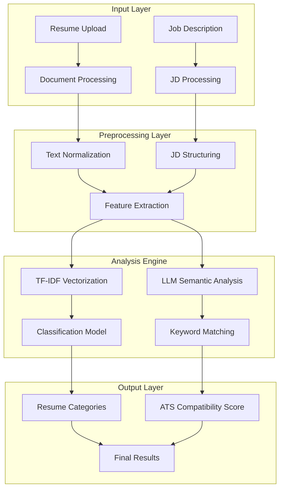

**Diagram sources**
- [analysis/app.py](file://analysis/app.py#L196-L347)
- [backend/app/services/resume_analysis.py](file://backend/app/services/resume_analysis.py#L28-L157)
- [backend/app/services/ats.py](file://backend/app/services/ats.py#L22-L214)

## Core Components

### Traditional TF-IDF Classification System

The legacy system utilizes TF-IDF vectorization combined with machine learning classification for resume categorization:

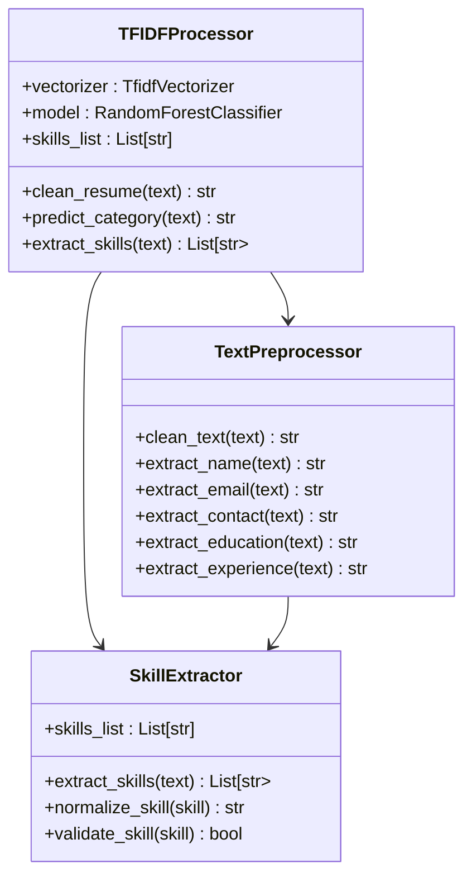

**Diagram sources**
- [analysis/app.py](file://analysis/app.py#L21-L194)

### Modern LLM-Based Analysis System

The contemporary system leverages Large Language Models for semantic understanding and contextual keyword matching:

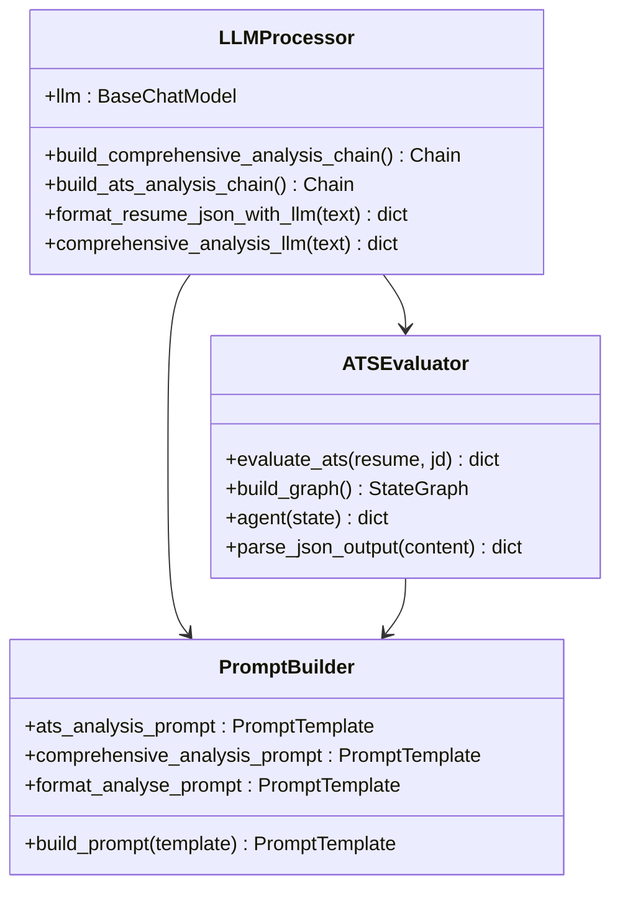

**Diagram sources**
- [backend/app/services/data_processor.py](file://backend/app/services/data_processor.py#L186-L268)
- [backend/app/services/ats_evaluator/graph.py](file://backend/app/services/ats_evaluator/graph.py#L116-L202)

**Section sources**
- [analysis/app.py](file://analysis/app.py#L1-L347)
- [backend/app/services/resume_analysis.py](file://backend/app/services/resume_analysis.py#L1-L364)
- [backend/app/services/ats.py](file://backend/app/services/ats.py#L1-L214)

## Keyword Extraction Pipeline

The keyword extraction pipeline operates through multiple stages to ensure comprehensive coverage of relevant terms:

### Stage 1: Text Extraction and Normalization

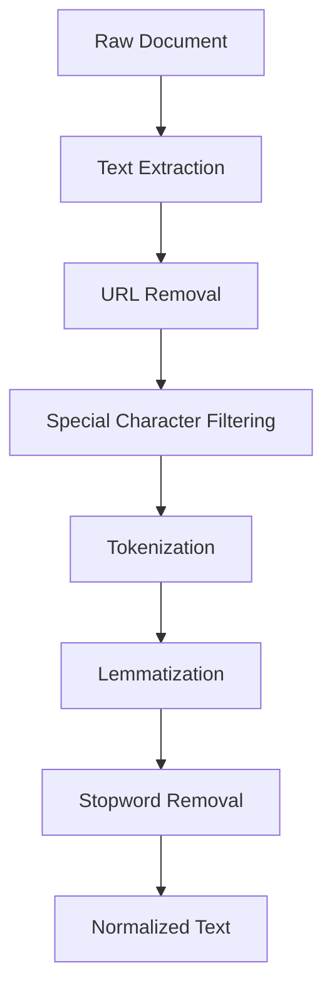

**Diagram sources**
- [analysis/app.py](file://analysis/app.py#L21-L30)

### Stage 2: Skill Pattern Recognition

The system employs sophisticated pattern matching for skill identification:

| Skill Category | Pattern Type | Examples |
|---|---|---|
| Technical Skills | Exact Match | Java, Python, React, SQL |
| Frameworks | Multi-word Patterns | Spring Boot, Django, Angular |
| Tools & Technologies | Specialized Terms | Docker, Kubernetes, Jenkins |
| Certifications | Formal Credentials | AWS, PMP, CPA |
| Soft Skills | Descriptive Terms | Leadership, Communication |

### Stage 3: Contextual Keyword Enhancement

The LLM-based system enhances keyword extraction through contextual understanding:

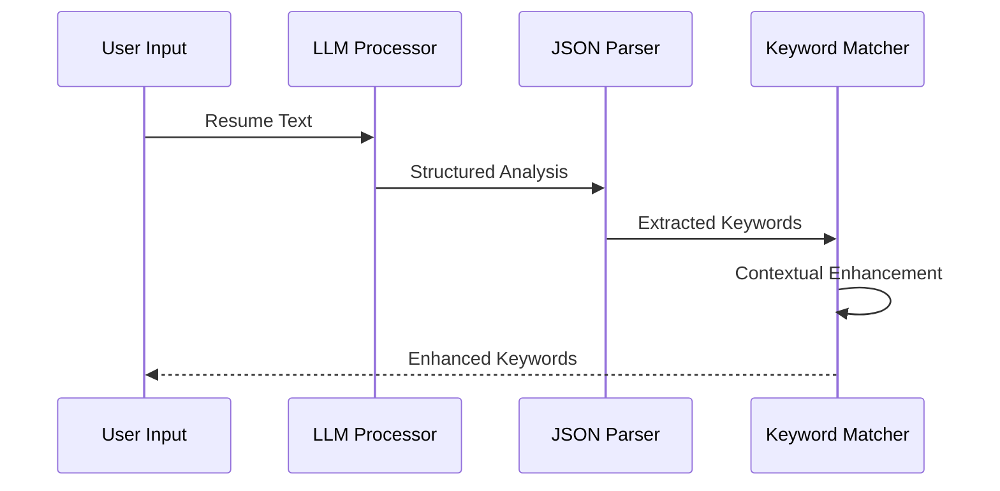

**Diagram sources**
- [backend/app/services/data_processor.py](file://backend/app/services/data_processor.py#L66-L130)

**Section sources**
- [analysis/app.py](file://analysis/app.py#L92-L118)
- [backend/app/services/data_processor.py](file://backend/app/services/data_processor.py#L66-L130)

## TF-IDF Vectorization and Similarity Scoring

### Vectorization Process

The TF-IDF (Term Frequency-Inverse Document Frequency) implementation transforms text documents into numerical vectors for machine learning analysis:

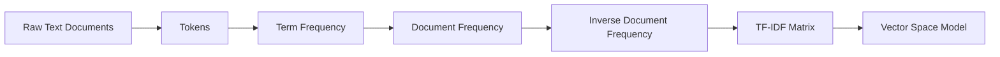

**Diagram sources**
- [analysis/Resume Analyser.ipynb](file://analysis/Resume Analyser.ipynb#L16-L18)

### Similarity Scoring Algorithms

The system employs multiple similarity measurement techniques:

| Algorithm | Formula | Use Case |
|---|---|---|
| Cosine Similarity | `(A·B)/(||A||×||B||)` | Document similarity |
| Euclidean Distance | `√Σ(Ai-Bi)²` | Feature space distance |
| Jaccard Index | `|A∩B|/|A∪B|` | Set overlap analysis |
| Edit Distance | Levenshtein distance | Spelling correction |

### Classification Workflow

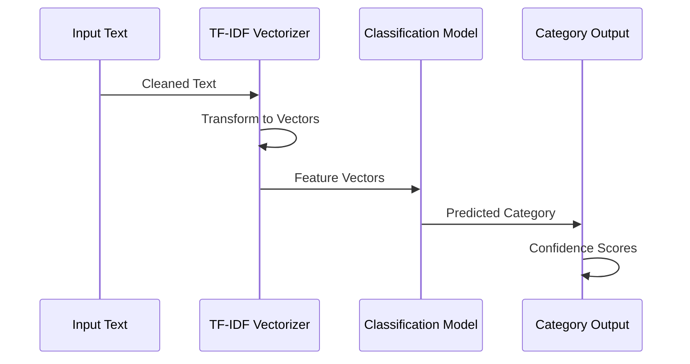

**Diagram sources**
- [analysis/app.py](file://analysis/app.py#L120-L134)

**Section sources**
- [analysis/Resume Analyser.ipynb](file://analysis/Resume Analyser.ipynb#L16-L18)
- [analysis/app.py](file://analysis/app.py#L120-L134)

## Natural Language Processing Techniques

### Text Preprocessing Pipeline

The NLP pipeline implements comprehensive text normalization:

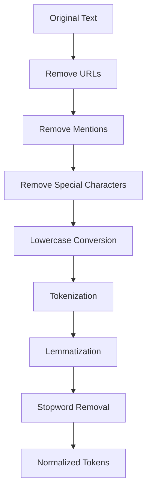

**Diagram sources**
- [analysis/app.py](file://analysis/app.py#L21-L30)

### Named Entity Recognition

The system identifies and categorizes key entities:

| Entity Type | Recognition Patterns | Examples |
|---|---|---|
| Personal Names | Capitalized Proper Nouns | John Smith, Maria Garcia |
| Email Addresses | Email Regex Patterns | john@company.com |
| Phone Numbers | Phone Number Patterns | (555) 123-4567 |
| Educational Institutions | University Keywords | MIT, Harvard, Stanford |
| Companies | Company Keywords | Google, Microsoft, Amazon |

### Part-of-Speech Tagging

Contextual understanding through grammatical analysis enables better keyword interpretation and relevance scoring.

**Section sources**
- [analysis/app.py](file://analysis/app.py#L21-L30)
- [analysis/app.py](file://analysis/app.py#L52-L71)

## Semantic Matching with Machine Learning

### LLM Integration Architecture

The semantic analysis leverages advanced language models for contextual understanding:

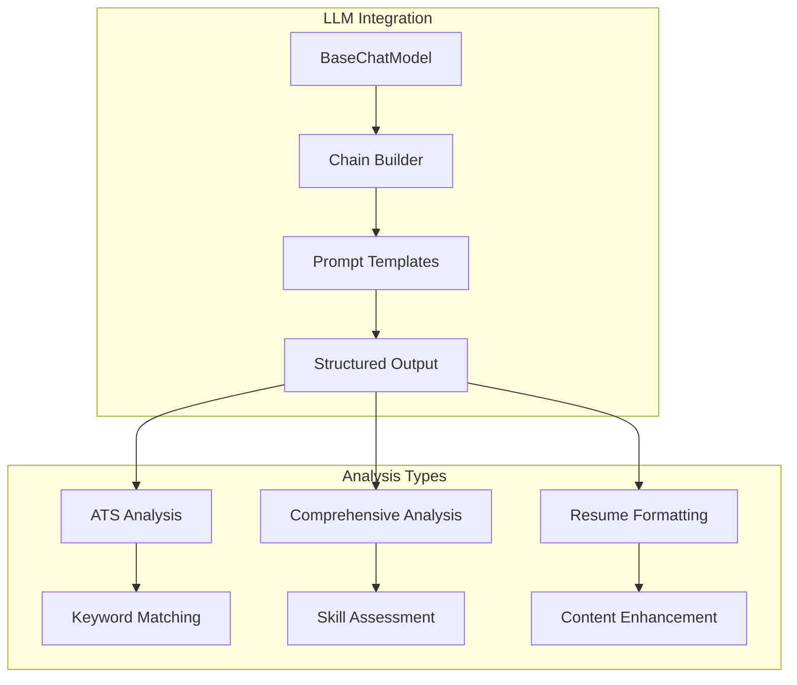

**Diagram sources**
- [backend/app/services/data_processor.py](file://backend/app/services/data_processor.py#L186-L268)

### Semantic Similarity Calculation

The system calculates semantic similarity through multiple approaches:

1. **Vector-based Similarity**: Cosine similarity between TF-IDF vectors
2. **Embedding-based Similarity**: Semantic embeddings from transformer models
3. **Contextual Similarity**: LLM-generated relevance scores
4. **Hybrid Approach**: Weighted combination of all methods

### Dynamic Keyword Expansion

The LLM system dynamically expands keyword sets based on context:

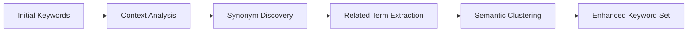

**Diagram sources**
- [backend/app/data/prompt/ats_analysis.py](file://backend/app/data/prompt/ats_analysis.py#L4-L55)

**Section sources**
- [backend/app/services/data_processor.py](file://backend/app/services/data_processor.py#L186-L268)
- [backend/app/data/prompt/ats_analysis.py](file://backend/app/data/prompt/ats_analysis.py#L1-L69)

## Preprocessing Pipeline

### Document Processing Workflow

The preprocessing pipeline handles multiple document formats with robust error handling:

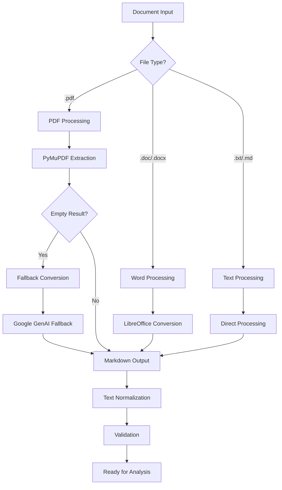

**Diagram sources**
- [backend/app/services/process_resume.py](file://backend/app/services/process_resume.py#L68-L91)

### Text Normalization Techniques

Comprehensive text cleaning ensures optimal analysis results:

| Normalization Step | Method | Purpose |
|---|---|---|
| URL Removal | Regex Pattern | Remove web links |
| Email Filtering | Regex Pattern | Preserve contact info |
| Special Character Cleanup | Unicode Normalization | Standardize characters |
| Tokenization | NLTK Word Tokenizer | Split into words |
| Lemmatization | spaCy/WordNet | Root form extraction |
| Stopword Removal | NLTK Stopwords | Remove common words |
| Case Normalization | Lowercase Conversion | Consistent formatting |

**Section sources**
- [backend/app/services/process_resume.py](file://backend/app/services/process_resume.py#L68-L91)
- [analysis/app.py](file://analysis/app.py#L21-L30)

## Technical Terminology and Industry-Specific Jargon

### Domain-Specific Skill Classification

The system categorizes technical skills across multiple domains:

```mermaid
mindmap
root((Technical Skills))
Programming Languages
Java
Python
JavaScript
C++
Go
Frameworks & Libraries
React
Django
Spring Boot
TensorFlow
Cloud Platforms
AWS
Azure
GCP
Kubernetes
Databases
PostgreSQL
MongoDB
Redis
Elasticsearch
DevOps Tools
Docker
Jenkins
Terraform
Ansible
```

### Industry-Specific Terminology

The system adapts to different industry contexts through dynamic vocabulary expansion and domain-specific training data.

**Section sources**
- [analysis/app.py](file://analysis/app.py#L168-L194)

## Soft Skills Identification

### Soft Skills Recognition Patterns

The system identifies soft skills through contextual analysis:

| Soft Skill Category | Recognition Indicators | Examples |
|---|---|---|
| Communication | Presentation, Teamwork, Negotiation | "Excellent communication skills" |
| Leadership | Management, Delegation, Motivation | "Team lead experience" |
| Problem Solving | Analytical, Creative, Critical Thinking | "Problem-solving abilities" |
| Adaptability | Flexibility, Learning Agility | "Quick learner" |
| Collaboration | Team Player, Interpersonal Skills | "Great team player" |

### Contextual Understanding

LLM-based analysis provides nuanced understanding of soft skills through:

- **Sentence Context**: Surrounding context analysis
- **Experience Description**: Role-based skill demonstration
- **Achievement Metrics**: Quantifiable skill applications
- **Recommendation Analysis**: Third-party skill validation

**Section sources**
- [backend/app/services/data_processor.py](file://backend/app/services/data_processor.py#L186-L268)

## Integration Examples

### API Integration Patterns

The system provides flexible integration points for different use cases:

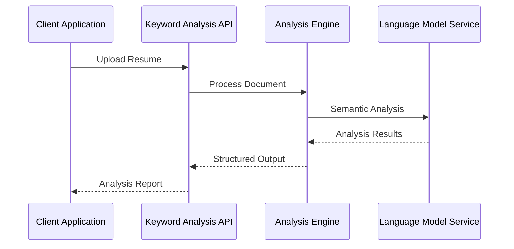

**Diagram sources**
- [backend/app/services/resume_analysis.py](file://backend/app/services/resume_analysis.py#L28-L157)

### ATS Compatibility Scoring

The system generates comprehensive ATS compatibility assessments:

| Compatibility Area | Scoring Criteria | Weight |
|---|---|---|
| Required Keywords | Presence/absence match | 30% |
| Optional Keywords | Relevance scoring | 20% |
| Contact Information | Completeness check | 15% |
| Content Quality | Clarity and achievements | 15% |
| Formatting | Section structure | 10% |
| Semantic Alignment | Contextual relevance | 10% |

**Section sources**
- [backend/app/data/prompt/ats_analysis.py](file://backend/app/data/prompt/ats_analysis.py#L21-L55)

## Performance Considerations

### Optimization Strategies

The system implements several performance optimization techniques:

1. **Caching Mechanisms**: Store processed results for repeated queries
2. **Batch Processing**: Handle multiple documents concurrently
3. **Memory Management**: Efficient handling of large documents
4. **Model Optimization**: Quantized models for faster inference
5. **Resource Pooling**: Shared LLM connections for multiple requests

### Scalability Architecture

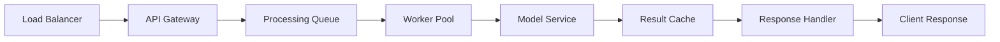

## Troubleshooting Guide

### Common Issues and Solutions

| Issue | Symptoms | Solution |
|---|---|---|
| PDF Processing Failure | Empty text extraction | Enable fallback conversion |
| LLM API Errors | Rate limiting, authentication | Implement retry logic |
| Memory Issues | Out of memory errors | Optimize batch sizes |
| Slow Performance | Long processing times | Enable caching, optimize models |
| Inaccurate Results | Wrong keyword matches | Adjust threshold parameters |

### Error Handling Patterns

The system implements comprehensive error handling:

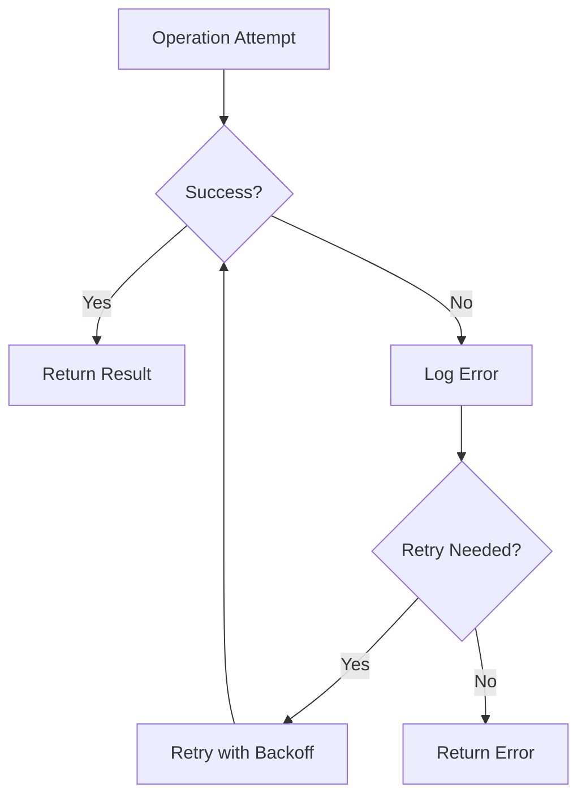

**Section sources**
- [backend/app/services/data_processor.py](file://backend/app/services/data_processor.py#L50-L63)
- [backend/app/services/process_resume.py](file://backend/app/services/process_resume.py#L12-L53)

## Conclusion

The Keyword Analysis Engine represents a comprehensive solution for modern talent acquisition needs. By combining traditional TF-IDF classification with advanced LLM-powered semantic analysis, the system provides both precise keyword matching and contextual understanding capabilities.

Key strengths of the system include:

- **Dual-approach Architecture**: Traditional and modern methods complement each other
- **Industry Adaptability**: Dynamic skill categorization across domains
- **Scalable Design**: Optimized for enterprise-scale deployments
- **Robust Error Handling**: Comprehensive fault tolerance mechanisms
- **Flexible Integration**: Multiple API patterns for diverse use cases

The system continues to evolve with advances in NLP and machine learning, ensuring it remains at the forefront of intelligent keyword analysis and semantic matching technologies.