# Keyword analysis engine

## Introduction

The Keyword Analysis Engine is a sophisticated system designed to extract, analyze, and match keywords from resumes and job descriptions. This system combines traditional keyword extraction techniques with modern machine learning approaches to provide detailed ATS (Applicant Tracking System) compatibility analysis and semantic matching capabilities.

The engine operates through two primary pathways: a traditional TF-IDF based classification system for resume categorization, and an advanced semantic analysis system powered by Large Language Models (LLMs) for contextual keyword matching and job description analysis.

## System architecture

The Keyword Analysis Engine follows a modular architecture with clear separation of concerns:

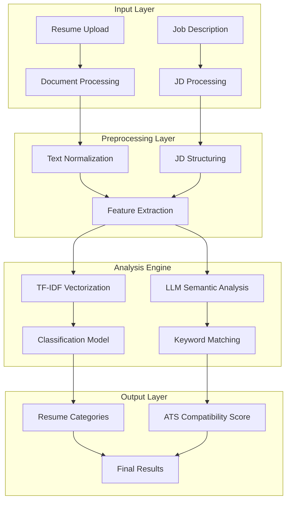
```mermaid
graph TB
subgraph "Input Layer"
A[Resume Upload] --> B[Document Processing]
C[Job Description] --> D[JD Processing]
end
subgraph "Preprocessing Layer"
B --> E[Text Normalization]
D --> F[JD Structuring]
E --> G[Feature Extraction]
F --> G
end
subgraph "Analysis Engine"
G --> H[TF-IDF Vectorization]
G --> I[LLM Semantic Analysis]
H --> J[Classification Model]
I --> K[Keyword Matching]
end
subgraph "Output Layer"
J --> L[Resume Categories]
K --> M[ATS Compatibility Score]
L --> N[Final Results]
M --> N
end
```

## Core components

### Traditional TF-IDF classification system

The legacy system uses TF-IDF vectorization combined with machine learning classification for resume categorization:

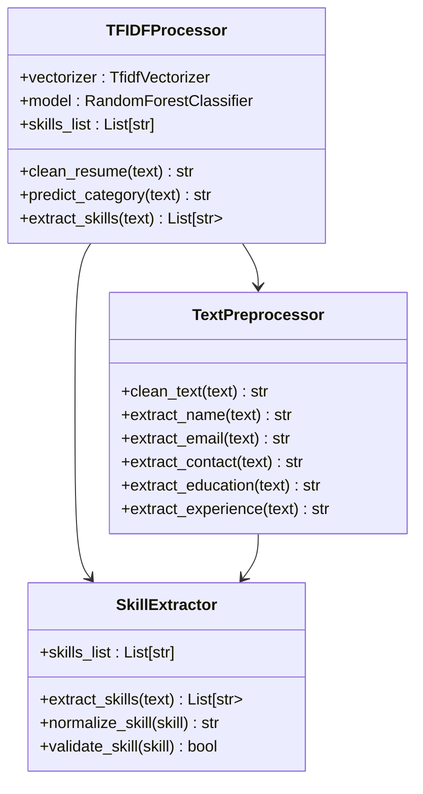
```mermaid
classDiagram
class TFIDFProcessor {
+vectorizer : TfidfVectorizer
+model : RandomForestClassifier
+skills_list : List[str]
+clean_resume(text) str
+predict_category(text) str
+extract_skills(text) List[str>
}
class TextPreprocessor {
+clean_text(text) str
+extract_name(text) str
+extract_email(text) str
+extract_contact(text) str
+extract_education(text) str
+extract_experience(text) str
}
class SkillExtractor {
+skills_list : List[str]
+extract_skills(text) List[str>
+normalize_skill(skill) str
+validate_skill(skill) bool
}
TFIDFProcessor --> TextPreprocessor
TFIDFProcessor --> SkillExtractor
TextPreprocessor --> SkillExtractor
```

### Modern LLM-based analysis system

The contemporary system uses Large Language Models for semantic understanding and contextual keyword matching:

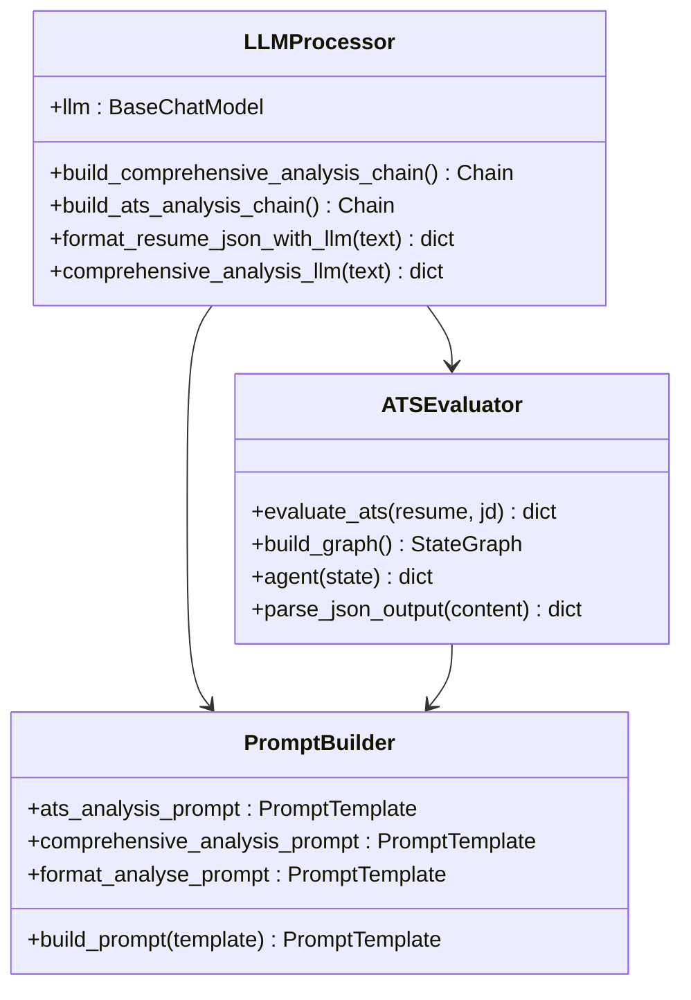
```mermaid
classDiagram
class LLMProcessor {
+llm : BaseChatModel
+build_comprehensive_analysis_chain() Chain
+build_ats_analysis_chain() Chain
+format_resume_json_with_llm(text) dict
+comprehensive_analysis_llm(text) dict
}
class ATSEvaluator {
+evaluate_ats(resume, jd) dict
+build_graph() StateGraph
+agent(state) dict
+parse_json_output(content) dict
}
class PromptBuilder {
+ats_analysis_prompt : PromptTemplate
+comprehensive_analysis_prompt : PromptTemplate
+format_analyse_prompt : PromptTemplate
+build_prompt(template) PromptTemplate
}
LLMProcessor --> ATSEvaluator
LLMProcessor --> PromptBuilder
ATSEvaluator --> PromptBuilder
```

## Keyword extraction pipeline

The keyword extraction pipeline operates through multiple stages to ensure detailed coverage of relevant terms:

### Stage 1: text extraction and normalization

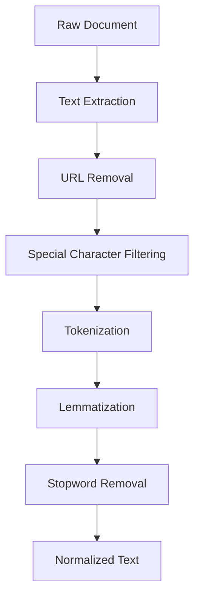
```mermaid
flowchart TD
A[Raw Document] --> B[Text Extraction]
B --> C[URL Removal]
C --> D[Special Character Filtering]
D --> E[Tokenization]
E --> F[Lemmatization]
F --> G[Stopword Removal]
G --> H[Normalized Text]
```

### Stage 2: skill pattern recognition

The system employs sophisticated pattern matching for skill identification:

| Skill Category | Pattern Type | Examples |
|---|---|---|
| Technical Skills | Exact Match | Java, Python, React, SQL |
| Frameworks | Multi-word Patterns | Spring Boot, Django, Angular |
| Tools & Technologies | Specialized Terms | Docker, Kubernetes, Jenkins |
| Certifications | Formal Credentials | AWS, PMP, CPA |
| Soft Skills | Descriptive Terms | Leadership, Communication |

### Stage 3: contextual keyword enhancement

The LLM-based system improves keyword extraction through contextual understanding:

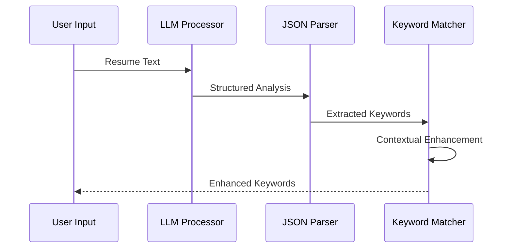
```mermaid
sequenceDiagram
participant User as User Input
participant LLM as LLM Processor
participant Parser as JSON Parser
participant Matcher as Keyword Matcher
User->>LLM : Resume Text
LLM->>Parser : Structured Analysis
Parser->>Matcher : Extracted Keywords
Matcher->>Matcher : Contextual Enhancement
Matcher-->>User : Enhanced Keywords
```

## TF-IDF vectorization and similarity scoring

### Vectorization process

The TF-IDF (Term Frequency-Inverse Document Frequency) implementation transforms text documents into numerical vectors for machine learning analysis:

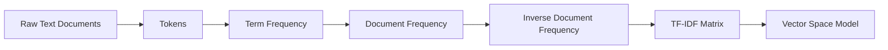
```mermaid
flowchart LR
A[Raw Text Documents] --> B[Tokens]
B --> C[Term Frequency]
C --> D[Document Frequency]
D --> E[Inverse Document Frequency]
E --> F[TF-IDF Matrix]
F --> G[Vector Space Model]
```

### Similarity scoring algorithms

The system employs multiple similarity measurement techniques:

| Algorithm | Formula | Use Case |
|---|---|---|
| Cosine Similarity | `(A·B)/(||A||×||B||)` | Document similarity |
| Euclidean Distance | `√Σ(Ai-Bi)²` | Feature space distance |
| Jaccard Index | `|A∩B|/|A∪B|` | Set overlap analysis |
| Edit Distance | Levenshtein distance | Spelling correction |

### Classification workflow

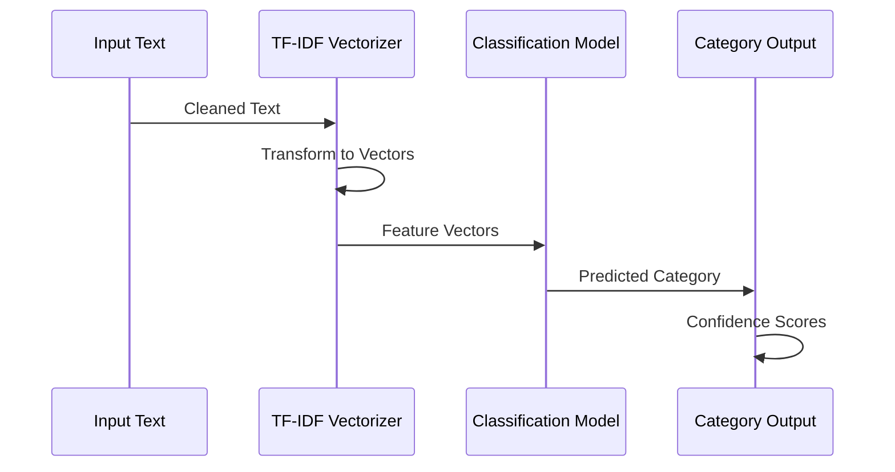
```mermaid
sequenceDiagram
participant Input as Input Text
participant Vectorizer as TF-IDF Vectorizer
participant Model as Classification Model
participant Output as Category Output
Input->>Vectorizer : Cleaned Text
Vectorizer->>Vectorizer : Transform to Vectors
Vectorizer->>Model : Feature Vectors
Model->>Output : Predicted Category
Output->>Output : Confidence Scores
```

## Natural language processing techniques

### Text preprocessing pipeline

The NLP pipeline implements detailed text normalization:

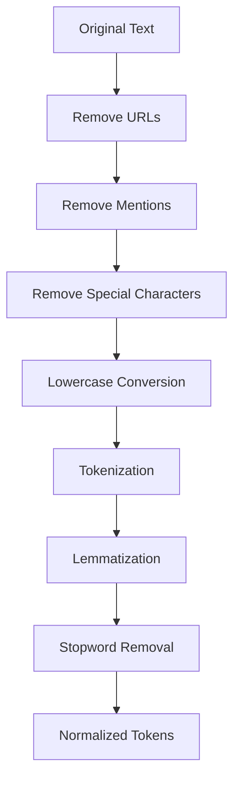
```mermaid
flowchart TD
A[Original Text] --> B[Remove URLs]
B --> C[Remove Mentions]
C --> D[Remove Special Characters]
D --> E[Lowercase Conversion]
E --> F[Tokenization]
F --> G[Lemmatization]
G --> H[Stopword Removal]
H --> I[Normalized Tokens]
```

### Named entity recognition

The system identifies and categorizes key entities:

| Entity Type | Recognition Patterns | Examples |
|---|---|---|
| Personal Names | Capitalized Proper Nouns | John Smith, Maria Garcia |
| Email Addresses | Email Regex Patterns | john@company.com |
| Phone Numbers | Phone Number Patterns | (555) 123-4567 |
| Educational Institutions | University Keywords | MIT, Harvard, Stanford |
| Companies | Company Keywords | Google, Microsoft, Amazon |

### Part-of-Speech tagging

Contextual understanding through grammatical analysis enables better keyword interpretation and relevance scoring.

## Semantic matching with machine learning

### LLM integration architecture

The semantic analysis uses advanced language models for contextual understanding:

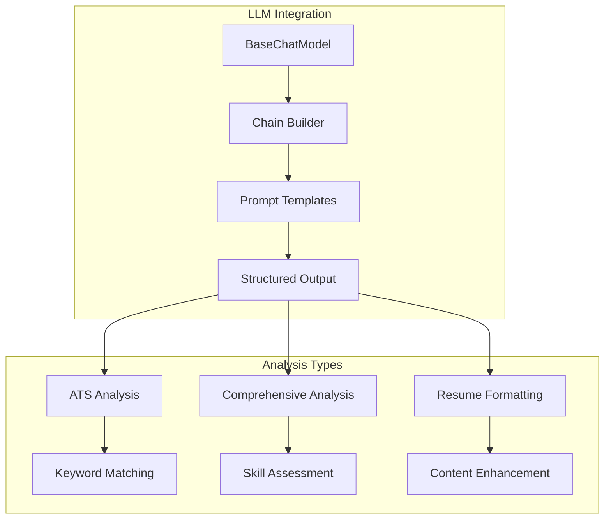
```mermaid
graph TB
subgraph "LLM Integration"
A[BaseChatModel] --> B[Chain Builder]
B --> C[Prompt Templates]
C --> D[Structured Output]
end
subgraph "Analysis Types"
E[ATS Analysis] --> F[Keyword Matching]
G[Comprehensive Analysis] --> H[Skill Assessment]
I[Resume Formatting] --> J[Content Enhancement]
end
D --> E
D --> G
D --> I
```

### Semantic similarity calculation

The system calculates semantic similarity through multiple approaches:

1. **Vector-based Similarity**: Cosine similarity between TF-IDF vectors
2. **Embedding-based Similarity**: Semantic embeddings from transformer models
3. **Contextual Similarity**: LLM-generated relevance scores
4. **Hybrid Approach**: Weighted combination of all methods

### Dynamic keyword expansion

The LLM system dynamically expands keyword sets based on context:

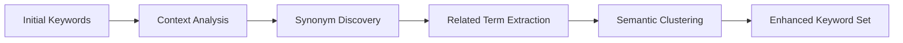
```mermaid
flowchart LR
A[Initial Keywords] --> B[Context Analysis]
B --> C[Synonym Discovery]
C --> D[Related Term Extraction]
D --> E[Semantic Clustering]
E --> F[Enhanced Keyword Set]
```

## Preprocessing pipeline

### Document processing workflow

The preprocessing pipeline handles multiple document formats with reliable error handling:

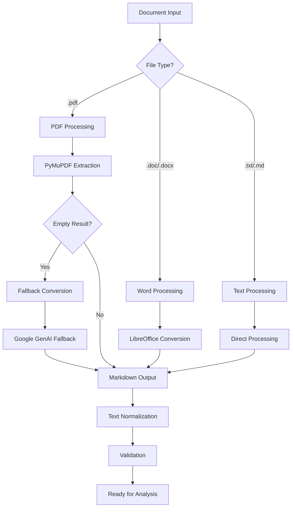
```mermaid
flowchart TD
A[Document Input] --> B{File Type?}
B --> |.pdf|.pdf[PDF Processing]
B --> |.doc/.docx|.doc[Word Processing]
B --> |.txt/.md|.txt[Text Processing]
.pdf --> C[PyMuPDF Extraction]
C --> D{Empty Result?}
D --> |Yes| E[Fallback Conversion]
D --> |No| F[Markdown Output]
.doc --> G[LibreOffice Conversion]
.txt --> H[Direct Processing]
E --> I[Google GenAI Fallback]
G --> F
H --> F
I --> F
F --> J[Text Normalization]
J --> K[Validation]
K --> L[Ready for Analysis]
```

### Text normalization techniques

Detailed text cleaning ensures optimal analysis results:

| Normalization Step | Method | Purpose |
|---|---|---|
| URL Removal | Regex Pattern | Remove web links |
| Email Filtering | Regex Pattern | Preserve contact info |
| Special Character Cleanup | Unicode Normalization | Standardize characters |
| Tokenization | NLTK Word Tokenizer | Split into words |
| Lemmatization | spaCy/WordNet | Root form extraction |
| Stopword Removal | NLTK Stopwords | Remove common words |
| Case Normalization | Lowercase Conversion | Consistent formatting |

## Technical terminology and industry-specific jargon

### Domain-Specific skill classification

The system categorizes technical skills across multiple domains:

```mermaid
mindmap
root((Technical Skills))
Programming Languages
Java
Python
JavaScript
C++
Go
Frameworks & Libraries
React
Django
Spring Boot
TensorFlow
Cloud Platforms
AWS
Azure
GCP
Kubernetes
Databases
PostgreSQL
MongoDB
Redis
Elasticsearch
DevOps Tools
Docker
Jenkins
Terraform
Ansible
```

### Industry-Specific terminology

The system adapts to different industry contexts through dynamic vocabulary expansion and domain-specific training data.

## Soft skills identification

### Soft skills recognition patterns

The system identifies soft skills through contextual analysis:

| Soft Skill Category | Recognition Indicators | Examples |
|---|---|---|
| Communication | Presentation, Teamwork, Negotiation | "Excellent communication skills" |
| Leadership | Management, Delegation, Motivation | "Team lead experience" |
| Problem Solving | Analytical, Creative, Critical Thinking | "Problem-solving abilities" |
| Adaptability | Flexibility, Learning Agility | "Quick learner" |
| Collaboration | Team Player, Interpersonal Skills | "Great team player" |

### Contextual understanding

LLM-based analysis provides nuanced understanding of soft skills through:

- **Sentence Context**: Surrounding context analysis
- **Experience Description**: Role-based skill demonstration
- **Achievement Metrics**: Quantifiable skill applications
- **Recommendation Analysis**: Third-party skill validation

## Integration examples

### API integration patterns

The system provides flexible integration points for different use cases:

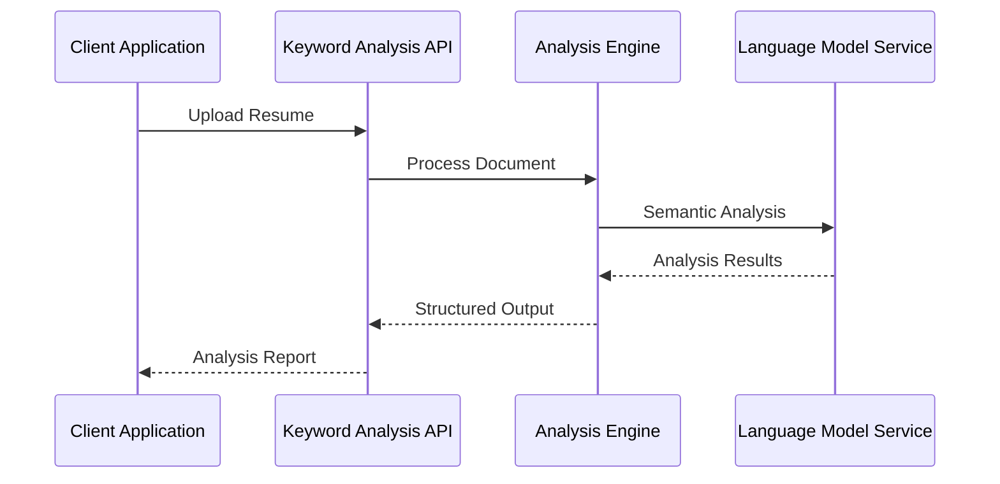
```mermaid
sequenceDiagram
participant Client as Client Application
participant API as Keyword Analysis API
participant Processor as Analysis Engine
participant LLM as Language Model Service
Client->>API : Upload Resume
API->>Processor : Process Document
Processor->>LLM : Semantic Analysis
LLM-->>Processor : Analysis Results
Processor-->>API : Structured Output
API-->>Client : Analysis Report
```

### ATS compatibility scoring

The system generates detailed ATS compatibility assessments:

| Compatibility Area | Scoring Criteria | Weight |
|---|---|---|
| Required Keywords | Presence/absence match | 30% |
| Optional Keywords | Relevance scoring | 20% |
| Contact Information | Completeness check | 15% |
| Content Quality | Clarity and achievements | 15% |
| Formatting | Section structure | 10% |
| Semantic Alignment | Contextual relevance | 10% |

## Performance considerations

### Optimization strategies

The system implements several performance optimization techniques:

1. **Caching Mechanisms**: Store processed results for repeated queries
2. **Batch Processing**: Handle multiple documents concurrently
3. **Memory Management**: Efficient handling of large documents
4. **Model Optimization**: Quantized models for faster inference
5. **Resource Pooling**: Shared LLM connections for multiple requests

### Scalability architecture

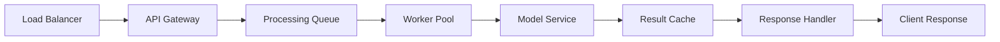
```mermaid
graph LR
A[Load Balancer] --> B[API Gateway]
B --> C[Processing Queue]
C --> D[Worker Pool]
D --> E[Model Service]
E --> F[Result Cache]
F --> G[Response Handler]
G --> H[Client Response]
```

## Troubleshooting guide

### Common issues and solutions

| Issue | Symptoms | Solution |
|---|---|---|
| PDF Processing Failure | Empty text extraction | Enable fallback conversion |
| LLM API Errors | Rate limiting, authentication | Implement retry logic |
| Memory Issues | Out of memory errors | Optimize batch sizes |
| Slow Performance | Long processing times | Enable caching, optimize models |
| Inaccurate Results | Wrong keyword matches | Adjust threshold parameters |

### Error handling patterns

The system implements detailed error handling:

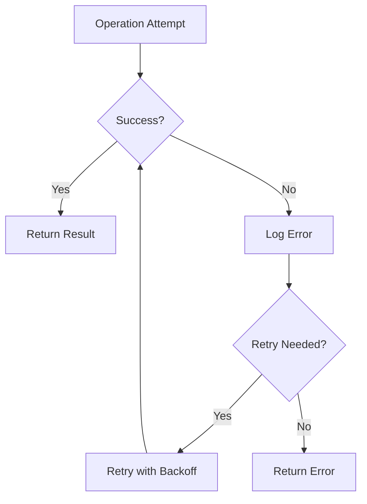
```mermaid
flowchart TD
A[Operation Attempt] --> B{Success?}
B --> |Yes| C[Return Result]
B --> |No| D[Log Error]
D --> E{Retry Needed?}
E --> |Yes| F[Retry with Backoff]
E --> |No| G[Return Error]
F --> B
```

## Conclusion

The Keyword Analysis Engine represents a detailed solution for modern talent acquisition needs. By combining traditional TF-IDF classification with advanced LLM-powered semantic analysis, the system provides both precise keyword matching and contextual understanding capabilities.

Key strengths of the system include:

- **Dual-approach Architecture**: Traditional and modern methods complement each other
- **Industry Adaptability**: Dynamic skill categorization across domains
- **Scalable Design**: Optimized for enterprise-scale deployments
- **Reliable Error Handling**: Detailed fault tolerance mechanisms
- **Flexible Integration**: Multiple API patterns for diverse use cases

The system continues to evolve with advances in NLP and machine learning, ensuring it remains at the forefront of intelligent keyword analysis and semantic matching technologies.
