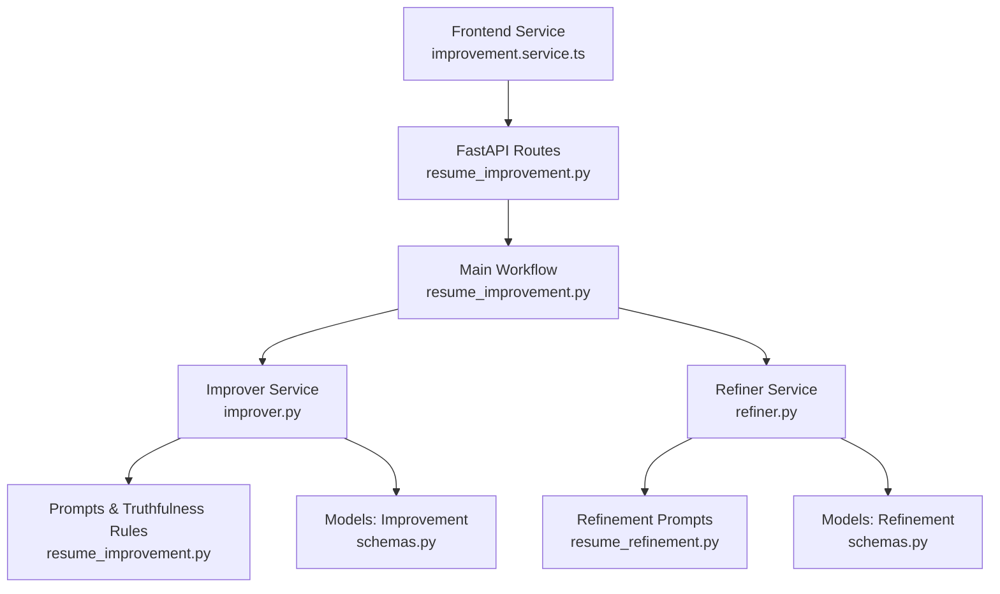
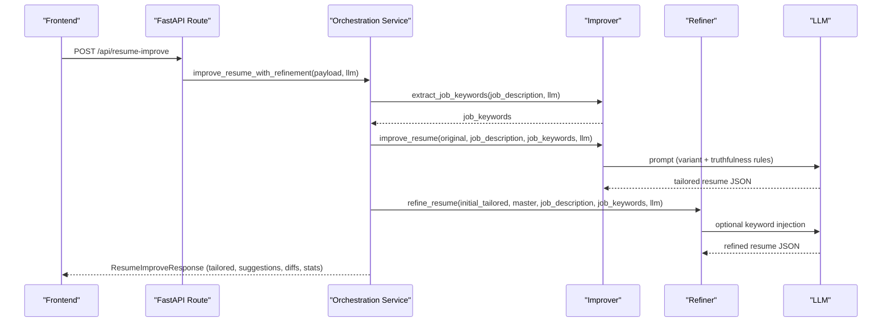
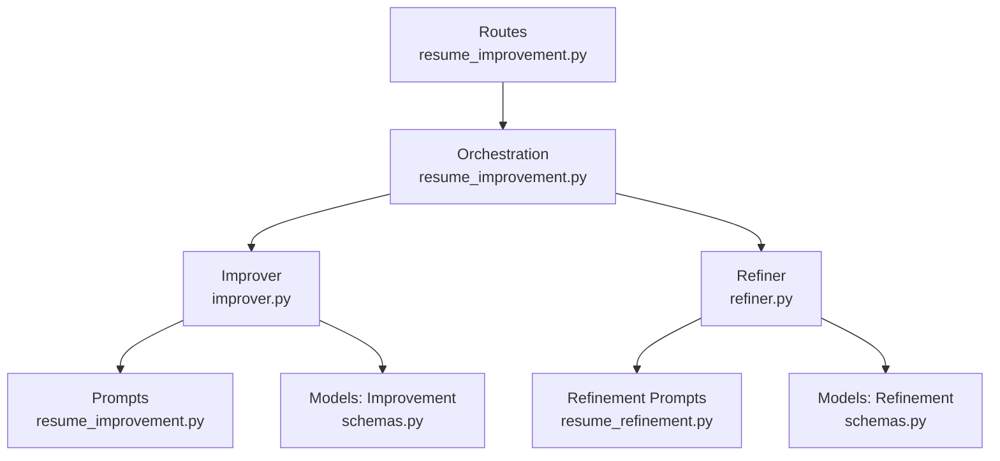

# Optimization Suggestions Engine

<cite>
**Referenced Files in This Document**
- [resume_improvement.py](file://backend/app/services/resume_improvement.py)
- [resume_improvement.py](file://backend/app/data/prompt/resume_improvement.py)
- [resume_improvement.py](file://backend/app/routes/resume_improvement.py)
- [improver.py](file://backend/app/services/improver.py)
- [refiner.py](file://backend/app/services/refiner.py)
- [schemas.py](file://backend/app/models/improvement/schemas.py)
- [schemas.py](file://backend/app/models/refinement/schemas.py)
- [improvement.service.ts](file://frontend/services/improvement.service.ts)
</cite>

## Table of Contents
1. [Introduction](#introduction)
2. [Project Structure](#project-structure)
3. [Core Components](#core-components)
4. [Architecture Overview](#architecture-overview)
5. [Detailed Component Analysis](#detailed-component-analysis)
6. [Dependency Analysis](#dependency-analysis)
7. [Performance Considerations](#performance-considerations)
8. [Troubleshooting Guide](#troubleshooting-guide)
9. [Conclusion](#conclusion)

## Introduction
This document explains the Optimization Suggestions Engine responsible for generating actionable, ATS-compatible recommendations to improve resumes. It covers:
- How the system extracts job requirements and aligns resume content
- The suggestion categorization system for grouping recommendations by priority and impact
- Natural language generation prompts that produce human-readable optimization advice
- The personalized suggestion engine that adapts recommendations based on individual resume profiles
- Examples of common suggestion patterns such as keyword insertion, experience reformatting, and skill alignment
- The suggestion validation process and confidence scoring for each recommendation
- The integration between suggestion generation and resume editing workflows

## Project Structure
The engine spans backend services, prompts, models, and frontend integration:
- Backend routes expose endpoints for resume improvement and refinement
- Services orchestrate keyword extraction, resume tailoring, refinement passes, and diff calculation
- Prompts define structured instructions for LLMs to maintain truthfulness and improve ATS compatibility
- Models define request/response schemas and refinement statistics
- Frontend integrates via typed service calls

**Diagram sources**
- [improvement.service.ts](file://frontend/services/improvement.service.ts#L1-L49)
- [resume_improvement.py](file://backend/app/routes/resume_improvement.py#L1-L43)
- [resume_improvement.py](file://backend/app/services/resume_improvement.py#L1-L188)
- [improver.py](file://backend/app/services/improver.py#L1-L549)
- [refiner.py](file://backend/app/services/refiner.py#L1-L407)
- [resume_improvement.py](file://backend/app/data/prompt/resume_improvement.py#L1-L225)
- [schemas.py](file://backend/app/models/improvement/schemas.py#L1-L92)
- [schemas.py](file://backend/app/models/refinement/schemas.py#L1-L126)

**Section sources**
- [resume_improvement.py](file://backend/app/routes/resume_improvement.py#L1-L43)
- [resume_improvement.py](file://backend/app/services/resume_improvement.py#L1-L188)
- [improver.py](file://backend/app/services/improver.py#L1-L549)
- [refiner.py](file://backend/app/services/refiner.py#L1-L407)
- [resume_improvement.py](file://backend/app/data/prompt/resume_improvement.py#L1-L225)
- [schemas.py](file://backend/app/models/improvement/schemas.py#L1-L92)
- [schemas.py](file://backend/app/models/refinement/schemas.py#L1-L126)
- [improvement.service.ts](file://frontend/services/improvement.service.ts#L1-L49)

## Core Components
- Resume Improvement Orchestration: Coordinates keyword extraction, resume tailoring, refinement, and diff calculation
- Improver Service: Generates tailored resume content using structured prompts and validates output
- Refiner Service: Performs multi-pass refinement to inject keywords safely, remove AI-generated phrases, and validate master resume alignment
- Prompt Templates: Define truthfulness rules, prompt variants, and keyword extraction instructions
- Schemas: Define request/response models, suggestion records, diffs, and refinement statistics
- Frontend Integration: Typed service calls to trigger improvement and refinement

Key responsibilities:
- Extract job keywords from job descriptions
- Tailor resume content to match keywords and job requirements while preserving truthfulness
- Compute confidence scores for suggested changes
- Validate that tailored content does not fabricate information absent from the master resume
- Provide actionable suggestions grouped by impact and priority

**Section sources**
- [resume_improvement.py](file://backend/app/services/resume_improvement.py#L66-L157)
- [improver.py](file://backend/app/services/improver.py#L71-L128)
- [refiner.py](file://backend/app/services/refiner.py#L35-L89)
- [resume_improvement.py](file://backend/app/data/prompt/resume_improvement.py#L55-L225)
- [schemas.py](file://backend/app/models/improvement/schemas.py#L11-L92)
- [schemas.py](file://backend/app/models/refinement/schemas.py#L6-L126)
- [improvement.service.ts](file://frontend/services/improvement.service.ts#L23-L48)

## Architecture Overview
The system follows a pipeline:
1. Frontend triggers improvement or refinement via typed service calls
2. FastAPI routes resolve the LLM dependency and delegate to the orchestration service
3. The orchestration service:
   - Extracts job keywords if not provided
   - Calls the Improver to tailor the resume using prompt variants
   - Optionally runs Refiner passes to inject keywords, remove AI phrases, and validate alignment
   - Computes diffs and builds improvement suggestions
4. Responses include tailored resume, suggestions, diffs, and refinement statistics

**Diagram sources**
- [improvement.service.ts](file://frontend/services/improvement.service.ts#L28-L34)
- [resume_improvement.py](file://backend/app/routes/resume_improvement.py#L21-L30)
- [resume_improvement.py](file://backend/app/services/resume_improvement.py#L66-L157)
- [improver.py](file://backend/app/services/improver.py#L71-L128)
- [refiner.py](file://backend/app/services/refiner.py#L35-L89)

## Detailed Component Analysis

### Resume Improvement Orchestration
Responsibilities:
- Validate inputs and handle missing job keywords
- Call Improver to tailor the resume
- Optionally refine the result against the master resume
- Preserve personal information from the original resume
- Compute diffs and generate improvement suggestions

Key behaviors:
- Personal info preservation warns if original data is unavailable or invalid
- Refinement attempts only if master resume data is provided
- Diff calculation compares master and improved data to surface changes
- Improvement suggestions are generated from extracted job keywords

**Section sources**
- [resume_improvement.py](file://backend/app/services/resume_improvement.py#L27-L157)

### Improver Service
Responsibilities:
- Extract job keywords from job descriptions
- Tailor resume content using prompt variants:
  - Nudge: minimal edits
  - Keyword enhance: weave in relevant keywords
  - Full tailor: comprehensive tailoring
- Enforce critical truthfulness rules per variant
- Validate output structure and sanitize inputs
- Compute diffs between original and improved data

Truthfulness rules:
- Do not add unmentioned skills, tools, certifications, or companies
- Do not invent achievements or timelines
- Preserve role, industry, and seniority levels
- Preserve original bullet counts and ordering

Confidence scoring:
- Medium confidence for modified entries
- High confidence for added/removed entries
- Low confidence for removed experience entries

**Section sources**
- [improver.py](file://backend/app/services/improver.py#L71-L128)
- [improver.py](file://backend/app/services/improver.py#L368-L516)
- [improver.py](file://backend/app/services/improver.py#L519-L548)
- [resume_improvement.py](file://backend/app/data/prompt/resume_improvement.py#L74-L102)
- [resume_improvement.py](file://backend/app/data/prompt/resume_improvement.py#L104-L189)

### Refiner Service
Responsibilities:
- Multi-pass refinement:
  - Keyword injection: inject safe, missing keywords from the master resume
  - AI phrase removal: strip generic AI-generated phrases
  - Master alignment check: detect and fix fabrications compared to the master resume
- Keyword gap analysis: compute current vs. potential match percentages
- Final keyword match calculation and alignment report

Validation and safety:
- Ensures resume structure remains intact after refinement
- Fixes critical violations by removing fabricated content
- Tracks passes completed and actions taken

**Section sources**
- [refiner.py](file://backend/app/services/refiner.py#L35-L89)
- [refiner.py](file://backend/app/services/refiner.py#L92-L127)
- [refiner.py](file://backend/app/services/refiner.py#L156-L233)
- [refiner.py](file://backend/app/services/refiner.py#L337-L352)

### Prompt Templates and Natural Language Generation
Prompt variants:
- Nudge: minimal, conservative edits preserving structure and content
- Keyword enhance: rephrase bullet points to include relevant keywords
- Full tailor: comprehensive tailoring with emphasis on quantifiable achievements

Truthfulness rules:
- Strict constraints to avoid fabrication and preserve facts
- Variants adjust the degree of permissible expansion

Keyword extraction:
- Dedicated prompt extracts required skills, preferred skills, experience requirements, education requirements, key responsibilities, and keywords

**Section sources**
- [resume_improvement.py](file://backend/app/data/prompt/resume_improvement.py#L55-L72)
- [resume_improvement.py](file://backend/app/data/prompt/resume_improvement.py#L104-L189)
- [resume_improvement.py](file://backend/app/data/prompt/resume_improvement.py#L191-L213)

### Suggestion Categorization and Confidence Scoring
Suggestion generation:
- Builds improvement suggestions from job keywords (top required skills and key responsibilities)
- Provides human-readable summaries without line numbers for broad guidance

Confidence scoring:
- Added/removed entries: high confidence
- Modified entries: medium confidence
- Removed experience entries: low confidence

Diff computation:
- Compares skills, experiences, educations, projects, and bullet points
- Produces detailed change records and summary statistics

**Section sources**
- [improver.py](file://backend/app/services/improver.py#L519-L548)
- [improver.py](file://backend/app/services/improver.py#L368-L516)
- [schemas.py](file://backend/app/models/improvement/schemas.py#L11-L46)

### Personalized Suggestion Engine
Personalization leverages:
- Master resume profile to ensure truthfulness and prevent fabrication
- Job description and extracted keywords to tailor content
- Refinement configuration to control pass types and limits

Safety mechanisms:
- Master alignment validation prevents introducing fabricated skills, certifications, or companies
- AI phrase removal improves readability and ATS friendliness
- Keyword injection only adds terms present in the master resume

**Section sources**
- [refiner.py](file://backend/app/services/refiner.py#L156-L233)
- [refiner.py](file://backend/app/services/refiner.py#L255-L290)
- [schemas.py](file://backend/app/models/refinement/schemas.py#L6-L13)

### Common Suggestion Patterns
Examples of actionable patterns surfaced by the system:
- Keyword insertion: Weave relevant keywords into existing bullet points where evidence already exists
- Experience reformatting: Rephrase descriptions to emphasize quantifiable achievements and match job responsibilities
- Skill alignment: Highlight overlapping skills and certifications already present in the resume
- Truthful expansion: Elaborate on existing work without inventing new responsibilities

These patterns are derived from prompt variants and enforced by truthfulness rules.

**Section sources**
- [resume_improvement.py](file://backend/app/data/prompt/resume_improvement.py#L104-L189)
- [improver.py](file://backend/app/services/improver.py#L519-L548)

### Integration with Resume Editing Workflows
Frontend integration:
- Typed service methods call backend endpoints for improvement and refinement
- Requests include resume identifiers, job descriptions, optional job keywords, and refinement configuration

Backend endpoints:
- /api/resume-improve: orchestrates improvement and optional refinement
- /api/resume-refine: performs refinement on an already tailored resume

Responses:
- Improved or refined resume data
- Improvement suggestions
- Detailed diffs and summary statistics
- Refinement stats (passes completed, keywords injected, violations fixed)

**Section sources**
- [improvement.service.ts](file://frontend/services/improvement.service.ts#L23-L48)
- [resume_improvement.py](file://backend/app/routes/resume_improvement.py#L21-L42)
- [schemas.py](file://backend/app/models/improvement/schemas.py#L60-L92)
- [schemas.py](file://backend/app/models/refinement/schemas.py#L89-L126)

## Dependency Analysis
The system exhibits clear separation of concerns:
- Routes depend on orchestration service
- Orchestration service depends on Improver and Refiner
- Improver depends on prompt templates and LLM helpers
- Refiner depends on prompt templates and LLM helpers
- Models define contracts for requests, responses, and statistics

**Diagram sources**
- [resume_improvement.py](file://backend/app/routes/resume_improvement.py#L1-L43)
- [resume_improvement.py](file://backend/app/services/resume_improvement.py#L1-L188)
- [improver.py](file://backend/app/services/improver.py#L1-L549)
- [refiner.py](file://backend/app/services/refiner.py#L1-L407)
- [resume_improvement.py](file://backend/app/data/prompt/resume_improvement.py#L1-L225)
- [schemas.py](file://backend/app/models/improvement/schemas.py#L1-L92)
- [schemas.py](file://backend/app/models/refinement/schemas.py#L1-L126)

**Section sources**
- [resume_improvement.py](file://backend/app/routes/resume_improvement.py#L1-L43)
- [resume_improvement.py](file://backend/app/services/resume_improvement.py#L1-L188)
- [improver.py](file://backend/app/services/improver.py#L1-L549)
- [refiner.py](file://backend/app/services/refiner.py#L1-L407)
- [resume_improvement.py](file://backend/app/data/prompt/resume_improvement.py#L1-L225)
- [schemas.py](file://backend/app/models/improvement/schemas.py#L1-L92)
- [schemas.py](file://backend/app/models/refinement/schemas.py#L1-L126)

## Performance Considerations
- Token limits: Prompts specify maximum tokens for LLM responses to manage cost and latency
- Structured JSON output: Reduces parsing overhead and ensures robust validation
- Multi-pass refinement: Controlled via configuration to balance quality and performance
- Caching: Text extraction for keyword matching uses caching to reduce repeated computations
- Input sanitization: Injection patterns are redacted to prevent prompt injection attacks

[No sources needed since this section provides general guidance]

## Troubleshooting Guide
Common issues and mitigations:
- Empty job description or resume text: Validation returns failure with explanatory messages
- Missing original resume data: Personal info preservation warns and may generate AI-derived info
- Refinement failures: Logged warnings and graceful fallback to improved resume without refinement
- Truncated LLM output: Validation checks for required sections and raises errors if missing
- Fabrication detected: Critical violations are removed during alignment fixes

**Section sources**
- [resume_improvement.py](file://backend/app/services/resume_improvement.py#L71-L83)
- [resume_improvement.py](file://backend/app/services/resume_improvement.py#L125-L127)
- [improver.py](file://backend/app/services/improver.py#L61-L69)
- [refiner.py](file://backend/app/services/refiner.py#L156-L233)

## Conclusion
The Optimization Suggestions Engine combines structured prompting, multi-pass refinement, and strict truthfulness rules to generate actionable, ATS-friendly recommendations. It preserves personal information, validates alignment with the master resume, and provides confidence-aware suggestions. The modular architecture supports integration with resume editing workflows, enabling iterative improvement guided by job requirements and keyword alignment.