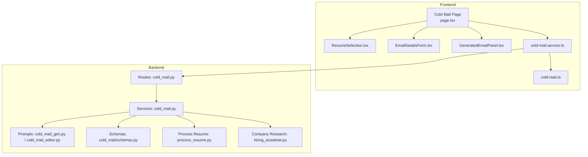
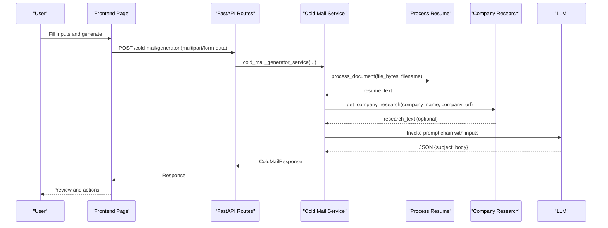
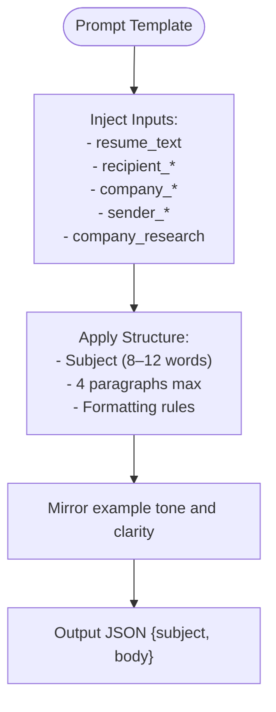
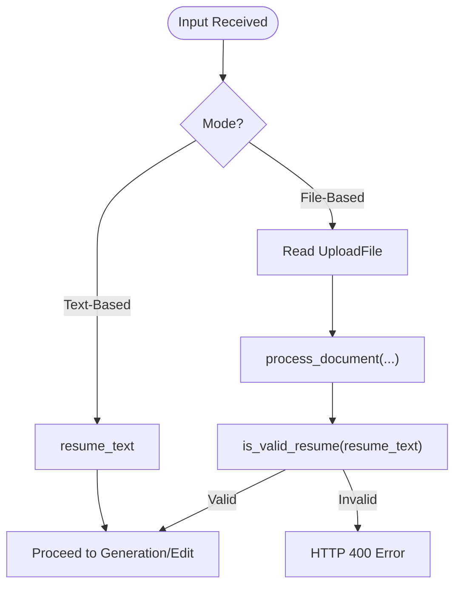
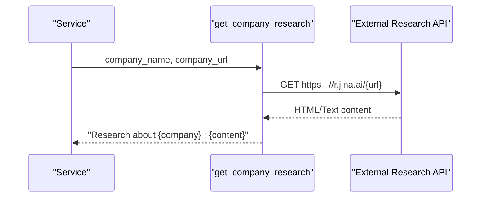
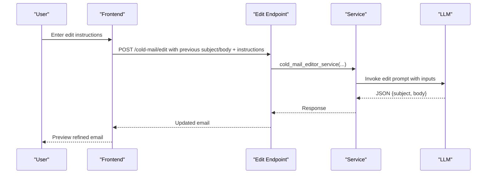
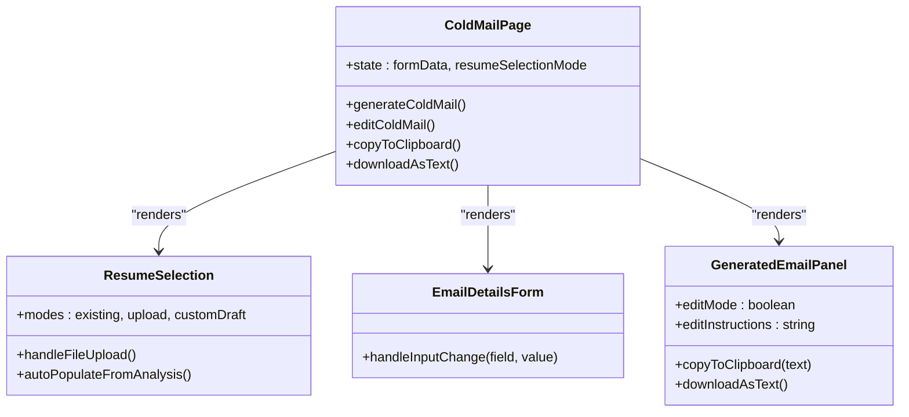
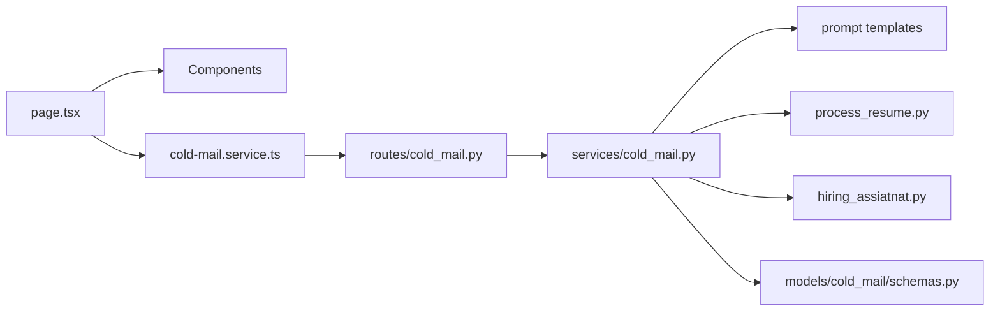

# Cold email generation

## Introduction
This page explains the Cold Email Generation system that creates AI-powered, personalized cold emails. It covers the end-to-end workflow from resume ingestion and optional company research to prompt-driven generation and iterative editing. The system supports dual input modes: file-based resume processing and text-based resume inputs. It integrates with company research data and recipient information to produce tailored content. The frontend provides a modern composition, preview, and editing interface with copy/download capabilities and guided editing instructions.

## Project structure
The system spans backend and frontend layers:
- Backend: FastAPI routes, service orchestration, prompt templates, and integrations for document processing and company research.
- Frontend: React components for composing inputs, selecting resumes, previewing generated emails, and editing with instructions.

```mermaid
graph TB
subgraph "Frontend"
FE_Page["Cold Mail Page<br/>page.tsx"]
FE_Resume["ResumeSelection.tsx"]
FE_EmailForm["EmailDetailsForm.tsx"]
FE_Generated["GeneratedEmailPanel.tsx"]
FE_Service["cold-mail.service.ts"]
FE_Types["cold-mail.ts"]
end
subgraph "Backend"
BE_Router["Routes: cold_mail.py"]
BE_Service["Services: cold_mail.py"]
BE_Prompts["Prompts: cold_mail_gen.py / cold_mail_editor.py"]
BE_Schemas["Schemas: cold_mail/schemas.py"]
BE_Process["Process Resume: process_resume.py"]
BE_Research["Company Research: hiring_assiatnat.py"]
end
FE_Page --> FE_Resume
FE_Page --> FE_EmailForm
FE_Page --> FE_Generated
FE_Page --> FE_Service
FE_Service --> FE_Types
FE_Service --> BE_Router
BE_Router --> BE_Service
BE_Service --> BE_Prompts
BE_Service --> BE_Process
BE_Service --> BE_Research
BE_Service --> BE_Schemas
```

## Core components
- Prompt Templates: Structured prompts define the cold email structure, tone, formatting, and personalization guidelines. Two templates are used: one for generation and another for editing.
- Route Layer: Exposes two dual-mode endpoints: file-based and text-based for both generation and editing.
- Service Layer: Orchestrates document processing, optional resume formatting, company research retrieval, and LLM invocation with reliable JSON extraction.
- Model Schemas: Strong typing for request/response contracts ensuring consistent data flow.
- Frontend Components: Modular UI for resume selection, recipient/company details, generated preview, and editing with instruction prompts.

## Architecture overview
The system follows a layered architecture:
- Frontend: Collects inputs, manages state, and invokes backend APIs.
- Backend Routes: Parse multipart/form-data and delegate to services.
- Services: Perform document processing, optional resume formatting, company research, and LLM orchestration.
- Prompts: Provide structured instructions and constraints to the LLM.
- Integrations: Optional company website scraping for research insights.

```mermaid
sequenceDiagram
participant User as "User"
participant FE as "Frontend Page"
participant API as "FastAPI Routes"
participant SVC as "Cold Mail Service"
participant PROC as "Process Resume"
participant RESEARCH as "Company Research"
participant LLM as "LLM"
User->>FE : Fill inputs and generate
FE->>API : POST /cold-mail/generator (multipart/form-data)
API->>SVC : cold_mail_generator_service(...)
SVC->>PROC : process_document(file_bytes, filename)
PROC-->>SVC : resume_text
SVC->>RESEARCH : get_company_research(company_name, company_url)
RESEARCH-->>SVC : research_text (optional)
SVC->>LLM : Invoke prompt chain with inputs
LLM-->>SVC : JSON {subject, body}
SVC-->>API : ColdMailResponse
API-->>FE : Response
FE-->>User : Preview and actions
```

## Detailed component analysis

### Prompt engineering and content structuring
- Generation Prompt: Defines a four-paragraph structure, subject constraints, tone, and formatting expectations. It injects resume, recipient, company, and optional research insights.
- Editing Prompt: Uses the previous email as a base and strictly follows user instructions to refine content while preserving personalization and relevance.

```mermaid
flowchart TD
Start(["Prompt Template"]) --> Inject["Inject Inputs:<br/>- resume_text<br/>- recipient_*<br/>- company_*<br/>- sender_*<br/>- company_research"]
Inject --> Structure["Apply Structure:<br/>- Subject (8–12 words)<br/>- 4 paragraphs max<br/>- Formatting rules"]
Structure --> Tone["Mirror example tone and clarity"]
Tone --> Output["Output JSON {subject, body}"]
```

### Dual-Mode operation: file-based vs text-based
- File-Based Mode:
  - Accepts multipart/form-data with a resume file and form fields.
  - Processes uploaded file into text, optionally formats with LLM for non-MD/Text files, validates resume content, and proceeds to generation/editing.
- Text-Based Mode:
  - Accepts resume_text directly via form fields.
  - Skips file processing and directly uses the provided text for generation/editing.

```mermaid
flowchart TD
Entry(["Input Received"]) --> Mode{"Mode?"}
Mode --> |File-Based| FileRead["Read UploadFile"]
FileRead --> Process["process_document(...)"]
Process --> Validate["is_valid_resume(resume_text)"]
Validate --> |Valid| Proceed["Proceed to Generation/Edit"]
Validate --> |Invalid| Error["HTTP 400 Error"]
Mode --> |Text-Based| TextIn["resume_text"]
TextIn --> Proceed
```

### Company research integration
- Optional company_url triggers retrieval of publicly accessible website content via an external service.
- The returned research text is injected into the prompt to personalize the email with company-specific insights.

```mermaid
sequenceDiagram
participant SVC as "Service"
participant RESEARCH as "get_company_research"
participant EXT as "External Research API"
SVC->>RESEARCH : company_name, company_url
RESEARCH->>EXT : GET https : //r.jina.ai/{url}
EXT-->>RESEARCH : HTML/Text content
RESEARCH-->>SVC : "Research about {company} : {content}"
```

### Editing functionality and instruction handling
- Users can refine generated emails by providing explicit edit instructions.
- The editing prompt uses the previous subject/body as a base and enforces strict adherence to user instructions while maintaining personalization.

```mermaid
sequenceDiagram
participant User as "User"
participant FE as "Frontend"
participant API as "Edit Endpoint"
participant SVC as "Service"
participant LLM as "LLM"
User->>FE : Enter edit instructions
FE->>API : POST /cold-mail/edit with previous subject/body + instructions
API->>SVC : cold_mail_editor_service(...)
SVC->>LLM : Invoke edit prompt with inputs
LLM-->>SVC : JSON {subject, body}
SVC-->>API : Response
API-->>FE : Updated email
FE-->>User : Preview refined email
```

### Frontend interfaces
- Resume Selection: Supports three modes, existing resume, upload new file, or custom draft editing, plus auto-fill from analysis data.
- Email Details Form: Captures recipient, company, sender, and optional company URL along with key points and additional context.
- Generated Email Panel: Displays subject and body, supports edit mode with instruction input, copy to clipboard, and download as text.

```mermaid
classDiagram
class ColdMailPage {
+state : formData, resumeSelectionMode
+generateColdMail()
+editColdMail()
+copyToClipboard()
+downloadAsText()
}
class ResumeSelection {
+modes : existing, upload, customDraft
+handleFileUpload()
+autoPopulateFromAnalysis()
}
class EmailDetailsForm {
+handleInputChange(field, value)
}
class GeneratedEmailPanel {
+editMode : boolean
+editInstructions : string
+copyToClipboard(text)
+downloadAsText()
}
ColdMailPage --> ResumeSelection : "renders"
ColdMailPage --> EmailDetailsForm : "renders"
ColdMailPage --> GeneratedEmailPanel : "renders"
```

## Dependency analysis
- Backend dependencies:
  - Routes depend on services for orchestration.
  - Services depend on prompt templates, document processing, and optional company research.
  - Schemas enforce request/response contracts.
- Frontend dependencies:
  - Page composes components and uses typed interfaces.
  - Service layer abstracts API calls.

```mermaid
graph LR
FE_Page["page.tsx"] --> FE_Components["Components"]
FE_Page --> FE_Service["cold-mail.service.ts"]
FE_Service --> BE_Router["routes/cold_mail.py"]
BE_Router --> BE_Service["services/cold_mail.py"]
BE_Service --> BE_Prompts["prompt templates"]
BE_Service --> BE_Process["process_resume.py"]
BE_Service --> BE_Research["hiring_assiatnat.py"]
BE_Service --> BE_Schemas["models/cold_mail/schemas.py"]
```

## Performance considerations
- Document processing overhead: PDF/DOC parsing and optional fallback conversion can be expensive; caching and limiting concurrent conversions helps.
- LLM invocation latency: Batch edits and reuse of formatted resume text reduce repeated processing.
- Frontend responsiveness: Debounce form inputs, lazy-load previews, and avoid unnecessary re-renders.
- External research: Rate-limit external API calls and cache results per company URL to minimize latency and cost.

## Troubleshooting guide
Common issues and resolutions:
- Unsupported file type or processing error:
  - Symptom: HTTP 400 with invalid file type.
  - Resolution: Ensure file extension is supported (.txt,.md,.pdf,.doc,.docx).
- Invalid resume format:
  - Symptom: HTTP 400 indicating invalid resume content.
  - Resolution: Verify resume contains expected sections or provide text-based input.
- LLM response parsing failures:
  - Symptom: JSON decode errors or missing JSON in response.
  - Resolution: Adjust prompt to enforce JSON output and validate response extraction logic.
- Company URL errors:
  - Symptom: Research fetch errors or empty content.
  - Resolution: Confirm URL validity and accessibility; consider rate limits and timeouts.

## Conclusion
The Cold Email Generation system combines structured prompts, reliable document processing, optional company research, and a flexible dual-mode input pipeline to produce highly personalized cold emails. The frontend offers an intuitive composition and editing experience, enabling users to refine content with precise instructions. By enforcing strong schemas, resilient LLM parsing, and modular components, the system balances power and usability for effective outreach.

## Appendices

### Successful cold email template structure
- Subject: 8–12 words, clear and engaging.
- Paragraph 1: Introduction, current status, goal, and rationale for the company.
- Paragraph 2: Relevant experience and skills with specific technologies or projects.
- Paragraph 3: Fit and value alignment with company work or values.
- Paragraph 4: Call to action and closing with gratitude.
- Formatting: Short subject, 4 paragraphs max, mention attachment.

### Personalization strategies
- Inject recipient and company details explicitly.
- Incorporate company research insights when available.
- Highlight key points from the resume aligned with the desired role.
- Mirror the example's clarity and flow to maintain readability.

### Optimization techniques
- Content Quality Assurance:
  - Enforce JSON output and extract valid JSON blocks.
  - Validate resume content and reject malformed inputs.
- Anti-Detection Measures:
  - Vary sentence structures and avoid repetitive phrasing.
  - Keep tone professional and avoid overly promotional language.
- Deliverability Optimization:
  - Keep subject concise and relevant.
  - Include a brief, professional signature and optional attachment note.
