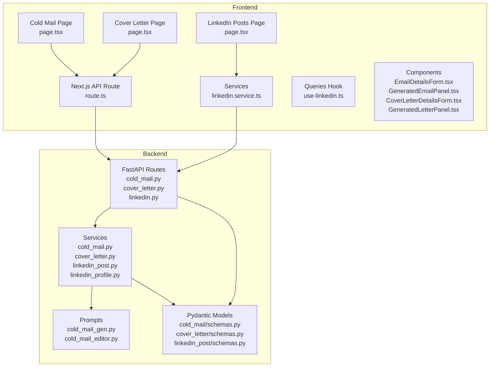
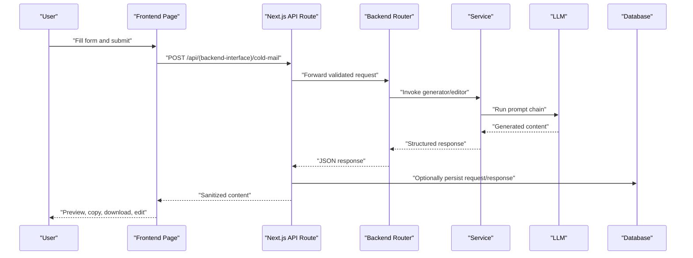
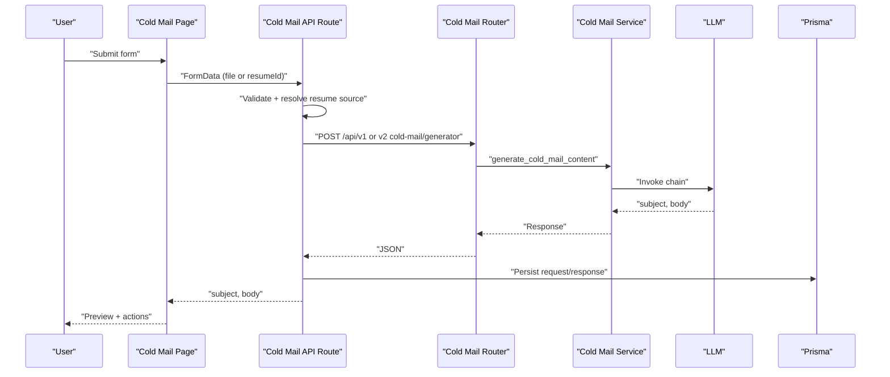
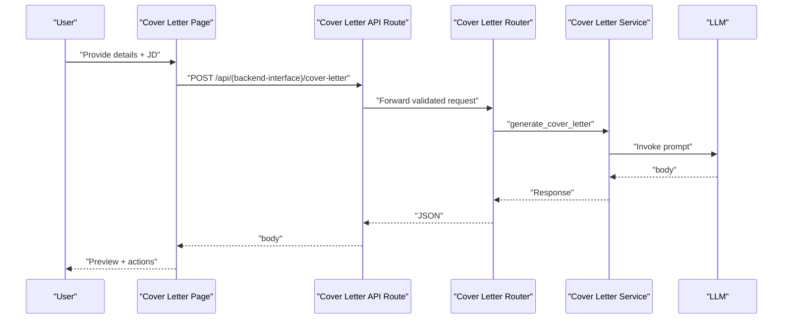
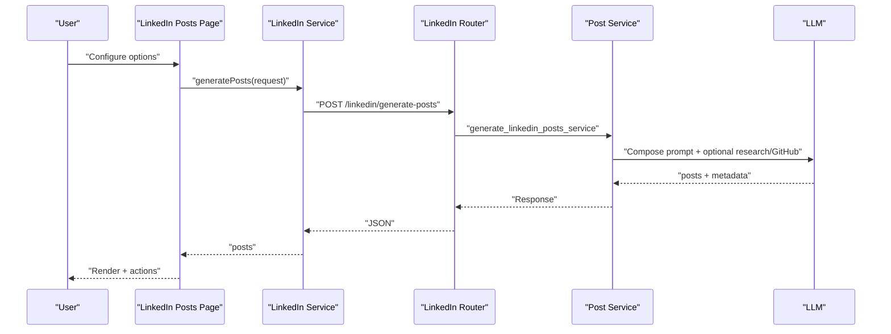
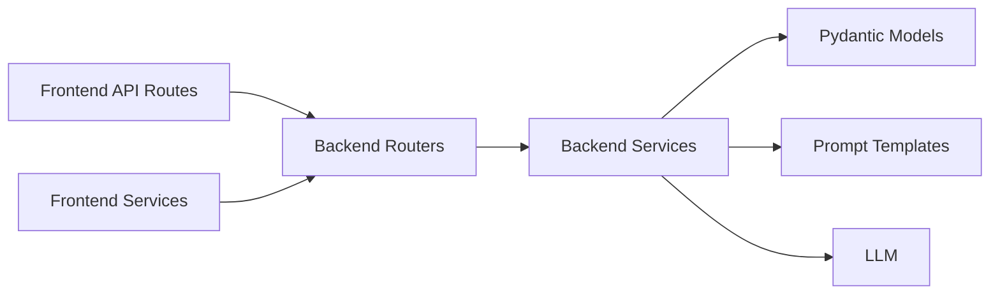

# Communication tools

## Introduction
This page describes the Communication Tools suite that powers AI-driven content generation for three primary use cases:
- Cold email generation for outbound prospecting
- Cover letter creation tailored to job descriptions
- LinkedIn post generation with optional research and GitHub insights

It explains the AI workflows, customization and personalization options, template systems, integration with job descriptions, editing interfaces, preview capabilities, export functionality, frontend components, and the data models for generated content, templates, and user preferences. It also covers quality assurance, plagiarism prevention, and brand consistency features.

## Project structure
The suite spans frontend Next.js pages and components, a TypeScript API route layer, and a FastAPI backend with LangChain prompts and services. The frontend integrates with backend endpoints via a typed API client and React Query hooks. Backend routes delegate to services that orchestrate LLM chains and optional external research.

```mermaid
graph TB
subgraph "Frontend"
FE_ColdMail["Cold Mail Page<br/>page.tsx"]
FE_Cover["Cover Letter Page<br/>page.tsx"]
FE_LinkedIn["LinkedIn Posts Page<br/>page.tsx"]
FE_API["Next.js API Route<br/>route.ts"]
FE_Svc["Services<br/>linkedin.service.ts"]
FE_Query["Queries Hook<br/>use-linkedin.ts"]
FE_Comps["Components<br/>EmailDetailsForm.tsx<br/>GeneratedEmailPanel.tsx<br/>CoverLetterDetailsForm.tsx<br/>GeneratedLetterPanel.tsx"]
end
subgraph "Backend"
BE_Routes["FastAPI Routes<br/>cold_mail.py<br/>cover_letter.py<br/>linkedin.py"]
BE_Services["Services<br/>cold_mail.py<br/>cover_letter.py<br/>linkedin_post.py<br/>linkedin_profile.py"]
BE_Prompts["Prompts<br/>cold_mail_gen.py<br/>cold_mail_editor.py"]
BE_Models["Pydantic Models<br/>cold_mail/schemas.py<br/>cover_letter/schemas.py<br/>linkedin_post/schemas.py"]
end
FE_ColdMail --> FE_API
FE_Cover --> FE_API
FE_LinkedIn --> FE_Svc
FE_API --> BE_Routes
FE_Svc --> BE_Routes
BE_Routes --> BE_Services
BE_Services --> BE_Prompts
BE_Routes --> BE_Models
BE_Services --> BE_Models
```

## Core components
- Cold Email Generator
  - Frontend: Details form, generated panel, copy/download actions, edit workflow
  - Backend: File/text-based endpoints, prompt templates, LLM orchestration, optional company research
- Cover Letter Generator
  - Frontend: JD URL or text input, personal details, key points, preview panel, copy/download actions
  - Backend: Job description resolution, prompt composition, LLM invocation, edit support
- LinkedIn Post Generator
  - Frontend: Topic, tone, audience, length, hashtags option, CTA, emoji level, GitHub project URL, research toggle, post cards with actions
  - Backend: Post generation, optional research, hashtag suggestion, GitHub insights, content calendar suggestions

## Architecture overview
The system follows a layered architecture:
- Frontend Next.js pages and components collect user inputs and render previews
- API routes validate, transform, and forward requests to backend endpoints
- Backend routes accept Pydantic models, invoke services, and use LangChain chains with LLMs
- Prompts define the instruction templates and structure for each communication type
- Responses are sanitized and optionally persisted for history/analytics

```mermaid
sequenceDiagram
participant U as "User"
participant FE as "Frontend Page"
participant API as "Next.js API Route"
participant BR as "Backend Router"
participant SVC as "Service"
participant LLM as "LLM"
participant DB as "Database"
U->>FE : "Fill form and submit"
FE->>API : "POST /api/(backend-interface)/cold-mail"
API->>BR : "Forward validated request"
BR->>SVC : "Invoke generator/editor"
SVC->>LLM : "Run prompt chain"
LLM-->>SVC : "Generated content"
SVC-->>BR : "Structured response"
BR-->>API : "JSON response"
API->>DB : "Optionally persist request/response"
API-->>FE : "Sanitized content"
FE-->>U : "Preview, copy, download, edit"
```

## Detailed component analysis

### Cold email generator
- Workflow
  - User selects a resume (file or stored text) and fills recipient/company/personal details and key points
  - Frontend sends a multipart/form-data request to the Next.js API route
  - API route validates inputs, resolves resume source, forwards to backend v1 or v2 endpoint
  - Backend invokes the cold email generator service, which builds a prompt chain and returns subject/body
  - API route sanitizes output, optionally stores request/response, and returns JSON
  - Frontend renders preview, supports copy to clipboard and download as text, and enables editing
- Editing
  - Frontend captures edit instructions and sends them to the backend editor endpoint
  - Backend uses a dedicated edit prompt template to refine the previous email per user instructions
- Templates and Personalization
  - Prompt template defines structure, word limits, and style guidance
  - Inputs include resume text, recipient/company details, sender role/goal, key points, and optional company URL/research
- Export and Sharing
  - Copy to clipboard and download as text file
  - Optional database persistence of request/response for history

```mermaid
sequenceDiagram
participant U as "User"
participant FE as "Cold Mail Page"
participant API as "Cold Mail API Route"
participant BR as "Cold Mail Router"
participant SVC as "Cold Mail Service"
participant LLM as "LLM"
participant DB as "Prisma"
U->>FE : "Submit form"
FE->>API : "FormData (file or resumeId)"
API->>API : "Validate + resolve resume source"
API->>BR : "POST /api/v1 or v2 cold-mail/generator"
BR->>SVC : "generate_cold_mail_content"
SVC->>LLM : "Invoke chain"
LLM-->>SVC : "subject, body"
SVC-->>BR : "Response"
BR-->>API : "JSON"
API->>DB : "Persist request/response"
API-->>FE : "subject, body"
FE-->>U : "Preview + actions"
```

### Cover letter creator
- Workflow
  - User provides personal details, job description (URL or text), optional recipient/company, key points, and additional context
  - Frontend sends a request to the Next.js API route for generation
  - API route validates inputs, calls backend route, and returns sanitized content
  - Backend resolves job description (URL or raw text), composes prompt, invokes LLM, and returns body
  - Frontend renders preview, supports copy and download
- Editing
  - Frontend captures edit instructions and sends them to the backend edit endpoint
  - Backend composes an edit prompt using the previous cover letter and user instructions
- Integration with Job Descriptions
  - Supports URL-based or text-based job descriptions
  - Resolves and weaves keywords and requirements into the generated content

```mermaid
sequenceDiagram
participant U as "User"
participant FE as "Cover Letter Page"
participant API as "Cover Letter API Route"
participant BR as "Cover Letter Router"
participant SVC as "Cover Letter Service"
participant LLM as "LLM"
U->>FE : "Provide details + JD"
FE->>API : "POST /api/(backend-interface)/cover-letter"
API->>BR : "Forward validated request"
BR->>SVC : "generate_cover_letter"
SVC->>LLM : "Invoke prompt"
LLM-->>SVC : "body"
SVC-->>BR : "Response"
BR-->>API : "JSON"
API-->>FE : "body"
FE-->>U : "Preview + actions"
```

### LinkedIn post generator
- Workflow
  - User sets topic, tone, audience, length, hashtags option, CTA, emoji level, GitHub project URL, and toggles research
  - Frontend calls the linkedin service hook, which posts to the backend route
  - Backend generates posts with optional research insights and GitHub analysis, suggests hashtags, and returns structured content
  - Frontend renders posts with copy/download actions and optional edit instructions
- Research and Insights
  - Optional web research for topic insights
  - GitHub project analysis for technical highlights and LinkedIn hooks
- Template System
  - Prompt enforces content length guidance, tone, audience, and emoji level
  - Outputs clean post text and optional metadata

```mermaid
sequenceDiagram
participant U as "User"
participant FE as "LinkedIn Posts Page"
participant SVC as "LinkedIn Service"
participant BR as "LinkedIn Router"
participant POST as "Post Service"
participant LLM as "LLM"
U->>FE : "Configure options"
FE->>SVC : "generatePosts(request)"
SVC->>BR : "POST /linkedin/generate-posts"
BR->>POST : "generate_linkedin_posts_service"
POST->>LLM : "Compose prompt + optional research/GitHub"
LLM-->>POST : "posts + metadata"
POST-->>BR : "Response"
BR-->>SVC : "JSON"
SVC-->>FE : "posts"
FE-->>U : "Render + actions"
```

## Dependency analysis
- Frontend depends on:
  - Next.js API routes for cold mail and cover letter
  - Services for LinkedIn post generation
  - React Query hooks for mutations
  - UI components for forms and panels
- Backend depends on:
  - LangChain prompt templates and chains
  - Pydantic models for request/response validation
  - LLM dependencies injected via DI
  - Optional external research and GitHub analysis

```mermaid
graph LR
FE_API["Frontend API Routes"] --> BE_ROUTES["Backend Routers"]
FE_SVC["Frontend Services"] --> BE_ROUTES
BE_ROUTES --> BE_SERVICES["Backend Services"]
BE_SERVICES --> BE_MODELS["Pydantic Models"]
BE_SERVICES --> BE_PROMPTS["Prompt Templates"]
BE_SERVICES --> LLM["LLM"]
```

## Performance considerations
- Timeouts and retries
  - Frontend API routes enforce long timeouts for LLM-heavy operations
  - Backend routes depend on LLM availability and may surface connection errors
- Streaming and latency
  - Current implementation returns complete responses; streaming could improve perceived performance
- Prompt size and token limits
  - Resume and job description inputs are included; consider truncation or summarization for very long inputs
- Caching and reuse
  - Reusing previously generated content (e.g., cover letters) can reduce repeated LLM calls

[No sources needed since this section provides general guidance]

## Troubleshooting guide
- Authentication failures
  - API routes require a valid session; ensure user is logged in
- Validation errors
  - Missing required fields trigger validation failures; ensure recipient/company/sender details are provided
- Resume source issues
  - Either upload a file or select an existing resume; avoid both or neither
  - Existing resume must belong to the user or be accessible by role
- Backend connectivity
  - Network errors, timeouts, or service unavailability are surfaced with user-friendly messages
- Non-JSON responses
  - If backend returns non-JSON, the API route returns a standardized error response
- Database persistence
  - Request/response persistence is best-effort; failures are logged but do not block response delivery

## Conclusion
The Communication Tools suite provides reliable, AI-powered workflows for cold email generation, cover letter creation, and LinkedIn post generation. It balances flexibility with strong defaults, integrates smoothly with job descriptions and optional research, and offers editing, preview, and export capabilities. The layered architecture ensures maintainability, while prompt templates and Pydantic models enforce quality and consistency across generated content.
